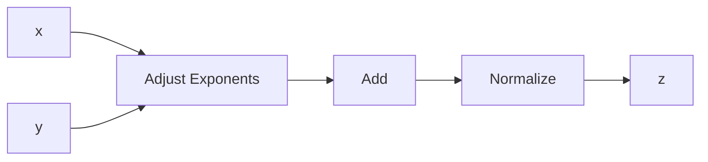
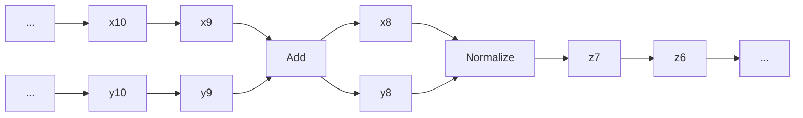
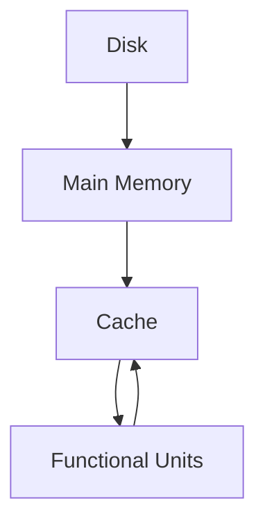
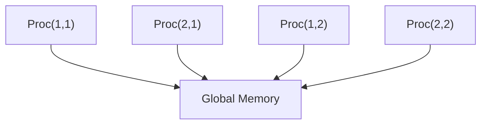
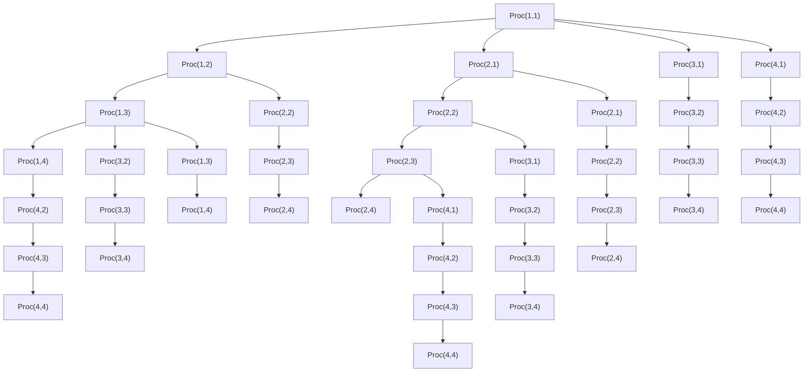

# Chapter 1

# Matrix Multiplication

1.1 Basic Algorithms and Notation   
1.2 Structure and Efficiency   
1.3 Block Matrices and Algorithms   
1.4 Fast Matrix-Vector Products   
1.5 Vectorization and Locality   
1.6 Parallel Matrix Multiplication

The study of matrix computations properly begins with the study of various matrix multiplication problems. Although simple mathematically, these calculations are sufficiently rich to develop a wide range of essential algorithmic skills.

In §1.1 we examine several formulations of the matrix multiplication update problem $C = C + A B$ . Partitioned matrices are introduced and used to identify linear algebraic “levels” of computation.

If a matrix has special properties, then various economies are generally possible. For example, a symmetric matrix can be stored in half the space of a general matrix. A matrix-vector product may require much less time to execute if the matrix has many zero entries. These matters are considered in §1.2.

A block matrix is a matrix whose entries are themselves matrices. The “language” of block matrices is developed in §1.3. It supports the easy derivation of matrix factorizations by enabling us to spot patterns in a computation that are obscured at the scalar level. Algorithms phrased at the block level are typically rich in matrixmatrix multiplication, the operation of choice in many high-performance computing environments. Sometimes the block structure of a matrix is recursive, meaning that the block entries have an exploitable resemblance to the overall matrix. This type of connection is the foundation for “fast” matrix-vector product algorithms such as various fast Fourier transforms, trigonometric transforms, and wavelet transforms. These calculations are among the most important in all of scientific computing and are discussed in §1.4. They provide an excellent opportunity to develop a facility with block matrices and recursion.

The last two sections set the stage for effective, “large-n” matrix computations. In this context, data locality affects efficiency more than the volume of actual arithmetic. Having an ability to reason about memory hierarchies and multiprocessor computation is essential. Our goal in §1.5 and §1.6 is to build an appreciation for the attendant issues without getting into system-dependent details.

# Reading Notes

The sections within this chapter depend upon each other as follows:

$$
\begin{array}{c c c c c c c c} \S 1. 1 & \to & \S 1. 2 & \to & \S 1. 3 & \to & \S 1. 4 \\ & & & & \downarrow & & \\ & & & & \S 1. 5 & \to & \S 1. 6 \end{array}
$$

Before proceeding to later chapters, §1.1, §1.2, and §1.3 are essential. The fast transform ideas in §1.4 are utilized in §4.8 and parts of Chapters 11 and 12. The reading of §1.5 and §1.6 can be deferred until high-performance linear equation solving or eigenvalue computation becomes a topic of concern.

# 1.1 Basic Algorithms and Notation

Matrix computations are built upon a hierarchy of linear algebraic operations. Dot products involve the scalar operations of addition and multiplication. Matrix-vector multiplication is made up of dot products. Matrix-matrix multiplication amounts to a collection of matrix-vector products. All of these operations can be described in algorithmic form or in the language of linear algebra. One of our goals is to show how these two styles of expression complement each other. Along the way we pick up notation and acquaint the reader with the kind of thinking that underpins the matrix computation area. The discussion revolves around the matrix multiplication problem, a computation that can be organized in several ways.

# 1.1.1 Matrix Notation

Let IR designate the set of real numbers. We denote the vector space of all m-by-n real matrices by IRm×n: $\mathbb { R } ^ { m \times n }$

$$
A \in \mathbb {R} ^ {m \times n} \quad \Longleftrightarrow \quad A = (a _ {i j}) = \left[ \begin{array}{c c c} a _ {1 1} & \dots & a _ {1 n} \\ \vdots & & \vdots \\ a _ {m 1} & \dots & a _ {m n} \end{array} \right], \quad a _ {i j} \in \mathbb {R}
$$

If a capital letter is used to denote a matrix $( \mathrm { e . g . } , A , B , \Delta )$ , then the corresponding lower case letter with subscript ij refers to the (i, j) entry $( \mathrm { e . g . } , a _ { i j } , b _ { i j } , \delta _ { i j } )$ . Sometimes we designate the elements of a matrix with the notation $[ A ] _ { i j }$ or $A ( i , j )$ .

# 1.1.2 Matrix Operations

Basic matrix operations include transposition $( \mathbb { R } ^ { m \times n } \to \mathbb { R } ^ { n \times m } )$ ,

$$
C = A ^ {T} \quad \Longrightarrow \quad c _ {i j} = a _ {j i},
$$

addition $( \mathbb { R } ^ { m \times n } \times \mathbb { R } ^ { m \times n }  \mathbb { R } ^ { m \times n } )$ ,

$$
C = A + B \quad \Longrightarrow \quad c _ {i j} = a _ {i j} + b _ {i j},
$$

scalar-matrix multiplication $( \mathbb { R } \times \mathbb { R } ^ { m \times n }  \mathbb { R } ^ { m \times n } )$ ,

$$
C = \alpha A \quad \Longrightarrow \quad c _ {i j} = \alpha a _ {i j},
$$

and matrix-matrix multiplication $( \mathbb { R } ^ { m \times p } \times \mathbb { R } ^ { p \times n } \to \mathbb { R } ^ { m \times n } )$ ,

$$
C = A B \quad \Longrightarrow \quad c _ {i j} = \sum_ {k = 1} ^ {p} a _ {i k} b _ {k j}.
$$

Pointwise matrix operations are occasionally useful, especially pointwise multiplication $( \mathbb { R } ^ { m \times n } \times \mathbb { R } ^ { m \times n }  \mathbb { R } ^ { m \times n } )$ ,

$$
C = A. * B \quad \Longrightarrow \quad c _ {i j} = a _ {i j} b _ {i j}
$$

and pointwise division $( \mathbb { R } ^ { m \times n } \times \mathbb { R } ^ { m \times n }  \mathbb { R } ^ { m \times n } )$ ,

$$
C = A. / B \quad \Longrightarrow \quad c _ {i j} = a _ {i j} / b _ {i j}.
$$

Of course, for pointwise division to make sense, the “denominator matrix” must have nonzero entries.

# 1.1.3 Vector Notation

Let $\mathbb { R } ^ { n }$ denote the vector space of real n-vectors:

$$
x \in \mathbb {R} ^ {n} \qquad \Longleftrightarrow \qquad x = \left[ \begin{array}{c} x _ {1} \\ \vdots \\ x _ {n} \end{array} \right] \quad x _ {i} \in \mathbb {R}  .
$$

We refer to $x _ { i }$ as the ith component of x. Depending upon context, the alternative notations $[ x ] _ { i }$ and $x ( i )$ are sometimes used.

Notice that we are identifying $\mathbb { R } ^ { n }$ with $\mathbb { R } ^ { n \times 1 }$ and so the members of $\mathbb { R } ^ { n }$ are column vectors. On the other hand, the elements of $\mathbb { R } ^ { 1 \times n }$ are row vectors:

$$
x \in \mathbb {R} ^ {1 \times n} \quad \Longleftrightarrow \quad x = [ x _ {1}, \dots , x _ {n} ].
$$

If x is a column vector, then $y = x ^ { T }$ is a row vector.

# 1.1.4 Vector Operations

Assume that $a \in \mathbb { R } , x \in \mathbb { R } ^ { n }$ , and $\boldsymbol { y } \in \mathbb { R } ^ { n }$ . Basic vector operations include scalar-vector multiplication,

$$
z = a x \quad \Longrightarrow \quad z _ {i} = a x _ {i},
$$

vector addition,

$$
z = x + y \quad \Longrightarrow \quad z _ {i} = x _ {i} + y _ {i},
$$

and the inner product (or dot product),

$$
c = x ^ {T} y \quad \Longrightarrow \quad c = \sum_ {i = 1} ^ {n} x _ {i} y _ {i}.
$$

A particularly important operation, which we write in update form, is the saxpy:

$$
y = a x + y \quad \Longrightarrow \quad y _ {i} = a x _ {i} + y _ {i}
$$

Here, the symbol “=” is used to denote assignment, not mathematical equality. The vector y is being updated. The name “saxpy” is used in LAPACK, a software package that implements many of the algorithms in this book. “Saxpy” is a mnemonic for “scalar a x plus y.” See LAPACK.

Pointwise vector operations are also useful, including vector multiplication,

$$
z = x. * y \quad \Longrightarrow \quad z _ {i} = x _ {i} y _ {i},
$$

and vector division,

$$
z = x. / y \quad \Longrightarrow \quad z _ {i} = x _ {i} / y _ {i}.
$$

# 1.1.5 The Computation of Dot Products and Saxpys

Algorithms in the text are expressed using a stylized version of the Matlab language. Here is our first example:

Algorithm 1.1.1 (Dot Product) If x, $\boldsymbol { y } \in \mathbb { R } ^ { n }$ , then this algorithm computes their dot product $c = x ^ { T } y$ .

$$
\begin{array}{l} c = 0 \\ \text { for } i = 1: n \\ c = c + x (i) y (i) \\ \end{array}
$$

It is clear from the summation that the dot product of two n-vectors involves n multiplications and n additions. The dot product operation is an $^ { \mathfrak { o } ( n ) \mathfrak { n } }$ operation, meaning that the amount of work scales linearly with the dimension. The saxpy computation is also $O ( n )$ :

Algorithm 1.1.2 (Saxpy) If $x , y \in \mathbb { R } ^ { n }$ and $a \in \mathbb { R }$ , then this algorithm overwrites y with $y + a x$ .

$$
\text { for } i = 1: n
$$

$$
y (i) = y (i) + a x (i)
$$

end

We stress that the algorithms in this book are encapsulations of important computational ideas and are not to be regarded as “production codes.”

# 1.1.6 Matrix-Vector Multiplication and the Gaxpy

Suppose $A \in \mathbb { R } ^ { m \times n }$ and that we wish to compute the update

$$
y = y + A x
$$

where $\boldsymbol { x } \in \mathbb { R } ^ { n }$ and $\boldsymbol { y } \in \mathbb { R } ^ { m }$ are given. This generalized saxpy operation is referred to as a gaxpy. A standard way that this computation proceeds is to update the components one-at-a-time:

$$
y _ {i} = y _ {i} + \sum_ {j = 1} ^ {n} a _ {i j} x _ {j}, \quad i = 1: m.
$$

This gives the following algorithm:

Algorithm 1.1.3 (Row-Oriented Gaxpy) If $A \in \mathbb { R } ^ { m \times n } , x \in \mathbb { R } ^ { n }$ , and $\boldsymbol { y } \in \mathbb { R } ^ { m }$ , then this algorithm overwrites y with Ax + y.

for i = 1:m
    for j = 1:n
    y(i) = y(i) + A(i, j)x(j)
    end
end

Note that this involves O(mn) work. If each dimension of A is doubled, then the amount of arithmetic increases by a factor of 4.

An alternative algorithm results if we regard Ax as a linear combination of A’s columns, e.g.,

$$
\left[ \begin{array}{l l} 1 & 2 \\ 3 & 4 \\ 5 & 6 \end{array} \right] \left[ \begin{array}{l} 7 \\ 8 \end{array} \right] = \left[ \begin{array}{l} 1 \cdot 7 + 2 \cdot 8 \\ 3 \cdot 7 + 4 \cdot 8 \\ 5 \cdot 7 + 6 \cdot 8 \end{array} \right] = 7 \left[ \begin{array}{l} 1 \\ 3 \\ 5 \end{array} \right] + 8 \left[ \begin{array}{l} 2 \\ 4 \\ 6 \end{array} \right] = \left[ \begin{array}{l} 2 3 \\ 5 3 \\ 8 3 \end{array} \right].
$$

Algorithm 1.1.4 (Column-Oriented Gaxpy) If $A \in \mathbb { R } ^ { m \times n } , x \in \mathbb { R } ^ { n }$ , and $\boldsymbol { y } \in \mathbb { R } ^ { m }$ , then this algorithm overwrites y with Ax + y.

for $j = 1:n$ for $i = 1:m$ $y(i) = y(i) + A(i,j)\cdot x(j)$ end   
end

Note that the inner loop in either gaxpy algorithm carries out a saxpy operation. The column version is derived by rethinking what matrix-vector multiplication “means” at the vector level, but it could also have been obtained simply by interchanging the order of the loops in the row version.

# 1.1.7 Partitioning a Matrix into Rows and Columns

Algorithms 1.1.3 and 1.1.4 access the data in A by row and by column, respectively. To highlight these orientations more clearly, we introduce the idea of a partitioned matrix.

From one point of view, a matrix is a stack of row vectors:

$$
A \in \mathbb {R} ^ {m \times n} \quad \Longleftrightarrow \quad A = \left[ \begin{array}{c} r _ {1} ^ {T} \\ \vdots \\ r _ {m} ^ {T} \end{array} \right], \quad r _ {k} \in \mathbb {R} ^ {n}. \tag {1.1.1}
$$

This is called a row partition of A. Thus, if we row partition

$$
\left[ \begin{array}{l l} 1 & 2 \\ 3 & 4 \\ 5 & 6 \end{array} \right],
$$

then we are choosing to think of A as a collection of rows with

$$
r _ {1} ^ {T} = \left[ \begin{array}{c c} 1 & 2 \end{array} \right], \qquad r _ {2} ^ {T} = \left[ \begin{array}{c c} 3 & 4 \end{array} \right], \qquad r _ {3} ^ {T} = \left[ \begin{array}{c c} 5 & 6 \end{array} \right].
$$

With the row partitioning (1.1.1), Algorithm 1.1.3 can be expressed as follows:

$$
\begin{array}{l} \text { for } i = 1: m \\ y _ {i} = y _ {i} + r _ {i} ^ {T} x \\ \end{array}
$$

Alternatively, a matrix is a collection of column vectors:

$$
A \in \mathbb {R} ^ {m \times n} \quad \Longleftrightarrow \quad A = \left[ c _ {1} \mid \dots \mid c _ {n} \right], \quad c _ {k} \in \mathbb {R} ^ {m}. \tag {1.1.2}
$$

We refer to this as a column partition of A. In the 3-by-2 example above, we thus would set c1 and c2 to be the first and second columns of A, respectively:

$$
c _ {1} = \left[ \begin{array}{l} 1 \\ 3 \\ 5 \end{array} \right], \qquad c _ {2} = \left[ \begin{array}{l} 2 \\ 4 \\ 6 \end{array} \right].
$$

With (1.1.2) we see that Algorithm 1.1.4 is a saxpy procedure that accesses A by columns:

$$
\text { for } j = 1: n
$$

$$
y = y + x _ {j} c _ {j}
$$

end

In this formulation, we appreciate y as a running vector sum that undergoes repeated saxpy updates.

# 1.1.8 The Colon Notation

A handy way to specify a column or row of a matrix is with the “colon” notation. If $A \in \mathbb { R } ^ { m \times n }$ , then $A ( k , : )$ designates the kth row, i.e.,

$$
A (k,:) = [ a _ {k 1}, \dots , a _ {k n} ].
$$

The kth column is specified by

$$
A (:, k) = \left[ \begin{array}{c} a _ {1 k} \\ \vdots \\ a _ {m k} \end{array} \right].
$$

With these conventions we can rewrite Algorithms 1.1.3 and 1.1.4 as

for i = 1:m

$$
y (i) = y (i) + A (i,:) \cdot x
$$

end

and

for j = 1:n

$$
y = y + x (j) \cdot A (:, j)
$$

end

respectively. By using the colon notation, we are able to suppress inner loop details and encourage vector-level thinking.

# 1.1.9 The Outer Product Update

As a preliminary application of the colon notation, we use it to understand the outer product update

$$
A = A + x y ^ {T}, \qquad A \in \mathbb {R} ^ {m \times n}, x \in \mathbb {R} ^ {m}, y \in \mathbb {R} ^ {n}.
$$

The outer product operation xyT “looks funny” but is perfectly legal, e.g.,

$$
\left[ \begin{array}{l} 1 \\ 2 \\ 3 \end{array} \right] \left[ \begin{array}{l l} 4 & 5 \end{array} \right] = \left[ \begin{array}{l l} 4 & 5 \\ 8 & 1 0 \\ 1 2 & 1 5 \end{array} \right].
$$

This is because xyT is the product of two “skinny” matrices and the number of columns in the left matrix x equals the number of rows in the right matrix yT . The entries in the outer product update are prescribed by

for i = 1:m

for j = 1:n

$$
a _ {i j} = a _ {i j} + x _ {i} y _ {j}
$$

end

end

This involves O(mn) arithmetic operations. The mission of the j loop is to add a multiple of yT to the ith row of A, i.e.,

for i = 1:m

$$
A (i,:) = A (i,:) + x (i) \cdot y ^ {T}
$$

end

On the other hand, if we make the i-loop the inner loop, then its task is to add a multiple of x to the jth column of A:

$$
\begin{array}{l} \text { for } j = 1: n \\ A (:, j) = A (:, j) + y (j) \cdot x \\ \end{array}
$$

Note that both implementations amount to a set of saxpy computations.

# 1.1.10 Matrix-Matrix Multiplication

Consider the 2-by-2 matrix-matrix multiplication problem. In the dot product formulation, each entry is computed as a dot product:

$$
\left[ \begin{array}{c c} 1 & 2 \\ 3 & 4 \end{array} \right] \left[ \begin{array}{c c} 5 & 6 \\ 7 & 8 \end{array} \right] = \left[ \begin{array}{c c} 1 \cdot 5 + 2 \cdot 7 & 1 \cdot 6 + 2 \cdot 8 \\ 3 \cdot 5 + 4 \cdot 7 & 3 \cdot 6 + 4 \cdot 8 \end{array} \right].
$$

In the saxpy version, each column in the product is regarded as a linear combination of left-matrix columns:

$$
\left[ \begin{array}{c c} 1 & 2 \\ 3 & 4 \end{array} \right] \left[ \begin{array}{c c} 5 & 6 \\ 7 & 8 \end{array} \right] = \left[ \begin{array}{c} 5 \left[ \begin{array}{c} 1 \\ 3 \end{array} \right] + 7 \left[ \begin{array}{c} 2 \\ 4 \end{array} \right], \quad 6 \left[ \begin{array}{c} 1 \\ 3 \end{array} \right] + 8 \left[ \begin{array}{c} 2 \\ 4 \end{array} \right] \end{array} \right].
$$

Finally, in the outer product version, the result is regarded as the sum of outer products:

$$
\left[ \begin{array}{l l} 1 & 2 \\ 3 & 4 \end{array} \right] \left[ \begin{array}{l l} 5 & 6 \\ 7 & 8 \end{array} \right] = \left[ \begin{array}{l} 1 \\ 3 \end{array} \right] \left[ \begin{array}{l l} 5 & 6 \end{array} \right] + \left[ \begin{array}{l} 2 \\ 4 \end{array} \right] \left[ \begin{array}{l l} 7 & 8 \end{array} \right].
$$

Although equivalent mathematically, it turns out that these versions of matrix multiplication can have very different levels of performance because of their memory traffic properties. This matter is pursued in §1.5. For now, it is worth detailing the various approaches to matrix multiplication because it gives us a chance to review notation and to practice thinking at different linear algebraic levels. To fix the discussion, we focus on the matrix-matrix update computation:

$$
C = C + A B, \qquad C \in \mathbb {R} ^ {m \times n}, A \in \mathbb {R} ^ {m \times r}, B \in \mathbb {R} ^ {r \times n}.
$$

The update $C = C + A B$ is considered instead of just C = AB because it is the more typical situation in practice.

# 1.1.11 Scalar-Level Specifications

The starting point is the familiar triply nested loop algorithm:

Algorithm 1.1.5 (ijk Matrix Multiplication) If $A \in \mathbb { R } ^ { m \times r } , B \in \mathbb { R } ^ { r \times n }$ , and $C \in \mathbb { R } ^ { m \times n }$ are given, then this algorithm overwrites C with $C + A B$ .

$$
\begin{array}{l} \text { for } i = 1: m \\ \text { for } j = 1: n \\ \text { for } k = 1: r \\ C (i, j) = C (i, j) + A (i, k) \cdot B (k, j) \\ \begin{array}{c} \text {end} \\ \text {end} \\ \text {end} \end{array} \\ \end{array}
$$

This computation involves O(mnr) arithmetic. If the dimensions are doubled, then work increases by a factor of 8.

Each loop index in Algorithm 1.1.5 has a particular role. (The subscript i names the row, j names the column, and k handles the dot product.) Nevertheless, the ordering of the loops is arbitrary. Here is the (mathematically equivalent) jki variant:

for $j = 1:n$ for $k = 1:r$ for $i = 1:m$ $C(i,j) = C(i,j) + A(i,k)B(k,j)$ end  
    end  
end

Altogether, there are six (= 3!) possibilities:

$$
i j k, \quad j i k, \quad i k j, \quad j k i, \quad k i j, \quad k j i.
$$

Each features an inner loop operation (dot product or saxpy) and each has its own pattern of data flow. For example, in the ijk variant, the inner loop oversees a dot product that requires access to a row of A and a column of B. The jki variant involves a saxpy that requires access to a column of C and a column of A. These attributes are summarized in Table 1.1.1 together with an interpretation of what is going on when

<table><tr><td>Loop Order</td><td>Inner Loop</td><td>Inner Two Loops</td><td>Inner Loop Data Access</td></tr><tr><td>ijk</td><td>dot</td><td>vector × matrix</td><td>A by row, B by column</td></tr><tr><td>jik</td><td>dot</td><td>matrix × vector</td><td>A by row, B by column</td></tr><tr><td>ikj</td><td>saxpy</td><td>row gaxpy</td><td>B by row, C by row</td></tr><tr><td>jki</td><td>saxpy</td><td>column gaxpy</td><td>A by column, C by column</td></tr><tr><td>kij</td><td>saxpy</td><td>row outer product</td><td>B by row, C by row</td></tr><tr><td>kji</td><td>saxpy</td><td>column outer product</td><td>A by column, C by column</td></tr></table>

Table 1.1.1. Matrix multiplication: loop orderings and properties

the middle and inner loops are considered together. Each variant involves the same amount of arithmetic, but accesses the A, B, and C data differently. The ramifications of this are discussed in §1.5.

# 1.1.12 A Dot Product Formulation

The usual matrix multiplication procedure regards A·B as an array of dot products to be computed one at a time in left-to-right, top-to-bottom order. This is the idea behind Algorithm 1.1.5 which we rewrite using the colon notation to highlight the mission of the innermost loop:

Algorithm 1.1.6 (Dot Product Matrix Multiplication) If $A \in \mathbb { R } ^ { m \times r } , B \in \mathbb { R } ^ { r \times n }$ , and $C \in \mathbb { R } ^ { m \times n }$ are given, then this algorithm overwrites C with $C + A B$ .

for i = 1:m
    for j = 1:n $C(i,j) = C(i,j) + A(i,:) \cdot B(:,j)$ end
end

In the language of partitioned matrices, if

$$
A = \left[ \begin{array}{c} a _ {1} ^ {T} \\ \vdots \\ a _ {m} ^ {T} \end{array} \right] \qquad \text { and } \qquad B = \left[ b _ {1} \mid \dots \mid b _ {n} \right],
$$

then Algorithm 1.1.6 has this interpretation:

for $i = 1:m$ for $j = 1:n$ $c_{ij} = c_{ij} + a_i^T b_j$ end   
end

Note that the purpose of the j-loop is to compute the ith row of the update. To emphasize this we could write

for $i = 1:m$ $c_{i}^{T} = c_{i}^{T} + a_{i}^{T}B$ end

where

$$
C = \left[ \begin{array}{c} c _ {1} ^ {T} \\ \vdots \\ c _ {m} ^ {T} \end{array} \right]
$$

is a row partitioning of C. To say the same thing with the colon notation we write

for i = 1:m $C(i,:) = C(i,:) + A(i,:) \cdot B$ end

Either way we see that the inner two loops of the ijk variant define a transposed gaxpy operation.

# 1.1.13 A Saxpy Formulation

Suppose A and C are column-partitioned as follows:

$$
A = \left[ a _ {1} \mid \dots \mid a _ {r} \right], \quad C = \left[ c _ {1} \mid \dots \mid c _ {n} \right].
$$

By comparing jth columns in $C = C + A B$ we see that

$$
c _ {j} = c _ {j} + \sum_ {k = 1} ^ {r} a _ {k} b _ {k j}, \quad j = 1: n.
$$

These vector sums can be put together with a sequence of saxpy updates.

Algorithm 1.1.7 (Saxpy Matrix Multiplication) If the matrices $A \in \mathbb { R } ^ { m \times r } , B \in \mathbb { R } ^ { r \times n }$ , and $\boldsymbol { C } \in \mathbb { R } ^ { m \times n }$ are given, then this algorithm overwrites C with $C + A B$ .

for $j = 1:n$ for $k = 1:r$ $C(:,j) = C(:,j) + A(:,k) \cdot B(k,j)$ end  
end

Note that the k-loop oversees a gaxpy operation:

for $j = 1:n$ $C(:,j) = C(:,j) + AB(:,j)$ end

# 1.1.14 An Outer Product Formulation

Consider the kij variant of Algorithm 1.1.5:

```matlab
for k = 1:r
    for j = 1:n
    for i = 1:m
    C(i, j) = C(i, j) + A(i, k)·B(k, j)
    end
    end
end 
```

The inner two loops oversee the outer product update

$$
C = C + a _ {k} b _ {k} ^ {T}
$$

where

$$
A = \left[ a _ {1} \mid \dots \mid a _ {r} \right] \quad \text { and } \quad B = \left[ \begin{array}{c} b _ {1} ^ {T} \\ \vdots \\ b _ {r} ^ {T} \end{array} \right] \tag {1.1.3}
$$

with $a _ { k } \in \mathbb { R } ^ { m }$ and $b _ { k } \in \mathbb { R } ^ { n }$ . This renders the following implementation:

Algorithm 1.1.8 (Outer Product Matrix Multiplication) If the matrices $A \in \mathbb { R } ^ { m \times r }$ , $B \in \mathbb { R } ^ { r \times n }$ , and $\dot { C } \in \mathbb { R } ^ { m \times n }$ are given, then this algorithm overwrites C with $C + A B$ .

for $k = 1:r$ $C = C + A(:,k) \cdot B(k,:)$ end

Matrix-matrix multiplication is a sum of outer products.

# 1.1.15 Flops

One way to quantify the volume of work associated with a computation is to count flops. A flop is a floating point add, subtract, multiply, or divide. The number of flops in a given matrix computation is usually obtained by summing the amount of arithmetic associated with the most deeply nested statements. For matrix-matrix multiplication, e.g., Algorithm 1.1.5, this is the 2-flop statement

$$
C (i, j) = C (i, j) + A (i, k) \cdot B (k, j).
$$

If $A \in \mathbb { R } ^ { m \times r } , B \in \mathbb { R } ^ { r \times n }$ , and $C \in \mathbb { R } ^ { m \times n }$ , then this statement is executed mnr times. Table 1.1.2 summarizes the number of flops that are required for the common operations detailed above.

<table><tr><td>Operation</td><td>Dimension</td><td>Flops</td></tr><tr><td> $\alpha = x^{T}y$ </td><td> $x, y \in \mathbb{R}^{n}$ </td><td>2n</td></tr><tr><td> $y = y + ax$ </td><td> $a \in \mathbb{R}, x, y \in \mathbb{R}^{n}$ </td><td>2n</td></tr><tr><td> $y = y + Ax$ </td><td> $A \in \mathbb{R}^{m \times n}, x \in \mathbb{R}^{n}, y \in \mathbb{R}^{m}$ </td><td>2mn</td></tr><tr><td> $A = A + yx^{T}$ </td><td> $A \in \mathbb{R}^{m \times n}, x \in \mathbb{R}^{n}, y \in \mathbb{R}^{m}$ </td><td>2mn</td></tr><tr><td> $C = C + AB$ </td><td> $A \in \mathbb{R}^{m \times r}, B \in \mathbb{R}^{r \times n}, C \in \mathbb{R}^{m \times n}$ </td><td>2mnr</td></tr></table>

Table 1.1.2. Important flop counts

# 1.1.16 Big-Oh Notation/Perspective

In certain settings it is handy to use the “Big-Oh” notation when an order-of-magnitude assessment of work suffices. (We did this in §1.1.1.) Dot products are $O ( n )$ , matrixvector products are $O ( n ^ { 2 } )$ , and matrix-matrix products are $O ( n ^ { 3 } )$ . Thus, to make efficient an algorithm that involves a mix of these operations, the focus should typically be on the highest order operations that are involved as they tend to dominate the overall computation.

# 1.1.17 The Notion of “Level” and the BLAS

The dot product and saxpy operations are examples of level-1 operations. Level-1 operations involve an amount of data and an amount of arithmetic that are linear in the dimension of the operation. An m-by-n outer product update or a gaxpy operation involves a quadratic amount of data (O(mn)) and a quadratic amount of work (O(mn)). These are level-2 operations. The matrix multiplication update $C = C + A B$ is a level-3 operation. Level-3 operations are quadratic in data and cubic in work.

Important level-1, level-2, and level-3 operations are encapsulated in the “BLAS,” an acronym that stands for Basic Linear Algebra Subprograms. See LAPACK. The design of matrix algorithms that are rich in level-3 BLAS operations is a major preoccupation of the field for reasons that have to do with data reuse (§1.5).

# 1.1.18 Verifying a Matrix Equation

In striving to understand matrix multiplication via outer products, we essentially established the matrix equation

$$
A B = \sum_ {k = 1} ^ {r} a _ {k} b _ {k} ^ {T}, \tag {1.1.4}
$$

where the $a _ { k }$ and $b _ { k }$ are defined by the partitionings in (1.1.3).

Numerous matrix equations are developed in subsequent chapters. Sometimes they are established algorithmically as above and other times they are proved at the ij-component level, e.g.,

$$
\left[ \sum_ {k = 1} ^ {r} a _ {k} b _ {k} ^ {T} \right] _ {i j} = \sum_ {k = 1} ^ {r} \left[ a _ {k} b _ {k} ^ {T} \right] _ {i j} = \sum_ {k = 1} ^ {r} a _ {i k} b _ {k j} = [ A B ] _ {i j}.
$$

Scalar-level verifications such as this usually provide little insight. However, they are sometimes the only way to proceed.

# 1.1.19 Complex Matrices

On occasion we shall be concerned with computations that involve complex matrices. The vector space of m-by-n complex matrices is designated by $\mathbb { C } ^ { m \times n }$ . The scaling, addition, and multiplication of complex matrices correspond exactly to the real case. However, transposition becomes conjugate transposition:

$$
C = A ^ {H} \quad \Longrightarrow \quad c _ {i j} = \overline {{a}} _ {j i}.
$$

The vector space of complex n-vectors is designated by $\mathbb { C } ^ { n }$ . The dot product of complex n-vectors x and y is prescribed by

$$
s = x ^ {H} y = \sum_ {i = 1} ^ {n} \overline {{x}} _ {i} y _ {i}.
$$

If $A = B + i C \in \mathbb { C } ^ { m \times n }$ , then we designate the real and imaginary parts of A by $\mathsf { R e } ( A ) =$ B and Im $( A ) = C$ , respectively. The conjugate of A is the matrix $\bar { A } = ( \bar { a } _ { i j } )$ .

# Problems

P1.1.1 Suppose $A \in \mathbb { R } ^ { n \times n }$ and $\boldsymbol { x } \in \mathbb { R } ^ { r }$ are given. Give an algorithm for computing the first column of $M = ( A - x _ { 1 } I ) \cdot \cdot \cdot ( A - x _ { r } I )$ .

P1.1.2 In a conventional 2-by-2 matrix multiplication $C = A B$ , there are eight multiplications: $a _ { 1 1 } b _ { 1 1 }$ , $a _ { 1 1 } b _ { 1 2 } , a _ { 2 1 } b _ { 1 1 }$ , a21b12, a12b21, a12b22, a22b21, and $a _ { 2 2 } b _ { 2 2 }$ . Make a table that indicates the order that these multiplications are performed for the ijk, jik, kij, ikj, jki, and $k j i$ matrix multiplication algorithms.

P1.1.3 Give an $O ( n ^ { 2 } )$ algorithm for computing $C = ( x y ^ { T } ) ^ { k }$ where x and y are n-vectors.

P1.1.4 Suppose $D = A B C$ where $A \in \mathbb { R } ^ { m \times n }$ , $B \in \mathbb { R } ^ { n \times p } ,$ , and $C \in \mathbb { R } ^ { p \times q } .$ . Compare the flop count of an algorithm that computes D via the formula $D = ( A B ) C$ versus the flop count for an algorithm that computes D using $D = A ( B C )$ . Under what conditions is the former procedure more flop-efficient than the latter?

P1.1.5 Suppose we have real n-by-n matrices $C , D , E ,$ and F . Show how to compute real n-by-n matrices A and B with just three real n-by-n matrix multiplications so that

$$
A + i B = (C + i D) (E + i F).
$$

Hint: Compute $W = ( C + D ) ( E - F )$ .

P1.1.6 Suppose $W \in \mathbb { R } ^ { n \times n }$ is defined by

$$
w _ {i j} = \sum_ {p = 1} ^ {n} \sum_ {q = 1} ^ {n} x _ {i p} y _ {p q} z _ {q j}
$$

where $X , Y , Z \in \mathbb { R } ^ { n \times n }$ . If we use this formula for each $w _ { i j }$ then it would require $O ( n ^ { 4 } )$ operations to set up W . On the other hand,

$$
w _ {i j} = \sum_ {p = 1} ^ {n} x _ {i p} \left(\sum_ {q = 1} ^ {n} y _ {p q} z _ {q j}\right) = \sum_ {p = 1} ^ {n} x _ {i p} u _ {p j}
$$

where $U = Y Z$ . Thus, $W = X U = X Y Z$ and only $O ( n ^ { 3 } )$ operations are required.

Use this methodology to develop an $O ( n ^ { 3 } )$ procedure for computing the n-by-n matrix A defined by

$$
a _ {i j} = \sum_ {k _ {1} = 1} ^ {n} \sum_ {k _ {2} = 1} ^ {n} \sum_ {k _ {3} = 1} ^ {n} E (k _ {1}, i) F (k _ {1}, i) G (k _ {2}, k _ {1}) H (k _ {2}, k _ {3}) F (k _ {2}, k _ {3}) G (k _ {3}, j)
$$

where $E , F , G , H \in \mathbb { R } ^ { n \times n }$ . Hint. Transposes and pointwise products are involved.

# Notes and References for §1.1

For an appreciation of the BLAS and their foundational role, see:

C.L. Lawson, R.J. Hanson, D.R. Kincaid, and F.T. Krogh (1979). “Basic Linear Algebra Subprograms for FORTRAN Usage,” ACM Trans. Math. Softw. 5, 308–323.   
J.J. Dongarra, J. Du Croz, S. Hammarling, and R.J. Hanson (1988). “An Extended Set of Fortran Basic Linear Algebra Subprograms,” ACM Trans. Math. Softw. 14, 1–17.   
J.J. Dongarra, J. Du Croz, I.S. Duff, and S.J. Hammarling (1990). “A Set of Level 3 Basic Linear Algebra Subprograms,” ACM Trans. Math. Softw. 16, 1–17.   
B. K˚agstr¨om, P. Ling, and C. Van Loan (1991). “High-Performance Level-3 BLAS: Sample Routines for Double Precision Real Data,” in High Performance Computing II, M. Durand and F. El Dabaghi (eds.), North-Holland, Amsterdam, 269–281.   
L.S. Blackford, J. Demmel, J. Dongarra, I. Duff, S. Hammarling, G. Henry, M. Heroux, L. Kaufman, A. Lumsdaine, A. Petitet, R. Pozo, K. Remington, and R.C. Whaley (2002). “An Updated Set of Basic Linear Algebra Subprograms (BLAS)”, ACM Trans. Math. Softw. 28, 135–151.

The order in which the operations in the matrix product $A _ { 1 } \cdots A _ { r }$ are carried out affects the flop count if the matrices vary in dimension. (See P1.1.4.) Optimization in this regard requires dynamic programming, see:

T.H. Corman, C.E. Leiserson, R.L. Rivest, and C. Stein (2001). Introduction to Algorithms, MIT Press and McGraw-Hill, 331–339.

# 1.2 Structure and Efficiency

The efficiency of a given matrix algorithm depends upon several factors. Most obvious and what we treat in this section is the amount of required arithmetic and storage. How to reason about these important attributes is nicely illustrated by considering examples that involve triangular matrices, diagonal matrices, banded matrices, symmetric matrices, and permutation matrices. These are among the most important types of structured matrices that arise in practice, and various economies can be realized if they are involved in a calculation.

# 1.2.1 Band Matrices

A matrix is sparse if a large fraction of its entries are zero. An important special case is the band matrix. We say that $A \in \mathbb { R } ^ { m \times n }$ has lower bandwidth p if $a _ { i j } = 0$ whenever $i > j + p$ and upper bandwidth q if $j > i + q$ implies $a _ { i j } = 0$ . Here is an example of an 8-by-5 matrix that has lower bandwidth 1 and upper bandwidth 2:

$$
A = \left[ \begin{array}{c c c c c} \times & \times & \times & 0 & 0 \\ \times & \times & \times & \times & 0 \\ 0 & \times & \times & \times & \times \\ 0 & 0 & \times & \times & \times \\ 0 & 0 & 0 & \times & \times \\ 0 & 0 & 0 & 0 & \times \\ 0 & 0 & 0 & 0 & 0 \\ 0 & 0 & 0 & 0 & 0 \end{array} \right].
$$

The ×’s designate arbitrary nonzero entries. This notation is handy to indicate the structure of a matrix and we use it extensively. Band structures that occur frequently are tabulated in Table 1.2.1.

<table><tr><td>Type of Matrix</td><td>Lower Bandwidth</td><td>Upper Bandwidth</td></tr><tr><td>Diagonal</td><td>0</td><td>0</td></tr><tr><td>Upper triangular</td><td>0</td><td>n-1</td></tr><tr><td>Lower triangular</td><td>m-1</td><td>0</td></tr><tr><td>Tridiagonal</td><td>1</td><td>1</td></tr><tr><td>Upper bidiagonal</td><td>0</td><td>1</td></tr><tr><td>Lower bidiagonal</td><td>1</td><td>0</td></tr><tr><td>Upper Hessenberg</td><td>1</td><td>n-1</td></tr><tr><td>Lower Hessenberg</td><td>m-1</td><td>1</td></tr></table>

Table 1.2.1. Band terminology for m-by-n matrices

# 1.2.2 Triangular Matrix Multiplication

To introduce band matrix “thinking” we look at the matrix multiplication update problem $C = C + A B$ where A, B, and C are each n-by-n and upper triangular. The 3-by-3 case is illuminating:

$$
A B = \left[ \begin{array}{c c c} a _ {1 1} b _ {1 1} & a _ {1 1} b _ {1 2} + a _ {1 2} b _ {2 2} & a _ {1 1} b _ {1 3} + a _ {1 2} b _ {2 3} + a _ {1 3} b _ {3 3} \\ 0 & a _ {2 2} b _ {2 2} & a _ {2 2} b _ {2 3} + a _ {2 3} b _ {3 3} \\ 0 & 0 & a _ {3 3} b _ {3 3} \end{array} \right].
$$

It suggests that the product is upper triangular and that its upper triangular entries are the result of abbreviated inner products. Indeed, since $a _ { i k } b _ { k j } = 0$ whenever $k < i$ or $j < k$ , we see that the update has the form

$$
c _ {i j} = c _ {i j} + \sum_ {k = i} ^ {j} a _ {i k} b _ {k j}
$$

for all i and j that satisfy $i \leq j$ . This yields the following algorithm:

Algorithm 1.2.1 (Triangular Matrix Multiplication) Given upper triangular matrices $A , B , C \in \mathbb { R } ^ { n \times n }$ , this algorithm overwrites C with $C + A B$ .

for i = 1:n
    for j = i:n
    for k = i:j
    C(i,j) = C(i,j) + A(i,k)·B(k,j)
    end
    end
end

# 1.2.3 The Colon Notation—Again

The dot product that the k-loop performs in Algorithm 1.2.1 can be succinctly stated if we extend the colon notation introduced in §1.1.8. If $A \in \mathbb { R } ^ { m \times n }$ and the integers $p ,$ q, and r satisfy $1 \leq p \leq q \leq n$ and $1 \leq r \leq m$ , then

$$
A (r, p: q) = \left[ a _ {r p} \mid \dots \mid a _ {r q} \right] \in \mathbb {R} ^ {1 \times (q - p + 1)}.
$$

Likewise, if $1 \leq p \leq q \leq { \mathrm { ~ } }$ m and $1 \leq c \leq n$ , then

$$
A (p: q, c) = \left[ \begin{array}{c} a _ {p c} \\ \vdots \\ a _ {q c} \end{array} \right] \in \mathbb {R} ^ {q - p + 1}.
$$

With this notation we can rewrite Algorithm 1.2.1 as

for i = 1:n
    for j = i:n $C(i,j) = C(i,j) + A(i,i:j) \cdot B(i:j,j)$ end
end

This highlights the abbreviated inner products that are computed by the innermost loop.

# 1.2.4 Assessing Work

Obviously, upper triangular matrix multiplication involves less arithmetic than full matrix multiplication. Looking at Algorithm 1.2.1, we see that $c _ { i j }$ requires $2 ( j - i + 1 )$ flops if $( i \leq j )$ . Using the approximations

$$
\sum_ {p = 1} ^ {q} p = \frac {q (q + 1)}{2} \approx \frac {q ^ {2}}{2}
$$

and

$$
\sum_ {p = 1} ^ {q} p ^ {2} = \frac {q ^ {3}}{3} + \frac {q ^ {2}}{2} + \frac {q}{6} \approx \frac {q ^ {3}}{3},
$$

we find that triangular matrix multiplication requires one-sixth the number of flops as full matrix multiplication:

$$
\sum_ {i = 1} ^ {n} \sum_ {j = i} ^ {n} 2 (j - i + 1) = \sum_ {i = 1} ^ {n} \sum_ {j = 1} ^ {n - i + 1} 2 j \approx \sum_ {i = 1} ^ {n} \frac {2 (n - i + 1) ^ {2}}{2} = \sum_ {i = 1} ^ {n} i ^ {2} \approx \frac {n ^ {3}}{3}.
$$

We throw away the low-order terms since their inclusion does not contribute to what the flop count “says.” For example, an exact flop count of Algorithm 1.2.1 reveals that precisely $n ^ { 3 } / 3 + n ^ { 2 } + 2 n / 3$ flops are involved. For large n (the typical situation of interest) we see that the exact flop count offers no insight beyond the simple $n ^ { 3 } / 3$ accounting.

Flop counting is a necessarily crude approach to the measurement of program efficiency since it ignores subscripting, memory traffic, and other overheads associated with program execution. We must not infer too much from a comparison of flop counts. We cannot conclude, for example, that triangular matrix multiplication is six times faster than full matrix multiplication. Flop counting captures just one dimension of what makes an algorithm efficient in practice. The equally relevant issues of vectorization and data locality are taken up in §1.5.

# 1.2.5 Band Storage

Suppose $A \in \mathbb { R } ^ { n \times n }$ has lower bandwidth p and upper bandwidth q and assume that p and q are much smaller than n. Such a matrix can be stored in a $( p + q + 1 ) \ – \mathrm { b y } \ – n$ array A.band with the convention that

$$
a _ {i j} = A. \text {band} (i - j + q + 1, j) \tag {1.2.1}
$$

for all $( i , j )$ that fall inside the band, $\mathrm { e . g . }$

$$
\left[ \begin{array}{c c c c c c} a _ {1 1} & a _ {1 2} & a _ {1 3} & 0 & 0 & 0 \\ a _ {2 1} & a _ {2 2} & a _ {2 3} & a _ {2 4} & 0 & 0 \\ 0 & a _ {3 2} & a _ {3 3} & a _ {3 4} & a _ {3 5} & 0 \\ 0 & 0 & a _ {4 3} & a _ {4 4} & a _ {4 5} & a _ {4 6} \\ 0 & 0 & 0 & a _ {5 4} & a _ {5 5} & a _ {5 6} \\ 0 & 0 & 0 & 0 & a _ {6 5} & a _ {6 6} \end{array} \right] \quad \Rightarrow \quad \left[ \begin{array}{c c c c c c} * & * & a _ {1 3} & a _ {2 4} & a _ {3 5} & a _ {4 6} \\ * & a _ {1 2} & a _ {2 3} & a _ {3 4} & a _ {4 5} & a _ {5 6} \\ a _ {1 1} & a _ {2 2} & a _ {3 3} & a _ {4 4} & a _ {5 5} & a _ {6 6} \\ a _ {2 1} & a _ {3 2} & a _ {4 3} & a _ {5 4} & a _ {6 5} & * \end{array} \right].
$$

Here, the $^ { 6 6 } * ^ { 9 9 }$ entries are unused. With this data structure, our column-oriented gaxpy algorithm (Algorithm 1.1.4) transforms to the following:

Algorithm 1.2.2 (Band Storage Gaxpy) Suppose $A \in \mathbb { R } ^ { n \times n }$ has lower bandwidth p and upper bandwidth $q$ and is stored in the A.band format (1.2.1). If x, $\boldsymbol { y } \in \mathbb { R } ^ { n }$ , then this algorithm overwrites y with $y + A x$ .

for $j = 1 { : } n$

$$
\alpha_ {1} = \max (1, j - q), \alpha_ {2} = \min (n, j + p)
$$

$$
\beta_ {1} = \max (1, q + 2 - j), \beta_ {2} = \beta_ {1} + \alpha_ {2} - \alpha_ {1}
$$

$$
y \left(\alpha_ {1}: \alpha_ {2}\right) = y \left(\alpha_ {1}: \alpha_ {2}\right) + A. b a n d \left(\beta_ {1}: \beta_ {2}, j\right) x (j)
$$

end

Notice that by storing A column by column in A.band, we obtain a column-oriented saxpy procedure. Indeed, Algorithm 1.2.2 is derived from Algorithm 1.1.4 by recognizing that each saxpy involves a vector with a small number of nonzeros. Integer arithmetic is used to identify the location of these nonzeros. As a result of this careful zero/nonzero analysis, the algorithm involves just 2n $( p + q + 1 )$ flops with the assumption that p and q are much smaller than n.

# 1.2.6 Working with Diagonal Matrices

Matrices with upper and lower bandwidth zero are diagonal. If $D \in \mathbb { R } ^ { m \times n }$ is diagonal, then we use the notation

$$
D = \operatorname{diag} \left(d _ {1}, \dots , d _ {q}\right), \quad q = \min \{m, n \} \quad \Longleftrightarrow \quad d _ {i} = d _ {i i}.
$$

Shortcut notations when the dimension is clear include $\mathrm { d i a g } ( d )$ and $\mathrm { d i a g } ( d _ { i } )$ . Note that if $D = \mathrm { d i a g } ( d ) \in \mathbb { R } ^ { n \times n }$ and $\boldsymbol { x } \in \mathbb { R } ^ { n }$ , then $D x = d . * x .$ . If $A \in \mathbb { R } ^ { m \times n }$ , then premultiplication by $D = \operatorname { d i a g } ( d _ { 1 } , \ldots , d _ { m } ) \in \mathbb { R } ^ { m \times m }$ scales rows,

$$
B = D A \quad \Longleftrightarrow \quad B (i,:) = d _ {i} \cdot A (i,:), i = 1: m
$$

while post-multiplication by $D = \mathrm { d i a g } ( d _ { 1 } , \ldots , d _ { n } ) \in \mathbb { R } ^ { n \times n }$ scales columns,

$$
B = A D \quad \Longleftrightarrow \quad B (:, j) = d _ {j} \cdot A (:, j), j = 1: n.
$$

Both of these special matrix-matrix multiplications require mn flops.

# 1.2.7 Symmetry

A matrix $A \in \mathbb { R } ^ { n \times n }$ is symmetric if $A ^ { T } = A$ and skew-symmetric if $A ^ { T } = - A$ . Likewise, a matrix $A \in \mathbb { C } ^ { n \times n }$ is Hermitian if $A ^ { H } = A$ and skew-Hermitian if $A ^ { H } = - A$ . Here are some examples:

$$
\text {Symmetric:} \qquad \left[ \begin{array}{c c c} 1 & 2 & 3 \\ 2 & 4 & 5 \\ 3 & 5 & 6 \end{array} \right], \qquad \text {Hermitian:} \qquad \left[ \begin{array}{c c c} 1 & 2 - 3 i & 4 - 5 i \\ 2 + 3 i & 6 & 7 - 8 i \\ 4 + 5 i & 7 + 8 i & 9 \end{array} \right],
$$

$$
\mathrm{Skew-Symmetric:} \left[ \begin{array}{r r r} 0 & - 2 & 3 \\ 2 & 0 & - 5 \\ - 3 & 5 & 0 \end{array} \right], \mathrm{Skew-Hermitian:} \left[ \begin{array}{r r r} i & - 2 + 3 i & - 4 + 5 i \\ 2 + 3 i & 6 i & - 7 + 8 i \\ 4 + 5 i & 7 + 8 i & 9 i \end{array} \right].
$$

For such matrices, storage requirements can be halved by simply storing the lower triangle of elements, e.g.,

$$
A = \left[ \begin{array}{l l l} 1 & 2 & 3 \\ 2 & 4 & 5 \\ 3 & 5 & 6 \end{array} \right] \quad \Leftrightarrow \quad A. v e c = \left[ \begin{array}{l l l l l l} 1 & 2 & 3 & 4 & 5 & 6 \end{array} \right].
$$

For general n, we set

$$
A. v e c ((n - j / 2) (j - 1) + i) = a _ {i j} \quad 1 \leq j \leq i \leq n. \tag {1.2.2}
$$

Here is a column-oriented gaxpy with the matrix A represented in A.vec.

Algorithm 1.2.3 (Symmetric Storage Gaxpy) Suppose $A \in \mathbb { R } ^ { n \times n }$ is symmetric and stored in the A.vec style (1.2.2). If $x , y \in \mathbb { R } ^ { n }$ , then this algorithm overwrites y with $y + A x$ .

for $j = 1:n$ for $i = 1:j - 1$ $y(i) = y(i) + A.vec((i - 1)n - i(i - 1)/2 + j)x(j)$ end  
    for $i = j:n$ $y(i) = y(i) + A.vec((j - 1)n - j(j - 1)/2 + i)x(j)$ end  
end

This algorithm requires the same $2 n ^ { 2 }$ flops that an ordinary gaxpy requires.

# 1.2.8 Permutation Matrices and the Identity

We denote the n-by-n identity matrix by $I _ { n } , \mathrm { e . g . }$

$$
I _ {4} = \left[ \begin{array}{c c c c} 1 & 0 & 0 & 0 \\ 0 & 1 & 0 & 0 \\ 0 & 0 & 1 & 0 \\ 0 & 0 & 0 & 1 \end{array} \right].
$$

We use the notation $e _ { i }$ to designate the ith column of $I _ { n }$ . If the rows of $I _ { n }$ are reordered, then the resulting matrix is said to be a permutation matrix, e.g.,

$$
P = \left[ \begin{array}{c c c c} 0 & 1 & 0 & 0 \\ 0 & 0 & 0 & 1 \\ 0 & 0 & 1 & 0 \\ 1 & 0 & 0 & 0 \end{array} \right]. \tag {1.2.3}
$$

The representation of an n-by-n permutation matrix requires just an n-vector of integers whose components specify where the 1’s occur. For example, if $v \in \mathbb { R } ^ { n }$ has the property that $v _ { i }$ specifies the column where the “1” occurs in row $i ,$ then $y = P x$ implies that $y _ { i } = x _ { v _ { i } } , \ i = 1 { : } n$ . In the example above, the underlying v-vector is $v = \left[ 2 4 3 1 \right]$ .

# 1.2.9 Specifying Integer Vectors and Submatrices

For permutation matrix work and block matrix manipulation (§1.3) it is convenient to have a method for specifying structured integer vectors of subscripts. The Matlab colon notation is again the proper vehicle and a few examples suffice to show how it works. If $n = 8$ , then

$$
\begin{array}{l} v = 1: 2: n \quad \Longrightarrow \quad v = [ 1 3 5 7 ], \\ v = n: - 1: 1 \quad \Longrightarrow \quad v = \left[ 8 7 6 5 4 3 2 1 \right], \\ v = \left[ (1: 2: n) (2: 2: n) \right] \Longrightarrow v = \left[ 1 3 5 7 2 4 6 8 \right]. \\ \end{array}
$$

Suppose $A \in \mathbb { R } ^ { m \times n }$ and that $v \in \mathbb { R } ^ { r }$ and $w \in \mathbb { R } ^ { s }$ are integer vectors with the property that $1 \leq v _ { i } \leq$ m and $1 \leq w _ { i } \leq n$ . If $B = A ( v , w )$ , then $B \in \mathbb { R } ^ { r \times s }$ is the matrix defined by $b _ { i j } = a _ { v _ { i } , w _ { j } }$ for i = 1:r and $j = 1 { : } s$ . Thus, if $A \in \mathbb { R } ^ { 8 \times 8 }$ , then

$$
A (1: 2: 8, 2: 2: 8) = \left[ \begin{array}{l l l l} a _ {1 2} & a _ {1 4} & a _ {1 6} & a _ {1 8} \\ a _ {3 2} & a _ {3 4} & a _ {3 6} & a _ {3 8} \\ a _ {5 2} & a _ {5 4} & a _ {5 6} & a _ {5 8} \\ a _ {7 2} & a _ {7 4} & a _ {7 6} & a _ {7 8} \end{array} \right].
$$

# 1.2.10 Working with Permutation Matrices

Using the colon notation, the 4-by-4 permutation matrix in (1.2.3) is defined by $P =$ $I _ { 4 } ( v , : )$ where $v ~ = ~ [ ~ 2 ~ 4 ~ 3 ~ 1 ~ ]$ . In general, if $v \in \mathbb { R } ^ { n }$ is a permutation of the vector $1 : n = [ 1 , 2 , \ldots , n ]$ and $P = I _ { n } ( v , : )$ , then

$$
\begin{array}{l} y = P x \quad \Longrightarrow \quad y = x (v) \quad \Longrightarrow \quad y _ {i} = x _ {v _ {i}}, i = 1: n \\ y = P ^ {T} x \quad \Longrightarrow \quad y (v) = x \quad \Longrightarrow \quad y _ {v _ {i}} = x _ {i}, i = 1: n \\ \end{array}
$$

The second result follows from the fact that $v _ { i }$ is the row index of the $^ { 6 6 } 1 ^ { \mathfrak { n } }$ in column i of $P ^ { T }$ . Note that $P ^ { T } ( P x ) = x$ . The inverse of a permutation matrix is its transpose.

The action of a permutation matrix on a given matrix $A \in \mathbb { R } ^ { m \times n }$ is easily described. If $P = I _ { m } ( \boldsymbol { v } , : )$ and $Q = I _ { n } ( w , : )$ , then $P A Q ^ { T } = A ( v , w )$ . It also follows that $I _ { n } ( v , : ) \cdot I _ { n } ( w , : ) = I _ { n } ( w ( v ) , : )$ . Although permutation operations involve no flops, they move data and contribute to execution time, an issue that is discussed in §1.5.

# 1.2.11 Three Famous Permutation Matrices

The exchange permutation ${ \mathcal { E } } _ { n }$ turns vectors upside down, $\mathrm { e . g . }$ ,

$$
y = \mathcal {E} _ {4} x = \left[ \begin{array}{l l l l} 0 & 0 & 0 & 1 \\ 0 & 0 & 1 & 0 \\ 0 & 1 & 0 & 0 \\ 1 & 0 & 0 & 0 \end{array} \right] \left[ \begin{array}{l} x _ {1} \\ x _ {2} \\ x _ {3} \\ x _ {4} \end{array} \right] = \left[ \begin{array}{l} x _ {4} \\ x _ {3} \\ x _ {2} \\ x _ {1} \end{array} \right].
$$

In general, if $v = n \colon - 1 \colon 1$ , then the n-by-n exchange permutation is given by $\mathcal { E } _ { n } =$ $I _ { n } ( v , : )$ . No change results if a vector is turned upside down twice and thus, $\mathcal { E } _ { n } ^ { T } \mathcal { E } _ { n } ~ =$ $\mathcal { E } _ { n } ^ { 2 } \ = \ I _ { n }$ .

The downshift permutation $\mathcal { D } _ { n }$ pushes the components of a vector down one notch with wraparound, e.g.,

$$
y = \mathcal {D} _ {4} x = \left[ \begin{array}{l l l l} 0 & 0 & 0 & 1 \\ 1 & 0 & 0 & 0 \\ 0 & 1 & 0 & 0 \\ 0 & 0 & 1 & 0 \end{array} \right] \left[ \begin{array}{l} x _ {1} \\ x _ {2} \\ x _ {3} \\ x _ {4} \end{array} \right] = \left[ \begin{array}{l} x _ {4} \\ x _ {1} \\ x _ {2} \\ x _ {3} \end{array} \right].
$$

In general, if $v = \left[ \left( 2 { : } n \right) 1 \right]$ , then the n-by-n downshift permutation is given by $\mathcal { D } _ { n } =$ $I _ { n } ( v , : )$ . Note that $\mathcal { D } _ { n } ^ { T }$ can be regarded as an upshift permutation.

The mod-p perfect shuffle permutation $\mathcal { P } _ { p , r }$ treats the components of the input vector $x \in \mathbb { R } ^ { n } , n = p r$ , as cards in a deck. The deck is cut into p equal “piles” and reassembled by taking one card from each pile in turn. Thus, if p = 3 and r = 4, then the piles are x(1:4), x(5:8), and x(9:12) and

$$
y = \mathcal {P} _ {3, 4} x = I _ {p r} ([ 1 5 9 2 6 1 0 3 7 1 1 4 8 1 2 ],:) x = \left[ \begin{array}{l} x (1: 4: 1 2) \\ x (2: 4: 1 2) \\ x (3: 4: 1 2) \\ x (4: 4: 1 2) \end{array} \right].
$$

In general, if $n = p r$ , then

$$
\mathcal {P} _ {p, r} = I _ {n} ([ (1: r: n) (2: r: n) \dots (r: r: n) ],:)
$$

and it can be shown that

$$
\mathcal {P} _ {p, r} ^ {T} = I _ {n} ([ (1: p: n) (2: p: n) \dots (p: p: n) ],:). \tag {1.2.4}
$$

Continuing with the card deck metaphor, $\mathcal { P } _ { p , r } ^ { T }$ reassembles the card deck by placing all the $x _ { i }$ having i mod p = 1 first, followed by all the $x _ { i }$ having i mod $p = 2$ second, and so on.

# Problems

P1.2.1 Give an algorithm that overwrites A with $A ^ { 2 }$ where $A \in \mathbb { R } ^ { n \times n }$ . How much extra storage is required? Repeat for the case when A is upper triangular.

P1.2.2 Specify an algorithm that computes the first column of the matrix $M = \left( A - \lambda _ { 1 } I \right) \cdot \cdot \cdot \left( A - \lambda _ { r } I \right)$ where $A \in \mathbb { R } ^ { n \times n }$ is upper Hessenberg and $\lambda _ { 1 } , \ldots , \lambda _ { r }$ are given scalars. How many flops are required assuming that $r \ll n ?$

P1.2.3 Give a column saxpy algorithm for the n-by-n matrix multiplication problem $C = C + A B$ where A is upper triangular and B is lower triangular.

P1.2.4 Extend Algorithm 1.2.2 so that it can handle rectangular band matrices. Be sure to describe the underlying data structure.

P1.2.5 If $A = B + i C$ is Hermitian with $B \in \mathbb { R } ^ { n \times n }$ , then it is easy to show that $B ^ { T } \ = \ B$ and $C ^ { T } = - C$ . Suppose we represent A in an array A.herm with the property that $A . h e r m ( i , j )$ houses $b _ { i j } { \mathrm { ~ i f ~ } } i \geq j$ and $c _ { i j } \ i \mathrm { f } \ j > i .$ . Using this data structure, write a matrix-vector multiply function that computes $\mathsf { R e } ( z )$ and Im(z) from Re(x) and Im(x) so that $z = A x$ .

P1.2.6 Suppose $X \in \mathbb { R } ^ { n \times p }$ and $A \in \mathbb { R } ^ { n \times n }$ are given and that A is symmetric. Give an algorithm for computing $B = X ^ { T } A X$ assuming that both A and B are to be stored using the symmetric storage scheme presented in 1.2.7.

P1.2.7 Suppose $a \in \mathbb { R } ^ { n }$ is given and that $A \in \mathbb { R } ^ { n \times n }$ has the property that $a _ { i j } = a _ { | i - j | + 1 }$ . Give an algorithm that overwrites y with $y + A x$ where x, $\boldsymbol { \mathbf { \rho } } , \boldsymbol { y } \in \mathbb { R } ^ { n }$ are given.

P1.2.8 Suppose a ∈ IRn is given and that A ∈ IRn×n has the property that aij = a((i+j−1) mod n)+1. $a \in \mathbb { R } ^ { n }$ $A \in \mathbb { R } ^ { n \times n }$ $a _ { i j } = a _ { ( ( i + j - 1 ) }$ $_ { n ) + 1 } \cdot$ Give an algorithm that overwrites y with $y + A x$ where $x , y \in \mathbb { R } ^ { n }$ are given.

P1.2.9 Develop a compact storage scheme for symmetric band matrices and write the corresponding gaxpy algorithm.

P1.2.10 Suppose $A \in \mathbb { R } ^ { n \times n } , u \in \mathbb { R } ^ { n }$ , and $v \in \mathbb { R } ^ { n }$ are given and that $k \leq n$ is an integer. Show how to compute $X \in \mathbb { R } ^ { n \times k }$ and $Y \in \mathbb { R } ^ { n \times k }$ so that $( A + u v ^ { T } ) ^ { k } = A ^ { k } + X Y ^ { T }$ . How many flops are required?

P1.2.11 Suppose $\boldsymbol { x } \in \mathbb { R } ^ { n }$ . Write a single-loop algorithm that computes $y = \mathcal { D } _ { n } ^ { k } x$ where k is a positive integer and $\mathcal { D } _ { n }$ is defined in 1.2.11.

P1.2.12 (a) Verify (1.2.4). (b) Show that $\mathcal { P } _ { p , r } ^ { T } = \mathcal { P } _ { r , p }$

P1.2.13 The number of n-by-n permutation matrices is n!. How many of these are symmetric?

# Notes and References for §1.2

See LAPACK for a discussion about appropriate data structures when symmetry and/or bandedness is present in addition to

F.G. Gustavson (2008). “The Relevance of New Data Structure Approaches for Dense Linear Algebra in the New Multi-Core/Many-Core Environments,” in Proceedings of the 7th international Conference on Parallel Processing and Applied Mathematics, Springer-Verlag, Berlin, 618–621.

The exchange, downshift, and perfect shuffle permutations are discussed in Van Loan (FFT).

# 1.3 Block Matrices and Algorithms

A block matrix is a matrix whose entries are themselves matrices. It is a point of view. For example, an 8-by-15 matrix of scalars can be regarded as a 2-by-3 block matrix with 4-by-5 entries. Algorithms that manipulate matrices at the block level are often more efficient because they are richer in level-3 operations. The derivation of many important algorithms is often simplified by using block matrix notation.

# 1.3.1 Block Matrix Terminology

Column and row partitionings (§1.1.7) are special cases of matrix blocking. In general, we can partition both the rows and columns of an m-by-n matrix A to obtain

$$
A = \left[ \begin{array}{c c c} A _ {1 1} & \ldots & A _ {1 r} \\ \vdots & & \vdots \\ A _ {q 1} & \dots & A _ {q r} \\ n _ {1} & & n _ {r} \end{array} \right] \begin{array}{c} m _ {1} \\ m _ {q} \end{array}
$$

where $m _ { 1 } + \cdots + m _ { q } = m , n _ { 1 } + \cdots + n _ { r } = n$ , and $A _ { \alpha \beta }$ designates the $( \alpha , \beta )$ block (submatrix). With this notation, block $A _ { \alpha \beta }$ has dimension $m _ { \alpha } – \mathrm { b y } – n _ { \beta }$ and we say that $A = \left( A _ { \alpha \beta } \right)$ is a q-by-r block matrix.

Terms that we use to describe well-known band structures for matrices with scalar entries have natural block analogs. Thus,

$$
\operatorname{diag} (A _ {1 1}, A _ {2 2}, A _ {3 3}) = \left[ \begin{array}{c c c} A _ {1 1} & 0 & 0 \\ 0 & A _ {2 2} & 0 \\ 0 & 0 & A _ {3 3} \end{array} \right]
$$

is block diagonal while the matrices

$$
L = \left[ \begin{array}{c c c} L _ {1 1} & 0 & 0 \\ L _ {2 1} & L _ {2 2} & 0 \\ L _ {3 1} & L _ {3 2} & L _ {3 3} \end{array} \right], \quad U = \left[ \begin{array}{c c c} U _ {1 1} & U _ {1 2} & U _ {1 3} \\ 0 & U _ {2 2} & U _ {2 3} \\ 0 & 0 & U _ {3 3} \end{array} \right], \quad T = \left[ \begin{array}{c c c} T _ {1 1} & T _ {1 2} & 0 \\ T _ {2 1} & T _ {2 2} & T _ {2 3} \\ 0 & T _ {3 2} & T _ {3 3} \end{array} \right],
$$

are, respectively, block lower triangular, block upper triangular, and block tridiagonal. The blocks do not have to be square in order to use this block sparse terminology.

# 1.3.2 Block Matrix Operations

Block matrices can be scaled and transposed:

$$
\begin{array}{l} \mu \left[ \begin{array}{c c} A _ {1 1} & A _ {1 2} \\ A _ {2 1} & A _ {2 2} \\ A _ {3 1} & A _ {3 2} \end{array} \right] = \left[ \begin{array}{c c} \mu A _ {1 1} & \mu A _ {1 2} \\ \mu A _ {2 1} & \mu A _ {2 2} \\ \mu A _ {3 1} & \mu A _ {3 2} \end{array} \right], \\ \left[ \begin{array}{c c} A _ {1 1} & A _ {1 2} \\ A _ {2 1} & A _ {2 2} \\ A _ {3 1} & A _ {3 2} \end{array} \right] ^ {T} = \left[ \begin{array}{c c c} A _ {1 1} ^ {T} & A _ {2 1} ^ {T} & A _ {3 1} ^ {T} \\ A _ {1 2} ^ {T} & A _ {2 2} ^ {T} & A _ {3 2} ^ {T} \end{array} \right]. \\ \end{array}
$$

Note that the transpose of the original $( i , j )$ block becomes the $( j , i )$ block of the result. Identically blocked matrices can be added by summing the corresponding blocks:

$$
\left[ \begin{array}{c c} A _ {1 1} & A _ {1 2} \\ A _ {2 1} & A _ {2 2} \\ A _ {3 1} & A _ {3 2} \end{array} \right] + \left[ \begin{array}{c c} B _ {1 1} & B _ {1 2} \\ B _ {2 1} & B _ {2 2} \\ B _ {3 1} & B _ {3 2} \end{array} \right] = \left[ \begin{array}{c c} A _ {1 1} + B _ {1 1} & A _ {1 2} + B _ {1 2} \\ A _ {2 1} + B _ {2 1} & A _ {2 2} + B _ {2 2} \\ A _ {3 1} + B _ {3 1} & A _ {3 2} + B _ {3 2} \end{array} \right].
$$

Block matrix multiplication requires more stipulations about dimension. For example, if

$$
\left[ \begin{array}{c c} A _ {1 1} & A _ {1 2} \\ A _ {2 1} & A _ {2 2} \\ A _ {3 1} & A _ {3 2} \end{array} \right] \left[ \begin{array}{c c} B _ {1 1} & B _ {1 2} \\ B _ {2 1} & B _ {2 2} \end{array} \right] = \left[ \begin{array}{c c} A _ {1 1} B _ {1 1} + A _ {1 2} B _ {2 1} & A _ {1 1} B _ {1 2} + A _ {1 2} B _ {2 2} \\ A _ {2 1} B _ {1 1} + A _ {2 2} B _ {2 1} & A _ {2 1} B _ {1 2} + A _ {2 2} B _ {2 2} \\ A _ {3 1} B _ {1 1} + A _ {3 2} B _ {2 1} & A _ {3 1} B _ {1 2} + A _ {3 2} B _ {2 2} \end{array} \right]
$$

is to make sense, then the column dimensions of $A _ { 1 1 } , A _ { 2 1 }$ , and $A _ { 3 1 }$ must each be equal to the row dimension of both $B _ { 1 1 }$ and $B _ { 1 2 }$ . Likewise, the column dimensions of $A _ { 1 2 }$ , $A _ { 2 2 }$ , and $A _ { 3 2 }$ must each be equal to the row dimensions of both $B _ { 2 1 }$ and $B _ { 2 2 }$ .

Whenever a block matrix addition or multiplication is indicated, it is assumed that the row and column dimensions of the blocks satisfy all the necessary constraints. In that case we say that the operands are partitioned conformably as in the following theorem.

Theorem 1.3.1. $I f$

$$
A = \left[ \begin{array}{c c c} A _ {1 1} & \ldots & A _ {1 s} \\ \vdots & & \vdots \\ A _ {q 1} & \dots & A _ {q s} \end{array} \right] _ {p _ {1}} ^ {m _ {1}}, \qquad B = \left[ \begin{array}{c c c} B _ {1 1} & \ldots & B _ {1 r} \\ \vdots & & \vdots \\ B _ {s 1} & \dots & B _ {s r} \end{array} \right] _ {n _ {1}} ^ {p _ {1}},
$$

and we partition the product $C = A B$ as follows,

$$
C = \left[ \begin{array}{c c c} C _ {1 1} & \ldots & C _ {1 r} \\ \vdots & & \vdots \\ C _ {q 1} & \dots & C _ {q r} \\ n _ {1} & & n _ {r} \end{array} \right] _ {m _ {q}} ^ {m _ {1}},
$$

then for $\alpha = 1 { : } q$ and $\beta = 1 { : } r$ we have $C _ { \alpha \beta } = \sum _ { \gamma = 1 } ^ { s } A _ { \alpha \gamma } B _ { \gamma \beta }$ .

Proof. The proof is a tedious exercise in subscripting. Suppose $1 \leq \alpha \leq q$ and $1 \leq \beta \leq r$ . Set $M = m _ { 1 } + \cdot \cdot \cdot + m _ { \alpha - 1 }$ and $N = n _ { 1 } + \cdot \cdot \cdot n _ { \beta - 1 }$ . It follows that if $1 \leq i \leq m _ { \alpha }$ and $1 \leq j \leq n _ { \beta }$ then

$$
\begin{array}{l} [ C _ {\alpha \beta} ] _ {i j} = \sum_ {k = 1} ^ {p _ {1} + \dots p _ {s}} a _ {M + i, k} b _ {k, N + j} = \sum_ {\gamma = 1} ^ {s} \sum_ {k = p _ {1} + \dots + p _ {\gamma - 1} + 1} ^ {p _ {1} + \dots + p _ {\gamma}} a _ {M + i, k} b _ {k, N + j} \\ = \sum_ {\gamma = 1} ^ {s} \sum_ {k = 1} ^ {p _ {\gamma}} [ A _ {\alpha \gamma} ] _ {i k} [ B _ {\gamma \beta} ] _ {k j} = \sum_ {\gamma = 1} ^ {s} [ A _ {\alpha \gamma} B _ {\gamma \beta} ] _ {i j} = \left[ \sum_ {\gamma = 1} ^ {s} A _ {\alpha \gamma} B _ {\gamma \beta} \right] _ {i j}. \\ \end{array}
$$

Thus, $C _ { \alpha \beta } = A _ { \alpha , 1 } B _ { 1 , \beta } + \cdot \cdot \cdot + A _ { \alpha , s } B _ { s , \beta } .$

If you pay attention to dimension and remember that matrices do not commute, i.e., $A _ { 1 1 } B _ { 1 1 } + A _ { 1 2 } B _ { 2 1 } \ne B _ { 1 1 } A _ { 1 1 } + B _ { 2 1 } A _ { 1 2 }$ , then block matrix manipulation is just ordinary matrix manipulation with the $\arcsin { \mathrm { \Omega } } a _ { i j } { \mathrm { \Omega } } ^ { \prime } \mathrm { { s } }$ and $b _ { i j } \mathrm { ^ { \prime } s }$ written as $A _ { i j } \mathrm { ^ { , } s }$ and $B _ { i j } \mathrm { ^ { , } s ! }$

# 1.3.3 Submatrices

Suppose $A \in \mathbb { R } ^ { m \times n }$ . If $\alpha = [ \alpha _ { 1 } , \dots , \alpha _ { s } ]$ and $\beta = [ \beta _ { 1 } , \dots , \beta _ { t } ]$ are integer vectors with distinct components that satisfy $1 \leq \alpha _ { i } \leq m$ , and $1 \leq \beta _ { i } \leq n$ , then

$$
A (\alpha , \beta) = \left[ \begin{array}{c c c} a _ {\alpha_ {1}, \beta_ {1}} & \dots & a _ {\alpha_ {1}, \beta_ {t}} \\ \vdots & \ddots & \vdots \\ a _ {\alpha_ {s}, \beta_ {1}} & \dots & a _ {\alpha_ {s}, \beta_ {t}} \end{array} \right]
$$

is an s-by-t submatrix of A. For example, if $A \in \mathbb { R } ^ { 8 \times 6 } , \alpha = [ 2 4 6 8 ]$ , and $\beta = [ 4 5 6 ]$ then

$$
A (\alpha , \beta) = \left[ \begin{array}{c c c} a _ {2 4} & a _ {2 5} & a _ {2 6} \\ a _ {4 4} & a _ {4 5} & a _ {4 6} \\ a _ {6 4} & a _ {6 5} & a _ {6 6} \\ a _ {8 4} & a _ {8 5} & a _ {8 6} \end{array} \right].
$$

If $\alpha = \beta$ , then $A ( \alpha , \beta )$ is a principal submatrix. If $\alpha = \beta = 1 { : } k$ and $1 \leq k \leq \operatorname* { m i n } \{ m , n \}$ , then $A ( \alpha , \beta )$ is a leading principal submatrix.

If $A \in \mathbb { R } ^ { m \times n }$ and

$$
A = \left[ \begin{array}{c c c} A _ {1 1} & \ldots & A _ {1 s} \\ \vdots & & \vdots \\ A _ {q 1} & \dots & A _ {q s} \\ n _ {1} & & n _ {r} \end{array} \right] \begin{array}{c} m _ {1} \\ m _ {q} \end{array} ,
$$

then the colon notation can be used to specify the individual blocks. In particular,

$$
A _ {i j} = A (\tau + 1: \tau + m _ {i}, \mu + 1: \mu + n _ {j})
$$

where $\tau = m _ { 1 } + \cdot \cdot \cdot + m _ { i - 1 }$ and $\mu = n _ { 1 } + \cdot \cdot \cdot + n _ { j - 1 }$ . Block matrix notation is valuable for the way in which it hides subscript range expressions.

# 1.3.4 The Blocked Gaxpy

As an exercise in block matrix manipulation and submatrix designation, we consider two block versions of the gaxpy operation $y ~ = ~ y + A x$ where $A \in \mathbb { R } ^ { m \times n } , x \in \mathbb { R } ^ { n }$ , and $\boldsymbol { y } \in \mathbb { R } ^ { m }$ . If

$$
A = \left[ \begin{array}{c} A _ {1} \\ \vdots \\ A _ {q} \end{array} \right] _ {m _ {q}} ^ {m _ {1}} \qquad \text { and } \qquad y = \left[ \begin{array}{c} y _ {1} \\ \vdots \\ y _ {q} \end{array} \right] _ {m _ {q}} ^ {m _ {1}},
$$

then

$$
\left[ \begin{array}{c} y _ {1} \\ \vdots \\ y _ {q} \end{array} \right] = \left[ \begin{array}{c} y _ {1} \\ \vdots \\ y _ {q} \end{array} \right] + \left[ \begin{array}{c} A _ {1} \\ \vdots \\ A _ {q} \end{array} \right] x,
$$

and we obtain

$$
\alpha = 0
$$

for i = 1:q

$$
i d x = \alpha + 1: \alpha + m _ {i}
$$

$$
y (i d x) = y (i d x) + A (i d x,:) \cdot x
$$

$$
\alpha = \alpha + m _ {i}
$$

end

The assignment to $y ( i d x )$ corresponds to $y _ { i } = y _ { i } + A _ { i } x$ . This row-blocked version of the gaxpy computation breaks the given gaxpy into q “shorter” gaxpys. We refer to $A _ { i }$ as the ith block row of A.

Likewise, with the partitionings

$$
A = \left[ \begin{array}{c c} A _ {1} & \dots & A _ {r} \\ n _ {1} & n _ {r} \end{array} \right] \qquad \text {and} \qquad x = \left[ \begin{array}{c} x _ {1} \\ \vdots \\ x _ {r} \end{array} \right] \begin{array}{c} n _ {1} \\ n _ {r} \end{array} ,
$$

we see that

$$
y = y + \left[ A _ {1} \mid \dots \mid A _ {r} \right] \left[ \begin{array}{c} x _ {1} \\ \vdots \\ x _ {r} \end{array} \right] = y + \sum_ {j = 1} ^ {r} A _ {j} x _ {j}
$$

and we obtain

$$
\beta = 0
$$

for j = 1:r

$$
j d x = \beta + 1: \beta + n _ {j}
$$

$$
y = y + A (:, j d x) \cdot x (j d x)
$$

$$
\beta = \beta + n _ {j}
$$

end

The assignment to y corresponds to $y = y + A _ { j } x _ { j }$ . This column-blocked version of the gaxpy computation breaks the given gaxpy into r “thinner” gaxpys. We refer to $A _ { j }$ as the jth block column of A.


---

<!-- golub_050_099 -->

Just as ordinary, scalar-level matrix multiplication can be arranged in several possible ways, so can the multiplication of block matrices. To illustrate this with a minimum of subscript clutter, we consider the update

$$
C = C + A B
$$

where we regard $A = ( A _ { \alpha \beta } ) , B = ( B _ { \alpha \beta } )$ , and $C = ( C _ { \alpha \beta } )$ as N -by-N block matrices with -by- blocks. From Theorem 1.3.1 we have

$$
C _ {\alpha \beta} = C _ {\alpha \beta} + \sum_ {\gamma = 1} ^ {N} A _ {\alpha \gamma} B _ {\gamma \beta}, \quad \alpha = 1: N, \quad \beta = 1: N.
$$

If we organize a matrix multiplication procedure around this summation, then we obtain a block analog of Algorithm 1.1.5:

for $\alpha = 1:N$ $i = (\alpha - 1)\ell + 1:\alpha\ell$ for $\beta = 1:N$ $j = (\beta - 1)\ell + 1:\beta\ell$ for $\gamma = 1:N$ $k = (\gamma - 1)\ell + 1:\gamma\ell$ $C(i, j) = C(i, j) + A(i, k) \cdot B(k, j)$ end

end

end

Note that, if  = 1, then $\alpha \equiv i , \beta \equiv j$ , and $\gamma \equiv k$ and we revert to Algorithm 1.1.5.

Analogously to what we did in §1.1, we can obtain different variants of this procedure by playing with loop orders and blocking strategies. For example, corresponding to

$$
\left[ \begin{array}{c c c} C _ {1 1} & \dots & C _ {1 N} \\ \vdots & \ddots & \vdots \\ C _ {N 1} & \dots & C _ {N N} \end{array} \right] + \left[ \begin{array}{c} A _ {1} \\ \vdots \\ A _ {N} \end{array} \right] \left[ \begin{array}{c c c} B _ {1} & \dots & B _ {N} \end{array} \right]
$$

where $A _ { i } \in \mathbb { R } ^ { \ell \times n }$ and $B _ { j } \in \mathbb { R } ^ { n \times \ell }$ , we obtain the following block outer product computation:

for $i = 1:N$ for $j = 1:N$ $C_{ij} = C_{ij} + A_iB_j$ end end

# 1.3.6 The Kronecker Product

It is sometimes the case that the entries in a block matrix A are all scalar multiples of the same matrix. This means that A is a Kronecker product. Formally, if $B \in \mathbb { R } ^ { m _ { 1 } }$ ×n1 and $C \in \mathbb { R } ^ { m _ { 2 } \times n _ { 2 } }$ , then their Kronecker product $B \otimes C$ is an $m _ { 1 } { \mathrm { - b y } } { \mathrm { - } } n _ { 1 }$ block matrix whose (i, j) block is the $m _ { 2 } { \mathrm { - b y } } { \mathrm { - } } n _ { 2 }$ matrix $b _ { i j } C$ . Thus, if

$$
A = \left[ \begin{array}{l l} b _ {1 1} & b _ {1 2} \\ b _ {2 1} & b _ {2 2} \\ b _ {3 1} & b _ {3 2} \end{array} \right] \otimes \left[ \begin{array}{l l l} c _ {1 1} & c _ {1 2} & c _ {1 3} \\ c _ {2 1} & c _ {2 2} & c _ {2 3} \\ c _ {3 1} & c _ {3 2} & c _ {3 3} \end{array} \right]
$$

then

$$
A   =   \left[ \begin{array}{c c c c c c} b _ {1 1} c _ {1 1} & b _ {1 1} c _ {1 2} & b _ {1 1} c _ {1 3} & b _ {1 2} c _ {1 1} & b _ {1 2} c _ {1 2} & b _ {1 2} c _ {1 3} \\ b _ {1 1} c _ {2 1} & b _ {1 1} c _ {2 2} & b _ {1 1} c _ {2 3} & b _ {1 2} c _ {2 1} & b _ {1 2} c _ {2 2} & b _ {1 2} c _ {2 3} \\ b _ {1 1} c _ {3 1} & b _ {1 1} c _ {3 2} & b _ {1 1} c _ {3 3} & b _ {1 2} c _ {3 1} & b _ {1 2} c _ {3 2} & b _ {1 2} c _ {3 3} \\ \hline b _ {2 1} c _ {1 1} & b _ {2 1} c _ {1 2} & b _ {2 1} c _ {1 3} & b _ {2 2} c _ {1 1} & b _ {2 2} c _ {1 2} & b _ {2 2} c _ {1 3} \\ b _ {2 1} c _ {2 1} & b _ {2 1} c _ {2 2} & b _ {2 1} c _ {2 3} & b _ {2 2} c _ {2 1} & b _ {2 2} c _ {2 2} & b _ {2 2} c _ {2 3} \\ b _ {2 1} c _ {3 1} & b _ {2 1} c _ {3 2} & b _ {2 1} c _ {3 3} & b _ {2 2} c _ {3 1} & b _ {2 2} c _ {3 2} & b _ {2 2} c _ {3 3} \\ \hline b _ {3 1} c _ {1 1} & b _ {3 1} c _ {1 2} & b _ {3 1} c _ {1 3} & b _ {3 2} c _ {1 1} & b _ {3 2} c _ {1 2} & b _ {3 2} c _ {1 3} \\ b _ {3 1} c _ {2 1} & b _ {3 1} c _ {2 2} & b _ {3 1} c _ {2 3} & b _ {3 2} c _ {2 1} & b _ {3 2} c _ {2 2} & b _ {3 2} c _ {2 3} \\ b _ {3 1} c _ {3 1} & b _ {3 1} c _ {3 2} & b _ {3 1} c _ {3 3} & b _ {3 2} c _ {3 1} & b _ {3 2} c _ {3 2} & b _ {3 2} c _ {3 3} \end{array} \right].
$$

This type of highly structured blocking occurs in many applications and results in dramatic economies when fully exploited.

Note that if B has a band structure, then $B \otimes C$ “inherits” that structure at the block level. For example, if

$$
B \text {is} \left\{ \begin{array}{l} \text {diagonal} \\ \text {tridiagonal} \\ \text {lower triangular} \\ \text {upper triangular} \end{array} \right\} \text {then} B \otimes C \text {is} \left\{ \begin{array}{l} \text {block diagonal} \\ \text {block tridiagonal} \\ \text {block lower triangular} \\ \text {block upper triangular} \end{array} \right\}.
$$

Important Kronecker product properties include:

$$
(B \otimes C) ^ {T} = B ^ {T} \otimes C ^ {T}, \tag {1.3.1}
$$

$$
(B \otimes C) (D \otimes F) = B D \otimes C F, \tag {1.3.2}
$$

$$
(B \otimes C) ^ {- 1} = B ^ {- 1} \otimes C ^ {- 1}, \tag {1.3.3}
$$

$$
B \otimes (C \otimes D) = (B \otimes C) \otimes D. \tag {1.3.4}
$$

Of course, the products BD and CF must be defined for (1.3.2) to make sense. Likewise, the matrices B and C must be nonsingular in (1.3.3).

In general, $B \otimes C \neq C \otimes B$ . However, there is a connection between these two matrices via the perfect shuffle permutation that is defined in §1.2.11. If $B \in \mathbb { R } ^ { m _ { 1 } \times n _ { 1 } }$ and $C \in \mathbb { R } ^ { m _ { 2 } \times n _ { 2 } }$ , then

$$
P (B \otimes C) Q ^ {T} = C \otimes B \tag {1.3.5}
$$

where $P = \mathcal { P } _ { m _ { 1 } , m _ { 2 } }$ and $Q \ = \ \mathcal P _ { n _ { 1 } , n _ { 2 } }$ .

# 1.3.7 Reshaping Kronecker Product Expressions

A matrix-vector product in which the matrix is a Kronecker product is “secretly” a matrix-matrix-matrix product. For example, if $B \in \mathbb { R } ^ { 3 \times 2 } , C \in \bar { \mathbb { R } } ^ { m \times n }$ , and $x _ { 1 } , x _ { 2 } \in \mathbb { R } ^ { n }$ , then

$$
\begin{array}{l} \left[ \begin{array}{c} y _ {1} \\ y _ {2} \\ y _ {3} \end{array} \right] = (B \otimes C) \left[ \begin{array}{c} x _ {1} \\ x _ {2} \end{array} \right] = \left[ \begin{array}{c c} b _ {1 1} C & b _ {1 2} C \\ b _ {2 1} C & b _ {2 2} C \\ b _ {3 1} C & b _ {3 2} C \end{array} \right] \left[ \begin{array}{c} x _ {1} \\ x _ {2} \end{array} \right] \\ = \left[ \begin{array}{c} b _ {1 1} C x _ {1} + b _ {1 2} C x _ {2} \\ b _ {2 1} C x _ {1} + b _ {2 2} C x _ {2} \\ b _ {3 1} C x _ {1} + b _ {3 2} C x _ {2} \end{array} \right] \\ \end{array}
$$

where $y _ { 1 } , y _ { 2 } , y _ { 3 } \in \mathbb { R } ^ { m }$ . On the other hand, if we define the matrices

$$
X = \left[ \begin{array}{c c} x _ {1} & x _ {2} \end{array} \right] \quad \text { and } \quad Y = \left[ \begin{array}{c c c} y _ {1} & y _ {2} & y _ {3} \end{array} \right],
$$

then $Y = C X B ^ { T }$ .

To be precise about this reshaping, we introduce the vec operation. If $\boldsymbol { X } \in \mathbb { R } ^ { m \times n }$ , then $\mathsf { v e c } ( X )$ is an nm-by-1 vector obtained by “stacking” X’s columns:

$$
\operatorname{vec} (X) = \left[ \begin{array}{c} X (:, 1) \\ \vdots \\ X (:, n) \end{array} \right].
$$

If B ∈ IRm1×n1, C ∈ IRm2×n2, and $X \in \mathbb { R } ^ { n _ { 1 } \times m _ { 2 } }$ , then

$$
Y = C X B ^ {T} \Leftrightarrow \operatorname{vec} (Y) = (B \otimes C) \operatorname{vec} (X). \tag {1.3.6}
$$

Note that if $B , C , X \in \mathbb { R } ^ { n \times n }$ , then $Y = C X B ^ { T }$ costs $O ( n ^ { 3 } )$ to evaluate while the disregard of Kronecker structure in $y = ( B \otimes C ) x$ leads to an $O ( n ^ { 4 } )$ calculation. This is why reshaping is central for effective Kronecker product computation. The reshape operator is handy in this regard. If $A \in \mathbb { R } ^ { m \times n }$ and $m _ { 1 } n _ { 1 } = m n$ , then

$$
B = \operatorname{reshape} (A, m _ {1}, n _ {1})
$$

is the $m _ { 1 } { \mathrm { - b y } } { \mathrm { - } } n _ { 1 }$ matrix defined by $\mathsf { v e c } ( B ) = \mathsf { v e c } ( A )$ . Thus, if $\ b { A } \in \mathbb { R } ^ { 3 \times 4 }$ , then

$$
\operatorname{reshape} (A, 2, 6) = \left[ \begin{array}{c c c c c c} a _ {1 1} & a _ {3 1} & a _ {2 2} & a _ {1 3} & a _ {3 3} & a _ {2 4} \\ a _ {2 1} & a _ {1 2} & a _ {3 2} & a _ {2 3} & a _ {1 4} & a _ {3 4} \end{array} \right].
$$

# 1.3.8 Multiple Kronecker Products

Note that $A = B \otimes C \otimes D$ can be regarded as a block matrix whose entries are block matrices. In particular, $b _ { i j } c _ { k \ell } D$ is the $( k , \ell )$ block of $A ^ { \prime } \mathrm { s } \ ( i , j )$ block.

As an example of a multiple Kronecker product computation, let us consider the calculation of $y = ( B \otimes C \otimes D ) x$ where B, $C , D \in \mathbb { R } ^ { n \times n }$ and $\boldsymbol { x } \in \mathbb { R } ^ { N }$ with $N = n ^ { 3 }$ . Using (1.3.6) it follows that

$$
\operatorname{reshape} (y, n ^ {2}, n) = (C \otimes D) \cdot \operatorname{reshape} (x, n ^ {2}, n) \cdot B ^ {T}.
$$

Thus, if

$$
F = \operatorname{reshape} (x, n ^ {2}, n) \cdot B ^ {T},
$$

then $G = ( C \otimes D ) F \in \mathbb { R } ^ { n ^ { 2 } \times n }$ can computed column-by-column using (1.3.6):

$$
G (:, k) = \operatorname{reshape} (D \cdot \operatorname{reshape} (F (:, k), n, n) \cdot C ^ {T}, n ^ {2}, 1) \quad k = 1: n.
$$

It follows that $y = { \mathsf { r e s h a p e } } ( G , N , 1 )$ . A careful accounting reveals that $6 n ^ { 4 }$ flops are required. Ordinarily, a matrix-vector product of this dimension would require $2 n ^ { 6 }$ flops.

The Kronecker product has a prominent role to play in tensor computations and in §13.1 we detail more of its properties.

# 1.3.9 A Note on Complex Matrix Multiplication

Consider the complex matrix multiplication update

$$
C _ {1} + i C _ {2} = (C _ {1} + i C _ {2}) + (A _ {1} + i A _ {2}) (B _ {1} + i B _ {2})
$$

where all the matrices are real and $i ^ { 2 } = - 1$ . Comparing the real and imaginary parts we conclude that

$$
\left[ \begin{array}{l} C _ {1} \\ C _ {2} \end{array} \right] = \left[ \begin{array}{l} C _ {1} \\ C _ {2} \end{array} \right] + \left[ \begin{array}{c c} A _ {1} & - A _ {2} \\ A _ {2} & A _ {1} \end{array} \right] \left[ \begin{array}{l} B _ {1} \\ B _ {2} \end{array} \right].
$$

Thus, complex matrix multiplication corresponds to a structured real matrix multiplication that has expanded dimension.

# 1.3.10 Hamiltonian and Symplectic Matrices

While on the topic of 2-by-2 block matrices, we identify two classes of structured matrices that arise at various points later on in the text. A matrix M ∈ IR2n×2n $\boldsymbol { M } \in \mathbb { R } ^ { 2 n \times 2 n }$ is a Hamiltonian matrix if it has the form

$$
M = \left[ \begin{array}{c c} A & G \\ F & - A ^ {T} \end{array} \right]
$$

where A, $F , G \in \mathbb { R } ^ { n \times n }$ and F and G are symmetric. Hamiltonian matrices arise in optimal control and other application areas. An equivalent definition can be given in terms of the permutation matrix

$$
J = \left[ \begin{array}{c c} 0 & I _ {n} \\ - I _ {n} & 0 \end{array} \right].
$$

In particular, if

$$
J M J ^ {T} = - M ^ {T},
$$

then M is Hamiltonian. A related class of matrices are the symplectic matrices. A matrix $S \in \mathbb { R } ^ { 2 n \times 2 n }$ is symplectic if

$$
S ^ {T} J S = J.
$$

If

$$
S = \left[ \begin{array}{l l} S _ {1 1} & S _ {1 2} \\ S _ {2 1} & S _ {2 2} \end{array} \right]
$$

where the blocks are $n { \mathrm { - } } \mathrm { b y } { \mathrm { - } } n$ , then it follows that both $S _ { 1 1 } ^ { T } S _ { 2 1 }$ and $S _ { 2 2 } ^ { T } S _ { 1 2 }$ are symmetric and $S _ { 1 1 } ^ { T } S _ { 2 2 } = I _ { n } + S _ { 2 1 } ^ { T } S _ { 1 2 }$ .

# 1.3.11 Strassen Matrix Multiplication

We conclude this section with a completely different approach to the matrix-matrix multiplication problem. The starting point in the discussion is the 2-by-2 block matrix product

$$
{\left[ \begin{array}{l l} C _ {1 1} & C _ {1 2} \\ C _ {2 1} & C _ {2 2} \end{array} \right]} = {\left[ \begin{array}{l l} A _ {1 1} & A _ {1 2} \\ A _ {2 1} & A _ {2 2} \end{array} \right]} {\left[ \begin{array}{l l} B _ {1 1} & B _ {1 2} \\ B _ {2 1} & B _ {2 2} \end{array} \right]}
$$

where each block is square. In the ordinary algorithm, $C _ { i j } = A _ { i 1 } B _ { 1 j } + A _ { i 2 } B _ { 2 j }$ . There are 8 multiplies and 4 adds. Strassen (1969) has shown how to compute $C$ with just 7 multiplies and 18 adds:

$$
\begin{array}{l} P _ {1} = (A _ {1 1} + A _ {2 2}) (B _ {1 1} + B _ {2 2}), \\ P _ {2} = (A _ {2 1} + A _ {2 2}) B _ {1 1}, \\ P _ {3} = A _ {1 1} (B _ {1 2} - B _ {2 2}), \\ P _ {4} = A _ {2 2} (B _ {2 1} - B _ {1 1}), \\ P _ {5} = (A _ {1 1} + A _ {1 2}) B _ {2 2}, \\ P _ {6} = (A _ {2 1} - A _ {1 1}) (B _ {1 1} + B _ {1 2}), \\ P _ {7} = \left(A _ {1 2} - A _ {2 2}\right) \left(B _ {2 1} + B _ {2 2}\right), \\ C _ {1 1} = P _ {1} + P _ {4} - P _ {5} + P _ {7}, \\ C _ {1 2} = P _ {3} + P _ {5}, \\ C _ {2 1} = P _ {2} + P _ {4}, \\ C _ {2 2} = P _ {1} + P _ {3} - P _ {2} + P _ {6}. \\ \end{array}
$$

These equations are easily confirmed by substitution. Suppose $n = 2 m$ so that the blocks are m-by-m. Counting adds and multiplies in the computation $C = A B$ , we find that conventional matrix multiplication involves $( 2 m ) ^ { 3 }$ multiplies and $( 2 m ) ^ { 3 } - ( 2 m ) ^ { 2 }$ adds. In contrast, if Strassen’s algorithm is applied with conventional multiplication at the block level, then $7 m ^ { 3 }$ multiplies and $7 m ^ { 3 } + 1 1 m ^ { 2 }$ adds are required. If $m \gg 1$ , then the Strassen method involves about $7 / 8$ the arithmetic of the fully conventional algorithm.

Now recognize that we can recur on the Strassen idea. In particular, we can apply the Strassen algorithm to each of the half-sized block multiplications associated with the $P _ { i }$ . Thus, if the original A and B are n-by-n and $n = 2 ^ { q }$ , then we can repeatedly apply the Strassen multiplication algorithm. At the bottom “level,” the blocks are 1-by-1.

Of course, there is no need to recur down to the $n = 1$ level. When the block size gets sufficiently small, $( n \leq n _ { \mathrm { m i n } } )$ , it may be sensible to use conventional matrix multiplication when finding the $P _ { i }$ . Here is the overall procedure:

Algorithm 1.3.1 (Strassen Matrix Multiplication) Suppose $n = 2 ^ { q }$ and that $A \in \mathbb { R } ^ { n \times n }$ and $B \in \mathbb { R } ^ { n \times n }$ . If $n _ { \mathrm { m i n } } = 2 ^ { d }$ with d $\leq q$ , then this algorithm computes $C = A B$ by applying Strassen procedure recursively.

function $C = { \sf s t r a s s } ( A , B , n , n _ { \sf m i n } )$

if n ≤ nmin

$$
C = A B \quad (\text { conventionally   computed })
$$

else

$$
m = n / 2; u = 1: m; v = m + 1: n
$$

$$
P _ {1} = \operatorname{strass} (A (u, u) + A (v, v), B (u, u) + B (v, v), m, n _ {\min})
$$

$$
P _ {2} = \operatorname{strass} (A (v, u) + A (v, v), B (u, u), m, n _ {\min})
$$

$$
P _ {3} = \operatorname{strass} (A (u, u), B (u, v) - B (v, v), m, n _ {\min})
$$

$$
P _ {4} = \operatorname{strass} (A (v, v), B (v, u) - B (u, u), m, n _ {\min})
$$

$$
P _ {5} = \operatorname{strass} (A (u, u) + A (u, v), B (v, v), m, n _ {\min})
$$

$$
P _ {6} = \operatorname{strass} (A (v, u) - A (u, u), B (u, u) + B (u, v), m, n _ {\min})
$$

$$
P _ {7} = \operatorname{strass} (A (u, v) - A (v, v), B (v, u) + B (v, v), m, n _ {\min})
$$

$$
C (u, u) = P _ {1} + P _ {4} - P _ {5} + P _ {7}
$$

$$
C (u, v) = P _ {3} + P _ {5}
$$

$$
C (v, u) = P _ {2} + P _ {4}
$$

$$
C (v, v) = P _ {1} + P _ {3} - P _ {2} + P _ {6}
$$

end

Unlike any of our previous algorithms, strass is recursive. Divide and conquer algorithms are often best described in this fashion. We have presented strass in the style of a Matlab function so that the recursive calls can be stated with precision.

The amount of arithmetic associated with strass is a complicated function of n and $n _ { \mathrm { m i n } } . \mathrm { ~ I f ~ } n _ { \mathrm { m i n } } \gg 1$ , then it suffices to count multiplications as the number of additions is roughly the same. If we just count the multiplications, then it suffices to examine the deepest level of the recursion as that is where all the multiplications occur. In strass there are $q - d$ subdivisions and thus $7 ^ { q - d }$ conventional matrix-matrix multiplications to perform. These multiplications have size $n _ { \mathrm { m i n } }$ and thus strass involves about $s =$ $( 2 ^ { d } ) ^ { 3 } 7 ^ { q - d }$ multiplications compared to $c = ~ ( 2 ^ { q } ) ^ { 3 }$ , the number of multiplications in the conventional approach. Notice that

$$
{\frac {s}{c}} = \left(\frac {2 ^ {d}}{2 ^ {q}}\right) ^ {3} 7 ^ {q - d} = \left(\frac {7}{8}\right) ^ {q - d}.
$$

If $d = 0$ , i.e., we recur on down to the 1-by-1 level, then

$$
s = (7 / 8) ^ {q} c = 7 ^ {q} = n ^ {\log_ {2} 7} \approx n ^ {2. 8 0 7}.
$$

Thus, asymptotically, the number of multiplications in Strassen’s method is $O ( n ^ { 2 . 8 0 7 } )$ . However, the number of additions (relative to the number of multiplications) becomes significant as $n _ { \mathrm { m i n } }$ gets small.

# Problems

P1.3.1 Rigorously prove the following block matrix equation:

$$
\left[ \begin{array}{c c c} A _ {1 1} & \dots & A _ {1 r} \\ \vdots & \ddots & \vdots \\ A _ {q 1} & \dots & A _ {q r} \end{array} \right] ^ {T} = \left[ \begin{array}{c c c} A _ {1 1} ^ {T} & \dots & A _ {q 1} ^ {T} \\ \vdots & \ddots & \vdots \\ A _ {1 r} ^ {T} & \dots & A _ {q r} ^ {T} \end{array} \right].
$$

P1.3.2 Suppose $M \in \mathbb { R } ^ { n \times n }$ is Hamiltonian. How many flops are required to compute $N = M ^ { 2 } ?$

P1.3.3 What can you say about the 2-by-2 block structure of a matrix $A \in \mathbb { R } ^ { 2 n \times 2 n }$ that satisfies $\mathcal { E } _ { 2 n } A \mathcal { E } _ { 2 n } = A ^ { T }$ where $\mathcal { E } _ { 2 n }$ is the exchange permutation defined in §1.2.11. Explain why A is symmetric about the “antidiagonal” that extends from the (2n, 1) entry to the (1, 2n) entry.

P1.3.4 Suppose

$$
A = \left[ \begin{array}{c c} 0 & B \\ B ^ {T} & 0 \end{array} \right]
$$

where $B \in \mathbb { R } ^ { n \times n }$ is upper bidiagonal. Describe the structure of $T = P A P ^ { T }$ where $P = \mathcal { P } _ { 2 , n }$ is the perfect shuffle permutation defined in §1.2.11.

P1.3.5 Show that if B and C are each permutation matrices, then $B \otimes C$ is also a permutation matrix.

P1.3.6 Verify Equation (1.3.5).

P1.3.7 Verify that if $x \in \mathbb { R } ^ { m }$ and $y \in \mathbb { R } ^ { n }$ , then $y \otimes x \ = \ \mathbf { v e c } ( x y ^ { T } )$ .

P1.3.8 Show that if $B \in \mathbb { R } ^ { p \times p } , C \in \mathbb { R } ^ { q \times q } ,$ and

$$
x = \left[ \begin{array}{c} x _ {1} \\ \vdots \\ x _ {p} \end{array} \right] \qquad x _ {i} \in \mathbb {R} ^ {q},
$$

then

$$
x ^ {T} (B \otimes C) x = \sum_ {i = 1} ^ {p} \sum_ {j = 1} ^ {p} b _ {i j} \left(x _ {i} ^ {T} C x _ {j}\right).
$$

P1.3.9 Suppose $A ^ { ( k ) } \in \mathbb { R } ^ { n _ { k } \times n _ { k } }$ for $k = 1 { : } r$ and that $\boldsymbol { x } \in \mathbb { R } ^ { n }$ where $n = n _ { 1 } \cdot \cdot \cdot n _ { r }$ . Give an efficient algorithm for computing $y = \left( A ^ { ( r ) } \otimes \cdots \otimes A ^ { ( 2 ) } \otimes A ^ { ( 1 ) } \right)$ x.

P1.3.10 Suppose n is even and define the following function from $\mathbb { R } ^ { n }$ to IR:

$$
f (x) = x (1: 2: n) ^ {T} x (2: 2: n) = \sum_ {i = 1} ^ {n / 2} x _ {2 i - 1} x _ {2 i}.
$$

(a) Show that if x, $\boldsymbol { y } \in \mathbb { R } ^ { n }$ then

$$
x ^ {T} y = \sum_ {i = 1} ^ {n / 2} (x _ {2 i - 1} + y _ {2 i}) (x _ {2 i} + y _ {2 i - 1}) - f (x) - f (y).
$$

(b) Now consider the n-by-n matrix multiplication $C = A B$ . Give an algorithm for computing this product that requires $n ^ { 3 } / 2$ multiplies once f is applied to the rows of A and the columns of B. See Winograd (1968) for details.

P1.3.12 Adapt strass so that it can handle square matrix multiplication of any order. Hint: If the “current” A has odd dimension, append a zero row and column.

P1.3.13 Adapt strass so that it can handle nonsquare products, $\mathbf { e . g . } , C = A B$ where $A \in \mathbb { R } ^ { m \times r }$ and $B \in \mathbb { R } ^ { r \times n }$ . Is it better to augment A and B with zeros so that they become square and equal in size or to “tile” A and B with square submatrices?

P1.3.14 Let $W _ { n }$ be the number of flops that strass requires to compute an $n { \mathrm { - } } \mathrm { b y } { \mathrm { - } } n$ product where n is a power of 2. Note that $W _ { 2 } = 2 5$ and that for $n \geq 4$

$$
W _ {n} = 7 W _ {n / 2} + 1 8 (n / 2) ^ {2}
$$

Show that for every $\epsilon > 0$ there is a constant $c _ { \epsilon }$ so $W _ { n } \leq c _ { \epsilon } n ^ { \omega + \epsilon }$ where $\omega = \log _ { 2 } 7$ and n is any power of two.

P1.3.15 Suppose $B \in \mathbb { R } ^ { m _ { 1 } \times n _ { 1 } } , ~ C \in \mathbb { R } ^ { m _ { 2 } \times n _ { 2 } }$ , and $D \in \mathbb { R } ^ { m _ { 3 } \times n _ { 3 } }$ . Show how to compute the vector $y = ( B \otimes C \otimes D ) x$ where $\boldsymbol { x } \in \mathbb { R } ^ { n }$ and $n = n _ { 1 } n _ { 2 } n _ { 3 }$ is given. Is the order of operations important from the flop point of view?

# Notes and References for §1.3

Useful references for the Kronecker product include Horn and Johnson (TMA, Chap. 4), Van Loan (FFT), and:

C.F. Van Loan (2000). “The Ubiquitous Kronecker Product,” J. Comput. Appl. Math., 123, 85–100.

For quite some time fast methods for matrix multiplication have attracted a lot of attention within computer science, see:

S. Winograd (1968). “A New Algorithm for Inner Product,” IEEE Trans. Comput. C-17, 693–694.

V. Strassen (1969). “Gaussian Elimination is not Optimal,” Numer. Math. 13, 354–356.

V. Pan (1984). “How Can We Speed Up Matrix Multiplication?,” SIAM Review 26, 393–416.

I. Kaporin (1999). “A Practical Algorithm for Faster Matrix Multiplication,” Num. Lin. Alg. 6, 687–700.

H. Cohn, R. Kleinberg, B. Szegedy, and C. Umans (2005). “Group-theoretic Algorithms for Matrix Multiplication,” Proceeedings of the 2005 Conference on the Foundations of Computer Science (FOCS), 379–388.

J. Demmel, I. Dumitriu, O. Holtz, and R. Kleinberg (2007). “Fast Matrix Multiplication is Stable,” Numer. Math. 106, 199–224.

P. D’Alberto and A. Nicolau (2009). “Adaptive Winograd’s Matrix Multiplication,” ACM Trans. Math. Softw. 36, Article 3.

At first glance, many of these methods do not appear to have practical value. However, this has proven not to be the case, see:

D. Bailey (1988). “Extra High Speed Matrix Multiplication on the Cray-2,” SIAM J. Sci. Stat. Comput. 9, 603–607.

N.J. Higham (1990). “Exploiting Fast Matrix Multiplication within the Level 3 BLAS,” ACM Trans. Math. Softw. 16, 352–368.

C.C. Douglas, M. Heroux, G. Slishman, and R.M. Smith (1994). “GEMMW: A Portable Level 3 BLAS Winograd Variant of Strassen’s Matrix-Matrix Multiply Algorithm,” J. Comput. Phys. 110, 1–10.

Strassen’s algorithm marked the beginning of a search for the fastest possible matrix multiplication algorithm from the complexity point of view. The exponent of matrix multiplication is the smallest number ω such that, for all $\epsilon > 0 , O ( n ^ { \omega + \epsilon } )$ work suffices. The best known value of ω has decreased over the years and is currently around 2.4. It is interesting to speculate on the existence of an $O ( n ^ { 2 + \epsilon } )$ procedure.

# 1.4 Fast Matrix-Vector Products

In this section we refine our ability to think at the block level by examining some matrix-vector products $y = A x$ in which the n-by-n matrix A is so highly structured that the computation can be carried out with many fewer than the usual $O ( n ^ { 2 } )$ flops. These results are used in §4.8.

# 1.4.1 The Fast Fourier Transform

The discrete Fourier transform (DFT) of a vector $x \in \mathbb { C } ^ { n }$ is a matrix-vector product

$$
y = F _ {n} x
$$

where the DFT matrix $F _ { n } = ( f _ { k j } ) \in \mathbb { C } ^ { n \times n }$ is defined by

$$
f _ {k j} = \omega_ {n} ^ {(k - 1) (j - 1)} \tag {1.4.1}
$$

with

$$
\omega_ {n} = \exp (- 2 \pi i / n) = \cos (2 \pi / n) - i \cdot \sin (2 \pi / n). \tag {1.4.2}
$$

Here is an example:

$$
F _ {4} = \left[ \begin{array}{c c c c} 1 & 1 & 1 & 1 \\ 1 & \omega_ {4} & \omega_ {4} ^ {2} & \omega_ {4} ^ {3} \\ 1 & \omega_ {4} ^ {2} & \omega_ {4} ^ {4} & \omega_ {4} ^ {6} \\ 1 & \omega_ {4} ^ {3} & \omega_ {4} ^ {6} & \omega_ {4} ^ {9} \end{array} \right] = \left[ \begin{array}{c c c c} 1 & 1 & 1 & 1 \\ 1 & - i & - 1 & i \\ 1 & - 1 & 1 & - 1 \\ 1 & i & - 1 & - i \end{array} \right].
$$

The DFT is ubiquitous throughout computational science and engineering and one reason has to do with the following property:

If n is highly composite, then it is possible to carry out the DFT in many fewer than the $O ( n ^ { 2 } )$ flops required by conventional matrix-vector multiplication.

To illustrate this we set $n = 2 ^ { t }$ and proceed to develop the radix-2 fast Fourier transform.

The starting point is to examine the block structure of an even-order DFT matrix after its columns are reordered so that the odd-indexed columns come first. Consider the case

$$
F _ {8} = \left[ \begin{array}{c c c c c c c c} 1 & 1 & 1 & 1 & 1 & 1 & 1 & 1 \\ 1 & \omega & \omega^ {2} & \omega^ {3} & \omega^ {4} & \omega^ {5} & \omega^ {6} & \omega^ {7} \\ 1 & \omega^ {2} & \omega^ {4} & \omega^ {6} & 1 & \omega^ {2} & \omega^ {4} & \omega^ {6} \\ 1 & \omega^ {3} & \omega^ {6} & \omega & \omega^ {4} & \omega^ {7} & \omega^ {2} & \omega^ {5} \\ 1 & \omega^ {4} & 1 & \omega^ {4} & 1 & \omega^ {4} & 1 & \omega^ {4} \\ 1 & \omega^ {5} & \omega^ {2} & \omega^ {7} & \omega^ {4} & \omega & \omega^ {6} & \omega^ {3} \\ 1 & \omega^ {6} & \omega^ {4} & \omega^ {2} & 1 & \omega^ {6} & \omega^ {4} & \omega^ {2} \\ 1 & \omega^ {7} & \omega^ {6} & \omega^ {5} & \omega^ {4} & \omega^ {3} & \omega^ {2} & \omega \end{array} \right] \qquad (\omega = \omega_ {8}).
$$

(Note that $\omega _ { 8 }$ is a root of unity so that high powers simplify, e.g., $[ F _ { 8 } ] _ { 4 , 7 } = \omega ^ { 3 \cdot 6 } =$ $\dot { \omega } ^ { 1 8 } = \omega ^ { 2 } . )$ If co $s = [ 1 3 5 7 2 4 6 8 ]$ , then

$$
F _ {8} (:, c o l s) = \left[ \begin{array}{c c c c c c c c} 1 & 1 & 1 & 1 & 1 & 1 & 1 & 1 \\ 1 & \omega^ {2} & \omega^ {4} & \omega^ {6} & \omega & \omega^ {3} & \omega^ {5} & \omega^ {7} \\ 1 & \omega^ {4} & 1 & \omega^ {4} & \omega^ {2} & \omega^ {6} & \omega^ {2} & \omega^ {6} \\ 1 & \omega^ {6} & \omega^ {4} & \omega^ {2} & \omega^ {3} & \omega & \omega^ {7} & \omega^ {5} \\ \hline 1 & 1 & 1 & 1 & - 1 & - 1 & - 1 & - 1 \\ 1 & \omega^ {2} & \omega^ {4} & \omega^ {6} & - \omega & - \omega^ {3} & - \omega^ {5} & - \omega^ {7} \\ 1 & \omega^ {4} & 1 & \omega^ {4} & - \omega^ {2} & - \omega^ {6} & - \omega^ {2} & - \omega^ {6} \\ 1 & \omega^ {6} & \omega^ {4} & \omega^ {2} & - \omega^ {3} & - \omega & - \omega^ {7} & - \omega^ {5} \end{array} \right].
$$

The lines through the matrix are there to help us think of $F _ { 8 } ( : , c o l s )$ as a 2-by-2 matrix with 4-by-4 blocks. Noting that $\omega ^ { 2 } = \omega _ { 8 } ^ { 2 } = \omega _ { 4 }$ , we see that

$$
F _ {8} (:, c o l s) = \left[ \begin{array}{c c} F _ {4} & \Omega_ {4} F _ {4} \\ \hline F _ {4} & - \Omega_ {4} F _ {4} \end{array} \right]
$$

where $\Omega _ { 4 } = \mathrm { d i a g } ( 1 , \omega _ { 8 } , \omega _ { 8 } ^ { 2 } , \omega _ { 8 } ^ { 3 } )$ . It follows that if $\boldsymbol { x } \in \mathbb { R } ^ { 8 }$ , then

$$
F _ {8} x = F _ {8} (:, c o l s) \cdot x (c o l s) = \left[ \begin{array}{c c} F _ {4} & \Omega_ {4} F _ {4} \\ \hline F _ {4} & - \Omega_ {4} F _ {4} \end{array} \right] \left[ \begin{array}{c} x (1: 2: 8) \\ \hline x (2: 2: 8) \end{array} \right] = \left[ \begin{array}{c c} I _ {4} & \Omega_ {4} \\ \hline I _ {4} & - \Omega_ {4} \end{array} \right] \left[ \begin{array}{c} F _ {4} x (1: 2: 8) \\ \hline F _ {4} x (2: 2: 8) \end{array} \right].
$$

Thus, by simple scalings we can obtain the 8-point DFT $y = F _ { 8 } x$ from the 4-point DFTs $y _ { T } = F _ { 4 } { \cdot } x ( 1 { : } 2 { : } 8 )$ and $y _ { B } = F _ { 4 } { \cdot } x ( 2 { : } 2 { : } 8 )$ . In particular,

$$
y (1: 4) = y _ {T} + d. * y _ {B},
$$

$$
y (5: 8) = y _ {T} - d. * y _ {B}
$$

where

$$
d = \left[ \begin{array}{c} 1 \\ \omega \\ \omega^ {2} \\ \omega^ {3} \end{array} \right].
$$

More generally, if $n = 2 m$ , then $y = F _ { n } x$ is given by

$$
y (1: m) = y _ {T} + d. * y _ {B},
$$

$$
y (m + 1: n) = y _ {T} - d. * y _ {B}
$$

where $d = \left[ 1 , \omega _ { n } , \ldots , \omega _ { n } ^ { m - 1 } \right] ^ { T }$ and

$$
y _ {T} = F _ {m} x (1: 2: n),
$$

$$
y _ {B} = F _ {m} x (2: 2: n).
$$

For $n = 2 ^ { t }$ , we can recur on this process until $n = 1$ , noting that $F _ { 1 } x = x$

Algorithm 1.4.1 If $x \in \mathbb { C } ^ { n }$ and $n = 2 ^ { t }$ , then this algorithm computes the discrete Fourier transform $y = F _ { n } x$ .

function $y = \mathsf { f f t } ( x , n )$

if n = 1

$$
y = x
$$

else

$$
m = n / 2
$$

$$
y _ {T} = \operatorname{fft} (x (1: 2: n), m)
$$

$$
y _ {B} = \operatorname{fft} (x (2: 2: n), m)
$$

$$
\omega = \exp (- 2 \pi i / n)
$$

$$
d = \left[ 1, \omega , \dots , \omega^ {m - 1} \right] ^ {T}
$$

$$
z = d. * y _ {B}
$$

$$
y = \left[ \begin{array}{l} y _ {T} + z \\ y _ {T} - z \end{array} \right]
$$

end

The flop analysis of fft requires an assessment of complex arithmetic and the solution of an interesting recursion. We first observe that the multiplication of two complex numbers involves six (real) flops while the addition of two complex numbers involves two flops. Let $f _ { n }$ be the number of flops that fft needs to produce the DFT of $x \in \mathbb { C } ^ { n }$ . Scrutiny of the method reveals that

$$
\left\{ \begin{array}{l} y _ {T} \\ y _ {B} \\ d \\ z \\ y \end{array} \right\} \text {requires} \left\{ \begin{array}{l} f _ {m} \text {flops} \\ f _ {m} \text {flops} \\ 6 m \text {flops} \\ 6 m \text {flops} \\ 2 n \text {flops} \end{array} \right\}
$$

where $n = 2 m$ . Thus,

$$
f _ {n} = 2 f _ {m} + 8 n \quad (f _ {1} = 0).
$$

Conjecturing that $f _ { n } = c { \cdot } n \log _ { 2 } ( n )$ for some constant $c ,$ it follows that

$$
f _ {n} = c \cdot n \log_ {2} (n) = 2 c \cdot m \log_ {2} (m) + 8 n = c \cdot n (\log_ {2} (n) - 1) + 8 n,
$$

from which we conclude that $c = 8$ . Thus, fft requires 8n $\log _ { 2 } ( n )$ flops. Appreciate the speedup over conventional matrix-vector multiplication. If $n = 2 ^ { 2 0 }$ , it is a factor of about 10,000. We mention that the fft flop count can be reduced to $5 n \log _ { 2 } ( n )$ by precomputing $\omega _ { n } , \ldots , \omega _ { n } ^ { n / 2 - 1 }$ . See P1.4.1.

# 1.4.2 Fast Sine and Cosine Transformations

In the discrete sine transform (DST) problem, we are given real values $x _ { 1 } , \ldots , x _ { m - 1 }$ and compute

$$
y _ {k} = \sum_ {j = 1} ^ {m - 1} \sin \left(\frac {k j \pi}{m}\right) x _ {j} \tag {1.4.3}
$$

for $k = 1 { : } m - 1$ . In the discrete cosine transform (DCT) problem, we are given real values $x _ { 0 } , x _ { 1 } , \ldots , x _ { m }$ and compute

$$
y _ {k} = \frac {x _ {0}}{2} + \sum_ {j = 1} ^ {m - 1} \cos \left(\frac {k j \pi}{m}\right) x _ {j} + \frac {(- 1) ^ {k} x _ {m}}{2} \tag {1.4.4}
$$

for $k = 0 { : } m$ . Note that the sine and cosine evaluations “show $\mathrm { u p } ^ { \mathrm { , } }$ in the DFT matrix. Indeed, for $k = 0 { : } 2 m - 1$ and $j = 0 { : } 2 m - 1$ we have

$$
[ F _ {2 m} ] _ {k + 1, j + 1} = \omega_ {2 m} ^ {k j} = \cos \left(\frac {k j \pi}{m}\right) - i \sin \left(\frac {k j \pi}{m}\right). \tag {1.4.5}
$$

This suggests (correctly) that there is an exploitable connection between each of these trigonometric transforms and the DFT. The key observation is to block properly the real and imaginary parts of $F _ { 2 m }$ . To that end, define the matrices $S _ { r } \in \mathbb { R } ^ { r \times r }$ and $C _ { r } \in \mathbb { R } ^ { r \times r }$ by

$$
[ S _ {r} ] _ {k j} = \sin \left(\frac {k j \pi}{r + 1}\right), \quad k = 1: r, j = 1: r. \tag {1.4.6}
$$

$$
[ C _ {r} ] _ {k j} = \cos \left(\frac {k j \pi}{r + 1}\right),
$$

Recalling from §1.2.11 the definition of the exchange permutation ${ \mathcal { E } } _ { n }$ , we have

Theorem 1.4.1. Let m be a positive integer and define the vectors e and v by

$$
e ^ {T} = (\underbrace {1 , 1 , \ldots , 1} _ {m - 1}), \qquad v ^ {T} = (\underbrace {- 1 , 1 , \ldots , (- 1) ^ {m - 1}} _ {m - 1}).
$$

$I f E = \mathcal { E } _ { m - 1 } , C = C _ { m - 1 }$ , and $S \ = \ S _ { m - 1 }$ , then

$$
F _ {2 m} = \left[ \begin{array}{c c c c} 1 & e ^ {T} & 1 & e ^ {T} \\ e & C - i S & v & (C + i S) E \\ 1 & v ^ {T} & (- 1) ^ {m} & v ^ {T} E \\ e & E (C + i S) & E v & E (C - i S) E \end{array} \right]. \tag {1.4.7}
$$

Proof. It is clear from (1.4.5) that $F _ { 2 m } ( : , 1 ) , F _ { 2 m } ( 1 , : 1 ) , F _ { 2 m } ( : , m + 1 )$ , and $F _ { 2 m } ( m { + } 1 , : )$ （ are correctly specified. It remains for us to show that equation (1.4.7) holds in blocks positions (2,2), (2,4), (4,2), and (4,4). The (2,2) verification is straightforward:

$$
\begin{array}{l} [ F _ {2 m} (2: m, 2: m) ] _ {k j} = \cos \left(\frac {k j \pi}{m}\right) - i \sin \left(\frac {k j \pi}{m}\right) \\ = [ C - i S ] _ {k j}. \\ \end{array}
$$

A little trigonometry is required to verify correctness in the (2,4) position:

$$
\begin{array}{l} [ F _ {2 m} (2: m, m + 2: 2 m) ] _ {k j} = \cos \left(\frac {k (m + j) \pi}{m}\right) - i \sin \left(\frac {k (m + j) \pi}{m}\right) \\ = \cos \left(\frac {k j \pi}{m} + k \pi\right) - i \sin \left(\frac {k j \pi}{m} + k \pi\right) \\ = \cos \left(- \frac {k j \pi}{m} + k \pi\right) + i \sin \left(- \frac {k j \pi}{m} + k \pi\right) \\ = \cos \left(\frac {(k (m - j) \pi)}{m}\right) + i \sin \left(\frac {k (m - j) \pi}{m}\right) \\ = \left[ (C + i S) E \right] _ {k j}. \\ \end{array}
$$

We used the fact that post-multiplying a matrix by the permutation $E = \mathcal { E } _ { m - 1 }$ has the effect of reversing the order of its columns. The recipes for $F _ { 2 m } ( m + 2 { : } 2 m , 2 { : } m )$ and $F _ { 2 m } ( m + 2 ; 2 m , m + 2 ; 2 m )$ are derived similarly.

Using the notation of the theorem, we see that the sine transform (1.4.3) is a matrix-vector product

$$
y (1: m - 1) = \mathrm{DST} (m - 1) \cdot x (1: m - 1)
$$

where

$$
\mathrm{DST} (m - 1) = S _ {m - 1}. \tag {1.4.8}
$$

If $x = x ( 1 { : } m - 1 )$ and

$$
x _ {\sin} = \left[ \begin{array}{c} 0 \\ x \\ 0 \\ - E x \end{array} \right] \in \mathbb {R} ^ {2 m}, \tag {1.4.9}
$$

then since $e ^ { T } E = e$ and $E ^ { 2 } = E$ we have

$$
\frac {i}{2} F _ {2 m} x _ {\sin} = \frac {i}{2} \left[ \begin{array}{c c c c} 1 & e ^ {T} & 1 & e ^ {T} \\ e & C - i S & v & (C + i S) E \\ 1 & v ^ {T} & (- 1) ^ {m} & v ^ {T} E \\ e & E (C + i S) & E v & E (C - i S) E \end{array} \right] \left[ \begin{array}{c} 0 \\ x \\ 0 \\ - E x \end{array} \right]
$$

$$
= \frac {i}{2} \left[ \begin{array}{c} e ^ {T} x - e ^ {T} E x \\ - 2 i S x \\ v ^ {T} x - v ^ {T} E ^ {2} x \\ i (E S x + E S E ^ {2} x) \end{array} \right] = \left[ \begin{array}{c} 0 \\ S x \\ 0 \\ - E S x \end{array} \right].
$$

Thus, the DST of $x ( 1 { : } m - 1 )$ is a scaled subvector of $F _ { 2 m } x _ { \mathrm { s i n } }$ .

Algorithm 1.4.2 The following algorithm assigns the DST of $x _ { 1 } , \ldots , x _ { m - 1 }$ to $y$

Set up the vector $x _ { \mathrm { s i n } }$ defined by (1.4.9).

Use fft (e.g., Algorithm 1.4.1) to compute ${ \tilde { y } } = F _ { 2 m } x _ { \sin }$

$$
y = i \cdot \tilde {y} (2: m) / 2
$$

This computation involves $O ( m \log _ { 2 } ( m ) )$ flops. We mention that the vector $x _ { \mathrm { s i n } }$ is real and highly structured, something that would be exploited in a truly efficient implementation.

Now let us consider the discrete cosine transform defined by (1.4.4). Using the notation from Theorem 1.4.1, the DCT is a matrix-vector product

$$
y (0: m) = \mathrm{DCT} (m + 1) \cdot x (0: m)
$$

where

$$
\mathrm{DCT} (m + 1) = \left[ \begin{array}{c c c} 1 / 2 & e ^ {T} & 1 / 2 \\ e / 2 & C _ {m - 1} & v / 2 \\ 1 / 2 & v ^ {T} & (- 1) ^ {m} / 2 \end{array} \right] \tag {1.4.10}
$$

$\mathrm { I f } \ \tilde { x } = x ( 1 { : } m - 1 )$ and

$$
x _ {\cos} = \left[ \begin{array}{c} x _ {0} \\ \tilde {x} \\ x _ {m} \\ E \tilde {x} \end{array} \right] \in \mathbb {R} ^ {2 m}, \tag {1.4.11}
$$

then

$$
\frac {1}{2} F _ {2 m} x _ {\mathrm{cos}} = \frac {1}{2} \left[ \begin{array}{c c c c} 1 & e ^ {T} & 1 & e ^ {T} \\ e & C - i S & v & (C + i S) E \\ 1 & v ^ {T} & (- 1) ^ {m} & v ^ {T} E \\ e & E (C + i S) & E v & E (C - i S) E \end{array} \right] \left[ \begin{array}{c} x _ {0} \\ \tilde {x} \\ x _ {m} \\ E \tilde {x} \end{array} \right]
$$

$$
= \left[ \begin{array}{c c c c c} (x _ {0} / 2) & + & e ^ {T} \tilde {x} & + & (x _ {m} / 2) \\ (x _ {0} / 2) e & + & C \tilde {x} & + & (x _ {m} / 2) v \\ (x _ {0} / 2) & + & v ^ {T} \tilde {x} & + & (- 1) ^ {m} (x _ {m} / 2) \\ (x _ {0} / 2) e & + & E C \tilde {x} & + & (x _ {m} / 2) E v \end{array} \right].
$$

Notice that the top three components of this block vector define the DCT of $x ( 0 { : } m )$ . Thus, the DCT is a scaled subvector of $F _ { \mathrm { 2 } m } x _ { \mathrm { c o s } }$ .

Algorithm 1.4.3 The following algorithm assigns to $y \in \mathbb { R } ^ { m + 1 }$ the DCT of $x _ { 0 } , \ldots , x _ { m }$

Set up the vector $x _ { \mathrm { c o s } } \in \mathbb { R } ^ { 2 m }$ defined by (1.4.11).

Use fft (e.g., Algorithm 1.4.1) to compute ${ \tilde { y } } = F _ { 2 m } x _ { \mathrm { { c o s } } }$

$$
y = \tilde {y} (1: m + 1) / 2
$$

This algorithm requires $O ( m \log m )$ flops, but as with Algorithm 1.4.2, it can be more efficiently implemented by exploiting symmetries in the vector $x _ { c o s }$ .

We mention that there are important variants of the DST and the DCT that can be computed fast:

$$
\text { DST - II: } \quad y _ {k} = \sum_ {j = 1} ^ {m} \sin \left(\frac {k (2 j - 1) \pi}{2 m}\right) x _ {j}, \quad k = 1: m,
$$

$$
\text { DST - III: } \quad y _ {k} = \sum_ {j = 1} ^ {m} \sin \left(\frac {(2 k - 1) j \pi}{2 m}\right) x _ {j}, \quad k = 1: m,
$$

$$
\text {DST - IV:} \quad y _ {k} = \sum_ {j = 1} ^ {m} \sin \left(\frac {(2 k - 1) (2 j - 1) \pi}{2 m}\right) x _ {j}, \quad k = 1: m, \tag {1.4.12}
$$

$$
\text { DCT - II: } \quad y _ {k} = \sum_ {j = 0} ^ {m - 1} \cos \left(\frac {k (2 j - 1) \pi}{2 m}\right) x _ {j}, \quad k = 0: m - 1,
$$

$$
\text { DCT - III: } \quad y _ {k} = \frac {x _ {0}}{2} = \sum_ {j = 1} ^ {m - 1} \cos \left(\frac {(2 k - 1) j \pi}{2 m}\right) x _ {j}, \quad k = 0: m - 1,
$$

$$
\text { DCT - IV: } \quad y _ {k} = \sum_ {j = 0} ^ {m - 1} \cos \left(\frac {(2 k - 1) (2 j - 1) \pi}{2 m}\right) x _ {j}, \qquad k = 0: m - 1.
$$

For example, if $\tilde { y } \in \mathbb { R } ^ { 2 m - 1 }$ is the DST of $\tilde { \boldsymbol { x } } = \left[ x _ { 1 } , 0 , x _ { 2 } , 0 , \dots , 0 , x _ { m - 1 } , x _ { m } \right] ^ { T }$ , then ${ \tilde { y } } ( 1 { : } m )$ is the DST-II of $\boldsymbol { x } \in \mathbb { R } ^ { m }$ . See Van Loan (FFT) for further details.

# 1.4.3 The Haar Wavelet Transform

If $n = 2 ^ { t }$ , then the Haar wavelet transform $y = W _ { n } x$ is a matrix-vector product in which the transform matrix $W _ { n } \in \mathbb { R } ^ { n \times n }$ is defined recursively:

$$
W _ {n} = \left\{ \begin{array}{l l} \left[ \begin{array}{c} W _ {m} \otimes \binom{1}{1} \end{array} \right| I _ {m} \otimes \binom{1}{- 1} \Bigg ] & \text { if } n = 2 m, \\ [ 1 ] & \text { if } n = 1. \end{array} \right.
$$

Here are some examples:

$$
W _ {2} = \left[ \begin{array}{c c} 1 & 1 \\ \hline 1 & - 1 \end{array} \right],
$$

$$
W _ {4} = \left[ \begin{array}{c c c c} 1 & 1 & 1 & 0 \\ 1 & 1 & - 1 & 0 \\ \hline 1 & - 1 & 0 & 1 \\ 1 & - 1 & 0 & - 1 \end{array} \right],
$$

$$
W _ {8} = \left[ \begin{array}{c c c c c c c c} 1 & 1 & 1 & 0 & 1 & 0 & 0 & 0 \\ 1 & 1 & 1 & 0 & - 1 & 0 & 0 & 0 \\ 1 & 1 & - 1 & 0 & 0 & 1 & 0 & 0 \\ 1 & 1 & - 1 & 0 & 0 & - 1 & 0 & 0 \\ \hline 1 & - 1 & 0 & 1 & 0 & 0 & 1 & 0 \\ 1 & - 1 & 0 & 1 & 0 & 0 & - 1 & 0 \\ 1 & - 1 & 0 & - 1 & 0 & 0 & 0 & 1 \\ 1 & - 1 & 0 & - 1 & 0 & 0 & 0 & - 1 \end{array} \right].
$$

An interesting block pattern emerges if we reorder the rows of $W _ { n }$ so that the oddindexed rows come first:

$$
\mathcal {P} _ {2, m} ^ {T} W _ {n} = \left[ \begin{array}{c c} W _ {m} & I _ {m} \\ W _ {m} & - I _ {m} \end{array} \right] = (W _ {2} \otimes I _ {m}) \left[ \begin{array}{c c} W _ {m} & 0 \\ 0 & I _ {m} \end{array} \right]. \tag {1.4.13}
$$

Thus, if $x \in \mathbb { R } ^ { n } , x _ { T } = x ( 1 { : } m )$ , and $x _ { B } = x ( m + 1 { : } n )$ , then

$$
\begin{array}{l} y = W _ {n} x = \mathcal {P} _ {2, m} \left[ \begin{array}{c c} I _ {m} & I _ {m} \\ I _ {m} & - I _ {m} \end{array} \right] \left[ \begin{array}{c c} W _ {m} & 0 \\ 0 & I _ {m} \end{array} \right] \left[ \begin{array}{c} x _ {T} \\ x _ {B} \end{array} \right] \\ = \mathcal {P} _ {2, m} \left[ \begin{array}{l} W _ {m} x _ {T} + x _ {B} \\ W _ {m} x _ {T} - x _ {B} \end{array} \right]. \\ \end{array}
$$

In other words,

$$
y (1: 2: n) = W _ {m} x _ {T} + x _ {B}, \qquad y (2: 2: n) = W _ {m} x _ {T} - x _ {B}.
$$

This points the way to a fast recursive procedure for computing $y = W _ { n } x$ .

Algorithm 1.4.4 (Haar Wavelet Transform) If $\boldsymbol { x } \in \mathbb { R } ^ { n }$ and $n = 2 ^ { t }$ , then this algorithm computes the Haar transform $y = W _ { n } x$ .

function $y = \mathsf { f h t } ( x , n )$

if $n = 1$

$$
y = x
$$

else

$$
m = n / 2
$$

$$
z = \operatorname{fht} (x (1: m), m)
$$

$$
y (1: 2: m) = z + x (m + 1: n)
$$

$$
y (2: 2: m) = z - x (m + 1: n)
$$

end

It can be shown that this algorithm requires 2n flops.

# Problems

P1.4.1 Suppose $w = \left[ 1 , \omega _ { n } , \omega _ { n } ^ { 2 } , . . . , \omega _ { n } ^ { n / 2 - 1 } \right]$ where $n = 2 ^ { t }$ . Using the colon notation, express

$$
\left[ 1, \omega_ {r}, \omega_ {r} ^ {2}, \ldots , \omega_ {r} ^ {r / 2 - 1} \right]
$$

as a subvector of w where $r = 2 ^ { q } , q = 1 { : } t$ . Rewrite Algorithm 1.4.1 with the assumption that w is precomputed. Show that this maneuver reduces the flop count to 5n $\log _ { 2 } n$ .

P1.4.2 Suppose $n = 3 m$ and examine

$$
G = \left[ F _ {n} (:, 1: 3: n - 1) \mid F _ {n} (:, 2: 3: n - 1) \mid F _ {n} (:, 3: 3: n - 1) \right]
$$

as a 3-by-3 block matrix, looking for scaled copies of $F _ { m }$ . Based on what you find, develop a recursive radix-3 FFT analogous to the radix-2 implementation in the text.

P1.4.3 If $n = 2 ^ { t }$ , then it can be shown that $F _ { n } = ( A _ { t } \Gamma _ { t } ) \cdot \cdot \cdot ( A _ { 1 } \Gamma _ { 1 } )$ where for $q = 1 { : } t$

$$
L _ {q} = 2 ^ {q}, \quad r _ {q} = n / L _ {q},
$$

$$
A _ {q} = I _ {r _ {q}} \otimes \left[ \begin{array}{c c} I _ {L _ {q - 1}} & \Omega_ {q} \\ I _ {L _ {q - 1}} & - \Omega_ {q} \end{array} \right],
$$

$$
\Gamma_ {q} = \mathcal {P} _ {2, r _ {q}} \otimes I _ {L _ {q - 1}},
$$

$$
\Omega_ {q} = \mathrm{diag} (1, \omega_ {L _ {q}}, \ldots , \omega_ {L _ {q}} ^ {L _ {q - 1} - 1}).
$$

Note that with this factorization, the DFT $y = F _ { n } x$ can be computed as follows:

$$
y = x
$$

for $q = 1 { : } t$

$$
y = A _ {q} (\Gamma_ {q} y)
$$

end

Fill in the details associated with the y updates and show that a careful implementation requires 5n $\log _ { 2 } ( n )$ flops.

P1.4.4 What fraction of the components of $W _ { n }$ are zero?

P1.4.5 Using (1.4.13), verify by induction that if $n = 2 ^ { t }$ , then the Haar tranform matrix $W _ { n }$ has the factorization $W _ { n } = H _ { t } \cdot \cdot \cdot H _ { 1 }$ where

$$
H _ {q} = \left[ \begin{array}{c c} \mathcal {P} _ {2, L _ {*}} & 0 \\ 0 & I _ {n - L} \end{array} \right] \left[ \begin{array}{c c} W _ {2} \otimes I _ {L _ {*}} & 0 \\ 0 & I _ {n - L} \end{array} \right] \qquad L = 2 ^ {q}, L _ {*} = L / 2.
$$

Thus, the computation of $y = W _ { n } x$ may proceed as follows:

$$
y = x
$$

for $q = 1 { : } t$

$$
y = H _ {q} y
$$

end

Fill in the details associated with the update $y = H _ { q } y$ and confirm that $W _ { n } x$ costs 2n flops.

P1.4.6 Using (1.4.13), develop an O(n) procedure for solving $W _ { n } y = x$ where $\boldsymbol { x } \in \mathbb { R } ^ { n }$ is given and $n = 2 ^ { t }$ .

# Notes and References for §1.4

In Van Loan (FFT) the FFT family of algorithms is described in the language of matrix-factorizations. A discussion of various fast trigonometric transforms is also included. See also:

W.L. Briggs and V.E. Henson (1995). The DFT: An Owners’ Manual for the Discrete Fourier Transform, SIAM Publications, Philadelphia, PA.

The design of a high-performance FFT is a nontrivial task. An important development in this regard is a software tool known as “the fastest Fourier transform in the west”:

M. Frigo and S.G. Johnson (2005). “The Design and Implementation of FFTW3”, Proceedings of the IEEE, 93, 216–231.

It automates the search for the “right” FFT given the underlying computer architecture. FFT references that feature interesting factorization and approximation ideas include:

A. Edelman, P. McCorquodale, and S. Toledo (1998). “The Future Fast Fourier Transform?,” SIAM J. Sci. Comput. 20, 1094–1114.   
A. Dutt and and V. Rokhlin (1993). “Fast Fourier Transforms for Nonequally Spaced Data,” SIAM J. Sci. Comput. 14, 1368–1393.   
A. F. Ware (1998). “Fast Approximate Fourier Transforms for Irregularly Spaced Data,” SIAM Review 40, 838 –856.   
N. Nguyen and Q.H. Liu (1999). “The Regular Fourier Matrices and Nonuniform Fast Fourier Transforms,” SIAM J. Sci. Comput. 21, 283–293.   
A. Nieslony and G. Steidl (2003). “Approximate Factorizations of Fourier Matrices with Nonequispaced Knots,” Lin. Alg. Applic. 366, 337–351.   
L. Greengard and J.–Y. Lee (2004). “Accelerating the Nonuniform Fast Fourier Transform,” SIAM Review 46, 443–454.   
K. Ahlander and H. Munthe-Kaas (2005). “Applications of the Generalized Fourier Transform in Numerical Linear Algebra,” BIT 45, 819–850.

The fast multipole method and the fast Gauss transform represent another type of fast transform that is based on a combination of clever blocking and approximation.

L. Greengard and V. Rokhlin (1987). “A Fast Algorithm for Particle Simulation,” J. Comput. Phys. 73, 325–348.   
X. Sun and N.P. Pitsianis (2001). “A Matrix Version of the Fast Multipole Method,” SIAM Review 43, 289–300.   
L. Greengard and J. Strain (1991). “The Fast Gauss Transform,” SIAM J. Sci. Stat. Comput. 12, 79–94.   
M. Spivak, S.K. Veerapaneni, and L. Greengard (2010). “The Fast Generalized Gauss Transform,” SIAM J. Sci. Comput. 32, 3092–3107.   
X. Sun and Y. Bao (2003). “A Kronecker Product Representation of the Fast Gauss Transform,” SIAM J. Matrix Anal. Applic. 24, 768–786.

The Haar transform is a simple example of a wavelet transform. The wavelet idea has had a profound impact throughout computational science and engineering. In many applications, wavelet basis functions work better than the sines and cosines that underly the DFT. Excellent monographs on this subject include

I Daubechies (1992). Ten Lectures on Wavelets, SIAM Publications, Philadelphia, PA.   
G. Strang (1993). “Wavelet Transforms Versus Fourier Transforms,” Bull. AMS 28, 288–305.   
G. Strang and T. Nguyan (1996). Wavelets and Filter Banks, Wellesley-Cambridge Press.

# 1.5 Vectorization and Locality

When it comes to designing a high-performance matrix computation, it is not enough simply to minimize flops. Attention must be paid to how the arithmetic units interact with the underlying memory system. Data structures are an important part of the picture because not all matrix layouts are “architecture friendly.” Our aim is to build a practical appreciation for these issues by presenting various simplified models of execution. These models are qualitative and are just informative pointers to complex implementation issues.

# 1.5.1 Vector Processing

An individual floating point operation typically requires several cycles to complete. A 3-cycle addition is depicted in Figure 1.5.1. The input scalars x and y proceed along


<details>
<summary>flowchart</summary>


</details>

Figure 1.5.1. A 3-Cycle adder

a computational “assembly line,” spending one cycle at each of three work “stations.” The sum z emerges after three cycles. Note that, during the execution of a single, “free standing” addition, only one of the three stations would be active at any particular instant.

Vector processors exploit the fact that a vector operation is a very regular sequence of scalar operations. The key idea is pipelining, which we illustrate using the vector addition computation $z = x + y$ . With pipelining, the x and y vectors are streamed through the addition unit. Once the pipeline is filled and steady state reached, a z-vector component is produced every cycle, as shown in Figure 1.5.2. In


<details>
<summary>flowchart</summary>


</details>

Figure 1.5.2. Pipelined addition

this case, we would anticipate vector processing to proceed at about three times the rate of scalar processing.

A vector processor comes with a repertoire of vector instructions, such as vector add, vector multiply, vector scale, dot product, and saxpy. These operations take place in vector registers with input and output handled by vector load and vector store instructions. An important attribute of a vector processor is the length $v _ { L }$ of the vector registers that carry out the vector operations. A length-n vector operation must be broken down into subvector operations of length $v _ { \scriptscriptstyle L }$ or less. Here is how such a partitioning might be managed for a vector addition $z = x + y$ where x and y are n-vectors:

$$
f i r s t = 1
$$

while $f i r s t \le n$

$$
l a s t = \min \left\{n, f i r s t + v _ {L} - 1 \right\}
$$

Vector load: $r _ { 1 } \gets x ( f i r s t { : } l a s t )$

$$
\text { Vector   load: } r _ {2} \leftarrow y (\text { first }: \text { last }) \tag {1.5.1}
$$

Vector add: $r _ { 1 } ~ = ~ r _ { 1 } + r _ { 2 }$

Vector store: $z ( f i r s t { : } l a s t ) \gets r _ { 1 }$

$$
f i r s t = l a s t + 1
$$

end

The vector addition is a register-register operation while the “flopless” movement of data to and from the vector registers is identified with the left arrow $\ "  \ "$ . Let us model the number of cycles required to carry out the various steps in (1.5.1). For clarity, assume that n is very large and an integral multiple of $v _ { L }$ , thereby making it safe to ignore the final cleanup pass through the loop.

Regarding the vectorized addition $r _ { 1 } = r _ { 1 } + r _ { 2 }$ , assume it takes $\tau _ { \mathrm { a d d } }$ cycles to fill the pipeline and that once this happens, a component of z is produced each cycle. It follows that

$$
N _ {\mathrm{arith}} = \left(\frac {n}{v _ {L}}\right) \left(\tau_ {\mathrm{add}} + v _ {L}\right) = \left(\frac {\tau_ {\mathrm{add}}}{v _ {L}} + 1\right) n
$$

accounts for the total number cycles that (1.5.1) requires for arithmetic.

For the vector loads and stores, assume that $\tau _ { \mathrm { d a t a } } + v _ { L }$ cycles are required to transport a length-vL vector from memory to a register or from a register to memory, where $\tau _ { \mathrm { d a t a } }$ is the number of cycles required to fill the data pipeline. With these assumptions we see that

$$
N _ {\mathrm{data}} = 3 \left(\frac {n}{v _ {L}}\right) (\tau_ {\mathrm{data}} + v _ {L}) = 3 \left(\frac {\tau_ {\mathrm{add}}}{v _ {L}} + 1\right) n
$$

specifies the number of cycles that are required by (1.5.1) to get data to and from the registers.

The arithmetic-to-data-motion ratio

$$
N _ {\mathrm{arith}} / N _ {\mathrm{data}} = \frac {\tau_ {\mathrm{add}} + v _ {L}}{3 (\tau_ {\mathrm{data}} + v _ {L})}
$$

and the total cycles sum

$$
N _ {\mathrm{arith}} + N _ {\mathrm{data}} = \left(\frac {\tau_ {\mathrm{arith}} + 3 \tau_ {\mathrm{data}}}{v _ {L}} + 4\right) n
$$

are illuminating statistics, but they are not necessarily good predictors of performance. In practice, vector loads, stores, and arithmetic are “overlapped” through the chaining together of various pipelines, a feature that is not captured by our model. Nevertheless, our simple analysis is a preliminary reminder that data motion is an important factor when reasoning about performance.

# 1.5.2 Gaxpy versus Outer Product

Two algorithms that involve the same number of flops can have substantially different data motion properties. Consider the n-by-n gaxpy

$$
y = y + A x
$$

and the n-by-n outer product update

$$
A = A + y x ^ {T}.
$$

Both of these level-2 operations involve $2 n ^ { 2 }$ flops. However, if we assume (for clarity) that $n = v _ { L }$ , then we see that the gaxpy computation

$$
\begin{array}{l} r _ {x} \leftarrow x \\ r _ {y} \leftarrow y \\ \text { for } j = 1: n \\ r _ {a} \leftarrow A (:, j) \\ r _ {y} = r _ {y} + r _ {a} r _ {x} (j) \\ y \leftarrow r _ {y} \\ \end{array}
$$

requires (3 + n) load/store operations while for the outer product update

$$
\begin{array}{l} r _ {x} \gets x \\ r _ {y} \leftarrow y \\ \text { for } j = 1: n \\ r _ {a} \leftarrow A (:, j) \\ r _ {a} = r _ {a} + r _ {y} r _ {x} (j) \\ A (:, j) \leftarrow r _ {a} \\ \end{array}
$$

the corresponding count is $( 2 + 2 n )$ . Thus, the data motion overhead for the outer product update is worse by a factor of 2, a reality that could be a factor in the design of a high-performance matrix computation.

# 1.5.3 The Relevance of Stride

The time it takes to load a vector into a vector register may depend greatly on how the vector is laid out in memory, a detail that we did not consider in §1.5.1. Two concepts help frame the issue. A vector is said to have unit stride if its components are contiguous in memory. A matrix is said to be stored in column-major order if its columns have unit stride.

Let us consider the matrix multiplication update calculation

$$
C = C + A B
$$

where it is assumed that the matrices $C \in \mathbb { R } ^ { m \times n } , A \in \mathbb { R } ^ { m \times r }$ , and $B \in \mathbb { R } ^ { r \times n }$ are stored in column-major order. Suppose the loading of a unit-stride vector proceeds much more quickly than the loading of a non-unit-stride vector. If so, then the implementation which accesses C, A, and B by column would be preferred to

for $j = 1:n$ for $k = 1:r$ $C(:,j) = C(:,j) + A(:,k)\cdot B(k,j)$ end   
end

```matlab
for i = 1:m
    for j = 1:n
    C(i,j) = C(i,j) + A(i,:)·B(:,j)
    end
end 
```

which accesses C and A by row. While this example points to the possible importance of stride, it is important to keep in mind that the penalty for non-unit-stride access varies from system to system and may depend upon the value of the stride itself.

# 1.5.4 Blocking for Data Reuse

Matrices reside in memory but memory has levels. A typical arrangement is depicted in Figure 1.5.3. The cache is a relatively small high-speed memory unit that sits


<details>
<summary>flowchart</summary>


</details>

Figure 1.5.3. A memory hierarchy

just below the functional units where the arithmetric is carried out. During a matrix computation, matrix elements move up and down the memory hierarchy. The cache, which is a small high-speed memory situated in between the functional units and main memory, plays a particularly critical role. The overall design of the hierarchy varies from system to system. However, two maxims always apply:

• Each level in the hierarchy has a limited capacity and for economic reasons this capacity usually becomes smaller as we ascend the hierarchy.   
• There is a cost, sometimes relatively great, associated with the moving of data between two levels in the hierarchy.

The efficient implementation of a matrix algorithm requires an ability to reason about the flow of data between the various levels of storage.

To develop an appreciation for cache utilization we again consider the update $C = C + A B$ where each matrix is n-by-n and blocked as follows:

$$
C = \left[ \begin{array}{c c c} C _ {1 1} & \dots & C _ {1 r} \\ \vdots & \ddots & \vdots \\ C _ {q r} & \dots & C _ {q r} \end{array} \right] A = \left[ \begin{array}{c c c} A _ {1 1} & \dots & A _ {1 p} \\ \vdots & \ddots & \vdots \\ A _ {q r} & \dots & A _ {q p} \end{array} \right] B = \left[ \begin{array}{c c c} B _ {1 1} & \dots & B _ {1 r} \\ \vdots & \ddots & \vdots \\ B _ {p r} & \dots & B _ {p r} \end{array} \right].
$$

Assume that these three matrices reside in main memory and that we plan to update C block by block:

$$
C _ {i j} = C _ {i j} + \sum_ {k = 1} ^ {p} A _ {i k} B _ {k j}.
$$

The data in the blocks must be brought up to the functional units via the cache which we assume is large enough to hold a C-block, an A-block, and a B-block. This enables us to structure the computation as follows:

$$
\begin{array}{l} \text { for } i = 1: q \\ \text { for } j = 1: r \\ \text { for } k = 1: p \\ C _ {i j} = C _ {i j} + A _ {i k} B _ {k j} \\ \end{array}
$$

The question before us is how to choose the blocking parameters $q , r ,$ and $p$ so as to minimize memory traffic to and from the cache. Assume that the cache can hold M floating point numbers and that $M \ll 3 n ^ { 2 }$ , thereby forcing us to block the computation.

We assume that

$$
\left. \begin{array}{l} C _ {i j} \\ A _ {i k} \\ B _ {k j} \end{array} \right\} \text {is roughly} \left\{ \begin{array}{l} (n / q) \text {-by-} (n / r) \\ (n / q) \text {-by-} (n / p) \\ (n / p) \text {-by-} (n / r) \end{array} \right..
$$

We say “roughly” because if q, r, or $p$ does not divide $n ,$ then the blocks are not quite uniformly sized, e.g.,

$$
A = \left[ \begin{array}{c c c c c c c c c c} \times & \times & \times & \times & \times & \times & \times & \times & \times & \times \\ \times & \times & \times & \times & \times & \times & \times & \times & \times & \times \\ \times & \times & \times & \times & \times & \times & \times & \times & \times & \times \\ \times & \times & \times & \times & \times & \times & \times & \times & \times & \times \\ \hline \times & \times & \times & \times & \times & \times & \times & \times & \times & \times \\ \times & \times & \times & \times & \times & \times & \times & \times & \times & \times \\ \times & \times & \times & \times & \times & \times & \times & \times & \times & \times \\ \times & \times & \times & \times & \times & \times & \times & \times & \times & \times \\ \hline \times & \times & \times & \times & \times & \times & \times & \times & \times & \times \\ \times & \times & \times & \times & \times & \times & \times & \times & \times & \times \end{array} \right], \qquad \begin{array}{l} n = 1 0, \\ q = 3, \\ p = 4. \end{array}
$$

However, nothing is lost in glossing over this detail since our aim is simply to develop an intuition about cache utilization for large-n problems. Thus, we are led to impose the following constraint on the blocking parameters:

$$
\left(\frac {n}{q}\right) \left(\frac {n}{r}\right) + \left(\frac {n}{q}\right) \left(\frac {n}{p}\right) + \left(\frac {n}{p}\right) \left(\frac {n}{r}\right) \leq M. \tag {1.5.5}
$$

Proceeding with the optimization, it is reasonable to maximize the amount of arithmetic associated with the update $C _ { i j } = C _ { i j } + A _ { i k } B _ { k j }$ . After all, we have moved matrix data from main memory to cache and should make the most of the investment. This leads to the problem of maximizing $2 n ^ { 3 } / ( q r p )$ subject to the constraint (1.5.5). A straightforward Lagrange multiplier argument leads us to conclude that

$$
q _ {\mathrm{opt}} = p _ {\mathrm{opt}} = r _ {\mathrm{opt}} \approx \sqrt {\frac {n ^ {2}}{3 M}}. \tag {1.5.6}
$$

That is, each block of $C , A .$ , and B should be approximately square and occupy about one-third of the cache.

Because blocking affects the amount of memory traffic in a matrix computation, it is of paramount importance when designing a high-performance implementation. In practice, things are never as simple as in our model example. The optimal choice of qopt, $r _ { \mathrm { o p t } }$ , and $p _ { \mathrm { o p t } }$ will also depend upon transfer rates between memory levels and upon all the other architecture factors mentioned earlier in this section. Data structures are also important; storing a matrix by block rather than in column-major order could enhance performance.

# Problems

P1.5.1 Suppose $A \in \mathbb { R } ^ { n \times n }$ is tridiagonal and that the elements along its subdiagonal, diagonal, and superdiagonal are stored in vectors $e ( 1 { : } n - 1 ) , d ( 1 { : } n )$ , and $f ( 2 { : } n )$ . Give a vectorized implementation of the n-by-n gaxpy $y = y + A x$ . Hint: Make use of the vector multiplication operation.

P1.5.2 Give an algorithm for computing $C = C + A ^ { T } B A$ where A and B are n-by-n and B is symmetric. Innermost loops should oversee unit-stride vector operations.

P1.5.3 Suppose $A \in \mathbb { R } ^ { m \times n }$ is stored in column-major order and that $m = m _ { 1 } M$ and $n = n _ { 1 } N$ . Regard A as an M-by-N block matrix with $m _ { 1 } { \mathrm { - b y } } { \mathrm { - } } n _ { 1 }$ blocks. Give an algorithm for storing A in a vector A.block(1:mn) with the property that each block $A _ { i j }$ is stored contiguously in column-major order.

# Notes and References for §1.5

References that address vector computation include:

J.J. Dongarra, F.G. Gustavson, and A. Karp (1984). “Implementing Linear Algebra Algorithms for Dense Matrices on a Vector Pipeline Machine,” SIAM Review 26, 91–112.   
B.L. Buzbee (1986) “A Strategy for Vectorization,” Parallel Comput. 3, 187–192.   
K. Gallivan, W. Jalby, U. Meier, and A.H. Sameh (1988). “Impact of Hierarchical Memory Systems on Linear Algebra Algorithm Design,” Int. J. Supercomput. Applic. 2, 12–48.   
J.J. Dongarra and D. Walker (1995). “Software Libraries for Linear Algebra Computations on High Performance Computers,” SIAM Review 37, 151–180.   
One way to realize high performance in a matrix computation is to design algorithms that are rich in matrix multiplication and then implement those algorithms using an optimized level-3 BLAS library. For details on this philosophy and its effectiveness, see:

B. K˚agstr¨om, P. Ling, and C. Van Loan (1998). “GEMM-based Level-3 BLAS: High-Performance Model Implementations and Performance Evaluation Benchmark,” ACM Trans. Math. Softw. 24, 268–302.   
M.J. Dayde and I.S. Duff (1999). “The RISC BLAS: A Blocked Implementation of Level 3 BLAS for RISC Processors,” ACM Trans. Math. Softw. 25, 316–340.   
E. Elmroth, F. Gustavson, I. Jonsson, and B. K˚agstr¨om (2004). “Recursive Blocked Algorithms and Hybrid Data Structures for Dense Matrix Library Software,” SIAM Review 46, 3–45.   
K. Goto and R. Van De Geign (2008). “Anatomy of High-Performance Matrix Multiplication,” ACM Trans. Math. Softw. 34, 12:1–12:25.

Advanced data structures that support high performance matrix computations are discussed in:

F.G. Gustavson (1997). “Recursion Leads to Automatic Variable Blocking for Dense Linear Algebra Algorithms,” IBM J. Res. Dev. 41, 737–755.   
V. Valsalam and A. Skjellum (2002). “A Framework for High-Performance Matrix Multiplication Based on Hierarchical Abstractions, Algorithms, and Optimized Low-Level Kernels,” Concurrency Comput. Pract. Exper. 14, 805–839.   
S.R. Chatterjee, P. Patnala, and M. Thottethodi (2002). “Recursive Array Layouts and Fast Matrix Multiplication,” IEEE Trans. Parallel. Distrib. Syst. 13, 1105–1123.   
F.G. Gustavson (2003). “High-Performance Linear Algebra Algorithms Using Generalized Data Structures for Matrices,” IBM J. Res. Dev. 47, 31–54.   
N. Park, B. Hong, and V.K. Prasanna (2003). “Tiling, Block Data Layout, and Memory Hierarchy Performance,” IEEE Trans. Parallel Distrib. Systems, 14, 640–654.   
J.A. Gunnels, F.G. Gustavson, G.M. Henry, and R.A. van de Geijn (2005). “A Family of High-Performance Matrix Multiplication Algorithms,” PARA 2004, LNCS 3732, 256–265.   
P. D’Alberto and A. Nicolau (2009). “Adaptive Winograd’s Matrix Multiplications,” ACM Trans. Math. Softw. 36, 3:1–3:23.

A great deal of effort has gone into the design of software tools that automatically block a matrix computation for high performance, e.g.,

S. Carr and R.B. Lehoucq (1997) “Compiler Blockability of Dense Matrix Factorizations,” ACM Trans. Math. Softw. 23, 336–361.   
J.A. Gunnels, F. G. Gustavson, G.M. Henry, and R. A. van de Geijn (2001). “FLAME: Formal Linear Algebra Methods Environment,” ACM Trans. Math. Softw. 27, 422–455.   
P. Bientinesi, J.A. Gunnels, M.E. Myers, E. Quintana-Orti, and R.A. van de Geijn (2005). “The Science of Deriving Dense Linear Algebra Algorithms,” ACM Trans. Math. Softw. 31, 1–26.   
J. Demmel, J. Dongarra, V. Eijkhout, E. Fuentes, A. Petitet, R. Vuduc, R.C. Whaley, and K. Yelick (2005). “Self-Adapting Linear Algebra Algorithms and Software,”, Proc. IEEE 93, 293–312.   
K. Yotov, X.Li, G. Ren, M. Garzaran, D. Padua, K. Pingali, and P. Stodghill (2005). “Is Search Really Necessary to Generate High-Performance BLAS?,” Proc. IEEE 93, 358–386.

For a rigorous treatment of communication lower bounds in matrix computations, see:

G. Ballard, J. Demmel, O. Holtz, and O. Schwartz (2011). “Minimizing Communication in Numerical Linear Algebra,” SIAM J. Matrix Anal. Applic. 32, 866–901.

# 1.6 Parallel Matrix Multiplication

The impact of matrix computation research in many application areas depends upon the development of parallel algorithms that scale. Algorithms that scale have the property that they remain effective as problem size grows and the number of involved processors increases. Although powerful new programming languages and related system tools continue to simplify the process of implementing a parallel matrix computation, being able to “think parallel” is still important. This requires having an intuition about load balancing, communication overhead, and processor synchronization.

# 1.6.1 A Model Computation

To illustrate the major ideas associated with parallel matrix computations, we consider the following model computation:

Given $C \in \mathbb { R } ^ { m \times n } , A \in \mathbb { R } ^ { m \times r }$ , and $B \in \mathbb { R } ^ { r \times n }$ , effectively compute the matrix multiplication update $C = C + A B$ assuming the availability of $p$ processors. Each processor has its own local memory and executes its own local program.

The matrix multiplication update problem is a good choice because it is an inherently parallel computation and because it is at the heart of many important algorithms that we develop in later chapters.

The design of a parallel procedure begins with the breaking up of the given problem into smaller parts that exhibit a measure of independence. In our problem we assume the blocking

$$
C = \left[ \begin{array}{c c c} C _ {1 1} & \dots & C _ {1 N} \\ \vdots & \ddots & \vdots \\ C _ {M 1} & \dots & C _ {M N} \end{array} \right], A = \left[ \begin{array}{c c c} A _ {1 1} & \dots & A _ {1 R} \\ \vdots & \ddots & \vdots \\ A _ {M 1} & \dots & A _ {M R} \end{array} \right], B = \left[ \begin{array}{c c c} B _ {1 1} & \dots & B _ {1 N} \\ \vdots & \ddots & \vdots \\ B _ {R 1} & \dots & B _ {R N} \end{array} \right], \tag {1.6.1}
$$

$$
m = m _ {1} M, \qquad r = r _ {1} R, \qquad n = n _ {1} N
$$

with $C _ { i j } \in \mathbb { R } ^ { m _ { 1 } \times n _ { 1 } }$ , $A _ { i j } \in \mathbb { R } ^ { m _ { 1 } \times r _ { 1 } }$ , and $B _ { i j } \in \mathbb { R } ^ { r _ { 1 } \times n _ { 1 } }$ . It follows that the $C + A B$ update partitions nicely into M N smaller tasks:

$$
\text { Task } (i, j): \quad C _ {i j} = C _ {i j} + \sum_ {k = 1} ^ {R} A _ {i k} B _ {k j}. \tag {1.6.2}
$$

Note that the block-block products $A _ { i k } B _ { k j }$ are all the same size.

Because the tasks are naturally double-indexed, we double index the available processors as well. Assume that $p = p _ { \mathrm { r o w } } p _ { \mathrm { c o l } }$ and designate the (i, j)th processor by $\mathrm { P r o c } ( i , j )$ for $i = 1 { : } p _ { \mathrm { r o w } }$ and $j = 1 { : } p _ { \mathrm { c o l } }$ . The double indexing of the processors is just a notation and is not a statement about their physical connectivity.

# 1.6.2 Load Balancing

An effective parallel program equitably partitions the work among the participating processors. Two subdivision strategies for the model computation come to mind. The 2-dimensional block distribution assigns contiguous block updates to each processor. See Figure 1.6.1. Alternatively, we can have $\operatorname { P r o c } ( \mu , \tau )$ oversee the update of $C _ { i j }$ for $i = \mu { : } p _ { \mathrm { r o w } } { : } M$ and $j = \tau { : } p _ { \mathrm { c o l } } { : } N$ . This is called the 2-dimensional block-cyclic distribution. See Figure 1.6.2. For the displayed example, both strategies assign twelve $C _ { i j }$ updates to each processor and each update involves R block-block multiplications, i.e., $1 2 ( 2 m _ { 1 } n _ { 1 } r _ { 1 } )$ flops. Thus, from the flop point of view, both strategies are load balanced, by which we mean that the amount of arithmetic computation assigned to each processor is roughly the same.

<table><tr><td>Proc(1,1) $\left\{ \begin{array}{ccc}C_{11} & C_{12} & C_{13}\\ C_{21} & C_{22} & C_{23}\\ C_{31} & C_{32} & C_{33}\\ C_{41} & C_{42} & C_{43} \end{array} \right\}$ </td><td>Proc(1,2) $\left\{ \begin{array}{ccc}C_{14} & C_{15} & C_{16}\\ C_{24} & C_{25} & C_{26}\\ C_{34} & C_{35} & C_{36}\\ C_{44} & C_{45} & C_{46} \end{array} \right\}$ </td><td>Proc(1,3) $\left\{ \begin{array}{ccc}C_{17} & C_{18} & C_{19}\\ C_{27} & C_{28} & C_{29}\\ C_{37} & C_{38} & C_{39}\\ C_{47} & C_{48} & C_{49} \end{array} \right\}$ </td></tr><tr><td>Proc(2,1) $\left\{ \begin{array}{ccc}C_{51} & C_{52} & C_{53}\\ C_{61} & C_{62} & C_{63}\\ C_{71} & C_{72} & C_{73}\\ C_{81} & C_{82} & C_{83} \end{array} \right\}$ </td><td>Proc(2,2) $\left\{ \begin{array}{ccc}C_{54} & C_{55} & C_{56}\\ C_{64} & C_{65} & C_{66}\\ C_{74} & C_{75} & C_{76}\\ C_{84} & C_{85} & C_{86} \end{array} \right\}$ </td><td>Proc(2,3) $\left\{ \begin{array}{ccc}C_{57} & C_{58} & C_{59}\\ C_{67} & C_{68} & C_{69}\\ C_{77} & C_{78} & C_{79}\\ C_{87} & C_{88} & C_{89} \end{array} \right\}$ </td></tr></table>

Figure 1.6.1. The block distribution of tasks   
$( M = 8 , p _ { \mathrm { r o w } } = 2 , N = 9$ , and $p _ { \mathrm { c o l } } = 3 )$

<table><tr><td>Proc(1,1) $\left\{ \begin{array}{ccc}C_{11} & C_{14} & C_{17}\\ C_{31} & C_{34} & C_{37}\\ C_{51} & C_{54} & C_{57}\\ C_{71} & C_{74} & C_{77} \end{array} \right\}$ </td><td>Proc(1,2) $\left\{ \begin{array}{ccc}C_{12} & C_{15} & C_{18}\\ C_{32} & C_{35} & C_{38}\\ C_{52} & C_{55} & C_{58}\\ C_{72} & C_{75} & C_{78} \end{array} \right\}$ </td><td>Proc(1,3) $\left\{ \begin{array}{ccc}C_{13} & C_{16} & C_{19}\\ C_{33} & C_{36} & C_{39}\\ C_{53} & C_{56} & C_{59}\\ C_{73} & C_{76} & C_{79} \end{array} \right\}$ </td></tr><tr><td>Proc(2,1) $\left\{ \begin{array}{ccc}C_{21} & C_{24} & C_{27}\\ C_{41} & C_{44} & C_{47}\\ C_{61} & C_{64} & C_{67}\\ C_{81} & C_{84} & C_{87} \end{array} \right\}$ </td><td>Proc(2,2) $\left\{ \begin{array}{ccc}C_{22} & C_{25} & C_{28}\\ C_{42} & C_{45} & C_{48}\\ C_{62} & C_{65} & C_{68}\\ C_{82} & C_{85} & C_{88} \end{array} \right\}$ </td><td>Proc(2,3) $\left\{ \begin{array}{ccc}C_{23} & C_{26} & C_{29}\\ C_{43} & C_{46} & C_{49}\\ C_{63} & C_{66} & C_{69}\\ C_{83} & C_{86} & C_{89} \end{array} \right\}$ </td></tr></table>

Figure 1.6.2. The block-cyclic distribution of tasks   
(M = 8, prow = 2, N = 9, and $p _ { \mathrm { c o l } } = 3 )$ .

If M is not a multiple of $p _ { \mathrm { r o w } }$ or if N is not a multiple of $p _ { \mathrm { c o l } }$ , then the distribution of work among processors is no longer balanced. Indeed, if

$$
M = \alpha_ {1} p _ {\text {row}} + \beta_ {1}, \quad 0 \leq \beta_ {1} <   p _ {\text {row}},
$$

$$
N = \alpha_ {2} p _ {\text {col}} + \beta_ {2}, \quad 0 \leq \beta_ {2} <   p _ {\text {col}},
$$

then the number of block-block multiplications per processor can range from $\alpha _ { 1 } \alpha _ { 2 } R$ to $( \alpha _ { 1 } + 1 ) ( \alpha _ { 2 } + 1 ) R$ . However, this variation is insignificant in a large-scale computation with $M \gg p _ { \mathrm { r o w } }$ and $N \gg p _ { \mathrm { c o l } }$ :

$$
\frac {(\alpha_ {1} + 1) (\alpha_ {2} + 1) R}{(\alpha_ {1} \alpha_ {2}) R} = 1 + O \left(\frac {p _ {\text { row }}}{M} + \frac {p _ {\text { col }}}{N}\right).
$$

We conclude that both the block distribution and the block-cyclic distribution strategies are load balanced for the general $C + A B$ update.

This is not the case for certain block-sparse situations that arise in practice. If A is block lower triangular and B is block upper triangular, then the amount of work associated with Task $( i , j )$ depends upon i and j. Indeed from (1.6.2) we have

$$
C _ {i j} = C _ {i j} + \sum_ {k = 1} ^ {\min \{i, j, R \}} A _ {i k} B _ {k j}.
$$

A very uneven allocation of work for the block distribution can result because the number of flops associated with Task $( i , j )$ increases with i and $j .$ . The tasks assigned to Proc $( p _ { \mathrm { r o w } } , p _ { \mathrm { c o l } } )$ involve the most work while the tasks assigned to $\mathrm { P r o c } ( 1 , 1 )$ involve the least. To illustrate the ratio of workloads, set $M = N = R = \tilde { M }$ and assume that $p _ { \mathrm { r o w } } = p _ { \mathrm { c o l } } = \tilde { p }$ divides $\tilde { M }$ . It can be shown that

$$
\frac {\text { Flops   assigned   to   } \text { Proc } (\tilde {p} , \tilde {p})}{\text { Flops   assigned   to   } \text { Proc } (1 , 1)} = O (\tilde {p}) \tag {1.6.3}
$$

if we assume $\tilde { M } / \tilde { p } \gg 1$ . Thus, load balancing does not depend on problem size and gets worse as the number of processors increase.

This is not the case for the block-cyclic distribution. Again, Proc(1,1) and $\mathrm { P r o c } ( \tilde { p } , \tilde { p } )$ are the least busy and most busy processors. However, now it can be verified that

$$
\frac {\text { Flops   assigned   to   } \operatorname{Proc} (\tilde {p} , \tilde {p})}{\text { Flops   assigned   to   } \operatorname{Proc} (1 , 1)} = 1 + O \left(\frac {\tilde {p}}{\tilde {M}}\right), \tag {1.6.4}
$$

showing that the allocation of work becomes increasingly balanced as the problem size grows.

Another situation where the block-cyclic distribution of tasks is preferred is the case when the first q block rows of A are zero and the first q block columns of B are zero. This situation arises in several important matrix factorization schemes. Note from Figure 1.6.1 that if $q$ is large enough, then some processors have absolutely nothing to do if tasks are assigned according to the block distribution. On the other hand, the block-cyclic distribution is load balanced, providing further justification for this method of task distribution.

# 1.6.3 Data Motion Overheads

So far the discussion has focused on load balancing from the flop point of view. We now turn our attention to the costs associated with data motion and processor coordination. How does a processor get hold of the data it needs for an assigned task? How does a processor know enough to wait if the data it needs is the output of a computation being performed by another processor? What are the overheads associated with data transfer and synchronization and how do they compare to the costs of the actual arithmetic?

The importance of data locality is discussed in §1.5. However, in a parallel computing environment, the data that a processor needs can be “far away,” and if that is the case too often, then it is possible to lose the multiprocessor advantage. Regarding synchronization, time spent waiting for another processor to finish a calculation is time lost. Thus, the design of an effective parallel computation involves paying attention to the number of synchronization points and their impact. Altogether, this makes it difficult to model performance, especially since an individual processor can typically compute and communicate at the same time. Nevertheless, we forge ahead with our analysis of the model computation to dramatize the cost of data motion relative to flops. For the remainder of this section we assume:

(a) The block-cyclic distribution of tasks is used to ensure that arithmetic is load balanced.   
(b) Individual processors can perform the computation $C _ { i j } = C _ { i j } + A _ { i k } B _ { k j }$ at a rate of $F$ flops per second. Typically, a processor will have its own local memory hierarchy and vector processing capability, so F is an attempt to capture in a single number all the performance issues that we discussed in §1.5.   
(c) The time required to move η floating point numbers into or out of a processor is $\alpha + \beta \eta$ . In this model, the parameters α and $\beta$ respectively capture the latency and bandwidth attributes associated with data transfer.

With these simplifications we can roughly assess the effectiveness of assigning p processors to the update computation $C = C + A B$ .

Let $T _ { \mathrm { a r i t h } } ( p )$ be the time that each processor must spend doing arithmetic as it carries out its share of the computation. It follows from assumptions (a) and (b) that

$$
T _ {\text {arith}} (p) \approx \frac {2 m n r}{p F}. \tag {1.6.5}
$$

Similarly, let $T _ { \mathrm { d a t a } } ( p )$ be the time that each processor must spend acquiring the data it needs to perform its tasks. Ordinarily, this quantity would vary significantly from processor to processor. However, the implementation strategies outlined below have the property that the communication overheads are roughly the same for each processor. It follows that if $T _ { \mathrm { a r i t h } } ( p ) + T _ { \mathrm { d a t a } } ( p )$ approximates the total execution time for the p-processor solution, then the quotient

$$
S (p) = \frac {T _ {\text {arith}} (1)}{T _ {\text {arith}} (p) + T _ {\text {data}} (p)} = \frac {p}{1 + \frac {T _ {\text {data}} (p)}{T _ {\text {arith}} (p)}} \tag {1.6.6}
$$

is a reasonable measure of speedup. Ideally, the assignment of $p$ processors to the $C = C + A B$ update would reduce the single-processor execution time by a factor of p. However, from (1.6.6) we see that $S ( p ) < p$ with the compute-to-communicate ratio $T _ { \mathrm { d a t a } } ( p ) / T _ { \mathrm { a r i t h } } ( p )$ explaining the degradation. To acquire an intuition about this all-important quotient, we need to examine more carefully the data transfer properties associated with each task.

# 1.6.4 Who Needs What

If a processor carries out Task $( i , j )$ , then at some time during the calculation, blocks $C _ { i j } , A _ { i 1 } , \ldots , A _ { i R } , B _ { 1 j } , \ldots , B _ { R j }$ must find their way into its local memory. Given assumptions (a) and (c), Table 1.6.1 summarizes the associated data transfer overheads for an individual processor:

<table><tr><td colspan="3">Required Blocks</td><td>Data Transfer Time per Block</td></tr><tr><td> $C_{ij}$ </td><td> $i = \mu: p_{\text{row}}: M$ </td><td> $j = \tau: p_{\text{col}}: N$ </td><td> $\alpha + \beta m_1 n_1$ </td></tr><tr><td> $A_{ij}$ </td><td> $i = \mu: p_{\text{row}}: M$ </td><td> $j = 1: R$ </td><td> $\alpha + \beta m_1 r_1$ </td></tr><tr><td> $B_{ij}$ </td><td> $i = 1: R$ </td><td> $j = \tau: p_{\text{col}}: N$ </td><td> $\alpha + \beta r_1 n_1$ </td></tr></table>

Table 1.6.1. Communication overheads for Proc(µ, τ )

It follows that if

$$
\gamma_ {C} = \text { total   number   of   required   } C \text {-block transfers}, \tag {1.6.7}
$$

$$
\gamma_ {A} = \text { total   number   of   required   } A \text {-block transfers}, \tag {1.6.8}
$$

$$
\gamma_ {B} = \text { total   number   of   required   } B \text {-block transfers}, \tag {1.6.9}
$$

then

$$
T _ {\mathrm{data}} (p) \approx \gamma_ {C} (\alpha + \beta m _ {1} n _ {1}) + \gamma_ {A} (\alpha + \beta m _ {1} r _ {1}) + \gamma_ {B} (\alpha + \beta r _ {1} n _ {1}),
$$

and so from from (1.6.5) we have

$$
\frac {T _ {\mathrm{data}} (p)}{T _ {\mathrm{arith}} (p)} \approx \frac {F p}{2} \left(\alpha \frac {\gamma_ {C} + \gamma_ {A} + \gamma_ {B}}{m n r} + \beta \left(\frac {\gamma_ {C}}{M N r} + \frac {\gamma_ {A}}{M n R} + \frac {\gamma_ {B}}{m N R}\right)\right). \tag {1.6.10}
$$

To proceed further with our analysis, we need to estimate the γ-factors (1.6.7)–(1.6.9), and that requires assumptions about how the underlying architecture stores and accesses the matrices A, B, and C.

# 1.6.5 The Shared-Memory Paradigm

In a shared-memory system each processor has access to a common, global memory. See Figure 1.6.3. During program execution, data flows to and from the global memory and this represents a significant overhead that we proceed to assess. Assume that the matrices C, A, and B are in global memory at the start and that $\operatorname { P r o c } ( \mu , \tau )$ executes the following:


<details>
<summary>flowchart</summary>


</details>

Figure 1.6.3. A four-processor shared-memory system

for $i = \mu: p_{row}: M$ for $j = \tau: p_{col}: N$ $C^{(\mathrm{loc})} \leftarrow C_{ij}$ for $k = 1: R$ $A^{(\mathrm{loc})} \leftarrow A_{ik}$ $B^{(\mathrm{loc})} \leftarrow B_{kj}$ $C^{(\mathrm{loc})} = C^{(\mathrm{loc})} + A^{(\mathrm{loc})} B^{(\mathrm{loc})}$ end $C_{ij} \leftarrow C^{(\mathrm{loc})}$ end

end

As a reminder of the interactions between global and local memory, we use the $^ { 6 6 }  ^ { 5 9 }$ notation to indicate data transfers between these memory levels and the “loc” superscript to designate matrices in local memory. The block transfer statistics (1.6.7)-(1.6.9) for Method 1 are given by

$$
\gamma_ {c} \approx 2 (M N / p),
$$

$$
\gamma_ {A} \approx R (M N / p),
$$

$$
\gamma_ {B} \approx R (M N / p),
$$

and so from (1.6.10) we obtain

$$
\frac {T _ {\mathrm{data}} (p)}{T _ {\mathrm{arith}} (p)} \approx \frac {F}{2} \left(\alpha \frac {2 + 2 R}{m _ {1} n _ {1} r} + \beta \left(\frac {2}{r} + \frac {1}{n _ {1}} + \frac {1}{m _ {1}}\right)\right). \tag {1.6.11}
$$

By substituting this result into (1.6.6) we conclude that (a) speed-up degrades as the flop rate $F$ increases and (b) speedup improves if the communication parameters α and $\beta$ decrease or the block dimensions $m _ { 1 } , n _ { 1 }$ , and $r _ { 1 }$ increase. Note that the communicateto-compute ratio (1.6.11) for Method 1 does not depend upon the number of processors.

Method 1 has the property that it is only necessary to store one C-block, one Ablock, and one B-block in local memory at any particular instant, i.e., $C ^ { ( \mathrm { l o c } ) } , A ^ { ( \mathrm { l o c } ) }$ , and $B ^ { ( \mathrm { l o c } ) }$ . Typically, a processor’s local memory is much smaller than global memory, so this particular solution approach is attractive for problems that are very large relative to local memory capacity. However, there is a hidden cost associated with this economy because in Method 1, each A-block is loaded $N / p _ { \mathrm { c o l } }$ times and each B-block is loaded $M / p _ { \mathrm { r o w } }$ times. This redundancy can be eliminated if each processor’s local memory is large enough to house simultaneously all the C-blocks, A-blocks, and B-blocks that are required by its assigned tasks. Should this be the case, then the following method involves much less data transfer:

for $k = 1 { : } R$

$$
A _ {i k} ^ {(\mathrm{loc})} \leftarrow A _ {i k} \quad (i = \mu : p _ {\mathrm{row}}: M)
$$

$$
B _ {k j} ^ {(\mathrm{loc})} \leftarrow B _ {k j} \qquad (j = \tau : p _ {\mathrm{col}}: N)
$$

end

for $i = \mu { : } p _ { \mathrm { r o w } } { : } M$

$\mathrm { f o r } \ j = \tau { : } p _ { \mathrm { c o l } } { : } N$

$$
C ^ {(\mathrm{loc})} \leftarrow C _ {i j}
$$

$\mathbf { f o r } \ k = 1 { : } R$ (Method 2)

$$
C ^ {(\mathrm{loc})} = C ^ {(\mathrm{loc})} + A _ {i k} ^ {(\mathrm{loc})} B _ {k j} ^ {(\mathrm{loc})}
$$

end

$$
C _ {i j} \leftarrow C ^ {(\mathrm{loc})}
$$

end

end

The block transfer statistics $\gamma _ { C } ^ { \prime } , \gamma _ { A } ^ { \prime }$ , and $\gamma _ { B } ^ { \prime }$ , for Method 2 are more favorable than for Method 1. It can be shown that

$$
\gamma_ {C} ^ {\prime} = \gamma_ {C}, \quad \gamma_ {A} ^ {\prime} = \gamma_ {A} f _ {\text { col }}, \quad \gamma_ {B} ^ {\prime} = \gamma_ {B} f _ {\text { row }}, \tag {1.6.12}
$$

where the quotients $f _ { \mathrm { c o l } } = p _ { \mathrm { c o l } } / N$ and $f _ { \mathrm { r o w } } = p _ { \mathrm { r o w } } / M$ are typically much less than unity. As a result, the communicate-to-compute ratio for Method 2 is given by

$$
\frac {T _ {\mathrm{data}} (p)}{T _ {\mathrm{arith}} (p)} \approx \frac {F}{2} \left(\alpha \frac {2 + R \left(f _ {\mathrm{col}} + f _ {\mathrm{row}}\right)}{m _ {1} n _ {1} r} + \beta \left(\frac {2}{r} + \frac {1}{n _ {1}} f _ {\mathrm{col}} + \frac {1}{m _ {1}} f _ {\mathrm{row}}\right)\right), \tag {1.6.13}
$$

which is an improvement over (1.6.11). Methods 1 and 2 showcase the trade-off that frequently exists between local memory capacity and the overheads that are associated with data transfer.

# 1.6.6 Barrier Synchronization

The discussion in the previous section assumes that C, A, and B are available in global memory at the start. If we extend the model computation so that it includes the multiprocessor initialization of these three matrices, then an interesting issue arises. How does a processor “know” when the initialization is complete and it is therefore safe to begin its share of the $C = C + A B$ update?

Answering this question is an occasion to introduce a very simple synchronization construct known as the barrier. Suppose the C-matrix is initialized in global memory by assigning to each processor some fraction of the task. For example, $\operatorname { P r o c } ( \mu , \tau )$ could do this:

for $i = \mu: p_{\mathrm{row}}: M$ for $j = \tau: p_{\mathrm{col}}: N$ Compute the $(i, j)$ block of $C$ and store in $C^{(\mathrm{loc})}$ . $C_{ij} \leftarrow C^{(\mathrm{loc})}$ end  
end

Similar approaches can be taken for the setting up of $A = \left( A _ { i j } \right)$ and $B = \left( B _ { i j } \right)$ . Even if this partitioning of the initialization is load balanced, it cannot be assumed that each processor completes its share of the work at exactly the same time. This is where the barrier synchronization is handy. Assume that $\operatorname { P r o c } ( \mu , \tau )$ executes the following:

Initialize Cij ,

Initialize Bij , (1.6.14)

To understand the barrier command, regard a processor as being either “blocked” or “free.” Assume in (1.6.14) that all processors are free at the start. When it executes the barrier command, a processor becomes blocked and suspends execution. After the last processor is blocked, all the processors return to the free state and resume execution. In (1.6.14), the barrier does not allow the $C _ { i j }$ updating via Methods 1 or 2 to begin until all three matrices are fully initialized in global memory.

# 1.6.7 The Distributed-Memory Paradigm

In a distributed-memory system there is no global memory. The data is collectively housed in the local memories of the individual processors which are connected to form a network. There are many possible network topologies. An example is displayed in Figure 1.6.4. The cost associated with sending a message from one processor to another is likely to depend upon how “close” they are in the network. For example, with the torus in Figure 1.6.4, a message from Proc(1,1) to Proc(1,4) involves just one “hop” while a message from Proc(1,1) to Proc(3,3) would involve four.

Regardless, the message-passing costs in a distributed memory system have a serious impact upon performance just as the interactions with global memory affect performance in a shared memory system. Our goal is to approximate these costs as they might arise in the model computation. For simplicity, we make no assumptions about the underlying network topology.


<details>
<summary>flowchart</summary>


</details>

Figure 1.6.4. A 2-Dimensional Torus

Let us first assume that $M = N = R = p _ { \mathrm { r o w } } = p _ { \mathrm { c o l } } = 2$ and that the $C , A .$ , and B matrices are distributed as follows:


<details>
<summary>text_image</summary>

Proc(1,1)
C11, A11, B11
Proc(1,2)
C12, A12, B12
Proc(2,1)
C21, A21, B21
Proc(2,2)
C22, A22, B22
</details>

Assume that $\mathrm { P r o c } ( i , j )$ oversees the update of $C _ { i j }$ and notice that the required data for this computation is not entirely local. For example, Proc(1,1) needs to receive a copy of $A _ { 1 2 }$ from Proc(1,2) and a copy of $B _ { 2 1 }$ from Proc(2,1) before it can complete the update $C _ { 1 1 } = C _ { 1 1 } + A _ { 1 1 } B _ { 1 1 } + A _ { 1 2 } B _ { 2 1 }$ . Likewise, it must send a copy of $A _ { 1 1 }$ to $\mathrm { P r o c } ( 1 , 2 )$ and a copy of $B _ { 1 1 }$ to ${ \mathrm { P r o c } } ( 2 , 1 )$ so that they can carry out their respective updates. Thus, the local programs executing on each processor involve a mix of computational steps and message-passing steps:

<table><tr><td>Proc(1,1)</td></tr><tr><td>Send a copy of  $A_{11}$  to Proc(1,2)Receive a copy of  $A_{12}$  from Proc(1,2)Send a copy of  $B_{11}$  to Proc(2,1)Receive a copy of  $B_{21}$  from Proc(2,1) $C_{11} = C_{11} + A_{11}B_{11} + A_{12}B_{21}$ </td></tr></table>

<table><tr><td>Proc(1,2)</td></tr><tr><td>Send a copy of  $A_{12}$  to Proc(1,1)Receive a copy of  $A_{11}$  from Proc(1,1)Send a copy of  $B_{12}$  to Proc(2,2)Receive a copy of  $B_{22}$  from Proc(2,2) $C_{12} = C_{12} + A_{11}B_{12} + A_{12}B_{22}$ </td></tr></table>

<table><tr><td>Proc(2,1)</td></tr><tr><td>Send a copy of  $A_{21}$  to Proc(2,2)Receive a copy of  $A_{22}$  from Proc(2,2)Send a copy of  $B_{21}$  to Proc(1,1)Receive a copy of  $B_{11}$  from Proc(1,1) $C_{21} = C_{21} + A_{21}B_{11} + A_{22}B_{21}$ </td></tr></table>

<table><tr><td>Proc(2,2)</td></tr><tr><td>Send a copy of  $A_{22}$  to Proc(2,1)Receive a copy of  $A_{21}$  from Proc(2,1)Send a copy of  $B_{22}$  to Proc(1,2)Receive a copy of  $B_{12}$  from Proc(1,2) $C_{22} = C_{22} + A_{21}B_{12} + A_{22}B_{22}$ </td></tr></table>

This informal specification of the local programs does a good job delineating the duties of each processor, but it hides several important issues that have to do with the timeline of execution. (a) Messages do not necessarily arrive at their destination in the order that they were sent. How will a receiving processor know if it is an A-block or a Bblock? (b) Receive-a-message commands can block a processor from proceeding with the rest of its calculations. As a result, it is possible for a processor to wait forever for a message that its neighbor never got around to sending. (c) Overlapping computation with communication is critical for performance. For example, after $A _ { 1 1 }$ arrives at Proc(1,2), the “half” update $C _ { 1 2 } = C _ { 1 2 } + A _ { 1 1 } B _ { 1 2 }$ can be carried out while the wait for $B _ { 2 2 }$ continues.

As can be seen, distributed-memory matrix computations are quite involved and require powerful systems to manage the packaging, tagging, routing, and reception of messages. The discussion of such systems is outside the scope of this book. Nevertheless, it is instructive to go beyond the above 2-by-2 example and briefly anticipate the data transfer overheads for the general model computation. Assume that $\operatorname { P r o c } ( \mu , \tau )$ houses these matrices:

$$
\begin{array}{l} C _ {i j}, \quad i = \mu : p _ {\text { row }}: M, \quad j = \tau : p _ {\text { col }}: N, \\ A _ {i j}, \quad i = \mu : p _ {\text { row }}: M, \quad j = \tau : p _ {\text { col }}: R, \\ B _ {i j}, \quad i = \mu : p _ {\mathrm{row}}: R, \quad j = \tau : p _ {\mathrm{col}}: N. \\ \end{array}
$$

From Table 1.6.1 we conclude that if $\operatorname { P r o c } ( \mu , \tau )$ is to update $C _ { i j }$ for $i = \mu : p _ { \mathrm { r o w } } : M$ and $j = \tau { : } p _ { \mathrm { c o l } } : N$ , then it must

(a) For $i = \mu : p _ { \mathrm { r o w } } : M$ and $j = \tau : p _ { \mathrm { c o l } } : R _ { \mathrm { i } }$ send a copy of $A _ { i j }$ to

$$
\operatorname{Proc} (\mu , 1), \dots , \operatorname{Proc} (\mu , \tau - 1), \operatorname{Proc} (\mu , \tau + 1), \dots , \operatorname{Proc} (\mu , p _ {\mathrm{col}}).
$$

$$
\text { Data   transfer   time } \approx (p _ {\text { col }} - 1) (M / p _ {\text { row }}) (R / p _ {\text { col }}) (\alpha + \beta m _ {1} r _ {1})
$$

(b) For $i = \mu : p _ { \mathrm { r o w } } : R$ and $j = \tau : p _ { \mathrm { c o l } } : N$ , send a copy of $B _ { i j }$ to

$$
\operatorname{Proc} (1, \tau), \dots , \operatorname{Proc} (\mu - 1), \tau), \operatorname{Proc} (\mu + 1, \tau), \dots , \operatorname{Proc} (p _ {\text {row}}, \tau).
$$

$$
\text { Data   transfer   time } \approx (p _ {\text { row }} - 1) (R / p _ {\text { row }}) (N / p _ {\text { col }}) (\alpha + \beta r _ {1} n _ {1})
$$

(c) Receive copies of the A-blocks that are sent by processors

$$
\operatorname{Proc} (\mu , 1), \dots , \operatorname{Proc} (\mu , \tau - 1), \operatorname{Proc} (\mu , \tau + 1), \dots , \operatorname{Proc} (\mu , p _ {\mathrm{col}}).
$$

$$
\text { Data   transfer   time } \approx (p _ {\text { col }} - 1) (M / p _ {\text { row }}) (R / p _ {\text { col }}) (\alpha + \beta m _ {1} r _ {1})
$$

(d) Receive copies of the B-blocks that are sent by processors

$$
\operatorname{Proc} (1, \tau), \dots , \operatorname{Proc} (\mu - 1), \tau), \operatorname{Proc} (\mu + 1, \tau), \dots , \operatorname{Proc} (p _ {\text {row}}, \tau).
$$

$$
\text { Data   transfer   time } \approx (p _ {\text { row }} - 1) (R / p _ {\text { row }}) (N / p _ {\text { col }}) (\alpha + \beta r _ {1} n _ {1})
$$

Let $T _ { \mathrm { d a t a } }$ be the summation of these data transfer overheads and recall that $T _ { \mathrm { a r i t h } } =$ $( 2 m n r ) / ( F p )$ since arithmetic is evenly distributed around the processor network. It follows that

$$
\frac {T _ {\text { data }} (p)}{T _ {\text { arith }} (p)} \approx F \left(\alpha \left(\frac {p _ {\text { col }}}{m _ {1} r _ {1} n} + \frac {p _ {\text { row }}}{m r _ {1} n _ {1}}\right) + \beta \left(\frac {p _ {\text { col }}}{n} + \frac {p _ {\text { row }}}{m}\right)\right). \tag {1.6.15}
$$

Thus, as problem size grows, this ratio tends to zero and speedup approaches p according to (1.6.6).

# 1.6.8 Cannon’s Algorithm

We close with a brief description of the Cannon (1969) matrix multiplication scheme. The method is an excellent way to showcase the toroidal network displayed in Figure 1.6.4 together with the idea of “nearest-neighbor” thinking which is quite important in distributed matrix computations. For clarity, let us assume that $A = ( A _ { i j } ) , B = ( B _ { i j } )$ , and $C = ( C _ { i j } )$ are 4-by-4 block matrices with $n _ { \mathrm { 1 } } \mathrm { - } \mathrm { b y } \mathrm { - } n _ { \mathrm { 1 } }$ blocks. Define the matrices

$$
A ^ {(1)} = \left[ \begin{array}{l l l l} A _ {1 1} & A _ {1 2} & A _ {1 3} & A _ {1 4} \\ A _ {2 2} & A _ {2 3} & A _ {2 4} & A _ {2 1} \\ A _ {3 3} & A _ {3 4} & A _ {3 1} & A _ {3 2} \\ A _ {4 4} & A _ {4 1} & A _ {4 2} & A _ {4 3} \end{array} \right], \qquad B ^ {(1)} = \left[ \begin{array}{l l l l} B _ {1 1} & B _ {2 2} & B _ {3 3} & B _ {4 4} \\ B _ {2 1} & B _ {3 2} & B _ {4 3} & B _ {1 4} \\ B _ {3 1} & B _ {4 2} & B _ {1 3} & B _ {2 4} \\ B _ {4 1} & B _ {1 2} & B _ {2 3} & B _ {3 4} \end{array} \right],
$$

$$
A ^ {(2)} = \left[ \begin{array}{c c c c} A _ {1 4} & A _ {1 1} & A _ {1 2} & A _ {1 3} \\ A _ {2 1} & A _ {2 2} & A _ {2 3} & A _ {2 4} \\ A _ {3 2} & A _ {3 3} & A _ {3 4} & A _ {3 1} \\ A _ {4 3} & A _ {4 4} & A _ {4 1} & A _ {4 2} \end{array} \right], \qquad B ^ {(2)} = \left[ \begin{array}{c c c c} B _ {4 1} & B _ {1 2} & B _ {2 3} & B _ {3 4} \\ B _ {1 1} & B _ {2 2} & B _ {3 3} & B _ {4 4} \\ B _ {2 1} & B _ {3 2} & B _ {4 3} & B _ {1 4} \\ B _ {3 1} & B _ {4 2} & B _ {1 3} & B _ {2 4} \end{array} \right],
$$

$$
A ^ {(3)} = \left[ \begin{array}{c c c c} A _ {1 3} & A _ {1 4} & A _ {1 1} & A _ {1 2} \\ A _ {2 4} & A _ {2 1} & A _ {2 2} & A _ {2 3} \\ A _ {3 1} & A _ {3 2} & A _ {3 3} & A _ {3 4} \\ A _ {4 2} & A _ {4 3} & A _ {4 4} & A _ {4 1} \end{array} \right], \qquad B ^ {(3)} = \left[ \begin{array}{c c c c} B _ {3 1} & B _ {4 2} & B _ {1 3} & B _ {2 4} \\ B _ {4 1} & B _ {1 2} & B _ {2 3} & B _ {3 4} \\ B _ {1 1} & B _ {2 2} & B _ {3 3} & B _ {4 4} \\ B _ {2 1} & B _ {3 2} & B _ {4 3} & B _ {1 4} \end{array} \right],
$$

$$
A ^ {(4)} = \left[ \begin{array}{l l l l} A _ {1 2} & A _ {1 3} & A _ {1 4} & A _ {1 1} \\ A _ {2 3} & A _ {2 4} & A _ {2 1} & A _ {2 2} \\ A _ {3 4} & A _ {3 1} & A _ {3 2} & A _ {3 3} \\ A _ {4 1} & A _ {4 2} & A _ {4 3} & A _ {4 4} \end{array} \right], \qquad B ^ {(4)} = \left[ \begin{array}{l l l l} B _ {2 1} & B _ {3 2} & B _ {4 3} & B _ {1 4} \\ B _ {3 1} & B _ {4 2} & B _ {1 3} & B _ {2 4} \\ B _ {4 1} & B _ {1 2} & B _ {2 3} & B _ {3 4} \\ B _ {1 1} & B _ {2 2} & B _ {3 3} & B _ {4 4} \end{array} \right],
$$

and note that

$$
C _ {i j} = A _ {i j} ^ {(1)} B _ {i j} ^ {(1)} + A _ {i j} ^ {(2)} B _ {i j} ^ {(2)} + A _ {i j} ^ {(3)} B _ {i j} ^ {(3)} + A _ {i j} ^ {(4)} B _ {i j} ^ {(4)}. \tag {1.6.16}
$$

Refer to Figure 1.6.4 and assume that $\mathrm { P r o c } ( i , j )$ is in charge of computing $C _ { i j }$ and that at the start it houses both $A _ { i j } ^ { ( 1 ) }$ and $B _ { i j } ^ { ( 1 ) }$ . The message passing required to support the updates

$$
C _ {i j} = C _ {i j} + A _ {i j} ^ {(1)} B _ {i j} ^ {(1)}, \tag {1.6.17}
$$

$$
C _ {i j} = C _ {i j} + A _ {i j} ^ {(2)} B _ {i j} ^ {(2)}, \tag {1.6.18}
$$

$$
C _ {i j} = C _ {i j} + A _ {i j} ^ {(3)} B _ {i j} ^ {(3)}, \tag {1.6.19}
$$

$$
C _ {i j} = C _ {i j} + A _ {i j} ^ {(4)} B _ {i j} ^ {(4)}, \tag {1.6.20}
$$

involves communication with Proc $( i , j ) ^ { , }$ s four neighbors in the toroidal network. To see this, define the block downshift permutation

$$
P = \left[ \begin{array}{c c c c} 0 & 0 & 0 & I _ {n _ {1}} \\ I _ {n _ {1}} & 0 & 0 & 0 \\ 0 & I _ {n _ {1}} & 0 & 0 \\ 0 & 0 & I _ {n _ {1}} & 0 \end{array} \right]
$$

and observe that $A ^ { ( k + 1 ) } = A ^ { ( k ) } P ^ { T }$ and $B ^ { ( k + 1 ) } = P B ^ { ( k ) }$ . That is, the transition from $A ^ { ( k ) }$ to $A ^ { ( k + 1 ) }$ involves shifting A-blocks to the right one column (with wraparound) while the transition from $B ^ { ( k ) }$ to $B ^ { ( k + 1 ) }$ involves shifting the B-blocks down one row (with wraparound). After each update (1.6.17)–(1.6.20), the housed A-block is passed to Proc(i, j)’s “east” neighbor and the next A-block is received from its “west” neighbor. Likewise, the housed B-block is sent to its “south” neighbor and the next B-block is received from its “north” neighbor.

Of course, the Cannon algorithm can be implemented on any processor network. But we see from the above that it is particularly well suited when there are toroidal connections for then communication is always between adjacent processors.

# Problems

P1.6.1 Justify Equations (1.6.3) and (1.6.4).

P1.6.2 Contrast the two task distribution strategies in §1.6.2 for the case when the first q block rows of A are zero and the first q block columns of B are zero.

P1.6.3 Verify Equations (1.6.13) and (1.6.15).

P1.6.4 Develop a shared memory method for overwriting A with $A ^ { 2 }$ where it is assumed that $A \in \mathbb { R } ^ { n \times n }$ resides in global memory at the start.

P1.6.5 Develop a shared memory method for computing $B = A ^ { T } .$ A where it is assumed that $A \in \mathbb { R } ^ { m \times n }$ resides in global memory at the start and that B is stored in global memory at the end.

P1.6.6 Prove (1.6.16) for general N. Use the block downshift matrix to define $A ^ { ( i ) }$ and $B ^ { ( i ) }$

# Notes and References for §1.6

To learn more about the practical implementation of parallel matrix multiplication, see scaLAPACK as well as:

L. Cannon (1969). “A Cellular Computer to Implement the Kalman Filter Algorithm,” PhD Thesis, Montana State University, Bozeman, MT.

K. Gallivan, W. Jalby, and U. Meier (1987). “The Use of BLAS3 in Linear Algebra on a Parallel Processor with a Hierarchical Memory,” SIAM J. Sci. Stat. Comput. 8, 1079–1084.   
P. Bjørstad, F. Manne, T.Sørevik, and M. Vajterˇsic (1992). “Efficient Matrix Multiplication on SIMD Computers,” SIAM J. Matrix Anal. Appl. 13, 386–401.   
S.L. Johnsson (1993). “Minimizing the Communication Time for Matrix Multiplication on Multiprocessors,” Parallel Comput. 19, 1235–1257.   
K. Mathur and S.L. Johnsson (1994). “Multiplication of Matrices of Arbitrary Shape on a Data Parallel Computer,” Parallel Comput. 20, 919–952.   
J. Choi, D.W. Walker, and J. Dongarra (1994) “Pumma: Parallel Universal Matrix Multiplication Algorithms on Distributed Memory Concurrent Computers,” Concurrency: Pract. Exper. 6, 543- 570.   
R.C. Agarwal, F.G. Gustavson, and M. Zubair (1994). “A High-Performance Matrix-Multiplication Algorithm on a Distributed-Memory Parallel Computer, Using Overlapped Communication,” IBM J. Res. Devel. 38, 673–681.   
D. Irony, S. Toledo, and A. Tiskin (2004). “Communication Lower Bounds for Distributed Memory Matrix Multiplication,” J. Parallel Distrib. Comput. 64, 1017–1026.   
Lower bounds for communication overheads are important as they establish a target for implementers, see:   
G. Ballard, J. Demmel, O. Holtz, and O. Schwartz (2011). “Minimizing Communication in Numerical Linear Algebra,” SIAM. J. Matrix Anal. Applic. 32, 866–901.   
Matrix transpose in a distributed memory environment is surprisingly complex. The study of this central, no-flop calculation is a reminder of just how important it is to control the costs of data motion. See   
S.L. Johnsson and C.T. Ho (1988). “Matrix Transposition on Boolean N-cube Configured Ensemble Architectures,” SIAM J. Matrix Anal. Applic. 9, 419–454.   
J. Choi, J.J. Dongarra, and D.W. Walker (1995). “Parallel Matrix Transpose Algorithms on Distributed Memory Concurrent Computers,” Parallel Comput. 21, 1387–1406.   
The parallel matrix computation literature is a vast, moving target. Ideas come and go with shifts in architectures. Nevertheless, it is useful to offer a small set of references that collectively trace the early development of the field:   
D. Heller (1978). “A Survey of Parallel Algorithms in Numerical Linear Algebra,” SIAM Review 20, 740–777.   
J.M. Ortega and R.G. Voigt (1985). “Solution of Partial Differential Equations on Vector and Parallel Computers,” SIAM Review 27, 149–240.   
D.P. O’Leary and G.W. Stewart (1985). “Data Flow Algorithms for Parallel Matrix Computations,” Commun. ACM 28, 841–853.   
J.J. Dongarra and D.C. Sorensen (1986). “Linear Algebra on High Performance Computers,” Appl. Math. Comput. 20, 57–88.   
M.T. Heath, ed. (1987). Hypercube Multiprocessors, SIAM Publications, Philadelphia, PA.   
Y. Saad and M.H. Schultz (1989). “Data Communication in Parallel Architectures,” J. Dist. Parallel Comput. 11, 131–150.   
J.J. Dongarra, I. Duff, D. Sorensen, and H. van der Vorst (1990). Solving Linear Systems on Vector and Shared Memory Computers, SIAM Publications, Philadelphia, PA.   
K.A. Gallivan, R.J. Plemmons, and A.H. Sameh (1990). “Parallel Algorithms for Dense Linear Algebra Computations,” SIAM Review 32, 54–135.   
J.W. Demmel, M.T. Heath, and H.A. van der Vorst (1993). “Parallel Numerical Linear Algebra,” in Acta Numerica 1993, Cambridge University Press.   
A. Edelman (1993). “Large Dense Numerical Linear Algebra in 1993: The Parallel Computing Influence,” Int. J. Supercomput. Applic. 7, 113–128.
