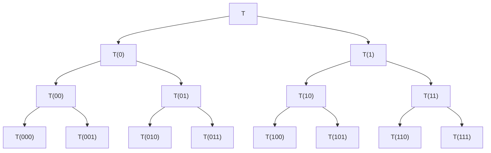

# Chapter 8

# Symmetric Eigenvalue Problems

8.1 Properties and Decompositions   
8.2 Power Iterations   
8.3 The Symmetric QR Algorithm   
8.4 More Methods for Tridiagonal Problems   
8.5 Jacobi Methods   
8.6 Computing the SVD   
8.7 Generalized Eigenvalue Problems with Symmetry

The symmetric eigenvalue problem with its rich mathematical structure is one of the most aesthetically pleasing problems in numerical linear algebra. We begin with a brief discussion of the mathematical properties that underlie the algorithms that follow. In §8.2 and §8.3 we develop various power iterations and eventually focus on the symmetric QR algorithm. Methods for the important case when the matrix is tridiagonal are covered in §8.4. These include the method of bisection and a divide and conquer technique. In §8.5 we discuss Jacobi’s method, one of the earliest matrix algorithms to appear in the literature. This technique is of interest because it is amenable to parallel computation and because of its interesting high-accuracy properties. The computation of the singular value decomposition is detailed in §8.6. The central algorithm is a variant of the symmetric QR iteration that works on bidiagonal matrices.

In §8.7 we discuss the generalized eigenvalue problem $A x = \lambda B x$ for the important case when A is symmetric and B is symmetric positive definite. The generalized singular value decomposition $A ^ { T } A x = \mu ^ { 2 } B ^ { T } B x$ is also covered. The section concludes with a brief examination of the quadratic eigenvalue problem $( \lambda ^ { 2 } M + \lambda C + K ) x = 0$ in the presence of symmetry, skew-symmetry, and definiteness.

# Reading Notes

Knowledge of Chapters 1-3 and §5.1–§5.2 are assumed. Within this chapter there are the following dependencies:

$$
\begin{array}c c c c c c c c c c c c c c c c c c c c c c c c c c c c c c c c c c c c c c c c c c c c c c c c c c c c c c c c c c c c c c c c c c c c c c c c c c c c c c c c c c c c c c c c c c c c c c c c c c c c c c c c c c c c c c c c c c c c c c c c c c c c c c c c c c c c c c c c c c c c c c c c c c c c c c c c c c c c c c c c c c c c c c c c c c c c c c c c c c c c c c c c c c c c c c c c c c c c c c c c c c c c c c c c c c c c c c c c c c c c c c c c c c c c c c c c c c c c c c c c c c c c c c c c c c c c c c c c c c c c c c c c c c c c c c c c c c c c c c c c c c c c c c c c c c c c c c c c c c c c c c c c c c c c c c c c c c c c c c c c c c c c c c c c c c c c c c c c c c c c c c c c c c c c c c c c c c c c c c c c c c c c c c c c c c c c c c c c c c c c c c c c c c c c c c c c c c c c c c c c c c c c c c c c c c c c c c c c c c c c c c c c c c c c c c c c c c c c c c c c c c c c c c c c c c c c c c c c c c c c c c c c c c c c c c c c c c c c c c c c c c c c c c c c c c c c c c c c c c c c c c c c c c c c c c c c c c c c c c c c c c c c c c c c c c c c c c c c c c c c c c c c c c c c c c c c c c c c c c c c c c c c c c c c c c c c c c c c c c c c c c c c c c c c c c c c c c c c c c c c c c c c c c c c c c c c c c c c c c c c c c c c c c c c c c c c c c c c c c c c c c c c c c c c c c c c c c c c c c c c c c c c c c c c c c c c c c c c c c c c c c c c c c c c c c c c c c c c c c c c c c c c c c c c c c c c c c c c c c c c c c c c c c c c c c c c c c c c c c c c c c c c c c c c c c c c c c c c c c c c c c c c c c c c c c c c c c c c c c c c c c c c c c c c c c c c c c c c c c c c c c c c c c c c c c c c c c c c c c c c c c c c c c c c c c c c c c c c c c c c c c c c c c c c c c c c c c c c c c c c c c c c c c c c c c c c c c c c c c c c c c c c c c c c c c c c c c c c c c c c c c c c c c c c c c c c c c c c c c c c c c c c c c c c c c c c c c c c c c c c c c c c c c c c c c c c c c c c c c c c c c c c c c c c c c c c c c c c c c c c c c c c c c c c c c c c c c c c c c c c c c c c c c c c c c c c c c c c c c c c c c c c c c c c c c c c c c c c c c c c c c c c c c c c c c c c c c c c c c c c c c c c c c c c c c c c c c c c c c c c c c c c c c c c c c c c c c c c c c c c c c c c c c c c c c c c c c c c c c c c c c c c c c c c c c c c c c c c c c c c c c c c c c c c c c c c c c c c c c c c c c c c c c c c c c c c c c c c c c c c c c c c c c c c c c c c c c c c c c c c c c c c c c c c c c c c c c c c c c c c c c c c c c c c c c c c c c c c c c c c c c c c c c c c c c c c c c c c c c c c c c c c c c c c c c c c c c c c c c c c c c c c c c c c c c c c c c c c c c c c c c c c c c c c c c c c c c c c c c c c c c c c c c c c c c c c c c c c c c c c c c c c c c c c c c c c c c c c c c c c c c c c c c c c c c c c c c c c c c c c c c c c c c c c c c c c c c c c c c c c c c c c c c c c c c c c c c c c c c c c c c c c c c c c c c c c c c c c c c c c c c c c c c c c c c c c c c c c c c c c c c c c c c c c c c c c c c c c c c c c c c c c c c c c c c c c c c c c c c c c c c c c c c c c c c c c c c c c c c c c c c c c c c c c c c c c c c c c c c c c c c c c c c c c c c c c c c c c c c c c c c c c c c c c c c c c c c c c c c c c c c c c c c c c c c c c c c c c c c c c c c c c c c c c c c c c c c c c c c c c c c c c c c c c c c c c c c c c c c c c c c c c c c c c c c c c c c c c c c c c c c c c c c c c c c c c c c c c c c c c c c c c c c c c c c c c c c c c c c c c c c c c c c c c c c c c c c c c c c c c c c c c c c c c c c c c c c c c c c c c c c c c c c c c c c c c c c c c c c c c c c c c c c c c c c c c c c c c c c c c c c c c c c c c c c c c c c c c c c c c c c c c c c c c c c c c c c c c c c c c c c c c c c c c c c c c c c c c c c c c c c c c c c c c c c c c c c c c c c c c c c c c c c c c c c c c c c c c c c c c c c c c c c c c c c c c c c c c c c c c c c c c c c c c c c c c c c c c c c c c c c c c c c c c c c c c c c c c c c c c c c c c c c c c c c c c c c c c c c c c c c c c c c c c c c c c c c c c c c c c c c c c c c c c c c c c c c c c c c c c c c c c c c c c c c c c c c c c c c c c c c c c c c c c c c c c c c c c c c c c c c c c c c c c c c c c c c c c c c c c c c c c c c c c c c c c c c c c c c c c c c c c c c c c c c c c c c c c c c c c c c c c c c c c c c c c c c c c c c c c c c c c c c c c c c c c c c c c c c c c c c c c c c c c c c c c c c c c c c c c c c c c c c c c c c c c c c c c c c c c c c c c c c c c c c c c c c c c c c c c c c c c c c c c c c c c c c c c c c c c c c c c c c c c c c c c c c c c c c c c c c c c c c c c c c c c c c c c c c c c c c c c c c c c c c c c c c c c c c c c c c c c c c c c c c c c c c c c c c c c c c c c c c c c c c c c c c c c c c c c c c c c c c c c c c c c c c c c c c c c c c c c c c c c c c c c c c c c c c c c c c c c c c c c c c c c c c c c c c c c c c c c c c c c c c c c c c c c c c c c c c c c c c c c c c c c c c c c c c c c c c c c c c c c c c c c c c c c c c c c c c c c c c c c c c c c c c c c c c c c c c c c c c c c c c c c c c c c c c c c c c c c c c c c c c c c c c c c c c c c c c c c c c c c c c c c c c c c c c c c c c c c c c c c c c c c c c c c c c c c c c c c c c c c c c c c c c c c c c c c c c c c c c c c c c c c c c c c c c c c c c c c c c c c c c c c c c c c c c c c c c c c c c c c c c c c c c c c c c c c c c c c c c c c c c c c c c c c c c c c c c c c c c c c c c c c c c c c c c c c c c c c c c c c c c c c c c c c c c c c c c c c c c c c c c c c c c c c c c c c c c c c c c c c c c c c c c c c c c c c c c c c c c c c c c c c c c c c c c c c c c c c c c c c c c c c c c c c c c c c c c c c c c c c c c c c c c c c c c c c c c c c c c c c c c c c c c c c c c c c c c c c c c c c c c c c c c c c c c c c c c c c c c c c c c c c c c c c c c c c c c c c c c c c c c c c c c c c c c c c c c c c c c c c c c c c c c c c c c c c c c c c c c c c c c c c c c c c c c c c c c c c c c c c c c c c c c c c c c c c c c c c c c c c c c c c c c c c c c c c c c c c c c c c c c c c c c c c c c c c c c c c c c c c c c c c c c c c c c c c c c c c c c c c c c c c c c c c c c c c c c c c c c c c c c c c c c c c c c c c c c c c c c c c c c c c c c c c c c c c c c c c c c c c c c c c c c c c c c c c c c c c c c c c c c c c c c c c c c c c c c c c c c c c c c c c c c c c c c c c c c c c c c c c c c c c c c c c c c c c c c c c c c c c c c c c c c c c c c c c c c c c c c c c c c c c c c c c c c c c c c c c c c c c c c c c c c c c c c c c c c c c c c c c c c c c c c c c c c c c c c c c c c c c c c c c c c c c c c c c c c c c c c c c c c c c c c c c c c c c c c c c c c c c c c c c c c c c c c c c c c c c c c c c c c c c c c c c c c c c c c c c c c c c c c c c c c c c c c c c c c c c c c c c c c c c c c c c c c c c c c c c c c c c c c c c c c c c c c c c c c c c c c c c c c c c c c c c c c c c c c c c c c c c c c c c c c c c c c c c c c c c c c c c c c c c c c c c c c c c c c c c c c c c c c c c c c c c c c c c c c c c c c c c c c c c c c c c c c c c c c c c c c c c c c c c c c c c c c c c c c c c c c c c c c c c c c c c c c c c c c c c c c c c c c c c c c c c c c c c c c c c c c c c c c c c c c c c c c c c c c c c c c c c c c c c c c c c c c c c c c c c c c c c c c c c c c c c c c c c c c c c c c c c c c c c c c c c c c c c c c c c c c c c c c c c c c c c c c c c c c c c c c c c c c c c c c c c c c c c c c c c c c c c c c c c c c c c c c c c c c c c c c c c c c c c c c c c c c c c c c c c c c c c c c c c c c c c c c c c c c c c c c c c c c c c c c c c c c c c c c c c c c c c c c c c c c c c c c c c c c c c c c c c c c c c c c c c c c c c c c c c c c c c c c c c c c c c c c c c c c c c c c c c c c c c c c c c c c c c c c c c c c c c c c c c c c c c c c c c c c c c c c c c c c c c c c c c c c c c c c c c c c c c c c c c c c c c c c c c c c c c c c c c c c c c c c c c c c c c c c c c c c c c c c c c c c c c c c c c c c c c c c c c c c c c c c c c c c c c c c c c c c c c c c c c c c c c c c c c c c c c c c c c c c c c c c c c c c c c c c c c c c c c c c c c c c c c c c c c c c c c c c c c c c c c c c c c c c c c c c c c c c c c c c c c c c c c c c c c c c c c c c c c c c c c c c c c c c c c c c c c c c c c c c c c c c c c c c c c c c c c c c c c c c c c c c c c c c c c c c c c c c c c c c c c c c c c c c c c c c c c c c c c c c c c c c c c c c c c c c c c c c c c c c c c c c c c c c c c c c c c c c c c c c c c c c c c c c c c c c c c c c c c c c c c c c c c c c c c c c c c c c c c c c c c c c c c c c c c c c c c c c c c c c c c c c c c c c c c c c c c c c c c c c c c c c c c c c c c c c c c c c c c c c c c c c c c c c c c c c c c c c c c c c c c c c c c c c c c c c c c c c c c c c c c c c c c c c c c c c c c c c c c c c c c c c c c c c c c c c c c c c c c c c c c c c c c c c c c c c c c c c c c c c c c c c c c c c c c c c c c c c c c c c c c c c c c c c c c c c c c c c c c c c c c c c c c c c c c c c c c c c c c c c c c c c c c c c c c c c c c c c c c c c c c c c c c c c c c c c c c c c c c c c c c c c c c c c c c c c c c c c c c c c c c c c c c c c c c c c c c c c c c c c c c c c c c c c c c c c c c c c c c c c c c c c c c c c c c c c c c c c c c c c c c c c c c c c c c c c c c c c c c c c c c c c c c c c c c c c c c c c c c c c c c c c c c c c c c c c c c c c c c c c c c c c c c c c c c c c c c c c c c c c c c c c c c c c c c c c c c c c c c c c c c c c c c c c c c c c c c c c c c c c c c c c c c c c c c c c c c c c c c c c c c c c c c c c c c c c c c c c c c c c c c c c c c c c c c c c c c c c c c c c c c c c c c c c c c c c c c c c c c c c c c c c c c c c c c c c c c c c c c c c c c c c c c c c c c c c c c c c c c c c c c c c c c c c c c c c c c c c c c c c c c c c c c c c c c c c c c c c c c c c c c c c c c c c c c c c c c c c c c c c c c c c c c c c c c c c c c c c c c c c c c c c c c c c c c c c c c c c c c c c c c c c c c c c c c c c c c c c c c c c c c c c c c c c c c c c c c c c c c c c c c c c c c c c c c c c c c c c c c c c c c c c c c c c c c c c c c c c c c c c c c c c c c c c c c c c c c c c c c c c c c c c c c c c c c c c c c c c c c c c c c c c c c c c c c c c c c c c c c c c c c c c c c c c c c c c c c c c c c c c c c c c c c c c c c c c c c c c c c c c c c c c c c c c c c c c c c c c c c c c c c c c c c c c c c c c c c c c c c c c c c c c c c c c c c c c c c c c c c c c c c c c c c c c c c c c c c c c c c c c c c c c c c c c c c c c c c c c c c c c c c c c c c c c c c c c c c c c c c c c c c c c c c c c c c c c c c c c c c c c c c c c c c c c c c c c c c c c c c c c c c c c c c c c c c c c c c c c c c c c c c c c c c c c c c c c c c c c c c c c c c c c c c c c c c c c c c c c c c c c c c c c c c c c c c c c c c c c c c c c c c c c c c c c c c c c c c c c c c c c c c c c c c c c c c c c c c c c c c c c c c c c c c c c c c c c c c c c c c c c c c c c c c c c c c c c c c c c c c c c c c c c c c c c c c c c c c c c c c c c c c c c c c c c c c c c c c c c c c c c c c c c c c c c c c c c c c c c c c c c c c c c c c c c c c c c c c c c c c c c c c c c c c c c c c c c c c c c c c c c c c c c c c c c c c c c c c c c c c c c c c c c c c c c c c c c c c c c c c c c c c c c c c c c c c c c c c c c c c c c c c c c c c c c c c c c c c c c c c c c c c c c c c c c c c c c c c c c c c c c c c c c c c c c c c c c c c c c c c c c c c c c c c c c c c c c c c c c c c c c c c c c c c c c c c c c c c c c c c c c c c c c c c c c c c c c c c c c c c c c c c c c c c c c c c c c c c c c c c c c c c c c c c c c c c c c c c c c c c c c c c c c c c c c c c c c c c c c c c c c c c c c c c c c c c c c c c c c c c c c c c c c c c c c c c c c c c c c c c c c c c c c c c c c c c c c c c c c c c c c c c c c c c c c c c c c c c c c c c c c c c c c c c c c c c c c c c c c c c c c c c c c c c c c c c c c c c c c c c c c c c c c c c c c c c c c c c c c c c c c c c c c c c c c c c c c c c c c c c c c c c c c c c c c c c c c c c c c c c c c c c c c c c c c c c c c c c c c c c c c c c c c c c c c c c c c c c c c c c c c c c c c c c c c c c c c c c c c c c c c c c c c c c c c c c c c c c c c c c c c c c c c c c c c c c c c c c c c c c c c c c c c c c c c c c c c c c c c c c c c c c c c c c c c c c c c c c c c c c c c c c c c c c c c c c c c c c c c c c c c c c c c c c c c c c c c c c c c c c c c c c c c c c c c c c c c c c c c c c c c c c c c c c c c c c c c c c c c c c c c c c c c c c c c c c c c c c c c c c c c c c c c c c c c c c c c c c c c c c c c c c c c c c c c c c c c c c c c c c c c c c c c c c c c c c c c c c c c c c c c c c c c c c c c c c c c c c c c c c c c c c c c c c c c c c c c c c c c c c c c c c c c c c c c c c c c c c c c c c c c c c c c c c c c c c c c c c c c c c c c c c c c c c c c c c c c c c c c c c c c c c c c c c c c c c c c c c c c c c c c c c c c c c c c c c c c c c c c c c c c c c c c c c c c c c c c c c c c c c c c c c c c c c c c c c c c c c c c c c c c c c c c c c c c c c c c c c c c c c c c c c c c c c c c c c c c c c c c c c c c c c c c c c c c c c c c c c c c c c c c c c c c c c c c c c c c c c c c c c c c c c c c c c c c c c c c c c c c c c c c c c c c c c c c c c c c c c c c c c c c c c c c c c c c c c c c c c c c c c c c c c c c c c c c c c c c c c c c c c c c c c c c c c c c c c c c c c c c c c c c c c c c c c c c c c c c c c c c c c c c c c c c c c c c c c c c c c c c c c c c c c c c c c c c c c c c c c c c c c c c c c c c c c c c c c c c c c c c c c c c c c c c c c c c c c c c c c c c c c c c c c c c c c c c c c c c c c c c c c c c c c c c c c c c c c c c c c c c c c c c c c c c c c c c c c c c c c c c c c c c c c c c c c c c c c c c c c c c c c c c c c c c c c c c c c c c c c c c c c c c c c c c c c c c c c c c c c c c c c c c c c c c c c c c c c c c c c c c c c c c c c c c c c c c c c c c c c c c c c c c c c c c c c c c c c c c c c c c c c c c c c c c c c c c c c c c c c c c c c c c c c c c c c c c c c c c c c c c c c c c c c c c c c c c c c c c c c c c c c c c c c c c c c c c c c c c c c c c c c c c c c c c c c c c c c c c c c c c c c c c c c c c c c c c c c c c c c c c c c c c c c c c c c c c c c c c c c c c c c c c c c c c c c c c c c c c c c c c c c c c c c c c c c c c c c c c c c c c c c c c c c c c c c c c c c c c c c c c c c c c c c c c c c c c c c c c c c c c c c c c c c c c c c c c c c c c c c c c c c c c c c c c c c c c c c c c c c c c c c c c c c c c c c c c c c c c c c c c c c c c c c c c c c c c c c c c c c c c c c c c c c c c c c c c c c c c c c c c c c c c c c c c c c c c c c c c c c c c c c c c c c c c c c c c c c c c c c c c c c c c c c c c c c c c c c c c c c c c c c c c c c c c c c c c c c c c c c c c c c c c c c c c c c c c c c c c c c c c c c c c c c c c c c c c c c c c c c c c c c c c c c c c c c c c c c c c c c c c c c c c c c c c c c c c c c c c c c c c c c c c c c c c c c c c c c c c c c c c c c c c c c c c c c c c c c c c c c c c c c c c c c c c c c c c c c c c c c c c c c c c c c c c c c c c c c c c c c c c c c c c c c c c c c c c c c c c c c c c c c c c c c c c c c c c c c c c c c c c c c c c c c c c c c c c c c c c c c c c c c c c c c c c c c c c c c c c c c c c c c c c c c c c c c c c c c c c c c c c c c c c c c c c c c c c c c c c c c c c c c c c c c c c c c c c c c c c c c c c c c c c c c c c c c c c c c c c c c c c c c c c c c c c c c c c c c c c c c c c c c c c c c c c c c c c c c c c c c c c c c c c c c c c c c c c c c c c c c c c c c c c c c c c c c c c c c c c c c c c c c c c c c c c c c c c c c c c c c c c c c c c c c c c c c c c c c c c c c c c c c c c c c c c c c c c c c c c c c c c c c c c c c c c c c c c c c c c c c c c c c c c c c c c c c c c c c c c c c c c c c c c c c c c c c c c c c c c c c c c c c c c c c c c c c c c c c c c c c c c c c c c c c c c c c c c c c c c c c c c c c c c c c c c c c c c c c c c c c c c c c c c c c c c c c c c c c c c c c c c c c c c c c c c c c c c c c c c c c c c c c c c c c c c c c c c c c c c c c c c c c c c c c c c c c c c c c c c c c c c c c c c c c c c c c c c c c c c c c c c c c c c c c c c c c c c c c c c c c c c c c c c c c c c c c c c c c c c c c c c c c c c c c c c c c c c c c c c c c c c c c c c c c c c c c c c c c c c c c c c c c c c c c c c c c c c c c c c c c c c c c c c c c c c c c c c c c c c c c c c c c c c c c c c c c c c c c c c c c c c c c c c c c c c c c c c c c c c c c c c c c c c c c c c c c c c c c c c c c c c c c c c c c c c c c c c c c c c c c c c c c c c c c c c c c c c c c c c c c c c c c c c c c c c c c c c c c c c c c c c c c c c c c c c c c c c c c c c c c c c c c c c c c c c c c c c c c c c c c c c c c c c c c c c c c c c c c c c c c c c
$$

Many of the algorithms and theorems in this chapter have unsymmetric counterparts in Chapter 7. However, except for a few concepts and definitions, our treatment of the symmetric eigenproblem can be studied before reading Chapter 7.

Complementary references include Wilkinson (AEP), Stewart (MAE), Parlett (SEP), and Stewart and Sun (MPA).

# 8.1 Properties and Decompositions

In this section we summarize the mathematics required to develop and analyze algorithms for the symmetric eigenvalue problem.

# 8.1.1 Eigenvalues and Eigenvectors

Symmetry guarantees that all of A’s eigenvalues are real and that there is an orthonormal basis of eigenvectors.

Theorem 8.1.1 (Symmetric Schur Decomposition). If $A \in \mathbb { R } ^ { n \times n }$ is symmetric, then there exists a real orthogonal Q such that

$$
Q ^ {T} A Q = \Lambda = \operatorname{diag} \left(\lambda_ {1}, \dots , \lambda_ {n}\right).
$$

Moreover, for $k = 1 { : } n , A Q ( : , k ) = \lambda _ { k } Q ( : , k )$ . Compare with Theorem 7.1.3.

Proof. Suppose $\lambda _ { 1 } \in \lambda ( A )$ and that $x \in \mathbb { C } ^ { n }$ is a unit 2-norm eigenvector with $A x =$ $\lambda _ { 1 } x$ . Since $\lambda _ { 1 } = x ^ { H } A x = x ^ { H } A ^ { H } x = { \overline { { x ^ { H } A x } } } = { \overline { { \lambda _ { 1 } } } }$ it follows that $\lambda _ { 1 } \in \mathbb { R }$ . Thus, we may assume that $\boldsymbol { x } \in \mathbb { R } ^ { n }$ . Let $P _ { 1 } \in \mathbb { R } ^ { n \times n }$ be a Householder matrix such that $P _ { 1 } ^ { T } x = e _ { 1 } = I _ { n } ( : , 1 )$ . It follows from $A x = \lambda _ { 1 } x$ that $( P _ { 1 } ^ { T } A P _ { 1 } ) e _ { 1 } = \lambda e _ { 1 }$ . This says that the first column of $P _ { 1 } ^ { T } A P _ { 1 }$ is a multiple of $e _ { 1 }$ . But since $P _ { 1 } ^ { T } A P _ { 1 }$ is symmetric, it must have the form

$$
P _ {1} ^ {T} A P _ {1} = \left[ \begin{array}{c c} \lambda_ {1} & 0 \\ 0 & A _ {1} \end{array} \right]
$$

where $A _ { 1 } \in \mathbb { R } ^ { ( n - 1 ) \times ( n - 1 ) }$ is symmetric. By induction we may assume that there is an orthogonal $Q _ { 1 } \in \mathbb { R } ^ { ( n - 1 ) \times ( \overset {  } { n - 1 } ) }$ such that $Q _ { 1 } ^ { T } A _ { 1 } Q _ { 1 } = \Lambda _ { 1 }$ is diagonal. The theorem follows by setting

$$
Q = P _ {1} \left[ \begin{array}{c c} 1 & 0 \\ 0 & Q _ {1} \end{array} \right] \qquad \text {and} \qquad \Lambda = \left[ \begin{array}{c c} \lambda_ {1} & 0 \\ 0 & \Lambda_ {1} \end{array} \right]
$$

and comparing columns in the matrix equation $A Q = Q \Lambda$ .

For a symmetric matrix A we shall use the notation $\lambda _ { k } ( A )$ to designate the kth largest eigenvalue, i.e.,

$$
\lambda_ {n} (A) \leq \dots \leq \lambda_ {2} (A) \leq \lambda_ {1} (A).
$$

It follows from the orthogonal invariance of the 2-norm that A has singular values $\{ | \lambda _ { 1 } ( A ) | , \ldots , | \lambda _ { n } ( A ) | \}$ and

$$
\| A \| _ {2} = \max \{\left| \lambda_ {1} (A) \right|, \left| \lambda_ {n} (A) \right| \}.
$$

The eigenvalues of a symmetric matrix have a minimax characterization that revolves around the quadratic form $x ^ { T } A x / x ^ { T } x$ .

Theorem 8.1.2 (Courant-Fischer Minimax Theorem). If $A \in \mathbb { R } ^ { n \times n }$ is symmetric, then

$$
\lambda_ {k} (A) = \max _ {\dim (S) = k} \min _ {0 \neq y \in S} \frac {y ^ {T} A y}{y ^ {T} y}
$$

for $k = 1 { : } n$ .

Proof. Let $Q ^ { T } A Q \ = \ \mathrm { d i a g } ( \lambda _ { i } )$ be the Schur decomposition with $\lambda _ { k } = \lambda _ { k } ( A )$ and $Q = [  q _ { 1 } | \cdots | q _ { n } ]$ . Define

$$
S _ {k} = \operatorname{span} \left\{q _ {1}, \dots , q _ {k} \right\},
$$

the invariant subspace associated with $\lambda _ { 1 } , \ldots , \lambda _ { k }$ . It is easy to show that

$$
\max _ {\dim (S) = k} \min _ {0 \neq y \in S} \frac {y ^ {T} A y}{y ^ {T} y} \geq \min _ {0 \neq y \in S _ {k}} \frac {y ^ {T} A y}{y ^ {T} y} = q _ {k} ^ {T} A q _ {k} = \lambda_ {k} (A).
$$

To establish the reverse inequality, let S be any k-dimensional subspace and note that it must intersect span $\{ q _ { k } , \ldots , q _ { n } \}$ , a subspace that has dimension $n - k + 1$ . If $y _ { * } = \alpha _ { k } q _ { k } + \cdot \cdot \cdot + \alpha _ { n } q _ { n }$ is in this intersection, then

$$
\min _ {0 \neq y \in S} \frac {y ^ {T} A y}{y ^ {T} y} \leq \frac {y _ {*} ^ {T} A y _ {*}}{y _ {*} ^ {T} y _ {*}} \leq \lambda_ {k} (A).
$$

Since this inequality holds for all k-dimensional subspaces,

$$
\max _ {\dim (S) = k} \quad \min _ {0 \neq y \in S} \frac {y ^ {T} A y}{y ^ {T} y} \leq \lambda_ {k} (A)
$$

thereby completing the proof of the theorem.

Note that if $A \in \mathbb { R } ^ { n \times n }$ is symmetric positive definite, then $\lambda _ { n } ( A ) > 0$ .

# 8.1.2 Eigenvalue Sensitivity

An important solution framework for the symmetric eigenproblem involves the production of a sequence of orthogonal transformations $\{ Q _ { k } \}$ with the property that the matrices $Q _ { k } ^ { T } A Q _ { k }$ are progressively “more diagonal.” The question naturally arises, how well do the diagonal elements of a matrix approximate its eigenvalues?

Theorem 8.1.3 (Gershgorin). Suppose $A \in \mathbb { R } ^ { n \times n }$ is symmetric and that $Q \in \mathbb { R } ^ { n \times n }$ is orthogonal. $I f \dot { Q } ^ { T } A Q = D + \dot { F }$ where $D = \mathrm { d i a g } ( d _ { 1 } , \ldots , d _ { n } )$ and F has zero diagonal entries, then

$$
\lambda (A) \subseteq \bigcup_ {i = 1} ^ {n} \left[ d _ {i} - r _ {i}, d _ {i} + r _ {i} \right]
$$

where $r _ { i } ~ = ~ \sum _ { j = 1 } ^ { n } | f _ { i j } | ~ f o r ~ i = 1 { : } n$ . Compare with Theorem 7.2.1.

Proof. Suppose $\lambda \in \lambda ( A )$ and assume without loss of generality that $\lambda \neq d _ { i }$ for $i = 1 { : } n$ . Since $( D - \lambda I ) + F$ is singular, it follows from Lemma 2.3.3 that

$$
1 \leq \| (D - \lambda I) ^ {- 1} F \| _ {\infty} = \sum_ {j = 1} ^ {n} \frac {| f _ {k j} |}{| d _ {k} - \lambda |} = \frac {r _ {k}}{| d _ {k} - \lambda |}
$$

for some k, $1 \leq k \leq n$ . But this implies that $\lambda \in [ d _ { k } - r _ { k } , d _ { k } + r _ { k } ]$ .

The next results show that if A is perturbed by a symmetric matrix $E _ { \mathrm { { i } } }$ then its eigenvalues do not move by more than $\| E \| _ { F }$ .

Theorem 8.1.4 (Wielandt-Hoffman). If A and $A + E$ are $n { - } b y { - } n$ symmetric matrices, then

$$
\sum_ {i = 1} ^ {n} \left(\lambda_ {i} (A + E) - \lambda_ {i} (A)\right) ^ {2} \leq \| E \| _ {F} ^ {2}.
$$

Proof. See Wilkinson (AEP, pp. 104–108), Stewart and Sun (MPT, pp. 189–191), or Lax (1997, pp. 134–136).

Theorem 8.1.5. If A and $A + E$ are $n { - } b y { - } n$ symmetric matrices, then

$$
\lambda_ {k} (A) + \lambda_ {n} (E) \leq \lambda_ {k} (A + E) \leq \lambda_ {k} (A) + \lambda_ {1} (E), \quad k = 1: n.
$$

Proof. This follows from the minimax characterization. For details see Wilkinson (AEP, pp. 101–102) or Stewart and Sun (MPT, p. 203).

Corollary 8.1.6. If A and $A + E$ are $n { - } b y { - } n$ symmetric matrices, then

$$
\left| \lambda_ {k} (A + E) - \lambda_ {k} (A) \right| \leq \| E \| _ {2}
$$

for k = 1:n.

Proof. Observe that

$$
\left| \lambda_ {k} (A + E) - \lambda_ {k} (A) \right| \leq \max \left\{\left| \lambda_ {n} (E) \right|, \left| \lambda_ {1} (E) \right\| \right\} = \| E \| _ {2}
$$

for $k = 1 { : } n$ .

A pair of additional perturbation results that are important follow from the minimax property.

Theorem 8.1.7 (Interlacing Property). If $A \in \mathbb { R } ^ { n \times n }$ is symmetric and $A _ { r } \ =$ $A ( 1 { : } r , 1 { : } r )$ , then

$$
\lambda_ {r + 1} (A _ {r + 1}) \leq \lambda_ {r} (A _ {r}) \leq \lambda_ {r} (A _ {r + 1}) \leq \dots \leq \lambda_ {2} (A _ {r + 1}) \leq \lambda_ {1} (A _ {r}) \leq \lambda_ {1} (A _ {r + 1})
$$

for $r = 1 { : } n - 1$ .

Proof. Wilkinson (AEP, pp. 103–104).

Theorem 8.1.8. Suppose $\boldsymbol { B } = \boldsymbol { A } + \tau c c ^ { T }$ where $A \in \mathbb { R } ^ { n \times n }$ is symmetric, $c \in \mathbb { R } ^ { n }$ has unit 2-norm, and $\tau \in \mathbb { R }$ . $I f \tau \geq 0$ , then

$$
\lambda_ {i} (B) \in [ \lambda_ {i} (A), \lambda_ {i - 1} (A) ], \quad i = 2: n,
$$

while if $\tau \leq 0$ then

$$
\lambda_ {i} (B) \in [ \lambda_ {i + 1} (A), \lambda_ {i} (A) ], \quad i = 1: n - 1.
$$

In either case, there exist nonnegative $m _ { 1 } , \ldots , m _ { n }$ such that

$$
\lambda_ {i} (B) = \lambda_ {i} (A) + m _ {i} \tau , \qquad i = 1: n
$$

with $m _ { 1 } + \cdots + m _ { n } = 1$ .

Proof. Wilkinson (AEP, pp. 94–97). See also P8.1.8.

# 8.1.3 Invariant Subspaces

If $S \subseteq \mathbb { R } ^ { n }$ and $x \in S \Rightarrow A x \in S$ , then S is an invariant subspace for $A \in \mathbb { R } ^ { n \times n }$ . Note that if $\boldsymbol { x } \in \mathbb { R } ^ { i } ;$ s an eigenvector for A, then $S = \mathsf { s p a n } \{ x \}$ is 1-dimensional invariant subspace. Invariant subspaces serve to “take apart” the eigenvalue problem and figure heavily in many solution frameworks. The following theorem explains why.

Theorem 8.1.9. Suppose $A \in \mathbb { R } ^ { n \times n }$ is symmetric and that

$$
Q = \left[ \begin{array}{c c} Q _ {1} & Q _ {2} \\ r & n - r \end{array} \right]
$$

is orthogonal. If $\mathsf { r a n } ( Q _ { 1 } )$ is an invariant subspace, then

$$
Q ^ {T} A Q = D = \left[ \begin{array}{c c} D _ {1} & 0 \\ 0 & D _ {2} \end{array} \right] _ {n - r} ^ {r} \tag {8.1.1}
$$

and $\lambda ( A ) = \lambda ( D _ { 1 } ) \cup \lambda ( D _ { 2 } )$ . Compare with Lemma 7.1.2.

Proof. If

$$
Q ^ {T} A Q = \left[ \begin{array}{c c} D _ {1} & E _ {2 1} ^ {T} \\ E _ {2 1} & D _ {2} \end{array} \right],
$$

then from $A Q = Q D$ we have $A Q _ { 1 } - Q _ { 1 } D _ { 1 } \ = \ Q _ { 2 } E _ { 2 1 }$ . Since $\mathsf { r a n } ( Q _ { 1 } )$ is invariant, the columns of $Q _ { 2 } E _ { 2 1 }$ are also in $\mathsf { r a n } ( Q _ { 1 } )$ and therefore perpendicular to the columns of $Q _ { 2 }$ . Thus,

$$
0 = Q _ {2} ^ {T} \left(A Q _ {1} - Q _ {1} D _ {1}\right) = Q _ {2} ^ {T} Q _ {2} E _ {2 1} = E _ {2 1}.
$$

and so (8.1.1) holds. It is easy to show

$$
\det (A - \lambda I _ {n}) = \det (Q ^ {T} A Q - \lambda I _ {n}) = \det (D _ {1} - \lambda I _ {r}) \cdot \det (D _ {2} - \lambda I _ {n - r})
$$

confirming that $\lambda ( A ) = \lambda ( D _ { 1 } ) \cup \lambda ( D _ { 2 } )$ .

The sensitivity to perturbation of an invariant subspace depends upon the separation of the associated eigenvalues from the rest of the spectrum. The appropriate measure of separation between the eigenvalues of two symmetric matrices B and C is given by

$$
\operatorname{sep}(B,C) = \min_{\substack{\lambda \in \lambda (B)\\ \mu \in \lambda (C)}}|\lambda -\mu |. \tag{8.1.2}
$$

With this definition we have the following result.

Theorem 8.1.10. Suppose A and $A + E$ are $n { - } b y { - } n$ symmetric matrices and that

$$
Q = \left[ \begin{array}{c c} Q _ {1} & Q _ {2} \\ r & n - r \end{array} \right]
$$

is an orthogonal matrix such that ran $\left( Q _ { 1 } \right)$ is an invariant subspace for A. Partition the matrices $Q ^ { T } A Q$ and $Q ^ { T } E Q$ as follows:

$$
Q ^ {T} A Q = \left[ \begin{array}{c c} D _ {1} & 0 \\ 0 & D _ {2} \end{array} \right] _ {n - r} ^ {r}, \quad Q ^ {T} E Q = \left[ \begin{array}{c c} E _ {1 1} & E _ {2 1} ^ {T} \\ E _ {2 1} & E _ {2 2} \end{array} \right] _ {n - r} ^ {r}.
$$

If $\mathsf { s e p } ( D _ { 1 } , D _ { 2 } ) > 0$ and

$$
\| E \| _ {F} \leq \frac {\operatorname{sep} \left(D _ {1} , D _ {2}\right)}{5},
$$

then there exists a matrix $P \in \mathbb { R } ^ { ( n - r ) \times r }$ with

$$
\| P \| _ {F} \leq \frac {4}{\operatorname{sep} \left(D _ {1} , D _ {2}\right)} \| E _ {2 1} \| _ {F}
$$

such that the columns of $\hat { Q } _ { 1 } = ( Q _ { 1 } + Q _ { 2 } P ) ( I + P ^ { T } P ) ^ { - 1 / 2 }$ define an orthonormal basis for a subspace that is invariant $f o r \ A + E$ . Compare with Theorem $\it 7 . 2 . 4$ .

Proof. This result is a slight adaptation of Theorem 4.11 in Stewart (1973). The matrix $( I + P ^ { T } P ) ^ { - 1 / 2 }$ is the inverse of the square root of $I + P ^ { T } P$ . See §4.2.4.

Corollary 8.1.11. If the conditions of the theorem hold, then

$$
\operatorname{dist} \left(\operatorname{ran} \left(Q _ {1}\right), \operatorname{ran} \left(\hat {Q} _ {1}\right)\right) \leq \frac {4}{\operatorname{sep} \left(D _ {1} , D _ {2}\right)} \| E _ {2 1} \| _ {F}.
$$

Compare with Corollary 7.2.5.

Proof. It can be shown using the SVD that

$$
\| P (I + P ^ {T} P) ^ {- 1 / 2} \| _ {2} \leq \| P \| _ {2} \leq \| P \| _ {F}. \tag {8.1.3}
$$

Since $Q _ { 2 } ^ { T } \hat { Q } _ { 1 } = P ( I + P ^ { T } P ) ^ { - 1 / 2 }$ it follows that

$$
\begin{array}{l} \operatorname{dist} \left(\operatorname{ran} \left(Q _ {1}\right), \operatorname{ran} \left(\hat {Q} _ {1}\right)\right) = \| Q _ {2} ^ {T} \hat {Q} _ {1} \| _ {2} = \| P (I + P ^ {H} P) ^ {- 1 / 2} \| _ {2} \\ \leq \| P \| _ {2} \leq 4 \| E _ {2 1} \| _ {F} / \mathsf {s e p} (D _ {1}, D _ {2}) \\ \end{array}
$$

completing the proof.

Thus, the reciprocal of $\mathsf { s e p } ( D _ { 1 } , D _ { 2 } )$ can be thought of as a condition number that measures the sensitivity of $\mathsf { r a n } ( Q _ { 1 } )$ as an invariant subspace.

The effect of perturbations on a single eigenvector is sufficiently important that we specialize the above results to this case.

Theorem 8.1.12. Suppose A and $A + E$ are $n { - } b y { - } n$ symmetric matrices and that

$$
Q = \left[ \begin{array}{c c} q _ {1} & Q _ {2} \\ 1 & n - 1 \end{array} \right]
$$

is an orthogonal matrix such that $q _ { 1 }$ is an eigenvector for A. Partition the matrices $Q ^ { T } A Q$ and $Q ^ { T } E Q$ as follows:

$$
Q ^ {T} A Q   =   \left[ \begin{array}{c c} \lambda & 0 \\ 0 & D _ {2} \end{array} \right] _ {n - 1} ^ {1}  , \qquad Q ^ {T} E Q   =   \left[ \begin{array}{c c} \epsilon & e ^ {T} \\ e & E _ {2 2} \end{array} \right] _ {n - 1} ^ {1}  .
$$

If

$$
d = \min _ {\mu \in \lambda (D _ {2})} | \lambda - \mu | > 0
$$

and

$$
\parallel E \parallel_ {F} \leq \frac {d}{5},
$$

then there exists $p \in \mathbb { R } ^ { n - 1 }$ satisfying

$$
\| p \| _ {2} \leq \frac {4}{d} \| e \| _ {2}
$$

such that $\hat { q } _ { 1 } = ( q _ { 1 } + Q _ { 2 } p ) / \sqrt { 1 + p ^ { T } p }$ is a unit 2-norm eigenvector for $A + E$ . Moreover,

$$
\operatorname{dist} \left(\operatorname{span} \left\{q _ {1} \right\}, \operatorname{span} \left\{\hat {q} _ {1} \right\}\right) = \sqrt {1 - \left(q _ {1} ^ {T} \hat {q} _ {1}\right) ^ {2}} \leq \frac {4}{d} \| e \| _ {2}.
$$

Compare with Corollary 7.2.6.

Proof. Apply Theorem 8.1.10 and Corollary 8.1.11 with $r = 1$ and observe that if $D _ { 1 } = \left( \lambda \right)$ , then $d = { \tt s e p } ( D _ { 1 } , D _ { 2 } )$ .

# 8.1.4 Approximate Invariant Subspaces

If the columns of $Q _ { 1 } \in \mathbb { R } ^ { n \times r }$ are independent and the residual matrix $R = A Q _ { 1 } - Q _ { 1 } S$ is small for some $S \in \mathbb { R } ^ { r \times r }$ , then the columns of $Q _ { 1 }$ define an approximate invariant subspace. Let us discover what we can say about the eigensystem of A when in the possession of such a matrix.

Theorem 8.1.13. Suppose $A \in \mathbb { R } ^ { n \times n }$ and $S \in \mathbb { R } ^ { r \times r }$ are symmetric and that

$$
A Q _ {1} - Q _ {1} S = E _ {1}
$$

where $Q _ { 1 } \in \mathbb { R } ^ { n \times r }$ satisfies $Q _ { 1 } ^ { T } Q _ { 1 } = I _ { r }$ . Then there exist $\mu _ { 1 } , \ldots , \mu _ { r } \in \lambda ( A )$ such that

$$
| \mu_ {k} - \lambda_ {k} (S) | \leq \sqrt {2} \| E _ {1} \| _ {2}
$$

for $k = 1 { : } r$ .

Proof. Let $Q _ { 2 } \in \mathbb { R } ^ { n \times ( n - r ) }$ be any matrix such that $Q = \left[ Q _ { 1 } \mid Q _ { 2 } \right]$ is orthogonal. It follows that

$$
Q ^ {T} A Q = \left[ \begin{array}{c c} S & 0 \\ 0 & Q _ {2} ^ {T} A Q _ {2} \end{array} \right] + \left[ \begin{array}{c c} Q _ {1} ^ {T} E _ {1} & E _ {1} ^ {T} Q _ {2} \\ Q _ {2} ^ {T} E _ {1} & 0 \end{array} \right] \equiv B + E
$$

and so by using Corollary 8.1.6 we have $| \lambda _ { k } ( A ) - \lambda _ { k } ( B ) | \ \leq \ \| \ E \| _ { 2 }$ for $k = 1 { : } n$ . Since $\lambda ( S ) \subseteq \lambda ( B )$ , there exist $\mu _ { 1 } , \ldots , \mu _ { r } \in \lambda ( A )$ such that $\begin{array} { l l l } { | \mu _ { k } - \lambda _ { k } ( S ) | } & { \leq } & { \parallel E \parallel _ { 2 } } \end{array}$ for $k = 1 { : } r$ . The theorem follows by noting that for any $\boldsymbol { x } \in \mathbb { R } ^ { r }$ and $y \in \mathbb { R } ^ { n - r }$ we have

$$
\left\| E \left[ \begin{array}{c} x \\ y \end{array} \right] \right\| _ {2} \leq \| E _ {1} x \| _ {2} + \| E _ {1} ^ {T} Q _ {2} y \| _ {2} \leq \| E _ {1} \| _ {2} \| x \| _ {2} + \| E _ {1} \| _ {2} \| y \| _ {2}
$$

from which we readily conclude that $\| E \| _ { 2 } \leq \sqrt { 2 } \| E _ { 1 } \| _ { 2 }$ .

The eigenvalue bounds in Theorem 8.1.13 depend on $\parallel A Q _ { 1 } - Q _ { 1 } S \parallel _ { 2 }$ . Given A and $Q _ { 1 }$ , the following theorem indicates how to choose S so that this quantity is minimized in the Frobenius norm.

Theorem 8.1.14. If $A \in \mathbb { R } ^ { n \times n }$ is symmetric and $Q _ { 1 } \in \mathbb { R } ^ { n \times r }$ has orthonormal columns, then

$$
\min _ {S \in \mathbb {R} ^ {r \times r}} \parallel A Q _ {1} - Q _ {1} S \parallel_ {F} = \parallel (I - Q _ {1} Q _ {1} ^ {T}) A Q _ {1} \parallel_ {F}
$$

and $S = Q _ { 1 } ^ { T } A Q _ { 1 }$ is the minimizer.

Proof. Let $Q _ { 2 } \in \mathbb { R } ^ { n \times ( n - r ) }$ be such that $Q \ = \ [ \ Q _ { 1 } , \ Q _ { 2 } \ ]$ is orthogonal. For any $S \in \mathbb { R } ^ { r \times r }$ we have

$$
\left\| A Q _ {1} - Q _ {1} S \right\| _ {F} ^ {2} = \left\| Q ^ {T} A Q _ {1} - Q ^ {T} Q _ {1} S \right\| _ {F} ^ {2} = \left\| Q _ {1} ^ {T} A Q _ {1} - S \right\| _ {F} ^ {2} + \left\| Q _ {2} ^ {T} A Q _ {1} \right\| _ {F} ^ {2}.
$$

Clearly, the minimizing S is given by $S = Q _ { 1 } ^ { T } A Q _ { 1 }$ .

This result enables us to associate any r-dimensional subspace ran $\left( Q _ { 1 } \right)$ , with a set of $r$ “optimal” eigenvalue-eigenvector approximates.

Theorem 8.1.15. Suppose $A \in \mathbb { R } ^ { n \times n }$ is symmetric and that $Q _ { 1 } \in \mathbb { R } ^ { n \times r }$ satisfies $Q _ { 1 } ^ { T } Q _ { 1 } = I _ { r }$ . If

$$
Z ^ {T} (Q _ {1} ^ {T} A Q _ {1}) Z = \operatorname{diag} (\theta_ {1}, \dots , \theta_ {r}) = D
$$

is the Schur decomposition of $Q _ { 1 } ^ { T } A Q _ { 1 }$ and $Q _ { 1 } Z = \left[ y _ { 1 } \ : | \cdots | \ : y _ { r } \ : \right]$ , then

$$
\left\| A y _ {k} - \theta_ {k} y _ {k} \right\| _ {2} = \left\| \left(I - Q _ {1} Q _ {1} ^ {T}\right) A Q _ {1} Z e _ {k} \right\| _ {2} \leq \left\| \left(I - Q _ {1} Q _ {1} ^ {T}\right) A Q _ {1} \right\| _ {2}
$$

for $k = 1 { : } r$ .

Proof. It is easy to show that

$$
A y _ {k} - \theta_ {k} y _ {k} = A Q _ {1} Z e _ {k} - Q _ {1} Z D e _ {k} = (A Q _ {1} - Q _ {1} (Q _ {1} ^ {T} A Q _ {1})) Z e _ {k}.
$$

The theorem follows by taking norms.

In Theorem 8.1.15, the $\theta _ { k }$ are called Ritz values, the $y _ { k }$ are called Ritz vectors, and the $( \theta _ { k } , y _ { k } )$ are called Ritz pairs.

The usefulness of Theorem 8.1.13 is enhanced if we weaken the assumption that the columns of $Q _ { 1 }$ are orthonormal. As can be expected, the bounds deteriorate with the loss of orthogonality.

Theorem 8.1.16. Suppose $A \in \mathbb { R } ^ { n \times n }$ is symmetric and that

$$
A X _ {1} - X _ {1} S = F _ {1},
$$

where $X _ { 1 } \in \mathbb { R } ^ { n \times r }$ and $S = X _ { 1 } ^ { T } A X _ { 1 }$ . If

$$
\| X _ {1} ^ {T} X _ {1} - I _ {r} \| _ {2} = \tau <   1, \tag {8.1.4}
$$

then there exist $\mu _ { 1 } , \ldots , \mu _ { r } \in \lambda ( A )$ such that

$$
\left| \mu_ {k} - \lambda_ {k} (S) \right| \leq \sqrt {2} \left(\left\| F _ {1} \right\| _ {2} + \tau (2 + \tau) \right\| A \| _ {2})
$$

for $k = 1 { : } r$

Proof. For any $Q \in \mathbb { R } ^ { n \times r }$ with orthonormal columns, define $E _ { 1 } \in \mathbb { R } ^ { n \times r }$ by

$$
E _ {1} = A Q - Q S.
$$

It follows that

$$
E _ {1} = A (Q - X _ {1}) - (Q - X _ {1}) S + F _ {1}
$$

and so

$$
\left\| E _ {1} \right\| _ {2} \leq \left\| F _ {1} \right\| _ {2} + \left\| Q - X \right\| _ {2} \left\| A \right\| _ {2} \left(1 + \left\| X _ {1} \right\| _ {2} ^ {2}\right). \tag {8.1.5}
$$

Note that

$$
\left\| X _ {1} \right\| _ {2} ^ {2} = \left\| X _ {1} ^ {T} X _ {1} \right\| _ {2} \leq \left\| X ^ {T} X _ {1} - I _ {r} \right\| _ {2} + \left\| I _ {r} \right\| _ {2} = 1 + \tau . \tag {8.1.6}
$$

Let $U ^ { T } X _ { 1 } V ~ = ~ \Sigma ~ = ~ \mathrm { d i a g } ( \sigma _ { 1 } , . . . , \sigma _ { r } )$ be the thin SVD of $X _ { 1 }$ . It follows from (8.1.4) that

$$
\| \Sigma^ {2} - I _ {r} \| _ {2} = \tau
$$

and thus $1 - \sigma _ { r } ^ { 2 } = \tau$ . This implies

$$
\parallel Q - X _ {1} \parallel_ {2} = \parallel U (I _ {r} - \Sigma) V ^ {T} \parallel_ {2} = \parallel I _ {r} - \Sigma \parallel_ {2} = 1 - \sigma_ {r} \leq 1 - \sigma_ {r} ^ {2} = \tau . \tag {8.1.7}
$$

The theorem is established by substituting (8.1.6) and (8.1.7) into (8.1.5) and using Theorem 8.1.13.

# 8.1.5 The Law of Inertia

The inertia of a symmetric matrix A is a triplet of nonnegative integers $( m , z , p )$ where m, z, and p are respectively the numbers of negative, zero, and positive eigenvalues.

Theorem 8.1.17 (Sylvester Law of Inertia). If $A \in \mathbb { R } ^ { n \times n }$ is symmetric and $X \in \mathbb { R } ^ { n \times n }$ is nonsingular, then A and $X ^ { T } A X$ have the same inertia.

Proof. Suppose for some r that $\lambda _ { r } ( A ) > 0$ and define the subspace $S _ { 0 } \subseteq \mathbb { R } ^ { n }$ by

$$
S _ {0} = \operatorname{span} \left\{X ^ {- 1} q _ {1}, \dots , X ^ {- 1} q _ {r} \right\}, \quad q _ {i} \neq 0,
$$

where $A q _ { i } = \lambda _ { i } ( A ) q _ { i }$ and $i = 1 { : } r$ . From the minimax characterization of $\lambda _ { r } ( X ^ { T } A X )$ we have

$$
\lambda_ {r} (X ^ {T} A X) = \max _ {\dim (S) = r} \min _ {y \in S} \frac {y ^ {T} (X ^ {T} A X) y}{y ^ {T} y} \geq \min _ {y \in S _ {0}} \frac {y ^ {T} (X ^ {T} A X) y}{y ^ {T} y}.
$$

$$
y \in \mathbb {R} ^ {n} \Rightarrow \frac {y ^ {T} (X ^ {T} X) y}{y ^ {T} y} \geq \sigma_ {n} (X) ^ {2} \qquad y \in S _ {0} \Rightarrow \frac {y ^ {T} (X ^ {T} A X) y}{y ^ {T} (X ^ {T} X) y} \geq \lambda_ {r} (A),
$$

it follows that

$$
\lambda_ {r} (X ^ {T} A X) \geq \min _ {y \in S _ {0}} \left\{\frac {y ^ {T} (X ^ {T} A X) y}{y ^ {T} (X ^ {T} X) y} \frac {y ^ {T} (X ^ {T} X) y}{y ^ {T} y} \right\} \geq \lambda_ {r} (A) \sigma_ {n} (X) ^ {2}.
$$

An analogous argument with the roles of A and $X ^ { T } A X$ reversed shows that

$$
\lambda_ {r} (A) \geq \lambda_ {r} (X ^ {T} A X) \sigma_ {n} (X ^ {- 1}) ^ {2} = \frac {\lambda_ {r} (X ^ {T} A X)}{\sigma_ {1} (X) ^ {2}}.
$$

Thus, $\lambda _ { r } ( A )$ and $\lambda _ { r } ( X ^ { T } A X )$ have the same sign and so we have shown that A and $X ^ { T } A X$ have the same number of positive eigenvalues. If we apply this result to −A, we conclude that A and $X ^ { T } A X$ have the same number of negative eigenvalues. Obviously, the number of zero eigenvalues possessed by each matrix is also the same.

A transformation of the form $A \to X ^ { T } A X$ where X is nonsingular is called a conguence transformation. Thus, a congruence transformation of a symmetric matrix preserves inertia.

# Problems

P8.1.1 Without using any of the results in this section, show that the eigenvalues of a 2-by-2 symmetric matrix must be real.

P8.1.2 Compute the Schur decomposition of $A = { \left[ \begin{array} { l l } { 1 } & { 2 } \\ { 2 } & { 3 } \end{array} \right] }$

P8.1.3 Show that the eigenvalues of a Hermitian matrix $( A ^ { H } = A )$ are real. For each theorem and corollary in this section, state and prove the corresponding result for Hermitian matrices. Which results have analogs when A is skew-symmetric? Hint: If $A ^ { \overset { \triangledown } { T } } = - A$ , then iA is Hermitian.

P8.1.4 Show that if $X \in \mathbb { R } ^ { n \times r } , r \leq n ,$ and $\| X ^ { T } X - I \| _ { 2 } = \tau < 1$ , then $\sigma _ { \operatorname* { m i n } } ( X ) \geq 1 - \tau .$ .

P8.1.5 Suppose $\mathbf { l } , E \in \mathbb { R } ^ { n \times n }$ are symmetric and consider the Schur decomposition $A + t E = Q D Q ^ { T }$ where we assume that $Q = Q ( t )$ and $D = D ( t )$ are continuously differentiable functions of $t \in \mathbb { R }$ . Show that $\dot { D } ( t ) ~ = ~ \mathrm { d i a g } ( Q ( t ) ^ { T } E Q ( t ) )$ where the matrix on the right is the diagonal part of $Q ( t ) ^ { T } E Q ( t )$ . Establish the Wielandt-Hoffman theorem by integrating both sides of this equation from 0 to 1 and taking Frobenius norms to show that

$$
\| D (1) - D (0) \| _ {F} \leq \int_ {0} ^ {1} \| \operatorname{diag} (Q (t) ^ {T} E Q (t) \| _ {F} d t \leq \| E \| _ {F}.
$$

P8.1.6 Prove Theorem 8.1.5.

P8.1.7 Prove Theorem 8.1.7.

P8.1.8 Prove Theorem 8.1.8 using the fact that the trace of a square matrix is the sum of its eigenvalues.

P8.1.9 Show that if $B \in \mathbb { R } ^ { m \times m }$ and $C \in \mathbb { R } ^ { n \times n }$ are symmetric, then $\operatorname { s e p } ( B , C ) = \operatorname* { m i n } \parallel B X - X C \parallel _ { F }$ where the min is taken over all matrices $X \in \mathbb { R } ^ { m \times n }$ .

P8.1.10 Prove the inequality (8.1.3).

P8.1.11 Suppose $A \in \mathbb { R } ^ { n \times n }$ is symmetric and $C \in \mathbb { R } ^ { n \times r }$ has full column rank and assume that $r \ll n$ . By using Theorem 8.1.8 relate the eigenvalues of $A + C C ^ { T }$ to the eigenvalues of A.

P8.1.12 Give an algorithm for computing the solution to

$$
\min \quad \| A - S \| _ {F}.
$$

$$
\operatorname{rank} (S) = 1
$$

$$
S = S ^ {T}
$$

Note that if $S \in \mathbb { R } ^ { n \times n }$ is a symmetric rank-1 matrix then either ${ \boldsymbol { S } } = v { \boldsymbol { v } } ^ { T } ~ { \mathrm { o r } } ~ { \boldsymbol { S } } = - v { \boldsymbol { v } } ^ { T }$ for some $v \in \mathbb { R } ^ { n }$ .

P8.1.13 Give an algorithm for computing the solution to

$$
\min \quad \| A - S \| _ {F}.
$$

$$
\operatorname{rank} (S) = 2
$$

$$
S = - S ^ {T}
$$

P8.1.14 Give an example of a real 3-by-3 normal matrix with integer entries that is neither orthogonal, symmetric, nor skew-symmetric.

# Notes and References for §8.1

The perturbation theory for the symmetric eigenproblem is surveyed in Wilkinson (AEP, Chap. 2), Parlett (SEP, Chaps. 10 and 11), and Stewart and Sun (MPT, Chaps. 4 and 5). Some representative papers in this well-researched area include:

G.W. Stewart (1973). “Error and Perturbation Bounds for Subspaces Associated with Certain Eigenvalue Problems,” SIAM Review 15, 727–764.

C.C. Paige (1974). “Eigenvalues of Perturbed Hermitian Matrices,” Lin. Alg. Applic. 8, 1–10.

W. Kahan (1975). “Spectra of Nearly Hermitian Matrices,” Proc. AMS 48, 11–17.

A. Schonhage (1979). “Arbitrary Perturbations of Hermitian Matrices,” Lin. Alg. Applic. 24, 143–49.

D.S. Scott (1985). “On the Accuracy of the Gershgorin Circle Theorem for Bounding the Spread of a Real Symmetric Matrix,” Lin. Alg. Applic. 65, 147–155

J.-G. Sun (1995). “A Note on Backward Error Perturbations for the Hermitian Eigenvalue Problem,” BIT 35, 385–393.

Z. Drmaˇc (1996). On Relative Residual Bounds for the Eigenvalues of a Hermitian Matrix,” Lin. Alg. Applic. 244, 155-163.

Z. Drmaˇc and V. Hari (1997). “Relative Residual Bounds For The Eigenvalues of a Hermitian Semidefinite Matrix,” SIAM J. Matrix Anal. Applic. 18, 21–29.

R.-C. Li (1998). “Relative Perturbation Theory: I. Eigenvalue and Singular Value Variations,” SIAM J. Matrix Anal. Applic. 19, 956–982.

R.-C. Li (1998). “Relative Perturbation Theory: II. Eigenspace and Singular Subspace Variations,” SIAM J. Matrix Anal. Applic. 20, 471–492.

F.M. Dopico, J. Moro and J.M. Molera (2000). “Weyl-Type Relative Perturbation Bounds for Eigensystems of Hermitian Matrices,” Lin. Alg. Applic. 309, 3–18.

J.L. Barlow and I. Slapniˇcar (2000). “Optimal Perturbation Bounds for the Hermitian Eigenvalue Problem,” Lin. Alg. Applic. 309, 19–43.

N. Truhar and R.-C. Li (2003). “A sin(2θ) Theorem for Graded Indefinite Hermitian Matrices,” Lin. Alg. Applic. 359, 263–276.

W. Li and W. Sun (2004). “The Perturbation Bounds for Eigenvalues of Normal Matrices,” Num. Lin. Alg. 12, 89–94.

C.-K. Li and R.-C. Li (2005). “A Note on Eigenvalues of Perturbed Hermitian Matrices,” Lin. Alg. Applic. 395, 183–190.

N. Truhar (2006). “Relative Residual Bounds for Eigenvalues of Hermitian Matrices,” SIAM J. Matrix Anal. Applic. 28, 949–960.

An elementary proof of the Wielandt-Hoffman theorem is given in:

P. Lax (1997). Linear Algebra, Wiley-Interscience, New York.

For connections to optimization and differential equations, see:

P. Deift, T. Nanda, and C. Tomei (1983). “Ordinary Differential Equations and the Symmetric Eigenvalue Problem,” SIAM J. Numer. Anal. 20, 1–22.

M.L. Overton (1988). “Minimizing the Maximum Eigenvalue of a Symmetric Matrix,” SIAM J. Matrix Anal. Applic. 9, 256-268.

T. Kollo and H. Neudecker (1997). “The Derivative of an Orthogonal Matrix of Eigenvectors of a Symmetric Matrix,” Lin. Alg. Applic. 264, 489–493.

# 8.2 Power Iterations

Assume that $A \in \mathbb { R } ^ { n \times n }$ is symmetric and that $U _ { 0 } \in \mathbb { R } ^ { n \times n }$ is orthogonal. Consider the following QR iteration:

$$
T _ {0} = U _ {0} ^ {T} A U _ {0}
$$

for k = 1, 2, . . .

$$
T _ {k - 1} = U _ {k} R _ {k} \quad (\text { QR   factorization }) \tag {8.2.1}
$$

$$
T _ {k} = R _ {k} U _ {k}
$$

end

Since $T _ { k } = R _ { k } U _ { k } = U _ { k } ^ { T } ( U _ { k } R _ { k } ) U _ { k } = U _ { k } ^ { T } T _ { k - 1 } U _ { k }$ it follows by induction that

$$
T _ {k} = \left(U _ {0} U _ {1} \dots U _ {k}\right) ^ {T} A \left(U _ {0} U _ {1} \dots U _ {k}\right). \tag {8.2.2}
$$

Thus, each $T _ { k }$ is orthogonally similar to A. Moreover, the $T _ { k }$ almost always converge to diagonal form and so it can be said that (8.2.1) almost always converges to a Schur decomposition of A. In order to establish this remarkable result we first consider the power method and the method of orthogonal iteration.

# 8.2.1 The Power Method

Given a unit 2-norm $q ^ { ( 0 ) } \in \mathbb { R } ^ { n }$ , the power method produces a sequence of vectors $q ^ { ( k ) }$ as follows:

for k = 1, 2, . . .

$$
z ^ {(k)} = A q ^ {(k - 1)}
$$

$$
q ^ {(k)} = z ^ {(k)} / \| z ^ {(k)} \| _ {2} \tag {8.2.3}
$$

$$
\lambda^ {(k)} = \left[ q ^ {(k)} \right] ^ {T} A q ^ {(k)}
$$

end

If $q ^ { ( 0 ) }$ is not “deficient” and A’s eigenvalue of maximum modulus is unique, then the q(k) $q ^ { ( k ) }$ converge to an eigenvector.

Theorem 8.2.1. Suppose $A \in \mathbb { R } ^ { n \times n }$ is symmetric and that

$$
Q ^ {T} A Q = \operatorname{diag} \left(\lambda_ {1}, \dots , \lambda_ {n}\right)
$$

where $Q = [ q _ { 1 } | \cdots | q _ { n } ]$ is orthogonal and $\left| { \lambda } _ { 1 } \right| > \left| { \lambda } _ { 2 } \right| \geq \cdot \cdot \cdot \geq \left| { \lambda } _ { n } \right|$ . Let the vectors $q ^ { ( k ) }$ be specified by (8.2.3) and define $\theta _ { k } \in [ 0 , \pi / 2 ]$ by

$$
\cos (\theta_ {k}) = \left| q _ {1} ^ {T} q ^ {(k)} \right|.
$$

If $\cos ( \theta _ { 0 } ) \neq 0$ , then for $k = 0 , 1 , \ldots$ . we have

$$
\left| \sin (\theta_ {k}) \right| \leq \tan (\theta_ {0}) \left| \frac {\lambda_ {2}}{\lambda_ {1}} \right| ^ {k}, \tag {8.2.4}
$$

$$
\left| \lambda^ {(k)} - \lambda_ {1} \right| \leq \max _ {2 \leq i \leq n} \left| \lambda_ {1} - \lambda_ {i} \right| \tan (\theta_ {0}) ^ {2} \left| \frac {\lambda_ {2}}{\lambda_ {1}} \right| ^ {2 k}. \tag {8.2.5}
$$

Proof. From the definition of the iteration, it follows that $q ^ { ( k ) }$ is a multiple of $A ^ { k } q ^ { ( 0 ) }$ and so

$$
| \sin (\theta_ {k}) | ^ {2} = 1 - \left(q _ {1} ^ {T} q ^ {(k)}\right) ^ {2} = 1 - \left(\frac {q _ {1} ^ {T} A ^ {k} q ^ {(0)}}{\| A ^ {k} q ^ {(0)} \| _ {2}}\right) ^ {2}.
$$

If $q ^ { ( 0 ) }$ has the eigenvector expansion $q ^ { ( 0 ) } = a _ { 1 } q _ { 1 } + \cdot \cdot \cdot + a _ { n } q _ { n }$ , then

$$
\left| a _ {1} \right| = \left| q _ {1} ^ {T} q ^ {(0)} \right| = \cos \left(\theta_ {0}\right) \neq 0,
$$

$$
a _ {1} ^ {2} + \dots + a _ {n} ^ {2} = 1,
$$

and

$$
A ^ {k} q ^ {(0)} = a _ {1} \lambda_ {1} ^ {k} q _ {1} + a _ {2} \lambda_ {2} ^ {k} q _ {2} + \dots + a _ {n} \lambda_ {n} ^ {k} q _ {n}.
$$

Thus,

$$
\begin{array}{l} | \sin (\theta_ {k}) | ^ {2} = 1 - \frac {a _ {1} ^ {2} \lambda_ {1} ^ {2 k}}{\sum_ {i = 1} ^ {n} a _ {i} ^ {2} \lambda_ {i} ^ {2 k}} = \frac {\sum_ {i = 2} ^ {n} a _ {i} ^ {2} \lambda_ {i} ^ {2 k}}{\sum_ {i = 1} ^ {n} a _ {i} ^ {2} \lambda_ {i} ^ {2 k}} \leq \frac {\sum_ {i = 2} ^ {n} a _ {i} ^ {2} \lambda_ {i} ^ {2 k}}{a _ {1} ^ {2} \lambda_ {1} ^ {2 k}} \\ = \frac {1}{a _ {1} ^ {2}} \sum_ {i = 2} ^ {n} a _ {i} ^ {2} \left(\frac {\lambda_ {i}}{\lambda_ {1}}\right) ^ {2 k} \leq \frac {1}{a _ {1} ^ {2}} \left(\sum_ {i = 2} ^ {n} a _ {i} ^ {2}\right) \left(\frac {\lambda_ {2}}{\lambda_ {1}}\right) ^ {2 k} \\ = \frac {1 - a _ {1} ^ {2}}{a _ {1} ^ {2}} \left(\frac {\lambda_ {2}}{\lambda_ {1}}\right) ^ {2 k} = \tan (\theta_ {0}) ^ {2} \left(\frac {\lambda_ {2}}{\lambda_ {1}}\right) ^ {2 k}. \\ \end{array}
$$

This proves (8.2.4). Likewise,

$$
\lambda^ {(k)} = \left[ q ^ {(k)} \right] ^ {T} A q ^ {(k)} = \frac {\left[ q ^ {(0)} \right] ^ {T} A ^ {2 k + 1} q ^ {(0)}}{\left[ q ^ {(0)} \right] ^ {T} A ^ {2 k} q ^ {(0)}} = \frac {\sum_ {i = 1} ^ {n} a _ {i} ^ {2} \lambda_ {i} ^ {2 k + 1}}{\sum_ {i = 1} ^ {n} a _ {i} ^ {2} \lambda_ {i} ^ {2 k}}
$$

and so

$$
\begin{array}{l} \left| \lambda^ {(k)} - \lambda_ {1} \right| = \left| \frac {\sum_ {i = 2} ^ {n} a _ {i} ^ {2} \lambda_ {i} ^ {2 k} \left(\lambda_ {i} - \lambda_ {1}\right)}{\sum_ {i = 1} ^ {n} a _ {i} ^ {2} \lambda_ {i} ^ {2 k}} \right| \leq \max _ {2 \leq i \leq n} | \lambda_ {1} - \lambda_ {i} | \cdot \frac {1}{a _ {1} ^ {2}} \cdot \sum_ {i = 2} ^ {n} a _ {i} ^ {2} \left(\frac {\lambda_ {i}}{\lambda_ {1}}\right) ^ {2 k} \\ \leq \max _ {2 \leq i \leq n} | \lambda_ {1} - \lambda_ {n} | \cdot \tan (\theta_ {0}) ^ {2} \cdot \left(\frac {\lambda_ {2}}{\lambda_ {1}}\right) ^ {2 k}, \\ \end{array}
$$

completing the proof of the theorem.

Computable error bounds for the power method can be obtained by using Theorem 8.1.13. If

$$
\| A q ^ {(k)} - \lambda^ {(k)} q ^ {(k)} \| _ {2} = \delta ,
$$

then there exists $\lambda \in \lambda ( A )$ such that ${ | \lambda ^ { ( k ) } - \lambda | } \leq \sqrt { 2 } \delta$ .

# 8.2.2 Inverse Iteration

If the power method (8.2.3) is applied with A replaced by $( A - \lambda I ) ^ { - 1 }$ , then we obtain the method of inverse iteration. If λ is very close to a distinct eigenvalue of $A .$ , then $q ^ { ( k ) }$ will be much richer in the corresponding eigenvector direction than its predecessor $\bar { q } ^ { ( k - 1 ) }$ :

$$
\left. \begin{array}{l} x = \sum_ {i = 1} ^ {n} a _ {i} q _ {i} \\ A q _ {i} = \lambda_ {i} q _ {i}, i = 1: n \end{array} \right\} \Rightarrow (A - \lambda I) ^ {- 1} x = \sum_ {i = 1} ^ {n} \frac {a _ {i}}{\lambda_ {i} - \lambda} q _ {i}.
$$

Thus, if λ is reasonably close to a well-separated eigenvalue $\lambda _ { j }$ , then inverse iteration will produce iterates that are increasingly in the direction of $q _ { j }$ . Note that inverse iteration requires at each step the solution of a linear system with matrix of coefficients $A - \lambda I$ .

# 8.2.3 Rayleigh Quotient Iteration

Suppose $A \in \mathbb { R } ^ { n \times n }$ is symmetric and that x is a given nonzero n-vector. A simple differentiation reveals that

$$
\lambda = r (x) \equiv \frac {x ^ {T} A x}{x ^ {T} x}
$$

minimizes $\parallel ( A - \lambda I ) x \parallel _ { 2 }$ . (See also Theorem 8.1.14.) The scalar $r ( x )$ is called the Rayleigh quotient of x. Clearly, if x is an approximate eigenvector, then $r ( x )$ i s a reasonable choice for the corresponding eigenvalue. Combining this idea with inverse iteration gives rise to the Rayleigh quotient iteration where $x _ { 0 } \neq 0$ is given.

for $k = 0 , 1 , \ldots$

$$
\mu_ {k} = r (x _ {k}) \tag {8.2.6}
$$

${ \mathrm { S o l v e ~ } } ( A - \mu _ { k } I ) z _ { k + 1 } = x _ { k } { \mathrm { ~ f o r ~ } } z _ { k + 1 }$

$$
x _ {k + 1} = z _ {k + 1} / \left\| z _ {k + 1} \right\| _ {2}
$$

end

The Rayleigh quotient iteration almost always converges and when it does, the rate of convergence is cubic. We demonstrate this for the case $n = 2$ . Without loss of generality, we may assume that $A = \mathrm { d i a g } ( \lambda _ { 1 } , \lambda _ { 2 } )$ , with $\lambda _ { 1 } > \lambda _ { 2 }$ . Denoting $x _ { k }$ by

$$
x _ {k} = \left[ \begin{array}{l} c _ {k} \\ s _ {k} \end{array} \right], \qquad c _ {k} ^ {2} + s _ {k} ^ {2} = 1,
$$

it follows that $\mu _ { k } \ = \ \lambda _ { 1 } c _ { k } ^ { 2 } + \lambda _ { 2 } s _ { k } ^ { 2 }$ in (8.2.6) and

$$
z _ {k + 1} = \frac {1}{\lambda_ {1} - \lambda_ {2}} \left[ \begin{array}{c} c _ {k} / s _ {k} ^ {2} \\ - s _ {k} / c _ {k} ^ {2} \end{array} \right].
$$

A calculation shows that

$$
c _ {k + 1} = \frac {\left| c _ {k} \right| ^ {3}}{\sqrt {c _ {k} ^ {6} + s _ {k} ^ {6}}}, \quad s _ {k + 1} = \frac {\left| s _ {k} \right| ^ {3}}{\sqrt {c _ {k} ^ {6} + s _ {k} ^ {6}}}. \tag {8.2.7}
$$

From these equations it is clear that the $x _ { k }$ converge cubically to either span $\{ e _ { 1 } \}$ or span $\left\{ e _ { 2 } \right\}$ provided $\vert c _ { k } \vert \neq \vert s _ { k } \vert$ . Details associated with the practical implementation of the Rayleigh quotient iteration may be found in Parlett (1974).

# 8.2.4 Orthogonal Iteration

A straightforward generalization of the power method can be used to compute higherdimensional invariant subspaces. Let r be a chosen integer that satisfies $1 \leq r \leq$ n. Given an n-by-r matrix $Q _ { 0 }$ with orthonormal columns, the method of orthogonal iteration generates a sequence of matrices $\{ Q _ { k } \} \subseteq \mathbb { R } ^ { n \times r }$ as follows:

$\mathbf { f o r } \ k = 1 , 2 , \ldots$

$$
Z _ {k} = A Q _ {k - 1} \tag {8.2.8}
$$

$$
Q _ {k} R _ {k} = Z _ {k} \quad \text {(QR factorization)}
$$

end

Note that, if $r = 1$ , then this is just the power method. Moreover, the sequence $\{ Q _ { k } e _ { 1 } \}$ is precisely the sequence of vectors produced by the power iteration with starting vector $q ^ { ( \bar { 0 } ) } = Q _ { 0 } \dot { e } _ { 1 }$ .

In order to analyze the behavior of (8.2.8), assume that

$$
Q ^ {T} A Q = D = \operatorname{diag} (\lambda_ {i}), \quad | \lambda_ {1} | \geq | \lambda_ {2} | \geq \dots \geq | \lambda_ {n} | \tag {8.2.9}
$$

is a Schur decomposition of $A \in \mathbb { R } ^ { n \times n }$ . Partition $Q$ and D as follows:

$$
Q = \left[ \begin{array}{c c} Q _ {\alpha} & Q _ {\beta} \\ r & n - r \end{array} \right], \quad D = \left[ \begin{array}{c c} D _ {1} & 0 \\ 0 & D _ {2} \\ r & n - r \end{array} \right] _ {n - r} ^ {r}. \tag {8.2.10}
$$

If $| \lambda _ { r } | > | \lambda _ { r + 1 } |$ , then

$$
D _ {r} (A) = \operatorname{ran} (Q _ {\alpha})
$$

is the dominant invariant subspace of dimension r. It is the unique invariant subspace associated with the eigenvalues $\lambda _ { 1 } , \ldots , \lambda _ { r }$ .

The following theorem shows that with reasonable assumptions, the subspaces ran $\left( Q _ { k } \right)$ generated by (8.2.8) converge to $D _ { r } ( A )$ at a rate proportional to $| \lambda _ { r + 1 } / \lambda _ { r } | ^ { k }$ .

Theorem 8.2.2. Let the Schur decomposition of $A \in \mathbb { R } ^ { n \times n }$ be given by (8.2.9) and (8.2.10) with $n \geq 2$ . Assume $\left| \lambda _ { r } \right| > \left| \lambda _ { r + 1 } \right|$ and that $d _ { k }$ is defined by

$$
d _ {k} = \operatorname{dist} \left(D _ {r} (A), \operatorname{ran} \left(Q _ {k}\right)\right), \quad k \geq 0.
$$

If

$$
d _ {0} <   1, \tag {8.2.11}
$$

then the matrices $Q _ { k }$ generated by (8.2.8) satisfy

$$
d _ {k} \leq \left| \frac {\lambda_ {r + 1}}{\lambda_ {r}} \right| ^ {k} \frac {d _ {0}}{\sqrt {1 - d _ {0} ^ {2}}}. \tag {8.2.12}
$$

Compare with Theorem 7.3.1.

Proof. We mention at the start that the condition (8.2.11) means that no vector in the span of $Q _ { 0 } \mathrm { { ^ { 2 } s } }$ columns is perpendicular to $D _ { r } ( A )$ .

Using induction it can be shown that the matrix $Q _ { k }$ in (8.2.8) satisfies

$$
A ^ {k} Q _ {0} = Q _ {k} \left(R _ {k} \dots R _ {1}\right).
$$

This is a QR factorization of $A ^ { k } Q _ { 0 }$ and upon substitution of the Schur decomposition (8.2.9)-(8.2.10) we obtain

$$
\left[ \begin{array}{c c} D _ {1} ^ {k} & 0 \\ 0 & D _ {2} ^ {k} \end{array} \right] \left[ \begin{array}{c} Q _ {\alpha} ^ {T} Q _ {0} \\ Q _ {\beta} ^ {T} Q _ {0} \end{array} \right] = \left[ \begin{array}{c} Q _ {\alpha} ^ {T} Q _ {k} \\ Q _ {\beta} ^ {T} Q _ {k} \end{array} \right] (R _ {k} \dots R _ {1})  .
$$

If the matrices $V _ { k }$ and $W _ { k }$ are defined by

$$
V _ {k} = Q _ {\alpha} ^ {T} Q _ {0},
$$

$$
W _ {k} = Q _ {\beta} ^ {T} Q _ {0},
$$

then

$$
D _ {1} ^ {k} V _ {0} = V _ {k} \left(R _ {k} \dots R _ {1}\right), \tag {8.2.13}
$$

$$
D _ {2} ^ {k} W _ {0} = W _ {k} \left(R _ {k} \dots R _ {1}\right). \tag {8.2.14}
$$

Since

$$
\left[ \begin{array}{c} V _ {k} \\ W _ {k} \end{array} \right] = \left[ \begin{array}{c} Q _ {\alpha} ^ {T} Q _ {k} \\ Q _ {\beta} ^ {T} Q _ {k} \end{array} \right] = [ Q _ {\alpha} \mid Q _ {\beta} ] ^ {T} Q _ {k} = Q ^ {T} Q _ {k},
$$

it follows from the thin CS decomposition (Theorem 2.5.2) that

$$
1 = \sigma_ {\mathrm{min}} (V _ {k}) ^ {2} + \sigma_ {\mathrm{max}} (W _ {k}) ^ {2} = \sigma_ {\mathrm{min}} (V _ {k}) ^ {2} + d _ {k} ^ {2}.
$$

A consequence of this is that

$$
\sigma_ {\mathrm{min}} (V _ {0}) ^ {2} = 1 - \sigma_ {\mathrm{max}} (W _ {0}) ^ {2} = 1 - d _ {0} ^ {2} > 0.
$$

It follows from (8.2.13) that the matrices $V _ { k }$ and $( R _ { k } \cdot \cdot \cdot R _ { 1 } )$ are nonsingular. Using both that equation and (8.2.14) we obtain

$$
W _ {k} = D _ {2} ^ {k} W _ {0} (R _ {k} \dots R _ {1}) ^ {- 1} = D _ {2} ^ {k} W _ {0} (D _ {1} ^ {k} V _ {0}) ^ {- 1} V _ {k} = D _ {2} ^ {k} (W _ {0} V _ {0} ^ {- 1}) D _ {1} ^ {- k} V _ {k}
$$

and so

$$
\begin{array}{l} d _ {k} = \left\| W _ {k} \right\| _ {2} \leq \left\| D _ {2} ^ {k} \right\| _ {2} \cdot \left\| W _ {0} \right\| _ {2} \cdot \left\| V _ {0} ^ {- 1} \right\| _ {2} \cdot \left\| D _ {1} ^ {- k} \right\| _ {2} \cdot \left\| V _ {k} \right\| _ {2} \\ \leq | \lambda_ {r + 1} | ^ {k} \cdot d _ {0} \cdot \frac {1}{1 - d _ {0} ^ {2}} \cdot \frac {1}{| \lambda_ {r} | ^ {k}}, \\ \end{array}
$$

from which the theorem follows.

# 8.2.5 The QR Iteration

Consider what happens if we apply the method of orthogonal iteration (8.2.8) with $r = n$ . Let $Q ^ { T } A Q = \operatorname { d i a g } ( \lambda _ { 1 } , . . . , \lambda _ { n } )$ be the Schur decomposition and assume

$$
\left| \lambda_ {1} \right| > \left| \lambda_ {2} \right| > \dots > \left| \lambda_ {n} \right|.
$$

${ \mathrm { I f ~ } } Q = \left[ q _ { 1 } \left| \cdots \right| q _ { n } \right] , Q _ { k } = \left[ q _ { 1 } ^ { ( k ) } \left| \cdots \right| q _ { n } ^ { ( k ) } \right] , { \mathrm { a n d } } $

$$
\operatorname{dist} (D _ {i} (A), \operatorname{span} \{q _ {1} ^ {(0)}, \dots , q _ {i} ^ {(0)} \}) <   1 \tag {8.2.15}
$$

for $i = 1 { : } n - 1$ , then it follows from Theorem 8.2.2 that

$$
\operatorname{dist} \left(\operatorname{span} \left\{q _ {1} ^ {(k)}, \dots , q _ {i} ^ {(k)} \right\}, \operatorname{span} \left\{q _ {1}, \dots , q _ {i} \right\}\right) = O \left(\left| \frac {\lambda_ {i + 1}}{\lambda_ {i}} \right| ^ {k}\right)
$$

for $i = 1 { : } n - 1$ . This implies that the matrices $T _ { k }$ defined by

$$
T _ {k} = Q _ {k} ^ {T} A Q _ {k}
$$

are converging to diagonal form. Thus, it can be said that the method of orthogonal iteration computes a Schur decomposition if $r = n$ and the original iterate $Q _ { 0 } \in \mathbb { R } ^ { n \times n }$ is not deficient in the sense of (8.2.11).

The QR iteration arises by considering how to compute the matrix $T _ { k }$ directly from its predecessor $T _ { k - 1 }$ . On the one hand, we have from (8.2.8) and the definition of $T _ { k - 1 }$ that

$$
T _ {k - 1} = Q _ {k - 1} ^ {T} A Q _ {k - 1} = Q _ {k - 1} ^ {T} (A Q _ {k - 1}) = (Q _ {k - 1} ^ {T} Q _ {k}) R _ {k}.
$$

On the other hand,

$$
T _ {k} = Q _ {k} ^ {T} A Q _ {k} = (Q _ {k} ^ {T} A Q _ {k - 1}) (Q _ {k - 1} ^ {T} Q _ {k}) = R _ {k} (Q _ {k - 1} ^ {T} Q _ {k}).
$$

Thus, $T _ { k }$ is determined by computing the QR factorization of $T _ { k - 1 }$ and then multiplying the factors together in reverse order. This is precisely what is done in (8.2.1).

Note that a single QR iteration involves $O ( n ^ { 3 } )$ flops. Moreover, since convergence is only linear (when it exists), it is clear that the method is a prohibitively expensive way to compute Schur decompositions. Fortunately, these practical difficulties can be overcome, as we show in the next section.

# Problems

P8.2.1 Suppose $A _ { 0 } \in \mathbb { R } ^ { n \times n }$ is symmetric and positive definite and consider the following iteration:

$$
\begin{array}{l} \text { for } k = 1, 2, \dots \\ A _ {k - 1} = G _ {k} G _ {k} ^ {T} \quad \text {(Cholesky factorization)} \\ A _ {k} = G _ {k} ^ {T} G _ {k} \\ \end{array}
$$

end

(a) Show that this iteration is defined. (b) Show that if

$$
A _ {0} = \left[ \begin{array}{c c} a & b \\ b & c \end{array} \right]
$$

with $a \geq c$ has eigenvalues $\lambda _ { 1 } \geq \lambda _ { 2 } > 0$ , then the $A _ { k }$ converge to $\mathrm { d i a g } ( \lambda _ { 1 } , \lambda _ { 2 } )$ .

P8.2.2 Prove (8.2.7).

P8.2.3 Suppose $A \in \mathbb { R } ^ { n \times n }$ is symmetric and define the function $f { : \mathbb { R } ^ { n + 1 } } \to \mathbb { R } ^ { n + 1 }$ by

$$
f \left(\left[ \begin{array}{l} x \\ \lambda \end{array} \right]\right) = \left[ \begin{array}{c} A x - \lambda x \\ (x ^ {T} x - 1) / 2 \end{array} \right]
$$

where $\boldsymbol { x } \in \mathbb { R } ^ { n }$ and $\lambda \in \mathbb { R }$ . Suppose $x _ { + }$ and $\lambda _ { + }$ are produced by applying Newton’s method to f at the “current point” defined by $x _ { c }$ and $\lambda _ { c }$ . Give expressions for $x _ { + }$ and $\lambda _ { + }$ assuming that $\| \ b { x } _ { c } \| _ { 2 } = 1$ and $\lambda _ { c } = x _ { c } ^ { T } A x _ { c }$ .

# Notes and References for 8.2

The following references are concerned with the method of orthogonal iteration, which is also known as the method of simultaneous iteration:

G.W. Stewart (1969). “Accelerating The Orthogonal Iteration for the Eigenvalues of a Hermitian Matrix,” Numer. Math. 13, 362–376.   
M. Clint and A. Jennings (1970). “The Evaluation of Eigenvalues and Eigenvectors of Real Symmetric Matrices by Simultaneous Iteration,” Comput. J. 13, 76–80.   
H. Rutishauser (1970). “Simultaneous Iteration Method for Symmetric Matrices,” Numer. Math. 16, 205–223.

References for the Rayleigh quotient method include:

J. Vandergraft (1971). “Generalized Rayleigh Methods with Applications to Finding Eigenvalues of Large Matrices,” Lin. Alg. Applic. 4, 353–368.   
B.N. Parlett (1974). “The Rayleigh Quotient Iteration and Some Generalizations for Nonnormal Matrices,” Math. Comput. 28, 679-693.   
S. Batterson and J. Smillie (1989). “The Dynamics of Rayleigh Quotient Iteration,” SIAM J. Numer. Anal. 26, 624–636.   
C. Beattie and D.W. Fox (1989). “Localization Criteria and Containment for Rayleigh Quotient Iteration,” SIAM J. Matrix Anal. Applic. 10, 80–93.   
P.T.P. Tang (1994). “Dynamic Condition Estimation and Rayleigh-Ritz Approximation,” SIAM J. Matrix Anal. Applic. 15, 331–346.   
D. P. O’Leary and G. W. Stewart (1998). “On the Convergence of a New Rayleigh Quotient Method with Applications to Large Eigenproblems,” ETNA 7, 182–189.   
J.-L. Fattebert (1998). “A Block Rayleigh Quotient Iteration with Local Quadratic Convergence,” ETNA 7, 56–74.   
Z. Jia and G.W. Stewart (2001). “An Analysis of the Rayleigh-Ritz Method for Approximating Eigenspaces,” Math. Comput. 70, 637–647.   
V. Simoncini and L. Eld´en (2002). “Inexact Rayleigh Quotient-Type Methods for Eigenvalue Computations,” BIT 42, 159–182.   
P.A. Absil, R. Mahony, R. Sepulchre, and P. Van Dooren (2002). “A Grassmann-Rayleigh Quotient Iteration for Computing Invariant Subspaces,” SIAM Review 44, 57–73.   
Y. Notay (2003). “Convergence Analysis of Inexact Rayleigh Quotient Iteration,” SIAM J. Matrix Anal. Applic. 24, 627–644.   
A. Dax (2003). “The Orthogonal Rayleigh Quotient Iteration (ORQI) method,” Lin. Alg. Applic. 358, 23–43.   
R.-C. Li (2004). “Accuracy of Computed Eigenvectors Via Optimizing a Rayleigh Quotient,” BIT 44, 585–593.

Various Newton-type methods have also been derived for the symmetric eigenvalue problem, see:

R.A. Tapia and D.L. Whitley (1988). “The Projected Newton Method Has Order $1 + { \sqrt { 2 } }$ for the Symmetric Eigenvalue Problem,” SIAM J. Numer. Anal. 25, 1376–1382.

P.A. Absil, R. Sepulchre, P. Van Dooren, and R. Mahony (2004). “Cubically Convergent Iterations for Invariant Subspace Computation,” SIAM J. Matrix Anal. Applic. 26, 70–96.

# 8.3 The Symmetric QR Algorithm

The symmetric QR iteration (8.2.1) can be made more efficient in two ways. First, we show how to compute an orthogonal $U _ { 0 }$ such that $U _ { 0 } ^ { T } A U _ { 0 } = T$ is tridiagonal. With this reduction, the iterates produced by (8.2.1) are all tridiagonal and this reduces the work per step to $O ( n ^ { 2 } )$ . Second, the idea of shifts are introduced and with this change the convergence to diagonal form proceeds at a cubic rate. This is far better than having the off-diagonal entries going to to zero as $| \lambda _ { i + 1 } / \lambda _ { i } | ^ { k }$ as discussed in §8.2.5.

# 8.3.1 Reduction to Tridiagonal Form

If A is symmetric, then it is possible to find an orthogonal $Q$ such that

$$
Q ^ {T} A Q = T \tag {8.3.1}
$$

is tridiagonal. We call this the tridiagonal decomposition and as a compression of data, it represents a very big step toward diagonalization.

We show how to compute (8.3.1) with Householder matrices. Suppose that Householder matrices $P _ { 1 } , \ldots , P _ { k - 1 }$ have been determined such that if

$$
A _ {k - 1} = \left(P _ {1} \dots P _ {k - 1}\right) ^ {T} A \left(P _ {1} \dots P _ {k - 1}\right),
$$

then

$$
A _ {k - 1} = \left[ \begin{array}{c c c c} B _ {1 1} & B _ {1 2} & 0 \\ B _ {2 1} & B _ {2 2} & B _ {2 3} \\ 0 & B _ {3 2} & B _ {3 3} \\ k - 1 & 1 & n - k \end{array} \right] \begin{array}{c} k - 1 \\ 1 \\ n - k \end{array}
$$

is tridiagonal through its first k − 1 columns. If $\tilde { P } _ { k }$ is an order-(n −k) Householder matrix such that $\tilde { P } _ { k } B _ { 3 2 }$ is a multiple of $I _ { n - k } ( : , 1 )$ and if $P _ { k } = \mathrm { d i a g } ( I _ { k } , \tilde { P } _ { k } )$ , then the leading k-by-k principal submatrix of

$$
A _ {k} = P _ {k} A _ {k - 1} P _ {k} = \left[ \begin{array}{c c c} B _ {1 1} & B _ {1 2} & 0 \\ B _ {2 1} & B _ {2 2} & B _ {2 3} \tilde {P} _ {k} \\ 0 & \tilde {P} _ {k} B _ {3 2} & \tilde {P} _ {k} B _ {3 3} \tilde {P} _ {k} \end{array} \right] \begin{array}{c} k - 1 \\ 1 \\ n - k \end{array}
$$

is tridiagonal. Clearly, if $U _ { 0 } = P _ { 1 } \cdots P _ { n - 2 }$ , then $U _ { 0 } ^ { T } A U _ { 0 } = T$ is tridiagonal.

In the calculation of $A _ { k }$ it is important to exploit symmetry during the formation of the matrix $\tilde { P } _ { k } B _ { 3 3 } \tilde { P } _ { k }$ . To be specific, suppose that $\tilde { P } _ { k }$ has the form

$$
\tilde {P} _ {k} = I - \beta v v ^ {T}, \quad \beta = 2 / v ^ {T} v, \quad 0 \neq v \in \mathbb {R} ^ {n - k}.
$$

Note that if $p = \beta B _ { 3 3 } v$ and $w = p - ( \beta p ^ { T } v / 2 ) v$ , then

$$
\tilde {P} _ {k} B _ {3 3} \tilde {P} _ {k} = B _ {3 3} - v w ^ {T} - w v ^ {T}.
$$

Since only the upper triangular portion of this matrix needs to be calculated, we see that the transition from $A _ { k - 1 }$ to $A _ { k }$ can be accomplished in only $4 ( n - k ) ^ { 2 }$ flops.

Algorithm 8.3.1 (Householder Tridiagonalization) Given a symmetric $A \in \mathbb { R } ^ { n \times n }$ , the following algorithm overwrites A with $T = Q ^ { T } A { \dot { Q } }$ , where $T$ is tridiagonal and $Q =$ ${ \cal H } _ { 1 } \cdots { \cal H } _ { n - 2 }$ is the product of Householder transformations.

$$
\begin{array}{l} \text { for } k = 1: n - 2 \\ [ v, \beta ] = \operatorname{house} (A (k + 1: n, k)) \\ p = \beta A (k + 1: n, k + 1: n) v \\ w = p - (\beta p ^ {T} v / 2) v \\ A (k + 1, k) = \left\| A (k + 1: n, k) \right\| _ {2}; A (k, k + 1) = A (k + 1, k) \\ A (k + 1: n, k + 1: n) = A (k + 1: n, k + 1: n) - v w ^ {T} - w v ^ {T} \\ \end{array}
$$

end

This algorithm requires $4 n ^ { 3 } / 3$ flops when symmetry is exploited in calculating the rank-2 update. The matrix $Q$ can be stored in factored form in the subdiagonal portion of A. If $Q$ is explicitly required, then it can be formed with an additional $4 n ^ { 3 } / 3$ flops.

Note that if $T$ has a zero subdiagonal, then the eigenproblem splits into a pair of smaller eigenproblems. In particular, if $t _ { k + 1 , k } = 0$ , then

$$
\lambda (T) = \lambda (T (1: k, 1: k)) \cup \lambda (T (k + 1: n, k + 1: n)).
$$

If $T$ has no zero subdiagonal entries, then it is said to be unreduced.

Let $\hat { T }$ denote the computed version of $T$ obtained by Algorithm 8.3.1. It can be shown that $\hat { T } { = } \tilde { Q } ^ { T } ( A + \tilde { E } ) \tilde { Q }$ where $\tilde { Q }$ is exactly orthogonal and $E$ is a symmetric matrix satisfying $\left\| \ E \right\| _ { F } \leq c \mathbf { u } \left\| \ A \right\| _ { F }$ where c is a small constant. See Wilkinson (AEP, p. 297).

# 8.3.2 Properties of the Tridiagonal Decomposition

We prove two theorems about the tridiagonal decomposition both of which have key roles to play in the following. The first connects (8.3.1) to the QR factorization of a certain Krylov matrix. These matrices have the form

$$
K (A, v, k) = \left[ v \mid A v \mid \dots \mid A ^ {k - 1} v \right], \quad A \in \mathbb {R} ^ {n \times n}, v \in \mathbb {R} ^ {n}.
$$

Theorem 8.3.1. $I f Q ^ { T } A Q = T$ is the tridiagonal decomposition of the symmetric matrix $A \in \mathbb { R } ^ { n \times n }$ , then $Q ^ { T } K ( A , Q ( : , 1 ) , n ) = R$ is upper triangular. If R is nonsingular, then $T$ is unreduced. If R is singular and k is the smallest index so $r _ { k k } = 0$ , then $k$ is also the smallest index so $t _ { k , k - 1 }$ is zero. Compare with Theorem $\it { 7 . 4 . 3 } .$

Proof. It is clear that if $q _ { 1 } = Q ( : , 1 )$ , then

$$
\begin{array}{l} Q ^ {T} K (A, Q (:, 1), n) = \left[ Q ^ {T} q _ {1} \mid \left(Q ^ {T} A Q\right) \left(Q ^ {T} q _ {1}\right) \mid \dots \mid \left(Q ^ {T} A Q\right) ^ {n - 1} \left(Q ^ {T} q _ {1}\right) \right] \\ = \left[ e _ {1} \mid T e _ {1} \mid \dots \mid T ^ {n - 1} e _ {1} \right] = R \\ \end{array}
$$

is upper triangular with the property that $r _ { 1 1 } = 1$ and $r _ { i i } = t _ { 2 1 } t _ { 3 2 } \cdot \cdot \cdot t _ { i , i - 1 }$ for $i = 2 { : } n$ . Clearly, if $R$ is nonsingular, then $T$ is unreduced. If R is singular and $r _ { k k }$ is its first zero diagonal entry, then $k \geq 2$ and $t _ { k , k - 1 }$ is the first zero subdiagonal entry.

The next result shows that Q is essentially unique once $Q ( : , 1 )$ is specified.

Theorem 8.3.2 (Implicit Q Theorem). Suppose $Q \ = \ [ \ q _ { 1 } \ | \cdot \cdot \cdot | \ q _ { n } \ ]$ and $V =$ $\left[ \begin{array} { l } { v _ { 1 } } \end{array} \right| \cdots \left| \begin{array} { l } { v _ { n } } \end{array} \right]$ are orthogonal matrices with the property that both $Q ^ { T } A Q \ = \ T$ and $V ^ { T } A V = S$ are tridiagonal where $A \in \mathbb { R } ^ { n \times n }$ is symmetric. Let k denote the smallest positive integer for which $t _ { k + 1 , k } = 0$ , with the convention that $k = n$ if T is unreduced. $I f v _ { 1 } = q _ { 1 }$ , then $v _ { i } = \pm q _ { i }$ and $| t _ { i , i - 1 } | = | s _ { i , i - 1 } | f o r i = 2 { : } k$ . Moreover, if $k < n$ , then $s _ { k + 1 , k } = 0$ . Compare with Theorem $\it { 7 . 4 . 2 . }$

Proof. Define the orthogonal matrix $W = Q ^ { T } V$ and observe that $W ( : , 1 ) = I _ { n } ( : , 1 ) =$ $e _ { 1 }$ and $W ^ { T } T W = S$ . By Theorem 8.3.1, $W ^ { T } { \cdot } K ( T , e _ { 1 } , k )$ is upper triangular with full column rank. But $K ( T , e _ { 1 } , k )$ is upper triangular and so by the essential uniqueness of the thin QR factorization, $W ( : , 1 { : } k ) = I _ { n } ( : , 1 { : } k ) \cdot \mathrm { d i a g } ( \pm 1 , . . . , \pm 1 )$ . This says that $Q ( : , i ) = \pm V ( : , i )$ for $i = 1 { : } k$ . The comments about the subdiagonal entries follow since $t _ { i + 1 , i } = Q ( : , i + 1 ) ^ { T } A Q ( : , i )$ and $s _ { i + 1 , i } = V ( : , i + 1 ) ^ { T } A V ( : , i )$ for $i = 1 { : } n - 1$ .

# 8.3.3 The QR Iteration and Tridiagonal Matrices

We quickly state four facts that pertain to the QR iteration and tridiagonal matrices. Complete verifications are straightforward.

• Preservation of Form. If $T = Q R$ is the QR factorization of a symmetric tridiagonal matrix $T \in \mathbb { R } ^ { n \times n }$ , then Q has lower bandwidth 1 and R has upper bandwidth 2 and it follows that $T _ { + } = R Q = Q ^ { T } ( Q R ) Q = Q ^ { T } T Q$ is also symmetric and tridiagonal.

• $S h i f t s .$ . If $s \in \mathbb { R }$ and $T - s I = Q R$ is the QR factorization, then $T _ { + } = R Q + s I =$ $Q ^ { T } T Q$ is also tridiagonal. This is called a shifted QR step.

• Perfect $S h i f t s$ . If T is unreduced, then the first $n - 1$ columns of $T - s I$ are independent regardless of s. Thus, if $s \in \lambda ( T )$ and $Q R \ : = \ : T \ : - \ : s I$ is a QR factorization, then $r _ { n n } = 0$ and the last column of $T _ { + } = R Q + s I$ equals $s I _ { n } ( : , n ) =$ $s e _ { n }$ .

• Cost. If $T \in \mathbb { R } ^ { n \times n }$ is tridiagonal, then its QR factorization can be computed by applying a sequence of $n - 1$ Givens rotations:

$$
\begin{array}{l} \text { for } k = 1: n - 1 \\ [ c, s ] = \operatorname{givens} \left(t _ {k k}, t _ {k + 1, k}\right) \\ m = \min \{k + 2, n \} \\ T (k: k + 1, k: m) = \left[ \begin{array}{c c} c & s \\ - s & c \end{array} \right] ^ {T} T (k: k + 1, k: m) \\ \end{array}
$$

end

This requires $O ( n )$ flops. If the rotations are accumulated, then $O ( n ^ { 2 } )$ flops are needed.

# 8.3.4 Explicit Single-Shift QR Iteration

If s is a good approximate eigenvalue, then we suspect that the $( n , n - 1 )$ will be small after a QR step with shift s. This is the philosophy behind the following iteration:

$$
T = U _ {0} ^ {T} A U _ {0} \quad \text {(tridiagonal)}
$$

for k = 0, 1, . . .

Determine real shift $\mu .$ (8.3.2)

$$
T - \mu I = U R \quad (\text { QR   factorization })
$$

$$
T = R U + \mu I
$$

end

If

$$
T = \left[ \begin{array}{c c c c c} a _ {1} & b _ {1} & & \dots & 0 \\ b _ {1} & a _ {2} & \ddots & & \vdots \\ & \ddots & \ddots & \ddots & \\ \vdots & & \ddots & \ddots & b _ {n - 1} \\ 0 & \dots & & b _ {n - 1} & a _ {n} \end{array} \right],
$$

then one reasonable choice for the shift is $\mu = a _ { n }$ . However, a more effective choice is to shift by the eigenvalue of

$$
T (n - 1: n, n - 1: n) = \left[ \begin{array}{c c} a _ {n - 1} & b _ {n - 1} \\ b _ {n - 1} & a _ {n} \end{array} \right]
$$

that is closer to $a _ { n }$ . This is known as the Wilkinson shift and it is given by

$$
\mu = a _ {n} + d - \operatorname{sign} (d) \sqrt {d ^ {2} + b _ {n - 1} ^ {2}} \tag {8.3.3}
$$

where $\begin{array} { l l l } { d } & { = } & { ( a _ { n - 1 } - a _ { n } ) / 2 } \end{array}$ . Wilkinson (1968) has shown that (8.3.2) is cubically convergent with either shift strategy, but gives heuristic reasons why (8.3.3) is preferred.

# 8.3.5 Implicit Shift Version

It is possible to execute the transition from $T$ to $T _ { + } ~ = ~ R U + \mu I ~ = ~ U ^ { T } T U$ without explicitly forming the matrix $T - \mu I$ . This has advantages when the shift is much larger than some of the $a _ { i }$ . Let $c = \cos ( \theta )$ and $s = \sin ( \theta )$ be computed such that

$$
\left[ \begin{array}{c c} c & s \\ - s & c \end{array} \right] ^ {T} \left[ \begin{array}{c} a _ {1} - \mu \\ b _ {1} \end{array} \right] = \left[ \begin{array}{c} \times \\ 0 \end{array} \right].
$$

If we set $G _ { 1 } = G ( 1 , 2 , \theta )$ , then $G _ { 1 } e _ { 1 } = U e _ { 1 }$ and

$$
T \gets G _ {1} ^ {T} T G _ {1} = \left[ \begin{array}{c c c c c c} \times & \times & + & 0 & 0 & 0 \\ \times & \times & \times & 0 & 0 & 0 \\ + & \times & \times & \times & 0 & 0 \\ 0 & 0 & \times & \times & \times & 0 \\ 0 & 0 & 0 & \times & \times & \times \\ 0 & 0 & 0 & 0 & \times & \times \end{array} \right].
$$

We are thus in a position to apply the implicit Q theorem provided we can compute rotations $G _ { 2 } , \ldots , G _ { n - 1 }$ with the property that if $Z ~ = ~ G _ { 1 } G _ { 2 } \cdot \cdot \cdot G _ { n - 1 }$ , then $Z e _ { 1 } =$ $\boldsymbol { G } _ { 1 } \boldsymbol { e } _ { 1 } = U \boldsymbol { e } _ { 1 }$ and $Z ^ { T } T Z$ is tridiagonal. Note that the first column of Z and U are identical provided we take each $G _ { i }$ to be of the form $G _ { i } = G ( i , i + 1 , \theta _ { i } ) , i = 2 { \cdot } n - 1$ . But $G _ { i }$ of this form can be used to chase the unwanted nonzero element $" + "$ out of the matrix $G _ { 1 } ^ { T } T G _ { 1 }$ as follows:

$$
\begin{array}{l} \xrightarrow {G _ {2}} \left[ \begin{array}{c c c c c c} \times & \times & 0 & 0 & 0 & 0 \\ \times & \times & \times & + & 0 & 0 \\ 0 & \times & \times & \times & 0 & 0 \\ 0 & + & \times & \times & \times & 0 \\ 0 & 0 & 0 & \times & \times & \times \\ 0 & 0 & 0 & 0 & \times & \times \end{array} \right] \xrightarrow {G _ {3}} \left[ \begin{array}{c c c c c c} \times & \times & 0 & 0 & 0 & 0 \\ \times & \times & \times & 0 & 0 & 0 \\ 0 & \times & \times & \times & + & 0 \\ 0 & 0 & \times & \times & \times & 0 \\ 0 & 0 & + & \times & \times & \times \\ 0 & 0 & 0 & 0 & \times & \times \end{array} \right] \\ \xrightarrow {G _ {4}} \left[ \begin{array}{c c c c c c} \times & \times & 0 & 0 & 0 & 0 \\ \times & \times & \times & 0 & 0 & 0 \\ 0 & \times & \times & \times & 0 & 0 \\ 0 & 0 & \times & \times & \times & + \\ 0 & 0 & 0 & \times & \times & \times \\ 0 & 0 & 0 & + & \times & \times \end{array} \right] \xrightarrow {G _ {5}} \left[ \begin{array}{c c c c c c} \times & \times & 0 & 0 & 0 & 0 \\ \times & \times & \times & 0 & 0 & 0 \\ 0 & \times & \times & \times & 0 & 0 \\ 0 & 0 & \times & \times & \times & 0 \\ 0 & 0 & 0 & \times & \times & \times \\ 0 & 0 & 0 & 0 & \times & \times \end{array} \right]. \\ \end{array}
$$

Thus, it follows from the implicit Q theorem that the tridiagonal matrix $Z ^ { T } T Z$ produced by this zero-chasing technique is essentially the same as the tridiagonal matrix $T$ obtained by the explicit method. (We may assume that all tridiagonal matrices in question are unreduced for otherwise the problem decouples.)

Note that at any stage of the zero-chasing, there is only one nonzero entry outside the tridiagonal band. How this nonzero entry moves down the matrix during the update $T  G _ { k } ^ { T } T G _ { k }$ is illustrated in the following:

$$
\left[ \begin{array}{c c c c} 1 & 0 & 0 & 0 \\ 0 & c & s & 0 \\ 0 & - s & c & 0 \\ 0 & 0 & 0 & 1 \end{array} \right] ^ {T} \left[ \begin{array}{c c c c} a _ {k} & b _ {k} & z _ {k} & 0 \\ b _ {k} & a _ {p} & b _ {p} & 0 \\ z _ {k} & b _ {p} & a _ {q} & b _ {q} \\ 0 & 0 & b _ {q} & a _ {r} \end{array} \right] \left[ \begin{array}{c c c c} 1 & 0 & 0 & 0 \\ 0 & c & s & 0 \\ 0 & - s & c & 0 \\ 0 & 0 & 0 & 1 \end{array} \right] = \left[ \begin{array}{c c c c} a _ {k} & b _ {k} & 0 & 0 \\ b _ {k} & a _ {p} & b _ {p} & z _ {p} \\ 0 & b _ {p} & a _ {q} & b _ {q} \\ 0 & z _ {p} & b _ {q} & a _ {r} \end{array} \right].
$$

Here $( p , q , r ) = ( k + 1 , k + 2 , k + 3 )$ . This update can be performed in about 26 flops once c and s have been determined from the equation $b _ { k } s + z _ { k } c = 0$ . Overall, we obtain

Algorithm 8.3.2 (Implicit Symmetric QR Step with Wilkinson Shift) Given an unreduced symmetric tridiagonal matrix $T \in \mathbb { R } ^ { n \times n }$ , the following algorithm overwrites $T$ with $Z ^ { T } T Z$ , where $Z = G _ { 1 } \cdot \cdot \cdot G _ { n - 1 }$ is a product of Givens rotations with the property that $Z ^ { T } ( T - \mu I )$ is upper triangular and $\mu$ is that eigenvalue of $T \mathrm { { s } }$ trailing 2-by-2 principal submatrix closer to $t _ { n n }$ .

$$
\begin{array}{l} d = \left(t _ {n - 1, n - 1} - t _ {n n}\right) / 2 \\ \mu = t _ {n n} - t _ {n, n - 1} ^ {2} / \left(d + \operatorname{sign} (d) \sqrt {d ^ {2} + t _ {n , n - 1} ^ {2}}\right) \\ x = t _ {1 1} - \mu \\ z = t _ {2 1} \\ \end{array}
$$

for $k = 1:n - 1$ [ [c,s] = \text{givens}(x,z) ] $T = G_k^T TG_k$ , where $G_k = G(k,k + 1,\theta)$ if $k < n - 1$ $x = t_{k+1,k}$ $z = t_{k+2,k}$ end  
end

This algorithm requires about 30n flops and n square roots. If a given orthogonal matrix Q is overwritten with $Q G _ { 1 } \cdots G _ { n - 1 }$ , then an additional $6 n ^ { 2 }$ flops are needed. Of course, in any practical implementation the tridiagonal matrix T would be stored in a pair of n-vectors and not in an n-by-n array.

Algorithm 8.3.2 is the basis of the symmetric QR algorithm—the standard means for computing the Schur decomposition of a dense symmetric matrix.

Algorithm 8.3.3 (Symmetric QR Algorithm) Given $A \in \mathbb { R } ^ { n \times n }$ (symmetric) and a tolerance tol greater than the unit roundoff, this algorithm computes an approximate symmetric Schur decomposition $Q ^ { T } A Q = D$ . A is overwritten with the tridiagonal decomposition.

Use Algorithm 8.3.1, compute the tridiagonalization

$$
T = (P _ {1} \dots P _ {n - 2}) ^ {T} A (P _ {1} \dots P _ {n - 2})
$$

Set $D = T$ and if Q is desired, form $Q = P _ { 1 } \cdot \cdot \cdot P _ { n - 2 }$ . (See §5.1.6.)

$$
\text { until } q = n
$$

For $i = 1 { : } n - 1$ , set $d _ { i + 1 , i }$ and $d _ { i , i + 1 }$ to zero if

$$
\left| d _ {i + 1, i} \right| = \left| d _ {i, i + 1} \right| \leq \operatorname{tol} \left(\left| d _ {i i} \right| + \left| d _ {i + 1, i + 1} \right|\right)
$$

Find the largest q and the smallest p such that if

$$
D = \left[ \begin{array}{c c c} D _ {1 1} & 0 & 0 \\ 0 & D _ {2 2} & 0 \\ 0 & 0 & D _ {3 3} \end{array} \right] _ { \begin{array}{c} p \\ n - p - q \\ q \end{array} }
$$

then $D _ { 3 3 }$ is diagonal and $D _ { 2 2 }$ is unreduced.

$$
\text { if } q <   n
$$

Apply Algorithm 8.3.2 to $D _ { 2 2 }$

$$
D = \mathrm{diag} (I _ {p}, Z, I _ {q}) ^ {T} \cdot D \cdot \mathrm{diag} (I _ {p}, Z, I _ {q})
$$

If Q is desired, then $Q = Q \cdot \mathrm { d i a g } ( I _ { p } , Z , I _ { q } )$ .

end end

This algorithm requires about $4 n ^ { 3 } / 3$ flops if Q is not accumulated and about $9 n ^ { 3 }$ flops if Q is accumulated.

The computed eigenvalues $\hat { \lambda } _ { i }$ obtained via Algorithm 8.3.3 are the exact eigenvalues of a matrix that is near to A:

$$
Q _ {0} ^ {T} (A + E) Q _ {0} = \operatorname{diag} (\hat {\lambda} _ {i}), \quad Q _ {0} ^ {T} Q _ {0} = I, \quad \| E \| _ {2} \approx \mathbf {u} \| A \| _ {2}.
$$

Using Corollary 8.1.6 we know that the absolute error in each $\hat { \lambda } _ { i }$ is small in the sense that

$$
\left| \hat {\lambda} _ {i} - \lambda_ {i} \right| \approx \mathbf {u} \| A \| _ {2}.
$$

If $\hat { Q } = \left[ \begin{array} { l } { \hat { q } _ { 1 } \vert \cdots \vert \hat { q } _ { n } } \end{array} \right]$ is the computed matrix of orthonormal eigenvectors, then the accuracy of $\hat { q } _ { i }$ depends on the separation of $\lambda _ { i }$ from the remainder of the spectrum. See Theorem 8.1.12.

If all of the eigenvalues and a few of the eigenvectors are desired, then it is cheaper not to accumulate $Q$ in Algorithm 8.3.3. Instead, the desired eigenvectors can be found via inverse iteration with T . See §8.2.2. Usually just one step is sufficient to get a good eigenvector, even with a random initial vector.

If just a few eigenvalues and eigenvectors are required, then the special techniques in §8.4 are appropriate.

# 8.3.6 The Rayleigh Quotient Connection

It is interesting to identify a relationship between the Rayleigh quotient iteration and the symmetric QR algorithm. Suppose we apply the latter to the tridiagonal matrix $T \in \mathbb { R } ^ { n \times n }$ with shift $\sigma = e _ { n } ^ { T } T e _ { n } = t _ { n n }$ . If $T - \sigma I = Q R$ , then we obtain $T _ { + } = R Q + \sigma I$ . From the equation $( T - \sigma I ) Q = R ^ { T }$ it follows that

$$
(T - \sigma I) q _ {n} = r _ {n n} e _ {n},
$$

where $q _ { n }$ is the last column of the orthogonal matrix $Q .$ . Thus, if we apply (8.2.6) with $x _ { 0 } = e _ { n }$ , then $x _ { 1 } = q _ { n }$ .

# 8.3.7 Orthogonal Iteration with Ritz Acceleration

Recall from §8.2.4 that an orthogonal iteration step involves a matrix-matrix product and a QR factorization:

$$
Z _ {k} = A \tilde {Q} _ {k - 1},
$$

$$
\tilde {Q} _ {k} R _ {k} = Z _ {k} \quad (\text { QR   factorization })
$$

Theorem 8.1.14 says that we can minimize $\parallel A \tilde { Q } _ { k } - \tilde { Q } _ { k } S \parallel _ { _ F }$ by setting S equal to

$$
S _ {k} = \tilde {Q} _ {k} ^ {T} A \tilde {Q} _ {k}.
$$

If $U _ { k } ^ { T } S _ { k } U _ { k } = D _ { k }$ is the Schur decomposition of $S _ { k } \in \mathbb { R } ^ { r \times r }$ and $Q _ { k } = \tilde { Q } _ { k } U _ { k }$ , then

$$
\left\| A Q _ {k} - Q _ {k} D _ {k} \right\| _ {F} = \left\| A \tilde {Q} _ {k} - \tilde {Q} _ {k} S _ {k} \right\| _ {F}
$$

showing that the columns of $Q _ { k }$ are the best possible basis to take after k steps from the standpoint of minimizing the residual. This defines the Ritz acceleration idea:

$$
Q _ {0} \in \mathbb {R} ^ {n \times r} \text {   given   with   } Q _ {0} ^ {T} Q _ {0} = I _ {r}
$$

for $k = 1 , 2 , \dots$

$$
Z _ {k} = A Q _ {k - 1}
$$

$$
\tilde {Q} _ {k} R _ {k} = Z _ {k} \quad \text {(QR factorization)}
$$

$$
S _ {k} = \tilde {Q} _ {k} ^ {T} A \tilde {Q} _ {k} \tag {8.3.6}
$$

$$
U _ {k} ^ {T} S _ {k} U _ {k} = D _ {k} \quad \text {(Schur decomposition)}
$$

$$
Q _ {k} = \tilde {Q} _ {k} U _ {k}
$$

end

It can be shown that if

$$
D _ {k} = \operatorname{diag} \left(\theta_ {1} ^ {(k)}, \dots , \theta_ {r} ^ {(k)}\right) ], \quad | \theta_ {1} ^ {(k)} | \geq \dots \geq | \theta_ {r} ^ {(k)} |,
$$

then

$$
\left| \theta_ {i} ^ {(k)} - \lambda_ {i} (A) \right| = O \left(\left| \frac {\lambda_ {r + 1}}{\lambda_ {i}} \right| ^ {k}\right), \quad i = 1: r.
$$

Recall that Theorem 8.2.2 says the eigenvalues of $\tilde { Q } _ { k } ^ { T } A \tilde { Q } _ { k }$ converge with rate $| \lambda _ { r + 1 } / \lambda _ { r } | ^ { k }$ . Thus, the Ritz values converge at a more favorable rate. For details, see Stewart (1969).

# Problems

P8.3.1 Suppose λ is an eigenvalue of a symmetric tridiagonal matrix T . Show that if λ has algebraic multiplicity k, then at least k − 1 of T ’s subdiagonal elements are zero.

P8.3.2 Suppose A is symmetric and has bandwidth p. Show that if we perform the shifted QR step $A - \mu I = Q R , A = R Q + \mu I$ , then A has bandwidth p.

P8.3.3 Let

$$
A = \left[ \begin{array}{c c} w & x \\ x & z \end{array} \right]
$$

be real and suppose we perform the following shifted QR step: $A - z I = U R , \tilde { A } = R U + z I$ . Show that

$$
\tilde {A} = \left[ \begin{array}{c c} \tilde {w} & \tilde {x} \\ \tilde {x} & \tilde {z} \end{array} \right]
$$

where

$$
\tilde {w} = w + x ^ {2} (w - z) / [ (w - z) ^ {2} + x ^ {2} ],
$$

$$
\tilde {z} = z - x ^ {2} (w - z) / [ (w - z) ^ {2} + x ^ {2} ],
$$

$$
\tilde {x} = - x ^ {3} / [ (w - z) ^ {2} + x ^ {2} ].
$$

P8.3.4 Suppose $A \in \mathbb { C } ^ { n \times n }$ is Hermitian. Show how to construct unitary Q such that $Q ^ { H } A Q = T$ is real, symmetric, and tridiagonal.

P8.3.5 Show that if $A = B + i C$ is Hermitian, then

$$
M = \left[ \begin{array}{c c} B & - C \\ C & B \end{array} \right]
$$

is symmetric. Relate the eigenvalues and eigenvectors of A and M.

P8.3.6 Rewrite Algorithm 8.3.2 for the case when A is stored in two n-vectors. Justify the given flop count.

P8.3.7 Suppose $\boldsymbol { A } = \boldsymbol { S } + \sigma u \boldsymbol { u } ^ { T }$ where $S \in \mathbb { R } ^ { n \times n }$ is skew-symmetric $( S ^ { T } = - S ) , u \in \mathbb { R } ^ { n }$ has unit

2-norm, and $\sigma \in \mathbb { R }$ . Show how to compute an orthogonal Q such that $Q ^ { T } A Q$ is tridiagonal and $Q ^ { T } u = e _ { 1 }$ .

P8.3.8 Suppose

$$
C = \left[ \begin{array}{c c} 0 & B ^ {T} \\ B & 0 \end{array} \right]
$$

where $B \in \mathbb { R } ^ { n \times n }$ is upper bidiagonal. Determine a perfect shuffle permutation $P \in \mathbb { R } ^ { 2 n \times 2 n }$ so that $T = P C P ^ { T }$ is tridiagonal with a zero diagonal.

# Notes and References for §8.3

Historically important Algol specifications related to the algorithms in this section include:

R.S. Martin and J.H. Wilkinson (1967). “Solution of Symmetric and Unsymmetric Band Equations and the Calculation of Eigenvectors of Band Matrices,” Numer. Math. 9, 279–301.   
H. Bowdler, R.S. Martin, C. Reinsch, and J.H. Wilkinson (1968). “The QR and QL Algorithms for Symmetric Matrices,” Numer. Math. 11, 293–306.   
A. Dubrulle, R.S. Martin, and J.H. Wilkinson (1968). “The Implicit QL Algorithm,” Numer. Math. 12, 377–383.   
R.S. Martin and J.H. Wilkinson (1968). “Householder’s Tridiagonalization of a Symmetric Matrix,” Numer. Math. 11, 181–195.   
C. Reinsch and F.L. Bauer (1968). “Rational QR Transformation with Newton’s Shift for Symmetric Tridiagonal Matrices,” Numer. Math. 11, 264–272.   
R.S. Martin, C. Reinsch, and J.H. Wilkinson (1970). “The QR Algorithm for Band Symmetric Matrices,” Numer. Math. 16, 85–92.

The convergence properties of Algorithm 8.3.3 are detailed in Lawson and Hanson (SLE), see:

J.H. Wilkinson (1968). “Global Convergence of Tridiagonal QR Algorithm With Origin Shifts,” Lin. Alg. Applic. 1, 409–420.   
T.J. Dekker and J.F. Traub (1971). “The Shifted QR Algorithm for Hermitian Matrices,” Lin. Alg. Applic. 4, 137–154.   
W. Hoffman and B.N. Parlett (1978). “A New Proof of Global Convergence for the Tridiagonal QL Algorithm,” SIAM J. Numer. Anal. 15, 929–937.   
S. Batterson (1994). “Convergence of the Francis Shifted QR Algorithm on Normal Matrices,” Lin. Alg. Applic. 207, 181–195.   
T.-L. Wang (2001). “Convergence of the Tridiagonal QR Algorithm,” Lin. Alg. Applic. 322, 1–17.

Shifting and deflation are critical to the effective implementation of the symmetric QR iteration, see:

F.L. Bauer and C. Reinsch (1968). “Rational QR Transformations with Newton Shift for Symmetric Tridiagonal Matrices,” Numer. Math. 11, 264–272.

G.W. Stewart (1970). “Incorporating Origin Shifts into the QR Algorithm for Symmetric Tridiagonal Matrices,” Commun. ACM 13, 365–367.

I.S. Dhillon and A.N. Malyshev (2003). “Inner Deflation for Symmetric Tridiagonal Matrices,” Lin. Alg. Applic. 358, 139–144.

The efficient reduction of a general band symmetric matrix to tridiagonal form is a challenging computation from several standpoints:

H.R. Schwartz (1968). “Tridiagonalization of a Symmetric Band Matrix,” Numer. Math. 12, 231–241. C.H. Bischof and X. Sun (1996). “On Tridiagonalizing and Diagonalizing Symmetric Matrices with Repeated Eigenvalues,” SIAM J. Matrix Anal. Applic. 17, 869–885.

L. Kaufman (2000). “Band Reduction Algorithms Revisited,” ACM Trans. Math. Softw. 26, 551–567.

C.H. Bischof, B. Lang, and X. Sun (2000). “A Framework for Symmetric Band Reduction,” ACM Trans. Math. Softw. 26, 581–601.

Finally we mention that comparable techniques exist for skew-symmetric and general normal matrices, see:

R.C. Ward and L.J. Gray (1978). “Eigensystem Computation for Skew-Symmetric and A Class of Symmetric Matrices,” ACM Trans. Math. Softw. 4, 278–285.

C.P. Huang (1981). “On the Convergence of the QR Algorithm with Origin Shifts for Normal Matrices,” IMA J. Numer. Anal. 1, 127–133.

S. Iwata (1998). “Block Triangularization of Skew-Symmetric Matrices,” Lin. Alg. Applic. 273, 215–226.

# 8.4 More Methods for Tridiagonal Problems

In this section we develop special methods for the symmetric tridiagonal eigenproblem. The tridiagonal form

$$
T = \left[ \begin{array}{c c c c c} \alpha_ {1} & \beta_ {1} & & \dots & 0 \\ \beta_ {1} & \alpha_ {2} & \ddots & & \vdots \\ & \ddots & \ddots & \ddots & \\ \vdots & & \ddots & \ddots & \beta_ {n - 1} \\ 0 & \dots & & \beta_ {n - 1} & \alpha_ {n} \end{array} \right] \tag {8.4.1}
$$

can be obtained by Householder reduction (cf. §8.3.1). However, symmetric tridiagonal eigenproblems arise naturally in many settings.

We first discuss bisection methods that are of interest when selected portions of the eigensystem are required. This is followed by the presentation of a divide-andconquer algorithm that can be used to acquire the full symmetric Schur decomposition in a way that is amenable to parallel processing.

# 8.4.1 Eigenvalues by Bisection

Let $T _ { r }$ denote the leading r-by-r principal submatrix of the matrix $T$ in (8.4.1). Define the polynomial $p _ { r } ( x )$ by

$$
p _ {r} (x) = \det (T _ {r} - x I)
$$

for $r = 1 { : } n$ . A simple determinantal expansion shows that

$$
p _ {r} (x) = (\alpha_ {r} - x) p _ {r - 1} (x) - \beta_ {r - 1} ^ {2} p _ {r - 2} (x) \tag {8.4.2}
$$

for $r = 2 { : } n$ if we set $p _ { 0 } ( x ) = 1$ . Because $p _ { n } ( x )$ can be evaluated in $O ( n )$ flops, it is feasible to find its roots using the method of bisection. For example, if tol is a small positive constant, $p _ { n } ( y ) { \cdot } p _ { n } ( z ) < 0$ , and $y < z$ , then the iteration

while $| y - z | > \ t { \circ } { \mathsf { I } } { \cdot } ( | y | + | z | )$

$$
x = (y + z) / 2
$$

$\mathbf { i f } ~ p _ { n } ( x ) { \cdot } p _ { n } ( y ) < 0$

$$
z = x
$$

$$
y = x
$$

end

end

is guaranteed to terminate with $( y + z ) / 2$ an approximate zero of $p _ { n } ( x )$ , i.e., an approximate eigenvalue of $T .$ . The iteration converges linearly in that the error is approximately halved at each step.

# 8.4.2 Sturm Sequence Methods

Sometimes it is necessary to compute the kth largest eigenvalue of $T$ for some prescribed value of $k .$ . This can be done efficiently by using the bisection idea and the following classical result:

Theorem 8.4.1 (Sturm Sequence Property). If the tridiagonal matrix in $( 8 . 4 . 1 )$ has no zero subdiagonal entries, then the eigenvalues of $T _ { r - 1 }$ strictly separate the eigenvalues of $T _ { r }$ :

$$
\lambda_ {r} (T _ {r}) <   \lambda_ {r - 1} (T _ {r - 1}) <   \lambda_ {r - 1} (T _ {r}) <   \dots <   \lambda_ {2} (T _ {r}) <   \lambda_ {1} (T _ {r - 1}) <   \lambda_ {1} (T _ {r}).
$$

Moreover, if a(λ) denotes the number of sign changes in the sequence

$$
\{p _ {0} (\lambda), p _ {1} (\lambda), \dots , p _ {n} (\lambda) \},
$$

then $a ( \lambda )$ equals the number of T ’s eigenvalues that are less than λ. Here, the polynomials $p _ { r } ( x )$ are defined by $( 8 . 4 . 2 )$ and we have the convention that $p _ { r } ( \lambda )$ has the opposite sign from $p _ { r - 1 } ( \lambda )$ if $p _ { r } ( \lambda ) = 0$ .

Proof. It follows from Theorem 8.1.7 that the eigenvalues of $T _ { r - 1 }$ weakly separate those of $T _ { r }$ . To prove strict separation, suppose that $p _ { r } ( \mu ) = p _ { r - 1 } ( \mu ) = 0$ for some r and $\mu .$ . It follows from (8.4.2) and the assumption that the matrix $T$ is unreduced that

$$
p _ {0} (\mu) = p _ {1} (\mu) = \dots = p _ {r} (\mu) = 0,
$$

a contradiction. Thus, we must have strict separation. The assertion about $a ( \lambda )$ i s established in Wilkinson (AEP, pp. 300–301).

Suppose we wish to compute $\lambda _ { k } ( T )$ . From the Gershgorin theorem (Theorem 8.1.3) it follows that $\lambda _ { k } ( T ) \in [ y , z ]$ where

$$
y = \min _ {1 \leq i \leq n} a _ {i} - | b _ {i} | - | b _ {i - 1} |, \quad z = \max _ {1 \leq i \leq n} a _ {i} + | b _ {i} | + | b _ {i - 1} |
$$

and we have set $b _ { 0 } = b _ { n } = 0$ . Using $[ y , z ]$ as an initial bracketing interval, it is clear from the Sturm sequence property that the iteration

$$
\begin{array}{l} \text { while } | z - y | > \mathbf {u} (| y | + | z |) \\ x = (y + z) / 2 \\ \text { if } a (x) \geq n - k \tag {8.4.3} \\ z = x \\ \mathbf {e l s e} \\ y = x \\ \mathbf {e n d} \\ \end{array}
$$

produces a sequence of subintervals that are repeatedly halved in length but which always contain $\lambda _ { k } ( T )$ .

During the execution of (8.4.3), information about the location of other eigenvalues is obtained. By systematically keeping track of this information it is possible to devise an efficient scheme for computing contiguous subsets of $\lambda ( T )$ , e.g., $\{ \lambda _ { k } ( T ) , \lambda _ { k + 1 } ( T ) , \ldots , \lambda _ { k + j } ( T ) \}$ . See Barth, Martin, and Wilkinson (1967).

If selected eigenvalues of a general symmetric matrix A are desired, then it is necessary first to compute the tridiagonalization $T = U _ { 0 } ^ { T } A U _ { 0 }$ before the above bisection schemes can be applied. This can be done using Algorithm 8.3.1 or by the Lanczos algorithm discussed in §10.2. In either case, the corresponding eigenvectors can be readily found via inverse iteration since tridiagonal systems can be solved in $O ( n )$ flops. See §4.3.6 and §8.2.2.

In those applications where the original matrix A already has tridiagonal form, bisection computes eigenvalues with small relative error, regardless of their magnitude. This is in contrast to the tridiagonal QR iteration, where the computed eigenvalues $\tilde { \lambda } _ { i }$ can be guaranteed only to have small absolute error: $\begin{array} { r } { | \tilde { \lambda } _ { i } - \lambda _ { i } ( T ) | \approx \mathbf { u } \| \ T \| _ { 2 } } \end{array}$

Finally, it is possible to compute specific eigenvalues of a symmetric matrix by using the $\dot { L } D L ^ { T }$ factorization (§4.3.6) and exploiting the Sylvester inertia theorem (Theorem 8.1.17). If

$$
A - \mu I = L D L ^ {T}, \qquad A = A ^ {T} \in \mathbb {R} ^ {n \times n},
$$

is the $\mathrm { L D L } ^ { T }$ factorization of $A - \mu I$ with $D = \mathrm { d i a g } ( d _ { 1 } , \ldots , d _ { n } )$ , then the number of negative $d _ { i }$ equals the number of $\lambda _ { i } ( A )$ that are less than $\mu .$ . See Parlett (SEP, p. 46) for details.

# 8.4.3 Eigensystems of Diagonal Plus Rank-1 Matrices

Our next method for the symmetric tridiagonal eigenproblem requires that we be able to compute efficiently the eigenvalues and eigenvectors of a matrix of the form $D + \rho z z ^ { T }$ where $D \in \mathbb { R } ^ { n \times n }$ is diagonal, $z \in \mathbb { R } ^ { n }$ , and $\rho \in \mathbb { R }$ . This problem is important in its own right and the key computations rest upon the following pair of results.

Lemma 8.4.2. Suppose $D = \mathrm { d i a g } ( d _ { 1 } , \ldots , d _ { n } ) \in \mathbb { R } ^ { n \times n }$ with

$$
d _ {1} > \dots > d _ {n}.
$$

Assume that $\rho \neq 0$ and that $z \in \mathbb { R } ^ { n }$ has no zero components. If

$$
(D + \rho z z ^ {T}) v = \lambda v, \quad v \neq 0,
$$

then $z ^ { T } v \neq 0$ and $D - \lambda I$ is nonsingular.

Proof. If $\lambda \in \lambda ( D )$ , then $\lambda = d _ { i }$ for some i and thus

$$
0 = e _ {i} ^ {T} [ (D - \lambda I) v + \rho (z ^ {T} v) z ] = \rho (z ^ {T} v) z _ {i}.
$$

Since $\rho$ and $z _ { i }$ are nonzero, it follows that $0 = z ^ { T } \boldsymbol { v }$ and so $D v = \lambda v$ . However, D has distinct eigenvalues and therefore $v \in \mathsf { s p a n } \{ e _ { i } \}$ . This implies $0 = z ^ { T } v = z _ { i }$ , a contradiction. Thus, $D$ and $D + \rho z z ^ { T }$ have no common eigenvalues and $z ^ { T } v \neq 0$ .

Theorem 8.4.3. Suppose $D = \mathrm { d i a g } ( d _ { 1 } , \ldots , d _ { n } ) \in \mathbb { R } ^ { n \times n }$ and that the diagonal entries satisfy $d _ { 1 } > \cdots > d _ { n }$ . Assume that $\rho \neq 0$ and that $z \in \mathbb { R } ^ { n }$ has no zero components. If $V \in \mathbb { R } ^ { n \times n }$ is orthogonal such that

$$
V ^ {T} (D + \rho z z ^ {T}) V = \operatorname{diag} (\lambda_ {1}, \dots , \lambda_ {n})
$$

with $\lambda _ { 1 } \geq \cdots \geq \lambda _ { n }$ and $V = [  v _ { 1 } | \cdot \cdot \cdot | v _ { n } ]$ , then

(a) $T h e \lambda _ { i }$ are the n zeros of $f ( \lambda ) = 1 + \rho z ^ { T } ( D - \lambda I ) ^ { - 1 } z$

(b) If $\rho > 0$ , then $\lambda _ { 1 } > d _ { 1 } > \lambda _ { 2 } > \cdots > \lambda _ { n } > d _ { n }$ .

$$
\text {   If   } \rho <   0, \text {   then   } d _ {1} > \lambda_ {1} > d _ {2} > \dots > d _ {n} > \lambda_ {n}.
$$

(c) The eigenvector $v _ { i }$ is a multiple of $( D - \lambda _ { i } I ) ^ { - 1 } z$ .

Proof. If $( D + \rho z z ^ { T } ) v = \lambda v$ , then

$$
(D - \lambda I) v + \rho (z ^ {T} v) z = 0. \tag {8.4.4}
$$

We know from Lemma 8.4.2 that $D - \lambda I$ is nonsingular. Thus,

$$
v \in \operatorname{span} \{(D - \lambda I) ^ {- 1} z \},
$$

thereby establishing (c). Moreover, if we apply $z ^ { T } ( D - \lambda I ) ^ { - 1 }$ to both sides of equation (8.4.4) we obtain

$$
(z ^ {T} v) \cdot \left(1 + \rho z ^ {T} (D - \lambda I) ^ {- 1} z\right) = 0.
$$

By Lemma $8 . 4 . 2 , z ^ { T } v \neq 0$ and so this shows that if $\lambda \in \lambda ( D + \rho z z ^ { T } )$ , then $f ( \lambda ) = 0$ . We must show that all the zeros of f are eigenvalues of $D + \rho z z ^ { T }$ and that the interlacing relations (b) hold.

To do this we look more carefully at the equations

$$
\begin{array}{l} f (\lambda) = 1 + \rho \left(\frac {z _ {1} ^ {2}}{d _ {1} - \lambda} + \dots + \frac {z _ {n} ^ {2}}{d _ {n} - \lambda}\right), \\ f ^ {\prime} (\lambda) = \rho \left(\frac {z _ {1} ^ {2}}{(d _ {1} - \lambda) ^ {2}} + \dots + \frac {z _ {n} ^ {2}}{(d _ {n} - \lambda) ^ {2}}\right). \\ \end{array}
$$

Note that f is monotone in between its poles. This allows us to conclude that, if $\rho > 0$ , then f has precisely n roots, one in each of the intervals

$$
(d _ {n}, d _ {n - 1}), \ldots , (d _ {2}, d _ {1}), (d _ {1}, \infty).
$$

If $\rho < 0$ , then f has exactly n roots, one in each of the intervals

$$
(- \infty , d _ {n}), (d _ {n}, d _ {n - 1}), \dots , (d _ {2}, d _ {1}).
$$

Thus, in either case the zeros of f are exactly the eigenvalues of $D + \rho v v ^ { T }$ .

The theorem suggests that in order to compute V we must find the roots $\lambda _ { 1 } , \ldots , \lambda _ { n }$ of f using a Newton-like procedure and then compute the columns of V by normalizing the vectors $( D - \lambda _ { i } I ) ^ { - 1 } z { \mathrm { ~ f o r ~ } } i = 1 { : } n$ . The same plan of attack can be followed even if there are repeated $d _ { i }$ and zero $z _ { i }$ .

Theorem 8.4.4. If $D = \operatorname { d i a g } ( d _ { 1 } , \dotsc , d _ { n } )$ and $z \in \mathbb { R } ^ { n }$ , then there exists an orthogonal matrix $V _ { 1 }$ such that if $V _ { 1 } ^ { T } D V _ { 1 } \ = \ \operatorname { d i a g } ( \mu _ { 1 } , . . . , \mu _ { n } )$ and $w = V _ { 1 } ^ { T } z$ then

$$
\mu_ {1} > \mu_ {2} > \dots > \mu_ {r} \geq \mu_ {r + 1} \geq \dots \geq \mu_ {n},
$$

$w _ { i } \neq 0 ~ f o r ~ i = 1 { : } r , ~ a n d ~ w _ { i } = 0 ~ f o r ~ i = r + 1 { : } n .$

Proof. We give a constructive proof based upon two elementary operations. The first deals with repeated diagonal entries while the second handles the situation when the z-vector has a zero component.

Suppose $d _ { i } = d _ { j }$ for some $i < j$ . Let $G ( i , j , \theta )$ be a Givens rotation in the $( i , j )$ plane with the property that the jth component of $G ( i , j , \theta ) ^ { T } z$ is zero. It is not hard to show that $G ( i , j , \theta ) ^ { T } D G ( i , j , \theta ) = D$ . Thus, we can zero a component of $z \ \mathrm { i f }$ there is a repeated $d _ { i }$ .

If $z _ { i } = 0 , z _ { j } \neq 0$ , and $i < j$ , then let $P$ be the identity with columns i and $j$ interchanged. It follows that $P ^ { T } D P$ is diagonal, $( P ^ { T } z ) _ { i } \neq 0$ , and $( P ^ { T } z ) _ { j } = 0$ . Thus, we can permute all the zero $z _ { i }$ to the “bottom.”

It is clear that the repetition of these two maneuvers will render the desired canonical structure. The orthogonal matrix $V _ { 1 }$ is the product of the rotations that are required by the process.

See Barlow (1993) and the references therein for a discussion of the solution procedures that we have outlined above.

# 8.4.4 A Divide-and-Conquer Framework

We now present a divide-and-conquer method for computing the Schur decomposition

$$
Q ^ {T} T Q = \Lambda = \operatorname{diag} \left(\lambda_ {1}, \dots , \lambda_ {n}\right), \quad Q ^ {T} Q = I, \tag {8.4.5}
$$

for tridiagonal T that involves (a) “tearing” T in half, (b) computing the Schur decompositions of the two parts, and (c) combining the two half-sized Schur decompositions into the required full-size Schur decomposition. The overall procedure, developed by Dongarra and Sorensen (1987), is suitable for parallel computation.

We first show how T can be “torn” in half with a rank-1 modification. For simplicity, assume $n = 2 m$ and that $T \in \mathbb { R } ^ { n \times n }$ is given by (8.4.1). Define $v \in \mathbb { R } ^ { n }$ as follows

$$
v = \left[ \begin{array}{c} e _ {m} ^ {(m)} \\ \theta e _ {1} ^ {(m)} \end{array} \right], \quad \theta \in \{- 1, + 1 \}. \tag {8.4.6}
$$

Note that for all $\rho \in \mathbb { R }$ the matrix $\widetilde { T } = T - \rho v v ^ { T }$ is identical to $T$ except in its “middle four” entries:

$$
\widetilde {T} (m: m + 1, m: m + 1) = \left[ \begin{array}{c c} \alpha_ {m} - \rho & \beta_ {m} - \rho \theta \\ \beta_ {m} - \rho \theta & \alpha_ {m + 1} - \rho \theta^ {2} \end{array} \right].
$$

If we set $\rho \theta = \beta _ { m }$ , then

$$
T = \left[ \begin{array}{c c} T _ {1} & 0 \\ 0 & T _ {2} \end{array} \right] + \rho v v ^ {T},
$$

where

$$
T _ {1} = \left[ \begin{array}{c c c c c} \alpha_ {1} & \beta_ {1} & & \dots & 0 \\ \beta_ {1} & \alpha_ {2} & \ddots & & \vdots \\ & \ddots & \ddots & \ddots & \\ \vdots & & \ddots & \ddots & \beta_ {m - 1} \\ 0 & \dots & & \beta_ {m - 1} & \tilde {\alpha} _ {m} \end{array} \right], \quad T _ {2} = \left[ \begin{array}{c c c c c} \tilde {\alpha} _ {m + 1} & \beta_ {m + 1} & & \dots & 0 \\ \beta_ {m + 1} & \alpha_ {m + 2} & \ddots & & \vdots \\ & \ddots & \ddots & \ddots & \\ \vdots & & \ddots & \ddots & \beta_ {n - 1} \\ 0 & \dots & & \beta_ {n - 1} & \alpha_ {n} \end{array} \right],
$$

and $\tilde { a } _ { m } = a _ { m } - \rho$ and $\tilde { a } _ { m + 1 } = a _ { m + 1 } - \rho \theta ^ { 2 }$

Now suppose that we have m-by-m orthogonal matrices $Q _ { 1 }$ and $Q _ { 2 }$ such that $Q _ { 1 } ^ { T } T _ { 1 } Q _ { 1 } = D _ { 1 }$ and $Q _ { 2 } ^ { T } T _ { 2 } Q _ { 2 } = D _ { 2 }$ are each diagonal. If we set

$$
U = \left[ \begin{array}{c c} Q _ {1} & 0 \\ 0 & Q _ {2} \end{array} \right],
$$

then

$$
U ^ {T} T U = U ^ {T} \left(\left[ \begin{array}{c c} T _ {1} & 0 \\ 0 & T _ {2} \end{array} \right] + \rho v v ^ {T}\right) U = D + \rho z z ^ {T}
$$

where

$$
D = \left[ \begin{array}{c c} D _ {1} & 0 \\ 0 & D _ {2} \end{array} \right]
$$

is diagonal and

$$
z = U ^ {T} v = \left[ \begin{array}{c} Q _ {1} ^ {T} e _ {m} \\ \theta Q _ {2} ^ {T} e _ {1} \end{array} \right].
$$

Comparing these equations we see that the effective synthesis of the two half-sized Schur decompositions requires the quick and stable computation of an orthogonal V such that

$$
V ^ {T} (D + \rho z z ^ {T}) V = \Lambda = \operatorname{diag} (\lambda_ {1}, \dots , \lambda_ {n})
$$

which we discussed in §8.4.3.

# 8.4.5 A Parallel Implementation

Having stepped through the tearing and synthesis operations, we can now illustrate how the overall process can be implemented in parallel. For clarity, assume that $n = 8 N$ for some positive integer N and that three levels of tearing are performed. See Figure 8.4.1. The indices are specified in binary and at each node the Schur decomposition of a tridiagonal matrix T (b) is obtained from the eigensystems of the tridiagonals T (b0) and T (b1). For example, the eigensystems for the N-by-N matrices T (110) and T (111) are combined to produce the eigensystem for the 2N-by-2N tridiagonal matrix T (11). What makes this framework amenable to parallel computation is the independence of the tearing/synthesis problems that are associated with each level in the tree.

flowchart

Figure 8.4.1. The divide-and-conquer framework

# 8.4.6 An Inverse Tridiagonal Eigenvalue Problem

For additional perspective on symmetric trididagonal matrices and their rich eigenstructure we consider an inverse eigenvalue problem. Assume that $\lambda _ { 1 } , \ldots , \lambda _ { n }$ and $\tilde { \lambda } _ { 1 } , \ldots , \tilde { \lambda } _ { n - 1 }$ are given real numbers that satisfy

$$
\lambda_ {1} > \tilde {\lambda} _ {1} > \lambda_ {2} > \dots > \lambda_ {n - 1} ^ {\prime} > \tilde {\lambda} _ {n - 1} > \lambda_ {n}. \tag {8.4.7}
$$

The goal is to compute a symmetric tridiagonal matrix $T \in \mathbb { R } ^ { n \times n }$ such that

$$
\lambda (T) = \{\lambda_ {1}, \dots , \lambda_ {n}, \}, \tag {8.4.8}
$$

$$
\lambda (T (2: n, 2: n)) = \{\tilde {\lambda} _ {1}, \dots , \tilde {\lambda} _ {n - 1} \}. \tag {8.4.9}
$$

Inverse eigenvalue problems arise in many applications and generally involve computing a matrix that has specified spectral properties. For an overview, see Chu and Golub (2005). Our example is taken from Golub (1973).

The problem we are considering can be framed as a Householder tridiagonalization problem with a constraint on the orthogonal transformation. Define

$$
\Lambda = \mathrm{diag} (\lambda_ {1}, \ldots , \lambda_ {n})
$$

and let $Q$ be orthogonal so that $Q ^ { T } \Lambda Q = T$ is tridiagonal. There are an infinite number of possible Q-matrices that do this and in each case the matrix $T$ satisfies (8.4.8). The challenge is to choose $Q$ so that (8.4.9) holds as well. Recall that a tridiagonalizing Q is essentially determined by its first column because of the implicit-Q- theorem (Theorem 8.3.2). Thus, the problem is solved if we can figure out a way to compute Q(:, 1) so that (8.4.9) holds.

The starting point in the derivation of the method is to realize that the eigenvalues of $T ( 2 { : } n , 2 { : } n )$ are the stationary values of $x ^ { T } T x$ subject to the constraints $x ^ { T } x = 1$ and $e _ { 1 } ^ { T } x = 0$ . To characterize these stationary values we use the method of Lagrange multipliers and set to zero the gradient of

$$
\phi (x, \lambda , \mu) = x ^ {T} T x - \lambda (x ^ {T} x - 1) + 2 \mu x ^ {T} e _ {1}
$$

which gives $( T - \lambda I ) x = - \mu e _ { 1 }$ . Because λ is an eigenvalue of $T ( 2 { : } n , 2 { : } n )$ it is not an eigenvalue of T and so

$$
x = - \mu (T - \lambda I) ^ {- 1} e _ {1}.
$$

Since $e _ { 1 } ^ { T } x = 0$ , it follows that

$$
0 = e _ {1} ^ {T} (T - \lambda I) ^ {- 1} e _ {1} = e _ {1} ^ {T} \left(Q ^ {T} \Lambda Q - \lambda I\right) ^ {- 1} e _ {1} = \sum_ {i = 1} ^ {n} \frac {d _ {i} ^ {2}}{\lambda_ {i} - \lambda} \tag {8.4.10}
$$

where

$$
Q (:, 1) = \left[ \begin{array}{c} d _ {1} \\ \vdots \\ d _ {n} \end{array} \right]. \tag {8.4.11}
$$

By multiplying both sides of equation (8.4.10) by $( \lambda _ { 1 } - \lambda ) \cdot \cdot \cdot ( \lambda _ { n } - \lambda )$ , we can conclude that $\tilde { \lambda } _ { 1 } , \ldots , \tilde { \lambda } _ { n - 1 }$ are the zeros of the polynomial

$$
p(\lambda) = \sum_{i = 1}^{n}d_{i}^{2}\prod_{\substack{j = 1\\ j\neq i}}^{n}(\lambda_{j} - \lambda).
$$

It follows that

$$
p (\lambda) = \alpha \cdot \prod_ {j = 1} ^ {n - 1} (\tilde {\lambda} _ {j} - \lambda)
$$

for some scalar α. By comparing the coefficient of $\lambda ^ { n - 1 }$ in each of these expressions for $p ( \lambda )$ and noting from (8.4.11) that $d _ { 1 } ^ { 2 } + \dots + d _ { n } ^ { 2 } = 1$ , we see that $\alpha = 1$ . From the equation

$$
\sum_{i = 1}^{n}d_{i}^{2}\prod_{\substack{j = 1\\ j\neq i}}^{n}(\lambda_{j} - \lambda) = \prod_{j = 1}^{n - 1}(\tilde{\lambda}_{j} - \lambda)
$$

we immediately see that

$$
d _ {k} ^ {2} = \prod_ {j = 1} ^ {n - 1} \left(\tilde {\lambda} _ {j} - \lambda_ {k}\right) / \prod_ {\substack {j = 1 \\ j \neq k}} ^ {n - 1} \left(\lambda_ {j} - \lambda_ {k}\right), \quad k = 1: n. \tag{8.4.12}
$$

It is easy to show using (8.4.7) that the quantity on the right is positive and thus (8.4.11) can be used to determine the components of $d = Q ( : , 1 )$ up to with a factor of ±1. Once this vector is available, then we can determine the required tridiagonal matrix T as follows:

Step 1. Let P be a Householder matrix so that P d = ±1 and set $A = P ^ { T } \Lambda P$ .

Step 2. Compute the tridiagonalization $Q _ { 1 } ^ { T } A Q _ { 1 } = T$ via Algorithm 8.3.1 and observe from the implementation that $Q _ { 1 } ( : , 1 ) = e _ { 1 }$ .

Step 3. Set $Q = P Q _ { 1 }$ .

It follows that $Q ( : , 1 ) = P ( Q _ { 1 } e _ { 1 } ) = P e _ { 1 } = \pm d .$ . The sign does not matter.

# Problems

P8.4.1 Suppose λ is an eigenvalue of a symmetric tridiagonal matrix T . Show that if λ has algebraic multiplicity $k ,$ then T has at least $k - 1$ subdiagonal entries that are zero.

P8.4.2 Give an algorithm for determining $\rho$ and θ in (8.4.6) with the property that $\theta \in \{ - 1 , 1 \}$ and min{ $| a _ { m } - \rho | , | a _ { m + 1 } - \rho | \big \}$ is maximized.

P8.4.3 Let $p _ { r } ( \lambda ) = \mathsf { d e t } ( T ( 1 { : } r , 1 { : } r ) - \lambda I _ { r } )$ where T is given by (8.4.1). Derive a recursion for evaluating $p _ { n } ^ { \prime } ( \lambda )$ and use it to develop a Newton iteration that can compute eigenvalues of $T .$

P8.4.4 If $T$ is positive definite, does it follow that the matrices $T _ { 1 }$ and $T _ { 2 }$ in §8.4.4 are positive definite?

P8.4.5 Suppose $\boldsymbol { A } = \boldsymbol { S } + \sigma u \boldsymbol { u } ^ { T }$ where $S \in \mathbb { R } ^ { n \times n }$ is skew-symmetric, $u \in \mathbb { R } ^ { n }$ , and $\sigma \in \mathbb { R }$ . Show how to compute an orthogonal Q such that $Q ^ { T } A Q = T + \sigma e _ { 1 } e _ { 1 } ^ { T }$ where $_ T$ is tridiagonal and skew-symmetric.

P8.4.6 Suppose λ is a known eigenvalue of a unreduced symmetric tridiagonal matrix $T \in \mathbb { R } ^ { n \times n }$ . Show how to compute $x ( 1 { : } n - 1 )$ from the equation $T x = \lambda x$ given that $x _ { n } = 1$ .

P8.4.7 Verify that the quantity on the right-hand side of (8.4.12) is positive.

P8.4.8 Suppose that

$$
A = \left[ \begin{array}{c c} D & v \\ v ^ {T} & d _ {n} \end{array} \right]
$$

where $D = \operatorname { d i a g } ( d _ { 1 } , \dotsc , d _ { n - 1 } )$ has distinct diagonal entries and $v \in \mathbb { R } ^ { n - 1 }$ has no zero entries. (a) Show that if $\lambda \in \lambda ( A )$ , then $D - \lambda I _ { n - 1 }$ is nonsingular. (b) Show that if $\lambda \in \lambda ( A )$ , then λ is a zero of

$$
f (\lambda) = \lambda + \sum_ {k = 1} ^ {n - 1} \frac {v _ {k} ^ {2}}{d _ {k} - \lambda} - d _ {n}.
$$

# Notes and References for §8.4

Bisection/Sturm sequence methods are discussed in:

W. Barth, R.S. Martin, and J.H. Wilkinson (1967). “Calculation of the Eigenvalues of a Symmetric Tridiagonal Matrix by the Method of Bisection,” Numer. Math. 9, 386–393.   
K.K. Gupta (1972). “Solution of Eigenvalue Problems by Sturm Sequence Method,” Int. J. Numer. Meth. Eng. 4, 379–404.   
J.W. Demmel, I.S. Dhillon, and H. Ren (1994) “On the Correctness of Parallel Bisection in Floating Point,” ETNA 3, 116–149.

Early references concerned with the divide-and-conquer framework that we outlined include:

J.R. Bunch, C.P. Nielsen, and D.C. Sorensen (1978). “Rank-One Modification of the Symmetric Eigenproblem,” Numer. Math. 31, 31–48.

J.J.M. Cuppen (1981). “A Divide and Conquer Method for the Symmetric Eigenproblem,” Numer. Math. 36, 177–195.

J.J. Dongarra and D.C. Sorensen (1987). “A Fully Parallel Algorithm for the Symmetric Eigenvalue Problem,” SIAM J. Sci. Stat. Comput. 8, S139–S154.

Great care must be taken to ensure orthogonality in the computed matrix of eigenvectors, something that is a major challenge when the eigenvalues are close and clustered. The development of reliable implementations is a classic tale that involves a mix of sophisticated theory and clever algorithmic insights, see:

M. Gu and S.C. Eisenstat (1995). “A Divide-and-Conquer Algorithm for the Symmetric Tridiagonal Eigenproblem,” SIAM J. Matrix Anal. Applic. 16, 172–191.   
B.N. Parlett (1996). “Invariant Subspaces for Tightly Clustered Eigenvalues of Tridiagonals,” BIT 36, 542–562.   
B.N. Parlett and I.S. Dhillon (2000). “Relatively Robust Representations of Symmetric Tridiagonals,” Lin. Alg. Applic. 309, 121–151.

---

<!-- golub_500_549 -->

I.S. Dhillon and B.N. Parlett (2003). “Orthogonal Eigenvectors and Relative Gaps,” SIAM J. Matrix Anal. Applic. 25, 858–899.   
I.S. Dhillon and B.N. Parlett (2004). “Multiple Representations to Compute Orthogonal Eigenvectors of Symmetric Tridiagonal Matrices,” Lin. Alg. Applic. 387, 1–28.   
O.A. Marques, B.N. Parlett, and C. V¨omel (2005). “Computations of Eigenpair Subsets with the MRRR Algorithm,” Numer. Lin. Alg. Applic. 13, 643–653.   
P. Bientinesi, I.S. Dhillon, and R.A. van de Geijn (2005). “A Parallel Eigensolver for Dense Symmetric Matrices Based on Multiple Relatively Robust Representations,” SIAM J. Sci. Comput. 27, 43–66.

Various extensions and generalizations of the basic idea have also been proposed:

S. Huss–Lederman, A. Tsao, and T. Turnbull (1997). “A Parallelizable Eigensolver for Real Diagonalizable Matrices with Real Eigenvalues,” SIAM J. Sci. Comput. 18, 869–885.   
B. Hendrickson, E. Jessup, and C. Smith (1998). “Toward an Efficient Parallel Eigensolver for Dense Symmetric Matrices,” SIAM J. Sci. Comput. 20, 1132–1154.   
W.N. Gansterer, J. Schneid, and C.W. Ueberhuber (2001). “A Low-Complexity Divide-and-Conquer Method for Computing Eigenvalues and Eigenvectors of Symmetric Band Matrices,” BIT 41, 967– 976.   
W.N. Gansterer, R.C. Ward, and R.P. Muller (2002). “An Extension of the Divide-and-Conquer Method for a Class of Symmetric Block-Tridiagonal Eigenproblems,” ACM Trans. Math. Softw. 28, 45–58.   
W.N. Gansterer, R.C. Ward, R.P. Muller, and W.A. Goddard and III (2003). “Computing Approximate Eigenpairs of Symmetric Block Tridiagonal Matrices,” SIAM J. Sci. Comput. 24, 65–85.   
Y. Bai and R.C. Ward (2007). “A Parallel Symmetric Block-Tridiagonal Divide-and-Conquer Algorithm,” ACM Trans. Math. Softw. 33, Article 35.

For a detailed treatment of various inverse eigenvalue problems, see:

M.T. Chu and G.H. Golub (2005). Inverse Eigenvalue Problems, Oxford University Press, Oxford, U.K.

Selected papers that discuss a range of inverse eigenvalue problems include:

D. Boley and G.H. Golub (1987). “A Survey of Matrix Inverse Eigenvalue Problems,” Inverse Problems 3, 595–622.   
M.T. Chu (1998). “Inverse Eigenvalue Problems,” SIAM Review 40, 1–39.   
C.-K. Li and R. Mathias (2001). “Construction of Matrices with Prescribed Singular Values and Eigenvalues,” BIT 41, 115–126.

The derivation in §8.4.6 involved the constrained optimization of a quadratic form, an important problem in its own right, see:

G.H. Golub and R. Underwood (1970). “Stationary Values of the Ratio of Quadratic Forms Subject to Linear Constraints,” Z. Angew. Math. Phys. 21, 318–326.   
G.H. Golub (1973). “Some Modified Eigenvalue Problems,” SIAM Review 15, 318–334.   
S. Leon (1994). “Maximizing Bilinear Forms Subject to Linear Constraints,” Lin. Alg. Applic. 210, 49–58.

# 8.5 Jacobi Methods

Jacobi methods for the symmetric eigenvalue problem attract current attention because they are inherently parallel. They work by performing a sequence of orthogonal similarity updates $A  Q ^ { T } A Q$ with the property that each new A, although full, is “more diagonal” than its predecessor. Eventually, the off-diagonal entries are small enough to be declared zero.

After surveying the basic ideas behind the Jacobi approach we develop a parallel Jacobi procedure.

# 8.5.1 The Jacobi Idea

The idea behind Jacobi’s method is to systematically reduce the quantity

$$
\operatorname{off}(A) = \sqrt{\sum_{i = 1}^{n}\sum_{\substack{j = 1\\ j\neq i}}^{n}a_{ij}^{2}}  ,
$$

i.e., the Frobenius norm of the off-diagonal elements. The tools for doing this are rotations of the form

$$
J (p, q, \theta) = \left[ \begin{array}{c c c c c c c} 1 & \dots & 0 & \dots & 0 & \dots & 0 \\ \vdots & \ddots & \vdots & & \vdots & & \vdots \\ 0 & \dots & c & \dots & s & \dots & 0 \\ \vdots & & \vdots & \ddots & \vdots & & \vdots \\ 0 & \dots & - s & \dots & c & \dots & 0 \\ \vdots & & \vdots & & \vdots & \ddots & \vdots \\ 0 & \dots & 0 & \dots & 0 & \dots & 1 \\ & & p & & q \end{array} \right] _ {q} ^ {p}
$$

which we call Jacobi rotations. Jacobi rotations are no different from Givens rotations; see §5.1.8. We submit to the name change in this section to honor the inventor.

The basic step in a Jacobi eigenvalue procedure involves (i) choosing an index pair $( p , q )$ that satisfies $1 \leq p < q \leq n$ , (ii) computing a cosine-sine pair $( c , s )$ such that

$$
\left[ \begin{array}{c c} b _ {p p} & b _ {p q} \\ b _ {q p} & b _ {q q} \end{array} \right] = \left[ \begin{array}{c c} c & s \\ - s & c \end{array} \right] ^ {T} \left[ \begin{array}{c c} a _ {p p} & a _ {p q} \\ a _ {q p} & a _ {q q} \end{array} \right] \left[ \begin{array}{c c} c & s \\ - s & c \end{array} \right] \tag {8.5.1}
$$

is diagonal, and (iii) overwriting A with $B = J ^ { T } A J$ where $J = J ( p , q , \theta )$ . Observe that the matrix B agrees with A except in rows and columns p and q. Moreover, since the Frobenius norm is preserved by orthogonal transformations, we find that

$$
a _ {p p} ^ {2} + a _ {q q} ^ {2} + 2 a _ {p q} ^ {2} = b _ {p p} ^ {2} + b _ {q q} ^ {2} + 2 b _ {p q} ^ {2} = b _ {p p} ^ {2} + b _ {q q} ^ {2}.
$$

It follows that

$$
\begin{array}{l} \operatorname{off} (B) ^ {2} = \| B \| _ {F} ^ {2} - \sum_ {i = 1} ^ {n} b _ {i i} ^ {2} = \| A \| _ {F} ^ {2} - \sum_ {i = 1} ^ {n} a _ {i i} ^ {2} + \left(a _ {p p} ^ {2} + a _ {q q} ^ {2} - b _ {p p} ^ {2} - b _ {q q} ^ {2}\right) \tag {8.5.2} \\ = \mathrm{off} (A) ^ {2} - 2 a _ {p q} ^ {2}. \\ \end{array}
$$

It is in this sense that A moves closer to diagonal form with each Jacobi step.

Before we discuss how the index pair $( p , q )$ can be chosen, let us look at the actual computations associated with the $( p , q )$ subproblem.

# 8.5.2 The 2-by-2 Symmetric Schur Decomposition

To say that we diagonalize in (8.5.1) is to say that

$$
0 = b _ {p q} = a _ {p q} (c ^ {2} - s ^ {2}) + (a _ {p p} - a _ {q q}) c s. \tag {8.5.3}
$$

If $a _ { p q } = 0$ , then we just set c = 1 and s = 0. Otherwise, define

$$
\tau = \frac {a _ {q q} - a _ {p p}}{2 a _ {p q}} \mathrm{and} t = s / c
$$

and conclude from (8.5.3) that t = tan(θ) solves the quadratic

$$
t ^ {2} + 2 \tau t - 1 = 0.
$$

It turns out to be important to select the smaller of the two roots:

$$
t _ {\min} = \left\{ \begin{array}{l l} 1 / (\tau + \sqrt {1 + \tau^ {2}}) & \text {if} \tau \geq 0, \\ 1 / (\tau - \sqrt {1 + \tau^ {2}}) & \text {if} \tau <   0. \end{array} \right.
$$

This is implies that the rotation angle satisfies $| \theta | \leq \pi / 4$ and has the effect of maximizing c:

$$
c = 1 / \sqrt {1 + t _ {\mathrm{min}} ^ {2}}, \qquad s = t _ {\mathrm{min}} c.
$$

This in turn minimizes the difference between A and the update B:

$$
\| B - A\|_{F}^{2} = 4(1 - c)\sum_{\substack{i = 1\\ i\neq p,q}}^{n}(a_{ip}^{2} + a_{iq}^{2}) + 2a_{pq}^{2} / c^{2}.
$$

We summarize the 2-by-2 computations as follows:

Algorithm 8.5.1 Given an n-by-n symmetric A and integers p and q that satisfy $1 \leq p < q \leq n .$ , this algorithm computes a cosine-sine pair $\{ c , s \}$ such that if $B =$ $J ( p , q , \theta ) ^ { T } A J ( p , q , \theta )$ , then $b _ { p q } = b _ { q p } = 0$ .

function [c , s] = symSchur2(A, p, q)

if $A ( p , q ) \neq 0$

$$
\tau = (A (q, q) - A (p, p)) / (2 A (p, q))
$$

$\mathbf { i f } \ \tau \geq 0$

$$
t = 1 / (\tau + \sqrt {1 + \tau^ {2}})
$$

else

$$
t = 1 / (\tau - \sqrt {1 + \tau^ {2}})
$$

end

$$
c = 1 / \sqrt {1 + t ^ {2}}, s = t c
$$

else

$$
c = 1, s = 0
$$

end

# 8.5.3 The Classical Jacobi Algorithm

As we mentioned above, only rows and columns p and q are altered when the $( p , q )$ subproblem is solved. Once symSchur2 determines the 2-by-2 rotation, then the update $A  J ( p , q , \theta ) ^ { T } A J ( p , q , \theta )$ can be implemented in 6n flops if symmetry is exploited.

How do we choose the indices p and $q ?$ From the standpoint of maximizing the reduction of off(A) in (8.5.2), it makes sense to choose $( p , q )$ so that $a _ { p q } ^ { 2 }$ is maximal. This is the basis of the classical Jacobi algorithm.

Algorithm 8.5.2 (Classical Jacobi) Given a symmetric $A \in \mathbb { R } ^ { n \times n }$ and a positive tolerance tol, this algorithm overwrites A with $\overset { \cdot } { V } ^ { T } A V$ where V is orthogonal and off $( V ^ { T } A V ) \leq t o l \cdot \parallel A \parallel _ { F } ,$ .

$$
V = I _ {n}, \delta = \operatorname{tol} \cdot \| A \| _ {F}
$$

while off $( A ) > \delta$

$$
\text { Choose } (p, q) \text { so } | a _ {p q} | = \max _ {i \neq j} | a _ {i j} |
$$

$$
[ c, s ] = \operatorname{symSchur2} (A, p, q)
$$

$$
A = J (p, q, \theta) ^ {T} A J (p, q, \theta)
$$

$$
V = V J (p, q, \theta)
$$

end

Since $| a _ { p q } |$ is the largest off-diagonal entry,

$$
\mathsf {o f f} (A) ^ {2} \leq N (a _ {p q} ^ {2} + a _ {q p} ^ {2})
$$

where

$$
N = \frac {n (n - 1)}{2}.
$$

From (8.5.2) it follows that

$$
\operatorname{off} (B) ^ {2} \leq \left(1 - \frac {1}{N}\right) \operatorname{off} (A) ^ {2}.
$$

By induction, if $A ^ { ( k ) }$ denotes the matrix A after k Jacobi updates, then

$$
\operatorname{off} (A ^ {(k)}) ^ {2} \leq \left(1 - \frac {1}{N}\right) ^ {k} \operatorname{off} (A ^ {(0)}) ^ {2}.
$$

This implies that the classical Jacobi procedure converges at a linear rate.

However, the asymptotic convergence rate of the method is considerably better than linear. Schonhage (1964) and van Kempen (1966) show that for k large enough, there is a constant c such that

$$
\operatorname{off} (A ^ {(k + N)}) \leq c \cdot \operatorname{off} (A ^ {(k)}) ^ {2},
$$

i.e., quadratic convergence. An earlier paper by Henrici (1958) established the same result for the special case when A has distinct eigenvalues. In the convergence theory for the Jacobi iteration, it is critical that $| \theta | \leq \pi / 4$ . Among other things this precludes the possibility of interchanging nearly converged diagonal entries. This follows from the formulae $b _ { p p } = a _ { p p } - t a _ { p q }$ and $b _ { q q } = a _ { q q } + t a _ { p q }$ , which can be derived from Equation (8.5.1) and the definition t = sin(θ)/ cos(θ).

It is customary to refer to N Jacobi updates as a sweep. Thus, after a sufficient number of iterations, quadratic convergence is observed when examining off(A) after every sweep.

There is no rigorous theory that enables one to predict the number of sweeps that are required to achieve a specified reduction in off(A). However, Brent and Luk (1985) have argued heuristically that the number of sweeps is proportional to log(n) and this seems to be the case in practice.

# 8.5.4 The Cyclic-by-Row Algorithm

The trouble with the classical Jacobi method is that the updates involve $O ( n )$ flops while the search for the optimal $( p , q )$ is $O ( n ^ { 2 } )$ . One way to address this imbalance is to fix the sequence of subproblems to be solved in advance. A reasonable possibility is to step through all the subproblems in row-by-row fashion. For example, if $n = 4$ we cycle as follows:

$$
(p, q) = (1, 2), (1, 3), (1, 4), (2, 3), (2, 4), (3, 4), (1, 2), \dots .
$$

This ordering scheme is referred to as cyclic by row and it results in the following procedure:

Algorithm 8.5.3 (Cyclic Jacobi) Given a symmetric matrix $A \in \mathbb { R } ^ { n \times n }$ and a positive tolerance tol, this algorithm overwrites A with $V ^ { T } A V$ where V is orthogonal and off $( V ^ { T } A V ) \leq \mathsf { t o l } \cdot \parallel A \parallel _ { _ { F } }$ .

$V = I_{n},\quad \delta = \mathsf{tol}\cdot \| A\|_{F}$ while off $(A) > \delta$ for $p = 1:n - 1$ for $q = p + 1:n$ $[c,s] = \mathsf{symSchur2}(A,p,q)$ $A = J(p,q,\theta)^{T}AJ(p,q,\theta)$ $V = VJ(p,q,\theta)$ end   
end   
end

The cyclic Jacobi algorithm also converges quadratically. (See Wilkinson (1962) and van Kempen (1966).) However, since it does not require off-diagonal search, it is considerably faster than Jacobi’s original algorithm.

# 8.5.5 Error Analysis

Using Wilkinson’s error analysis it is possible to show that if r sweeps are required by Algorithm 8.5.3 and $d _ { 1 } , \ldots , d _ { n }$ specify the diagonal entries of the final, computed A

matrix, then

$$
\sum_ {i = 1} ^ {n} (d _ {i} - \lambda_ {i}) ^ {2} \leq (\operatorname{tol} + k _ {r} \mathbf {u}) \| A \| _ {F}
$$

for some ordering of A’s eigenvalues $\lambda _ { i }$ . The parameter $k _ { r }$ depends mildly on r.

Although the cyclic Jacobi method converges quadratically, it is not generally competitive with the symmetric QR algorithm. For example, if we just count flops, then two sweeps of Jacobi are roughly equivalent to a complete QR reduction to diagonal form with accumulation of transformations. However, for small n this liability is not very dramatic. Moreover, if an approximate eigenvector matrix V is known, then $V ^ { T } A V$ is almost diagonal, a situation that Jacobi can exploit but not QR.

Another interesting feature of the Jacobi method is that it can compute the eigenvalues with small relative error if A is positive definite. To appreciate this point, note that the Wilkinson analysis cited above coupled with the §8.1 perturbation theory ensures that the computed eigenvalues $\hat { \lambda } _ { 1 } \geq \cdots \hat { \geq } \hat { \lambda } _ { n }$ satisfy

$$
\frac {| \hat {\lambda} _ {i} - \lambda_ {i} (A) |}{\lambda_ {i} (A)} \approx \mathbf {u} \frac {\| A \| _ {2}}{\lambda_ {i} (A)} \leq \mathbf {u} \kappa_ {2} (A).
$$

However, a refined, componentwise error analysis by Demmel and Veseli´c (1992) shows that in the positive definite case

$$
\frac {| \hat {\lambda} _ {i} - \lambda_ {i} (A) |}{\lambda_ {i} (A)} \approx \mathbf {u} \kappa_ {2} (D ^ {- 1} A D ^ {- 1}) \tag {8.5.4}
$$

where $D = \operatorname { d i a g } ( { \sqrt { a _ { 1 1 } } } , \dots , { \sqrt { a _ { n n } } } )$ and this is generally a much smaller approximating bound. The key to establishing this result is some new perturbation theory and a demonstration that if $A _ { + }$ is a computed Jacobi update obtained from the current matrix $A _ { c } .$ , then the eigenvalues of $A _ { + }$ are relatively close to the eigenvalues of $A _ { c }$ in the sense of (8.5.4). To make the whole thing work in practice, the termination criterion is not based upon the comparison of off(A) with $\mathbf { u } \Vert { \cal A } \Vert _ { { \cal F } }$ but rather on the size of each $| a _ { i j } |$ compared to ${ \bf { u } } _ { \surd \overline { { a _ { i i } a _ { j j } } } }$ .

# 8.5.6 Block Jacobi Procedures

It is usually the case when solving the symmetric eigenvalue problem on a p-processor machine that $n \gg p .$ . In this case a block version of the Jacobi algorithm may be appropriate. Block versions of the above procedures are straightforward. Suppose that $n = r N$ and that we partition the n-by-n matrix A as follows:

$$
A = \left[ \begin{array}{c c c} A _ {1 1} & \dots & A _ {1 N} \\ \vdots & & \vdots \\ A _ {N 1} & \dots & A _ {N N} \end{array} \right].
$$

Here, each $A _ { i j }$ is $r { \mathrm { - } } \mathrm { b y } { \mathrm { - } } r$ . In a block Jacobi procedure the $( p , q )$ subproblem involves computing the 2r-by-2r Schur decomposition

$$
\left[ \begin{array}{c c} V _ {p p} & V _ {p q} \\ V _ {q p} & V _ {q q} \end{array} \right] ^ {T} \left[ \begin{array}{c c} A _ {p p} & A _ {p q} \\ A _ {q p} & A _ {q q} \end{array} \right] \left[ \begin{array}{c c} V _ {p p} & V _ {p q} \\ V _ {q p} & V _ {q q} \end{array} \right] = \left[ \begin{array}{c c} D _ {p p} & 0 \\ 0 & D _ {q q} \end{array} \right]
$$

and then applying to A the block Jacobi rotation made up of the $V _ { i j }$ . If we call this block rotation V , then it is easy to show that

$$
\mathsf {o f f} (V ^ {T} A V) ^ {2} = \mathsf {o f f} (A) ^ {2} - \left(2 \| A _ {p q} \| _ {F} ^ {2} + \mathsf {o f f} (A _ {p p}) ^ {2} + \mathsf {o f f} (A _ {q q}) ^ {2}\right).
$$

Block Jacobi procedures have many interesting computational aspects. For example, there are several ways to solve the subproblems, and the choice appears to be critical. See Bischof (1987).

# 8.5.7 A Note on the Parallel Ordering

The Block Jacobi approach to the symmetric eigenvalue problem has an inherent parallelism that has attracted significant attention. The key observation is that the $( i _ { 1 } , j _ { 1 } )$ subproblem is independent of the $( i _ { 2 } , j _ { 2 } )$ subproblem if the four indices $i _ { 1 } , j _ { 1 } , i _ { 2 }$ , and $j _ { 2 }$ are distinct. Moreover, if we regard the A as a 2m-by-2m block matrix, then it is possible to partition the set of off-diagonal index pairs into a collection of 2m − 1 rotation sets, each of which identifies m, nonconflicting subproblems.

A good way to visualize this is to imagine a chess tournament with 2m players in which everybody must play everybody else exactly once. Suppose m = 4. In “round 1” we have Player 1 versus Player 2, Player 3 versus Player 4, Player 5 versus Player 6, and Player 7 versus Player 8. Thus, there are four tables of action:

<table><tr><td>1</td><td>3</td><td>5</td><td>7</td></tr><tr><td>2</td><td>4</td><td>6</td><td>8</td></tr></table>

This corresponds to the first rotation set:

$$
\operatorname{rot.set} (1) = \{(1, 2), (3, 4), (5, 6), (7, 8) \}.
$$

To set up rounds 2 through 7, Player 1 stays put and Players 2 through 8 move from table to table in merry-go-round fashion:

<table><tr><td>1</td><td>2</td><td>3</td><td>5</td></tr><tr><td>4</td><td>6</td><td>8</td><td>7</td></tr></table>

$$
\operatorname{rot.set} (2) = \{(1, 4), (2, 6), (3, 8), (5, 7) \},
$$

<table><tr><td>1</td><td>4</td><td>2</td><td>3</td></tr><tr><td>6</td><td>8</td><td>7</td><td>5</td></tr></table>

$$
\operatorname{rot.set} (3) = \{(1, 6), (4, 8), (2, 7), (3, 5) \},
$$

<table><tr><td>1</td><td>6</td><td>4</td><td>2</td></tr><tr><td>8</td><td>7</td><td>5</td><td>3</td></tr></table>

$$
\operatorname{rot.set} (4) = \{(1, 8), (6, 7), (4, 5), (2, 3) \},
$$

<table><tr><td>1</td><td>8</td><td>6</td><td>4</td></tr><tr><td>7</td><td>5</td><td>3</td><td>2</td></tr></table>

$$
\operatorname{rot.set} (5) = \{(1, 7), (5, 8), (3, 6), (2, 4) \},
$$

<table><tr><td>1</td><td>7</td><td>8</td><td>6</td></tr><tr><td>5</td><td>3</td><td>2</td><td>4</td></tr></table>

$$
\operatorname{rot.set} (6) = \{(1, 5), (3, 7), (2, 8), (4, 6) \},
$$

<table><tr><td>1</td><td>5</td><td>7</td><td>8</td></tr><tr><td>3</td><td>2</td><td>4</td><td>6</td></tr></table>

$$
\operatorname{rot.set} (7) = \{(1, 3), (2, 5), (4, 7), (6, 8) \}.
$$

Taken in order, the seven rotation sets define the parallel ordering of the 28 possible off-diagonal index pairs.

For general m, a multiprocessor implementation would involve solving the subproblems within each rotation set in parallel. Although the generation of the subproblem rotations is independent, some synchronization is required to carry out the block similarity transform updates.

# Problems

P8.5.1 Let the scalar $\gamma$ be given along with the matrix

$$
A = \left[ \begin{array}{c c} w & x \\ x & z \end{array} \right].
$$

It is desired to compute an orthogonal matrix

$$
J = \left[ \begin{array}{c c} {c} & {s} \\ {- s} & {c} \end{array} \right]
$$

such that the (1, 1) entry of $J ^ { T } A J$ equals γ. Show that this requirement leads to the equation

$$
(w - \gamma) \tau^ {2} - 2 x \tau + (z - \gamma) = 0,
$$

where $\tau = c / s$ . Verify that this quadratic has real roots if $\gamma$ satisfies $\lambda _ { 2 } \leq \gamma \leq \lambda _ { 1 }$ , where $\lambda _ { 1 }$ and $\lambda _ { 2 }$ are the eigenvalues of A.

P8.5.2 Let $A \in \mathbb { R } ^ { n \times n }$ be symmetric. Give an algorithm that computes the factorization

$$
Q ^ {T} A Q = \gamma I + F
$$

where $Q$ is a product of Jacobi rotations, $\gamma = \operatorname { t r } ( A ) / n$ , and F has zero diagonal entries. Discuss the uniqueness of $Q$ .

P8.5.3 Formulate Jacobi procedures for (a) skew-symmetric matrices and (b) complex Hermitian matrices.

P8.5.4 Partition the n-by-n real symmetric matrix A as follows:

$$
A = \left[ \begin{array}{c c} a & v ^ {T} \\ v & A _ {1} \\ 1 & n - 1 \end{array} \right] _ {n - 1} ^ {1}.
$$

Let $Q$ be a Householder matrix such that if $B = Q ^ { T } A Q$ , then $B ( 3 { : } n , 1 ) = 0$ . Let $J = J ( 1 , 2 , \theta )$ b e determined such that if $C = J ^ { T } B J ,$ then $c _ { 1 2 } = 0$ and $c _ { 1 1 } \geq c _ { 2 2 }$ . Show $c _ { 1 1 } \geq a + \| v \| _ { 2 }$ . La Budde (1964) formulated an algorithm for the symmetric eigenvalue probem based upon repetition of this Householder-Jacobi computation.

P8.5.5 When implementing the cyclic Jacobi algorithm, it is sensible to skip the annihilation of $a _ { p q }$ if its modulus is less than some small, sweep-dependent parameter because the net reduction in off(A) is not worth the cost. This leads to what is called the threshold Jacobi method. Details concerning this variant of Jacobi’s algorithm may be found in Wilkinson (AEP, p. 277). Show that appropriate thresholding can guarantee convergence.

P8.5.6 Given a positive integer m, let $M = ( 2 m - 1 ) m$ . Develop an algorithm for computing integer vectors $i , j \in \mathbb { R } ^ { M }$ so that $( i _ { 1 } , j _ { 1 } ) , \dotsc , ( i _ { M } , j _ { M } )$ defines the parallel ordering.

# Notes and References for §8.5

Jacobi’s original paper is one of the earliest references found in the numerical analysis literature:

C.G.J. Jacobi (1846). “Uber ein Leichtes Verfahren Die in der Theorie der Sacularstroungen Vorkommendern Gleichungen Numerisch Aufzulosen,” Crelle’s J. 30, 51–94.

Prior to the QR algorithm, the Jacobi technique was the standard method for solving dense symmetric eigenvalue problems. Early references include:

M. Lotkin (1956). “Characteristic Values of Arbitrary Matrices,” Quart. Appl. Math. 14, 267–275.   
D.A. Pope and C. Tompkins (1957). “Maximizing Functions of Rotations: Experiments Concerning Speed of Diagonalization of Symmetric Matrices Using Jacobi’s Method,” J. ACM 4, 459–466.   
C.D. La Budde (1964). “Two Classes of Algorithms for Finding the Eigenvalues and Eigenvectors of Real Symmetric Matrices,” J. ACM 11, 53–58.   
H. Rutishauser (1966). “The Jacobi Method for Real Symmetric Matrices,” Numer. Math. 9, 1–10.

See also Wilkinson (AEP, p. 265) and:

J.H. Wilkinson (1968). “Almost Diagonal Matrices with Multiple or Close Eigenvalues,” Lin. Alg. Applic. 1, 1–12.

Papers that are concerned with quadratic convergence include:

P. Henrici (1958). “On the Speed of Convergence of Cyclic and Quasicyclic Jacobi Methods for Computing the Eigenvalues of Hermitian Matrices,” SIAM J. Appl. Math. 6, 144–162.

E.R. Hansen (1962). “On Quasicyclic Jacobi Methods,” J. ACM 9, 118–135.

J.H. Wilkinson (1962). “Note on the Quadratic Convergence of the Cyclic Jacobi Process,” Numer. Math. 6, 296–300.

E.R. Hansen (1963). “On Cyclic Jacobi Methods,” SIAM J. Appl. Math. 11, 448–459.

A. Schonhage (1964). “On the Quadratic Convergence of the Jacobi Process,” Numer. Math. 6, 410–412.

H.P.M. van Kempen (1966). “On Quadratic Convergence of the Special Cyclic Jacobi Method,” Numer. Math. 9, 19–22.

P. Henrici and K. Zimmermann (1968). “An Estimate for the Norms of Certain Cyclic Jacobi Operators,” Lin. Alg. Applic. 1, 489–501.

K.W. Brodlie and M.J.D. Powell (1975). “On the Convergence of Cyclic Jacobi Methods,” J. Inst. Math. Applic. 15, 279–287.

The ordering of the subproblems within a sweep is important:

W.F. Mascarenhas (1995). “On the Convergence of the Jacobi Method for Arbitrary Orderings,” SIAM J. Matrix Anal. Applic. 16, 1197–1209.

Z. Dramaˇc (1996). “On the Condition Behaviour in the Jacobi Method,” SIAM J. Matrix Anal. Applic. 17, 509–514.

V. Hari (2007). “Convergence of a Block-Oriented Quasi-Cyclic Jacobi Method,” SIAM J. Matrix Anal. Applic. 29, 349–369.

Z. Drmaˇc (2010). “A Global Convergence Proof for Cyclic Jacobi Methods with Block Rotations,” SIAM J. Matrix Anal. Applic. 31, 1329–1350.

Detailed error analyses that establish the high accuracy of Jacobi’s method include:

J. Barlow and J. Demmel (1990). “Computing Accurate Eigensystems of Scaled Diagonally Dominant Matrices,” SIAM J. Numer. Anal. 27, 762–791.

J.W. Demmel and K. Veseli´c (1992). “Jacobi’s Method is More Accurate than QR,” SIAM J. Matrix Anal. Applic. 13, 1204–1245.

W.F. Mascarenhas (1994). “A Note on Jacobi Being More Accurate than QR,” SIAM J. Matrix Anal. Applic. 15, 215–218.

R. Mathias (1995). “Accurate Eigensystem Computations by Jacobi Methods,” SIAM J. Matrix Anal. Applic. 16, 977–1003.

K. Veseli´c (1996). “A Note on the Accuracy of Symmetric Eigenreduction Algorithms,” ETNA 4, 37–45.

F.M. Dopico, J.M. Molera, and J. Moro (2003). “An Orthogonal High Relative Accuracy Algorithm for the Symmetric Eigenproblem,” SIAM J. Matrix Anal. Applic. 25, 301–351.

F.M. Dopico, P. Koev, and J.M. Molera (2008). “Implicit Standard Jacobi Gives High Relative Accuracy,” Numer. Math. 113, 519–553.

Attempts have been made to extend the Jacobi iteration to other classes of matrices and to push through corresponding convergence results. The case of normal matrices is discussed in:

H.H. Goldstine and L.P. Horowitz (1959). “A Procedure for the Diagonalization of Normal Matrices,” J. ACM 6, 176–195.

G. Loizou (1972). “On the Quadratic Convergence of the Jacobi Method for Normal Matrices,” Comput. J. 15, 274–276.

M.H.C. Paardekooper (1971). “An Eigenvalue Algorithm for Skew Symmetric Matrices,” Numer. Math. 17, 189–202.   
A. Ruhe (1972). “On the Quadratic Convergence of the Jacobi Method for Normal Matrices,” BIT 7, 305–313.   
D. Hacon (1993). “Jacobi’s Method for Skew-Symmetric Matrices,” SIAM J. Matrix Anal. Applic. 14, 619–628.   
Essentially, the analysis and algorithmic developments presented in the text carry over to the normal case with minor modification. For non-normal matrices, the situation is considerably more difficult:   
J. Greenstadt (1955). “A Method for Finding Roots of Arbitrary Matrices,” Math. Tables and Other Aids to Comp. 9, 47–52.   
C.E. Froberg (1965). “On Triangularization of Complex Matrices by Two Dimensional Unitary Tranformations,” BIT 5, 230–234.   
J. Boothroyd and P.J. Eberlein (1968). “Solution to the Eigenproblem by a Norm-Reducing Jacobi-Type Method (Handbook),” Numer. Math. 11, 1–12.   
A. Ruhe (1968). “On the Quadratic Convergence of a Generalization of the Jacobi Method to Arbitrary Matrices,” BIT 8, 210–231.   
A. Ruhe (1969). “The Norm of a Matrix After a Similarity Transformation,” BIT 9, 53–58.   
P.J. Eberlein (1970). “Solution to the Complex Eigenproblem by a Norm-Reducing Jacobi-type Method,” Numer. Math. 14, 232–245.   
C.P. Huang (1975). “A Jacobi-Type Method for Triangularizing an Arbitrary Matrix,” SIAM J. Numer. Anal. 12, 566–570.   
V. Hari (1982). “On the Global Convergence of the Eberlein Method for Real Matrices,” Numer. Math. 39, 361–370.   
G.W. Stewart (1985). “A Jacobi-Like Algorithm for Computing the Schur Decomposition of a Nonhermitian Matrix,” SIAM J. Sci. Stat. Comput. 6, 853–862.   
C. Mehl (2008). “On Asymptotic Convergence of Nonsymmetric Jacobi Algorithms,” SIAM J. Matrix Anal. Applic. 30, 291–311.

Jacobi methods for complex symmetric matrices have also been developed, see:

J.J. Seaton (1969). “Diagonalization of Complex Symmetric Matrices Using a Modified Jacobi Method,” Comput. J. 12, 156–157.

P.J. Eberlein (1971). “On the Diagonalization of Complex Symmetric Matrices,” J. Inst. Math. Applic. 7, 377–383.

P. Anderson and G. Loizou (1973). “On the Quadratic Convergence of an Algorithm Which Diagonalizes a Complex Symmetric Matrix,” J. Inst. Math. Applic. 12, 261–271.

P. Anderson and G. Loizou (1976). “A Jacobi-Type Method for Complex Symmetric Matrices (Handbook),” Numer. Math. 25, 347–363.

Other extensions include:

N. Mackey (1995). “Hamilton and Jacobi Meet Again: Quaternions and the Eigenvalue Problem,” SIAM J. Matrix Anal. Applic. 16, 421–435.

A.W. Bojanczyk (2003). “An Implicit Jacobi-like Method for Computing Generalized Hyperbolic SVD,” Lin. Alg. Applic. 358, 293–307.

For a sampling of papers concerned with various aspects of parallel Jacobi, see:

A. Sameh (1971). “On Jacobi and Jacobi-like Algorithms for a Parallel Computer,” Math. Comput. 25, 579–590.   
D.S. Scott, M.T. Heath, and R.C. Ward (1986). “Parallel Block Jacobi Eigenvalue Algorithms Using Systolic Arrays,” Lin. Alg. Applic. 77, 345–356.   
P.J. Eberlein (1987). “On Using the Jacobi Method on a Hypercube,” in Hypercube Multiprocessors, M.T. Heath (ed.), SIAM Publications, Philadelphia.   
G. Shroff and R. Schreiber (1989). “On the Convergence of the Cyclic Jacobi Method for Parallel Block Orderings,” SIAM J. Matrix Anal. Applic. 10, 326–346.   
M.H.C. Paardekooper (1991). “A Quadratically Convergent Parallel Jacobi Process for Diagonally Dominant Matrices with Nondistinct Eigenvalues,” Lin. Alg. Applic. 145, 71–88.   
T. Londre and N.H. Rhee (2005). “Numerical Stability of the Parallel Jacobi Method,” SIAM J. Matrix Anal. Applic. 26, 985–1000.

# 8.6 Computing the SVD

If $U ^ { T } A V = B$ is the bidiagonal decomposition of $A \in \mathbb { R } ^ { m \times n }$ , then $V ^ { T } ( A ^ { T } A ) V = B ^ { T } B$ is the tridiagonal decomposition of the symmetric matrix $A ^ { T } A \in \mathbb { R } ^ { n \times { \dot { n } } }$ . Thus, there is an intimate connection between Algorithm 5.4.2 (Householder bidiagonalization) and Algorithm 8.3.1 (Householder tridiagonalization). In this section we carry this a step further and show that there is a bidiagonal SVD procedure that corresponds to the symmetric tridiagonal QR iteration. Before we get into the details, we catalog some important SVD properties that have algorithmic ramifications.

# 8.6.1 Connections to the Symmetric Eigenvalue Problem

There are important relationships between the singular value decomposition of a matrix A and the Schur decompositions of the symmetric matrices

$$
S _ {1} = A ^ {T} A, \qquad S _ {2} = A A ^ {T} \qquad S _ {3} = \left[ \begin{array}{c c} 0 & A ^ {T} \\ A & 0 \end{array} \right].
$$

Indeed, if

$$
U ^ {T} A V = \operatorname{diag} \left(\sigma_ {1}, \dots , \sigma_ {n}\right)
$$

is the SVD of $A \in \mathbb { R } ^ { m \times n } ~ ( m \geq n )$ , then

$$
V ^ {T} (A ^ {T} A) V = \operatorname{diag} (\sigma_ {1} ^ {2}, \dots , \sigma_ {n} ^ {2}) \in \mathbb {R} ^ {n \times n} \tag {8.6.1}
$$

and

$$
U ^ {T} (A A ^ {T}) U = \operatorname{diag} (\sigma_ {1} ^ {2}, \dots , \sigma_ {n} ^ {2}, \underbrace {0 , \dots , 0} _ {m - n}) \in \mathbb {R} ^ {m \times m} \tag {8.6.2}
$$

Moreover, if

$$
U = \left[ \begin{array}{c c} U _ {1} & U _ {2} \\ n & m - n \end{array} \right]
$$

and we define the orthogonal matrix $Q \in \mathbb { R } ^ { ( m + n ) \times ( m + n ) }$ by

$$
Q = \frac {1}{\sqrt {2}} \left[ \begin{array}{c c c} V & V & 0 \\ U _ {1} & - U _ {1} & \sqrt {2}   U _ {2} \end{array} \right],
$$

then

$$
Q ^ {T} \left[ \begin{array}{c c} 0 & A ^ {T} \\ A & 0 \end{array} \right] Q = \operatorname{diag} \left(\sigma_ {1}, \dots , \sigma_ {n}, - \sigma_ {1}, \dots , - \sigma_ {n}, \underbrace {0 , \dots , 0} _ {m - n}\right). \tag {8.6.3}
$$

These connections to the symmetric eigenproblem allow us to adapt the mathematical and algorithmic developments of the previous sections to the singular value problem. Good references for this section include Lawson and Hanson (SLS) and Stewart and Sun (MPT).

# 8.6.2 Perturbation Theory and Properties

We first establish perturbation results for the SVD based on the theorems of §8.1. Recall that $\sigma _ { i } ( A )$ denotes the ith largest singular value of A.

Theorem 8.6.1. If $A \in \mathbb { R } ^ { m \times n }$ , then for $k = 1 { : } \operatorname* { m i n } \{ m , n \}$

$$
\sigma_{k}(A) = \min_{\mathbf{dim}(S) = n - k + 1}\max_{\substack{x\in S\\ y\in \mathbf{R}^{m}}}\frac{y^{T}Ax}{\|x\|_{2}\|y\|_{2}} = \max_{\mathbf{dim}(S) = k}\min_{x\in S}\frac{\|Ax\|_{2}}{\|x\|_{2}}.
$$

In this expression, S is a subspace of $\mathbb { R } ^ { n }$ .

Proof. The rightmost characterization follows by applying Theorem 8.1.2 to $A ^ { T } A$ . For the remainder of the proof see Xiang (2006).

Corollary 8.6.2. If A and $A + E$ are in $\mathbb { R } ^ { m \times n }$ with $m \geq n$ , then for $k = 1 { : } n$

$$
\left| \sigma_ {k} (A + E) - \sigma_ {k} (A) \right| \leq \sigma_ {1} (E) = \| E \| _ {2}.
$$

Proof. Define $\widetilde { A }$ and $\widetilde { E }$ by

$$
\widetilde {A} = \left[ \begin{array}{c c} 0 & A ^ {T} \\ A & 0 \end{array} \right], \quad \widetilde {A} + \widetilde {E} = \left[ \begin{array}{c c} 0 & (A + E) ^ {T} \\ A + E & 0 \end{array} \right]. \tag {8.6.4}
$$

The corollary follows by applying Corollary 8.1.6 with A replaced by $\widetilde { A }$ and $A + E$ replaced by $\widetilde A + \widetilde E$ .

Corollary 8.6.3. Let $A = [ a _ { 1 } \mid \cdots \mid a _ { n } ] \in \mathbb { R } ^ { m \times n }$ be a column partitioning with $m \geq$ n. $I f A _ { r } = \left[ a _ { 1 } \ : | \cdots | a _ { r } \ : \right]$ , then for $r = 1 { : } n - 1$

$$
\sigma_ {1} (A _ {r + 1}) \geq \sigma_ {1} (A _ {r}) \geq \sigma_ {2} (A _ {r + 1}) \geq \dots \geq \sigma_ {r} (A _ {r + 1}) \geq \sigma_ {r} (A _ {r}) \geq \sigma_ {r + 1} (A _ {r + 1}).
$$

Proof. Apply Corollary 8.1.7 to $A ^ { T } A$ .

The next result is a Wielandt-Hoffman theorem for singular values:

Theorem 8.6.4. If A and $A + E$ are in $\mathbb { R } ^ { m \times n }$ with $m \geq n$ , then

$$
\sum_ {k = 1} ^ {n} \left(\sigma_ {k} (A + E) - \sigma_ {k} (A)\right) ^ {2} \leq \| E \| _ {F} ^ {2}.
$$

Proof. Apply Theorem 8.1.4 with A and E replaced by the matrices $\tilde { A }$ and $\tilde { E }$ defined by (8.6.4).

For $A \in \mathbb { R } ^ { m \times n }$ we say that the k-dimensional subspaces $S \subseteq \mathbb { R } ^ { n }$ and $T \subseteq \mathbb { R } ^ { m }$ form a singular subspace pair if $x \in S$ and $y \in T$ imply Ax $\in T$ and $A ^ { T } y \in S$ . The following result is concerned with the perturbation of singular subspace pairs.

Theorem 8.6.5. Let A, $E \in \mathbb { R } ^ { m \times n }$ with $m \geq n$ be given and suppose that $V \in \mathbb { R } ^ { n \times n }$ and $U \in \mathbb { R } ^ { m \times m }$ are orthogonal. Assume that

$$
V = \left[ \begin{array}{c c} V _ {1} & V _ {2} \\ r & n - r \end{array} \right]    , \qquad U = \left[ \begin{array}{c c} U _ {1} & U _ {2} \\ r & m - r \end{array} \right]    ,
$$

and that ran(V1) and ran $( U _ { 1 } )$ form a singular subspace pair for A. Let

$$
U ^ {T} A V = \left[ \begin{array}{c c} A _ {1 1} & 0 \\ 0 & A _ {2 2} \end{array} \right] _ {m - r} ^ {r}, \qquad U ^ {T} E V = \left[ \begin{array}{c c} E _ {1 1} & E _ {1 2} \\ E _ {2 1} & E _ {2 2} \end{array} \right] _ {m - r} ^ {r},
$$

and assume that

$$
\delta = \min_{\substack{\sigma \in \sigma (A_{11})\\ \gamma \in \sigma (A_{22})}}|\sigma -\gamma | > 0.
$$

If

$$
\left\| E \right\| _ {F} \leq \frac {\delta}{5},
$$

then there exist matrices $P \in \mathbb { R } ^ { ( n - r ) \times r }$ and $Q \in \mathbb { R } ^ { ( m - r ) \times r }$ satisfying

$$
\left\| \left[ \begin{array}{c} Q \\ P \end{array} \right] \right\| _ {F} \leq 4 \frac {\left\| E \right\| _ {F}}{\delta}
$$

such that ran $( V _ { 1 } + V _ { 2 } Q )$ and ran $( U _ { 1 } + U _ { 2 } P )$ is a singular subspace pair for $A + E$ .

Proof. See Stewart (1973, Theorem 6.4).

Roughly speaking, the theorem says that $O ( \epsilon )$ changes in A can alter a singular subspace by an amount $\epsilon / \delta$ where δ measures the separation of the associated singular values.

# 8.6.3 The SVD Algorithm

We now show how a variant of the QR algorithm can be used to compute the SVD of an $A \in \mathbb { R } ^ { m \times n }$ with $m \geq n$ . At first glance, this appears straightforward. Equation (8.6.1) suggests that we proceed as follows:

Step 1. Form $C = A ^ { T } A$ ,

Step 2. Use the symmetric QR algorithm to compute $V _ { 1 } ^ { T } C V _ { 1 } = \mathrm { { d i a g } } ( \sigma _ { i } ^ { 2 } )$

Step 3. Apply QR with column pivoting to $A V _ { 1 }$ obtaining $U ^ { T } ( A V _ { 1 } ) \Pi = R .$

Since R has orthogonal columns, it follows that $U ^ { T } A ( V _ { 1 } \Pi )$ is diagonal. However, as we saw in §5.3.2, the formation of $A ^ { T } A$ can lead to a loss of information. The situation is not quite so bad here, since the original A is used to compute U .

A preferable method for computing the SVD is described by Golub and Kahan (1965). Their technique finds U and V simultaneously by implicitly applying the symmetric QR algorithm to $A ^ { T } A$ . The first step is to reduce A to upper bidiagonal form using Algorithm 5.4.2:

$$
U _ {B} ^ {T} A V _ {B} = \left[ \begin{array}{l} B \\ 0 \end{array} \right], \qquad B = \left[ \begin{array}{l l l l l} d _ {1} & f _ {1} & & \dots & 0 \\ 0 & d _ {2} & \ddots & & \vdots \\ & \ddots & \ddots & \ddots & \\ \vdots & & \ddots & \ddots & f _ {n - 1} \\ 0 & \dots & & 0 & d _ {n} \end{array} \right] \in \mathbb {R} ^ {n \times n}.
$$

The remaining problem is thus to compute the SVD of B. To this end, consider applying an implicit-shift QR step (Algorithm 8.3.2) to the tridiagonal matrix $T = B ^ { T } B$ :

Step 1. Compute the eigenvalue λ of

$$
T (m: n, m: n) = \left[ \begin{array}{c c} d _ {m} ^ {2} + f _ {m - 1} ^ {2} & d _ {m} f _ {m} \\ d _ {m} f _ {m} & d _ {n} ^ {2} + f _ {m} ^ {2} \end{array} \right], \qquad m = n - 1,
$$

that is closer to $d _ { n } ^ { 2 } + f _ { m } ^ { 2 }$

Step 2. Compute $c _ { 1 } = \cos ( \theta _ { 1 } )$ and $s _ { 1 } = \sin ( \theta _ { 1 } )$ such that

$$
\left[ \begin{array}{c c} {c _ {1}} & {s _ {1}} \\ {- s _ {1}} & {c _ {1}} \end{array} \right] ^ {T} \left[ \begin{array}{c} {d _ {1} ^ {2} - \lambda} \\ {d _ {1} f _ {1}} \end{array} \right] = \left[ \begin{array}{c} {\times} \\ {0} \end{array} \right]
$$

and set $G _ { 1 } = G ( 1 , 2 , \theta _ { 1 } )$ .

Step 3. Compute Givens rotations $G _ { 2 } , \ldots , G _ { n - 1 }$ so that if $Q = G _ { 1 } \cdot \cdot \cdot G _ { n - 1 }$ then $Q ^ { T } T Q$ is tridiagonal and $Q e _ { 1 } = G _ { 1 } e _ { 1 }$ .

Note that these calculations require the explicit formation of $B ^ { T } B$ , which, as we have seen, is unwise from the numerical standpoint.

Suppose instead that we apply the Givens rotation $G _ { 1 }$ above to B directly. Illustrating with the $n = 6$ case we have

$$
B \leftarrow B G _ {1} = \left[ \begin{array}{c c c c c c} \times & \times & 0 & 0 & 0 & 0 \\ + & \times & \times & 0 & 0 & 0 \\ 0 & 0 & \times & \times & 0 & 0 \\ 0 & 0 & 0 & \times & \times & 0 \\ 0 & 0 & 0 & 0 & \times & \times \\ 0 & 0 & 0 & 0 & 0 & \times \end{array} \right].
$$

We then can determine Givens rotations $U _ { 1 } , V _ { 2 } , U _ { 2 } , . . . , V _ { n - 1 }$ , and $U _ { n - 1 }$ to chase the unwanted nonzero element down the bidiagonal:

$$
B \gets U _ {1} ^ {T} B = \left[ \begin{array}{l l l l l l} \times & \times & + & 0 & 0 & 0 \\ 0 & \times & \times & 0 & 0 & 0 \\ 0 & 0 & \times & \times & 0 & 0 \\ 0 & 0 & 0 & \times & \times & 0 \\ 0 & 0 & 0 & 0 & \times & \times \\ 0 & 0 & 0 & 0 & 0 & \times \end{array} \right], \quad B \gets B V _ {2} = \left[ \begin{array}{l l l l l l} \times & \times & 0 & 0 & 0 & 0 \\ 0 & \times & \times & 0 & 0 & 0 \\ 0 & + & \times & \times & 0 & 0 \\ 0 & 0 & 0 & \times & \times & 0 \\ 0 & 0 & 0 & 0 & \times & \times \\ 0 & 0 & 0 & 0 & 0 & \times \end{array} \right],
$$

$$
B \gets U _ {2} ^ {T} B = \left[ \begin{array}{l l l l l l} \times & \times & 0 & 0 & 0 & 0 \\ 0 & \times & \times & + & 0 & 0 \\ 0 & 0 & \times & \times & 0 & 0 \\ 0 & 0 & 0 & \times & \times & 0 \\ 0 & 0 & 0 & 0 & \times & \times \\ 0 & 0 & 0 & 0 & 0 & \times \end{array} \right], \quad B \gets B V _ {3} = \left[ \begin{array}{l l l l l l} \times & \times & 0 & 0 & 0 & 0 \\ 0 & \times & \times & 0 & 0 & 0 \\ 0 & 0 & \times & \times & 0 & 0 \\ 0 & 0 & + & \times & \times & 0 \\ 0 & 0 & 0 & 0 & \times & \times \\ 0 & 0 & 0 & 0 & 0 & \times \end{array} \right],
$$

and so on. The process terminates with a new bidiagonal $\tilde { B }$ that is related to $B$ as follows:

$$
\tilde {B} = (U _ {n - 1} ^ {T} \dots U _ {1} ^ {T}) B (G _ {1} V _ {2} \dots V _ {n - 1}) = \tilde {U} ^ {T} B \tilde {V}.
$$

Since each $V _ { i }$ has the form $V _ { i } = G ( i , i + 1 , \theta _ { i } )$ where $i = 2 { : } n - 1$ , it follows that $\bar { V } e _ { 1 } = Q e _ { 1 }$ . By the Implicit $Q$ theorem we can assert that V¯ and Q are essentially the same. Thus, we can implicitly effect the transition from $T$ to $\bar { T } = \bar { B } ^ { T } \bar { B }$ by working directly on the bidiagonal matrix $B .$ .

Of course, for these claims to hold it is necessary that the underlying tridiagonal matrices be unreduced. Since the subdiagonal entries of $B ^ { T } B$ are of the form $d _ { i } f _ { i }$ , it is clear that we must search the bidiagonal band for zeros. If $f _ { k } = 0$ for some $k$ , then

$$
B = \left[ \begin{array}{c c} B _ {1} & 0 \\ 0 & B _ {2} \end{array} \right] _ {n - k} ^ {k}
$$

and the original SVD problem decouples into two smaller problems involving the matrices $B _ { 1 }$ and $B _ { 2 }$ . If $d _ { k } = 0$ for some $k < n$ , then premultiplication by a sequence of Givens transformations can zero $f _ { k }$ . For example, if $n = 6$ and $k = 3$ , then by rotating in row planes (3,4), (3,5), and (3,6) we can zero the entire third row:

$$
B = \left[ \begin{array}{c c c c c c} \times & \times & 0 & 0 & 0 & 0 \\ 0 & \times & \times & 0 & 0 & 0 \\ 0 & 0 & 0 & \times & 0 & 0 \\ 0 & 0 & 0 & \times & \times & 0 \\ 0 & 0 & 0 & 0 & \times & \times \\ 0 & 0 & 0 & 0 & 0 & \times \end{array} \right] \stackrel {{(3, 4)}} {{\longrightarrow}} \left[ \begin{array}{c c c c c c} \times & \times & 0 & 0 & 0 & 0 \\ 0 & \times & \times & 0 & 0 & 0 \\ 0 & 0 & 0 & 0 & + & 0 \\ 0 & 0 & 0 & \times & \times & 0 \\ 0 & 0 & 0 & 0 & \times & \times \\ 0 & 0 & 0 & 0 & 0 & \times \end{array} \right]
$$

$$
\stackrel {(3, 5)} {\longrightarrow} \left[ \begin{array}{c c c c c c} \times & \times & 0 & 0 & 0 & 0 \\ 0 & \times & \times & 0 & 0 & 0 \\ 0 & 0 & 0 & 0 & 0 & + \\ 0 & 0 & 0 & \times & \times & 0 \\ 0 & 0 & 0 & 0 & \times & \times \\ 0 & 0 & 0 & 0 & 0 & \times \end{array} \right] \stackrel {(3, 6)} {\longrightarrow} \left[ \begin{array}{c c c c c c} \times & \times & 0 & 0 & 0 & 0 \\ 0 & \times & \times & 0 & 0 & 0 \\ 0 & 0 & 0 & 0 & 0 & 0 \\ 0 & 0 & 0 & \times & \times & 0 \\ 0 & 0 & 0 & 0 & \times & \times \\ 0 & 0 & 0 & 0 & 0 & \times \end{array} \right].
$$

If $d _ { n } = 0$ , then the last column can be zeroed with a series of column rotations in planes $( n - 1 , n ) , ( n - 2 , n ) , \ldots , ( 1 , n )$ . Thus, we can decouple if $f _ { 1 } \cdot \cdot \cdot f _ { n - 1 } = 0$ or $d _ { 1 } \cdots d _ { n } =$ 0. Putting it all together we obtain the following SVD analogue of Algorithm 8.3.2.

Algorithm 8.6.1 (Golub-Kahan SVD Step) Given a bidiagonal matrix $B \in \mathbb { R } ^ { m \times n }$ having no zeros on its diagonal or superdiagonal, the following algorithm overwrites B with the bidiagonal matrix ${ \bar { B } } = { \bar { U } } ^ { T } B { \bar { V } }$ where U¯ and V¯ are orthogonal and V¯ is essentially the orthogonal matrix that would be obtained by applying Algorithm 8.3.2 to $T = B ^ { T } B$ .

Let $\mu$ be the eigenvalue of the trailing 2-by-2 submatrix of $T = B ^ { T } B$ that is closer to $t _ { n n }$ .

$$
y = t _ {1 1} - \mu
$$

$$
z = t _ {1 2}
$$

for $k = 1 { : } n - 1$

Determine $c = \cos ( \theta )$ and $s = \sin ( \theta )$ such that

$$
\left[ \begin{array}{c c} y & z \end{array} \right] \left[ \begin{array}{c c} c & s \\ - s & c \end{array} \right] = \left[ \begin{array}{c c} * & 0 \end{array} \right].
$$

$$
B = B \cdot G (k, k + 1, \theta)
$$

$$
y = b _ {k k}
$$

$$
z = b _ {k + 1, k}
$$

Determine $c = \cos ( \theta )$ and $s = \sin ( \theta )$ such that

$$
\left[ \begin{array}{r r} c & s \\ - s & c \end{array} \right] ^ {T} \left[ \begin{array}{l} y \\ z \end{array} \right] = \left[ \begin{array}{l} * \\ 0 \end{array} \right].
$$

$$
B = G (k, k + 1, \theta) ^ {T} B
$$

$$
\text { if } k <   n - 1
$$

$$
y = b _ {k, k + 1}
$$

$$
z = b _ {k, k + 2}
$$

end

end

An efficient implementation of this algorithm would store $B \mathrm { { ^ { * } s } }$ diagonal and superdiagonal in vectors $d ( 1 { : } n )$ and $f ( 1 : n - 1 )$ , respectively, and would require 30n flops and 2n square roots. Accumulating U requires 6mn flops. Accumulating V requires $6 n ^ { 2 }$ flops.

Typically, after a few of the above SVD iterations, the superdiagonal entry $f _ { n - 1 }$ becomes negligible. Criteria for smallness within $B ^ { \prime } \mathrm { s }$ band are usually of the form

$$
\left| f _ {i} \right| \leq \operatorname{tol} \cdot \left(\left| d _ {i} \right| + \left| d _ {i + 1} \right|\right),
$$

$$
\left| d _ {i} \right| \leq \operatorname{tol} \cdot \| B \|,
$$

where tol is a small multiple of the unit roundoff and $\parallel \cdot \parallel$ is some computationally convenient norm. Combining Algorithm 5.4.2 (bidiagonalization), Algorithm 8.6.1, and the decoupling calculations mentioned earlier gives the following procedure.

Algorithm 8.6.2 (The SVD Algorithm) Given $A \in \mathbb { R } ^ { m \times n } \ ( m \geq n )$ and $\epsilon , \mathrm { ~ a ~ }$ small multiple of the unit roundoff, the following algorithm overwrites A with $U ^ { T } A V = D { + } E$ , where $U \in \mathbb { R } ^ { m \times m }$ is orthogonal, $V \in \mathbb { R } ^ { n \times n }$ is orthogonal, $D \in \mathbb { R } ^ { m \times n }$ is diagonal, and $E$ satisfies $\parallel E \parallel _ { 2 } \approx \mathbf { u } \parallel A \parallel _ { 2 }$ .

Use Algorithm 5.4.2 to compute the bidiagonalization.

$$
\left[ \begin{array}{c} B \\ 0 \end{array} \right] \leftarrow (U _ {1} \dots U _ {n}) ^ {T} A (V _ {1} \dots V _ {n - 2}).
$$

until $q = n$

For $i = 1 { : } n - 1$ , set $b _ { i , i + 1 }$ to zero if $| b _ { i , i + 1 } | \leq \epsilon ( | b _ { i i } | + | b _ { i + 1 , i + 1 } | )$

Find the largest q and the smallest p such that if

$$
B = \left[ \begin{array}{c c c} B _ {1 1} & 0 & 0 \\ 0 & B _ {2 2} & 0 \\ 0 & 0 & B _ {3 3} \end{array} \right] \begin{array}{c} p \\ n - p - q \\ q \end{array}
$$

then $B_{33}$ is diagonal and $B_{22}$ has a nonzero superdiagonal.
if q < n
    if any diagonal entry in $B_{22}$ is zero, then zero the superdiagonal entry in the same row.
    else
    Apply Algorithm 8.6.1 to $B_{22}$ . $B = \text{diag}(I_p, U, I_{q+m-n})^T B \text{diag}(I_p, V, I_q)$ end
    end
end

The amount of work required by this algorithm depends on how much of the SVD is required. For example, when solving the LS problem, $U ^ { T }$ need never be explicitly formed but merely applied to $b$ as it is developed. In other applications, only the matrix $U _ { 1 } = U ( : , 1 : n )$ is required. Another variable that affects the volume of work in Algorithm 8.6.2 concerns the R-bidiagonalization idea that we discussed in §5.4.9. Recall that unless A is “almost square,” it pays to reduce $A$ to triangular form via QR and before bidiagonalizing. If R-bidiagonalization is used in the SVD context, then we refer to the overall process as the R-SVD. Figure 8.6.1 summarizes the work associated with the various possibilities By comparing the entries in this table (which are meant only as approximate estimates of work), we conclude that the R-SVD approach is more efficient unless m ≈ n.

# 8.6.4 Jacobi SVD Procedures

It is straightforward to adapt the Jacobi procedures of §8.5 to the SVD problem. Instead of solving a sequence of 2-by-2 symmetric eigenproblems, we solve a sequence of 2-by-2 SVD problems. Thus, for a given index pair $( p , q )$ we compute a pair of rotations such that

<table><tr><td>Required</td><td>Golub-Reinsch SVD</td><td>R-SVD</td></tr><tr><td> $\Sigma$ </td><td> $4mn^{2} - 4n^{3}/3$ </td><td> $2mn^{2} + 2n^{3}$ </td></tr><tr><td> $\Sigma, V$ </td><td> $4mn^{2} + 8n^{3}$ </td><td> $2mn^{2} + 11n^{3}$ </td></tr><tr><td> $\Sigma, U$ </td><td> $4m^{2}n - 8mn^{2}$ </td><td> $4m^{2}n + 13n^{3}$ </td></tr><tr><td> $\Sigma, U_{1}$ </td><td> $14mn^{2} - 2n^{3}$ </td><td> $6mn^{2} + 11n^{3}$ </td></tr><tr><td> $\Sigma, U, V$ </td><td> $4m^{2}n + 8mn^{2} + 9n^{3}$ </td><td> $4m^{2}n + 22n^{3}$ </td></tr><tr><td> $\Sigma, U_{1}, V$ </td><td> $14mn^{2} + 8n^{3}$ </td><td> $6mn^{2} + 20n^{3}$ </td></tr></table>

Figure 8.6.1. Work associated with various SVD-related calculations

$$
\left[ \begin{array}{c c} {c _ {1}} & {s _ {1}} \\ {- s _ {1}} & {c _ {1}} \end{array} \right] ^ {T} \left[ \begin{array}{c c} {a _ {p p}} & {a _ {p q}} \\ {a _ {q p}} & {a _ {q q}} \end{array} \right] \left[ \begin{array}{c c} {c _ {2}} & {s _ {2}} \\ {- s _ {2}} & {c _ {2}} \end{array} \right] = \left[ \begin{array}{c c} {d _ {p}} & 0 \\ {0} & {d _ {q}} \end{array} \right].
$$

See P8.6.5. The resulting algorithm is referred to as two-sided because each update involves a pre- and a post-multiplication.

A one-sided Jacobi algorithm involves a sequence of pairwise column orthogonalizations. For a given index pair $( p , q )$ a Jacobi rotation $J ( p , q , \theta )$ is determined so that columns p and q of $A J ( p , q , \theta )$ are orthogonal to each other. See P8.6.8. Note that this corresponds to zeroing the $( p , q )$ and $( q , p )$ entries in $A ^ { T } A$ . Once $A V$ has sufficiently orthogonal columns, the rest of the SVD (U and Σ) follows from column scaling: $A V = U \Sigma$ .

# Problems

P8.6.1 Give formulae for the eigenvectors of

$$
S = \left[ \begin{array}{c c} 0 & A ^ {T} \\ A & 0 \end{array} \right]
$$

in terms of the singular vectors of $A \in \mathbb { R } ^ { m \times n }$ where m $\geq n$

P8.6.2 Relate the singular values and vectors of $A = B + i C \ ( B , C \in \mathbb { R } ^ { m \times n } )$ to those of

$$
\tilde {A} = \left[ \begin{array}{c c} B & - C \\ C & B \end{array} \right].
$$

P8.6.3 Suppose $B \in \mathbb { R } ^ { n \times n }$ is upper bidiagonal with diagonal entries $d ( 1 { : } n )$ and superdiagonal entries $f ( 1 : n - 1 )$ . State and prove a singular value version of Theorem 8.3.1.

P8.6.4 Assume that $n = 2 m$ and that $S \in \mathbb { R } ^ { n \times n }$ is skew-symmetric and tridiagonal. Show that there exists a permutation $P \in \mathbb { R } ^ { n \times n }$ such that

$$
P ^ {T} S P = \left[ \begin{array}{c c} 0 & - B ^ {T} \\ B & 0 \end{array} \right]
$$

where $B \in \mathbb { R } ^ { m \times m }$ . Describe the structure of B and show how to compute the eigenvalues and eigenvectors of S via the SVD of B. Repeat for the case $n = 2 m + 1$ .

P8.6.5 (a) Let

$$
C = \left[ \begin{array}{c c} w & x \\ y & z \end{array} \right]
$$

be real. Give a stable algorithm for computing c and s with $c ^ { 2 } + s ^ { 2 } = 1$ such that

$$
B = \left[ \begin{array}{c c} c & s \\ - s & c \end{array} \right] C
$$

is symmetric. (b) Combine (a) with Algorithm 8.5.1 to obtain a stable algorithm for computing the SVD of C. (c) Part (b) can be used to develop a Jacobi-like algorithm for computing the SVD of $A \in \mathbb { R } ^ { n \times n }$ . For a given (p, q) with $p \ < \ q .$ , Jacobi transformations $J ( p , q , \theta _ { 1 } )$ and $J ( p , q , \theta _ { 2 } )$ are determined such that if

$$
B = J (p, q, \theta_ {1}) ^ {T} A J (p, q, \theta_ {2}),
$$

then $b _ { p q } = b _ { q p } = 0$ . Show

$$
\operatorname{off} (B) ^ {2} = \operatorname{off} (A) ^ {2} - a _ {p q} ^ {2} - a _ {q p} ^ {2}.
$$

(d) Consider one sweep of a cyclic-by-row Jacobi SVD procedure applied to $A \in \mathbb { R } ^ { n \times n }$ :

$$
\begin{array}{l} \text { for } p = 1: n - 1 \\ \text { for } q = p + 1: n \\ A = J (p, q, \theta_ {1}) ^ {T} A J (p, q, \theta_ {2}) \\ \end{array}
$$

Assume that the Jacobi rotation matrices are chosen so that $\begin{array} { r } { a _ { p q } = a _ { q p } = 0 } \end{array}$ after the $( p , q )$ update. Show that if A is upper (lower) triangular at the beginning of the sweep, then it is lower (upper) triangular after the sweep is completed. See Kogbetliantz (1955). (e) How could these Jacobi ideas be used to compute the SVD of a rectangular matrix?

P8.6.6 Let x and y be in $\mathbb { R } ^ { m }$ and define the orthogonal matrix Q by

$$
Q   =   \left[ \begin{array}{c c} c & s \\ - s & c \end{array} \right].
$$

Give a stable algorithm for computing c and s such that the columns of $[ x \mid y ] Q$ are orthogonal to each other.

# Notes and References for 8.6

For a general perspective and overview of the SVD we recommend:

G.W. Stewart (1993). “On the Early History of the Singular Value Decomposition,” SIAM Review 35, 551–566.

A.K. Cline and I.S. Dhillon (2006). “Computation of the Singular Value Decomposition,” in Handbook of Linear Algebra, L. Hogben (ed.), Chapman and Hall, London, 45-1.

A perturbation theory for the SVD is developed in Stewart and Sun (MPT). See also:

P.A. Wedin (1972). “Perturbation Bounds in Connection with the Singular Value Decomposition,” BIT 12, 99–111.

G.W. Stewart (1973). “Error and Perturbation Bounds for Subspaces Associated with Certain Eigenvalue Problems,” SIAM Review 15, 727–764.

A. Ruhe (1975). “On the Closeness of Eigenvalues and Singular Values for Almost Normal Matrices,” Lin. Alg. Applic. 11, 87–94.

G.W. Stewart (1979). “A Note on the Perturbation of Singular Values,” Lin. Alg. Applic. 28, 213–216.

G.W. Stewart (1984). “A Second Order Perturbation Expansion for Small Singular Values,” Lin. Alg. Applic. 56, 231–236.

S. Chandrasekaren and I.C.F. Ipsen (1994). “Backward Errors for Eigenvalue and Singular Value Decompositions,” Numer. Math. 68, 215–223.

R.J. Vaccaro (1994). “A Second-Order Perturbation Expansion for the SVD,” SIAM J. Matrix Anal. Applic. 15, 661–671.

J. Sun (1996). “Perturbation Analysis of Singular Subspaces and Deflating Subspaces,” Numer. Math. 73, 235–263.   
F.M. Dopico (2000). “A Note on Sin T Theorems for Singular Subspace Variations BIT 40, 395–403.   
R.-C. Li and G. W. Stewart (2000). “A New Relative Perturbation Theorem for Singular Subspaces,” Lin. Alg. Applic. 313, 41–51.   
C.-K. Li and R. Mathias (2002). “Inequalities on Singular Values of Block Triangular Matrices,” SIAM J. Matrix Anal. Applic. 24, 126–131.   
F.M. Dopico and J. Moro (2002). “Perturbation Theory for Simultaneous Bases of Singular Subspaces,” BIT 42, 84–109.   
K.A. O’Neil (2005). “Critical Points of the Singular Value Decomposition,” SIAM J. Matrix Anal. Applic. 27, 459–473.   
M. Stewart (2006). “Perturbation of the SVD in the Presence of Small Singular Values,” Lin. Alg. Applic. 419, 53–77.   
H. Xiang (2006). “A Note on the Minimax Representation for the Subspace Distance and Singular Values,” Lin. Alg. Applic. 414, 470–473.   
W. Li and W. Sun (2007). “Combined Perturbation Bounds: I. Eigensystems and Singular Value Decompositions,” SIAM J. Matrix Anal. Applic. 29, 643–655.   
J. Matejaˇs and V. Hari (2008). “Relative Eigenvalues and Singular Value Perturbations of Scaled Diagonally Dominant Matrices,” BIT 48, 769–781.   
Classical papers that lay out the ideas behind the SVD algorithm include:   
G.H. Golub and W. Kahan (1965). “Calculating the Singular Values and Pseudo-Inverse of a Matrix,” SIAM J. Numer. Anal. 2, 205–224.   
P.A. Businger and G.H. Golub (1969). “Algorithm 358: Singular Value Decomposition of the Complex Matrix,” Commun. ACM 12, 564–565.   
G.H. Golub and C. Reinsch (1970). “Singular Value Decomposition and Least Squares Solutions,” Numer. Math. 14, 403–420.   
For related algorithmic developments and analysis, see:   
T.F. Chan (1982). “An Improved Algorithm for Computing the Singular Value Decomposition,” ACM Trans. Math. Softw. 8, 72–83.   
J.J.M. Cuppen (1983). “The Singular Value Decomposition in Product Form,” SIAM J. Sci. Stat. Comput. 4, 216–222.   
J.J. Dongarra (1983). “Improving the Accuracy of Computed Singular Values,” SIAM J. Sci. Stat. Comput. 4, 712–719.   
S. Van Huffel, J. Vandewalle, and A. Haegemans (1987). “An Efficient and Reliable Algorithm for Computing the Singular Subspace of a Matrix Associated with its Smallest Singular Values,” J. Comp. Appl. Math. 19, 313–330.   
P. Deift, J. Demmel, L.-C. Li, and C. Tomei (1991). “The Bidiagonal Singular Value Decomposition and Hamiltonian Mechanics,” SIAM J. Numer. Anal. 28, 1463–1516.   
R. Mathias and G.W. Stewart (1993). “A Block QR Algorithm and the Singular Value Decomposition,” Lin. Alg. Applic. 182, 91–100.   
V. Mehrmann and W. Rath (1993). “Numerical Methods for the Computation of Analytic Singular Value Decompositions,” ETNA 1, 72–88.   
˚A. Bj¨orck, E. Grimme, and P. Van Dooren (1994). “An Implicit Shift Bidiagonalization Algorithm for Ill-Posed Problems,” BIT 34, 510–534.   
K.V. Fernando and B.N. Parlett (1994). “Accurate Singular Values and Differential qd Algorithms,” Numer. Math. 67, 191–230.   
S. Chandrasekaran and I.C.F. Ipsen (1995). “Analysis of a QR Algorithm for Computing Singular Values,” SIAM J. Matrix Anal. Applic. 16, 520–535.   
U. von Matt (1997). “The Orthogonal qd–Algorithm,” SIAM J. Sci. Comput. 18, 1163–1186.   
K.V. Fernando (1998). “Accurately Counting Singular Values of Bidiagonal Matrices and Eigenvalues of Skew-Symmetric Tridiagonal Matrices,” SIAM J. Matrix Anal. Applic. 20, 373–399.   
N.J. Higham (2000). “QR factorization with Complete Pivoting and Accurate Computation of the SVD,” Lin. Alg. Applic. 309, 153–174.   
Divide-and-conquer methods for the bidiagonal SVD problem have been developed that are analogous to the tridiagonal eigenvalue strategies outlined in §8.4.4:   
J.W. Demmel and W. Kahan (1990). “Accurate Singular Values of Bidiagonal Matrices,” SIAM J. Sci. Stat. Comput. 11, 873–912.

E.R. Jessup and D.C. Sorensen (1994). “A Parallel Algorithm for Computing the Singular Value Decomposition of a Matrix,” SIAM J. Matrix Anal. Applic. 15, 530–548.   
M. Gu and S.C. Eisenstat (1995). “A Divide-and-Conquer Algorithm for the Bidiagonal SVD,” SIAM J. Matrix Anal. Applic. 16, 79–92.   
P.R. Willems, B. Lang, and C. V¨omel (2006). “Computing the Bidiagonal SVD Using Multiple Relatively Robust Representations,” SIAM J. Matrix Anal. Applic. 28, 907–926.   
T. Konda and Y. Nakamura (2009). “A New Algorithm for Singular Value Decomposition and Its Parallelization,” Parallel Comput. 35, 331–344.

For structured SVD problems, there are interesting, specialized results, see:

S. Van Huffel and H. Park (1994). “Parallel Tri- and Bidiagonalization of Bordered Bidiagonal Matrices,” Parallel Comput. 20, 1107–1128.   
J. Demmel and P. Koev (2004). “Accurate SVDs of Weakly Diagonally Dominant M-matrices,” Num. Math. 98, 99–104.   
N. Mastronardi, M. Van Barel, and R. Vandebril (2008). “A Fast Algorithm for the Recursive Calculation of Dominant Singular Subspaces,” J. Comp. Appl. Math. 218, 238–246.

Jacobi methods for the SVD fall into two categories. The two-sided Jacobi algorithms repeatedly perform the update $A  U ^ { T } A V$ producing a sequence of iterates that are increasingly diagonal.

E.G. Kogbetliantz (1955). “Solution of Linear Equations by Diagonalization of Coefficient Matrix,” Quart. Appl. Math. 13, 123–132. G.E. Forsythe and P. Henrici (1960). “The Cyclic Jacobi Method for Computing the Principal Values of a Complex Matrix,” Trans. AMS 94, 1–23.

C.C. Paige and P. Van Dooren (1986). “On the Quadratic Convergence of Kogbetliantz’s Algorithm for Computing the Singular Value Decomposition,” Lin. Alg. Applic. 77, 301–313.

J.P. Charlier and P. Van Dooren (1987). “On Kogbetliantz’s SVD Algorithm in the Presence of Clusters,” Lin. Alg. Applic. 95, 135–160.   
Z. Bai (1988). “Note on the Quadratic Convergence of Kogbetliantz’s Algorithm for Computing the Singular Value Decomposition,” Lin. Alg. Applic. 104, 131–140.   
J.P. Charlier, M. Vanbegin, and P. Van Dooren (1988). “On Efficient Implementation of Kogbetliantz’s Algorithm for Computing the Singular Value Decomposition,” Numer. Math. 52, 279–300.   
K.V. Fernando (1989). “Linear Convergence of the Row-Cyclic Jacobi and Kogbetliantz Methods,” Numer. Math. 56, 73–92.   
Z. Drmaˇc and K. Veseliˇc (2008). “New Fast and Accurate Jacobi SVD Algorithm I,” SIAM J. Matrix Anal. Applic. 29, 1322–1342.

The one-sided Jacobi SVD procedures repeatedly perform the update A  AV producing a sequence of iterates with columns that are increasingly orthogonal, see:

J.C. Nash (1975). “A One-Sided Tranformation Method for the Singular Value Decomposition and Algebraic Eigenproblem,” Comput. J. 18, 74–76.   
P.C. Hansen (1988). “Reducing the Number of Sweeps in Hestenes Method,” in Singular Value Decomposition and Signal Processing, E.F. Deprettere (ed.) North Holland, Amsterdam.   
K. Veseli˘c and V. Hari (1989). “A Note on a One-Sided Jacobi Algorithm,” Numer. Math. 56, 627–633.

Careful implementation and analysis has shown that Jacobi SVD has remarkably accuracy:

J. Demmel, M. Gu, S. Eisenstat, I. Slapnicar, K. Veseli´c, and Z. Drmaˇc (1999). “Computing the Singular Value Decomposition with High Relative Accuracy,” Lin. Alg. Applic. 299, 21–80.   
Z Drmaˇc (1999). “A Posteriori Computation of the Singular Vectors in a Preconditioned Jacobi SVD Algorithm,” IMA J. Numer. Anal. 19, 191–213.   
Z. Drmaˇc (1997). “Implementation of Jacobi Rotations for Accurate Singular Value Computation in Floating Point Arithmetic,” SIAM J. Sci. Comput. 18, 1200–1222.   
F.M. Dopico and J. Moro (2004). “A Note on Multiplicative Backward Errors of Accurate SVD Algorithms,” SIAM J. Matrix Anal. Applic. 25, 1021–1031.

The parallel implementation of the Jacobi SVD has a long and interesting history:

F.T. Luk (1980). “Computing the Singular Value Decomposition on the ILLIAC IV,” ACM Trans. Math. Softw. 6, 524–539.

R.P. Brent and F.T. Luk (1985). “The Solution of Singular Value and Symmetric Eigenvalue Problems on Multiprocessor Arrays,” SIAM J. Sci. Stat. Comput. 6, 69–84.   
R.P. Brent, F.T. Luk, and C. Van Loan (1985). “Computation of the Singular Value Decomposition Using Mesh Connected Processors,” J. VLSI Computer Systems 1, 242–270.   
F.T. Luk (1986). “A Triangular Processor Array for Computing Singular Values,” Lin. Alg. Applic. 77, 259–274.   
M. Berry and A. Sameh (1986). “Multiprocessor Jacobi Algorithms for Dense Symmetric Eigenvalue and Singular Value Decompositions,” in Proceedings International Conference on Parallel Processing, 433–440.   
R. Schreiber (1986). “Solving Eigenvalue and Singular Value Problems on an Undersized Systolic Array,” SIAM J. Sci. Stat. Comput. 7, 441–451.   
C.H. Bischof and C. Van Loan (1986). “Computing the SVD on a Ring of Array Processors,” in Large Scale Eigenvalue Problems, J. Cullum and R. Willoughby (eds.), North Holland, Amsterdam, 51– 66.   
C.H. Bischof (1987). “The Two-Sided Block Jacobi Method on Hypercube Architectures,” in Hypercube Multiprocessors, M.T. Heath (ed.), SIAM Publications, Philadelphia, PA.   
C.H. Bischof (1989). “Computing the Singular Value Decomposition on a Distributed System of Vector Processors,” Parallel Comput. 11, 171–186.   
M. Beˇca, G. Okˇsa, M. Vajterˇsic, and L. Grigori (2010). “On Iterative QR Pre-Processing in the Parallel Block-Jacobi SVD Algorithm,” Parallel Comput. 36, 297–307.

# 8.7 Generalized Eigenvalue Problems with Symmetry

This section is mostly about a pair of symmetrically structured versions of the generalized eigenvalue problem that we considered in §7.7. In the symmetric-definite problem we seek nontrivial solutions to the problem

$$
A x = \lambda B x \tag {8.7.1}
$$

where $A \in \mathbb { R } ^ { n \times n }$ is symmetric and $B \in \mathbb { R } ^ { n \times n }$ is symmetric positive definite. The generalized singular value problem has the form

$$
A ^ {T} A x = \mu^ {2} B ^ {T} B x \tag {8.7.2}
$$

where $A \in \mathbb { R } ^ { m _ { 1 } \times n }$ and $B \in \mathbb { R } ^ { m _ { 2 } \times n }$ . By setting $B = I _ { n }$ we see that these problems are (respectively) generalizations of the symmetric eigenvalue problem and the singular value problem.

# 8.7.1 The Symmetric-Definite Generalized Eigenproblem

The generalized eigenvalues of the symmetric-definite pair {A, B} are denoted by $\lambda ( A , B )$ where

$$
\lambda (A, B) = \{\lambda \mid \det (A - \lambda B) = 0 \}.
$$

If $\lambda \in \lambda ( A , B )$ and x is a nonzero vector that satisfies $A x = \lambda B x$ , then x is a generalized eigenvector.

A symmetric-definite problem can be transformed to an equivalent symmetricdefinite problem with a congruence transformation:

$$
A - \lambda B \text {   is   singular   } \quad \Leftrightarrow \quad (X ^ {T} A X) - \lambda (X ^ {T} B X) \text {   is   singular. }
$$

Thus, if X is nonsingular, then $\lambda ( A , B ) = \lambda ( X ^ { T } A X , X ^ { T } B X )$ .

For a symmetric-definite pair $\{ A , B \}$ , it is possible to choose a real nonsingular X so that $X ^ { T } A X$ and $X ^ { T } B X$ are diagonal. This follows from the next result.

Theorem 8.7.1. Suppose A and B are $n { - } b y { - } n$ symmetric matrices, and define $C ( \mu )$ $b y$

$$
C (\mu) = \mu A + (1 - \mu) B \quad \mu \in \mathbb {R}. \tag {8.7.3}
$$

If there exists a $\mu \in [ 0 , 1 ]$ such that $C ( \mu )$ is nonnegative definite and

$$
\operatorname{null} (C (\mu)) = \operatorname{null} (A) \cap \operatorname{null} (B)
$$

then there exists a nonsingular X such that both $X ^ { T } A X$ and $X ^ { T } B X$ are diagonal.

Proof. Let $\mu \in [ 0 , 1 ]$ be chosen so that $C ( \mu )$ is nonnegative definite with the property that nul $( C ( \mu ) ) = { \mathsf { n u l l } } ( A ) \cap { \mathsf { n u l l } } ( B )$ . Let

$$
Q _ {1} ^ {T} C (\mu) Q _ {1} = \left[ \begin{array}{c c} D & 0 \\ 0 & 0 \end{array} \right], \qquad D = \mathrm{diag} (d _ {1}, \ldots , d _ {k}), d _ {i} > 0,
$$

be the Schur decomposition of $C ( \mu )$ and define $X _ { 1 } = Q _ { 1 } \cdot \mathrm { d i a g } ( D ^ { - 1 / 2 } , I _ { n - k } )$ . If

$$
A _ {1} = X _ {1} ^ {T} A X _ {1}, \quad B _ {1} = X _ {1} ^ {T} B X _ {1}, \quad C _ {1} = X _ {1} ^ {T} C (\mu) X _ {1},
$$

then

$$
C _ {1} = \left[ \begin{array}{c c} I _ {k} & 0 \\ 0 & 0 \end{array} \right] = \mu A _ {1} + (1 - \mu) B _ {1}.
$$

Since

$$
\operatorname{span} \left\{e _ {k + 1}, \dots , e _ {n} \right\} = \operatorname{null} \left(C _ {1}\right) = \operatorname{null} \left(A _ {1}\right) \cap \operatorname{null} \left(B _ {1}\right)
$$

it follows that $A _ { 1 }$ and $B _ { 1 }$ have the following block structure:

$$
A _ {1} = \left[ \begin{array}{c c} A _ {1 1} & 0 \\ 0 & 0 \end{array} \right] _ {n - k} ^ {k}, \qquad B _ {1} = \left[ \begin{array}{c c} B _ {1 1} & 0 \\ 0 & 0 \end{array} \right] _ {n - k} ^ {k}.
$$

Moreover $I _ { k } = \mu A _ { 1 1 } + ( 1 - \mu ) B _ { 1 1 }$ .

Suppose $\mu \neq 0$ . It then follows that if $Z ^ { T } B _ { 1 1 } Z \ = \ \mathrm { d i a g } ( b _ { 1 } , . . . , b _ { k } )$ is the Schur decomposition of $B _ { 1 1 }$ and we set

$$
X = X _ {1} \cdot \mathrm{diag} (Z, I _ {n - k})
$$

then

$$
X ^ {T} B X = \operatorname{diag} (b _ {1}, \dots , b _ {k}, 0, \dots , 0) \equiv D _ {B}
$$

and

$$
X ^ {T} A X = \frac {1}{\mu} X ^ {T} \left(C (\mu) - (1 - \mu) B\right) X = \frac {1}{\mu} \left(\left[ \begin{array}{c c} I _ {k} & 0 \\ 0 & 0 \end{array} \right] - (1 - \mu) D _ {B}\right) \equiv D _ {A}.
$$

On the other hand, if $\mu = 0$ , then let $Z ^ { T } A _ { 1 1 } Z = \mathrm { d i a g } ( a _ { 1 } , \dots , a _ { k } )$ be the Schur decomposition of $A _ { 1 1 }$ and set $X = X _ { 1 } \mathrm { d i a g } ( Z , I _ { n - k } )$ . It is easy to verify that in this case as well, both $X ^ { T } A X$ and $X ^ { T } B X$ are diagonal.

Frequently, the conditions in Theorem 8.7.1 are satisfied because either A or B is positive definite.

Corollary 8.7.2. If $A - \lambda B \in \mathbb { R } ^ { n \times n }$ is symmetric-definite, then there exists a nonsingular

$$
X = \left[ x _ {1} \mid \dots \mid x _ {n} \right]
$$

such that

$$
X ^ {T} A X = \operatorname{diag} (a _ {1}, \dots , a _ {n})
$$

and

$$
X ^ {T} B X = \operatorname{diag} (b _ {1}, \dots , b _ {n}).
$$

Moreover, $A x _ { i } = \lambda _ { i } B x _ { i }$ for i = 1:n where $\lambda _ { i } = a _ { i } / b _ { i }$ .

Proof. By setting $\mu = 0$ in Theorem 8.7.1 we see that symmetric-definite pencils can be simultaneously diagonalized. The rest of the corollary is easily verified.

Stewart (1979) has worked out a perturbation theory for symmetric pencils $A - \lambda B$ that satisfy

$$
c (A, B) = \min _ {\| x \| _ {2} = 1} (x ^ {T} A x) ^ {2} + (x ^ {T} B x) ^ {2} > 0. \tag {8.7.4}
$$

The scalar $c ( A , B )$ is called the Crawford number of the pencil $A - \lambda B$ .

Theorem 8.7.3. Suppose $A - \lambda B$ is an $n { - } b y { - } n$ symmetric-definite pencil with eigenvalues

$$
\lambda_ {1} \geq \lambda_ {2} \geq \dots \geq \lambda_ {n}.
$$

Suppose $E _ { A }$ and $E _ { B }$ are symmetric n-by-n matrices that satisfy

$$
\epsilon^ {2} = \parallel E _ {A} \parallel_ {2} ^ {2} + \parallel E _ {B} \parallel_ {2} ^ {2} <   c (A, B).
$$

Then $( A + E _ { A } ) - \lambda ( B + E _ { B } )$ is symmetric-definite with eigenvalues

$$
\mu_ {1} \geq \dots \geq \mu_ {n}
$$

that satisfy

$$
\left| \arctan \left(\lambda_ {i}\right) - \arctan \left(\mu_ {i}\right) \right| \leq \arctan \left(\epsilon / c (A, B)\right)
$$

for $i = 1 { : } n$

Proof. See Stewart (1979).

□

# 8.7.2 Simultaneous Reduction of A and B

Turning to algorithmic matters, we first present a method for solving the symmetricdefinite problem that utilizes both the Cholesky factorization and the symmetric QR algorithm.

Algorithm 8.7.1 Given $A = A ^ { T } \in \mathbb { R } ^ { n \times n }$ and $B = B ^ { T } \in \mathbb { R } ^ { n \times n }$ with B positive definite, the following algorithm computes a nonsingular X such that $X ^ { T } A X = \operatorname { d i a g } ( a _ { 1 } , . . . , a _ { n } )$ and $X ^ { T } B X \ = \ I _ { n }$ .

Compute the Cholesky factorization $B = G G ^ { T }$ using Algorithm 4.2.2.

Compute ${ \cal C } = { \cal G } ^ { - 1 } A { \cal G } ^ { - T }$ .

Use the symmetric QR algorithm to compute the Schur decomposition

$$
Q ^ {T} C Q = \operatorname{diag} \left(a _ {1}, \dots , a _ {n}\right).
$$

$\mathrm { S e t ~ } X = G ^ { - T } Q .$

This algorithm requires about $1 4 n ^ { 3 }$ flops. In a practical implementation, A can be overwritten by the matrix C. See Martin and Wilkinson (1968) for details. Note that

$$
\lambda (A, B) = \lambda (A, G G ^ {T}) = \lambda (G ^ {- 1} A G ^ {- T}, I) = \lambda (C) = \{a _ {1}, \dots , a _ {n} \}.
$$

If $\hat { a } _ { i }$ is a computed eigenvalue obtained by Algorithm 8.7.1, then it can be shown that

$$
\hat {a} _ {i} \in \lambda (G ^ {- 1} A G ^ {- T} + E _ {i})
$$

where

$$
\parallel E _ {i} \parallel_ {2} \approx \mathbf {u} \parallel A \parallel_ {2} \parallel B ^ {- 1} \parallel_ {2}.
$$

Thus, if B is ill-conditioned, then $\hat { a } _ { i }$ may be severely contaminated with roundoff error even if $a _ { i }$ is a well-conditioned generalized eigenvalue. The problem, of course, is that in this case, the matrix ${ \cal C } = { \cal G } ^ { - 1 } A { \cal G } ^ { - T }$ can have some very large entries if B, and hence G, is ill-conditioned. This difficulty can sometimes be overcome by replacing the matrix G in Algorithm 8.7.1 with $V D ^ { - 1 / 2 }$ where $V ^ { T } B V = D$ is the Schur decomposition of B. If the diagonal entries of D are ordered from smallest to largest, then the large entries in C are concentrated in the upper left-hand corner. The small eigenvalues of C can then be computed without excessive roundoff error contamination (or so the heuristic goes). For further discussion, consult Wilkinson (AEP, pp. 337–38).

The condition of the matrix X in Algorithm 8.7.1 can sometimes be improved by replacing B with a suitable convex combination of A and B. The connection between the eigenvalues of the modified pencil and those of the original are detailed in the proof of Theorem 8.7.1.

Other difficulties concerning Algorithm 8.7.1 relate to the fact that $G ^ { - 1 } A G ^ { - T }$ is generally full even when A and B are sparse. This is a serious problem, since many of the symmetric-definite problems arising in practice are large and sparse. Crawford (1973) has shown how to implement Algorithm 8.7.1 effectively when A and B are banded. Aside from this case, however, the simultaneous diagonalization approach is impractical for the large, sparse symmetric-definite problem. Alternate strategies are discussed in Chapter 10.

# 8.7.3 Other Methods

Many of the symmetric eigenvalue methods presented in earlier sections have symmetricdefinite generalizations. For example, the Rayleigh quotient iteration (8.2.6) can be extended as follows:

x0 given with $\parallel x _ { 0 } \parallel _ { 2 } = 1$

for $k = 0 , 1 , \ldots$

$$
\mu_ {k} = x _ {k} ^ {T} A x _ {k} / x _ {k} ^ {T} B x _ {k} \tag {8.7.5}
$$

Solve $( A - \mu _ { k } B ) z _ { k + 1 } = B x _ { k } { \mathrm { ~ f o r ~ } } z _ { k + 1 }$

$$
x _ {k + 1} = z _ {k + 1} / \left\| z _ {k + 1} \right\| _ {2}
$$

end

The main idea behind this iteration is that

$$
\lambda = \frac {x ^ {T} A x}{x ^ {T} B x} \tag {8.7.6}
$$

minimizes

$$
f (\lambda) = \left\| A x - \lambda B x \right\| _ {B} \tag {8.7.7}
$$

where $\| \cdot \| _ { B }$ is defined by $\| z \| _ { B } ^ { 2 } = z ^ { T } B ^ { - 1 } z$ . The mathematical properties of (8.7.5) are similar to those of (8.2.6). Its applicability depends on whether or not systems of the form $( A - \mu B ) z = x$ can be readily solved. Likewise, the same comment pertains to the generalized orthogonal iteration:

$Q _ { 0 } \in \mathbb { R } ^ { n \times p }$ given with $Q _ { 0 } ^ { T } Q _ { 0 } = I _ { p }$

for k = 1, 2, . . . (8.7.8)

Solve $B Z _ { k } = A Q _ { k - 1 } { \mathrm { ~ f o r ~ } } Z _ { k }$

$$
Z _ {k} = Q _ {k} R _ {k} \quad \left(\text { QR   factorization }, Q _ {k} \in \mathbb {R} ^ {n \times p}, R _ {k} \in \mathbb {R} ^ {p \times p}\right)
$$

end

This is mathematically equivalent to (7.3.6) with A replaced by $B ^ { - 1 } A$ . Its practicality strongly depends on how easy it is to solve linear systems of the form $B z = y$ .

# 8.7.4 The Generalized Singular Value Problem

We now turn our attention to the generalized singular value decomposition introduced in §6.1.6. This decomposition is concerned with the simultaneous diagonalization of two rectangular matrices A and B that are assumed to have the same number of columns. We restate the decomposition here with a simplification that both A and B have at least as many rows as columns. This assumption is not necessary, but it serves to unclutter our presentation of the GSVD algorithm.

Theorem 8.7.4 (Tall Rectangular Version). If $A \in \mathbb { R } ^ { m _ { 1 } \times n }$ and $B \in \mathbb { R } ^ { m _ { 2 } \times n }$ have at least as many rows as columns, then there exists an orthogonal matrix $U _ { 1 } \in \mathbb { R } ^ { m _ { 1 } \times m _ { 1 } }$ , an orthogonal matrix $U _ { 2 } \in \mathbb { R } ^ { m _ { 2 } \times m _ { 2 } }$ , and a nonsingular matrix $X \in \mathbb { R } ^ { n \times n }$ such that

$$
U _ {1} ^ {T} A X = \operatorname{diag} \left(\alpha_ {1}, \dots , \alpha_ {n}\right),
$$

$$
U _ {2} ^ {T} B X = \mathrm{diag} (\beta_ {1}, \ldots , \beta_ {n}).
$$

# Proof. See Theorem 6.1.1.

The generalized singular values of the matrix pair $\{ A , B \}$ are defined by

$$
\sigma (A, B) = \{\alpha_ {1} / \beta_ {1}, \dots , \alpha_ {n} / \beta_ {n} \}.
$$

We give names to the columns of X, $U _ { 1 }$ , and $U _ { 2 }$ . The columns of X are the right generalized singular vectors, the columns of $U _ { 1 }$ are the left-A generalized singular vectors, and the columns of $U _ { 2 }$ are the $l e f t { - } B$ generalized singular vectors. Note that

$$
A X (:, k) = \alpha_ {k} U _ {1} (:, k),
$$

$$
B X (:, k) = \beta_ {k} U _ {2} (:, k),
$$

for $k = 1 { : } n$

There is a connection between the GSVD of the matrix pair $\{ A , B \}$ and the “symmetric-definite-definite” pencil $A ^ { T } A - \lambda B ^ { T } B$ . Since

$$
X ^ {T} (A ^ {T} A - \lambda B ^ {T} B) X = D _ {A} ^ {T} D _ {A} - \lambda D _ {B} ^ {T} D _ {B} = \mathrm{diag} (\alpha_ {k} ^ {2} - \lambda \beta_ {k} ^ {2}),
$$

it follows that the right generalized singular vectors of $\{ A , B \}$ are the generalized eigenvectors for $A ^ { T } A - \lambda B ^ { T } B$ and the eigenvalues of the pencil $A ^ { T } A - \lambda B ^ { T } B$ are squares of the generalized singular values of $\{ A , B \}$ .

All these GSVD facts revert to familiar SVD facts by setting $B = I _ { n }$ . For example, if $B = I _ { n }$ , then we can set $X = U _ { 2 }$ and $U _ { 1 } ^ { T } A X = D _ { A }$ is the SVD.

We mention that the generalized singular values of {A, B} are the stationary values of

$$
\phi_ {A, B} (x) = \frac {\| A x \| _ {2}}{\| B x \| _ {2}}
$$

and the right generalized singular vectors are the associated stationary vectors. The left-A and left-B generalized singular vectors are stationary vectors associated with the quotient $\parallel y \parallel _ { 2 } / \parallel x \parallel _ { 2 }$ subject to the constraints

$$
A ^ {T} x = B ^ {T} y, \quad x \perp \operatorname{null} (A ^ {T}), \quad y \perp \operatorname{null} (A ^ {T}).
$$

See Chu, Funderlic, and Golub (1997).

A GSVD perturbation theory has been developed by Sun (1983, 1998, 2000), Paige (1984), and Li (1990).

# 8.7.5 Computing the GSVD Using the CS Decomposition

Our proof of the GSVD in Theorem 6.1.1 is constructive and makes use of the CS decomposition. In practice, computing the GSVD via the CS decomposition is a viable strategy.

Algorithm 8.7.2 (GSVD (Tall, Full-Rank Version)) Assume that $A \in \mathbb { R } ^ { m _ { 1 } \times n }$ and $B \in \mathbb { R } ^ { m _ { 2 } \times n }$ , with $m _ { 1 } \geq n , m _ { 2 } \geq n$ , and $\mathsf { n u } | | ( A ) \cap \mathsf { n u } | | ( B ) = \emptyset$ . The following algorithm computes an orthogonal matrix $U _ { 1 } \in \mathbb { R } ^ { m _ { 1 } \times m _ { 1 } }$ , an orthogonal matrix $U _ { 2 } \in \mathbb { R } ^ { m _ { 2 } \times m _ { 2 } }$ , a nonsingular matrix $X \in \mathbb { R } ^ { n \times n }$ , and diagonal matrices $D _ { A } \in \mathbb { R } ^ { m _ { 1 } \times n }$ and $D _ { B } \in \mathbb { R } ^ { m _ { 1 } \times n }$ such that $U _ { 1 } ^ { T } A X = D _ { A }$ and $U _ { 2 } ^ { T } B X = \bar { D _ { B } }$ .

Compute the the QR factorization

$$
\left[ \begin{array}{l} A \\ B \end{array} \right] = \left[ \begin{array}{l} Q _ {1} \\ Q _ {2} \end{array} \right] R.
$$

Compute the CS decomposition

$$
U _ {1} ^ {T} Q _ {1} V = D _ {A} = \operatorname{diag} \left(\alpha_ {1}, \dots , \alpha_ {n}\right),
$$

$$
U _ {2} ^ {T} Q _ {2} V = D _ {B} = \mathrm{diag} (\beta_ {1}, \ldots , \beta_ {n}).
$$

Solve RX = V for X.

The assumption that nul $\lvert ( A ) \cap \mathsf { n u l l } ( B ) = \emptyset$ is not essential. See Van Loan (1985). Regardless, the condition of the matrix X is an issue that affects accuracy. However, we point out that it is possible to compute designated right generalized singular vector subspaces without having to compute explicitly selected columns of the matrix $X =$ $V R ^ { - 1 }$ . For example, suppose that we wish to compute an orthonormal basis for the subspace $S = { \tt s p a n } \{ x _ { 1 } , \ldots x _ { k } \}$ where $x _ { i } = X ( : , i )$ . If we compute an orthogonal Z and upper triangular T so $T Z ^ { T } = V ^ { T } R$ , then

$$
Z T ^ {- 1} = R ^ {- 1} V = X
$$

and $S = \mathfrak { s p a n } \{ z _ { 1 } , \dots { } . . . z _ { k } \}$ where $z _ { i } = Z ( : , i )$ . See P5.2.2 concerning the computation of Z and T .

# 8.7.6 Computing the CS Decomposition

At first glance, the computation of the CS decomposition looks easy. After all, it is just a collection of SVDs. However, there are some complicating numerical issues that need to be addressed. To build an appreciation for this, we step through the “thin” version of the algorithm developed by Van Loan (1985) for the case

$$
Q = \left[ \begin{array}{c} Q _ {1} \\ \hline Q _ {2} \end{array} \right] = \left[ \begin{array}{c c c c c} \times & \times & \times & \times & \times \\ \times & \times & \times & \times & \times \\ \times & \times & \times & \times & \times \\ \times & \times & \times & \times & \times \\ \times & \times & \times & \times & \times \\ \hline \times & \times & \times & \times & \times \\ \times & \times & \times & \times & \times \\ \times & \times & \times & \times & \times \\ \times & \times & \times & \times & \times \\ \times & \times & \times & \times & \times \\ \times & \times & \times & \times & \times \end{array} \right].
$$

In exact arithmetic, the goal is to compute 5-by-5 orthogonal matrices $U _ { 1 } , U _ { 2 }$ , and V so that

$$
U _ {1} ^ {T} Q _ {1} V = C = \operatorname{diag} \left(c _ {1}, c _ {2}, c _ {3}, c _ {4}, c _ {5}\right),
$$

$$
U _ {2} ^ {T} Q _ {2} V = S = \mathrm{diag} (s _ {1}, s _ {2}, s _ {3}, s _ {4}, s _ {5}).
$$

In floating point, we strive to compute matrices $\widehat { U } _ { 2 } , \widehat { U } _ { 2 }$ and $\widehat { V }$ that are orthogonal to working precision and which transform $Q _ { 1 }$ and $Q _ { 2 }$ into nearly diagonal form:

$$
\mathsf {f l} (\widehat {U} _ {1} ^ {T} Q _ {1} \widehat {V}) = \mathrm{diag} (\hat {c} _ {k}) + E _ {1}, \quad \| E _ {1} \| \approx \mathbf {u}, \tag {8.7.9}
$$

$$
\mathsf {f l} (\widehat {U} _ {2} ^ {T} Q _ {2} \widehat {V}) = \mathrm{diag} (\widehat {s} _ {k}) + E _ {2}, \quad \| E _ {2} \| \approx \mathbf {u}. \tag {8.7.10}
$$

In what follows, it will be obvious that the computed versions of $U _ { 1 } , \ U _ { 2 }$ and V are orthogonal to working precision, as they will be “put together” from numerically sound QR factorizations and SVDs. The challenge is to affirm (8.7.9) and (8.7.10).

We start by computing the SVD

$$
U _ {2} ^ {T} Q _ {1} V = S
$$

followed by the QR factorization

$$
U _ {1} R = Q _ {1} V.
$$

Overwriting $Q _ { 2 }$ with S and $Q _ { 1 }$ with R gives

$$
Q = \left[ \begin{array}{c c c c c} r _ {1 1} & r _ {1 2} & r _ {1 3} & r _ {1 4} & r _ {1 5} \\ \epsilon_ {2 1} & r _ {2 2} & r _ {2 3} & r _ {2 4} & r _ {2 5} \\ \epsilon_ {3 1} & \epsilon_ {3 2} & r _ {3 3} & r _ {3 4} & r _ {3 5} \\ \epsilon_ {4 1} & \epsilon_ {4 2} & \epsilon_ {4 3} & r _ {4 4} & r _ {4 5} \\ \epsilon_ {5 1} & \epsilon_ {5 2} & \epsilon_ {5 3} & \epsilon_ {5 4} & r _ {5 5} \\ \hline s _ {1} & \delta_ {1 2} & \delta_ {1 3} & \delta_ {1 4} & \delta_ {2 5} \\ \delta_ {2 1} & s _ {2} & \delta_ {2 3} & \delta_ {2 4} & \delta_ {2 5} \\ \delta_ {3 1} & \delta_ {3 2} & s _ {3} & \delta_ {3 4} & \delta_ {3 5} \\ \delta_ {4 1} & \delta_ {4 2} & \delta_ {4 3} & s _ {4} & \delta_ {4 5} \\ \delta_ {5 1} & \delta_ {5 2} & \delta_ {5 3} & \delta_ {5 4} & s _ {5} \end{array} \right] \qquad \begin{array}{l} \epsilon_ {i j} = O (\mathbf {u}), \\ \delta_ {i j} = O (\mathbf {u}), \end{array}
$$

Since the columns of this matrix are orthonormal to machine precision, it follows that

$$
\left| r _ {1 1} r _ {1 j} \right| \approx \mathbf {u}, \qquad j = 2: 5.
$$

Note that if $| r _ { 1 1 } | = O ( 1 )$ , then we may conclude that √ $| r _ { 1 j } | \approx \mathbf { u }$ for $j = 2 { : } 5$ . This will be the case if (for example) $s _ { 1 } \leq 1 / \sqrt { 2 }$ for then

$$
| r _ {1 1} | \approx \sqrt {1 - s _ {1} ^ {2}} \geq \frac {1}{\sqrt {2}}.
$$

With this in mind, let us assume that the singular values $s _ { 1 } , \ldots , s _ { 5 }$ are ordered from little to big and that

$$
0 \leq s _ {1} \leq s _ {2} \leq \frac {1}{\sqrt {2}} <   s _ {3} \leq s _ {4} \leq s _ {5}. \tag {8.7.11}
$$

Working with the near-orthonormality of the columns of $Q ,$ we conclude that

$$
Q = \left[ \begin{array}{c c c c c} c _ {1} & \epsilon_ {1 2} & \epsilon_ {1 3} & \epsilon_ {1 4} & \epsilon_ {1 5} \\ \epsilon_ {2 1} & c _ {2} & \epsilon_ {2 3} & \epsilon_ {2 4} & \epsilon_ {2 5} \\ \hline \epsilon_ {3 1} & \epsilon_ {3 2} & r _ {3 3} & r _ {3 4} & r _ {3 5} \\ \epsilon_ {4 1} & \epsilon_ {4 2} & \epsilon_ {4 3} & r _ {4 4} & r _ {4 5} \\ \epsilon_ {5 1} & \epsilon_ {5 2} & \epsilon_ {5 3} & \epsilon_ {5 4} & r _ {5 5} \\ \hline s _ {1} & \delta_ {1 2} & \delta_ {1 3} & \delta_ {1 4} & \delta_ {2 5} \\ \delta_ {2 1} & s _ {2} & \delta_ {2 3} & \delta_ {2 4} & \delta_ {2 5} \\ \hline \delta_ {3 1} & \delta_ {3 2} & s _ {3} & \delta_ {3 4} & \delta_ {3 5} \\ \delta_ {4 1} & \delta_ {4 2} & \delta_ {4 3} & s _ {4} & \delta_ {4 5} \\ \delta_ {5 1} & \delta_ {5 2} & \delta_ {5 3} & \delta_ {5 4} & s _ {5} \end{array} \right] \qquad \begin{array}{l} \epsilon_ {i j} = O (\mathbf {u}), \\ \delta_ {i j} = O (\mathbf {u}). \end{array}
$$

Note that

$$
| r _ {3 4} | \approx \frac {\mathbf {u}}{| r _ {3 3} |} \approx \frac {\mathbf {u}}{\sqrt {1 - s _ {3} ^ {2}}}.
$$

Since $s _ { 3 }$ can be close to 1, we cannot guarantee that $r _ { 3 4 }$ is sufficiently small. Similar comments apply to $r _ { 3 5 }$ and $r _ { 4 5 }$ .

To rectify this we compute the SVD of Q(3:5, 3:5), taking care to apply the $U _ { - }$ matrix across rows 3 to 5 and the V matrix across columns 3:5. This gives

$$
Q = \left[ \begin{array}{c c c c c} c _ {1} & \epsilon_ {1 2} & \epsilon_ {1 3} & \epsilon_ {1 4} & \epsilon_ {1 5} \\ \epsilon_ {2 1} & c _ {2} & \epsilon_ {2 3} & \epsilon_ {2 4} & \epsilon_ {2 5} \\ \hline \epsilon_ {3 1} & \epsilon_ {3 2} & c _ {3} & \epsilon_ {3 4} & \epsilon_ {3 5} \\ \epsilon_ {4 1} & \epsilon_ {4 2} & \epsilon_ {4 3} & c _ {4} & \epsilon_ {4 5} \\ \epsilon_ {5 1} & \epsilon_ {5 2} & \epsilon_ {5 3} & \epsilon_ {5 4} & c _ {5} \\ \hline s _ {1} & \delta_ {1 2} & \delta_ {1 3} & \delta_ {1 4} & \delta_ {2 5} \\ \delta_ {2 1} & s _ {2} & \delta_ {2 3} & \delta_ {2 4} & \delta_ {2 5} \\ \hline \delta_ {3 1} & \delta_ {3 2} & t _ {3 3} & t _ {3 4} & t _ {3 5} \\ \delta_ {4 1} & \delta_ {4 2} & t _ {4 3} & t _ {4 4} & t _ {4 5} \\ \delta_ {5 1} & \delta_ {5 2} & t _ {5 3} & t _ {5 4} & t _ {5 5} \end{array} \right] \qquad \begin{array}{l} \epsilon_ {i j} = O (\mathbf {u}), \\ \delta_ {i j} = O (\mathbf {u}). \end{array}
$$

Thus, by diagonalizing the (2,2) block of $Q _ { 1 }$ we fill the (2,2) block of $Q _ { 2 }$ . However, if we compute the QR factorization of Q(8:10, 3:5) and apply the orthogonal factor across

rows 8:10, then we obtain

$$
Q = \left[ \begin{array}{c c c c c} c _ {1} & \epsilon_ {1 2} & \epsilon_ {1 3} & \epsilon_ {1 4} & \epsilon_ {1 5} \\ \epsilon_ {2 1} & c _ {2} & \epsilon_ {2 3} & \epsilon_ {2 4} & \epsilon_ {2 5} \\ \hline \epsilon_ {3 1} & \epsilon_ {3 2} & c _ {3} & \epsilon_ {3 4} & \epsilon_ {3 5} \\ \epsilon_ {4 1} & \epsilon_ {4 2} & \epsilon_ {4 3} & c _ {4} & \epsilon_ {4 5} \\ \epsilon_ {5 1} & \epsilon_ {5 2} & \epsilon_ {5 3} & \epsilon_ {5 4} & c _ {5} \\ \hline s _ {1} & \delta_ {1 2} & \delta_ {1 3} & \delta_ {1 4} & \delta_ {2 5} \\ \delta_ {2 1} & s _ {2} & \delta_ {2 3} & \delta_ {2 4} & \delta_ {2 5} \\ \hline \delta_ {3 1} & \delta_ {3 2} & t _ {3 3} & t _ {3 4} & t _ {3 5} \\ \delta_ {4 1} & \delta_ {4 2} & \delta_ {4 3} & t _ {4 4} & t _ {4 5} \\ \delta_ {5 1} & \delta_ {5 2} & \delta_ {5 3} & \delta_ {5 4} & t _ {5 5} \end{array} \right] \qquad \begin{array}{l} \epsilon_ {i j} = O (\mathbf {u}), \\ \delta_ {i j} = O (\mathbf {u}). \end{array}
$$

Using the near-orthonormality of the columns of Q and the fact that √ $c _ { 3 } , c _ { 4 }$ , and $c _ { 5 }$ are all less than $1 / \sqrt { 2 }$ , we can conclude (for example) that

$$
| t _ {3 4} | \approx O \left(\frac {\mathbf {u}}{| t _ {3 3} |}\right) \approx O \left(\frac {\mathbf {u}}{\sqrt {1 - c _ {3} ^ {2}}}\right) = O (\mathbf {u}).
$$

Using similar arguments we may conclude that both $t _ { 3 5 }$ and $t _ { 4 5 }$ are $O ( \mathbf { u } )$ . It follows that the updated $Q _ { 1 }$ and $Q _ { 2 }$ are diagonal to within the required tolerance and that (8.7.9) and (8.7.10) are achieved as a result.

# 8.7.7 The Kogbetliantz Approach

Paige (1986) developed a method for computing the GSVD based on the Kogbetliantz Jacobi SVD procedure. At each step a 2-by-2 GSVD problem is solved, a calculation that we briefly examine. Suppose $F$ and G are 2-by-2 and that G is nonsingular. If

$$
U _ {1} ^ {T} (F G ^ {- 1}) U _ {2} = \Sigma = \left[ \begin{array}{c c} \sigma_ {1} & 0 \\ 0 & \sigma_ {2} \end{array} \right]
$$

is the SVD of $F G ^ { - 1 }$ , then $\sigma ( F , G ) = \{ \sigma _ { 1 } , \sigma _ { 2 } \}$ and

$$
U _ {1} ^ {T} F = (U _ {2} ^ {T} G) \Sigma .
$$

This says that the rows of $U _ { 1 } ^ { T } F$ are parallel to the corresponding rows of $U _ { 2 } ^ { T } G$ . Thus, if Z is orthogonal so that $U _ { 2 } ^ { T } G Z = G _ { 1 }$ is upper triangular, then $U _ { 1 } ^ { \bar { T } } F Z = F _ { 1 }$ is also upper triangular. In the Paige algorithm, these 2-by-2 calculations resonate with the preservation of the triangular form that is key to the Kogbetliantz procedure. Moreover, the A and B input matrices are separately updated and the updates only involve orthogonal transformations. Although some of the calculations are very delicate, the overall procedure is tantamount to applying Kogbetliantz implicitly to the matrix $A B ^ { - 1 }$ .

# 8.7.8 Other Generalizations of the SVD

What we have been calling the “generalized singular value decomposition” is sometimes referred to as the quotient singular value decomposition or QSVD. A key feature of the decomposition is that it separately transforms the input matrices A and B in such a way that the generalized singular values and vectors are exposed, sometimes implicitly.

It turns out that there are other ways to generalize the SVD. In the product singular value decomposition problem we are given $A \in \mathbb { R } ^ { m \times n _ { 1 } }$ and $B \in \mathbb { R } ^ { m \times n _ { 2 } }$ and require the SVD of ${ \bar { A } } ^ { T } B$ . The challenge is to compute $U ^ { T } ( A ^ { T } B ) V = \Sigma$ without actually forming $A ^ { T } B$ as that operation can result in a significant loss of information. See Drma˘c (1998, 2000).

The restricted singular value decomposition involves three matrices and is best motivated from a a variational point of view. If $A \in \mathbb { R } ^ { m \times n } , B \in \mathbb { R } ^ { m \times q }$ , and $\ b { C } \in \mathbb { R } ^ { n \times p }$ , then the restricted singular values of the triplet $\{ A , B , C \}$ are the stationary values of

$$
\psi_ {A, B, C} (x, y) = \frac {y ^ {T} A x}{\| B y \| _ {2} \| C x \| _ {2}}.
$$

See Zha (1991), De Moor and Golub (1991), and Chu, De Lathauwer, and De Moor (2000). As with the product SVD, the challenge is to compute the required quantities without forming inverses and products.

All these ideas can be extended to chains of matrices, e.g., the computation of the SVD of a matrix product $A = A _ { 1 } A _ { 2 } \cdot \cdot \cdot A _ { k }$ without explicitly forming A. See De Moor and Zha (1991) and De Moor and Van Dooren (1992).

# 8.7.9 A Note on the Quadratic Eigenvalue Problem

We build on our §7.7.9 discussion of the polynomial eigenvalue problem and briefly consider some structured versions of the quadratic case,

$$
\left(\lambda^ {2} M + \lambda C + K\right) x = 0, \quad M, C, K \in \mathbb {R} ^ {n \times n}. \tag {8.7.12}
$$

We recommend the excellent survey by Tisseur and Meerbergen (2001) for more detail. Note that the eigenvalue in (8.7.12) solves the quadratic equation

$$
(x ^ {H} M x) \lambda^ {2} + (x ^ {H} C x) \lambda + (x ^ {H} K x) = 0. \tag {8.7.13}
$$

and thus

$$
\lambda = \frac {- (x ^ {H} C x) \pm \sqrt {(x ^ {H} C x) ^ {2} - 4 (x ^ {H} M x) (x ^ {H} K x)}}{2 (x ^ {H} M x)}, \tag {8.7.14}
$$

assuming that $x ^ { H } M x \neq 0$ . Linearized versions of (8.7.12) include

$$
\left[ \begin{array}{l l} 0 & N \\ K & C \end{array} \right] \left[ \begin{array}{l} x \\ u \end{array} \right] = \lambda \left[ \begin{array}{c c} N & 0 \\ 0 & - M \end{array} \right] \left[ \begin{array}{l} x \\ u \end{array} \right] \tag {8.7.15}
$$

and

$$
\left[ \begin{array}{c c} - K & 0 \\ 0 & N \end{array} \right] \left[ \begin{array}{l} x \\ u \end{array} \right] = \lambda \left[ \begin{array}{c c} C & M \\ N & 0 \end{array} \right] \left[ \begin{array}{l} x \\ u \end{array} \right] \tag {8.7.16}
$$

where $N \in \mathbb { R } ^ { n \times n }$ is nonsingular.

In many applications, the matrices M and C are symmetric and positive definite and K is symmetric and positive semidefinite. It follows from (8.7.14) that in this case the eigenvalues have nonpositive real part. If we set $N = K$ in (8.7.15), then we obtain the following generalized eigenvalue problem:

$$
\left[ \begin{array}{c c} 0 & K \\ K & C \end{array} \right] \left[ \begin{array}{c} x \\ u \end{array} \right] = \lambda \left[ \begin{array}{c c} K & 0 \\ 0 & - M \end{array} \right] \left[ \begin{array}{c} x \\ u \end{array} \right].
$$

This is not a symmetric-definite problem. However, if the overdamping condition

$$
\min _ {x ^ {T} x = 1} (x ^ {T} C x) ^ {2} - 4 (x ^ {T} M x) (x ^ {T} K x) = \gamma^ {2} > 0
$$

holds, then it can be shown that there is a scalar $\mu > 0$ so that

$$
A (\mu) = \left[ \begin{array}{c c} \mu K & K \\ K & C - \mu M \end{array} \right]
$$

is positive definite. It follows from Theorem 8.7.1 that (8.7.16) can be diagonalized by congruence. See Vesceli´c (1993).

A quadratic eigenvalue problem that arises in the analysis of gyroscopic systems has the property that $M = M ^ { T }$ (positive definite), $K = K ^ { T }$ , and $C = - C ^ { T }$ . It is easy to see from (8.7.14) that the eigenvalues are all purely imaginary. For this problem we have the structured linearization

$$
\left[ \begin{array}{c c} 0 & - K \\ M & 0 \end{array} \right] \left[ \begin{array}{c} u \\ x \end{array} \right] = \lambda \left[ \begin{array}{c c} M & C \\ 0 & M \end{array} \right] \left[ \begin{array}{c} u \\ x \end{array} \right].
$$

Notice that this is a Hamiltonian/skew-Hamiltonian generalized eigenvalue problem.

In the quadratic palindomic problem, $K = M ^ { T }$ and $C = C ^ { T }$ and the eigenvalues come in reciprocal pairs, i.e., if $Q ( \lambda )$ is singular then so is $Q ( 1 / \lambda )$ . In addition, we have the linearization

$$
\left[ \begin{array}{c c} M ^ {T} & M ^ {T} \\ C - M & M ^ {T} \end{array} \right] \left[ \begin{array}{l} y \\ z \end{array} \right] = \lambda \left[ \begin{array}{c c} - M & M ^ {T} - C \\ - M & - M \end{array} \right] \left[ \begin{array}{l} y \\ z \end{array} \right]. \tag {8.7.17}
$$

Note that if this equation holds, then

$$
(\lambda^ {2} M + \lambda C + M ^ {T}) (y + z) = 0. \tag {8.7.18}
$$

For a systematic treatment of linearizations for structured polynomial eigenvalue problems, see Mackey, Mackey, Mehl, and Mehrmann (2006).

# Problems

P8.7.1 Suppose $A \in \mathbb { R } ^ { n \times n }$ is symmetric and $G \in \mathbb { R } ^ { n \times n }$ is lower triangular and nonsingular. Give an efficient algorithm for computing ${ \cal C } = { \cal G } ^ { - 1 } A { \cal G } ^ { - T }$ .

P8.7.2 Suppose $A \in \mathbb { R } ^ { n \times n }$ is symmetric and $B \in \mathbb { R } ^ { n \times n }$ is symmetric positive definite. Give an algorithm for computing the eigenvalues of AB that uses the Cholesky factorization and the symmetric

QR algorithm.

P8.7.3 Relate the principal angles and vectors between ran(A) and ran(B) to the eigenvalues and eigenvectors of the generalized eigenvalue problem

$$
\left[ \begin{array}{c c} 0 & A ^ {T} B \\ B ^ {T} A & 0 \end{array} \right] \left[ \begin{array}{c} y \\ z \end{array} \right] = \sigma \left[ \begin{array}{c c} A ^ {T} A & 0 \\ 0 & B ^ {T} B \end{array} \right] \left[ \begin{array}{c} y \\ z \end{array} \right].
$$

P8.7.4 Show that if C is real and diagonalizable, then there exist symmetric matrices A and B, B nonsingular, such that $C = A B ^ { - 1 }$ . This shows that symmetric pencils $A - \lambda B$ are essentially general.

P8.7.5 Show how to convert an $A x = \lambda B x$ problem into a generalized singular value problem if A and B are both symmetric and nonnegative definite.

P8.7.6 Given $Y \in \mathbb { R } ^ { n \times n }$ show how to compute Householder matrices $H _ { 2 } , \ldots , H _ { n }$ so that $Y H _ { n } \cdots H _ { 2 }$ $= T$ is upper triangular. Hint: $H _ { k }$ zeros out the kth row.

P8.7.7 Suppose

$$
\left[ \begin{array}{c c} 0 & A \\ A ^ {T} & 0 \end{array} \right] \left[ \begin{array}{c} y \\ z \end{array} \right] = \lambda \left[ \begin{array}{c c} B _ {1} & 0 \\ 0 & B _ {2} \end{array} \right] \left[ \begin{array}{c} y \\ z \end{array} \right]
$$

where $A \in \mathbb { R } ^ { m \times n } , \ B _ { 1 } \in \mathbb { R } ^ { m \times m }$ , and $B _ { 2 } \in \mathbb { R } ^ { n \times n }$ . Assume that $B _ { 1 }$ and $B _ { 2 }$ are positive definite with Cholesky triangles $G _ { 1 }$ and $G _ { 2 }$ respectively. Relate the generalized eigenvalues of this problem to the singular values of $G _ { 1 } ^ { - 1 } A G _ { 2 } ^ { - }$ T

P8.7.8 Suppose A and B are both symmetric positive definite. Show how to compute $\lambda ( A , B )$ and the corresponding eigenvectors using the Cholesky factorization and CS decomposition.

P8.7.9 Consider the problem

$$
\begin{array}{l} \min _ {2} \quad \| A x - b \| _ {2}, \quad A \in \mathbb {R} ^ {m \times n}, b \in \mathbb {R} ^ {m}, B, C \in \mathbb {R} ^ {n \times n}. \\ x ^ {T} B x = \beta^ {2} \\ x ^ {T} C x = \gamma^ {2} \\ \end{array}
$$

Assume that B and C are positive definite and that $Z \in \mathbb { R } ^ { n \times n }$ is a nonsingular matrix with the property that $Z ^ { T } B Z = \mathrm { d i a g } ( \lambda _ { 1 } , \ldots , \lambda _ { n } )$ and $Z ^ { T } C Z = I _ { n }$ . Assume that $\lambda _ { 1 } \geq \cdots \geq \lambda _ { n }$ . (a) Show that the the set of feasible x is empty unless $\lambda _ { n } \le \beta ^ { 2 } / \gamma ^ { 2 } \le \lambda _ { 1 }$ . (b) Using $Z ,$ , show how the two-constraint problem can be converted to a single-constraint problem of the form

$$
\min _ {y ^ {T} W y = \beta^ {2} - \lambda_ {n} \gamma^ {2}} \| \tilde {A} x - b \| _ {2}
$$

where $W = \mathrm { d i a g } ( \lambda _ { 1 } , \ldots , \lambda _ { n } ) - \lambda _ { n } I .$

P8.7.10 Show that (8.7.17) implies (8.7.18).

# Notes and References for §8.7

Just how far one can simplify a symmetric pencil A − λB via congruence is thoroughly discussed in:

P. Lancaster and L. Rodman (2005). “Canonical Forms for Hermitian Matrix Pairs under Strict Equivalence and Congruence,” SIAM Review 47, 407–443.

The sensitivity of the symmetric-definite eigenvalue problem is covered in Stewart and Sun (MPT, Chap. 6). See also:

C.R. Crawford (1976). “A Stable Generalized Eigenvalue Problem,” SIAM J. Numer. Anal. 13, 854–860.

C.-K. Li and R. Mathias (1998). “Generalized Eigenvalues of a Definite Hermitian Matrix Pair,” Lin. Alg. Applic. 271, 309–321.

S.H. Cheng and N.J. Higham (1999). “The Nearest Definite Pair for the Hermitian Generalized Eigenvalue Problem,” Lin. Alg. Applic. 302–3, 63–76.

C.-K. Li and R. Mathias (2006). “Distances from a Hermitian Pair to Diagonalizable and Nondiagonalizable Hermitian Pairs,” SIAM J. Matrix Anal. Applic. 28, 301–305.

Y. Nakatsukasa (2010). “Perturbed Behavior of a Multiple Eigenvalue in Generalized Hermitian Eigenvalue Problems,” BIT 50, 109–121.

R.-C. Li, Y. Nakatsukasa, N. Truhar, and S. Xu (2011). “Perturbation of Partitioned Hermitian Definite Generalized Eigenvalue Problems,” SIAM J. Matrix Anal. Applic. 32, 642–663.   
Although it is possible to diagonalize a symmetric-definite pencil, serious numerical issues arise if the congruence transformation is ill-conditioned. Various methods for “controlling the damage” have been proposed including:   
R.S. Martin and J.H. Wilkinson (1968). “Reduction of a Symmetric Eigenproblem Ax = λBx and Related Problems to Standard Form,” Numer. Math. 11, 99–110.   
G. Fix and R. Heiberger (1972). “An Algorithm for the Ill-Conditioned Generalized Eigenvalue Problem,” SIAM J. Numer. Anal. 9, 78–88.   
A. Bunse-Gerstner (1984). “An Algorithm for the Symmetric Generalized Eigenvalue Problem,” Lin. Alg. Applic. 58, 43–68.   
S. Chandrasekaran (2000). “An Efficient and Stable Algorithm for the Symmetric-Definite Generalized Eigenvalue Problem,” SIAM J. Matrix Anal. Applic. 21, 1202–1228.   
P.I. Davies, N.J. Higham, and F. Tisseur (2001). “Analysis of the Cholesky Method with Iterative Refinement for Solving the Symmetric Definite Generalized Eigenproblem,” SIAM J. Matrix Anal. Applic. 23, 472–493.   
F. Tisseur (2004). “Tridiagonal-Diagonal Reduction of Symmetric Indefinite Pairs,” SIAM J. Matrix Anal. Applic. 26, 215–232.   
Exploiting bandedness in A and B can be important, see:   
G. Peters and J.H. Wilkinson (1969). “Eigenvalues of Ax = λBx with Band Symmetric A and B,” Comput. J. 12, 398-404.   
C.R. Crawford (1973). “Reduction of a Band Symmetric Generalized Eigenvalue Problem,” Commun. ACM 16, 41–44.   
L. Kaufman (1993). “An Algorithm for the Banded Symmetric Generalized Matrix Eigenvalue Problem,” SIAM J. Matrix Anal. Applic. 14, 372–389.   
K. Li, T-Y. Li, and Z. Zeng (1994). “An Algorithm for the Generalized Symmetric Tridiagonal Eigenvalue Problem,” Numer. Algorithms 8, 269–291.   
The existence of a positive semidefinite linear combination of A and B was central to Theorem 8.7.1. Interestingly, the practical computation of such a combination has been addressed, see:   
C.R. Crawford (1986). “Algorithm 646 PDFIND: A Routine to Find a Positive Definite Linear Combination of Two Real Symmetric Matrices,” ACM Trans. Math. Softw. 12, 278–282.   
C.-H. Guo, N.J. Higham, and F. Tisseur (2009). “An Improved Arc Algorithm for Detecting Definite Hermitian Pairs,” SIAM J. Matrix Anal. Applic. 31, 1131–1151.   
As we mentioned, many techniques for the symmetric eigenvalue problem have natural extensions to the symmetric-definite problem. These include methods based on the Rayleigh quotient idea:   
E. Jiang(1990). “An Algorithm for Finding Generalized Eigenpairs of a Symmetric Definite Matrix Pencil,” Lin. Alg. Applic. 132, 65–91.   
R-C. Li (1994). “On Eigenvalue Variations of Rayleigh Quotient Matrix Pencils of a Definite Pencil,” Lin. Alg. Applic. 208/209, 471–483.   
There are also generalizations of the Jacobi method:   
K. Veseli˘c (1993). “A Jacobi Eigenreduction Algorithm for Definite Matrix Pairs,” Numer. Math. 64, 241–268.   
C. Mehl (2004). “Jacobi-like Algorithms for the Indefinite Generalized Hermitian Eigenvalue Problem,” SIAM J. Matrix Anal. Applic. 25, 964–985.   
Homotopy methods have also found application:   
K. Li and T-Y. Li (1993). “A Homotopy Algorithm for a Symmetric Generalized Eigenproblem,” Numer. Algorithms 4, 167–195.   
T. Zhang and K.H. Law, and G.H. Golub (1998). “On the Homotopy Method for Perturbed Symmetric Generalized Eigenvalue Problems,” SIAM J. Sci. Comput. 19, 1625–1645.   
We shall have more to say about symmetric-definite problems with general sparsity in Chapter 10. If the matrices are banded, then it is possible to implement an effective a generalization of simultaneous iteration, see:

H. Zhang and W.F. Moss (1994). “Using Parallel Banded Linear System Solvers in Generalized Eigenvalue Problems,” Parallel Comput. 20, 1089–1106.   
Turning our attention to the GSVD literature, the original references include:   
C.F. Van Loan (1976). “Generalizing the Singular Value Decomposition,” SIAM J. Numer. Anal. 13, 76–83.   
C.C. Paige and M. Saunders (1981). “Towards A Generalized Singular Value Decomposition,” SIAM J. Numer. Anal. 18, 398–405.   
The sensitivity of the GSVD is detailed in Stewart and Sun (MPT) as as well in the following papers:   
J.-G. Sun (1983). “Perturbation Analysis for the Generalized Singular Value Problem,” SIAM J. Numer. Anal. 20, 611–625.   
C.C. Paige (1984). “A Note on a Result of Sun J.-Guang: Sensitivity of the CS and GSV Decompositions,” SIAM J. Numer. Anal. 21, 186–191.   
R-C. Li (1993). “Bounds on Perturbations of Generalized Singular Values and of Associated Subspaces,” SIAM J. Matrix Anal. Applic. 14, 195–234.   
J.-G. Sun (1998). “Perturbation Analysis of Generalized Singular Subspaces,” Numer. Math. 79, 615–641.   
J.-G. Sun (2000). “Condition Number and Backward Error for the Generalized Singular Value Decomposition,” SIAM J. Matrix Anal. Applic. 22, 323–341.   
X.S. Chen and W. Li (2008). “A Note on Backward Error Analysis of the Generalized Singular Value Decomposition,” SIAM J. Matrix Anal. Applic. 30, 1358–1370.   
The variational characterization of the GSVD is analyzed in:   
M.T. Chu, R.F Funderlic, and G.H. Golub (1997). “On a Variational Formulation of the Generalized Singular Value Decomposition,” SIAM J. Matrix Anal. Applic. 18, 1082–1092.   
Connections between GSVD and the pencil A  λB are discussed in:   
B. K˚agstr¨om (1985). “The Generalized Singular Value Decomposition and the General A − λB Problem,” BIT 24, 568–583.   
Stable methods for computing the CS and generalized singular value decompositions are described in:   
G.W. Stewart (1982). “Computing the C-S Decomposition of a Partitioned Orthonormal Matrix,” Numer. Math. 40, 297–306.   
G.W. Stewart (1983). “A Method for Computing the Generalized Singular Value Decomposition,” in Matrix Pencils , B. K˚agstr¨om and A. Ruhe (eds.), Springer-Verlag, New York, 207–220.   
C.F. Van Loan (1985). “Computing the CS and Generalized Singular Value Decomposition,” Numer. Math. 46, 479–492.   
B.D. Sutton (2012). “Stable Computation of the CS Decomposition: Simultaneous Bidiagonalization,” SIAM. J. Matrix Anal. Applic. 33, 1–21.   
The idea of using the Kogbetliantz procedure for the GSVD problem is developed in:   
C.C. Paige (1986). “Computing the Generalized Singular Value Decomposition,” SIAM J. Sci. Stat. Comput. 7, 1126–1146.   
Z. Bai and H. Zha (1993). “A New Preprocessing Algorithm for the Computation of the Generalized Singular Value Decomposition,” SIAM J. Sci. Comp. 14, 1007–1012.   
Z. Bai and J.W. Demmel (1993). “Computing the Generalized Singular Value Decomposition,” SIAM J. Sci. Comput. 14, 1464–1486.   
Other methods for computing the GSVD include:   
Z. Drma˘c (1998). “A Tangent Algorithm for Computing the Generalized Singular Value Decomposition,” SIAM J. Numer. Anal. 35, 1804–1832.   
Z. Drma˘c and E.R. Jessup (2001). “On Accurate Quotient Singular Value Computation in Floating-Point Arithmetic,” SIAM J. Matrix Anal. Applic. 22, 853–873.   
S. Friedland (2005). “A New Approach to Generalized Singular Value Decomposition,” SIAM J. Matrix Anal. Applic. 27, 434–444.   
Stable methods for computing the product and restricted SVDs are discussed in the following papers:

M.T. Heath, A.J. Laub, C.C. Paige, and R.C. Ward (1986). “Computing the Singular Value Decomposition of a Product of Two Matrices,” SIAM J. Sci. Stat. Comput. 7, 1147–1159.   
K.V. Fernando and S. Hammarling (1988). “A Product-Induced Singular Value Decomposition for Two Matrices and Balanced Realization,” in Linear Algebra in Systems and Control, B.N. Datta et al (eds), SIAM Publications, Philadelphia, PA.   
B. De Moor and H. Zha (1991). “A Tree of Generalizations of the Ordinary Singular Value Decomposition,” Lin. Alg. Applic. 147, 469–500.   
H. Zha (1991). “The Restricted Singular Value Decomposition of Matrix Triplets,” SIAM J. Matrix Anal. Applic. 12, 172–194.   
B. De Moor and G.H. Golub (1991). “The Restricted Singular Value Decomposition: Properties and Applications,” SIAM J. Matrix Anal. Applic. 12, 401–425.   
B. De Moor and P. Van Dooren (1992). “Generalizing the Singular Value and QR Decompositions,” SIAM J. Matrix Anal. Applic. 13, 993–1014.   
H. Zha (1992). “A Numerical Algorithm for Computing the Restricted Singular Value Decomposition of Matrix Triplets,” Lin. Alg. Applic. 168, 1–25.   
G.E. Adams, A.W. Bojanczyk, and F.T. Luk (1994). “Computing the PSVD of Two 2×2 Triangular Matrices,” SIAM J. Matrix Anal. Applic. 15, 366–382.   
Z. Drma´c (1998). “Accurate Computation of the Product-Induced Singular Value Decomposition with Applications,” SIAM J. Numer. Anal. 35, 1969–1994.   
D. Chu, L. De Lathauwer, and B. De Moor (2000). “On the Computation of the Restricted Singular Value Decomposition via the Cosine-Sine Decomposition,” SIAM J. Matrix Anal. Applic. 22, 580–601.   
D. Chu and B.De Moor (2000). “On a variational formulation of the QSVD and the RSVD,” Lin. Alg. Applic. 311, 61–78.

For coverage of structured quadratic eigenvalue problems, see:

P. Lancaster (1991). “Quadratic Eigenvalue Problems,” Lin. Alg. Applic. 150, 499–506.   
F. Tisseur and N.J. Higham (2001). “Structured Pseudospectra for Polynomial Eigenvalue Problems, with Applications,” SIAM J. Matrix Anal. Applic. 23, 187–208.   
F. Tisseur and K. Meerbergen (2001). “The Quadratic Eigenvalue Problem,” SIAM Review 43, 235– 286.   
V. Mehrmann and D. Watkins (2002). “Polynomial Eigenvalue Problems with Hamiltonian Structure,” Electr. Trans. Numer. Anal. 13, 106–118.   
U.B. Holz, G.H. Golub, and K.H. Law (2004). “A Subspace Approximation Method for the Quadratic Eigenvalue Problem,” SIAM J. Matrix Anal. Applic. 26, 498–521.   
D.S. Mackey, N. Mackey, C. Mehl, and V. Mehrmann (2006). “Structured Polynomial Eigenvalue Problems: Good Vibrations from Good Linearizations,” SIAM. J. Matrix Anal. Applic. 28, 1029– 1051.   
B. Plestenjak (2006). “Numerical Methods for the Tridiagonal Hyperbolic Quadratic Eigenvalue Problem,” SIAM J. Matrix Anal. Applic. 28, 1157–1172.   
E.K.-W. Chu, T.-M. Hwang, W.-W. Lin, and C.-T. Wu (2008). “Vibration of Fast Trains, Palindromic Eigenvalue Problems, and Structure-Preserving Doubling Algorithms,” J. Comp. Appl. Math. 219, 237–252.
