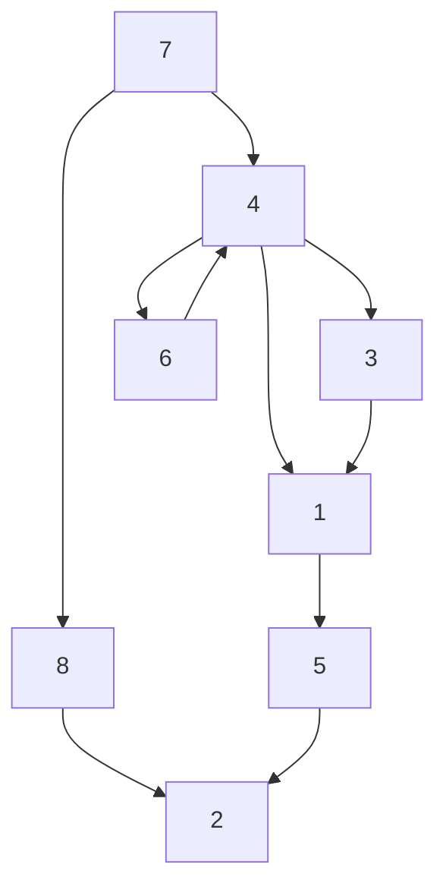
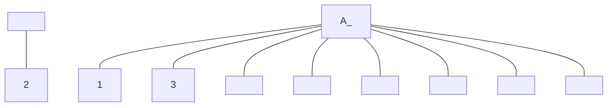
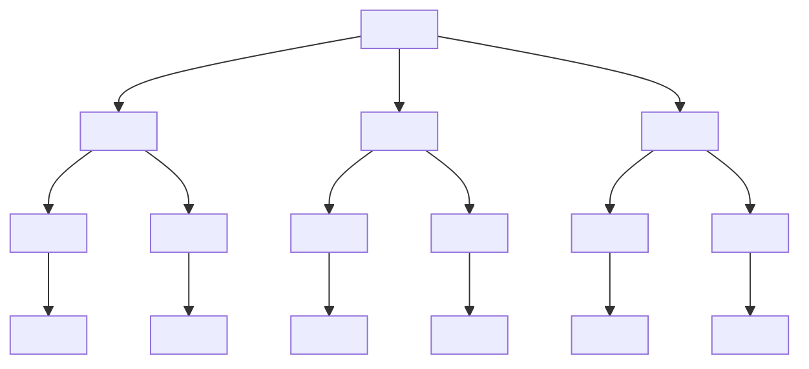
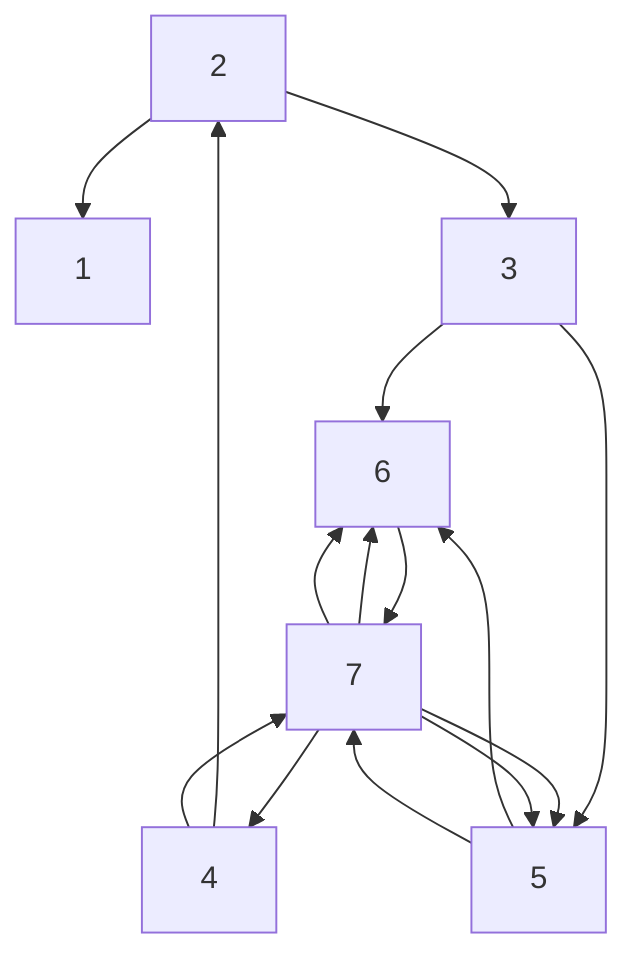
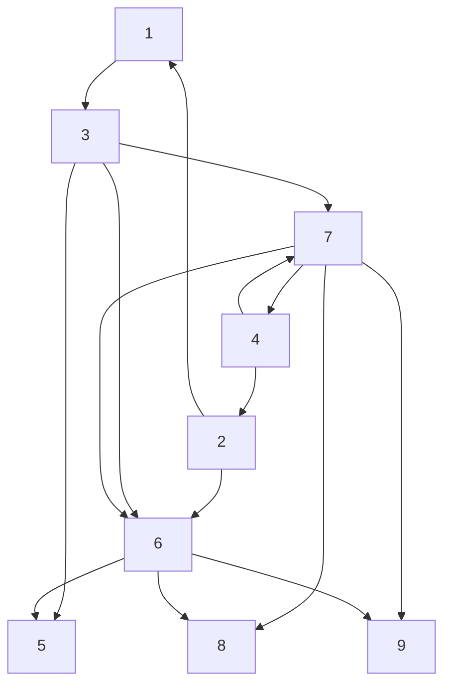
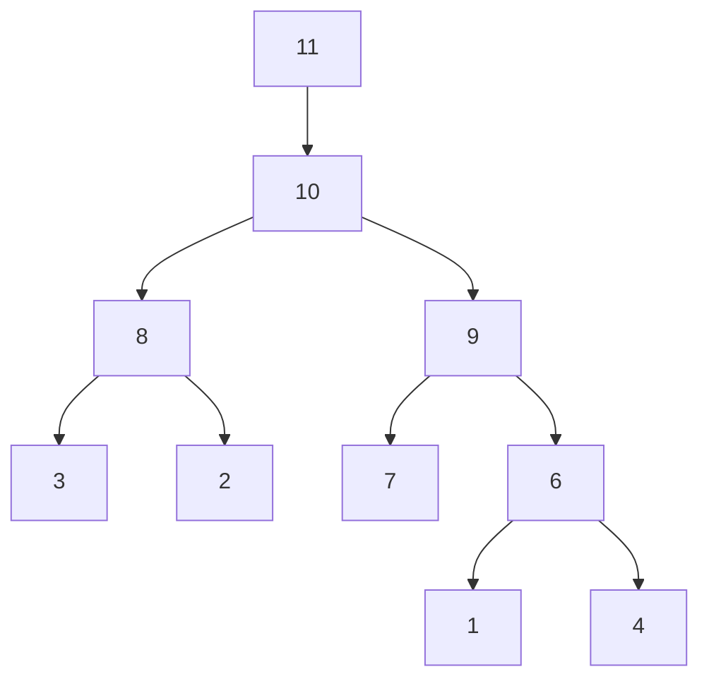
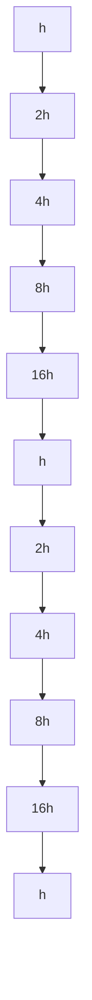

# Chapter 11

# Large Sparse Linear System Problems

11.1 Direct Methods   
11.2 The Classical Iterations   
11.3 The Conjugate Gradient Method   
11.4 Other Krylov Methods   
11.5 Preconditioning   
11.6 The Multigrid Framework

This chapter is about solving linear systems and least squares problems when the matrix in question is so large and sparse that we have to rethink our powerful dense factorization strategies. The basic challenge is to live without the standard 2- dimensional array representation where there is a 1:1 correspondence between matrix entries and storage cells.

There is sometimes sufficient structure to actually compute an LU, Cholesky, or QR factorization by using a sparse matrix data structure and by carefully reordering equations and unknowns to control the fill-in of nonzero entries during the factorization process. Methods of this variety are called direct methods and they are the subject of §11.1. Our treatment is brief, touching only some of the high points of this well-developed area. A deeper presentation requires much more graph theory and implementation-based insight than we can provide in these few pages.

The rest of the chapter is concerned with the iterative method framework. These methods produce a sequence of vectors that typically converge to the solution at a reasonable rate. The matrix A “shows up” only in the context of matrix/vector multiplication. We introduce the strategy in §11.2 through discussion of the “classical” methods of Jacobi, Gauss-Seidel, successive over-relaxation, and Chebyshev. The discrete Poisson problem from §4.8.3 is used to reinforce the major ideas.

Krylov subspace methods are treated in the next two sections. In §11.3 we derive the method of conjugate gradients that is suitable for symmetric positive definite linear systems. The derivation involves the Lanczos process, the method of steepest descent, and the idea of optimizing over a nested sequence of subspaces. Related methods for symmetric indefinite systems, general systems, and least squares problems are covered in §11.4.

It is generally the case that Krylov subspace methods are successful only if there is an effective preconditioner. For a given Ax = b problem this essentially requires the design of a matrix M that has two properties. It must capture key features of A and it must be relatively easy to solve systems of the form $M z = r$ . There are several major families of preconditioners and these are surveyed in §11.5 and §11.6, the latter being dedicated to the mesh-coarsening/multigrid framework.

# Reading Path

An understanding of the basics about LU, Cholesky, and QR factorizations is essential. Eigenvalue theory and functions of matrices have a prominent role to play in the analysis of iterative Ax = b solvers. The Krylov methods make use of the Lanczos and Arnoldi iterations that we developed in Chapter 10.

Within this chapter, there are the following dependencies:

$$
\begin{array}{c c c c c c c c} \S 1 1. 2 & \to & \S 1 1. 3 & \to & \S 1 1. 4 & \to & \S 1 1. 5 \\ \downarrow & & & & & & \\ \S 1 1. 6 & & & & & & \end{array}
$$

§11.1 is independent of the others. The books by Axelsson (ISM), Greenbaum (IMSL), Saad (ISPLA), and van der Vorst (IMK) provide excellent background. The software “templates” volume LIN TEMPLATES (1993) is very useful for its concise presentation of all the major iterative strategies and for the guidance it provides in choosing a suitable method.

# 11.1 Direct Methods

In this section we examine the direct method framework where the goal is to formulate solution procedures that revolve around careful implementation of the Cholesky, QR, and LU factorizations. Central themes, all of which are detailed more fully by Davis (2006), include the importance of ordering to control fill-in, connections to graph theory, and how to reason about performance in the sparse matrix setting.

It should be noted that the band matrix methods discussed in §4.3 and §4.5 are examples of sparse direct methods.

# 11.1.1 Representation

Data structures play an important role in sparse matrix computations. Typically, a real vector is used to house the nonzero entries of the matrix and one or two integer vectors are used to specify their “location.” The compressed-column representation serves as a good illustration. Using a dot-on-grid notation to display sparsity patterns, suppose

text_image

A = 
.

The compressed-column representation stores the nonzero entries column by column in a real vector. If A is the matrix, then we denote this vector by A.val, e.g.,

$$
A. v a l = \boxed {a _ {1 1} \mid a _ {4 1} \mid a _ {5 2} \mid a _ {2 3} \mid a _ {3 3} \mid a _ {6 3} \mid a _ {1 4} \mid a _ {4 4} \mid a _ {2 5} \mid a _ {5 5} \mid a _ {6 5}}.
$$

An integer vector A.c is used to indicate where each column “begins” in A.val:

$$
A. c = \boxed { \begin{array}{c c c c c c} 1 & 3 & 4 & 7 & 9 & 1 2 \end{array} }.
$$

Thus, if $k = A . c ( j ) { : } A . c ( j + 1 ) - 1$ , then $v = A . v a l ( k )$ is the vector of nonzero components of $A ( : , j )$ . By convention, the last component of A.c houses $\boldsymbol { \mathsf { n n z } } ( A ) + 1$ where

$$
\mathfrak {n n z} (A) = \text {   the   number   of   nonzeros   in   } A.
$$

The row indices for the nonzero components in $A ( : , 1 ) , \ldots , A ( : , n )$ are encoded in an integer vector A.r, e.g.,

$$
A. r = \begin{array}{c c c c c c c c c c c c c c c c} \hline 1 & 4 & 5 & 2 & 3 & 6 & 1 & 4 & 2 & 5 & 6 \\ \hline \end{array} .
$$

In general, if $k = A . c ( j ) { : } A . c ( j + 1 ) - 1$ , then $A . v a l ( k ) = A ( A . r ( k ) , j )$ .

Note that the amount of storage required for A.r is comparable to the amount of storage required for the floating-point vector A.val. Index vectors represent one of the overheads that distinguish sparse from conventional dense matrix computations.

# 11.1.2 Operations and Allocations

Consider the gaxpy operation $y = y + A x$ with A in compressed-column format. If A ∈ IRm×n $A \in \mathbb { R } ^ { m \times n }$ and the dense vectors $\boldsymbol { y } \in \mathbb { R } ^ { m }$ and $\boldsymbol { x } \in \mathbb { R } ^ { n }$ are conventionally stored, then

for $j = 1 { : } n$

$$
k = A. c (j): A. c (j + 1) - 1 \tag {11.1.1}
$$

$$
y (A. r (k)) = y (A. r (k)) + A. v a l (k) \cdot x (j)
$$

end

overwrites y with $y + A x$ . It is easy to show that $2 \cdot \mathsf { n n z } ( A )$ flops are required. Regarding memory access, x is referenced sequentially, y is referenced randomly, and A is referenced through A.r and A.c.

A second example highlights the issue of memory allocation. Consider the outerproduct update $\overset { \vartriangle } { \boldsymbol { A } } = \overset { \vartriangle } { \boldsymbol { A } } + \overset { \vartriangle } { \boldsymbol { u } } \boldsymbol { v } ^ { T }$ where $A \in \mathbb { R } ^ { m \times n } , u \in \mathbb { R } ^ { m }$ , and $v \in \mathbb { R } ^ { n }$ are each stored in compressed-column format. In general, the updated A will have more nonzeros than the original A, e.g.,

text_image

Mathematical diagram showing a grid with black dots and an equals sign, followed by a plus sign and a separate grid with black dots.

Thus, unlike dense matrix computations where we simply overwrite A with $A + u v ^ { T }$ without concern for additional storage, now we must increase the memory allocation for A in order to house the result. Moreover, the expansion of the vectors A.val and A.r to accommodate the new nonzero entries is a nontrivial overhead. On the other hand, if we can predict the sparsity structure of $A + u v ^ { T }$ in advance and allocate space accordingly, then the update can be carried out more efficiently. This amounts to storing zeros in locations that are destined to become nonzero, e.g.,

$$
A. v a l = \begin{array}{c c c c c c c c c c c c c c c c} \hline a _ {1 1} & a _ {4 1} & 0 & a _ {5 2} & a _ {2 3} & a _ {3 3} & a _ {6 3} & a _ {1 4} & 0 & a _ {4 4} & 0 & a _ {2 5} & a _ {5 5} & a _ {6 5} \\ \hline \end{array} ,
$$

$$
A. c = \quad \boxed {1} \quad 3 \quad 5 \quad 8 \quad 1 2 \quad 1 5 \quad ,
$$

$$
A. r = \quad \boxed {1} \quad 4 \quad 3 \quad 5 \quad 2 \quad 3 \quad 6 \quad 1 \quad 3 \quad 4 \quad 5 \quad 2 \quad 5 \quad 6 \quad .
$$

With this assumption, the outer product update can proceed as follows:

$$
\text { for } \beta = 1: \mathsf {n n z} (v)
$$

$$
j = v. r (\beta)
$$

$$
\alpha = 1
$$

$$
\text { for } \ell = A. c (j): A. c (j + 1) - 1
$$

$$
\text { if } \alpha \leq \mathsf {n n z} (u) \& \& A. r (\ell) = u. r (\alpha) \tag {11.1.2}
$$

$$
A. v a l (\ell) = A. v a l (\ell) + u. v a l (\alpha) \cdot v. v a l (\beta)
$$

$$
\alpha = \alpha + 1
$$

end end end

Note that A.val() houses $a _ { i j }$ and is updated only if $u _ { i } v _ { j }$ is nonzero. The index α is used to reference the nonzero entries of u and is incremented after every access.

The overall success of a sparse matrix procedure typically depends strongly upon how efficiently it predicts and manages the fill-in phenomenon.

# 11.1.3 Ordering, Fill-In, and the Cholesky Factorization

The first step in the outer-product Cholesky process involves computation of the factorization

$$
A = \left[ \begin{array}{c c} \alpha & v ^ {T} \\ v & B \end{array} \right] = \left[ \begin{array}{c c} \sqrt {\alpha} & 0 \\ v / \sqrt {\alpha} & I \end{array} \right] \left[ \begin{array}{c c} 1 & 0 \\ 0 & A ^ {(1)} \end{array} \right] \left[ \begin{array}{c c} \sqrt {\alpha} & v ^ {T} / \sqrt {\alpha} \\ 0 & I \end{array} \right] \tag {11.1.3}
$$

where

$$
A ^ {(1)} = B - \frac {v v ^ {T}}{\alpha}. \tag {11.1.4}
$$

Recall from §4.2 that this reduction is repeated on the matrix $A ^ { ( 1 ) }$ .

Now suppose A is a sparse matrix. From the standpoint of both arithmetic and memory requirements, we have a vested interest in the sparsity of $A ^ { ( 1 ) }$ . Since B is sparse, everything hinges on the sparsity of the vector v. Here are two examples that dramatize what is at stake:

In Example 1, the vector v associated with the first step is dense and that results in a full A(1). All sparsity is lost and the remaining steps essentially carry out a dense Cholesky factorization. Example 2 tells a happier story. The first v-vector is sparse and the update matrix $A ^ { ( 1 ) }$ has the same “arrow” structure as A. Note that Example 2 can be obtained from Example 1 by a reordering of the form $P A P ^ { T }$ where $P = I _ { n } ( : , n : - 1 : 1 ) )$ ). This motivates the Sparse Cholesky challenge:

<table><tr><td>The Sparse Cholesky Challenge</td></tr><tr><td>Given a symmetric positive definite matrix  $A \in \mathbb{R}^{n \times n}$ , efficiently determine a permutation  $p$  of 1:n so that if  $P = I_n(:, p)$ , then the Cholesky factor in  $A(p, p) = PAP^T = GG^T$  is close to being optimally sparse.</td></tr></table>

Choosing P to actually minimize nnz(G) is a formidable combinatorial problem and is therefore not a viable option. Fortunately, there are several practical procedures based on heuristics that can be used to determine a good reordering permutation P . These include (1) the Cuthill-McKee ordering, (2) the minimum degree ordering, and (3) the nested dissection ordering. However, before we discuss these strategies, we need to present a few concepts from graph theory.

# 11.1.4 Graphs and Sparsity

Here is a sparse symmetric matrix A and its adjacency graph $\mathcal { G } _ { A }$ :

In an adjacency graph for a symmetric matrix, there is a node for each row, numbered by the row number, and there is an edge between node i and node j if the off-diagonal entry $a _ { i j }$ is nonzero. In general, a graph $\mathcal { G } ( V , E )$ is a set of labeled nodes V together with a set of edges E, e.g.,

$$
V = \{1, 2, 3, 4, 5, 6, 7, 8, 9 \},
$$

$$
E = \{(1, 4), (1, 6), (1, 7), (2, 5), (2, 8), (3, 4), (3, 5), (4, 6), (4, 7), (4, 9), (5, 8), (7, 8) \}.
$$

Adjacency graphs for symmetric matrices are undirected. This means there is no difference between edge $( i , j )$ and edge $( j , i )$ . If P is a permutation matrix, then, except for vertex labeling, the adjacency graphs for A and $\bar { P } A P ^ { T }$ “look the same.”

Node i and node j are neighbors if there is an edge between them. The adjacency set for a node is the set of its neighbors and the cardinality of that set is the degree of the node. For the above example we have

<table><tr><td>Node</td><td>1</td><td>2</td><td>3</td><td>4</td><td>5</td><td>6</td><td>7</td><td>8</td><td>9</td></tr><tr><td>Degree</td><td>3</td><td>2</td><td>2</td><td>5</td><td>3</td><td>2</td><td>3</td><td>3</td><td>1</td></tr></table>

Graph theory is a very powerful language that facilitates reasoning about sparse matrix factorizations. Of particular importance is the use of graphs to predict structure, something that is critical to the design of efficient implementations. For a much deeper appreciation of these issues than what we offer below, see George and Liu (1981), Duff, Erisman, and Reid (1986), and Davis (2006).

# 11.1.5 The Cuthill-McKee Ordering

Because bandedness is such a tractable form of sparsity, it is natural to approach the Sparse Cholesky challenge by making $\tilde { A } = P A P ^ { \hat { T } }$ as “banded as possible” subject to cost constraints. However, this is too restrictive as Example 2 in §11.1.3 shows. Profile minimization is a better way to induce good sparsity in G. The profile of a symmetric $A \in \mathbb { R } ^ { n \times n }$ is defined by

$$
\operatorname{profile} (A) = n + \sum_ {i = 1} ^ {n} \left(i - f _ {i} (A)\right)
$$

where the profile indices $f _ { 1 } ( A ) , \ldots , f _ { n } ( A )$ are given by

$$
f _ {i} (A) = \min \{j: 1 \leq j \leq i, a _ {i j} \neq 0 \}. \tag {11.1.6}
$$

For the 9-by-9 example in (11.1.5), profile(A) = 37. We use that matrix to illustrate a heuristic method for approximate profile minimization. The first step is to choose a “starting node” and to relabel it as node 1. For reasons that are given later, we choose node 2 and set $S _ { 0 } = \{ 2 \}$ :

flowchart

Original $\mathcal { G } _ { A }$

flowchart

Simple undirected graph diagram with 8 nodes and 1 label, showing connections and a central node.

Labeled: $S _ { 0 }$

We then proceed to label the remaining nodes as follows:

Label the neighbors of $S _ { 0 }$ . Those neighbors make up $S _ { 1 }$ .

Label the unlabeled neighbors of nodes in $S _ { 1 }$ . Those neighbors make up $S _ { 2 }$

Label the unlabeled neighbors of nodes in $S _ { 2 }$ . Those neighbors make up $S _ { 3 }$ . etc.

If we follow this plan for the example, then $S _ { 1 } = \{ 8 , 5 \} , S _ { 2 } = \{ 7 , 3 \} , S _ { 3 } = \{ 1 , 4 \}$ , and $S _ { 4 } = \{ 6 , 9 \}$ . These are the level sets of node 2 and here is how they are determined one after the other:

flowchart

Labeled: S0, S1

flowchart

Labeled: S0, S1, S2

flowchart

$\mathrm { L a b e l e d } \colon S _ { 0 } , S _ { 1 } , S _ { 2 } , S _ { 3 }$

flowchart

$_ { \mathrm { L a b e l e d : } ~ S _ { 0 } , ~ S _ { 1 } , ~ S _ { 2 } , ~ S _ { 3 } , ~ S _ { 4 } }$

By “concatenating” the level sets we obtain the Cuthill-McKee reordering :

text_image

p: 2 | 8 | 5 | 7 | 3 | 1 | 4 | 6 | 9 .
\underbrace{S_0} _{S_1} \underbrace{S_2} _{S_3} \underbrace{S_4} _{S_4}

Observe the band structure that is induced by this ordering:

text_image

A(p,p) = 
⑨
④
2
1
7
6
3
8
5
(11.1.7)

Note that profile $\left( A ( p , p ) \right) = 2 5$ . Moreover, $A ( p , p )$ is a 5-by-5 block tridiagonal matrix with square diagonal blocks that have dimension equal to the cardinality of the level sets $S _ { 0 } , \ldots , S _ { 4 }$ . This suggests why a good choice for $S _ { 0 }$ is a node that has “far away” neighbors. Such a node will have a relatively large number of level sets and that means the resulting block tridiagonal matrix $A ( p , p )$ will have more diagonal blocks. Heuristically, these blocks will be smaller and that implies a tighter profile. See George and Liu (1981, Chap. 4) for a discussion of this topic and why the reverse Cuthill-McKee ordering $p ( n { : } { - } 1 { : } 1 )$ typically results in less fill-in during the Cholesky process.

# 11.1.6 The Minimum Degree Ordering

Another effective reordering scheme that is easy to motivate starts with the update recipe (11.1.4) and the observation that the vector v at each step should be as sparse as possible. This version of Cholesky with pivoting for $A = G G ^ { T }$ realizes this ambition:

$$
\text { Step   0.   } P = I _ {n}
$$

$$
\text { for } k = 1: n - 2
$$

Step 1. Choose a permutation $P _ { k } \in \mathbb { R } ^ { ( n - k + 1 ) \times ( n - k + 1 ) }$ so that if

$$
P _ {k}   A (k: n, k: n)   P _ {k} ^ {T}   =   \left[ \begin{array}{c c} \alpha & v ^ {T} \\ v & B \end{array} \right]
$$

then v is as sparse as possible

$$
\text { Step   2. } P = \operatorname{diag} (I _ {k - 1}, P _ {k}) \cdot P \tag {11.1.8}
$$

Step 3. Reorder $A ( k { : } n , k { : } n )$ and each previously computed G-column:

$$
A (k: n, k: n) = P _ {k} A (k: n, k: n) P _ {k} ^ {T}
$$

$$
A (k: n, 1: k - 1) = P _ {k} A (k: n, 1: k - 1)
$$

$$
\text {   Step   4.   Compute   } G (k: n, k): A (k: n, k) = A (k: n, k) / \sqrt {A (k , k)}
$$

$$
\text {   Step   5.   Compute   } A ^ {(k)}
$$

$$
A (k + 1: n, k + 1: n) = A (k + 1: n, k + 1: n) - A (k + 1: n, k) A (k + 1: n, k) ^ {T}
$$

end

The ordering that results from this process is the minimum degree ordering. The terminology makes sense because the pivot row in step k is associated with a node in the adjacency graph $\mathcal { G } _ { A ( k : n , k : n ) }$ whose degree is minimal. Note that this is a greedy heuristic approach to the Sparse Cholesky challenge.

A serious overhead associated with the implementation of (11.1.8) concerns the outer-product update in Step 5. The memory allocation discussion in §11.1.2 suggests that we could make a more efficient procedure if we knew in advance the sparsity structure of the minimum degree Cholesky factor. We could replace Step 0 with

Step $0 ^ { \prime }$ . Determine the minimum degree permutation $p _ { { M D } }$ and represent

$A ( p _ { \ / { M D } } , p _ { \ / { M D } } )$ with “placeholder” zeros in those locations that fill in.

This would make Steps 1–3 unnecessary and obviate memory requests in Step 5. Moreover, it can happen that a collection of problems need to be solved each with the same sparsity structure. In this case, a single Step $0 ^ { \prime }$ works for the entire collection thereby amortizing the overhead. It turns out that very efficient $0 ^ { \prime }$ procedures have been developed. The basic idea revolves around the intelligent exploitation of two facts that completely characterize the sparsity of the Cholesky factor in $A = G G ^ { T }$ :

Fact 1: If $j \le i$ and $a _ { i j }$ is nonzero, then $g _ { i j }$ is nonzero assuming no numerical cancellation.

Fact 2: If $g _ { i k }$ and $g _ { j k }$ are nonzero and $k < j < i$ , then $g _ { i j }$ is nonzero assuming no numerical cancellation. See Parter (1961).

The caveats about no numerical cancellation are required because it is possible for an entry in $G$ to be “luckily zero.” For example, Fact 1 follows from the formula

$$
g _ {i j} = \left(a _ {i j} - \sum_ {k = 1} ^ {j - 1} g _ {i k} g _ {j k}\right) \bigg / g _ {j j},
$$

with the assumption that the summation does not equal $a _ { i j }$

The systematic use of Facts 1 and 2 to determine $G \mathrm { { s } }$ sparsity structure is complicated and involves the construction of an elimination tree (e-tree). Here is an example taken from the detailed presentation by Davis (2006, Chap. 4):

text_image

Grid pattern with black dots arranged in a 5x5 pattern, resembling a puzzle or game board.

The matrix A

text_image

Grid-based puzzle or game board with black and white stones arranged in a 3x3 pattern

A’s Cholesky factor

flowchart

A’s elimination tree

The $^ { 6 6 } \otimes ^ { 9 9 }$ entries are nonzero because of Fact 2. For example, $g _ { 7 6 }$ is nonzero because $g _ { 6 1 }$ and $g _ { 7 1 }$ are nonzero. The e-tree captures critical location information. In general, the parent of node i identifies the row of the first subdiagonal nonzero in column i. By encoding this kind of information, the e-tree can be used to answer various path-ingraph questions that relate to fill-in. In addition, the leaf nodes correspond to those columns that can be eliminated independently in a parallel implementation.

# 11.1.7 Nested Dissection Orderings

Suppose we have a method to determine a permutation $P _ { 0 }$ so that $P _ { 0 } A P _ { 0 } ^ { T }$ has the following block structure:

$$
P _ {0} A P _ {0} ^ {T} = \left[ \begin{array}{c c c} A _ {1} & 0 & C _ {1} \\ 0 & A _ {2} & C _ {2} \\ C _ {1} ^ {T} & C _ {2} ^ {T} & S \end{array} \right] = \left[ \begin{array}{c c c} \square & & \square \\ \square & & \\ & \square & \square \\ & \square & \\ \square & \square & \square \end{array} \right].
$$

Through the schematic we are stating ${ } ^ { 6 6 } A _ { 1 }$ and $A _ { 2 }$ are square and roughly the same size and $C _ { 1 }$ and $C _ { 2 }$ are relatively thin.” Let us refer to this maneuver as a “successful dissection.” Suppose $P _ { 1 1 } A _ { 1 } P _ { 1 1 } ^ { T }$ and $P _ { 2 2 } A _ { 2 } P _ { 2 2 } ^ { T }$ are also successful dissections. If $P =$ diag $( P _ { 1 1 } , P _ { 2 2 } , I ) \cdot P _ { 0 }$ , then

$$
P A P ^ {T} = \left[ \begin{array}c c c c c c c c c c c c c c c c c c c c c c c c c c c c c c c c c c c c c c c c c c c c c c c c c c c c c c c c c c c c c c c c c c c c c c c c c c c c c c c c c c c c c c c c c c c c c c c c c c c c c c c c c c c c c c c c c c c c c c c c c c c c c c c c c c c c c c c c c c c c c c c c c c c c c c c c c c c c c c c c c c c c c c c c c c c c c c c c c c c c c c c c c c c c c c c c c c c c c c c c c c c c c c c c c c c c c c c c c c c c c c c c c c c c c c c c c c c c c c c c c c c c c c c c c c c c c c c c c c c c c c c c c c c c c c c c c c c c c c c c c c c c c c c c c c c c c c c c c c c c c c c c c c c c c c c c c c c c c c c c c c c c c c c c c c c c c c c c c c c c c c c c c c c c c c c c c c c c c c c c c c c c c c c c c c c c c c c c c c c c c c c c c c c c c c c c c c c c c c c c c c c c c c c c c c c c c c c c c c c c c c c c c c c c c c c c c c c c c c c c c c c c c c c c c c c c c c c c c c c c c c c c c c c c c c c c c c c c c c c c c c c c c c c c c c c c c c c c c c c c c c c c c c c c c c c c c c c c c c c c c c c c c c c c c c c c c c c c c c c c c c c c c c c c c c c c c c c c c c c c c c c c c c c c c c c c c c c c c c c c c c c c c c c c c c c c c c c c c c c c c c c c c c c c c c c c c c c c c c c c c c c c c c c c c c c c c c c c c c c c c c c c c c c c c c c c c c c c c c c c c c c c c c c c c c c c c c c c c c c c c c c c c c c c c c c c c c c c c c c c c c c c c c c c c c c c c c c c c c c c c c c c c c c c c c c c c c c c c c c c c c c c c c c c c c c c c c c c c c c c c c c c c c c c c c c c c c c c c c c c c c c c c c c c c c c c c c c c c c c c c c c c c c c c c c c c c c c c c c c c c c c c c c c c c c c c c c c c c c c c c c c c c c c c c c c c c c c c c c c c c c c c c c c c c c c c c c c c c c c c c c c c c c c c c c c c c c c c c c c c c c c c c c c c c c c c c c c c c c c c c c c c c c c c c c c c c c c c c c c c c c c c c c c c c c c c c c c c c c c c c c c c c c c c c c c c c c c c c c c c c c c c c c c c c c c c c c c c c c c c c c c c c c c c c c c c c c c c c c c c c c c c c c c c c c c c c c c c c c c c c c c c c c c c c c c c c c c c c c c c c c c c c c c c c c c c c c c c c c c c c c c c c c c c c c c c c c c c c c c c c c c c c c c c c c c c c c c c c c c c c c c c c c c c c c c c c c c c c c c c c c c c c c c c c c c c c c c c c c c c c c c c c c c c c c c c c c c c c c c c c c c c c c c c c c c c c c c c c c c c c c c c c c c c c c c c c c c c c c c c c c c c c c c c c c c c c c c c c c c c c c c c c c c c c c c c c c c c c c c c c c c c c c c c c c c c c c c c c c c c c c c c c c c c c c c c c c c c c c c c c c c c c c c c c c c c c c c c c c c c c c c c c c c c c c c c c c c c c c c c c c c c c c c c c c c c c c c c c c c c c c c c c c c c c c c c c c c c c c c c c c c c c c c c c c c c c c c c c c c c c c c c c c c c c c c c c c c c c c c c c c c c c c c c c c c c c c c c c c c c c c c c c c c c c c c c c c c c c c c c c c c c c c c c c c c c c c c c c c c c c c c c c c c c c c c c c c c c c c c c c c c c c c c c c c c c c c c c c c c c c c c c c c c c c c c c c c c c c c c c c c c c c c c c c c c c c c c c c c c c c c c c c c c c c c c c c c c c c c c c c c c c c c c c c c c c c c c c c c c c c c c c c c c c c c c c c c c c c c c c c c c c c c c c c c c c c c c c c c c c c c c c c c c c c c c c c c c c c c c c c c c c c c c c c c c c c c c c c c c c c c c c c c c c c c c c c c c c c c c c c c c c c c c c c c c c c c c c c c c c c c c c c c c c c c c c c c c c c c c c c c c c c c c c c c c c c c c c c c c c c c c c c c c c c c c c c c c c c c c c c c c c c c c c c c c c c c c c c c c c c c c c c c c c c c c c c c c c c c c c c c c c c c c c c c c c c c c c c c c c c c c c c c c c c c c c c c c c c c c c c c c c c c c c c c c c c c c c c c c c c c c c c c c c c c c c c c c c c c c c c c c c c c c c c c c c c c c c c c c c c c c c c c c c c c c c c c c c c c c c c c c c c c c c c c c c c c c c c c c c c c c c c c c c c c c c c c c c c c c c c c c c c c c c c c c c c c c c c c c c c c c c c c c c c c c c c c c c c c c c c c c c c c c c c c c c c c c c c c c c c c c c c c c c c c c c c c c c c c c c c c c c c c c c c c c c c c c c c c c c c c c c c c c c c c c c c c c c c c c c c c c c c c c c c c c c c c c c c c c c c c c c c c c c c c c c c c c c c c c c c c c c c c c c c c c c c c c c c c c c c c c c c c c c c c c c c c c c c c c c c c c c c c c c c c c c c c c c c c c c c c c c c c c c c c c c c c c c c c c c c c c c c c c c c c c c c c c c c c c c c c c c c c c c c c c c c c c c c c c c c c c c c c c c c c c c c c c c c c c c c c c c c c c c c c c c c c c c c c c c c c c c c c c c c c c c c c c c c c c c c c c c c c c c c c c c c c c c c c c c c c c c c c c c c c c c c c c c c c c c c c c c c c c c c c c c c c c c c c c c c c c c c c c c c c c c c c c c c c c c c c c c c c c c c c c c c c c c c c c c c c c c c c c c c c c c c c c c c c c c c c c c c c c c c c c c c c c c c c c c c c c c c c c c c c c c c c c c c c c c c c c c c c c c c c c c c c c c c c c c c c c c c c c c c c c c c c c c c c c c c c c c c c c c c c c c c c c c c c c c c c c c c c c c c c c c c c c c c c c c c c c c c c c c c c c c c c c c c c c c c c c c c c c c c c c c c c c c c c c c c c c c c c c c c c c c c c c c c c c c c c c c c c c c c c c c c c c c c c c c c c c c c c c c c c c c c c c c c c c c c c c c c c c c c c c c c c c c c c c c c c c c c c c c c c c c c c c c c c c c c c c c c c c c c c c c c c c c c c c c c c c c c c c c c c c c c c c c c c c c c c c c c c c c c c c c c c c c c c c c c c c c c c c c c c c c c c c c c c c c c c c c c c c c c c c c c c c c c c c c c c c c c c c c c c c c c c c c c c c c c c c c c c c c c c c c c c c c c c c c c c c c c c c c c c c c c c c c c c c c c c c c c c c c c c c c c c c c c c c c c c c c c c c c c c c c c c c c c c c c c c c c c c c c c c c c c c c c c c c c c c c c c c c c c c c c c c c c c c c c c c c c c c c c c c c c c c c c c c c c c c c c c c c c c c c c c c c c c c c c c c c c c c c c c c c c c c c c c c c c c c c c c c c c c c c c c c c c c c c c c c c c c c c c c c c c c c c c c c c c c c c c c c c c c c c c c c c c c c c c c c c c c c c c c c c c c c c c c c c c c c c c c c c c c c c c c c c c c c c c c c c c c c c c c c c c c c c c c c c c c c c c c c c c c c c c c c c c c c c c c c c c c c c c c c c c c c c c c c c c c c c c c c c c c c c c c c c c c c c c c c c c c c c c c c c c c c c c c c c c c c c c c c c c c c c c c c c c c c c c c c c c c c c c c c c c c c c c c c c c c c c c c c c c c c c c c c c c c c c c c c c c c c c c c c c c c c c c c c c c c c c c c c c c c c c c c c c c c c c c c c c c c c c c c c c c c c c c c c c c c c c c c c c c c c c c c c c c c c c c c c c c c c c c c c c c c c c c c c c c c c c c c c c c c c c c c c c c c c c c c c c c c c c c c c c c c c c c c c c c c c c c c c c c c c c c c c c c c c c c c c c c c c c c c c c c c c c c c c c c c c c c c c c c c c c c c c c c c c c c c c c c c c c c c c c c c c c c c c c c c c c c c c c c c c c c c c c c c c c c c c c c c c c c c c c c c c c c c c c c c c c c c c c c c c c c c c c c c c c c c c c c c c c c c c c c c c c c c c c c c c c c c c c c c c c c c c c c c c c c c c c c c c c c c c c c c c c c c c c c c c c c c c c c c c c c c c c c c c c c c c c c c c c c c c c c c c c c c c c c c c c c c c c c c c c c c c c c c c c c c c c c c c c c c c c c c c c c c c c c c c c c c c c c c c c c c c c c c c c c c c c c c c c c c c c c c c c c c c c c c c c c c c c c c c c c c c c c c c c c c c c c c c c c c c c c c c c c c c c c c c c c c c c c c c c c c c c c c c c c c c c c c c c c c c c c c c c c c c c c c c c c c c c c c c c c c c c c c c c c c c c c c c c c c c c c c c c c c c c c c c c c c c c c c c c c c c c c c c c c c c c c c c c c c c c c c c c c c c c c c c c c c c c c c c c c c c c c c c c c c c c c c c c c c c c c c c c c c c c c c c c c c c c c c c c c c c c c c c c c c c c c c c c c c c c c c c c c c c c c c c c c c c c c c c c c c c c c c c c c c c c c c c c c c c c c c c c c c c c c c c c c c c c c c c c c c c c c c c c c c c c c c c c c c c c c c c c c c c c c c c c c c c c c c c c c c c c c c c c c c c c c c c c c c c c c c c c c c c c c c c c c c c c c c c c c c c c c c c c c c c c c c c c c c c c c c c c c c c c c c c c c c c c c c c c c c c c c c c c c c c c c c c c c c c c c c c c c c c c c c c c c c c c c c c c c c c c c c c c c c c c c c c c c c c c c c c c c c c c c c c c c c c c c c c c c c c c c c c c c c c c c c c c c c c c c c c c c c c c c c c c c c c c c c c c c c c c c c c c c c c c c c c c c c c c c c c c c c c c c c c c c c c c c c c c c c c c c c c c c c c c c c c c c c c c c c c c c c c c c c c c c c c c c c c c c c c c c c c c c c c c c c c c c c c c c c c c c c c c c c c c c c c c c c c c c c c c c c c c c c c c c c c c c c c c c c c c c c c c c c c c c c c c c c c c c c c c c c c c c c c c c c c c c c c c c c c c c c c c c c c c c c c c c c c c c c c c c c c c c c c c c c c c c c c c c c c c c c c c c c c c c c c c c c c c c c c c c c c c c c c c c c c c c c c c c c c c c c c c c c c c c c c c c c c c c c c c c c c c c c c c c c c c c c c c c c c c c c c c c c c c c c c c c c c c c c c c c c c c c c c c c c c c c c c c c c c c c c c c c c c c c c c c c c c c c c c c c c c c c c c c c c c c c c c c c c c c c c c c c c c c c c c c c c c c c c c c c c c c c c c c c c c c c c c c c c c c c c c c c c c c c c c c c c c c c c c c c c c c c c c c c c c c c c c c c c c c c c c c c c c c c c c c c c c c c c c c c c c c c c c c c c c c c c c c c c c c c c c c c c c c c c c c c c c c c c c c c c c c c c c c c c c c c c c c c c c c c c c c c c c c c c c c c c c c c c c c c c c c c c c c c c c c c c c c c c c c c c c c c c c c c c c c c c c c c c c c c c c c c c c c c c c c c c c c c c c c c c c c c c c c c c c c c c c c c c c c c c c c c c c c c c c c c c c c c c c c c c c c c c c c c c c c c c c c c c c c c c c c c c c c c c c c c c c c c c c c c c c c c c c c c c c c c c c c c c c c c c c c c c c c c c c c c c c c c c c c c c c c c c c c c c c c c c c c c c c c c c c c c c c c c c c c c c c c c c c c c c c c c c c c c c c c c c c c c c c c c c c c c c c c c c c c c c c c c c c c c c c c c c c c c c c c c c c c c c c c c c c c c c c c c c c c c c c c c c c c c c c c c c c c c c c c c c c c c c c c c c c c c c c c c c c c c c c c c c c c c c c c c c c c c c c c c c c c c c c c c c c c c c c c c c c c c c c c c c c c c c c c c c c c c c c c c c c c c c c c c c c c c c c c c c c c c c c c c c c c c c c c c c c c c c c c c c c c c c c c c c c c c c c c c c c c c c c c c c c c c c c c c c c c c c c c c c c c c c c c c c c c c c c c c c c c c c c c c c c c c c c c c c c c c c c c c c c c c c c c c c c c c c c c c c c c c c c c c c c c c c c c c c c c c c c c c c c c c c c c c c c c c c c c c c c c c c c c c c c c c c c c c c c c c c c c c c c c c c c c c c c c c c c c c c c c c c c c c c c c c c c c c c c c c c c c c c c c c c c c c c c c c c c c c c c c c c c c c c c c c c c c c c c c c c c c c c c c c c c c c c c c c c c c c c c c c c c c c c c c c c c c c c c c c c c c c c c c c c c c c c c c c c c c c c c c c c c c c c c c c c c c c c c c c c c c c c c c c c c c c c c c c c c c c c c c c c c c c c c c c c c c c c c c c c c c c c c c c c c c c c c c c c c c c c c c c c c c c c c c c c c c c c c c c c c c c c c c c c c c c c c c c c c c c c c c c c c c c c c c c c c c c c c c c c c c c c c c c c c c c c c c c c c c c c c c c c c c c c c c c c c c c c c c c c c c c c c c c c c c c c c c c c c c c c c c c c c c c c c c c c c c c c c c c c c c c c c c c c c c c c c c c c c c c c c c c c c c c c c c c c c c c c c c c c c c c c c c c c c c c c c c c c c c c c c c c c c c c c c c c c c c c c c c c c c c c c c c c c c c c c c c c c c c c c c c c c c c c c c c c c c c c c c c c c c c c c c c c c c c c c c c c c c c c c c c c c c c c c c c c c c c c c c c c c c c c c c c c c c c c c c c c c c c c c c c c c c c c c c c c c c c c c c c c c c c c c c c c c c c c c c c c c c c c c c c c c c c c c c c c c c c c c c c c c c c c c c c c c c c c c c c c c c c c c c c c c c c c c c c c c c c c c c c c c c c c c c c c c c c c c c c c c c c c c c c c c c c c c c c c c c c c c c c c c c c c c c c c c c c c c c c c c c c c c c c c c c c c c c c c c c c c c c c c c c c c c c c c c c c c c c c c c c c c c c c c c c c c c c c c c c c c c c c c c c c c c c c c c c c c c c c c c c c c c c c c c c c c c c c c c c c c c c c c c c c c c c c c c c c c c c c c c c c c c c c c c c c c c c c c c c c c c c c c c c c c c c c c c c c c c c c c c c c c c c c c c c c c c c c c c c c c c c c c c c c c c c c c c c c c c c c c c c c c c c c c c c c c c c c c c c c c c c c c c c c c c c c c c c c c c c c c c c c c c c c c c c c c c c c c c c c c c c c c c c c c c c c c c c c c c c c c c c c c c c c c c c c c c c c c c c c c c c c c c c c c c c c c c c c c c c c c c c c c c c c c c c c c c c c c c c c c c c c c c c c c c c c c c c c c c c c c c c c c c c c c c c c c c c c c c c c c c c c c c c c c c c c c c c c c c c c c c c c c c c c c c c c c c c c c c c c c c c c c c c c c c c c c c c c c c c c c c c c c c c c c c c c c c c c c c c c c c c c c c c c c c c c c c c c c c c c c c c c c c c c c c c c c c c c c c c c c c c c c c c c c c c c c c c c c c c c c c c c c c c c c c c c c c c c c c c c c c c c c c c c c c c c c c c c c c c c c c c c c c c c c c c c c c c c c c c c c c c c c c c c c c c c c c c c c c c c c c c c c c c c c c c c c c c c c c c c c c c c c c c c c c c c c c c c c c c c c c c c c c c c c c c c c c c c c c c c c c c c c c c c c c c c c c c c c c c c c c c c c c c c c c c c c c c c c c c c c c c c c c c c c c c c c c c c c c c c c c c c c c c c c c c c c c c c c c c c c c c c c c c c c c c c c c c c c c c c c c c c c c c c c c c c c c c c c c c c c c c c c c c c c c c c c c c c c c c c c c c c c c c c c c c c c c c c c c c c c c c c c c c c c c c c c c c c c c c c c c c c c c c c c c c c c c c c c c c c c c c c c c c c c c c c c c c c c c c c c c c c c c c c c c c c c c c c c c c c c c c c c c c c c c c c c c c c c c c c c c c c c c c c c c c c c c c c c c c c c c c c c c c c c c c c c c c c c c c c c c c c c c c c c c c c c c c c c c c c c c c c c c c c c c c c c c c c c c c c c c c c c c c c c c c c c c c c c c c c c c c c c c c c c c c c c c c c c c c c c c c c c c c c c c c c c c c c c c c c c c c c c c c c c c c c c c c c c c c c c c c c c c c c c c c c c c c c c c c c c c c c c c c c c c c c c c c c c c c c c c c c c c c c c c c c c c c c c c c c c c c c c c c c c c c c c c c c c c c c c c c c c c c c c c c c c c c c c c c c c c c c c c c c c c c c c c c c c c c c c c c c c c c c c c c c c c c c c c c c c c c c c c c c c c c c c c c c c c c c c c c c c c c c c c c c c c c c c c c c c c c c c c c c c c c c c c c c c c c c c c c c c c c c c c c c c c c c c c c c c c c c c c c c c c c c c c c c c c c c c c c c c c c c c c c c c c c c c c c c c c c c c c c c c c c c c c c c c c c c c c c c c c c c c c c c c c c c c c c c c c c c c c c c c c c c c c c c c c c c c c c c c c c c c c c c c c c c c c c c c c c c c c c c c c c c c c c c c c c c c c c c c c c c c c c c c c c c c c c c c c c c c c c c c c c c c c c c c c c c c c c c c c c c c c c c c c c c c c c c c c c c c c c c c c c c c c c c c c c c c c c c c c c c c c c c c c c c c c c c c c c c c c c c c c c c c c c c c c c c c c c c c c c c c c c c c c c c c c c c c c c c c c c c c c c c c c c c c c c c c c c c c c c c c c c c c c c c c c c c c c c c c c c c c c c c c c c c c c c c c c c c c c c c c c c c c c c c c c c c c c c c c c c c c c c c c c c c c c c c c c c c c c c c c c c c c c c c c c c c c c c c c c c c c c c c c c c c c c c c c c c c c c c c c c c c c c c c c c c c c c c c c c c c c c c c c c c c c c c c c c c c c c c c c c c c c c c c c c c c c c c c c c c c c c c c c c c c c c c c c c c c c c c c c c c c c c c c c c c c c c c c c c c c c c c c c c c c c c c c c c c c c c c c c c c c c c c c c c c c c c c c c c c c c c c c c c c c c c c c c c c c c c c c c c c c c c c c c c c c c c c c c c c c c c c c c c c c c c c c c c c c c c c c c c c c c c c c c c c c c c c c c c c c c c c c c c c c c c c c c c c c c c c c c c c c c c c c c c c c c c c c c c c c c c c c c c c c c c c c c c c c c c c c c c c c c c c c c c c c c c c c c c c c c c c c c c c c c c c c c c c c c c c c c c c c c c c c c c c c c c c c c c c c c c c c c c c c
$$

The process can obviously be repeated on each of the four big diagonal blocks. Note that the Cholesky factor inherits the recursive block structure

$$
G = \left[ \begin{array}c c c c c c c c c c c c c c c c c c c c c c c c c c c c c c c c c c c c c c c c c c c c c c c c c c c c c c c c c c c c c c c c c c c c c c c c c c c c c c c c c c c c c c c c c c c c c c c c c c c c c c c c c c c c c c c c c c c c c c c c c c c c c c c c c c c c c c c c c c c c c c c c c c c c c c c c c c c c c c c c c c c c c c c c c c c c c c c c c c c c c c c c c c c c c c c c c c c c c c c c c c c c c c c c c c c c c c c c c c c c c c c c c c c c c c c c c c c c c c c c c c c c c c c c c c c c c c c c c c c c c c c c c c c c c c c c c c c c c c c c c c c c c c c c c c c c c c c c c c c c c c c c c c c c c c c c c c c c c c c c c c c c c c c c c c c c c c c c c c c c c c c c c c c c c c c c c c c c c c c c c c c c c c c c c c c c c c c c c c c c c c c c c c c c c c c c c c c c c c c c c c c c c c c c c c c c c c c c c c c c c c c c c c c c c c c c c c c c c c c c c c c c c c c c c c c c c c c c c c c c c c c c c c c c c c c c c c c c c c c c c c c c c c c c c c c c c c c c c c c c c c c c c c c c c c c c c c c c c c c c c c c c c c c c c c c c c c c c c c c c c c c c c c c c c c c c c c c c c c c c c c c c c c c c c c c c c c c c c c c c c c c c c c c c c c c c c c c c c c c c c c c c c c c c c c c c c c c c c c c c c c c c c c c c c c c c c c c c c c c c c c c c c c c c c c c c c c c c c c c c c c c c c c c c c c c c c c c c c c c c c c c c c c c c c c c c c c c c c c c c c c c c c c c c c c c c c c c c c c c c c c c c c c c c c c c c c c c c c c c c c c c c c c c c c c c c c c c c c c c c c c c c c c c c c c c c c c c c c c c c c c c c c c c c c c c c c c c c c c c c c c c c c c c c c c c c c c c c c c c c c c c c c c c c c c c c c c c c c c c c c c c c c c c c c c c c c c c c c c c c c c c c c c c c c c c c c c c c c c c c c c c c c c c c c c c c c c c c c c c c c c c c c c c c c c c c c c c c c c c c c c c c c c c c c c c c c c c c c c c c c c c c c c c c c c c c c c c c c c c c c c c c c c c c c c c c c c c c c c c c c c c c c c c c c c c c c c c c c c c c c c c c c c c c c c c c c c c c c c c c c c c c c c c c c c c c c c c c c c c c c c c c c c c c c c c c c c c c c c c c c c c c c c c c c c c c c c c c c c c c c c c c c c c c c c c c c c c c c c c c c c c c c c c c c c c c c c c c c c c c c c c c c c c c c c c c c c c c c c c c c c c c c c c c c c c c c c c c c c c c c c c c c c c c c c c c c c c c c c c c c c c c c c c c c c c c c c c c c c c c c c c c c c c c c c c c c c c c c c c c c c c c c c c c c c c c c c c c c c c c c c c c c c c c c c c c c c c c c c c c c c c c c c c c c c c c c c c c c c c c c c c c c c c c c c c c c c c c c c c c c c c c c c c c c c c c c c c c c c c c c c c c c c c c c c c c c c c c c c c c c c c c c c c c c c c c c c c c c c c c c c c c c c c c c c c c c c c c c c c c c c c c c c c c c c c c c c c c c c c c c c c c c c c c c c c c c c c c c c c c c c c c c c c c c c c c c c c c c c c c c c c c c c c c c c c c c c c c c c c c c c c c c c c c c c c c c c c c c c c c c c c c c c c c c c c c c c c c c c c c c c c c c c c c c c c c c c c c c c c c c c c c c c c c c c c c c c c c c c c c c c c c c c c c c c c c c c c c c c c c c c c c c c c c c c c c c c c c c c c c c c c c c c c c c c c c c c c c c c c c c c c c c c c c c c c c c c c c c c c c c c c c c c c c c c c c c c c c c c c c c c c c c c c c c c c c c c c c c c c c c c c c c c c c c c c c c c c c c c c c c c c c c c c c c c c c c c c c c c c c c c c c c c c c c c c c c c c c c c c c c c c c c c c c c c c c c c c c c c c c c c c c c c c c c c c c c c c c c c c c c c c c c c c c c c c c c c c c c c c c c c c c c c c c c c c c c c c c c c c c c c c c c c c c c c c c c c c c c c c c c c c c c c c c c c c c c c c c c c c c c c c c c c c c c c c c c c c c c c c c c c c c c c c c c c c c c c c c c c c c c c c c c c c c c c c c c c c c c c c c c c c c c c c c c c c c c c c c c c c c c c c c c c c c c c c c c c c c c c c c c c c c c c c c c c c c c c c c c c c c c c c c c c c c c c c c c c c c c c c c c c c c c c c c c c c c c c c c c c c c c c c c c c c c c c c c c c c c c c c c c c c c c c c c c c c c c c c c c c c c c c c c c c c c c c c c c c c c c c c c c c c c c c c c c c c c c c c c c c c c c c c c c c c c c c c c c c c c c c c c c c c c c c c c c c c c c c c c c c c c c c c c c c c c c c c c c c c c c c c c c c c c c c c c c c c c c c c c c c c c c c c c c c c c c c c c c c c c c c c c c c c c c c c c c c c c c c c c c c c c c c c c c c c c c c c c c c c c c c c c c c c c c c c c c c c c c c c c c c c c c c c c c c c c c c c c c c c c c c c c c c c c c c c c c c c c c c c c c c c c c c c c c c c c c c c c c c c c c c c c c c c c c c c c c c c c c c c c c c c c c c c c c c c c c c c c c c c c c c c c c c c c c c c c c c c c c c c c c c c c c c c c c c c c c c c c c c c c c c c c c c c c c c c c c c c c c c c c c c c c c c c c c c c c c c c c c c c c c c c c c c c c c c c c c c c c c c c c c c c c c c c c c c c c c c c c c c c c c c c c c c c c c c c c c c c c c c c c c c c c c c c c c c c c c c c c c c c c c c c c c c c c c c c c c c c c c c c c c c c c c c c c c c c c c c c c c c c c c c c c c c c c c c c c c c c c c c c c c c c c c c c c c c c c c c c c c c c c c c c c c c c c c c c c c c c c c c c c c c c c c c c c c c c c c c c c c c c c c c c c c c c c c c c c c c c c c c c c c c c c c c c c c c c c c c c c c c c c c c c c c c c c c c c c c c c c c c c c c c c c c c c c c c c c c c c c c c c c c c c c c c c c c c c c c c c c c c c c c c c c c c c c c c c c c c c c c c c c c c c c c c c c c c c c c c c c c c c c c c c c c c c c c c c c c c c c c c c c c c c c c c c c c c c c c c c c c c c c c c c c c c c c c c c c c c c c c c c c c c c c c c c c c c c c c c c c c c c c c c c c c c c c c c c c c c c c c c c c c c c c c c c c c c c c c c c c c c c c c c c c c c c c c c c c c c c c c c c c c c c c c c c c c c c c c c c c c c c c c c c c c c c c c c c c c c c c c c c c c c c c c c c c c c c c c c c c c c c c c c c c c c c c c c c c c c c c c c c c c c c c c c c c c c c c c c c c c c c c c c c c c c c c c c c c c c c c c c c c c c c c c c c c c c c c c c c c c c c c c c c c c c c c c c c c c c c c c c c c c c c c c c c c c c c c c c c c c c c c c c c c c c c c c c c c c c c c c c c c c c c c c c c c c c c c c c c c c c c c c c c c c c c c c c c c c c c c c c c c c c c c c c c c c c c c c c c c c c c c c c c c c c c c c c c c c c c c c c c c c c c c c c c c c c c c c c c c c c c c c c c c c c c c c c c c c c c c c c c c c c c c c c c c c c c c c c c c c c c c c c c c c c c c c c c c c c c c c c c c c c c c c c c c c c c c c c c c c c c c c c c c c c c c c c c c c c c c c c c c c c c c c c c c c c c c c c c c c c c c c c c c c c c c c c c c c c c c c c c c c c c c c c c c c c c c c c c c c c c c c c c c c c c c c c c c c c c c c c c c c c c c c c c c c c c c c c c c c c c c c c c c c c c c c c c c c c c c c c c c c c c c c c c c c c c c c c c c c c c c c c c c c c c c c c c c c c c c c c c c c c c c c c c c c c c c c c c c c c c c c c c c c c c c c c c c c c c c c c c c c c c c c c c c c c c c c c c c c c c c c c c c c c c c c c c c c c c c c c c c c c c c c c c c c c c c c c c c c c c c c c c c c c c c c c c c c c c c c c c c c c c c c c c c c c c c c c c c c c c c c c c c c c c c c c c c c c c c c c c c c c c c c c c c c c c c c c c c c c c c c c c c c c c c c c c c c c c c c c c c c c c c c c c c c c c c c c c c c c c c c c c c c c c c c c c c c c c c c c c c c c c c c c c c c c c c c c c c c c c c c c c c c c c c c c c c c c c c c c c c c c c c c c c c c c c c c c c c c c c c c c c c c c c c c c c c c c c c c c c c c c c c c c c c c c c c c c c c c c c c c c c c c c c c c c c c c c c c c c c c c c c c c c c c c c c c c c c c c c c c c c c c c c c c c c c c c c c c c c c c c c c c c c c c c c c c c c c c c c c c c c c c c c c c c c c c c c c c c c c c c c c c c c c c c c c c c c c c c c c c c c c c c c c c c c c c c c c c c c c c c c c c c c c c c c c c c c c c c c c c c c c c c c c c c c c c c c c c c c c c c c c c c c c c c c c c c c c c c c c c c c c c c c c c c c c c c c c c c c c c c c c c c c c c c c c c c c c c c c c c c c c c c c c c c c c c c c c c c c c c c c c c c c c c c c c c c c c c c c c c c c c c c c c c c c c c c c c c c c c c c c c c c c c c c c c c c c c c c c c c c c c c c c c c c c c c c c c c c c c c c c c c c c c c c c c c c c c c c c c c c c c c c c c c c c c c c c c c c c c c c c c c c c c c c c c c c c c c c c c c c c c c c c c c c c c c c c c c c c c c c c c c c c c c c c c c c c c c c c c c c c c c c c c c c c c c c c c c c c c c c c c c c c c c c c c c c c c c c c c c c c c c c c c c c c c c c c c c c c c c c c c c c c c c c c c c c c c c c c c c c c c c c c c c c c c c c c c c c c c c c c c c c c c c c c c c c c c c c c c c c c c c c c c c c c c c c c c c c c c c c c c c c c c c c c c c c c c c c c c c c c c c c c c c c c c c c c c c c c c c c c c c c c c c c c c c c c c c c c c c c c c c c c c c c c c c c c c c c c c c c c c c c c c c c c c c c c c c c c c c c c c c c c c c c c c c c c c c c c c c c c c c c c c c c c c c c c c c c c c c c c c c c c c c c c c c c c c c c c c c c c c c c c c c c c c c c c c c c c c c c c c c c c c c c c c c c c c c c c c c c c c c c c c c c c c c c c c c c c c c c c c c c c c c c c c c c c c c c c c c c c c c c c c c c c c c c c c c c c c c c c c c c c c c c c c c c c c c c c c c c c c c c c c c c c c c c c c c c c c c c c c c c c c c c c c c c c c c c c c c c c c c c c c c c c c c c c c c c c c c c c c c c c c c c c c c c c c c c c c c c c c c c c c c c c c c c c c c c c c c c c c c c c c c c c c c c c c c c c c c c c c c c c c c c c c c c c c c c c c c c c c c c c c c c c c c c c c c c c c c c c c c c c c c c c c c c c c c c c c c c c c c c c c c c c c c c c c c c c c c c c c c c c c c c c c c c c c c c c c c c c c c c c c c c c c c c c c c c c c c c c c c c c c c c c c c c c c c c c c c c c c c c c c c c c c c c c c c c c c c c c c c c c c c c c c c c c c c c c c c c c c c c c c c c c c c c c c c c c c c c c c c c c c c c c c c c c c c c c c c c c c c c c c c c c c c c c c c c c c c c c c c c c c c c c c c c c c c c c c c c c c c c c c c c c c c c c c c c c c c c c c c c c c c c c c c c c c c c c c c c c c c c c c c c c c c c c c c c c c c c c c c c c c c c c c c c c c c c c c c c c c c c c c c c c c c c c c c c c c c c c c c c c c c c c c c c c c c c c c c c c c c c c c c c c c c c c c c c c c c c c c c c c c c c c c c c c c c c c c c c c c c c c c c c c c c c c c c c c c c c c c c c c c c c c c c c c c c c c c c c c c c c c c c c c c c c c c c c c c c c c c c c c c c c c c c c c c c c c c c c c c c c c c c c c c c c c c c c c c c c c c c c c c c c c c c c c c c c c c c c c c c c c c c c c c c c c c c c c c c c c c c c c c c c c c c c c c c c c c c c c c c c c c c c c c c c c c c c c c c c c c c c c c c c c c c c c c c c c c c c c c c c c c c c c c c c c c c c c c c c c c c c c c c c c c c c c c c c c c c c c c c c c c c c c c c c c c c c c c c c c c c c c c c c c c c c c c c c c c c c c c c c c c c c c c c c c c c c c c c c c c c c c c c c c c c c c c c c c c c c c c c c c c c c c c c c c c c c c c c c c c c c c c c c c c c c c c c c c c c c c c c c c c c c c c c c c c c c c c c c c c c c c c c c c c c c c c c c c c c c c c c c c c c c c c c c c c c c c c c c c c c c c c c c c c c c c c c c c c c c c c c c c c c c c c c c c c c c c c c c c c c c c c c c c c c c c c c c c c c c c c c c c c c c c c c c c c c c c c c c c c c c c c c c c c c c c c c c c c c c c c c c c c c c c c c c c c c c c c c c c c c c c c c c c c c c c c c c c c c c c c c c c c c c c c c c c c c c c c c c c c c c c c c c c c c c c c c c c c c c c c c c c c c c c c c c c c c c c c c c c c c c c c c c c c c c c c c c c c c c c c c c c c c c c c c c c c c c c c c c c c c c c c c c c c c c c c c c c c c c c c c c c c c c c c c c c c c c c c c c c c c c c c c c c c c c c c c c c c c c c c c c c c c c c c c c c c c c c c c c c c c c c c c c c c c c c c c c c c c c c c c c c c c c c c c c c c c c c c c c c c c c c c c c c c c c c c c c c c c c c c c c c c c c c c c c c c c c c c c c c c c c c c c c c c c c c c c c c c c c c c c c c c c c c c c c c c c c c c c c c c c c c c c c c c c c c c c c c c c c c c c c c c c c c c c c c c c c c c c c c c c c c c c c c c c c c c c c c c c c c c c c c c c c c c c c c c c c c c c c c c c c c c c c c c c c c c c c c c c c c c c c c c c c c c c c c c c c c c c c c c c c c c c c c c c c c c c c c c c c c c c c c c c c c c c c c c c c c c c c c c c c c c c c c c c c c c c c c c c c c c c c c c c c c c c c c c c c c c c c c c c c c c c c c c c c c c c c c c c c c c c c c c c c c c c c c c c c c c c c c c c c c c c c c c c c c c c c c c c c c c c c c c c c c c c c c c c c c c c c c c c c c c c c c c c c c c c c c c c c c c c c c c c c c c c c c c c c c c c c c c c c c c c c c c c c c c c c c c c c c c c c c c c c c c c c c c c c c c c c c c c c c c c c c c c c c c c c c c c c c c c c c c c c c c c c c c c c c c c c c c c c c c c c c c c c c c c c c c c c c c c c c c c c c c c c c c c c c c c c c c c c c c c c c c c c c c c c c c c c c c c c c c c c c c c c c c c c c c c c c c c c c c c c c c c c c c c c c c c c c c c c c c c c c c c c c c c c c c c c c c c c c c c c c c c c c c c c c c c c c c c c c c c c c c c c c c c c c c c c c c c c c c c c c c c c c c c c c c c c c c c c c c c c c c c c c c c c c c c c c c c c c c c c c c c c c c c c c c c c c c c c c c c c c c c c c c c c c c c c c c c c c c c c c c c c c c c c c c c c c c c c c c c c c c c c c c c c c c c c c c c c c c c c c c c c c c c c c c c c c c c c c c c c c c c c c c c c c c c c c c c c c c c c c c c c c c c c c c c c c c c c c c c c c c c c c c c c c c c c c c c c c c c c c c c c c c c c c c c c c c c c c c c c c c c c c c c c c c c c c c c c c c c c c c c c c c c c c c c c c c c c c c c c c c c c c c c c c c c c c c c c c c c c c c c c c c c c c c c c c c c c c c c c c c c c c c c c c c c c c c c c c c c c c c c c c c c c c c c c c c c c c c c c c c c c c c c c c c c c c c c c c c c c c c c c c c c c c c c c c c c c c c c c c c c c c c c c c c c c c c c c c c c c c c c c c c c c c c c c c c c c c c c c c c c c c c c c c c c c c c c c c c c c c c c c c c c c c c c c c c c c c c c c c c c c c c c c c c c c c c c c c c c c c c c c c c c c c c c c c c c c c c c c c c c c c c c c c c c c c c c c c c c c c c c c c c c c c c c c c c c c c c c c c c c c c c c c c c c c c c c c c c c c c c c c c c c c c c c c c c c c c c c c c c c c c c c c c c c c c c c c c c c c c c c c c c c c c c c c c c c c c c c c c c c c c c c c c c c c c c c c c c c c c c c c c c c c c c c c c c c c c c c c c c c c c c c c c c c c c c c c c c c c c c c c c c c c c c c c c c c c c c c c c c c c c c c c c c c c c c c c c c c c c c c c c c c c c c c c c c c c c c c c c c c c c c c c c c c c c c c c c c c c c c c c c c c c c c c c c c c c c c c c c c c c c c c c c c c c c c c c c c c c c c c c c c c c c c c c c c c c c c c c c c c c c c c c c c c c c c c c c c c c c c c c c c c c c c c c c c c c c c c c c c c c c c c c c c c c c c c c c c c c c c c c c c c c c c c c c c c c c c c c c c c c c c c c c c c c c c c c c c c c c c c c c c c c c c c c c c c c c c c c c c c c c c c c c c c c c c c c c c c c c c c c c c c c c c c c c c c c c c c c c c c c c c c c c c c c c c c c c c c c c c c c c c c c c c c c c c c c c c c c c c c c c c c c c c c c c c c c c c c c c c c c c c c c c c c c c c c c c c c c c c c c c c c c c c c c c c c c c c c c c c c c c c c c c c c c c c c c c c c c c c c c c c c c c c c c c c c c c c c c c c c c c c c c c c c c c c c c c c c c c c c c c c c c c c c c c c c c c c c c c c c c c c c c c c c c c c c c c c c c c c c c c c c c c c c c c c c c c c c c c c c c c c c c c c c c c c c c c c c c c c c c c c c c c c c c c c c c c c c c c c c c c c c c c c c c c c c c c c c c c c c c c c c c c c c c c c c c c c c c c c c c c c c c c c c c c c c c c c c c c c c c c c c c c c c c c c c c c c c c c c c c c c c c c c c c c c c c c c c c c c c c c c c c c c c c c c c c c c c c c c c c c c c c c c c c c c c c c c c c c c c c c c c c c c c c c c c c c c c c c c c c c c c c c c c c c c c c c c c c c c c c c c c c c c c c c c c c c c c c c c c c c c c c c c c c c c c c c c c c c c c c c c c c c c c c c c c c c c c c c c c c c c c c c c c c c c c c c c c c c c c c c c c c c c c c c c c c c c c c c c c c c c c c c c c c c c c c c c c c c c c c c c c c c c c c c c c c
$$

In the end, the ordering produced is an example of a nested dissection ordering. These orderings are fill-reducing and work very well on grid-related, elliptic partial differential equation problems; see George and Liu (1981, Chap. 8). In graph terms, the act of finding a successful permutation for a given dissection is equivalent to the problem of finding a good vertex cut of ${ \mathcal { G } } ( A )$ . Davis (2006, pp. 128–130) describes several ways in which this can be done. The payoff is considerable. With standard discretizations, many 2-dimensional problems can be solved with $O ( n ^ { 3 / 2 } )$ work and O(n log n) fill-in. For 3-dimensional problems, the typical costs are $O ( n ^ { 2 } )$ work and $O ( n ^ { \dot { 4 } / 3 } )$ fill-in.

# 11.1.8 Sparse QR and the Sparse Least Squares Problem

Suppose we want to minimize $\parallel A x - b \parallel _ { 2 }$ where $A \in \mathbb { R } ^ { m \times n }$ has full column rank and is sparse. If we are willing and able to form $A ^ { T } A$ , then we can apply sparse Cholesky technology to the normal equations $A ^ { T } A x = A ^ { T } b$ . In particular, we would compute a permutation $P$ so that $P ( A ^ { \bar { T } } A ) P ^ { T }$ has a sufficiently sparse Cholesky factor. However, aside from the pitfalls of normal equations, the matrix $A ^ { T } A$ can be dense even though

A is sparse. (Consider the case when A has a dense row.)

If we prefer to take the QR approach, then it still makes sense to reorder the columns of A, for if $A P ^ { T } = Q R$ is the thin QR factorization of $A P ^ { T }$ , then

$$
P (A ^ {T} A) P ^ {T} = R ^ {T} R,
$$

i.e., $R ^ { T }$ is the Cholesky factor of $P ( A ^ { T } A ) P ^ { T }$ . However, this poses serious issues that revolve around fill-in and the Q matrix. Suppose Q is determined via Householder QR. Even though P is chosen so that the final matrix R is reasonably sparse, the intermediate Householder updates $A = H _ { k } A$ tend to have high levels of fill-in. A corollary of this is that Q is almost always dense. This can be a show-stopper especially if $m \gg n$ and motivates the Sparse QR challenge:

# The Sparse QR Challenge

Given a sparse matrix $A \in \mathbb { R } ^ { m \times n }$ , efficiently determine a permutation p of 1:n so that if $P = I _ { n } ( : , p )$ , then the R-factor in the thin QR factorization $A ( : , p ) = A P ^ { T } = Q R$ is close to being optimally sparse. Use orthogonal transformations to determine R from $A ( : , p )$ .

Before we show how to address the challenge we establish its relevance to the sparse least squares problem. If $A P ^ { T } = Q R$ is the thin QR factorization of $A ( : , p )$ , then the normal equation system $A ^ { T } b = A ^ { T } A x _ { L S }$ transforms to

$$
P (A ^ {T} b) = (P (A ^ {T} A) P ^ {T}) P x _ {L S} = R ^ {T} R P x _ {L S}.
$$

Solving the normal equations with a QR-produced Cholesky factor constitutes the seminormal equations approach to least squares. Observe that it is not necessary to compute Q. If followed by a single step of iterative improvement, then it is possible to show that the computed $x _ { L S }$ is just as good as the least squares solution obtained via the QR factorization. Here is the overall solution framework:

Step 1. Determine P so that the Cholesky factor for $P ( A ^ { T } A ) P ^ { T }$ is sparse.

Step 2. Carefully compute the matrix R in the thin QR factorization $A P ^ { T } = Q R .$

Step 3. Solve: $R ^ { T } y _ { 0 } = P ( A ^ { T } b ) , R z _ { 0 } = y _ { 0 } , x _ { 0 } = P ^ { T } z _ { 0 }$ .

Step 4. Improve: $\boldsymbol { r } = \boldsymbol { b } - A x _ { 0 } , R ^ { T } y _ { 1 } = P ( A ^ { T } r ) , R z _ { 1 } = y _ { 1 } , \boldsymbol { e } = P ^ { T } z _ { 1 } , x _ { \iota s } = x _ { 0 } + e .$

To appreciate Steps 3 and 4, think of $x _ { 0 }$ as being contaminated by unacceptable levels of error due to the pitfalls of normal equations. Noting that $A ^ { T } \dot { A x _ { 0 } } = A ^ { T } \dot { b } - A ^ { T } r$ and $A ^ { T } A e = A ^ { T } r$ , we have

$$
A ^ {T} A (x _ {0} + e) = A ^ {T} b - A ^ {T} r + A ^ {T} r = A ^ {T} b.
$$

For a detailed analysis of the seminormal equation approach, see Bj¨orck (1987).

Let us return to the Sparse QR challenge and the efficient computaton of R using orthogonal transformations. Recall from §5.2.5 that with the Givens rotation approach there is considerable flexibility with respect to the zeroing order. A strategy for introducing zeros into $A \in \mathbb { R } ^ { m \times n }$ one row at a time can be organized as follows:

ajn = ain

The index i names the row that is being “rotated into” the current R matrix. Here is an example that shows how the j-loop oversees that process if $i > n \colon$

Notice that the rotations can induce fill-in both in R and in the row that is currently being zeroed. Various row-ordering strategies have been proposed to minimize fill-in “along the way” to the final matrix R. See George and Heath (1980) and Bj¨orck (NMLS, p. 244). For example, before (11.1.9) is executed, the rows can be arranged so that the first nonzero in each row is never to the left of the first nonzero in the previous row. Rows where the first nonzero element occurs in the same column can be sorted according to the location of the last nonzero element.

# 11.1.9 Sparse LU

The first step in a pivoted LU procedure applied to $A \in \mathbb { R } ^ { n \times n }$ computes the factorization

$$
P A Q ^ {T} = \left[ \begin{array}{c c} \alpha & w ^ {T} \\ v & B \end{array} \right] = \left[ \begin{array}{c c} 1 & 0 \\ v / \alpha & I _ {n - 1} \end{array} \right] \left[ \begin{array}{c c} \alpha & w ^ {T} \\ 0 & A ^ {(1)} \end{array} \right] \tag {11.1.10}
$$

where P and $Q$ are permutation matrices and

$$
A ^ {(1)} = B - \frac {1}{\alpha} v w ^ {T}. \tag {11.1.11}
$$

In §3.4 we discussed various choices for P and Q. Stability was the primary issue and everything revolved around making the pivot element α sufficiently large. If A is sparse, then in addition to stability we have to be concerned about the sparsity of A(1). Balancing the tension between stability and sparsity defines the Sparse LU challenge:

# The Sparse LU Challenge

Given a matrix $A \in \mathbb { R } ^ { n \times n }$ , efficiently determine permutations $p$ and $q$ of 1:n so that if $P = I _ { n } ( : , p )$ and $Q = I _ { n } ( : , q )$ , then the factorization $A ( p , q ) = P A Q ^ { T } = L U$ is reasonably stable and the triangular factors $L$ and U are close to being optimally sparse.

To meet the challenge we must interpolate between a pair of extreme strategies:

• Maximize stability by choosing P and $Q$ so that $\left| \alpha \right| = \operatorname* { m a x } \left| a _ { i j } \right|$ .   
• Maximize sparsity by choosing P and Q so that $\mathsf { n n z } \big ( A ^ { ( 1 ) } \big )$ is minimized.

Markowitz pivoting provides a framework for doing this. Given a threshold parameter $\tau$ that satisfies $0 \leq \tau \leq 1$ , choose $P$ and $Q$ in each step of the form (11.1.10) so that $\mathsf { n n z } \big ( A ^ { ( 1 ) } \big )$ is minimized subject to the constraint that $| \alpha | \geq \tau | v _ { i } |$ for $i = 1 { : } n - 1$ . Small values of $\tau$ jeopardize stability but create more opportunities to control fill-in. A typical compromise value is $\tau = 1 / 1 0$ .

Sometimes there is an advantage to choosing the pivot from the diagonal, i.e., setting $P = Q$ . This is the case when the matrix A is structurally symmetric. A matrix A is structurally symmetric if $a _ { i j }$ and $a _ { j i }$ are either both zero or both nonzero. Symmetric matrices whose rows and/or columns are scaled have this property. It is easy so show from (11.1.10) and (11.1.11) that if A is structurally symmetric and $P = Q$ , then $A ^ { ( 1 ) }$ is structurally symmetric. The Markowitz strategy can be generalized to express a preference for diagonal pivoting if it is “safe”. If a diagonal element is sufficiently large compared to other entries in its column, then $P$ is chosen so that $( P A P ^ { T } ) _ { 1 1 }$ is that element and structural symmetry is preserved. Otherwise, a sufficiently large off-diagonal element is brought to the (1,1) position using a $P A Q ^ { T }$ update.

# Problems

P11.1.1 Give an algorithm that solves an upper triangular system $T x = b$ given that T is stored in the compressed-column format.   
P11.1.2 If both indexing and flops are taken into consideration, is the sparse outer-product update (11.1.2) an $O ( \mathsf { n n z } ( u ) \cdot \mathsf { n n z } ( v ) )$ computation?   
P11.1.3 For example (11.1.5), what is the resulting profile if $S _ { 0 } = \{ 9 \} \ ?$ What if $S _ { 0 } = \{ 4 \} \{$   
P11.1.4 Prove that the Cuthill-McKee ordering permutes A into a block tridiagonal form where the kth diagonal block is r-by-r where r is the cardinality of $S _ { k - 1 }$ .   
P11.1.5 (a) What is the resulting profile if the reverse Cuthill-McKee ordering is applied to the example in §11.1.5? (b) What is the elimination tree for the matrix in (11.1.5)?   
P11.1.6 Show that if G is the Cholesky factor of A and an element $g _ { i j } \neq 0$ , then $j \geq f _ { i }$ where $f _ { i }$ is defined by (11.1.6). Conclude that $\mathsf { n n z } ( G ) \leq \mathsf { p r o f i l e } ( A )$ .   
P11.1.7 Show how the method of seminormal equations can be used efficiently to minimize $\parallel M x - d \parallel _ { 2 }$ where

$$
M   =   \left[ \begin{array}{c c c c} A _ {1} & 0 & 0 & C _ {1} \\ 0 & A _ {2} & 0 & C _ {2} \\ 0 & 0 & A _ {3} & C _ {3} \end{array} \right], \qquad d   =   \left[ \begin{array}{c} b _ {1} \\ b _ {2} \\ b _ {3} \end{array} \right],
$$

and $A _ { i } \in \mathbb { R } ^ { m \times n } , C _ { i } \in \mathbb { R } ^ { m \times p } .$ , and $b _ { i } \in \mathbb { R } ^ { m }$ for $i = 1 { : } 3$ . Assume that M has full column rank and that $m > n + p$ . Hint: Compute the Q-less QR factorizations of $[ A _ { i } \thinspace C _ { i } ]$ for $i = 1 { : } 3$ .

# Notes and References for 11.1

Early references for direct sparse matrix computations include the following textbooks:

A. George and J.W.-H. Liu (1981). Computer Solution of Large Sparse Positive Definite Systems, Prentice-Hall, Englewood Cliffs, NJ.

O. Osterby and Z. Zlatev (1983). Direct Methods for Sparse Matrices, Springer-Verlag, New York.   
S. Pissanetzky (1984). Sparse Matrix Technology, Academic Press, New York.   
I.S. Duff, A.M. Erisman, and J.K. Reid (1986). Direct Methods for Sparse Matrices, Oxford University Press, London.   
A more recent treatment that targets practitioners, provides insight into a range of implementation issues, and has an excellent annotated bibliography is the following:   
T.A. Davis (2006). Direct Methods for Sparse Linear Systems, SIAM Publications, Philadelphia, PA.   
The interplay between graph theory and sparse matrix computations with emphasis on symbolic factorizations that predict fill is nicely set forth in:   
J.W.H. Liu (1990). “The Role of Elimination Trees in Sparse Factorizations,” SIAM J. Matrix Anal. Applic. 11, 134–172.   
J.R. Gilbert (1994). “Predicting Structure in Sparse Matrix Computations,” SIAM J. Matrix Anal. Applic. 15, 62–79.   
S.C. Eisenstat and J.W.H. Liu (2008). “Algorithmic Aspects of Elimination Trees for Sparse Unsymmetric Matrices,” SIAM J. Matrix Anal. Applic. 29, 1363–1381.   
Relatively recent papers on profile reduction include:   
W.W. Hager (2002). “Minimizing the Profile of a Symmetric Matrix,” SIAM J. Sci. Comput. 23, 1799–1816.   
J.K. Reid and J.A. Scott (2006). “Reducing the Total Bandwidth of a Sparse Unsymmetric Matrix,” SIAM J. Matrix Anal. Applic. 28, 805–821.   
Efficient implementations of the minimum degree idea are discussed in:   
P.R. Amestoy, T.A. Davis, and I.S. Duff (1996). “An Approximate Minimum Degree Ordering Algorithm,” SIAM J. Matrix Anal. Applic. 17, 886–905.   
T.A. Davis, J.R. Gilbert, S.I. Larimore, and E.G. Ng (2004). “A Column Approximate Minimum Degree Ordering Algorithm,” ACM Trans. Math. Softw. 30, 353–376.   
For an overview of sparse least squares, see Bj¨orck (NMLS, Chap. 6)) and also:   
J.A. George and M.T. Heath (1980). “Solution of Sparse Linear Least Squares Problems Using Givens Rotations,” Lin. Alg. Applic. 34, 69–83.   
˚A. Bj¨orck and I.S. Duff (1980). “A Direct Method for the Solution of Sparse Linear Least Squares Problems,” Lin. Alg. Applic. 34, 43–67.   
A. George and E. Ng (1983). “On Row and Column Orderings for Sparse Least Squares Problems,” SIAM J. Numer. Anal. 20, 326–344.   
M.T. Heath (1984). “Numerical Methods for Large Sparse Linear Least Squares Problems,” SIAM J. Sci. Stat. Comput. 5, 497–513.   
˚A. Bj¨orck (1987). “Stability Analysis of the Method of Seminormal Equations for Least Squares Problems,” Lin. Alg. Applic. 88/89, 31–48.   
The design of a sparse LU procedure that is also stable is discussed in:   
J.W. Demmel, S.C. Eisenstat, J.R. Gilbert, X.S. Li, and J.W.H. Liu (1999). “A Supernodal Approach to Sparse Partial Pivoting,” SIAM J. Matrix Anal. Applic. 20, 720–755.   
L. Grigori, J.W. Demmel, and X.S. Li (2007). “Parallel Symbolic Factorization for Sparse LU with Static Pivoting,” SIAM J. Sci. Comput. 3, 1289–1314.   
L. Grigori, J.R. Gilbert, and M. Cosnard (2008). “Symbolic and Exact Structure Prediction for Sparse Gaussian Elimination with Partial Pivoting,” SIAM J. Matrix Anal. Applic. 30, 1520–1545.   
Frontal methods are a way of organizing outer-product updates so that the resulting implementation is rich in dense matrix operations, a maneuver that is critical from the standpoint of performance, see:   
J.W.H. Liu (1992). “The Multifrontal Method for Sparse Matrix Solution: Theory and Practice,” SIAM Review 34, 82–109.   
D.J. Pierce and J.G. Lewis (1997). “Sparse Multifrontal Rank Revealing QR Factorization,” SIAM J. Matrix Anal. Applic. 18, 159–180.   
T.A. Davis and I.S. Duff (1999). “A Combined Unifrontal/Multifrontal Method for Unsymmetric Sparse Matrices,” ACM Trans. Math. Softw. 25, 1–20.

Another important reordering challenge involves permuting to block triangular form, see:

A. Pothen and C.-J. Fan (1990). “Computing the Block Triangular Form of a Sparse Matrix,” ACM Trans. Math. Softw. 16, 303–324.   
I.S. Duff and B. U¸car (2010). “On the Block Triangular Form of Symmetric Matrices,” SIAM Review 52, 455–470.   
Early papers on parallel sparse matrix computations that are filled with interesting ideas include:   
M.T. Heath, E. Ng, and B.W. Peyton (1991). “Parallel Algorithms for Sparse Linear Systems,” SIAM Review 33, 420–460.   
J.R. Gilbert and R. Schreiber (1992). “Highly Parallel Sparse Cholesky Factorization,” SIAM J. Sci. Stat. Comput. 13, 1151–1172.   
For a sparse-matrix discussion of condition estimation, error analysis, and related problems, see:   
R.G. Grimes and J.G. Lewis (1981). “Condition Number Estimation for Sparse Matrices,” SIAM J. Sci. Stat. Comput. 2, 384–388.   
M. Arioli, J.W. Demmel, and I.S. Duff (1989). “Solving Sparse Linear Systems with Sparse Backward error,” SIAM J. Matrix Anal. Applic. 10, 165–190.   
C.H. Bischof (1990). “Incremental Condition Estimation for Sparse Matrices,” SIAM J. Matrix Anal. Applic. 11, 312–322.   
M.W. Berry, S.A. Pulatova, and G.W. Stewart (2005). “Algorithm 844: Computing Sparse Reduced-Rank Approximations to Sparse Matrices,” ACM Trans. Math. Softw. 31, 252–269.

# 11.2 The Classical Iterations

An iterative method for the Ax = b problem generates a sequence of approximate solutions $\{ x ^ { ( k ) } \}$ that converges to $x = A ^ { - 1 } b$ . Typically, the matrix A is involved only in the context of matrix-vector multiplication and that is what makes this framework attractive when A is large and sparse. The critical attributes of an iterative method include the rate of convergence, the amount of computation per step, the volume of required storage, and the pattern of memory access. In this section, we present a collection of classical iterative methods, discuss their practical implementation, and prove a few representative theorems that illuminate their behavior.

# 11.2.1 The Jacobi and Gauss-Seidel Iterations

The simplest iterative method for the $A x = b$ problem is the Jacobi iteration. The 3-by-3 instance of the method can be motivated by rewriting the equations as follows:

$$
\begin{array}{l} x _ {1} = (b _ {1} - a _ {1 2} x _ {2} - a _ {1 3} x _ {3}) / a _ {1 1}, \\ x _ {2} = (b _ {2} - a _ {2 1} x _ {1} - a _ {2 3} x _ {3}) / a _ {2 2}, \\ x _ {3} = \left(b _ {3} - a _ {3 1} x _ {1} - a _ {3 2} x _ {2}\right) / a _ {3 3}. \\ \end{array}
$$

Suppose $x ^ { ( k - 1 ) }$ is a “current” approximation to $x = A ^ { - 1 } b$ . A natural way to generate a new approximation $x ^ { ( k ) }$ is to compute

$$
\begin{array}{l} x _ {1} ^ {(k)} = (b _ {1} - a _ {1 2} x _ {2} ^ {(k - 1)} - a _ {1 3} x _ {3} ^ {(k - 1)}) / a _ {1 1}, \\ x _ {2} ^ {(k)} = (b _ {2} - a _ {2 1} x _ {1} ^ {(k - 1)} - a _ {2 3} x _ {3} ^ {(k - 1)}) / a _ {2 2}, \tag {11.2.1} \\ x _ {3} ^ {(k)} = (b _ {3} - a _ {3 1} x _ {1} ^ {(k - 1)} - a _ {3 2} x _ {2} ^ {(k - 1)}) / a _ {3 3}. \\ \end{array}
$$

Clearly, A must have nonzeros along its diagonal for the method to be defined. For general n we have

for i = 1:n

$$
x _ {i} ^ {(k)} = \left(b _ {i} - \sum_ {j = 1} ^ {i - 1} a _ {i j} x _ {j} ^ {(k - 1)} - \sum_ {j = i + 1} ^ {n} a _ {i j} x _ {j} ^ {(k - 1)}\right) / a _ {i i} \tag {11.2.2}
$$

end

Note that the most recent solution estia particular component. For example, $x _ { 1 } ^ { ( k - 1 ) }$ s not fully exploited in the uis used in the calculation of $x _ { 2 } ^ { ( k ) }$ ing ofeven though $x _ { 1 } ^ { ( k ) }$ is available. If we revise the process so that the most current estimates of the solution components are always used, then we obtain the Gauss-Seidel iteration:

for $i = 1 { : } n$

$$
x _ {i} ^ {(k)} = \left(b _ {i} - \sum_ {j = 1} ^ {i - 1} a _ {i j} x _ {j} ^ {(k)} - \sum_ {j = i + 1} ^ {n} a _ {i j} x _ {j} ^ {(k - 1)}\right) / a _ {i i} \tag {11.2.3}
$$

end

As with Jacobi, $a _ { 1 1 } , \ldots , a _ { n n }$ must be nonzero for the iteration to be defined.

For both of these methods, the transition from $x ^ { ( k - 1 ) } { \mathrm { ~ t o ~ } } x ^ { ( k ) }$ can be succinctly described in terms of the strictly lower triangular, diagonal, and strictly upper triangular parts of the matrix A. Denote these three matrices by $L _ { A } , D _ { A }$ , and $U _ { A }$ respectively, e.g.,

$$
L _ {A} = \left[ \begin{array}{c c c} 0 & 0 & 0 \\ a _ {2 1} & 0 & 0 \\ a _ {3 1} & a _ {3 2} & 0 \end{array} \right], D _ {A} = \left[ \begin{array}{c c c} a _ {1 1} & 0 & 0 \\ 0 & a _ {2 2} & 0 \\ 0 & 0 & a _ {3 3} \end{array} \right], U _ {A} = \left[ \begin{array}{c c c} 0 & a _ {1 2} & a _ {1 3} \\ 0 & 0 & a _ {2 3} \\ 0 & 0 & 0 \end{array} \right].
$$

It is easy to show that the Jacobi step (11.2.2) has the form

$$
M _ {\mathrm{J}} x ^ {(k)} = N _ {\mathrm{J}} x ^ {(k - 1)} + b \tag {11.2.4}
$$

where $M _ { \mathrm { J } } = D _ { \mathrm { \it A } }$ and $N _ { J } ~ = ~ - ( L _ { A } + U _ { A } )$ . On the other hand, the Gauss-Seidel step (11.2.3) is defined by

$$
M _ {\mathrm{GS}} x ^ {(k)} = N _ {\mathrm{GS}} x ^ {(k - 1)} + b \tag {11.2.5}
$$

with $M _ { \mathrm { G S } } = ( D _ { A } + L _ { A } )$ and $N _ { \mathrm { G S } } = - U _ { A }$ .

# 11.2.2 Block Versions

The Jacobi and Gauss-Seidel methods have obvious block analogs. For example, if A is a 3-by-3 block matrix with square, nonsingular diagonal blocks, then the system

$$
{\left[ \begin{array}{l l l} A _ {1 1} & A _ {1 2} & A _ {1 3} \\ A _ {2 1} & A _ {2 2} & A _ {2 3} \\ A _ {3 1} & A _ {3 2} & A _ {3 3} \end{array} \right]} {\left[ \begin{array}{l} x _ {1} \\ x _ {2} \\ x _ {3} \end{array} \right]} = {\left[ \begin{array}{l} b _ {1} \\ b _ {2} \\ b _ {3} \end{array} \right]}
$$

can be rewritten as follows:

$$
A _ {1 1} x _ {1} = b _ {1} - A _ {1 2} x _ {2} - A _ {1 3} x _ {3},
$$

$$
A _ {2 2} x _ {2} = b _ {2} - A _ {2 1} x _ {1} - A _ {2 3} x _ {3},
$$

$$
A _ {3 3} x _ {3} = b _ {3} - A _ {3 1} x _ {1} - A _ {3 2} x _ {2}.
$$

From this we obtain the block Jacobi iteration

$$
A _ {1 1} x _ {1} ^ {(k)} = b _ {1} - A _ {1 2} x _ {2} ^ {(k - 1)} - A _ {1 3} x _ {3} ^ {(k - 1)},
$$

$$
A _ {2 2} x _ {2} ^ {(k)} = b _ {2} - A _ {2 1} x _ {1} ^ {(k - 1)} - A _ {2 3} x _ {3} ^ {(k - 1)},
$$

$$
A _ {3 3} x _ {3} ^ {(k)} = b _ {3} - A _ {3 1} x _ {1} ^ {(k - 1)} - A _ {3 2} x _ {2} ^ {(k - 1)},
$$

and the block Gauss-Seidel iteration

$$
A _ {1 1} x _ {1} ^ {(k)} = b _ {1} - A _ {1 2} x _ {2} ^ {(k - 1)} - A _ {1 3} x _ {3} ^ {(k - 1)},
$$

$$
A _ {2 2} x _ {2} ^ {(k)} = b _ {2} - A _ {2 1} x _ {1} ^ {(k)} - A _ {2 3} x _ {3} ^ {(k - 1)},
$$

$$
A _ {3 3} x _ {3} ^ {(k)} = b _ {3} - A _ {3 1} x _ {1} ^ {(k)} - A _ {3 2} x _ {2} ^ {(k)}.
$$

In contrast to the point versions of these iterations, a genuine linear system must be solved for $x _ { i } ^ { ( k ) }$ . These can be solved directly using LU or Cholesky factorizations or approximately solved via some iterative method. Of course, for this framework to make sense, the diagonal blocks must be nonsingular.

# 11.2.3 Splittings and Convergence

Many iterative methods for the Ax = b problem can be written in the form

$$
M x ^ {(k)} = N x ^ {(k - 1)} + b \tag {11.2.6}
$$

where $A = M - N$ is a splitting and $x ^ { ( 0 ) }$ is a starting vector. For the iteration to be practical, it must be easy to solve linear systems that involve M . This is certainly the case for the Jacobi method where M is diagonal and the Gauss-Seidel method where M is lower triangular.

It turns out that the rate of convergence associated with (11.2.6) depends on the eigenvalues of the iteration matrix

$$
G = M ^ {- 1} N.
$$

By subtracting the equation $M x = N x + b$ from (11.2.6) we obtain

$$
M (x ^ {(k)} - x) = N (x ^ {(k - 1)} - x).
$$

Thus, there is a simple connection between the error at a given step and the error at the previous step. Indeed, if

$$
e ^ {(k)} = x ^ {(k)} - x,
$$

then

$$
e ^ {(k)} = M ^ {- 1} N e ^ {(k - 1)} = G e ^ {(k - 1)} = G ^ {k} e ^ {(0)}. \tag {11.2.7}
$$

Everything hinges on the behavior of $G ^ { k }$ as $k  \infty$ . If $\| G \| < 1$ for some choice of norm, then convergence is assured because

$$
\| e ^ {(k)} \| = \| G ^ {k} e ^ {(0)} \| \leq \| G ^ {k} \| \| e ^ {(0)} \| \leq \| G \| ^ {k} \| e ^ {(0)} \|.
$$

However, it is the largest eigenvalue of G that determines the asymptotic behavior of $G ^ { k }$ . For example, if

$$
G = \left[ \begin{array}{c c} \lambda & \alpha \\ 0 & \lambda \end{array} \right],
$$

then

$$
G ^ {k} = \left[ \begin{array}{c c} \lambda^ {k} & \alpha \lambda^ {k - 1} \\ 0 & \lambda^ {k} \end{array} \right]. \tag {11.2.8}
$$

We conclude that for this problem $G ^ { k }  0$ if and only if the eigenvalue λ satisfies $| \lambda | < 1$ . Recall from (7.1.1) the definition of spectral radius:

$$
\rho (C) = \max \{| \lambda |: \lambda \in \lambda (C) \}.
$$

The following theorem links the size of $\rho ( M ^ { - 1 } N )$ to the convergence of (11.2.6).

Theorem 11.2.1. Suppose $A \ = \ M - \ N$ is a splitting of a nonsingular matrix $A \in \mathbb { R } ^ { n \times n }$ . Assuming that M is nonsingular, the iteration $( 1 1 . 2 . 6 )$ converges to $x =$ $A ^ { - 1 } b$ for all starting n-vectors $x ^ { ( 0 ) }$ if and only if $\rho ( G ) < 1$ where $\dot { G } = M ^ { - 1 } N$ .

Proof. In light of (11.2.7), it suffices to show that $G ^ { k }  0$ if and only if $\rho ( G ) < 1$ . If $G x = \lambda x$ , then $G ^ { \dot { k } } x = \dot { \lambda } ^ { k } x$ . Thus, if $G ^ { k }  0$ , then we must have $| \lambda | < 1 , \mathrm { i . e . }$ , the spectral radius of G must be less than 1.

Now assume $\rho ( G ) ~ < ~ 1$ and let $G = Q T Q ^ { H }$ be its Schur decomposition. If $D = \operatorname { d i a g } ( t _ { 1 1 } , \dots , t _ { n n } )$ and $E = A - D$ , then it follows from (7.3.15) that

$$
\| G ^ {k} \| _ {2} \leq (1 + \mu) ^ {n - 1} \left(\rho (G) + \frac {\| E \| _ {F}}{1 + \mu}\right) ^ {k}
$$

where $\mu$ is any nonnegative real number. It is clear that we can choose this parameter so that the upper bound converges to zero. For example, if G is normal, then $E = 0$ and we can set $\mu = 0$ . Otherwise, if

$$
\mu = \frac {2 \| E \| _ {2}}{1 - \rho (G)},
$$

then it is easy to verify that

$$
\| G ^ {k} \| _ {2} \leq \left(1 + \frac {2 \| E \| _ {F}}{1 - \rho (G)}\right) ^ {n - 1} \left(\frac {1 + \rho (G)}{2}\right) ^ {k} \tag {11.2.9}
$$

and this guarantees convergence because $1 + \rho ( G ) < 2$ .

The 2-by-2 example (11.2.8) and the inequality (11.2.9) serve as a reminder that the spectral radius does not tell us everything about the powers of a nonnormal matrix. Indeed, if G is nonnormal, then is possible for $G ^ { k }$ (and the error $\parallel x ^ { ( k ) } - x \parallel )$ to grow considerably before decay sets in. The 
-pseudospectral radius introduced in §7.9.6 provides greater insight into this situation.

To summarize what we have learned so far, two attributes are critical if a method of the form (11.2.6) is to be of interest:

• The underlying splitting $A = M - N$ must have the property that linear systems of the form $M z = d$ are relatively easy to solve.

• A way must be found to guarantee that $\rho ( M ^ { - 1 } N ) < 1$ .

To give a flavor for the kind of analysis that attends the second requirement, we state and prove a pair of convergence results that apply to the Jacobi and Gauss-Seidel iterations.

# 11.2.4 Diagonal Dominance and Jacobi Iteration

One way to establish that the spectral radius of the iteration matrix G is less than one is to show that $\| G \| < 1$ for some choice of norm. This inequality ensures that all of $G ^ { \prime }$ s eigenvalues are inside the unit circle. As an example of this type of analysis, consider the situation where the Jacobi iteration is applied to a strictly diagonally dominant linear system. Recall from §4.1.1 that $A \in \mathbb { R } ^ { n \times n }$ has this property if

$$
\sum_{\substack{j = 1\\ j\neq i}}^{n}|a_{ij}| <   |a_{ii}|,\qquad i = 1:n.
$$

Theorem 11.2.2. If $A \in \mathbb { R } ^ { n \times n }$ is strictly diagonally dominant, then the Jacobi itreation $( 1 1 . 2 . \not \to )$ converges to $x = A ^ { - 1 } b$ .

Proof. Since $G _ { \mathrm { J } } = - D _ { A } ^ { - 1 } ( L _ { A } + U _ { A } )$ it follows that

$$
\| G_{\mathrm{J}}\|_{\infty} = \| D_{A}^{-1}(L_{A} + U_{A})\|_{\infty} = \max_{1\leq i\leq n}\sum_{\substack{j = 1\\ j\neq i}}^{n}\left|\frac{a_{ij}}{a_{ii}}\right| <   1.
$$

The theorem follows because no eigenvalue of A can be bigger that $\| A \| _ { \infty }$

Usually, the “more dominant” the diagonal the more rapid the convergence, but there are counterexamples. See P11.2.3.

# 11.2.5 Positive Definiteness and Gauss-Seidel Iteration

A more complicated spectral radius argument is needed to show that Gauss-Seidel converges for matrices that are symmetric positive definite.

Theorem 11.2.3. If $A \in \mathbb { R } ^ { n \times n }$ is symmetric and positive definite, then the Gauss-Seidel iteration (11.2.5) converges for any $x ^ { ( 0 ) }$ .

Proof. We must verify that the eigenvalues of $G _ { \mathrm { G S } } = - ( D _ { A } + L _ { A } ) ^ { - 1 } L _ { A } ^ { T }$ are inside the unit circle. This matrix has the same eigenvalues as the matrix

$$
G = D _ {A} ^ {1 / 2} G _ {\mathrm{GS}} D _ {A} ^ {- 1 / 2} = - (I + L) ^ {- 1} L ^ {T}
$$

where $L = D _ { A } ^ { - 1 / 2 } L _ { A } D _ { A } ^ { - 1 / 2 }$ . If

$$
- (I + L) ^ {- 1} L ^ {T} v = \lambda v \quad v ^ {H} v = 1
$$

$\begin{array} { r } { \mathrm { t h e n } \ - v ^ { H } L ^ { H } v = \lambda ( 1 + v ^ { H } L v ) . \ \mathrm { I f } \ v ^ { H } L v = a + b i , \mathrm { t h e n } } \end{array}$

$$
| \lambda | ^ {2} = \left| \frac {- a + b i}{1 + a + b i} \right| ^ {2} = \frac {a ^ {2} + b ^ {2}}{1 + 2 a + a ^ {2} + b ^ {2}}.
$$

However, since $D _ { A } ^ { - 1 / 2 } A D _ { A } ^ { - 1 / 2 } = I + L + L ^ { T }$ is positive definite, it is not hard to show that $\begin{array} { r } { 0 < 1 + v ^ { H } L v + v ^ { H } L ^ { T } v = 1 + 2 a } \end{array}$ and hence that $| \lambda | < 1$ .

We mention that to bound $\rho ( M _ { \mathrm { G S } } ^ { - 1 } N _ { \mathrm { G S } } )$ away from 1 requires additional information about A. The required analysis can be quite involved.

# 11.2.6 Discussion of a Model Problem

It is instructive to consider application of the Jacobi and Gauss-Seidel methods to the symmetric positive definite linear system

$$
\left(I _ {n _ {1}} \otimes T _ {n _ {2}} + T _ {n _ {1}} \otimes I _ {n _ {2}}\right) u = b \tag {11.2.10}
$$

where

$$
T _ {m} = \left[ \begin{array}{c c c c} 2 & - 1 & \dots & 0 \\ - 1 & 2 & \ddots & \vdots \\ \vdots & \ddots & \ddots & - 1 \\ 0 & \dots & - 1 & 2 \end{array} \right] \in \mathbb {R} ^ {m \times m}. \tag {11.2.11}
$$

Systems with this structure arise from discretization of the Poisson equation on a rectangular grid; see §4.8.3. Recall that it is convenient to think of the solution vector as doubly subscripted. Associated with grid point $( i , j )$ is the unknown $U ( i , j )$ . When the system is solved, the value of $U ( i , j )$ is the average of the values associated with its north, east, south, and west “grid neighbors.” Boundary values are known and fixed and this permits us to reformulate (11.2.10) as a 2-dimensional array averaging problem:

Given $U ( 0 ; n _ { 1 } + 1 , 0 ; n _ { 2 } + 1 )$ with fixed values in its top and bottom row and fixed values in its leftmost and rightmost columns, determine $U ( 1 { : } n _ { 1 } , 1 { : } n _ { 2 } )$ such that

$$
U (i, j) = \frac {U (i , j - 1) + U (i , j + 1) + U (i - 1 , j) + U (i + 1 , j)}{4}
$$

for i = 1:n1 and j = 1:n2.

It is much easier to reason about Jacobi and Gauss-Seidel from this point of view. For example, the update

$V = U$ for $i = 1:n_{1}$ for $j = 1:n_{2}$ $U(i,j) = (V(i - 1,j) + V(i,j + 1) + V(i + 1,j) + V(i,j - 1)) / 4$ end   
end

corresponds to one step of Jacobi while

for $i = 1:n_{1}$ for $j = 1:n_{2}$ $U(i,j) = (U(i-1,j) + U(i,j+1) + U(i+1,j) + U(i,j-1))/4$ end
end

is the corresponding update associated with Gauss-Seidel. The organization of both methods reflects the ultimate exploitation of matrix structure: The matrix A is nowhere in sight! We simply take advantage of the Kronecker structure at the block level and the 1-2-1 structure of the underlying tridiagonal matrices.

The array-update point of view for the model problem that we are considering makes it easy to appreciate why the Jacobi process is typically easier to vectorize and/or parallelize than Gauss-Seidel. The Jacobi update of $U ( 1 { : } n _ { 1 } , 1 { : } n _ { 2 } )$ is a matrix averaging:

$$
\frac {U (1 : n _ {1} , 0 : n _ {2} - 1) + U (2 : n _ {1} + 1 , 1 : n _ {2}) + U (1 : n _ {1} , 2 : n _ {2} + 1) + U (0 : n _ {1} - 1 , 1 : n _ {2})}{4}.
$$

The use-the-most-recent-estimate attribute of the Gauss-Seidel method makes it harder to describe the update at such a high level.

Now let us analyze the spectral radius $\rho ( M _ { \mathrm { J } } ^ { - 1 } N _ { \mathrm { J } } )$ . Closed-form expressions for $T _ { m } \mathrm { { ^ { ~ \circ ~ } s } }$ eigenvalues permit us to determine this important quantity. Note that

$$
\mathcal {T} _ {m} = 2 I - E _ {m}
$$

where

$$
E _ {m} = \left[ \begin{array}{c c c c} 0 & 1 & \dots & 0 \\ 1 & 0 & \ddots & \vdots \\ \vdots & \ddots & \ddots & 1 \\ 0 & \dots & 1 & 0 \end{array} \right].
$$

Since

$$
A = I _ {n _ {1}} \otimes \mathcal {T} _ {n _ {2}} + T _ {n _ {1}} \otimes I _ {n _ {2}} = 4 I _ {n _ {1} n _ {2}} - (I _ {n _ {1}} \otimes E _ {n _ {2}}) - (E _ {n _ {1}} \otimes I _ {n _ {2}}), \tag {11.2.12}
$$

the Jacobi splitting $A = M _ { \mathrm { J } } - N _ { \mathrm { J } }$ is given by

$$
\begin{array}{l} M _ {\mathrm{J}} = 4 I _ {n _ {1} n _ {2}}, \\ N _ {\mathrm{J}} = \left(I _ {n _ {1}} \otimes E _ {n _ {2}}\right) + \left(E _ {n _ {1}} \otimes I _ {n _ {2}}\right). \\ \end{array}
$$

Using results from our fast eigensystem discussion in §4.8.6, it can be shown that

$$
S _ {m} ^ {- 1} E _ {m} S _ {m} = D _ {m} = \operatorname{diag} \left(\mu_ {1} ^ {(m)}, \dots , \mu_ {m} ^ {(m)}\right) \tag {11.2.13}
$$

where $S _ { m }$ is the sine transform matrix $[ S _ { m } ] _ { k j } = \sin ( k j \pi / ( m + 1 ) )$ and

$$
\mu_ {k} ^ {(m)} = 2 \cos \left(\frac {k \pi}{m + 1}\right), \quad k = 1: m. \tag {11.2.14}
$$

It follows that

$$
\left(S _ {n _ {1}} \otimes S _ {n _ {2}}\right) ^ {- 1} \left(M _ {\mathrm{J}} ^ {- 1} N _ {\mathrm{J}}\right) \left(S _ {n _ {1}} \otimes S _ {n _ {2}}\right) = \left(I _ {n _ {1}} \otimes D _ {n _ {2}} + D _ {n _ {1}} \otimes I _ {n _ {2}}\right) / 4.
$$

By using the Kronecker structure of this diagonal matrix and (11.2.14), it is easy to verify that

$$
\rho (M _ {\mathrm{J}} ^ {- 1} N _ {\mathrm{J}}) = \frac {2 \cos (\pi / (n _ {1} + 1)) + 2 \cos (\pi / (n _ {2} + 1))}{4}. \tag {11.2.15}
$$

Note that this quantity approaches unity as $n _ { 1 }$ and $n _ { 2 }$ increase.

As a final exercise concerning the model problem, we use its special structure to develop an interesting alternative iteration. From (11.2.12) we can write $A = M _ { x } - N _ { x }$ where

$$
M _ {x} = 4 I _ {n _ {1} n _ {2}} - (I _ {n _ {1}} \otimes E _ {n _ {2}}), \quad N _ {x} = (E _ {n _ {1}} \otimes I _ {n _ {2}}).
$$

Likewise, $A = M _ { y } - N _ { y }$ where

$$
M _ {y} = 4 I _ {n _ {1} n _ {2}} - (E _ {n _ {1}} \otimes I _ {n _ {2}}), \qquad N _ {y} = (I _ {n _ {1}} \otimes E _ {n _ {2}}).
$$

These two splittings can be paired to produce the following transition from $u ^ { ( k - 1 ) }$ to $u ^ { ( k ) }$ :

$$
\begin{array}{r c l} M _ {x} v ^ {(k)} & = & N _ {x} u ^ {(k - 1)} + b, \\ M _ {x} (k) & = & N _ {x} (k) + b \end{array} \tag {11.2.16}
$$

$$
M _ {y} u ^ {(k)} = N _ {y} v ^ {(k)} + b.
$$

Each step has a natural interpretation based on the underlying partial differential equation; see §4.8.4. The first step corresponds to treating the north and south values at each grid point as fixed, while the second step corresponds to treating the east and west values at each grid point as fixed. The resulting iteration is an example of an alternating direction iteration. See Varga (1962, Chap. 7). Since

$$
u ^ {(k)} - x = (M _ {y} ^ {- 1} N _ {y}) (v ^ {(k)} - x) = (M _ {y} ^ {- 1} N _ {y}) (M _ {x} ^ {- 1} N _ {x}) (u ^ {(k - 1)} - x)
$$

it follows that $e ^ { ( k ) } = G ^ { k } e ^ { ( 0 ) }$ where

$$
\begin{array}{l} G = (M _ {y} ^ {- 1} N _ {y}) (M _ {x} ^ {- 1} N _ {x}) \\ = \left(4 I _ {n _ {1} n _ {2}} - E _ {n _ {1}} \otimes I _ {n _ {2}}\right) ^ {- 1} \left(I _ {n _ {1}} \otimes E _ {n _ {2}}\right) \left(4 I _ {n _ {1} n _ {2}} - I _ {n _ {1}} \otimes E _ {n _ {2}}\right) ^ {- 1} \left(E _ {n _ {1}} \otimes I _ {n _ {2}}\right). \\ \end{array}
$$

Using (11.2.13) and (11.2.14) it is easy to show that

$$
\left(S _ {n _ {1}} \otimes S _ {n _ {2}}\right) ^ {- 1} G \left(S _ {n _ {1}} \otimes S _ {n _ {2}}\right) =
$$

$$
(4 I _ {n _ {1} n _ {2}} - D _ {n _ {1}} \otimes I _ {n _ {2}}) ^ {- 1} (I _ {n _ {1}} \otimes D _ {n _ {2}}) (4 I _ {n _ {1} n _ {2}} - I _ {n _ {1}} \otimes D _ {n _ {2}}) ^ {- 1} (D _ {n _ {1}} \otimes I _ {n _ {2}})
$$

is diagonal and that

$$
\rho (G) = = \frac {\cos (\pi / (n _ {1} + 1)) \cos (\pi / (n _ {2} + 1))}{(2 - \cos (\pi / (n _ {1} + 1)) (2 - \cos (\pi / (n _ {2} + 1)))} <   1. \tag {11.2.17}
$$

# 11.2.7 SOR and Symmetric SOR

The Gauss-Seidel iteration is very attractive because of its simplicity. Unfortunately, if the spectral radius of $M _ { \mathrm { G S } } ^ { - 1 } { N } _ { \mathrm { G S } }$ is close to unity, then it may be prohibitively slow. To address this concern, we consider the parameterized splitting $A = M _ { \omega } - N _ { \omega }$ where

$$
M _ {\omega} = \frac {1}{\omega} D _ {A} + L _ {A} \quad N _ {\omega} = \left(\frac {1}{\omega} - 1\right) D _ {A} + U _ {A}. \tag {11.2.18}
$$

This defines the method of successive over-relaxation (SOR):

$$
\left(\frac {1}{\omega} D _ {A} + L _ {A}\right) x ^ {(k)} = \left(\left(\frac {1}{\omega} - 1\right) D _ {A} + U _ {A}\right) x ^ {(k - 1)} + b. \tag {11.2.19}
$$

At the component level we have

for $i = 1 { : } n$

$$
x _ {i} ^ {(k)} = \omega \left(b _ {i} - \sum_ {j = 1} ^ {i - 1} a _ {i j} x _ {j} ^ {(k)} - \sum_ {j = i + 1} ^ {n} a _ {i j} x _ {j} ^ {(k - 1)}\right) / a _ {i i} + (1 - \omega) x _ {i} ^ {(k - 1)}
$$

end

Note that if $\omega = 1$ , then this is just the Gauss-Seidel method. The idea is to choose ω so that $\rho ( M _ { \omega } ^ { - 1 } N _ { \omega } )$ is minimized. A detailed theory on how to do this is developed by Young (1971). For an excellent synopsis of that theory, see Greenbaum (IMSL, p. 149).

Observe that x is updated top to bottom in the SOR step. We can just as easily update from bottom to top:

for $i = n \colon - 1 \colon 1$

$$
x _ {i} ^ {(k)} = \omega \left(b _ {i} - \sum_ {j = 1} ^ {i - 1} a _ {i j} x _ {j} ^ {(k - 1)} - \sum_ {j = i + 1} ^ {n} a _ {i j} x _ {j} ^ {(k)}\right) / a _ {i i} + (1 - \omega) \cdot x _ {i} ^ {(k - 1)}
$$

end

This defines the backward SOR iteration:

$$
\left(\frac {1}{\omega} D _ {A} + U _ {A}\right) x ^ {(k)} = \left(\left(\frac {1}{\omega} - 1\right) D _ {A} + L _ {A}\right) x ^ {(k - 1)} + b. \tag {11.2.21}
$$

Note that this update can be obtained from (11.2.19) simply by interchanging the roles of L and U .

If A is symmetric $( U _ { A } = L _ { A } ^ { T } )$ , then the symmetric SOR (SSOR) method is obtained by combining the forward and backward implementations of the update as follows:

$$
\left(\frac {1}{\omega} D _ {A} + L _ {A}\right) y ^ {(k)} = \left(\left(\frac {1}{\omega} - 1\right) D _ {A} - L _ {A} ^ {T}\right) x ^ {(k - 1)} + b, \tag {11.2.22}
$$

$$
\left(\frac {1}{\omega} D _ {A} + L _ {A} ^ {T}\right) x ^ {(k)} = \left(\left(\frac {1}{\omega} - 1\right) D _ {A} - L _ {A}\right) y ^ {(k)} + b. \tag {11.2.23}
$$

It can be shown that if

$$
M _ {\text {SSOR}} = \frac {\omega}{2 - \omega} \left(\frac {1}{\omega} D _ {A} + L _ {A}\right) D _ {A} ^ {- 1} \left(\frac {1}{\omega} D _ {A} + L _ {A} ^ {T}\right) \tag {11.2.24}
$$

then the transition from $x ^ { ( k - 1 ) } \ \mathrm { t o } \ x ^ { ( k ) }$ is given by

$$
x ^ {(k)} = x ^ {(k - 1)} + M _ {\mathrm{SSOR}} ^ {- 1} (b - A x ^ {(k - 1)}). \tag {11.2.25}
$$

Note that $M _ { S S O R }$ is defined if $0 < \omega < 2$ and that it is symmetric. It is also positive definite if A has positive diagonal entries. Here is a result that shows SSOR converges if A is symmetric and positive definite.

Theorem 11.2.4. Suppose the SSOR method (11.2.22) and (11.2.23) is applied to a symmetric positive definite Ax = b problem and that $0 < \omega < 2$ . If

$$
M _ {\omega} = \frac {1}{\omega} D _ {A} + L _ {A}, \qquad N _ {\omega} = \left(\frac {1}{\omega} - 1\right) D _ {A} - L _ {A} ^ {T}, \qquad G = M _ {\omega} ^ {- T} N _ {\omega} ^ {T} M _ {\omega} ^ {- 1} N _ {\omega},
$$

then G has real eigenvalues, $\rho ( G ) < 1$ , and

$$
(x ^ {(k)} - x) = G ^ {k} (x ^ {(0)} - x). \tag {11.2.26}
$$

Proof. From (11.2.22) and (11.2.23) it follows that

$$
y ^ {(k)} - x = M _ {\omega} ^ {- 1} N _ {\omega} (x ^ {(k - 1)} - x),
$$

$$
x ^ {(k)} - x = M _ {\omega} ^ {- T} N _ {\omega} ^ {T} (y ^ {(k)} - x),
$$

from which it is easy to verify (11.2.26). Since D is a diagonal matrix with positive diagonal entries, there is a diagonal matrix $D _ { 1 }$ so $D = D _ { 1 } ^ { \bar { 2 } }$ . If ${ \cal L } _ { 1 } = D _ { 1 } ^ { - 1 } L \bar { D _ { 1 } ^ { - 1 } }$ and $G _ { 1 } = D _ { 1 } G D _ { 1 } ^ { - 1 }$ , then with a little manipulation we have

$$
G _ {1} = (I + \omega L _ {1} ^ {T}) ^ {- 1} (I + \omega L _ {1}) ^ {- 1} ((1 - \omega) I - \omega L _ {1}) ((1 - \omega) I - \omega L _ {1} ^ {T}).
$$

We show that if $\lambda \in \lambda ( G _ { 1 ) }$ , then $0 \leq \lambda < 1$ . If $G _ { 1 } v = \lambda v$ , then

$$
((1 - \omega) I - \omega L _ {1}) ((1 - \omega) I - \omega L _ {1} ^ {T}) v = \lambda (I + \omega L _ {1}) (I + \omega L _ {1} ^ {T}) v.
$$

This is a generalized singular value problem; see §8.7.4. It follows that λ is real and nonnegative. Assuming that $v \in \mathbb { R } ^ { n }$ has unit 2-norm, it is easy to show that

$$
\lambda = \frac {\| (1 - \omega) v - \omega L _ {1} ^ {T} v \| _ {2} ^ {2}}{\| v + \omega L _ {1} ^ {T} v \| _ {2} ^ {2}} = 1 - \omega (2 - \omega) \frac {1 + 2 v ^ {T} L _ {1} ^ {T} v}{\| v + \omega L _ {1} ^ {T} v \| _ {2} ^ {2}}. \tag {11.2.27}
$$

To complete the proof, note that $1 + 2 v ^ { T } L _ { 1 } ^ { T } v = ( D _ { 1 } ^ { - 1 } v ) ^ { T } A ( D _ { 1 } ^ { - 1 } v )$ and that this quantity is positive. By hypothesis, $\omega ( 2 - \omega ) > 0$ and so we have $\lambda < 1$

The original analysis of the symmetric SOR method is in Young (1970).

# 11.2.8 The Chebyshev Semi-Iterative Method

Another way to accelerate the convergence of certain iterative methods makes use of Chebyshev polynomials. Suppose the iteration $M x ^ { ( j + 1 ) } = N x ^ { ( j ) } + b$ has been used to generate $x ^ { ( 1 ) } , \ldots , x ^ { ( k ) }$ and that we wish to determine coefficients $\nu _ { j } ( k ) , j = 0 { : } k$ such that

$$
y ^ {(k)} = \sum_ {j = 0} ^ {k} \nu_ {j} (k) x ^ {(j)} \tag {11.2.28}
$$

represents an improvement over $x ^ { ( k ) }$ . If $x ^ { ( 0 ) } = \cdot \cdot \cdot = x ^ { ( k ) } = x$ , then it is reasonable to insist that $y ^ { ( k ) } = x$ . If the polynomial

$$
p _ {k} (z) = \sum_ {j = 0} ^ {k} \nu_ {j} (k) z ^ {j}
$$

satisfies $p _ { k } ( 1 ) = 1$ , then this criterion is satisfied and

$$
y ^ {(k)} - x = \sum_ {j = 0} ^ {k} \nu_ {j} (k) (x ^ {(j)} - x) = \sum_ {j = 0} ^ {k} \nu_ {j} (k) (M ^ {- 1} N) ^ {j} e ^ {(0)} = p _ {k} (G) e ^ {(0)}
$$

where $G = M ^ { - 1 } N$ . By taking norms in this equation we obtain

$$
\| y ^ {(k)} - x \| _ {2} \leq \| p _ {k} (G) \| _ {2} \| e ^ {(0)} \| _ {2}. \tag {11.2.29}
$$

This suggests that we can produce an improved approximate solution if we can find a polynomial $p _ { k } ( \cdot )$ that (a) has degree k, (b) satisfies $p _ { k } ( 1 ) = 1$ , and (c) does a good job of minimizing the upper bound.

To implement this idea, we assume for simplicity that G is symmetric. (There are ways to proceed if this is not the case; see Manteuffel (1977). Let

$$
S ^ {T} G S = \operatorname{diag} \left(\lambda_ {1}, \dots , \lambda_ {n}\right) = \Lambda
$$

be a Schur decomposition of G and assume that

$$
- 1 <   \alpha \leq \lambda_ {n} \leq \dots \leq \lambda_ {1} \leq \beta <   1 \tag {11.2.30}
$$

where α and $\beta$ are known estimates. It follows that

$$
\| p _ {k} (G) \| _ {2} = \| p _ {k} (\Lambda) \| _ {2} = \max _ {\lambda_ {i} \in \lambda (A)} | p _ {k} (\lambda_ {i}) | \leq \max _ {\alpha \leq \lambda \leq \beta} | p _ {k} (\lambda) |.
$$

The degree-k Chebyshev polynomial $c _ { k } ( \cdot )$ can be used to design a good choice for $p _ { k } ( \cdot )$ . We want a polynomial whose value on $[ \alpha , \beta ]$ is small subject to the constraint that $p _ { k } ( 1 ) = 1$ . Recall from the discussion in §10.1.5 that the Chebyshev polynomials are bounded by unity on $[ - 1 , + 1 ]$ , but that their value is very large outside this range. As a consequence, if

$$
\mu = - 1 + 2 \frac {1 - \alpha}{\beta - \alpha} = 1 + 2 \frac {1 - \beta}{\beta - \alpha},
$$

then the polynomial

$$
p _ {k} (z) = c _ {k} \left(- 1 + 2 \frac {z - \alpha}{\beta - \alpha}\right) / c _ {k} (\mu)
$$

satisfies $p _ { k } ( 1 ) = 1$ and is bounded by $1 / | c _ { k } ( \mu ) |$ on $[ \alpha , \beta ]$ . From the definition of $p _ { k } ( z )$ and inequality (11.2.29) we see

$$
\| y ^ {(k)} - x \| _ {2} \leq \frac {\| x - x ^ {(0)} \| _ {2}}{| c _ {k} (\mu) |}.
$$

The larger the value of $\mu$ the greater the acceleration of convergence.

In order for the whole process to be effective, we need a more efficient method for calculating $y ^ { ( k ) }$ than (11.2.28). The retrieval of the vectors $x ^ { ( 0 ) } , \ldots , x ^ { ( k ) }$ becomes an unacceptable overhead as k increases. Fortunately, it is possible to derive a three-term recurrence among the $y ^ { ( k ) }$ by exploiting the three-term recurrence that exists among the Chebyshev polynomials. Assume (for simplicity) that $\alpha = - \beta$ in (11.2.30) and that we are given $\boldsymbol { x } ^ { ( 0 ) } \in \mathbb { R } ^ { n }$ . Here is how the process plays out when it is used to accelerate the iteration $M x ^ { ( j + 1 ) } = N x ^ { ( j ) } + b \colon$

$$
c _ {0} = 1; c _ {1} = 1 / \beta
$$

$$
y ^ {(0)} = x ^ {(0)}, M y ^ {(1)} = N y ^ {(0)} + b, r ^ {(1)} = b - A y ^ {(1)}, k = 1
$$

while $\parallel r ^ { ( k ) } \parallel >$ tol

$$
c _ {k + 1} = (2 / \beta) c _ {k} - c _ {k - 1}
$$

$$
\omega_ {k + 1} = 1 + c _ {k - 1} / c _ {k + 1}
$$

$$
M z ^ {(k)} = r ^ {(k)}
$$

$$
y ^ {(k + 1)} = y ^ {(k - 1)} + \omega_ {k + 1} \left(y ^ {(k)} + z ^ {(k)} - y ^ {(k - 1)}\right)
$$

$$
k = k + 1
$$

$$
r ^ {(k)} = b - A y ^ {(k)}
$$

end

Note that $y ^ { ( 0 ) } = x ^ { ( 0 ) }$ and $y ^ { ( 1 ) } = x ^ { ( 1 ) }$ , but that thereafter the $x ^ { ( k ) }$ are not involved. For the acceleration to be effective we need good lower and upper bounds in (11.2.30) and that is sometimes difficult to accomplish. The method is extensively analyzed in Golub and Varga (1961) and Varga (1962, Chap. 5).

# Problems

P11.2.1 Show that the Jacobi iteration converges for 2-by-2 symmetric positive definite systems.

P11.2.2 Show that if $A = M - N$ is singular, then we can never have $\rho ( M ^ { - 1 } N ) < 1$ even if M is nonsingular.

P11.2.3 (Supplied by R.S. Varga) Suppose that

$$
A _ {1} = \left[ \begin{array}{c c} 1 & - 1 / 2 \\ - 1 / 2 & 1 \end{array} \right], \qquad A _ {2} = \left[ \begin{array}{c c} 1 & - 3 / 4 \\ - 1 / 1 2 & 1 \end{array} \right].
$$

Let $J _ { 1 }$ and $J _ { 2 }$ be the associated Jacobi iteration matrices. Show that $\rho ( J _ { 1 } ) > \rho ( J _ { 2 } )$ , thereby refuting the claim that greater diagonal dominance implies more rapid Jacobi convergence.

P11.2.4 Suppose $A = T _ { n _ { 1 } } \otimes I _ { n _ { 2 } } \otimes I _ { n _ { 3 } } + I _ { n _ { 1 } } \otimes T _ { n _ { 2 } } \otimes I _ { n _ { 3 } } + I _ { n _ { 1 } } \otimes I _ { n _ { 2 } } \otimes T _ { n _ { 3 } }$ . If Jacobi’s method is

applied to the problem $A u = b ,$ then what is the spectral radius of the associated iteration matrix?

P11.2.5 A 5-point “stencil” is associated with the matrix $A = I _ { n _ { 1 } } \otimes T _ { n _ { 2 } } + T _ { n _ { 1 } } \otimes I _ { n _ { 2 } }$ and leads to the requirement that $U ( i , j )$ be the average of $U ( i - 1 , j ) , U ( i , j + 1 ) , \bar { U } ( i + 1 , \bar { j } )$ , and $U ( i , j - 1 )$ . Formulate a 9-point stencil procedure in which $U ( i , j )$ is a suitable average of its eight neighbors. (a) Describe the resulting matrix using Kronecker products. (b) If Jacobi’s method is used to solve $A u = b$ , then what is the spectral radius of the associated iteration matrix?

P11.2.6 Consider the linear system $( I _ { n _ { 1 } } \otimes { \mathcal { T } } _ { n _ { 2 } } + { \mathcal { T } } _ { n _ { 1 } } \otimes I _ { n _ { 2 } } ) x = b ,$ . What is the spectral radius of the iteration matrix for the block Jacobi iteration if the diagonal blocks are $n _ { 2 } { \mathrm { - b y } } { \mathrm { - } } n _ { 2 } { \mathrm { ? } }$

P11.2.7 Prove (11.2.13) and (11.2.14).

P11.2.8 Prove (11.2.15).

P11.2.9 Prove (11.2.17).

P11.2.10 Prove (11.2.24) and (11.2.25).

P11.2.11 Consider the 2-by-2 matrix

$$
A = \left[ \begin{array}{c c} 1 & \rho \\ - \rho & 1 \end{array} \right].
$$

(a) Under what conditions do we have $\rho ( M _ { \mathrm { G S } } ^ { - 1 } N _ { \mathrm { G S } } ) ~ < ~ 1 ?$ (b) For what range of $\omega$ do we have $\rho ( M _ { \omega } ^ { - 1 } N _ { \omega } ) < 1 ?$ What value of ω minimizes $\rho ( M _ { \omega } ^ { - 1 } N _ { \omega } ) ?$ (c) Repeat (a) and (b) for the matrix

$$
A = \left[ \begin{array}{c c} I _ {n} & S \\ - S ^ {T} & I _ {n} \end{array} \right]
$$

where $S \in \mathbb { R } ^ { n \times n }$ . Hint: Use the SVD of S.

P11.2.12 We want to investigate the solution of $A u \ : = \ : f$ where $A \neq A ^ { T }$ . For a model problem, consider the finite difference approximation to

$$
- u ^ {\prime \prime} + \sigma u ^ {\prime} = 0, \qquad 0 <   x <   1,
$$

where $u ( 0 ) = 1 0 \ \mathrm { a n d } \ u ( 1 ) = 1 0 \exp ^ { \sigma }$ . This leads to the difference equation

$$
- u _ {i - 1} + 2 u _ {i} - u _ {i + 1} + R (u _ {i + 1} - u _ {i - 1}) = 0, \quad i = 1: n,
$$

where $R = \sigma h / 2 , u _ { 0 } = 1 0$ , and $u _ { n + 1 } = 1 0 e ^ { \sigma }$ . The number R should be less than 1. What is the spectral radius of $M ^ { - 1 } N$ where $M \stackrel { . } { = } ( A + A ^ { T } ) / 2$ and $N = ( A ^ { T } - A ) / 2 ?$

P11.2.13 Consider the iteration

$$
y ^ {(k + 1)} = \omega (B y ^ {(k)} + d - y ^ {(k - 1)}) + y ^ {(k - 1)}
$$

where B has Schur decomposition $Q ^ { T } B Q \ = \ \mathrm { d i a g } ( \lambda _ { 1 } , . . . , \lambda _ { n } )$ with $\lambda _ { 1 } \geq \cdots \geq \lambda _ { n }$ . Assume that $x = B x + d . \mathrm { ( a ) }$ Derive an equation for $\begin{array} { r } { \dot { e ^ { ( k ) } } = y ^ { ( \bar { k } ) } - x . { \mathrm { ( b ) } } } \end{array}$ Assume $\begin{array} { r } { y ^ { ( 1 ) } = B y ^ { ( 0 ) } + d . } \end{array}$ Show that $e ^ { ( k ) } = p _ { k } ( B ) e ^ { ( 0 ) }$ where $p _ { k }$ is an even polynomial if k is even and an odd polynomial if k is odd. (c) Write $f ^ { ( k ) } = Q ^ { T } e ^ { ( k ) }$ . Derive a difference equation for $f _ { j } ^ { ( k ) }$ for $j = 1 { : } n$ . Try to specify the exact solution for general $f _ { j } ^ { ( 0 ) }$ and $f _ { j } ^ { ( 1 ) }$ . (d) Show how to determine an optimal ω.

P11.2.14 Suppose we want to solve the linear least squares problem min $A x - b \parallel _ { 2 }$ where $A \in \mathbb { R } ^ { m \times n }$ , rank $( A ) = r \leq n$ , and $b \in \mathbb { R } ^ { m }$ . Consider the iterative scheme

$$
M x _ {i + 1} = N x _ {i} + A ^ {T} b
$$

where $M = ( A ^ { T } A + \lambda W ) , N = \lambda W , \lambda > 0$ and $W \in \mathbb { R } ^ { n \times n }$ is symmetric positive definite. (a) Show that $M ^ { - 1 } N$ is diagonalizable and that $\rho ( M ^ { - 1 } N ) < 1 { \mathrm { ~ i f ~ r a n k } } ( A ) = n . { \mathrm { ~ ( b ) } }$ Suppose $x _ { 0 } = 0$ and that $\Vert \ v \ \Vert _ { W } = \left( v ^ { T } W v \right) ^ { - 1 / 2 }$ v
−1/2 , the “W -norm.” Show that regardless of A’s rank, the iterates xi converge $x _ { i }$ to the minimum W -norm solution to the least squares problem. (c) Show that if rank $( A ) = n$ then $\Vert \ b { x } _ { L S } - \ b { x } _ { i + 1 } \Vert _ { W } \leq \Vert \ b { x } _ { L S } - \ b { x } _ { i } \Vert _ { W }$ . (d) Show how to implement the iteration give the QR factorization of

$$
M = \left[ \begin{array}{c} A \\ \sqrt {\lambda} F \end{array} \right]
$$

where $W = F F ^ { T }$ is the Cholesky factorization of W .

P11.2.15 (a) Suppose $T \in \mathbb { R } ^ { n \times n }$ is tridiagonal with the property that $t _ { i , i + 1 } t _ { i + 1 , i } > 0$ for $i = 1 { : } n - 1$ .

Show that there is a diagonal matrix $D \in \mathbb { R } ^ { n \times n }$ so that $S = D T D ^ { - 1 }$ is symmetric. (b) Consider the following linear system for unknowns $u _ { 1 } , \ldots , u _ { n }$ :

$$
- u _ {i - 1} + 2 u _ {i} - u _ {i + 1} + \frac {\sigma h}{2} (u _ {i + 1} - u _ {i}) = f _ {i}, \quad i = 1: n.
$$

Assume $u _ { 0 } \equiv \alpha , u _ { n + 1 } \equiv \beta , \sigma > 0$ , and $h > 0$ . Under what conditions can this tridiagonal system be symmetrized using (a)? (c) Give formulae for the eigenvalues of the Jacobi iteration matrix.

# Notes and References for §11.2

For detailed treatment of the material in this section, see Greenbaum (IMSL, Chap. 10) or any of the following volumes:

R.S. Varga (1962). Matrix Iterative Analysis, Prentice-Hall, Englewood Cliffs, NJ.

D.M. Young (1971). Iterative Solution of Large Linear Systems, Academic Press, New York.

L.A. Hageman and D.M. Young (1981). Applied Iterative Methods, Academic Press, New York.

W. Hackbusch (1994). Iterative Solution of Large Sparse Systems of Equations, Springer-Verlag, New York.

As we mentioned, Young (1971) has the most comprehensive treatment of the SOR method. The object of SOR theory is to guide the user in choosing the relaxation parameter ω. In this setting, the ordering of equations and unknowns is critical, see:

M.J.M. Bernal and J.H. Verner (1968). “On Generalizing of the Theory of Consistent Orderings for Successive Over-Relaxation Methods,” Numer. Math. 12, 215–222.

D.M. Young (1970). “Convergence Properties of the Symmetric and Unsymmetric Over-Relaxation Methods,” Math. Comput. 24, 793–807.

D.M. Young (1972). “Generalization of Property A and Consistent Ordering,” SIAM J. Numer. Anal. 9, 454–463.

R.A. Nicolaides (1974). “On a Geometrical Aspect of SOR and the Theory of Consistent Ordering for Positive Definite Matrices,” Numer. Math. 12, 99–104.

A. Ruhe (1974). “SOR Methods for the Eigenvalue Problem with Large Sparse Matrices,” Math. Comput. 28, 695–710.

L. Adams and H. Jordan (1986). “Is SOR Color-Blind?” SIAM J. Sci. Stat. Comput. 7, 490–506.

M. Eiermann and R.S. Varga (1993). “Is the Optimal ω Best for the SOR Iteration Method,” Lin. Alg. Applic. 182, 257–277.

H. Lu (1999). “Stair Matrices and Their Generalizations with Applications to Iterative Methods I: A Generalization of the Successive Overrelaxation Method,” SIAM J. Numer. Anal. 37, 1–17.

An analysis of the Chebyshev semi-iterative method appears in:

G.H. Golub and R.S. Varga (1961). “Chebyshev Semi-Iterative Methods, Successive Over-Relaxation Iterative Methods, and Second-Order Richardson Iterative Methods, Parts I and II,” Numer. Math. 3, 147–156, 157–168.

That work is premised on the assumption that the underlying iteration matrix has real eigenvalues. How to proceed when this is not the case is discussed in:

T.A. Manteuffel (1977). “The Tchebychev Iteration for Nonsymmetric Linear Systems,” Numer. Math. 28, 307–327.

M. Eiermann and W. Niethammer (1983). “On the Construction of Semi-iterative Methods,” SIAM J. Numer. Anal. 20, 1153–1160.

W. Niethammer and R.S. Varga (1983). “The Analysis of k-step Iterative Methods for Linear Systems from Summability Theory,” Numer. Math. 41, 177–206.

G.H. Golub and M. Overton (1988). “The Convergence of Inexact Chebyshev and Richardson Iterative Methods for Solving Linear Systems,” Numer. Math. 53, 571–594.

D. Calvetti, G.H. Golub, and L. Reichel (1994). “An Adaptive Chebyshev Iterative Method for Nonsymmetric Linear Systems Based on Modified Moments,” Numer. Math. 67, 21–40.

E. Giladi, G.H. Golub, and J.B. Keller (1998). “Inner and Outer Iterations for the Chebyshev Algorithm,” SIAM J. Numer. Anal. 35, 300–319.

Other methods for unsymmetric problems are discussed in:

M. Eiermann, W. Niethammer, and R.S. Varga (1992). “Acceleration of Relaxation Methods for Non-Hermitian Linear Systems,” SIAM J. Matrix Anal. Applic. 13, 979–991.   
H. Elman and G.H. Golub (1990). “Iterative Methods for Cyclically Reduced Non-Self-Adjoint Linear Systems I,” Math. Comput. 54, 671–700.   
H. Elman and G.H. Golub (1990). “Iterative Methods for Cyclically Reduced Non-Self-Adjoint Linear Systems II,” Math. Comput. 56, 215–242.   
R. Bramley and A. Sameh (1992). “Row Projection Methods for Large Nonsymmetric Linear Systems,” SIAM J. Sci. Statist. Comput. 13, 168–193.

Iterative methods for complex symmetric systems are detailed in:

O. Axelsson and A. Kucherov (2000). “Real Valued Iterative Methods for Solving Complex Symmetric Linear Systems,” Numer. Lin. Alg. 7, 197–218.

V.E. Howle and S.A. Vavasis (2005). “An Iterative Method for Solving Complex-Symmetric Systems Arising in Electrical Power Modeling,” SIAM J. Matrix Anal. Applic. 26, 1150–1178.

Iterative methods for singular systems are discussed in:

A. Dax (1990). “The Convergence of Linear Stationary Iterative Processes for Solving Singular Unstructured Systems of Linear Equations,” SIAM Review 32, 611–635.   
Z.-H. Cao (2001). “A Note on Properties of Splittings of Singular Symmetric Positive Semidefinite Matrices,” Numer. Math. 88, 603–606.

Papers that are concerned with parallel implementation include:

D.J. Evans (1984). “Parallel SOR Iterative Methods,” Parallel Comput. 1, 3–18.

N. Patel and H. Jordan (1984). “A Parallelized Point Rowwise Successive Over-Relaxation Method on a Multiprocessor,” Parallel Comput. 1, 207–222.

R.J. Plemmons (1986). “A Parallel Block Iterative Scheme Applied to Computations in Structural Analysis,” SIAM J. Alg. Disc. Meth. 7, 337–347.

C. Kamath and A. Sameh (1989). “A Projection Method for Solving Nonsymmetric Linear Systems on Multiprocessors,” Parallel Computing 9, 291–312.

P. Amodio and F. Mazzia (1995). “A Parallel Gauss-Seidel Method for Block Tridiagonal Linear Systems,” SIAM J. Sci. Comput. 16, 1451–1461.

We have seen that the condition κ(A) is an important issue when direct methods are applied to Ax = b. However, the condition of the system also has a bearing on iterative method performance, see:

M. Arioli and F. Romani (1985). “Relations Between Condition Numbers and the Convergence of the Jacobi Method for Real Positive Definite Matrices,” Numer. Math. 46, 31–42.

M. Arioli, I.S. Duff, and D. Ruiz (1992). “Stopping Criteria for Iterative Solvers,” SIAM J. Matrix Anal. Applic. 13, 138–144.

Finally, the effect of rounding errors on the methods of this section is treated in:

H. Wozniakowski (1978). “Roundoff-Error Analysis of Iterations for Large Linear Systems,” Numer. Math. 30, 301–314.

P.A. Knight (1993). “Error Analysis of Stationary Iteration and Associated Problems,” Ph.D. thesis, Department of Mathematics, University of Manchester, England.

# 11.3 The Conjugate Gradient Method

A difficulty associated with the SOR, Chebyshev semi-iterative, and related methods is that they depend upon parameters that are sometimes hard to choose properly. For example, the Chebyshev acceleration scheme requires good estimates of the largest and smallest eigenvalues of the underlying iteration matrix $M ^ { - 1 } N$ . This can be a very challenging problem unless this matrix is sufficiently structured. In this section and the next we present various Krylov subspace methods that avoid this difficulty.

We start with the well-known conjugate gradient (CG) method due to Hestenes and Stieffel (1952) and which is applicable to symmetric positive definite systems.

---

<!-- golub_650_699 -->

There are several ways to motivate and derive the technique. Our approach involves the method of steepest descent, Krylov subspaces, the Lanczos process, and tridiagonal system solving. After developing the Lanczos implementation of the CG process, we proceed to establish its equivalence with the Hestenes-Stieffel formulation.

A brief comment about notation is in order. Most of the methods in the previous section are developed at the $( i , j )$ level and this necessitated the use of superscripts to designate vector iterates. From now on, the derivations in this chapter can proceed at the vector level. Subscripts will be used to designate vector iterates, so instead of $\{ x ^ { ( k ) } \}$ we now have $\{ x _ { k } \}$ .

# 11.3.1 An Optimization Problem

Suppose $A \in \mathbb { R } ^ { n \times n }$ is symmetric positive definite, $b \in \mathbb { R } ^ { n }$ , and that we want to compute the solution $x _ { * }$ to

$$
A x = b. \tag {11.3.1}
$$

Note that this problem is equivalent to solving the optimization problem

$$
\min \phi (x) \tag {11.3.2}
$$

$$
x \in \mathbb {R} ^ {n}
$$

where

$$
\phi (x) = \frac {1}{2} x ^ {T} A x - x ^ {T} b. \tag {11.3.3}
$$

This is because $\phi$ is convex and its gradient is given by

$$
\nabla \phi (x) = A x - b.
$$

Thus, if $x _ { c }$ is an approximate minimizer of $\phi ,$ then $x _ { c }$ can be regarded as an approximate solution to $A x = b$ . To make this precise, we define the A-norm by

$$
\left\| v \right\| _ {A} = \sqrt {v ^ {T} A v}. \tag {11.3.4}
$$

Since

$$
\phi (x _ {c}) = \frac {1}{2} x _ {c} ^ {T} A x _ {c} - x _ {c} ^ {T} b = \frac {1}{2} (x _ {c} - x _ {*}) A (x _ {c} - x _ {*}) - \frac {1}{2} b ^ {T} A ^ {- 1} b
$$

and $\phi ( x _ { * } ) = - b ^ { T } A ^ { - 1 } b / 2$ , it follows that

$$
\phi (x _ {c}) = \frac {1}{2} \| x _ {c} - x _ {*} \| _ {A} ^ {2} + \phi (x _ {*}). \tag {11.3.5}
$$

Thus, an iteration that produces a sequence of ever-better approximate minimizers for $\phi$ is an iteration that produces ever-better approximate solutions to $A x = b$ as measured in the A-norm.

# 11.3.2 The Method of Steepest Descent

Let us consider the minimization of $\phi$ using the method of steepest descent with exact line searches. In this method the current approximate minimizer $x _ { c }$ is improved by searching in the direction of the negative gradient, i.e., the direction of most rapid decrease. In particular, the improved approximate minimizer $x _ { + }$ is given by

$$
x _ {+} = x _ {c} - \mu_ {c} g _ {c},
$$

where $g _ { c } = A x _ { c } - b$ is the current gradient and $\mu _ { c }$ solves

$$
\min \phi (x _ {c} - \mu g _ {c}). \tag {11.3.6}
$$

$$
\mu \in \mathbb {R}
$$

This is an exact line search framework. It is easy to show that

$$
\mu_ {c} = \frac {g _ {c} ^ {T} g _ {c}}{g _ {c} ^ {T} A g _ {c}}
$$

and

$$
\phi (x _ {+}) = \phi (x _ {c}) - \frac {1}{2} \cdot \frac {(g _ {c} ^ {T} g _ {c}) ^ {2}}{r _ {c} ^ {T} A r _ {c}}. \tag {11.3.7}
$$

Thus, the objective function is decreased if $r _ { c } \neq 0$ . To establish global convergence of the method, define

$$
\kappa_ {c} = \frac {g _ {c} ^ {T} A g _ {c}}{g _ {c} ^ {T} g _ {c}} \cdot \frac {g _ {c} ^ {T} A ^ {- 1} g _ {c}}{g _ {c} ^ {T} g _ {c}}
$$

and observe that $g _ { c } ^ { T } A ^ { - 1 } g _ { c } = 2 \phi ( x _ { c } ) + b ^ { T } A ^ { - 1 } b$ and

$$
\phi (x _ {+}) = \phi (x _ {c}) - \frac {1}{2} \frac {1}{\kappa_ {c}} g _ {c} ^ {T} A ^ {- 1} g _ {c} = \phi (x _ {c}) - \frac {1}{\kappa_ {c}} \left(\phi (x _ {c}) + \frac {1}{2} b ^ {T} A ^ {- 1} b\right). \tag {11.3.8}
$$

If $\lambda _ { \mathrm { m a x } } ( A )$ and $\lambda _ { \mathrm { m i n } } ( A )$ are the largest and smallest eigenvalues of A, then we have

$$
\kappa_ {c} = \frac {g _ {c} ^ {T} A g _ {c}}{g _ {c} ^ {T} g _ {c}} \cdot \frac {g _ {c} ^ {T} A ^ {- 1} g _ {c}}{g _ {c} ^ {T} g _ {c}} \leq \frac {\lambda_ {\max} (A)}{\lambda_ {\min} (A)} = \kappa_ {2} (A).
$$

If we subtract $\phi ( x _ { * } ) = - ( b ^ { T } A ^ { - 1 } b ) / 2$ from both sides of (11.3.8) and use (11.3.5), then we obtain

$$
\left\| x _ {+} - x _ {*} \right\| _ {A} ^ {2} \leq \left(1 - \frac {1}{\kappa_ {2} (A)}\right) \left\| x _ {c} - x _ {*} \right\| _ {A} ^ {2}. \tag {11.3.9}
$$

It follows by induction that the method of steepest descent with exact line search is globally convergent.

Algorithm 11.3.1 (Steepest Descent with Exact Line Search) Given a symmetric positive definite $A \in \mathbb { R } ^ { n \times n } , \ b \in \mathbb { R } ^ { n }$ , $A x _ { 0 } \approx b .$ and a termination tolerance $\tau _ { : }$ , the following algorithm produces $\boldsymbol { x } \in \mathbb { R } ^ { n }$ so that $\| A x - b \| _ { 2 } \leq \tau$ .

$$
x = x _ {0}, g = A x - b
$$

while $\parallel g \parallel _ { 2 } > \tau$

$$
\mu = (g ^ {T} g) / (g ^ {T} A g), x = x - \mu g, g = A x - b
$$

end

Unfortunately, a convergence rate characterized by $( 1 - 1 / \kappa _ { 2 } ( A ) ) ^ { k / 2 }$ is typically not good enough unless A is extremely well-conditioned.

# 11.3.3 A Subspace Strategy

We can improve upon the steepest descent idea by expanding the dimension of the search space each step. To pursue this idea we introduce the notion of an affine space. Formally, if $v \in \mathbb { R } ^ { n }$ and $S \subseteq \mathbb { R } ^ { n }$ is a subspace, then

$$
v + S = \{x \mid x = v + s, s \in S \}.
$$

is an $a f f i n e$ space. Note that in Algorithm 11.3.1, the step-k optimization is over the affine space $x _ { k } + { \mathsf { s p a n } } \{ \nabla \phi ( x _ { k } ) \}$ .

Given $A x _ { 0 } \approx b ,$ our plan is to produce a nested sequence of subspaces

$$
S _ {1} \subset S _ {2} \subset S _ {3} \subset \dots
$$

that satisfy dim $( S _ { k } ) = k$ and to solve the problem

$$
\min _ {x \in x _ {0} + S _ {k}} \phi (x) \tag {11.3.10}
$$

each step along the way. If $x _ { k }$ is the step-k minimizer, then because of the nesting we have $\phi ( x _ { 1 } ) \geq \phi ( x _ { 2 } ) \geq \cdot \cdot \cdot \geq \phi ( x _ { n } ) = \phi ( x _ { * } )$ . Since $S _ { n } = \mathbb { R } ^ { n }$ , we ultimately obtain $x _ { * } ~ = ~ A ^ { - 1 } b .$ Even though this is a finite-step solution framework, it may not be attractive if n is extremely large. The challenge is to find a subspace sequence that promotes rapid decrease in the value of $\phi ,$ for then we may be able to terminate the iteration long before k equals n.

With this goal in mind we note that at $x _ { k }$ the function $\phi$ decreases most rapidly in the direction of the negative gradient. Thus, it makes sense to choose $S _ { k + 1 }$ so that it includes $x _ { k }$ and the gradient $g _ { k } \ = \ \nabla \phi ( x _ { k } ) \ = \ A x _ { k } - b .$ . This strategy guarantees that $x _ { k + 1 }$ is at least as good as a steepest descent update:

$$
\min _ {x \in x _ {0} + S _ {k + 1}} \phi (x) = \phi (x _ {k + 1}) \leq \min _ {\mu \in \mathbb {R}} \phi (x _ {k} - \mu g _ {k}) \tag {11.3.11}
$$

If $x _ { 0 }$ is an initial guess and we define $g _ { 0 } = A x _ { 0 } - b$ , then since $\nabla \phi ( x _ { k } ) \in \mathsf { s p a n } \{ x _ { k } , A x _ { k } \}$ it follows that the only way to satisfy this requirement is to set

$$
S _ {k} = \mathcal {K} (A, g _ {0}, k) = \operatorname{span} \left\{g _ {0}, A g _ {0}, A ^ {2} g _ {0}, \dots , A ^ {k - 1} g _ {0} \right\}.
$$

We can use the Lanczos process (§10.1) to generate these Krylov subspaces.

# 11.3.4 The Method of Conjugate Gradients: First Version

Recall that after k steps of the Lanczos iteration (Algorithm 10.1.1) we have generated a matrix

$$
Q _ {k} = \left[ q _ {1} \mid \dots \mid q _ {k} \right] \in \mathbb {R} ^ {n \times k}
$$

with orthonormal columns, a tridiagonal matrix

$$
T _ {k} = \left[ \begin{array}{c c c c c} \alpha_ {1} & \beta_ {1} & & \dots & 0 \\ \beta_ {1} & \alpha_ {2} & \ddots & & \vdots \\ & \ddots & \ddots & \ddots & \\ \vdots & & \ddots & \ddots & \beta_ {k - 1} \\ 0 & \dots & & \beta_ {k - 1} & \alpha_ {k} \end{array} \right], \tag {11.3.12}
$$

and a vector $r _ { k } \in { \mathsf { r a n } } ( Q _ { k } ) ^ { \perp }$ so that

$$
A Q _ {k} = Q _ {k} T _ {k} + r _ {k} e _ {k} ^ {T}. \tag {11.3.13}
$$

Note that the tridiagonal matrix

$$
Q _ {k} ^ {T} A Q _ {k} = T _ {k}
$$

is positive definite. The solution to the optimization problem (11.3.10) via Lanczos is particularly simple if we set $q _ { 1 } = r _ { 0 } / \beta _ { 0 }$ where $r _ { 0 } = b - A x _ { 0 } = - g _ { 0 }$ , and $\beta _ { 0 } = \parallel r _ { 0 } \parallel _ { 2 } .$ . Since the columns of $Q _ { k }$ span $S _ { k } = \mathcal { K } ( A , g _ { 0 } , k )$ , it follows that the act of minimizing $\phi$ over $x _ { 0 } + S _ { k }$ is equivalent to minimizing $\phi ( x _ { 0 } + Q _ { k } y )$ over all vectors $\boldsymbol { y } \in \mathbb { R } ^ { k }$ . Since

$$
\begin{array}{l} \phi (x _ {0} + Q _ {k} y) = \frac {1}{2} (x _ {0} + Q _ {k} y) ^ {T} A (x _ {0} + Q _ {k} y) - (x _ {0} + Q _ {k} y) ^ {T} b \\ = \frac {1}{2} y ^ {T} \left(Q _ {k} ^ {T} A Q _ {k}\right) y - y ^ {T} \left(Q _ {k} ^ {T} r _ {0}\right) + \phi \left(x _ {0}\right) \\ \end{array}
$$

and $\beta _ { 0 } Q _ { k } ( : , 1 ) = r _ { 0 }$ , it follows that the minimizer $y _ { k }$ satisfies

$$
T _ {k} y _ {k} = Q _ {k} ^ {T} r _ {0} = \beta_ {0} e _ {1}
$$

and so $x _ { k } = x _ { 0 } + Q _ { k } y _ { k }$ . Building on Algorithm 10.1.1, this leads to a preliminary version of the conjugate gradient (CG) method:

$$
k = 0, r _ {0} = b - A x _ {0}, \beta_ {0} = \parallel r _ {0} \parallel_ {2}, q _ {0} = 0
$$

while $\beta _ { k } \neq 0$

$$
q _ {k + 1} = r _ {k} / \beta_ {k}
$$

$$
k = k + 1
$$

$$
\alpha_ {k} = q _ {k} ^ {T} A q _ {k} \tag {11.3.14}
$$

$$
T _ {k} y _ {k} = \beta_ {0} e _ {1}
$$

$$
x _ {k} = Q _ {k} y _ {k}
$$

$$
r _ {k} = (A - \alpha_ {k} I) q _ {k} - \beta_ {k - 1} q _ {k - 1}
$$

$$
\beta_ {k} = \left\| r _ {k} \right\| _ {2}
$$

end

$$
x _ {*} = x _ {k}
$$

As it stands, this formulation is not suitable for large problems because $x _ { k }$ is computed as an explicit n-by-k matrix-vector product and this requires access to all previously computed Lanczos vectors. However, before we develop a slick recursion for $x _ { k }$ that circumvents this problem, we establish some important properties that are associated with the iteration.

Theorem 11.3.1. If $k _ { * }$ is the dimension of the smallest invariant subspace that contains $r _ { 0 }$ , then the conjugate gradient iteration $( 1 1 . 3 . 1 \acute { 4 } )$ terminates with $x _ { k _ { * } } = x _ { * }$ .

Proof. From Theorem 10.1.1 we know that the Lanczos iteration terminates after generating $q _ { k }$ if $\kappa ( A , q _ { 1 } , k )$ is an invariant subspace. If $q _ { 1 } ~ = ~ r _ { 0 } / \parallel r _ { 0 } \parallel _ { 2 }$ , then $q _ { k , \ast }$ must be generated for otherwise $r _ { 0 }$ would be contained in an invariant subspace with dimension less than $k _ { * }$ . Since we can write $r _ { 0 }$ as a linear combination of $k _ { * }$ eigenvectors, it follows that the Krylov matrix $\left[ r _ { 0 } | A r _ { 0 } | A ^ { 2 } r _ { 0 } | \cdot \cdot \cdot | A ^ { k _ { * } } r _ { 0 } \right]$ has rank $k _ { * }$ . This implies $\beta _ { k _ { * } } = 0$ in (11.3.14) and so the iteration terminates with $x _ { * } = x _ { k * }$ .

An important ramification is that early termination can be expected if the matrix A is a low-rank perturbation of the identity matrix.

Corollary 11.3.2. Assume that $U \in \mathbb { R } ^ { n \times r } , ~ D \in \mathbb { R } ^ { r \times r }$ is symmetric, and $r < n$ . If $A = I _ { n } + U D U ^ { T }$ is positive definite and the conjugate gradient iteration $( 1 1 . 3 . 1 \acute { 4 } )$ is applied to the problem $A x = b$ , then at most $r + 1$ iterations are required to compute $x _ { * }$ .

Proof. If $v \in \mathbb { R } ^ { n }$ is in the nullspace of $U ^ { T }$ , then $A v = v$ and $\lambda = 1$ is an eigenvalue of A with multiplicity at least $n - r$ . It follows that A cannot have more than $r + 1$ distinct eigenvalues. Thus, $r _ { 0 }$ is contained in an invariant subspace with dimension $r + 1 . \quad \ \perp$

Recall that our derivation of (11.3.14) begins with a plan to improve upon the method of steepest descent. Instead of determining $x _ { k }$ from a 1-dimensional search in the direction of the $\nabla \phi ( x _ { k - 1 } )$ , the CG method determines $x _ { k }$ by searching over a Krylov subspace that includes $\nabla \phi ( x _ { k - 1 } )$ . It follows that a CG step is at least as good as a steepest descent step, as the following theorem shows.

Theorem 11.3.3. If x is the solution to the symmetric positive definite system $A x = b$ and $x _ { k }$ and $x _ { k + 1 }$ are produced by the CG method $( 1 1 . 3 . 1 \acute { 4 } )$ , then

$$
\left\| x _ {k + 1} - x _ {*} \right\| _ {A} \leq \left(1 - \frac {1}{\kappa_ {2} (A)}\right) ^ {1 / 2} \cdot \left\| x _ {k} - x _ {*} \right\| _ {A}.
$$

Proof. Setting $x _ { c } = x _ { k }$ in (11.3.9) gives

$$
\left\| x _ {+} - x _ {*} \right\| _ {A} \leq \left(1 - \frac {1}{\kappa_ {2} (A)}\right) ^ {1 / 2} \left\| x _ {k} - x _ {*} \right\| _ {A},
$$

where $x _ { + }$ is the steepest descent successor to $x _ { c }$ . By using inequality (11.3.11) we have $\left. \mathbf { \Phi } x _ { k + 1 } - x _ { * } \right. _ { A } \leq \left. \mathbf { \Phi } x _ { + } - x _ { * } \right. _ { A }$ .

Just how these mathematical results color practical matters is detailed in §11.5. For now, we continue with our exact arithmetic derivation of the method.

# 11.3.5 The Method of Conjugate Gradients: Second Version

Returning to the initial version of the CG method in (11.3.14), we work out the details associated with the tridiagonal solve $T _ { k } y _ { k } = \beta _ { 0 } e _ { 1 }$ and the matrix-vector product $x _ { k } =$ $Q _ { k } y _ { k }$ . For the overall implementation to be attractive for large sparse A, we need a way to compute $x _ { k }$ without having to access Lanczos vectors $q _ { 1 } , \ldots , q _ { k }$ . Since the tridiagonal matrix $T _ { k } = Q _ { k } ^ { T } A Q _ { k }$ is positive definite, it has an $L D L ^ { T }$ factorization. By comparing coefficients in $\ddot { T _ { k } } = L _ { k } D _ { k } L _ { k } ^ { T }$ where

$$
L _ {k} = \left[ \begin{array}{l l l l} 1 & 0 & 0 & 0 \\ \ell_ {1} & 1 & 0 & 0 \\ \vdots & \ddots & \ddots & \vdots \\ 0 & \dots & \ell_ {k - 1} & 1 \end{array} \right], \qquad D _ {k} = \left[ \begin{array}{l l l l} d _ {1} & 0 & \dots & 0 \\ 0 & d _ {2} & & \vdots \\ \vdots & & \ddots & 0 \\ 0 & \dots & 0 & d _ {k} \end{array} \right],
$$

we find

$$
d _ {1} = \alpha_ {1}
$$

for $i = 2 { : } k$

$$
\ell_ {i - 1} = \beta_ {i - 1} / d _ {i - 1} \tag {11.3.15}
$$

$$
d _ {i} = \alpha_ {i} - \ell_ {i - 1} \beta_ {i - 1}
$$

end

Given this factorization, we see that if $v _ { k } \in \mathbb { R } ^ { k }$ solves

$$
L _ {k} D _ {k} v _ {k} = \beta_ {0} e _ {1} \tag {11.3.16}
$$

then $L _ { k } ^ { T } y _ { k } = v _ { k }$ . If $C _ { k } \in \mathbb { R } ^ { n \times k }$ satisfies

$$
C _ {k} L _ {k} ^ {T} = Q _ {k}, \tag {11.3.17}
$$

then

$$
x _ {k} = x _ {0} + Q _ {k} y _ {k} = x _ {0} + C _ {k} L _ {k} ^ {T} y _ {k} = x _ {0} + C _ {k} v _ {k}. \tag {11.3.18}
$$

This is an impractical recipe because the matrix $C _ { k }$ is full and involves all the Lanczos vectors. However, there are simple connections between $C _ { k - 1 }$ and $C _ { k }$ and between $v _ { k - 1 }$ and $v _ { k }$ that can be used to transform (11.3.18) into a very handy update recipe for $x _ { k }$ . Consider the lower bidiagonal system (11.3.16), e.g.,

$$
\left[ \begin{array}{c c c c} d _ {1} & 0 & 0 & 0 \\ d _ {1} \ell_ {1} & d _ {2} & 0 & 0 \\ 0 & d _ {2} \ell_ {2} & d _ {3} & 0 \\ \hline 0 & 0 & d _ {3} \ell_ {3} & d _ {4} \end{array} \right] \left[ \begin{array}{c} \nu_ {1} \\ \nu_ {2} \\ \nu_ {3} \\ \hline \nu_ {4} \end{array} \right] = \left[ \begin{array}{c} \beta_ {0} \\ 0 \\ 0 \\ \hline 0 \end{array} \right].
$$

We conclude that

$$
v _ {k} = \left[ \begin{array}{c} \nu_ {1} \\ \vdots \\ \frac {\nu_ {k - 1}}{\nu_ {k}} \end{array} \right] = \left[ \begin{array}{c} v _ {k - 1} \\ \hline \nu_ {k} \end{array} \right] \tag {11.3.19}
$$

where

$$
\nu_ {k} = \left\{ \begin{array}{l l} \beta_ {0} / d _ {1} & \text { if   } k = 1 \\ - d _ {k - 1} \ell_ {k - 1} \nu_ {k - 1} / d _ {k} & \text { if   } k > 1 \end{array} \right.. \tag {11.3.20}
$$

Next, we consider a column partitioning of equation (11.3.17), e.g.,

$$
\left[ \begin{array}{c c c c} c _ {1} & c _ {2} & c _ {3} & c _ {4} \end{array} \right] \left[ \begin{array}{c c c c} 1 & \ell_ {1} & 0 & 0 \\ 0 & 1 & \ell_ {2} & 0 \\ 0 & 0 & 1 & \ell_ {3} \\ 0 & 0 & 0 & 1 \end{array} \right] = \left[ \begin{array}{c c c c} q _ {1} & q _ {2} & q _ {3} & q _ {4} \end{array} \right].
$$

From this we conclude that

$$
C _ {k} = \left[ \begin{array}{c c} C _ {k - 1} & c _ {k} \end{array} \right] \tag {11.3.21}
$$

where

$$
c _ {k} = \left\{ \begin{array}{l l} q _ {1} & \text { if   } k = 1 \\ q _ {k} - \ell_ {k - 1} c _ {k - 1} & \text { if   } k > 1 \end{array} \right.. \tag {11.3.22}
$$

It follows from (11.3.19) and (11.3.21) that

$$
x _ {k} = x _ {0} + C _ {k} v _ {k} = x _ {0} + C _ {k - 1} v _ {k - 1} + \nu_ {k} c _ {k} = x _ {k - 1} + \nu_ {k} c _ {k}.
$$

This is precisely the kind of recursive formula for $x _ { k }$ that we need to make the recipe (11.3.18) attractive for large sparse problems. Combining this expression with (11.3.20) and (11.3.22), we obtain the following implementation of (11.3.14).

Algorithm 11.3.2 (Conjugate Gradients: Lanczos Version) If $A \in \mathbb { R } ^ { n \times n }$ is symmetric positive definite, $b \in \mathbb { R } ^ { n }$ , and $A x _ { 0 } \approx b$ , then this algorithm computes $\boldsymbol { x } _ { * } \in \mathbb { R } ^ { n }$ so that $A x _ { * } = b$ .

$$
k = 0, r _ {0} = b - A x _ {0}, \beta_ {0} = \left\| r _ {0} \right\| _ {2}, q _ {0} = 0, c _ {0} = 0
$$

while $\beta _ { k } \neq 0$

$$
q _ {k + 1} = r _ {k} / \beta_ {k}
$$

$$
k = k + 1
$$

$$
\alpha_ {k} = q _ {k} ^ {T} A q _ {k}
$$

if k = 1

$$
d _ {1} = \alpha_ {1}, \nu_ {1} = \beta_ {0} / d _ {1}
$$

$$
c _ {k} = q _ {1}
$$

$$
\ell_ {k - 1} = \beta_ {k - 1} / d _ {k - 1}, d _ {k} = \alpha_ {k} - \beta_ {k - 1} \ell_ {k - 1}, \nu_ {k} = - \beta_ {k - 1} \nu_ {k - 1} / d _ {k}
$$

$$
c _ {k} = q _ {k} - \ell_ {k - 1} c _ {k - 1}
$$

end

$$
x _ {k} = x _ {k - 1} + \nu_ {k} c _ {k}
$$

$$
r _ {k} = A q _ {k} - \alpha_ {k} q _ {k} - \beta_ {k - 1} q _ {k - 1}
$$

$$
\beta_ {k} = \left\| r _ {k} \right\| _ {2}
$$

end

$$
x _ {*} = x _ {k}
$$

Each iteration involves a single matrix-vector product and about 13n flops. It can be implemented with just a handful of length-n storage arrays as we discuss in §11.3.8.

# 11.3.6 The Gradients Are Conjugate

We make some observations about the gradients and search directions that arise during the CG iteration. First, we show that the gradients

$$
g _ {k} = A x _ {k} - b = \nabla \phi (x _ {k})
$$

are mutually orthogonal, a fact that explains the name of the algorithm.

Theorem 11.3.4. If $x _ { 1 } , \ldots , x _ { k }$ are generated by Algorithm 11.3.2, then $g _ { i } ^ { T } g _ { j } = 0$ for all i and j that satisfy $1 \leq i < j \leq k$ . Moreover, $g _ { k } = \nu _ { k } r _ { k }$ where $\nu _ { k }$ and $r _ { k }$ are defined by the algorithm.

Proof. The partial tridiagonalization (11.3.13) permits us to write

$$
g _ {k} = A x _ {k} - b = A (x _ {0} + Q _ {k} y _ {k}) - b = - r _ {0} + (Q _ {k} T _ {k} + r _ {k} e _ {k} ^ {T}) y _ {k}.
$$

Since $Q _ { k } T _ { k } y _ { k } \ : = \ : \beta _ { 0 } Q _ { k } e _ { 1 } = r _ { 0 }$ , it follows that

$$
g _ {k} = (e _ {k} ^ {T} y _ {k}) r _ {k}.
$$

Since each $r _ { i }$ is a multiple of $q _ { i + 1 }$ , it follows that the $g _ { i }$ are mutually orthogonal. To show that $g _ { k } = \nu _ { k } r _ { k }$ , we must verify that $e _ { k } ^ { T } y _ { k } = \nu _ { k }$ . From the equation

$$
T _ {k} y _ {k} = (L _ {k} D _ {k}) (L _ {k} ^ {T} y _ {k}) = \beta_ {0} e _ {1}
$$

we know that $L _ { k } ^ { T } y _ { k } = v _ { k }$ where $( L _ { k } D _ { k } ) v _ { k } = \beta _ { 0 } e _ { 1 }$ . To complete the proof, recall from (11.3.19) that $\nu _ { k }$ is the bottom component of $v _ { k }$ and exploit the fact that $L _ { k } ^ { T }$ is unit upper bidiagonal.

The search directions $c _ { 1 } , \ldots , c _ { k }$ satisfy a different kind of orthogonality property.

Theorem 11.3.5. $I f c _ { 1 } , \ldots , c _ { k }$ are generated by Algorithm 11.3.2, then

$$
c _ {i} ^ {T} A c _ {j} = \left\{ \begin{array}{l l} 0 & \text {if} i \neq j, \\ d _ {j} & \text {if} i = j, \end{array} \right.
$$

for all i and j that satisfy $1 \leq i < j \leq k$ .

Proof. Since $Q _ { k } = C _ { k } L _ { k } ^ { T }$ and $T _ { k } = Q _ { k } ^ { T } A Q _ { k }$ , we have

$$
T _ {k} = L _ {k} (C _ {k} ^ {T} A C _ {k}) L _ {k} ^ {T}.
$$

But $T _ { k } = L _ { k } D _ { k } L _ { k } ^ { T }$ and so from the uniqueness of the $L D L ^ { T }$ factorization, we have

$$
D _ {k} = C _ {k} ^ {T} A C _ {k}.
$$

The column partitioning $C _ { k } = [ c _ { 1 } \vert \dots \vert c _ { k } ]$ implies that $c _ { i } ^ { T } A c _ { j } \ = \ [ D _ { k } ] _ { i j }$ .

The theorem tells us that the search directions $c _ { 1 } , \ldots , c _ { k }$ are A-conjugate.

# 11.3.7 The Hestenes-Stiefel Formulation

The preceding results permit us to rewrite Algorithm 11.3.2 in a way that avoids explicit reference to the Lanczos vectors and the entries in the ongoing $\dot { L } D L ^ { T }$ factorization. In addition, we will be able to formulate the termination criterion in terms of the linear system residual $b - A x _ { k }$ instead of the more obscure “Lanczos residual vector” $( A - \alpha _ { k } I ) q _ { k } - \beta _ { k - 1 } q _ { k - 1 }$ . The key idea is to think of $c _ { k }$ as a search direction and $\rho _ { k }$ as a step length and to recognize that these quantities can be scaled. Consider the search direction update recipe

$$
c _ {k} = q _ {k} - \ell_ {k - 1} c _ {k - 1}
$$

from Algorithm 11.3.2. Since $q _ { k }$ is a multiple of $g _ { k - 1 }$ we see that

$$
(\text { search   direction   } k) = g _ {k - 1} + \text { scalar } \times (\text { search   direction   } k - 1)
$$

If we write this as

$$
p _ {k} = g _ {k - 1} + \tau_ {k - 1} p _ {k - 1}, \tag {11.3.23}
$$

then it follows from

$$
A p _ {k} = A g _ {k - 1} + \tau_ {k - 1} A p _ {k - 1}
$$

and Theorem 11.3.5 that

$$
\tau_ {k - 1} = - \frac {p _ {k - 1} A g _ {k - 1}}{p _ {k - 1} ^ {T} A p _ {k - 1}} \tag {11.3.24}
$$

and

$$
p _ {k} ^ {T} A g _ {k - 1} = p _ {k} ^ {T} A p _ {k}. \tag {11.3.25}
$$

Since $p _ { k }$ is a multiple of $c _ { k }$ , the update formula $x _ { k } = x _ { k - 1 } + \rho _ { k } c _ { k }$ in Algorithm 11.3.2 has the form

$$
x _ {k} = x _ {k - 1} - \mu_ {k} p _ {k}
$$

for some scalar $\mu _ { k }$ . By applying A to both sides of this equation and subtracting b we get

$$
g _ {k} = g _ {k - 1} - \mu_ {k} A p _ {k}.
$$

Using Theorem 11.3.4 and equation (11.3.25) we see that

$$
\mu_ {k} = \frac {g _ {k - 1} ^ {T} g _ {k - 1}}{g _ {k - 1} ^ {T} A p _ {k}} = \frac {g _ {k - 1} ^ {T} g _ {k - 1}}{p _ {k} ^ {T} A p _ {k}}.
$$

From the equations $g _ { k - 1 } = g _ { k - 2 } - \mu _ { k - 1 } A p _ { k - 1 }$ and $g _ { k - 1 } ^ { T } g _ { k - 2 } = 0$ , it follows that

$$
\begin{array}{l} g _ {k - 1} ^ {T} g _ {k - 1} = - \mu_ {k - 1} g _ {k - 1} ^ {T} A p _ {k - 1}, \\ g _ {k - 2} ^ {T} g _ {k - 2} = \mu_ {k - 1} g _ {k - 2} ^ {T} A p _ {k - 1} = \mu_ {k - 1} p _ {k - 1} ^ {T} A p _ {k - 1}. \\ \end{array}
$$

Substituting these equations into (11.3.24) gives

$$
\tau_ {k - 1} = \frac {g _ {k - 1} ^ {T} g _ {k - 1}}{g _ {k - 2} ^ {T} g _ {k - 2}}.
$$

By exploiting these recipes for $p _ { k } , \ x _ { k } , \ g _ { k } , \ \mu _ { k }$ , and $\tau _ { k - 1 }$ , and redefining $r _ { k }$ to be the residual $b - A x _ { k } = - g _ { k }$ , we can rewrite Algorithm 11.3.2 as follows.

Algorithm 11.3.3 (Conjugate Gradients: Hestenes-Stiefel Version) If $A \in \mathbb { R } ^ { n \times n }$ is symmetric positive definite, $b \in \mathbb { R } ^ { n }$ , and $A x _ { 0 } \approx b ;$ , then this algorithm computes $\boldsymbol { x } _ { * } \in \mathbb { R } ^ { n }$ so that $A x _ { * } = b$ .

$k = 0, r_0 = b - Ax_0$ while $\| r_k\| _2 > 0$ $k = k + 1$ if $k = 1$ $p_k = r_0$ else $\tau_{k - 1} = (r_{k - 1}^T r_{k - 1}) / (r_{k - 2}^T r_{k - 2})$ $p_k = r_{k - 1} + \tau_{k - 1}p_{k - 1}$ end $\mu_{k} = (r_{k - 1}^{T}r_{k - 1}) / (p_{k}^{T}Ap_{k})$ $x_{k} = x_{k - 1} + \mu_{k}p_{k}$ $r_k = r_{k - 1} - \mu_kAp_k$

end

$$
x _ {*} = x _ {k}
$$

This procedure is essentially the form delineated in Hestenes and Stieffel (1952).

# 11.3.8 A Few Practical Details

Rounding errors lead to a loss of orthogonality among the residuals and finite termination is not guaranteed in floating point. For an extensive analysis of this fact, see Meurant (LCG). Thus, it makes sense to have a termination criterion based on (say) the size of $\parallel r _ { k } \parallel = \parallel b - A x _ { k } \parallel$ . With that in mind and being careful about required vector workspaces, we obtain the following more practical version of Algorithm 11.3.3.

$k = 0, x = x_{0}, r = b - Ax, \rho_{c} = r^{T}r, \delta = \text{tol} \cdot \parallel b \parallel_{2}$ while $\sqrt{\rho_{c}} > \delta$ $k = k + 1$ if $k = 1$ $p = r$ else $\tau = \rho_{c}/\rho_{-}, p = r + \tau p$ end $w = Ap$ $\mu = \rho_{c}/p^{T}w, x = x + \mu p, r = r - \mu w, \rho_{-} = \rho_{c}, \rho_{c} = r^{T}r$ end

Thus, a CG step requires one matrix-vector product, three saxpys, and two inner products. Four length-n arrays are required. Note that if $x _ { c }$ is the final iterate and $x _ { * }$ is the exact solution, then

$$
\| x _ {c} - x _ {*} \| = \| A ^ {- 1} (b - A x _ {c}) \| _ {2} \leq \operatorname{tol} \cdot \| A ^ {- 1} \| _ {2} \| b \| _ {2} \leq \operatorname{tol} \cdot \kappa_ {2} (A) \| x _ {*} \|.
$$

Thus, a stopping criterion ensures a relative error that is bounded by the product of tol and the condition number.

In practice, it is desirable to terminate the iteration long before k approaches n. Trefethen and Bau (NLA, p. 299) show that

$$
\| x - x _ {k} \| _ {A} \leq 2 \| x - x _ {0} \| _ {A} \left(\frac {\sqrt {\kappa_ {2} (A)} - 1}{\sqrt {\kappa_ {2} (A)} + 1}\right) ^ {k}. \tag {11.3.27}
$$

Of course, it does not take much of a condition number for the upper bound to be hopelessly close to 1, so, by itself, this result does not provide hope for an early exit. However, as we will see in §11.5, there is a way to induce speedy convergence by applying the method to an equivalent “preconditioned” system that is designed in such a way that (11.3.27) and/or Corollary 11.3.2 predict good things.

# 11.3.9 Conjugate Gradients Applied to $A ^ { T } A$ and $A A ^ { T }$

There are two obvious ways to convert an unsymmetric $A x = b$ problem into an equivalent symmetric positive definite problem:

$$
A x = b \equiv \left\{ \begin{array}{l} A ^ {T} A x = A ^ {T} b, \\ A A ^ {T} y = b, x = A ^ {T} y. \end{array} \right.
$$

Each of these conversions creates an opportunity to apply the method of conjugate gradients.

If we apply CG to the $A ^ { T } A x = A ^ { T } b$ problem, then at the kth step a vector $x _ { k }$ is produced that minimizes

$$
\phi_ {A ^ {T} A} (x) = \frac {1}{2} x ^ {T} (A ^ {T} A) x - x ^ {T} (A ^ {T} b) = \frac {1}{2} \| A x - b \| _ {2} ^ {2} - \frac {1}{2} b ^ {T} b
$$

over the affine space

$$
S _ {k} = x _ {0} + \mathcal {K} (A ^ {T} A, A ^ {T} r _ {0}, k) \tag {11.3.28}
$$

where $r _ { 0 } = b - A x _ { 0 }$ . The resulting algorithm is the conjugate gradient normal equation residual (CGNR) method.

If we apply the CG method to the “y-problem” $A A ^ { T } y = b$ , then at the kth step a vector $y _ { k }$ is produced that minimizes

$$
\phi_ {A A ^ {T}} (y) = \frac {1}{2} y ^ {T} A A ^ {T} y - y ^ {T} b = \frac {1}{2} \| A ^ {T} y - A ^ {- 1} b \| _ {2} ^ {2} - \frac {1}{2} b ^ {T} (A A ^ {T}) ^ {- 1} b
$$

over the affine space $y _ { 0 } + \mathcal { K } ( A A ^ { T } , r _ { 0 } , k )$ where $r _ { 0 } = b - A x _ { 0 }$ . Setting $x _ { k } = A ^ { T } y _ { k }$ , this says that $x = x _ { k }$ minimizes $\Vert \ b { x } - \ b { x } _ { * } \Vert _ { 2 }$ over the affine space defined in (11.3.28).

<table><tr><td>CG</td><td>CGNR</td><td>CGNE</td></tr><tr><td> $r_c = b - Ax_0$  $p_c = r_c$ </td><td> $r_c = b - Ax_0, z_c = A^T r_c$  $p_c = z_c$ </td><td> $r_c = b - Ax_c$  $p_c = A^T r_c$ </td></tr><tr><td> $\mu = \frac{r_c^T r_c}{p_c^T Ap_c}$  $x_+ = x_c + \mu p_c$  $r_+ = r_c - \mu Ap_c$  $\tau = \frac{r_+^T r_+}{r_c^T r_c}$  $p_+ = r_+ + \tau p_c$ </td><td> $\mu = \frac{z_c^T z_c}{(Ap_c)^T(Ap_c)}$  $x_+ = x_c + \mu p_c$  $r_+ = r_c - \mu Ap_c, z_+ = A^T r_+$  $\tau = \frac{z_+^T z_+}{z_c^T z_c}$  $p_+ = z_+ + \tau p_c$ </td><td> $\mu = \frac{r_c^T r_c}{p_c^T p_c}$  $x_+ = x_c + \mu p_c$  $r_+ = r_c - \mu Ap_c$  $\tau = \frac{r_+^T r_+}{r_c^T r_c}$  $p_+ = A^T r_+ + \tau p_c$ </td></tr></table>

Figure 11.3.1. The initializations and update formulae for the conjugate gradient (CG) method, the conjugate gradient normal equation residual (CGNR) method, and the conjugate gradient normal equation error (CGNE) method. The subscript $^ { 6 6 } c ^ { 9 9 }$ designates “current” while the subscript “+” designates “next”.

The resulting method is called the conjugate gradient normal equation error (CGNE) method. It is also known as Craig’s method.

Simple modifications of the CG update formulae in Algorithm 11.3.3 are required to implement CGNR and CGNE. We tabulate the initializations and updates of the three methods in Figure 11.3.1. Notice that CGNR and CGNE require procedures for A-times-vector and $A ^ { T }$ -times-vector. See Saad (IMSLS, pp. 251–254) and Greenbaum (IMSL, Chap. 7) for details and perspective on the squaring of the condition number that is associated with these methods. The CGNR method can be applied if A is rectangular. Thus, it provides a normal equation framework for solving sparse, full rank, least squares problems. See Bj¨orck (SLE, pp. 288–293) for discussion and analysis. The CGNE method can also be applied to rectangular problems, but the underlying system must be consistent.

# Problems

P11.3.1 How many n-vectors are required to implement each of the algorithms in this section?   
P11.3.2 Let $\alpha _ { i }$ and $\beta _ { i }$ be defined by Algorithm 11.3.2. How could those tridiagonal entries be generated as the iteration in Algorithm 11.3.3 proceeds?   
P11.3.3 Derive the update formulae for the CGNR and CGNE methods displayed in Figure 11.3.1.   
P11.3.4 Show that if the while-loop condition in Algorithm 11.3.3 is changed to

$$
\left\| r _ {k} \right\| > \operatorname{tol} \left(\left\| A \right\| \left\| x _ {k} \right\| + \left\| b \right\|\right),
$$

then the algorithm produces the exact solution to a nearby Ax = b problem relative to tol.

# Notes and References for §11.3

Background texts for the material in this section include Greenbaum (IMSL), Meurant (LCG), and Saad (ISPLA). The original reference for the conjugate gradient method is:

M.R. Hestenes and E. Stiefel (1952). “Methods of Conjugate Gradients for Solving Linear Systems,” J. Res. Nat. Bur. Stand. 49, 409–436.   
The idea of regarding conjugate gradients as an iterative method began with the following paper:   
J.K. Reid (1971). “ On the Method of Conjugate Gradients for the Solution of Large Sparse Systems of Linear Equations,” in Large Sparse Sets of Linear Equations, J.K. Reid (ed.), Academic Press, New York, 231–254.   
Some historical and unifying perspectives are offered in:   
G.H. Golub and D.P. O’Leary (1989). “Some History of the Conjugate Gradient and Lanczos Methods,” SIAM Review 31, 50–102.   
M.R. Hestenes (1990). “Conjugacy and Gradients,” in A History of Scientific Computing, Addison-Wesley, Reading, MA.   
S. Ashby, T.A. Manteuffel, and P.E. Saylor (1992). “A Taxonomy for Conjugate Gradient Methods,” SIAM J. Numer. Anal. 27, 1542–1568.   
Over the years, many authors have analyzed the method:   
G.W. Stewart (1975). “The Convergence of the Method of Conjugate Gradients at Isolated Extreme Points in the Spectrum,” Numer. Math. 24, 85–93.   
A. Jennings (1977). “Influence of the Eigenvalue Spectrum on the Convergence Rate of the Conjugate Gradient Method,” J. Inst. Math. Applic. 20, 61–72.   
O. Axelsson (1977). “Solution of Linear Systems of Equations: Iterative Methods,” in Sparse Matrix Techniques: Copenhagen, 1976, V.A. Barker (ed.), Springer-Verlag, Berlin.   
M.R. Hestenes (1980). Conjugate Direction Methods in Optimization, Springer-Verlag, Berlin.   
J. Cullum and R. Willoughby (1980). “The Lanczos Phenomena: An Interpretation Based on Conjugate Gradient Optimization,” Lin. Alg. Applic. 29, 63–90.   
A. van der Sluis and H.A. van der Vorst (1986). “The Rate of Convergence of Conjugate Gradients,” Numer. Math. 48, 543–560.   
A.E. Naiman, I.M. Babuka, and H.C. Elman (1997). “A Note on Conjugate Gradient Convergence,” Numer. Math. 76, 209–230.   
A.E. Naiman and S. Engelberg (2000). “A Note on Conjugate Gradient Convergence - Part II,” Numer. Math. 85, 665–683.   
S. Engelberg and A.E. Naiman (2000). “A Note on Conjugate Gradient Convergence - Part III,” Numer. Math. 85, 685–696.   
For a floating-point discussion of CG, see Meurant (LCG) as well as:   
H. Wozniakowski (1980). “Roundoff Error Analysis of a New Class of Conjugate Gradient Algorithms,” Lin. Alg. Applic. 29, 509–529.   
A. Greenbaum and Z. Strakos (1992). “Predicting the Behavior of Finite Precision Lanczos and Conjugate Gradient Computations,” SIAM J. Matrix Anal. Applic. 13, 121–137.   
Z. Strakoˇs and P. Tich´y (2002). “On Error Estimation in the Conjugate Gradient Method and Why it Works in Finite Precision Computations,” ETNA 13, 56–80.   
G. Meurant and Z. Strakoˇs (2006). “The Lanczos and Conjugate Gradient Algorithms in Finite Precision Arithmetic,” Acta Numerica 15, 471–542.   
The family of CG-related methods is very large and the following is a small subset of the literature:   
G.W. Stewart (1973). “Conjugate Direction Methods for Solving Systems of Linear Equations,” Numer. Math. 21, 284–297.   
D.P. O’Leary (1980). “The Block Conjugate Gradient Algorithm and Related Methods,” Lin. Alg. Applic. 29, 293–322.   
J.E. Dennis Jr. and K. Turner (1987). “Generalized Conjugate Directions,” Lin. Alg. Applic. 88/89, 187–209.   
A. Bunse-Gerstner and R. Stover (1999). “On a Conjugate Gradient-Type Method for Solving Complex Symmetric Linear Systems,” Lin. Alg. Applic. 287, 105–123.   
T. Barth and T. Manteuffel (2000). “Multiple Recursion Conjugate Gradient Algorithms Part I: Sufficient Conditions,” SIAM J. Matrix Anal. Applic. 21, 768–796.   
C. Li (2001). “CGNR Is an Error Reducing Algorithm,” SIAM J. Sci. Comput. 22, 2109–2112.   
A.A. Dubrulle (2001). “Retooling the Method of Block Conjugate Gradients,” ETNA 12, 216–233.

W.W. Hager and H. Zhang (2006). “Algorithm 851: CG DESCENT, a Conjugate Gradient Method with Guaranteed Descent,” ACM Trans. Math. Softw. 32, 113–137.

Y. Saad (2006). “Filtered Conjugate Residual-type Algorithms with Applications,” SIAM J. Matrix Anal. Applic. 28, 845–870.

The use of the method to solve certain eigenvalue problems is detailed in:

A. Ruhe and T. Wiberg (1972). “The Method of Conjugate Gradients Used in Inverse Iteration,” BIT 12, 543–554.

A. Edelman and S.T. Smith (1996). “On Conjugate Gradient-Like Methods for Eigen-Like Problems,” BIT 36, 494–508.

The design of sensible stopping criteria has many subtleties, see:

S.F. Ashby, M.J. Holst, A. Manteuffel, and P.E. Saylor (2001). “The Role of the Inner Product in Stopping Criteria for Conjugate Gradient Iterations,” BIT 41, 26–52.

M. Arioli (2004). “A Stopping Criterion for the Conjugate Gradient Algorithm in a Finite Element Method Framework,” Numer. Math. 97, 1–24.

# 11.4 Other Krylov Methods

The conjugate gradient method can be regarded as a clever pairing of the symmetric Lanczos process and the $L D L ^ { T }$ factorization. The “cleverness” is associated with the recursions that support an economical transition from $x _ { k - 1 }$ to $x _ { k }$ . In this section we move beyond symmetric positive definite systems and present instances of the same paradigm for more general problems:

$$
\binom{\text {Krylov}}{\text {process}} + \binom{\text {Matrix}}{\text {factorization}} + \binom{\text {Clever}}{\text {recursions}} = \left( \begin{array}{c} \text {Sparse} \\ \text {matrix} \\ \text {method} \end{array} \right).
$$

Methods for the symmetric indefinite problem (MINRES, SYMMLQ), the least squares problem (LSQR, LSMR), and the square Ax = b problem (GMRES, QMR, BiCG, CGS, BiCGStab) are briefly discussed. The Lanczos, Arnoldi, and unsymmetric Lanczos iterations are in the mix. Our goal is to communicate the main idea behind these methods. For deeper insight, practical intuition, and analysis, see Saad (ISPLA), Greenbaum (IMSL), van der Vorst (IMK), Freund, Golub, and Nachtigal (1992), and LIN TEMPLATES.

# 11.4.1 MINRES and SYMMLQ for Symmetric Systems

Assume that $A \in \mathbb { R } ^ { n \times n }$ is symmetric indefinite, i.e., $\lambda _ { \operatorname* { m i n } } ( A ) < 0 < \lambda _ { \operatorname* { m a x } } ( A )$ . A consequence of this is that we cannot recast the Ax = b problem as a minimization problem associated with $\phi ( x ) = x ^ { T } A x / 2 - x ^ { T } b .$ Indeed, this function has no lower bound. If $A x = \lambda _ { \operatorname* { m i n } } x$ , then $\phi ( \alpha x ) = \alpha ^ { 2 } \lambda _ { \operatorname* { m i n } } - \alpha x ^ { T } b$ approaches −∞ as α gets big.

This suggests that we switch to a more workable objective function. Instead of adopting the CG strategy of minimizing $\phi$ over the affine space $x _ { 0 } + \mathcal { K } ( A , r _ { 0 } , k )$ , we propose to solve

$$
\min _ {x \in x _ {0} + \mathcal {K} (A, r _ {0}, k)} \| b - A x \| _ {2}. \tag {11.4.1}
$$

at each step. As in CG, we use the Lanczos process to generate the Krylov subspaces, setting $q _ { 1 } = r _ { 0 } / \beta _ { 0 }$ where $r _ { 0 } = b - A x _ { 0 }$ and $\beta _ { 0 } = \parallel g _ { 0 } \parallel _ { 2 }$ . After k steps we have

$$
A Q _ {k} = Q _ {k} T _ {k} + \beta_ {k} q _ {k + 1} e _ {k} ^ {T}.
$$

That is,

$$
A Q _ {k} = Q _ {k + 1} H _ {k}, \tag {11.4.2}
$$

where $H _ { k } \in \mathbb { R } ^ { k + 1 \times k }$ is the Hessenberg matrix

$$
H _ {k} = \left[ \begin{array}{c c c c c} \alpha_ {1} & \beta_ {2} & \dots & \dots & 0 \\ \beta_ {1} & \alpha_ {2} & \ddots & & 0 \\ \vdots & \ddots & \ddots & & \vdots \\ \vdots & & & \ddots & \beta_ {k - 1} \\ 0 & \dots & \dots & \beta_ {k - 1} & \alpha_ {k} \\ \hline 0 & \dots & \dots & 0 & \beta_ {k} \end{array} \right]. \tag {11.4.3}
$$

Writing $x \ : = \ : x _ { 0 } + Q _ { k } y$ and recalling that ${ \mathsf { r a n } } ( Q _ { k } ) \ = \ K ( A , r _ { 0 } , k )$ , we see that the optimization (11.4.1) involves minimizing

$$
\parallel A (x _ {0} + Q _ {k} y) - b \parallel_ {2} = \parallel Q _ {k + 1} H _ {k} y - (b - A x _ {0}) \parallel_ {2} = \parallel H _ {k} y - \beta_ {0} e _ {1} \parallel_ {2}
$$

over all $\boldsymbol { y } \in \mathbb { R } ^ { k }$ . To solve this problem we take a hint from §5.2.6 and use the Givens QR factorization procedure. Suppose $G _ { 1 } , \ldots , G _ { k }$ are Givens rotations such that

$$
G _ {k} ^ {T} \cdot \cdot \cdot G _ {1} ^ {T} H _ {k} = \left[ \frac {R _ {k}}{0} \right], \qquad R _ {k} \in \mathbb {R} ^ {k \times k},
$$

is upper triangular. If

$$
G _ {k} ^ {T} \dots G _ {1} ^ {T} (\beta_ {0} e _ {1}) = \left[ \frac {p _ {k}}{\rho_ {k}} \right], \qquad p _ {k} \in \mathbb {R} ^ {k},
$$

and $y _ { k } \in \mathbb { R } ^ { k }$ solves $R _ { k } y _ { k } = p _ { k }$ , then $x _ { k } = x _ { 0 } + Q _ { k } y _ { k }$ solves (11.4.1) and the norm of the residual is given by  $\vert b - A x _ { k } \vert \vert _ { 2 } = \vert \rho _ { k } \vert$ . The transition

$$
\left\{H _ {k - 1}, R _ {k - 1}, p _ {k - 1}, \rho_ {k - 1} \right\} \quad \rightarrow \quad \left\{H _ {k}, R _ {k}, p _ {k}, \rho_ {k} \right\}
$$

can be realized with O(1) flops after the kth Lanczos step is performed. The Givens rotation $G _ { k }$ can be determined from $\beta _ { k }$ and $[ R _ { k - 1 } ] _ { k - 1 , k - 1 }$ . Note that after step k−1 we already have the first k − 2 rows of $R _ { k }$ and the first k−2 components of $p _ { k }$ . The matrix $R _ { k }$ has upper bandwidth 2 and so the triangular system that determines $y _ { k }$ can be solved with O(k) flops. Thus, in computing $x _ { k } = x _ { 0 } + Q _ { k } y _ { k }$ each step is not essential. On the other hand, it is possible to work out an $O ( n )$ transition from $x _ { k - 1 }$ to $x _ { k }$ through recursions that involve $Q _ { k }$ and the QR factorization of $H _ { k }$ . (This corresponds to the $L D L ^ { T } \mathrm { \ - p l u s - } Q _ { k }$ recursions associated with CG developed in §11.3.5.) Either way, there is no need to access all the Lanczos vectors each step. Properly implemented, we have the MINRES method of Paige and Saunders (1975).

An alternative approach developed by the same authors works with the LQ factorization of the tridiagonal matrix $T _ { k }$ . We mimic the §11.3.4 in the CG derivation leading to (11.3.14). However, the solution of the tridiagonal system

$$
T _ {k} y _ {k} = \beta_ {0} e _ {1} \tag {11.4.4}
$$

is problematic because $T _ { k }$ is no longer positive definite. This means that the $\mathrm { L D L } ^ { T }$ factorization, together with the associated recursions, is no longer safe to use.

A way around this difficulty is to work with the transpose of the matrix equation $A Q _ { k - 1 } = Q _ { k } H _ { k - 1 }$ . Suppose $x _ { k } = x _ { 0 } + Q _ { k } y _ { k }$ where $y _ { k }$ is the minimum-norm solution to the $( k - 1 ) – \mathrm { b y } – k$ underdetermined system

$$
H _ {k - 1} ^ {T} y _ {k} = \beta_ {0} e _ {1}. \tag {11.4.5}
$$

It follows from $r _ { 0 } = \beta _ { 0 } Q _ { k - 1 } e _ { 1 } , r _ { k } = r _ { 0 } - A Q _ { k - 1 } y _ { k }$ , and $Q _ { k - 1 } ^ { T } A = H _ { k - 1 } ^ { T } Q _ { k } ^ { T }$ that

$$
Q _ {k - 1} ^ {T} r _ {k} = \beta_ {0} e _ {1} - H _ {k - 1} ^ {T} y _ {k} = 0.
$$

Thus, the residual $r _ { k } = b - A x _ { k }$ is orthogonal to $q _ { 1 } , \ldots , q _ { k - 1 }$ . Note that the underdetermined system (11.4.5) has full row rank and that $y _ { k }$ can be determined via a Givens rotation lower triangularization, e.g.,

$$
\left[ \begin{array}{c c c c c} \alpha_ {1} & \beta_ {1} & 0 & 0 & 0 \\ \beta_ {1} & \alpha_ {2} & \beta_ {2} & 0 & 0 \\ 0 & \beta_ {2} & \alpha_ {3} & \beta_ {3} & 0 \\ 0 & 0 & \beta_ {3} & \alpha_ {4} & \beta_ {4} \end{array} \right] G _ {1} G _ {2} G _ {3} G _ {4} = \left[ \begin{array}{c c c c c} \times & 0 & 0 & 0 & 0 \\ \times & \times & 0 & 0 & 0 \\ \times & \times & \times & 0 & 0 \\ 0 & \times & \times & \times & 0 \end{array} \right] = \left[ \begin{array}{c c c c c} L _ {4} & 0 \end{array} \right].
$$

This is an LQ factorization and in general we have

$$
H _ {k - 1} ^ {T} G _ {1} \dots G _ {k - 1} = \left[ L _ {k - 1} \mid 0 \right]
$$

where $L _ { k - 1 }$ is lower triangular. (This is just the transpose of the Givens QR factorization of $H _ { k - 1 } . )$ If $w _ { k - 1 } \in \mathbf { \bar { R } } ^ { k - 1 }$ solves the necessarily nonsingular system $L _ { k - 1 } w _ { k - 1 } =$ $\beta _ { 0 } e _ { 1 }$ , then

$$
y _ {k} = G _ {1} \dots G _ {k - 1} \left[ \begin{array}{c} w _ {k - 1} \\ 0 \end{array} \right].
$$

The special structure of $L _ { k - 1 }$ (it has lower bandwidth equal to 2) and the Givens rotation sequence make it possible to realize the transition from $x _ { k }$ to $x _ { k + 1 }$ with $O ( n )$ work in a way that does not require access to all the Lanczos vectors. Collectively, these ideas define the SYMMLQ method of Paige and Saunders (1975).

# 11.4.2 LSQR and LSMR for Least Squares Problems

We show how the sparse least squares problem min $A x - b \parallel _ { 2 }$ can be solved using the Paige-Saunders lower bidiagonalization process described in §10.4.4. Indeed, if we apply Algorithm 10.4.2 with $u _ { 1 } = r _ { 0 } / \beta _ { 0 }$ where $r _ { 0 } = b - A x _ { 0 }$ and $\beta _ { 0 } = \parallel r _ { 0 } \parallel _ { 2 }$ , then after k steps we have a partial factorization of the form

$$
A V _ {k} = U _ {k} B _ {k} + p _ {k} e _ {k} ^ {T}
$$

where $V = [  v _ { 1 } | \cdot \cdot \cdot | v _ { k } ] \in \mathbb { R } ^ { n \times k }$ has orthonormal columns, $\boldsymbol { U } = \left[ \boldsymbol { u } _ { 1 } \vert \cdot \cdot \cdot \vert \boldsymbol { u } _ { k } \right] \in \mathbb { R } ^ { m \times k }$ has orthonormal columns, and $B _ { k } \in \mathbb { R } ^ { k \times k }$ is lower bidiagonal. If $p _ { k } \in \mathbb { R } ^ { m }$ is nonzero, then we can write

$$
A V _ {k} = U _ {k + 1} \tilde {B} _ {k}
$$

where $\tilde { B } _ { k } \in \mathbb { R } ^ { k + 1 \times k }$ is given by

$$
\tilde {B} _ {k} = \left[ \begin{array}{c c c c c} \alpha_ {1} & 0 & \dots & \dots & 0 \\ \beta_ {1} & \alpha_ {2} & \ddots & & 0 \\ \vdots & \ddots & & & \vdots \\ \vdots & & & \ddots & 0 \\ 0 & \dots & \dots & \beta_ {k - 1} & \alpha_ {k} \\ \hline 0 & \dots & \dots & 0 & \beta_ {k} \end{array} \right]. \tag {11.4.6}
$$

It can be shown that span $\{ v _ { 1 } , . . . , v _ { k } \} \ = \ K ( A ^ { T } A , A ^ { T } r _ { 0 } , k )$ . In the LSQR method of Paige and Saunders (1982), the kth approximate minimizer $x _ { k }$ solves the problem

$$
\min _ {x \in x _ {0} + \mathcal {K} (A ^ {T} A, A ^ {T} r _ {0}, k)} \| A x - b \| _ {2}. \tag {11.4.7}
$$

Thus, $x _ { k } = x _ { 0 } + V _ { k } y _ { k }$ where $y _ { k } \in \mathbb { R } ^ { k }$ is the minimizer of

$$
\| A (x _ {0} + V _ {k} y) - b \| _ {2} = \| U _ {k + 1} \tilde {B} _ {k} y - (b - A x _ {0}) \| _ {2} = \| \tilde {B} _ {k} y - \beta_ {0} e _ {1} \| _ {2}.
$$

Givens QR can be used to solve this problem just as it is used in the MINRES context above. Suppose

$$
G _ {k} ^ {T} \dots G _ {1} ^ {T} \tilde {B} _ {k} = \left[ \frac {R _ {k}}{0} \right], \qquad G _ {k} ^ {T} \dots G _ {1} ^ {T} (\beta_ {1} e _ {1}) = \left[ \frac {p _ {k}}{\rho_ {k}} \right],
$$

where $G _ { 1 } , \ldots , G _ { k }$ are Givens rotations, $R _ { k } \in \mathbb { R } ^ { k \times k }$ is upper triangular, $p _ { k } \in \mathbb { R } ^ { k }$ , and $\rho _ { k } \in \mathbb { R }$ . Then, $y _ { k }$ solves $R _ { k } y = p _ { k }$ and

$$
x _ {k} = x _ {0} + V _ {k} y _ {k} = x _ {0} + W _ {k} p _ {k}
$$

where $W _ { k } = V _ { k } R _ { k } ^ { - 1 }$ . It is possible to compute $x _ { k }$ from $x _ { k - 1 }$ via a simple recursion that involves the last column of $W _ { k }$ . Overall, we obtain the LSQR method of Paige and Saunders (1982). It requires only a few vectors of storage to implement.

The LSMR method provides an alternative to the LSQR method and is mathematically equivalent to MINRES applied to the normal equations $A ^ { T } A x = A ^ { T } b$ . Like LSQR, the technique can be used to solve least squares problems, regularized least squares problems, undetermined systems, and square unsymmetric systems. The 2- norms of the vectors $r _ { k } = b - A x _ { k }$ and $A ^ { T } r _ { k }$ decrease monotonically, which allows for tractable early-termination. See Fong and Saunders (2011) for more details.

# 11.4.3 GMRES for General $A x = b$

The Paige-Saunders MINRES method (§11.4.1) is a Lanczos-based technique that can be used to solve symmetric Ax = b problems. The kth iterate $x _ { k }$ minimizes $\parallel A x - b \parallel _ { 2 }$ over $x _ { 0 } + \mathcal { K } ( A , b , k )$ . We now present an Arnoldi-based iteration that does the same thing and is applicable to general linear systems. The method is referred to as the generalized minimum residual (GMRES) method and is due to Saad and Shultz (1986).

After k steps of the Arnoldi iteration (Algorithm 10.5.1) it is easy to confirm using (10.5.2) that

$$
A Q _ {k} = Q _ {k + 1} \tilde {H} _ {k} \tag {11.4.8}
$$

where the columns of

$$
Q _ {k + 1} = \left[ Q _ {k} \mid q _ {k + 1} \right]
$$

are the orthonormal Arnoldi vectors and the upper Hessenberg matrix $\tilde { H } _ { k }$ is given by

$$
\tilde {H} _ {k} = \left[ \begin{array}{c c c c c} h _ {1 1} & h _ {1 2} & \dots & \dots & h _ {1 k} \\ h _ {2 1} & h _ {2 2} & \dots & \dots & h _ {2 k} \\ 0 & \ddots & \ddots & & \vdots \\ \vdots & & \ddots & \ddots & \vdots \\ 0 & \dots & \dots & h _ {k, k - 1} & h _ {k k} \\ 0 & \dots & \dots & 0 & h _ {k + 1, k} \end{array} \right] \in \mathbb {R} ^ {k + 1 \times k}.
$$

Moreover, if $q _ { 1 } ~ = ~ r _ { 0 } / \beta _ { 0 }$ where $r _ { 0 } = b - A x _ { 0 }$ and $\beta _ { 0 } ~ = ~ \parallel r _ { 0 } \parallel _ { 2 }$ , then

$$
\operatorname{span} \left\{q _ {1}, \dots , q _ {k} \right\} = \mathcal {K} (A, r _ {0}, k).
$$

In step k, the GMRES method requires minimization of $\parallel A x - b \parallel _ { 2 }$ over the affine space $x _ { 0 } + { \mathcal { K } } ( A , r _ { 0 } , k )$ . As with MINRES, we must find a vector $\boldsymbol { y } \in \mathbb { R } ^ { k }$ so that

$$
\parallel A (x _ {0} + Q _ {k} y) - b \parallel_ {2} = \parallel Q _ {k + 1} \tilde {H} _ {k} y - (b - A x _ {0}) \parallel_ {2} = \parallel \tilde {H} _ {k} y - \beta_ {0} e _ {1} \parallel_ {2}
$$

is minimized. If $y _ { k }$ is the solution to this $( k + 1 ) – \mathrm { b y } – k$ least squares problem, then the k-th GMRES iterate is given by $x _ { k } = x _ { 0 } + Q _ { k } y _ { k }$ . Note that if Givens rotations $G _ { 1 } , \ldots , G _ { k }$ have been determined so that

$$
G _ {k} ^ {T} \dots G _ {1} ^ {T} \tilde {H} _ {k} = \left[ \frac {R _ {k}}{0} \right], \quad R _ {k} \in \mathbb {R} ^ {k \times k}, \tag {11.4.9}
$$

is upper triangular and we set

$$
G _ {k} ^ {T} \dots G _ {1} ^ {T} \left(\beta_ {0} e _ {1}\right) = \left[ \frac {p _ {k}}{\rho_ {k}} \right], \tag {11.4.10}
$$

where $p _ { k } \in \mathbb { R } ^ { k }$ and $\rho _ { k } \in \mathbb { R }$ , then $R _ { k } y _ { k } = p _ { k }$ and

$$
| \rho_ {k} | = \parallel A x _ {k} - b \parallel_ {2}.
$$

The transition

$$
\{R _ {k - 1}, p _ {k - 1}, \rho_ {k - 1} \} \rightarrow \{R _ {k}, p _ {k}, \rho_ {k} \}
$$

is a particularly simple update that involves the generation of a single rotation $G _ { k }$ and exploitation of the identities $R _ { k - 1 } = R _ { k } ( 1 { : } k - 1 , 1 { : } k - 1 )$ and $p _ { k } ( 1 ; k - 1 ) = p _ { k - 1 }$ .

As a procedure for large sparse problems, the GMRES method inherits the usual Arnoldi concern: the computation of $H ( 1 ; k + 1 , k )$ requires $O ( k n )$ flops and access to all previously computed Arnoldi vectors. For this reason it is necesssary to build a restart strategy around the following, m-step GMRES building block:

Algorithm 11.4.2 (m-step GMRES) If $A \in \mathbb { R } ^ { n \times n }$ is nonsingular, $b \in \mathbb { R } ^ { n }$ , $A x _ { 0 } \approx b ,$ , and m is a positive iteration limit, then this algorithm computes $\widetilde { \boldsymbol { x } } \in \mathbb { R } ^ { n }$ where either $\tilde { x }$ solves $A x = b$ or minimizes $\parallel A x - b \parallel _ { 2 }$ over the affine space $x _ { 0 } + \mathcal { K } ( A , r _ { 0 } , m )$ where $r _ { 0 } = b - A x _ { 0 }$ .

$$
k = 0, r _ {0} = b - A x _ {0}, \beta_ {0} = \parallel r _ {0} \parallel_ {2}
$$

while $( \beta _ { k } > 0 )$ and $k < m$

$$
q _ {k + 1} = r _ {k} / \beta_ {k}
$$

$$
k = k + 1
$$

$$
r _ {k} = A q _ {k}
$$

for i = 1:k

$$
h _ {i k} = q _ {i} ^ {T} r _ {k} \tag {11.4.11}
$$

$$
r _ {k} = r _ {k} - h _ {i k} q _ {i}
$$

end

$$
\beta_ {k} = \parallel r _ {k} \parallel_ {2}
$$

$$
h _ {k + 1, k} = \beta_ {k}
$$

Apply $G _ { 1 } , \ldots , G _ { k - 1 }$ to $H ( 1 { : } k , k )$ and determine $G _ { k } , R _ { k } , p _ { k }$ , and $\rho _ { k }$ end

Solve $R _ { k } y _ { k } = p _ { k }$ and set $\tilde { x } = x _ { 0 } + Q _ { k } y _ { k }$

If ˜x is not good enough, then the process can be repeated with the new $x _ { 0 }$ set to ${ \tilde { x } } .$ . There are many important implementation details associated with this framework, see Saad (IMSLA, pp. 164–184) and van der Vorst (IMK, pp. 65–84).

# 11.4.4 Optimizing from the Polynomial Point of View

Before we present the next group of methods, it is instructive to connect the Krylov framework with polynomial approximation. Suppose the columns of $Q _ { k } \in \mathbb { R } ^ { n \times k }$ span $\kappa ( A , q _ { 1 } , k )$ . It follows that if $\bar { y } \in \mathbb { R } ^ { k }$ , then $Q _ { k } y = \varphi ( A ) q _ { 1 }$ for some polynomial $\varphi$ that has degree $k - 1$ or less. This is because

$$
Q _ {k} = \left[ q _ {1} \mid A q _ {1} \mid \dots \mid A ^ {k - 1} q _ {1} \right] B
$$

for some nonsingular $B \in \mathbb { R } ^ { k \times k }$ and so if $\alpha = B y$ , then

$$
Q _ {k} y = \left[ q _ {1} \mid A q _ {1} \mid \dots \mid A ^ {k - 1} q _ {1} \right] \alpha = \left(\alpha_ {1} I + \alpha_ {2} A + \dots + \alpha_ {k} A ^ {k - 1}\right) q _ {1}.
$$

Thus, the GMRES (and MINRES) optimization can be rephrased as a polynomial optimization problem. If $\mathbb { P } _ { k }$ denotes the set of all degree-k polynomials, then we have

$$
\begin{array}{l} \min \quad \| b - A x \| _ {2} = \min \quad \| b - A (x _ {0} + \varphi (A)) r _ {0} \| _ {2} \\ x \in x _ {0} + \mathcal {K} (A, r _ {0}, k) \quad \varphi \in \mathbb {P} _ {k - 1} \\ = \min _ {\varphi \in \mathbb {P} _ {k - 1}} \| (I - A \cdot \varphi (A)) r _ {0} \| _ {2} \\ = \min _ {\psi \in \mathbf {P} _ {k}, \psi (0) = 1} \| \psi (A) r _ {0} \| _ {2}. \\ \end{array}
$$

This point of view figures heavily in the analysis of various Krylov subspace methods and can also be used to suggest alternative strategies.

# 11.4.5 BiCG, CGS, BiCGstab, and QMR for General $A x = b$

Just as the Arnoldi iteration underwrites GMRES, the unsymmetric Lanczos process (10.5.11) underwrites the next cohort of methods that we present. Suppose we complete k steps of (10.5.11) with $q _ { 1 } = r _ { 0 } / \beta _ { 0 } , r _ { 0 } = b - A x _ { 0 } , \beta _ { 0 } = \| r _ { 0 } \| _ { 2 } ,$ , and $r _ { 0 } ^ { T } \tilde { r } _ { 0 } \neq 0$ . This means we have the partial factorizations

$$
A Q _ {k} = Q _ {k} T _ {k} + r _ {k} e _ {k} ^ {T}, \quad \tilde {Q} _ {k} ^ {T} r _ {k} = 0, \tag {11.4.12}
$$

$$
A ^ {T} \tilde {Q} _ {k} = \tilde {Q} _ {k} T _ {k} ^ {T} + \tilde {r} _ {k} e _ {k} ^ {T}, \quad Q _ {k} ^ {T} \tilde {r} _ {k} = 0, \tag {11.4.13}
$$

where

$$
Q _ {k} = \left[ q _ {1} \mid \dots \mid q _ {k} \right], \quad \operatorname{ran} \left(Q _ {k}\right) = \mathcal {K} \left(A, r _ {0}, k\right),
$$

$$
\tilde {Q} _ {k} = \left[ \tilde {q} _ {1} \mid \dots \mid \tilde {q} _ {k} \right], \quad \operatorname{ran} \left(\tilde {Q} _ {k}\right) = \mathcal {K} \left(A ^ {T}, \tilde {r} _ {0}, k\right).
$$

In addition, $\tilde { Q } _ { k } ^ { T } Q _ { k } \ = \ I _ { k }$ and $\tilde { Q } _ { k } ^ { T } A Q _ { k } = T _ { k } \in \mathbb { R } ^ { k \times k }$ is tridiagonal. Vectors $q _ { k + 1 }$ and $\tilde { q } _ { k + 1 }$ and scalars $\beta _ { k }$ and $\tau _ { k }$ satisfy

$$
\beta_ {k} q _ {k + 1} = r _ {k}, \quad \tau_ {k} \tilde {q} _ {k + 1} = \tilde {r} _ {k}
$$

and can be generated with access to just the last two columns of $Q _ { k }$ and $\tilde { Q } _ { k }$ .

In step k of the biconjugate gradient (BiCG) method, an iterate $x _ { k } = x _ { 0 } + Q _ { k } y _ { k }$ is produced where $y _ { k } \in \mathbb { R } ^ { k }$ solves the k-by-k tridiagonal system

$$
T _ {k} y _ {k} = \tilde {Q} _ {k} ^ {T} r _ {0}.
$$

It follows that

$$
\tilde {Q} _ {k} ^ {T} (b - A x _ {k}) = \tilde {Q} _ {k} ^ {T} (b - A (x _ {0} + Q _ {k} y _ {k})) = \tilde {Q} _ {k} ^ {T} r _ {0} - T _ {k} y _ {k} = 0.
$$

Thus, the residual associated with $x _ { k }$ is orthogonal to the range of $\tilde { Q } _ { k }$ .

Assume that $T _ { k }$ has an $L U$ factorization $T _ { k } = L _ { k } U _ { k }$ and note that $L _ { k }$ is unit lower bidiagonal and $U _ { k }$ is upper bidiagonal. It follows that

$$
x _ {k} = x _ {0} + Q _ {k} T _ {k} ^ {- 1} \tilde {Q} _ {k} ^ {T} r _ {0} = (Q _ {k} U _ {k} ^ {- 1}) (L _ {k} ^ {- 1} (\tilde {Q} _ {k} ^ {T} r _ {0})).
$$

Analogously to how we derived the CG algorithm, it is possible to develop simple connections between the matrix $( Q _ { k } U _ { k } ^ { - 1 } )$ and its predecessor and between the vector $( L _ { k } ^ { - 1 } ( \tilde { Q } _ { k } ^ { T } r _ { 0 } ) )$ and its predecessor. The end result is a procedure that can generate $x _ { k }$ through simple recursions, which we report in Figure 11.4.1. We mention that the BiCG method is subject to serious breakdown because of its dependence on the unsymmetric Lanczos process. However, with the look-ahead idea discussed in §10.5.6, it is possible to overcome some of these difficulties. Notice that BiCG collapses to CG if A is symmetric positive definite and $\tilde { r } _ { 0 } = r _ { 0 }$ . Also observe the similarity between the r and $\tilde { r }$ updates and the $p$ and $\tilde { p }$ updates.

A negative aspect of the BiCG method is that it requires procedures for both A-times-vector and $\overrightharpoon { A ^ { T } - } \mathrm { t i m e s - v e c t o r } .$ . (In some applications the latter is a challenge.)

<table><tr><td>BiCG</td><td>CGS</td><td>BiCGstab</td></tr><tr><td> $r_0 = b - Ax_0$ </td><td> $r_0 = b - Ax_0$ </td><td> $r_0 = b - Ax_0$ </td></tr><tr><td> $\tilde{r}_0^T r_0 \neq 0$ </td><td> $\tilde{r}_0^T \tilde{r}_0 \neq 0$ </td><td> $\tilde{r}_0^T \tilde{r}_0 \neq 0$ </td></tr><tr><td> $x_c = x_0$ </td><td> $x_c = x_0$ </td><td> $x_c = x_0$ </td></tr><tr><td> $p_c = r_c = r_0$ </td><td> $p_c = r_c = r_0$ </td><td> $p_c = r_c = r_0$ </td></tr><tr><td> $\tilde{p}_c = \tilde{r}_c = \tilde{r}_0$ </td><td> $u_c = r_c$ </td><td></td></tr><tr><td> $\mu = \frac{\tilde{r}_c^T r_c}{\tilde{p}_c^T A p_c}$ </td><td> $\mu = \frac{\tilde{r}_0^T r_c}{\tilde{r}_0^T A p_c}$ </td><td> $\mu = \frac{\tilde{r}_0^T r_c}{\tilde{r}_0^T A p_c}$ </td></tr><tr><td> $x_+ = x_c + \mu p_c$ </td><td> $q_c = u_c - \mu A p_c$ </td><td> $s_c = r_c - \mu A p_c$ </td></tr><tr><td> $r_+ = r_c - \mu A p_c$ </td><td> $x_+ = x_c + \mu (u_c + q_c)$ </td><td> $\omega = \frac{s_c^T A s_c}{(A s_c)^T (A s_c)}$ </td></tr><tr><td> $\tilde{r}_+ = \tilde{r}_c - \mu A^T \tilde{p}_c$ </td><td> $r_+ = r_c - \mu A (u_c + q_c)$ </td><td> $x_+ = x_c + \mu p_c + \omega s_c$ </td></tr><tr><td> $\tau = \frac{\tilde{r}_+^T r_+}{\tilde{r}_c^T r_c}$ </td><td> $\tau = \frac{\tilde{r}_0^T r_+}{\tilde{r}_0^T r_c}$ </td><td> $r_+ = s_c - \omega A s_c$ </td></tr><tr><td> $p_+ = r_+ + \tau p_c$ </td><td> $u_+ = r_+ + \tau q_c$ </td><td> $\tau = \frac{(\tilde{r}_0^T r_+) \mu}{(\tilde{r}_0^T r_c) \omega}$ </td></tr><tr><td> $\tilde{p}_+ = \tilde{r}_+ + \tau \tilde{p}_c$ </td><td> $p_+ = u_+ + \tau (q_c + \tau p_c)$ </td><td> $p_+ = r_+ + \tau (p_c - \omega A p_c)$ </td></tr></table>

Figure 11.4.1. The initializations and update formulae for the biconjugate gradient (BiCG) method, the conjugate gradient squared (CGS) method, and the biconjugate gradient stablilized (BiCGstab) method. The subscript $^ { 6 6 } c ^ { 9 9 }$ designates “current” while the subscript $^ { 6 6 } + { } ^ { , 9 }$ designates “next”.

The conjugate gradient squared (CGS) method circumvents this problem and has some interesting convergence properties as well. The derivation of the method uses the polynomial point of view that we outlined in the previous section. It is easy to conclude from Figure 11.4.1 that after k steps of the procedure we have degree-k polynomials $\psi _ { k }$ and $\varphi _ { k }$ so that

$$
\begin{array}{l} r _ {k} = \psi_ {k} (A) r _ {0}, \quad p _ {k} = \varphi_ {k} (A) r _ {0}, \\ \tilde {\tau} = \psi_ {k} (A T) \tilde {\tau}, \quad \tilde {\tau} = \varphi_ {k} (A T) \tilde {\tau}. \end{array} \tag {11.4.14}
$$

$$
\tilde {r} _ {k} = \psi_ {k} (A ^ {T}) \tilde {r} _ {0}, \quad \tilde {p} _ {k} = \varphi_ {k} (A ^ {T}) \tilde {r} _ {0},
$$

and $\psi _ { k } ( 0 ) = \varphi _ { k } ( 0 ) = 1$ . This enables us to characterize expressions like $\tilde { r } _ { k } ^ { T } r _ { k }$ and $\tilde { p } _ { k } ^ { T } A p _ { k }$ in a way that involves only A-times-vector:

$$
\tilde {r} _ {k} ^ {T} r _ {k} = \left(\psi_ {k} (A ^ {T}) \tilde {r} _ {0}\right) ^ {T} (\psi_ {k} (A) r _ {0}) = \tilde {r} _ {0} ^ {T} \left(\psi_ {k} ^ {2} (A) r _ {0}\right),
$$

$$
\tilde {p} _ {k} ^ {T} A p _ {k} = \left(\varphi_ {k} (A ^ {T}) \tilde {r} _ {0}\right) ^ {T} A \left(\varphi_ {k} (A) r _ {0}\right) = \tilde {r} _ {0} ^ {T} \left(A \varphi_ {k} ^ {2} (A) r _ {0}\right).
$$

It is possible to develop simple recursions among the polynomials $\{ \psi _ { k } \}$ and $\{ \varphi _ { k } \}$ that facilitate the transitions

$$
r _ {k - 1} = \psi_ {k - 1} ^ {2} (A) r _ {0} \rightarrow \psi_ {k} ^ {2} (A) r _ {0} = r _ {k},
$$

$$
p _ {k - 1} = \varphi_ {k - 1} ^ {2} (A) r _ {0} \rightarrow \varphi_ {k} ^ {2} (A) r _ {0} = p _ {k}.
$$

This leads to the conjugate gradient squared (CGS) method of Sonneveld (1989). It produces iterates $x _ { k }$ whose residuals $r _ { k }$ satisfy $r _ { k } = \dot { \psi } _ { k } ( A ) ^ { 2 } r _ { 0 }$ . Note from Figure 11.4.1 that the updates rely on only matrix-vector products that involve only A. Because of the squaring of the BiCG residual polynomial $\psi _ { k }$ , the method typically outperforms BiCG when it works, i.e., $( \| \psi _ { k } ( A ) ^ { 2 } r _ { 0 } \| _ { 2 } \ll \| \psi _ { k } ( A ) r _ { 0 } \| _ { 2 } )$ . By the same token, it typically underperforms when BiCG struggles.

A third member in this family of $A x = b$ solvers is the BiCGstab method of van der Vorst (1992). It addresses the sometimes erratic behavior of BiCG by producing iterates $x _ { k }$ whose residuals satisfy

$$
r _ {k} = (1 - \omega_ {k} A) \dots (1 - \omega_ {1} A) \psi_ {k} (A) r _ {0}
$$

where $\psi _ { k }$ is the BiCG residual polynomial defined in (11.4.14). The parameter $\omega _ { k }$ is chosen in step $k$ to minimize $\| r _ { k } \| _ { 2 }$ given $\omega _ { 1 } , \ldots , \omega _ { k - 1 }$ and the vector $\psi _ { k } ( A ) r _ { 0 }$ . The computations associated with this transpose-free method are given in Figure 11.4.1.

Yet another iteration that is built upon the unsymmetric Lanczos process is the quasi-minimum residual (QMR) method of Freund and Nachtigal (1991). As in BiCG, the kth iterate has the form $x _ { k } = x _ { 0 } + Q _ { k } y _ { k }$ where $Q _ { k }$ is specified by (11.4.12). This equation can be rewritten as $A Q _ { k } = Q _ { k + 1 } \tilde { T } _ { k }$ where $\tilde { T } _ { k } \in \mathbf { \bar { \mathbb { R } } } ^ { k + 1 \times k }$ is tridiagonal. It follows that if $q _ { 1 } = r _ { 0 } / \beta _ { 0 }$ where $r _ { 0 } = b - A x _ { 0 }$ and $\beta _ { 0 } = \parallel r _ { 0 } \parallel _ { 2 }$ , then

$$
b - A \left(x _ {0} + Q _ {k} y\right) = r _ {0} - A Q _ {k} y = r _ {0} - Q _ {k + 1} \tilde {T} _ {k} y = Q _ {k + 1} \left(\beta_ {0} e _ {1} - \tilde {T} _ {k} y\right).
$$

In QMR, $y$ is chosen to minimize $\parallel \beta _ { 0 } e _ { 1 } - \tilde { T } _ { k } y \parallel _ { 2 }$ . Note that GMRES minimizes the same quantity because $Q _ { k + 1 }$ has orthonormal columns in Arnoldi.

# Problems

P11.4.1 Assume that the cost of a length-n inner product or saxpy is one unit. Assume that $A \in \mathbb { R } ^ { n \times n }$ and that the matrix-vector products involving A and $A ^ { T }$ cost α and $\beta$ units, respectively. Compare the per iteration cost associated with the BiCG, CGS, and BiCGstab methods.

P11.4.2 Suppose $A \in \mathbb { R } ^ { n \times n }$ and $v \in \mathbb { R } ^ { n }$ are given. How can we choose ω to minimize $\parallel ( I - \omega A ) v \parallel _ { 2 } ?$

P11.4.3 Give an algorithm that computes $\psi _ { k } ( a )$ where $a \in \mathbb { R }$ and $\psi _ { k }$ is defined by (11.4.14).

# Notes and References for §11.4

For general systems, we have avoided the when-to-use-what-method question because there are no clear-cut answers. For guidance we recommend LIN TEMPLATES, Greenbaum (IMSL), Saad (ISPLA), and van der Vorst (IKM), each of which provides a great deal of insight. See also:

R.W. Freund, G.H. Golub, and N.M. Nachtigal (1992). “Iterative Solution of Linear Systems,” Acta Numerica 1, 57–100.

The MINRES, SYMMLQ, and LSQR frameworks due to Paige and Saunders initiated one of the most important threads of Krylov method research:

C.C. Paige and M.A. Saunders (1975). “Solution of Sparse Indefinite Systems of Linear Equations,” SIAM J. Numer. Anal. 12, 617–629.   
C.C. Paige and M.A. Saunders (1982). “LSQR: An Algorithm for Sparse Linear Equations and Sparse Least Squares,” ACM Trans. Math. Softw. 8, 43–71.   
M.A. Saunders, H.D. Simon, and E.L. Yip (1988). “Two Conjugate-Gradient Type Methods for Unsymmetric Linear Systems,” SIAM J. Numer. Anal. 25, 927–940.   
C.C. Paige, B.N. Parlett, and H.A. van der Vorst (1995). “Approximate Solutions and Eigenvalue Bounds for Krylov Subspaces,” Numer. Lin. Alg. Applic. 3, 115–133.   
M.A. Saunders (1997). “Computing Projections with LSQR,” BIT 37, 96–104.   
F.A. Dul (1998). “MINRES and MINERR Are Better than SYMMLQ in Eigenpair Computations,” SIAM J. Sci. Comput. 19, 1767–1782.   
S.J. Benbow (1999). “Solving Generalized Least-Squares Problems with LSQR,” SIAM J. Matrix Anal. Applic. 21, 166–177.   
M. Kilmer and G.W. Stewart (2000). “Iterative Regularization and MINRES,” SIAM J. Matrix Anal. Appl. 21, 613–628.   
L. Reichel and Q. Ye (2008). “A Generalized LSQR Algorithm,” Numer. Lin. Alg. Applic. 15, 643–660.   
X.-W. Chang, C.C. Paige, and D. Titley-Peloquin (2009). “Stopping Criteria for the Iterative Solution of Linear Least Squares Problems,” SIAM J. Matrix Anal. Applic. 31, 831–852.   
S.-C. Choi, C.C. Paige, and M.A. Saunders (2011). “MINRES-QLP: A Krylov Subspace Method for Indefinite or Singular Symmetric Systems,” SIAM J. Sci. Comput. 33, 1810–1836.   
D.C.-L. Fong and M.A. Saunders (2011). “LSMR: An Iterative Algorithm for Sparse Least-Squares Problems,” SIAM J. Sci. Comput. 33, 2950–2971.

The original GMRES paper is set forth in:

Y. Saad and M. Schultz (1986). “GMRES: A Generalized Minimum Residual Algorithm for Solving Unsymmetric Linear Systems,” SIAM J. Sci. Stat. Comput. 7, 856–869.

and there is a great deal of follow-up analysis:

S.L. Campbell, I.C.F. Ipsen, C.T. Kelley, and C.D. Meyer (1996). “GMRES and the Minimal Polynomial,” BIT 36, 664–675.

A. Greenbaum, V. Ptak, and Z. Strakoˇs (1996). “Any Nonincreasing Convergence Curve is Possible for GMRES,” SIAM J. Matrix Anal. Applic. 17, 465–469.

K.-C. Toh (1997). “GMRES vs. Ideal GMRES,” SIAM J. Matrix Anal. Applic. 18, 30–36.

M. Arioli, V. Ptak, and Z. Strakoˇs (1998). “Krylov Sequences of Maximal Length and Convergence of GMRES,” BIT 38, 636–643.

Y. Saad (2000). “Further Analysis of Minimum Residual Iterations,” Numer. Lin. Alg. 7, 67–93.

I.C.F. Ipsen (2000). “Expressions and Bounds for the GMRES Residual,” BIT 40, 524–535.

D. Calvetti, B. Lewis, and L. Reichel (2002). “On the Regularizing Properties of the GMRES Method,” Numer. Math. 91, 605–625.

J. Liesen, M. Rozloznik, and Z. Strakoˇs (2002). “Least Squares Residuals and Minimal Residual Methods,” SIAM J. Sci. Comput. 23, 1503–1525.

J. Liesen and P. Tich´y (2004). “The Worst-Case GMRES for Normal Matrices,” BIT 44, 79–98.

C.C. Paige, M. Rozloznik, and Z. Strakoˇs (2006). “Modified Gram-Schmidt (MGS), Least Squares, and Backward Stability of MGS-GMRES,” SIAM J. Matrix Anal. Applic 28, 264–284.

For pseudosprectral analysis of the method, see Trefethen and Embree (SAP, Chap. 26) as well as

M. Embree (1999). “Convergence of Krylov Subspace Methods for Non-Normal Matrices,” PhD Thesis, Oxford University.

References concerned with the critical issue of restarting include:

R.B. Morgan (1995). “A Restarted GMRES Method Augmented with Eigenvectors,” SIAM J. Matrix Anal. Applic. 16, 1154–1171.

A. Frommer and U. Glassner (1998). “Restarted GMRES for Shifted Linear Systems,” SIAM J. Sci. Comput. 19, 15–26.

V. Simoncini (1999). “A New Variant of Restarted GMRES,” Numer. Lin. Alg. 6, 61–77.

R.B. Morgan (2000). “Implicitly Restarted GMRES and Arnoldi Methods for Nonsymmetric Systems of Equations,” SIAM J. Matrix Anal. Applic. 21, 1112–1135.

K. Moriya and T. Nodera (2000). “The DEFLATED-GMRES(m,k) Method with Switching the Restart Frequency Dynamically,” Numer. Lin. Alg. 7, 569–584.   
J. Zitko (2000). “Generalization of Convergence Conditions for a Restarted GMRES,” Numer. Lin. Alg. 7, 117–131.   
R.B. Morgan (2002). “GMRES with Deflated Restarting,” SIAM J. Sci. Comput. 24, 20–37.   
M. Embree (2003). “The Tortoise and the Hare Restart GMRES,” SIAM Review 45, 259–266.   
J. Zitko (2004). “Convergence Conditions for a Restarted GMRES Method Augmented with Eigenspaces,” Numer. Lin. Alg. 12, 373–390.

Various practical issues concerned with GMRES implementation are covered in:

H.F. Walker (1988). “Implementation of the GMRES Method Using Householder Transformations,” SIAM J. Sci. Stat. Comput. 9, 152–163.

A. Greenbaum, M. Rozloznik, and Z. Strako (1997). “Numerical Behaviour of the Modified Gram-Schmidt GMRES Implementation,” BIT 37, 706–719.

P.N. Brown and H.F. Walker (1997). “GMRES On (Nearly) Singular Systems,” SIAM J. Matrix Anal. Applic. 18, 37–51.

K. Burrage and J. Erhel (1998). “On the Performance of Various Adaptive Preconditioned GMRES Strategies,” Numer. Lin. Alg. 5, 101–121.

Y. Saad and K. Wu (1998). “DQGMRES: a Direct Quasi-minimal Residual Algorithm Based on Incomplete Orthogonalization,” Numer. Lin. Alg. 3, 329–343.

M. Sosonkina, L.T. Watson, R.K. Kapania, and H.F. Walker (1999). “A New Adaptive GMRES Algorithm for Achieving High Accuracy,” Numer. Lin. Alg. 5, 275–297.

J. Liesen (2000). “Computable Convergence Bounds for GMRES,” SIAM J. Matrix Anal. Applic. 21, 882–903.

V. Frayss, L. Giraud, S. Gratton, and J. Langou (2005). “Algorithm 842: A Set of GMRES Routines for Real and Complex Arithmetics on High Performance Computers,” ACM Trans. Math. Softw. 31, 228–238.

A.H. Baker, E.R. Jessup and T. Manteuffel (2005). “A Technique for Accelerating the Convergence of Restarted GMRES,” SIAM J. Matrix Anal. Applic. 26, 962–984.

L. Reichel and Q. Ye (2005). “Breakdown-free GMRES for Singular Systems,” SIAM J. Matrix Anal. Applic. 26, 1001–1021.

There is a block version of the GMRES method, see:

V. Simoncini and E. Gallopoulos (1996). “Convergence Properties of Block GMRES and Matrix Polynomials,” Lin. Alg. Applic. 247, 97–119.

A.H. Baker, J.M. Dennis, and E.R. Jessup (2006). “On Improving Linear Solver Performance: A Block Variant of GMRES,” SIAM J. Sci. Comput. 27, 1608–1626.

M. Robb and M. Sadkane (2006). “Exact and Inexact Breakdowns in the Block GMRES Method,” Lin. Alg. Applic. 419, 265–285.

Original references associated with the BiCG, CGS, QMR, and BiCGstab methods include:

C. Lanczos (1952). “Solution of Systems of Linear Equations by Minimized Iterations,” J. Res. Nat. Bur. Stand. 49, 33-53.

R. Fletcher (1975). “Conjugate Gradient Methods for Indefinite Systems,” in Proceedings of the Dundee Biennial Conference on Numerical Analysis, 1974, G.A. Watson (ed), Springer-Verlag, New York.

P. Sonneveld (1989). “CGS: A Fast Lanczos-Type Solver for Nonsymmetric Linear Systems,” SIAM J. Sci. Stat. Comput. 10, 36–52.

R. Freund and N. Nachtigal (1991). “QMR: A Quasi-Minimal Residual Method for Non-Hermitian Linear Systems,” Numer. Math. 60, 315–339.

H.A. van der Vorst (1992). “Bi-CGSTAB: A Fast and Smoothly Converging Variant of Bi-CG for the Solution of Nonsymmetric Linear Systems,” SIAM J. Sci. Stat. Comput. 13, 631–644.

Subsequent papers that pertain to these methods include:

G.L.G. Sleijpen and D.R. Fokkema (1993). “BiCGstab(l) for Linear Equations Involving Unsymmetric Matrices with Complex Spectrum,” ETNA 1, 11–32.

R. Freund (1993). “A Transpose Free Quasi-Minimum Residual Algoroithm for Non-Hermitian Linear Systems,” SIAM J. Sci. Comput. 14, 470–482.

R.W. Freund and N.M. Nachtigal (1996). “QMRPACK: a Package of QMR Algorithms,” ACM Trans. Math. Softw. 22, 46–77.   
M.-C. Yeung and T.F. Chan (1999). “ML(k)BiCGSTAB: A BiCGSTAB Variant Based on Multiple Lanczos Starting Vectors,” SIAM J. Sci. Comput. 21, 1263–1290.   
M. Kilmer, E. Miller, and C. Rappaport (2001). “QMR-Based Projection Techniques for the Solution of Non–Hermitian Systems with Multiple Right–Hand Sides,” SIAM J. Sci. Comput. 23, 761–780.   
A. El Guennouni, K. Jbilou, and H. Sadok (2003). “A Block Version of BiCGSTAB for Linear Systems with Multiple Right-Hand Sides,” ETNA 16, 129–142.   
G.L.G. Sleijpen, P. Sonneveld, and M.B. van Gijzen (2009). “BiCGSTAB as an Induced Dimension Reduction Method,” Appl. Numer. Math. 60, 1100–1114.   
M.H. Gutknecht (2010). “IDR Explained,” ETNA 36, 126–148.

# 11.5 Preconditioning

In general, a Krylov method for $A x = b$ converges more rapidly if $A \in \mathbb { R } ^ { n \times n }$ “looks like the identity” and preconditioning can be thought of as a way to bring this about. A matrix can look like the identity in several ways. For example, if A is symmetric positive definite such that $A \approx I + \Delta A$ , and rank $( \Delta A ) = k _ { * } \ll n$ , then Theorem 11.3.1 plus intuition says that the CG method should produce a good approximate solution after about $k _ { * }$ steps. In this section we identify several major preconditioning strategies and briefly discuss some of their key attributes. Our goal is to impart a sense of what it takes to design or invoke a good preconditioner—an absolutely essential skill to have in many problem settings. For a more in-depth treatment, see Saad (IMSLS), Greenbaum (IMSL), van der Vorst (IMK) and LIN TEMPLATES.

# 11.5.1 The Basic Idea

Suppose $M = M _ { 1 } M _ { 2 }$ is nonsingular and consider the linear system $\tilde { A } \tilde { x } = \tilde { b }$ where

$$
\tilde {A} = M _ {1} ^ {- 1} A M _ {2} ^ {- 1}, \qquad \tilde {b} = M _ {1} ^ {- 1} b.
$$

Note that if M looks like A, then $\tilde { A }$ looks like I. The proposal is to solve the “tilde problem” with a suitably chosen Krylov procedure and then determine x by solving $M _ { 2 } x \ = \ \tilde { x }$ . The matrix M is called a preconditioner and it must have two attributes for this solution framework to be of interest:

Criterion 1. M must capture the essence of A, for if $M \approx A$ , then we have $I \approx$ $M _ { 1 } ^ { - 1 } A M _ { 2 } ^ { - 1 } = \tilde { A }$ . (In settings where M is specified through its inverse, it is more appropriate to say that $M ^ { - 1 }$ captures the essence of $A ^ { - \bar { 1 } } . )$

Criterion 2. It must be easy to solve linear systems that involve the matrices $M _ { 1 }$ and $M _ { 2 }$ because the Krylov process involves the operation $( M _ { 1 } ^ { - 1 } A M _ { 2 } ^ { - 1 } )$ -times-vector.

Having a good preconditioner means fewer iterations. However, the cost of an iteration is an issue, as is the overhead associated with the construction of $M _ { 1 }$ and $M _ { 2 }$ . Thus, the enthusiasm for a preconditioner depends upon the strength of the inequality

$$
\left( \begin{array}{c} \text {Set up} \\ M \\ \text {cost} \end{array} \right) + \left( \begin{array}{c} \text {Single} \\ \tilde {A} \text {-iteration} \\ \text {cost} \end{array} \right) \cdot \left( \begin{array}{c} \text {Number} \\ \text {of} \tilde {A} \\ \text {iterations} \end{array} \right) <   \left( \begin{array}{c} \text {Single} \\ A \text {-iteration} \\ \text {cost} \end{array} \right) \cdot \left( \begin{array}{c} \text {Number} \\ \text {of} A \\ \text {iterations} \end{array} \right).
$$

There are several ways in which a preconditioner M can capture the essence of A. The difference $A - M$ could be small in norm or low in rank. More generally, if

$$
A = [ \text { friendly / important   part } ] + [ \text { troublesome / lesser   part } ],
$$

then the important part is an obvious candidate for a preconditioner subject to the constraint imposed by Criterion 2. For example, if A is symmetric positive definite, then its diagonal qualifies as an important part that is computationally friendly.

# 11.5.2 The Preconditioned CG and GMRES Methods

Before we step through the various ways that a linear system can be preconditioned, we show how the CG and GMRES iterations transform in the presence of a preconditioner. For details related to other preconditioned Krylov methods, see LIN TEMPLATES.

Suppose $M \in \mathbb { R } ^ { n \times n }$ is a symmetric positive definite matrix that we choose to regard as a preconditioner for the symmetric positive definite linear systems $A x = b$ . Recall that there is a unique symmetric positive definite matrix C such that $M = C ^ { 2 }$ . See §4.2.4. If

$$
\tilde {A} = C ^ {- 1} A C ^ {- 1}, \qquad \tilde {b} = C ^ {- 1} b,
$$

then we can solve $A x = b$ by applying CG to the symmetric positive definite system $\tilde { A } \tilde { x } = \tilde { b }$ and then solving $C x = \tilde { x }$ . For this to be a practical strategy, we must be able execute CG efficiently when it is applied to this “tilde” problem. Referring to Figure 11.3.1, here are the CG update formulae in this case:

$$
\begin{array}{l} \mu = (\tilde {r} _ {c} ^ {T} \tilde {r} _ {c}) / (\tilde {p} _ {c} ^ {T} \tilde {A} \tilde {p} _ {c}), \\ \tilde {x} _ {+} = \tilde {x} _ {c} - \mu \tilde {p} _ {c}, \\ \tilde {r} _ {+} = \tilde {r} _ {c} + \mu \tilde {A} \tilde {p} _ {c}, \tag {11.5.1} \\ \tau = (\tilde {r} _ {+} ^ {T} \tilde {r} _ {+}) / (\tilde {r} _ {c} ^ {T} \tilde {r} _ {c}), \\ \tilde {p} _ {+} = \tilde {r} _ {c} + \tau \tilde {p} _ {c}. \\ \end{array}
$$

Typically $\tilde { A }$ is dense and so we must clearly reformulate these five steps if a suitable level of efficiency is to be reached. Note that if $x _ { c } = C ^ { - 1 } \tilde { x } _ { c }$ and $r _ { c } = b - A x _ { c }$ , then

$$
\tilde {r} _ {c} = \tilde {b} - \tilde {A} \tilde {x} _ {c} = C ^ {- 1} (b - A x _ {c}) = C ^ {- 1} r _ {c}.
$$

By substituting this formula together with $\tilde { r } _ { + } = C ^ { - 1 } r _ { + }$ and the definition of $\tilde { A }$ into (11.5.1) we obtain

$$
\begin{array}{l} \mu = (r _ {c} ^ {T} M ^ {- 1} r _ {c}) / (C ^ {- 1} \tilde {p} _ {c}) ^ {T} A (C ^ {- 1} \tilde {p} _ {c}), \\ C x _ {+} = C x _ {c} - \mu \tilde {p} _ {c}, \\ C ^ {- 1} r _ {+} = C ^ {- 1} r _ {c} + \mu C ^ {- 1} A C ^ {- 1} \tilde {p} _ {c}, \\ \tau = (r _ {+} ^ {T} M ^ {- 1} r _ {+}) / (r _ {c} ^ {T} M ^ {- 1} r _ {c}), \\ \tilde {p} _ {+} = C ^ {- 1} r _ {c} + \tau \tilde {p} _ {c}. \\ \end{array}
$$

If we define $p _ { c } = C ^ { - 1 } \tilde { p } _ { c }$ and set $z _ { c } = M ^ { - 1 } r _ { c }$ , then this transforms to

Solve $\begin{array} { r } { M z _ { c } = r _ { c } , } \end{array}$

$$
\mu = (r _ {c} ^ {T} z _ {c}) / (p _ {c} ^ {T} A p _ {c}),
$$

$$
x _ {+} = x _ {c} - \mu p _ {c},
$$

$$
r _ {+} = r _ {c} + \mu A p _ {c},
$$

$$
\tau = (r _ {+} ^ {T} z _ {+}) / (r _ {c} ^ {T} z _ {c}),
$$

$$
p _ {+} = z _ {c} + \tau p _ {c},
$$

and we arrive at the method of preconditioned conjugate gradients (PCG). Note that although the square root matrix $C = M ^ { 1 / 2 }$ figured heavily in the derivation of PCG, in the end its action is felt only through the preconditioner $M = C ^ { 2 }$ .

Algorithm 11.5.1 (Preconditioned Conjugate Gradients) If $A \in \mathbb { R } ^ { n \times n }$ and $M \in \mathbb { R } ^ { n \times n }$ are symmetric positive definite, $b \in \mathbb { R } ^ { n }$ , and $A x _ { 0 } \approx b .$ , then this algorithm computes $\boldsymbol { x } _ { * } \in \mathbb { R } ^ { n }$ so that $A x _ { * } = b$ .

$$
k = 0, r _ {0} = b - A x _ {0}, \boxed {\text { Solve } M z _ {0} = r _ {0}}
$$

while $\parallel r _ { k } \parallel _ { 2 } > 0$

$$
k = k + 1
$$

$\mathbf { i f } \ k = 1$

$$
p _ {k} = z _ {0}
$$

else

$$
\tau = \left(r _ {k - 1} ^ {T} z _ {k - 1}\right) / \left(r _ {k - 2} ^ {T} z _ {k - 2}\right)
$$

$$
p _ {k} = z _ {k - 1} + \tau p _ {k - 1}
$$

end

$$
\mu = (r _ {k - 1} ^ {T} z _ {k - 1}) / (p _ {k} ^ {T} A p _ {k})
$$

$$
x _ {k} = x _ {k - 1} - \mu p _ {k}
$$

$$
r _ {k} = r _ {k - 1} - \mu A p _ {k}
$$

$$
\boxed {\text {Solve} M z _ {k} = r _ {k}}
$$

end

$$
x _ {*} = x _ {k}
$$

To highlight the difference between PCG and CG (Algorithm 11.3.2) we have boxed the preconditioner system $M z = r$ . It follows that the volume of work associated with a PCG iteration is essentially the volume of work associated with an ordinary CG iteration plus the cost of solving the preconditioner system. It can be shown that the residuals and search directions satisfy

$$
r _ {j} ^ {T} M ^ {- 1} r _ {i} = 0, \quad p _ {j} ^ {T} (C ^ {- 1} A C ^ {- 1}) p _ {i} = 0, \tag {11.5.2}
$$

for all $i \neq j$

We now turn our attention to the preconditioned GMRES method. The idea is to apply the method to the system $( M ^ { - 1 } A ) x = ( M ^ { - 1 } b )$ . Modifying Algorithm 11.4.2 in this way yields the following procedure:

Algorithm 11.5.2 (Preconditioned m-step GMRES) If $A \in \mathbb { R } ^ { n \times n }$ and $M \in \mathbb { R } ^ { n \times n }$ are nonsingular, $b \in \mathbb { R } ^ { n } , A x _ { 0 } \approx b .$ and m is a positive iteration limit, then this algorithm computes $\widetilde { \boldsymbol { x } } \in \mathbb { R } ^ { n }$ where either ˜x solves $A x = b$ or minimizes $\parallel M ^ { - 1 } ( A x - b ) \parallel _ { 2 }$ over the affine space $x _ { 0 } + \mathcal { K } ( M ^ { - 1 } A , M ^ { - 1 } r _ { 0 } , m )$ where $r _ { 0 } = b - A x _ { 0 }$ .

$$
k = 0, r _ {0} = b - A x _ {0}, \boxed {\text { Solve } M z _ {0} = r _ {0}}, \beta_ {0} = \| z _ {0} \| _ {2}
$$

while $( \beta _ { k } > 0 )$ and $k < m )$

$$
q _ {k + 1} = z _ {k} / \beta_ {k}
$$

$$
k = k + 1
$$

$$
\boxed {\text {Solve} M z _ {k} = A q _ {k}}
$$

for i = 1:k

$$
h _ {i k} = q _ {i} ^ {T} z _ {k}
$$

$$
z _ {k} = z _ {k} - h _ {i k} q _ {i}
$$

end

$$
\beta_ {k} = \left\| z _ {k} \right\| _ {2}, h _ {k + 1, k} = \beta_ {k}
$$

Apply $G _ { 1 } , \ldots , G _ { k - 1 }$ to $H ( 1 { : } k , k )$ and determine $G _ { k } , R _ { k } , p _ { k }$ , and $\rho _ { k }$ .

end

Solve $R _ { k } y _ { k } = p _ { k }$ and set $\tilde { x } = x _ { 0 } + Q _ { k } y _ { k }$

Note that $\rho _ { k } = \parallel M ^ { - 1 } ( b - A x _ { k } ) \parallel _ { 2 }$ in this formulation.

# 11.5.3 Jacobi and SSOR Preconditioners

We now begin a tour of the major preconditioning strategies. Since some strategies help motivate others, the order of presentation is pedagogical. It does not indicate relative importance, nor does it reflect how the research on preconditioning evolved.

Suppose $A \in \mathbb { R } ^ { n \times n }$ is diagonally dominant or positive definite. For such a matrix, the diagonal tells much of the story and so it makes a certain amount of sense to consider perhaps the simplest preconditioner of all:

$$
M = \mathrm{diag} (a _ {1 1}, \ldots , a _ {n n}).
$$

Diagonal preconditioners are called Jacobi preconditioners. Recall from §11.2.2 that Jacobi’s method is based on the splitting $A = M - N$ where M is the diagonal of A. Indeed, for any iteration of the form $M x _ { + } = N x _ { c } + b $ , we can regard M as a preconditioner. The requirement that

$$
\rho (M ^ {- 1} N) = \rho (M ^ {- 1} (M - A)) = \rho (I - M ^ {- 1} A) <   1
$$

is a way of saying that $M ^ { - 1 }$ must “look like” $A ^ { - 1 }$ . In this context, the SSOR preconditioner

$$
M = (D - \omega L) D ^ {- 1} (D - \omega L) ^ {T}
$$

is attractive for certain symmetric positive definite systems. Note that in this case M is also symmetric positive definite and so it can be used with PCG.

If $A = ( A _ { i j } )$ is a p-by-p block matrix that is (block) diagonally dominant or positive definite, then the block Jacobi preconditioner $M = \mathrm { d i a g } ( A _ { 1 1 } , \ldots , A _ { p p } )$ is sometimes a natural choice.

# 11.5.4 Normwise-Near Preconditioners

Sometimes A is near a data-sparse matrix for which there is a fast solution procedure. Circulant preconditioners for symmetric Toeplitz systems are a nice example. For $a \in \mathbb { R } ^ { n }$ define the Toeplitz matrix $\ b { T } ( a ) \in \mathbb { R } ^ { n \times n }$ and the circulant matrix $C ( a ) \in \mathbb { R } ^ { n \times n }$ by

$$
T (a) = \left[ \begin{array}{c c c c} a _ {0} & a _ {1} & a _ {2} & a _ {3} \\ a _ {1} & a _ {0} & a _ {1} & a _ {2} \\ a _ {2} & a _ {1} & a _ {0} & a _ {1} \\ a _ {3} & a _ {2} & a _ {1} & a _ {0} \end{array} \right], \qquad C (a) = \left[ \begin{array}{c c c c} a _ {0} & a _ {1} & a _ {2} & a _ {3} \\ a _ {3} & a _ {0} & a _ {1} & a _ {2} \\ a _ {2} & a _ {3} & a _ {0} & a _ {1} \\ a _ {1} & a _ {2} & a _ {3} & a _ {0} \end{array} \right], \qquad (n = 4).
$$

Suppose we determine ˜a so that $\parallel T ( a ) - C ( \tilde { a } ) \parallel _ { F }$ is minimized. A case can be made that $M = C ( \tilde { \boldsymbol { a } } )$ captures the essence of $T ( a )$ and thus has potential as a preconditioner for the Toeplitz system $T ( a ) x = b$ . Recall from §4.8.2 that circulant linear systems can be solved in n log n time using the fast Fourier transform. This style of Toeplitz system preconditioning was proposed by Chan (1988).

Because of their importance, there is a large body of work concerned with preconditioners for Toeplitz systems. An idea due to Chan and Strang (1989) is to set $M = C ( \tilde { \boldsymbol { a } } )$ where

$$
\tilde {a} = \left[ \begin{array}{c} a (0: m) \\ a (m - 1: - 1: 0) \end{array} \right]
$$

assuming that $n = 2 m$ and $A = T ( a )$ is positive definite. Intuition tells us that A’s central diagonals carry most of the information and so it makes sense that they define the preconditioner $C ( \tilde { a } )$ .

# 11.5.5 Sparse Approximate Inverse Preconditioners

Instead of determining M so $\| A - M \| _ { F }$ is small, we can address Criterion 1 above by choosing $M ^ { - 1 }$ so that $\left. \mathbf { \nabla } A M ^ { - 1 } - I \right. _ { F }$ is small. This is the idea behind sparse approximate inverse preconditioners. To be precise about the nature of the approximation, we define the $\mathsf { s p } ( \cdot )$ operator. For any $T \in \mathbb { R } ^ { n \times n }$ define $\mathsf { s p } ( T ) \in \mathbb { R } ^ { n \times n }$ by

$$
[ \mathfrak {s p} (T) ] _ {i j} = \left\{ \begin{array}{l l} 1 & \text {if} t _ {i j} \neq 0 \\ 0 & \text {otherwise} \end{array} \right..
$$

Suppose $Z \in \mathbb { R } ^ { n \times n }$ is a given n-by-n matrix of zeros and ones with a manageable sparsity pattern and that we solve the constrained least squares problem

$$
\min _ {\mathfrak {s p} (T) = Z} \left\| A T - I \right\| _ {F}.
$$

The constraint says that T is to have the same zero-nonzero structure as $Z .$ . Thus, the preconditioner M is specified through its inverse: $M ^ { - 1 } = T$ . A fringe benefit of this type of preconditioner design is that the $M z = r$ system is solved via matrix-vector multiplication: $z = T r$ . This is what makes this preconditioning approach attractive from the parallel computing point of view. Moreover, the actual columns of $T$ can be computed in parallel because they are independent of each other.

It is important to appreciate that $T ( : , k )$ is a constrained minimizer of $\parallel A \tau - e _ { k } \parallel _ { 2 }$ . Let cols be the subvector of 1:n that identifies the nonzero components of $T ( : , k )$ . (These indices are determined by $Z ( : , k ) . )$ Let rows be a subset of 1:n that identifies the nonzero rows in $A ( : , c o l s )$ . If τ solves the (generally very small) LS problem

$$
\min \left\| A (r o w s, c o l s) \tau - e _ {k} (r o w s) \right\| _ {2}
$$

then $T ( : , k )$ is zero except $T ( r o w s , k ) = \tau$ . We mention that the sparsity pattern Z can be determined dynamically. For example, after completing the above column-k calculation, it is possible to expand col cheaply to include more nonzeros in $T ( : , k )$ . See Grote and Huckle (1997). Updating QR factorizations is part of their method.

# 11.5.6 Polynomial Preconditioners

Suppose $A = M _ { 1 } - N _ { 1 }$ is a splitting and that $\rho ( G ) < 1$ where $G = M _ { 1 } ^ { - 1 } N _ { 1 }$ . Since $A = M _ { 1 } ( I - G )$ , it follows that

$$
A ^ {- 1} = (I - G) ^ {- 1} M _ {1} ^ {- 1} = \left(\sum_ {k = 0} ^ {\infty} G ^ {k}\right) M _ {1} ^ {- 1}.
$$

This suggests another way to generate a preconditioner whose inverse resembles the inverse of A. We simply truncate the infinite series:

$$
M ^ {- 1} = \left(\sum_ {k = 0} ^ {m} G ^ {k}\right) M _ {1} ^ {- 1}.
$$

It follows that

$$
z = \left(I + G + G ^ {2} + \dots G ^ {m}\right) M _ {1} ^ {- 1} r
$$

solves $M z = r$ . Moreover, there is a very simple way to compute this vector:

$$
z _ {c} = 0
$$

for k = 1:m

$$
M _ {1} z _ {+} = N _ {1} z _ {c} + r
$$

$$
z _ {c} = z _ {+}
$$

end

$$
z = z _ {c}
$$

To see why this works, we note that $z _ { + } = G z _ { c } + d$ where $M _ { 1 } d = r$ , and apply induction:

$$
z _ {+} = G z _ {c} + d = G (I + G + \dots + G ^ {k - 1}) d + d = (I + G + \dots G ^ {k}) d.
$$

Thus, the $M z = r$ calculation requires m steps of the iteration $M _ { 1 } z _ { + } = N _ { 1 } z _ { c } + r$

In the polynomial preconditioner paradigm, the given system $A x = b$ is replaced by $M ^ { - 1 } A x = M ^ { - 1 } b$ where the preconditioner M is defined by

$$
M ^ {- 1} = p (M _ {1} ^ {- 1} A) M _ {1} ^ {- 1}. \tag {11.5.3}
$$

Here, p is a polynomial and $M _ { 1 }$ is itself a preconditioner, e.g., the diagonal of A. In the above example, p was determined by the parameter m and the chosen $M _ { 1 }$ .

We mention that there are more sophisticated ways to design a good polynomial preconditioner. With $M _ { 1 } = I$ for clarity in (11.5.3), the goal is for $p ( A )$ to look like $A ^ { - 1 }$ , i.e., we want $I \approx p ( A ) A$ . Note that $I - p ( A ) A = q ( A )$ where $q ( z ) = 1 - z p ( z )$ , so the challenge is to find $q \in \mathbb { P } _ { m + 1 }$ with the property that $q ( 0 ) = 1$ and $q ( A )$ is small. There are several ways to address this optimization problem in practice, see Ashby, Manteuffel, and Otto (1992) and Saad(1985).

# 11.5.7 PCG—Again

The polynomial preconditioner discussion points to an important connection between the classical iterations and the preconditioned conjugate gradient algorithm. Many iterative methods have as their basic step

$$
x _ {k} = x _ {k - 2} + \omega_ {k} \left(\gamma_ {k - 1} z _ {k - 1} + x _ {k - 1} - x _ {k - 2}\right) \tag {11.5.4}
$$

where $M z _ { k - 1 } = r _ { k - 1 } = b - A x _ { k - 1 }$ . For example, if we set $\omega _ { k } = 1$ and $\gamma _ { k } = 1$ , then

$$
x _ {k} = M ^ {- 1} (b - A x _ {k - 1}) + x _ {k - 1},
$$

i.e., $M x _ { k } = N x _ { k - 1 } + b$ , where $A \ = \ M - N$ . Following Concus, Golub, and O’Leary (1976), it is also possible to organize the preconditioned CG method with a central step of the form (11.5.4):

$$
x _ {- 1} = 0; k = 0; r _ {0} = b - A x _ {0}
$$

while $r _ { k } \neq 0$

$$
k = k + 1
$$

$\mathrm { S o l v e ~ } M z _ { k - 1 } = r _ { k - 1 } \mathrm { ~ f o r ~ } z _ { k - 1 }$

$$
\gamma_ {k - 1} = z _ {k - 1} ^ {T} M z _ {k - 1} / z _ {k - 1} ^ {T} A z _ {k - 1}
$$

$\mathbf { i f } \ k = 1$

$$
\omega_ {1} = 1
$$

else

$$
\omega_ {k} = \left(1 - \frac {\gamma_ {k - 1}}{\gamma_ {k - 2}} \frac {z _ {k - 1} ^ {T} M z _ {k - 1}}{z _ {k - 2} ^ {T} M z _ {k - 2}} \frac {1}{\omega_ {k - 1}}\right) ^ {- 1}
$$

end

$$
x _ {k} = x _ {k - 2} + \omega_ {k} \big (\gamma_ {k - 1} z _ {k - 1} + x _ {k - 1} - x _ {k - 2} \big)
$$

$$
r _ {k} = b - A x _ {k}
$$

end

$$
x = x _ {k}
$$

Thus, we can think of the scalars $\omega _ { k }$ and $\gamma _ { k }$ in this iteration as acceleration parameters that can be chosen to speed the convergence of the iteration $M x _ { k } = N x _ { k - 1 } + b$ . Hence, any iterative method based on the splitting $A = M - N$ can be accelerated by the conjugate gradient algorithm as long as M (the preconditioner) is symmetric and positive definite.

# 11.5.8 Incomplete Cholesky Preconditioners

Assume that $A \in \mathbb { R } ^ { n \times n }$ is symmetric positive definite and that we are driven to consider the PCG method because A’s Cholesky factor G has many more nonzero entries than the lower triangular portion of A. A natural idea for a preconditioner is to set $M =$ $H H ^ { T }$ where H is a sufficiently sparse lower triangular matrix so that if

$$
R = H H ^ {T} - A \tag {11.5.6}
$$

then

$$
a _ {i j} \neq 0 \Rightarrow r _ {i j} = 0. \tag {11.5.7}
$$

This means that $[ H H ^ { T } ] _ { i j } = a _ { i j }$ for all nonzero $a _ { i j }$ . In this sense, $M = H H ^ { T }$ captures the essence of A. To articulate what we mean by a “sufficiently sparse” H matrix, we specify a set P of subdiagonal index pairs and insist that

$$
(i, j) \in P \Rightarrow h _ {i j} = 0. \tag {11.5.8}
$$

Given $P _ { : }$ , any matrix H that satisfies (11.5.6)–(11.5.8) is an incomplete Cholesky factor of A.

It turns out that it is not always possible to compute H given P . To see what the issues are consider the outer-product implementation of the Cholesky factorization. Recall from §4.2 that it involves repeated application of the factorization

$$
\left[ \begin{array}{c c} \alpha & v ^ {T} \\ v & B \end{array} \right] = \left[ \begin{array}{c c} \sqrt {\alpha} & 0 \\ w & I _ {n - 1} \end{array} \right] \left[ \begin{array}{c c} 1 & 0 \\ 0 & A _ {1} \end{array} \right] \left[ \begin{array}{c c} \sqrt {\alpha} & w ^ {T} \\ 0 & I _ {n - 1} \end{array} \right] \tag {11.5.9}
$$

where $w = v / \sqrt { \alpha }$ and $A _ { 1 } = B - w w ^ { T }$ . Indeed, if $G _ { 1 }$ is the Cholesky factor of $A _ { 1 }$ , then

$$
G = \left[ \begin{array}{c c} \sqrt {\alpha} & 0 \\ w & G _ {1} \end{array} \right]
$$

is the Cholesky factor of A. Now suppose $Z \in \mathbb { R } ^ { n \times n }$ is a matrix of zeros and ones with $z _ { i j } = z _ { j i } = 0$ if and only if $( i , j ) \in P$ . To ensure the existence of an incomplete Cholesky factor with respect to P , we need to guarantee that the following recursive function works:

$\mathbf { f u n c t i o n } \ H = \mathsf { i n c C h o l } ( A , Z , n )$

$\mathbf { i f } \ n = 1$

$$
H = \sqrt {A}
$$

$$
\alpha = A (1, 1), v = A (2: n, 1), B = A (2: n, 2: n)
$$

$$
w = (v / \sqrt {\alpha}) \cdot * Z (2: n, 1)
$$

$$
A _ {1} = \left(B - w w ^ {T}\right). * Z (2: n, 2: n), H _ {1} = \operatorname{incChol} \left(A _ {1}, Z (2: n, 2: n), n - 1\right)
$$

$$
H = \left[ \begin{array}{c c} \sqrt {\alpha} & 0 \\ w & H _ {1} \end{array} \right]
$$

end

If Z is the matrix of all 1’s, then this is just a recursive form of Cholesky factorization. (Set $r = 1$ in Algorithm 4.2.4). As it stands, it is Cholesky with forced zeros in both the w and $A _ { 1 }$ calculations. It is easy to show that if the algorithm runs to completion, then Equations (11.5.6), (11.5.7), and (11.5.8) are satisfied. One way to guarantee that this happens is to show that $A _ { 1 }$ is positive definite. This turns out to be the case if A is a Stieltjes matrix. A matrix $A \in \mathbb { R } ^ { n \times n }$ is a Stieltjes matrix if it is symmetric positive definite and has nonpositive off-diagonal entries. This property holds in many applications. For example, the model problem matrices in §4.8.3 are Stieltjes matrices. Using the notation $C \geq 0$ to mean that matrix C has nonnegative entries, we show that if A is a Stieltjes, then $A ^ { - 1 } \geq 0$ .

Lemma 11.5.1. If $A \in \mathbb { R } ^ { n \times n }$ is a Stieltjes matrix, then $A ^ { - 1 } \geq 0$

Proof. Write $A = D - E$ where D and −E are the diagonal and off-diagonal parts. Since $A = D ^ { 1 / 2 } ( I - F ) D ^ { 1 / 2 }$ it follows that the spectral radius of $F = D ^ { - 1 / 2 } E \hat { D } ^ { - 1 / 2 }$ satisfies $\rho ( F ) < 1$ . Thus, the entries of

$$
A ^ {- 1} = D ^ {- 1 / 2} \left(\sum_ {k = 0} ^ {\infty} F ^ {k}\right) D ^ {- 1 / 2}
$$

are clearly nonnegative.

The following result is what we need to guarantee that the function incChol does not break down.

Theorem 11.5.2. If

$$
A = \left[ \begin{array}{c c} \alpha & v ^ {T} \\ v & B \end{array} \right], \qquad \alpha \in \mathbb {R},   v \in \mathbb {R} ^ {n - 1},   B \in \mathbb {R} ^ {(n - 1) \times (n - 1)},
$$

is a Stieltjes matrix and $\tilde { v } \in \mathbb { R } ^ { n - 1 }$ is obtained from v by setting any subset of its components to zero, then

$$
\tilde {B} = B - \frac {\tilde {v} \tilde {v} ^ {T}}{\alpha}
$$

is a Stieltjes matrix.

Proof. It is clear that $\tilde { B } = \left( \tilde { b } _ { i j } \right)$ has nonpositive off-diagonal entries since $\tilde { v } \leq 0$ and

$$
\tilde {b} _ {i j} = b _ {i j} - \frac {\tilde {v} _ {i} \tilde {v} _ {j}}{\alpha}.
$$

Our task is to show that $\tilde { B }$ is positive definite.

Since A is positive definite it follows that if

$$
x = \frac {1}{\sqrt {\alpha}} \left[ \begin{array}{c} 1 \\ - B ^ {- 1} v \end{array} \right]
$$

then

$$
0 <   x ^ {T} A x = 1 - \frac {v ^ {T} B ^ {- 1} v}{\alpha}.
$$

Since $B ^ { - 1 } \geq 0$ and $v \leq 0$ , we have $\tilde { v } ^ { T } B ^ { - 1 } \tilde { v } \leq v ^ { T } B ^ { - 1 } v$ and so

$$
\gamma \equiv 1 - \frac {\tilde {v} ^ {T} B ^ {- 1} \tilde {v}}{\alpha} \geq 1 - \frac {v ^ {T} B ^ {- 1} v}{\alpha} > 0.
$$

Using the Sherman-Morrison formula

$$
\tilde {B} ^ {- 1} = \left(B - \frac {\tilde {v} \tilde {v} ^ {T}}{\alpha}\right) ^ {- 1} = B ^ {- 1} + \frac {1}{\gamma} B ^ {- 1} \frac {\tilde {v} \tilde {v} ^ {T}}{\alpha} B ^ {- 1}
$$

we see that $\tilde { B }$ is positive definite.

A theorem of this variety can be found in the landmark paper by Meijerink and van der Vorst $( 1 9 7 7 )$ .

So far we have just discussed incomplete Cholesky by position. The sparsity pattern for the incomplete factor is determined in advance through the set $P$ and does not depend on the values in A. An alternative approach makes use of a drop tolerance $\tau > 0$ , which is used to determine whether or not a “potential” $h _ { i j }$ is set to zero. As an example of this strategy, suppose we compute the matrix $A _ { 1 }$ in incChol as follows:

$$
[ A _ {1} ] _ {i j}   =   \left\{ \begin{array}{l l} 0 & \text {if} | b _ {i j} - w _ {i} w _ {j} | <   \tau \sqrt {b _ {i i} b _ {j j}}  , \\ b _ {i j} - w _ {i} w _ {j} & \text {if} | b _ {i j} - w _ {i} w _ {j} | \geq \tau \sqrt {b _ {i i} b _ {j j}}  . \end{array} \right.
$$

The idea is to drop unimportant entries in the update if they are small in a relative sense. Care has to be exercised in the selection of τ so as not to induce an unacceptable level of fill-in. (Larger values of τ reduce fill-in.) The drop tolerance approach is an example of incomplete Cholesky by value.

Lin and Mor´e (1999) describe a strategy that combines the best features of incomplete Cholesky by position and incomplete Cholesky by value. Recall in gaxpy Cholesky (§4.2.5) that the triangular factor G is computed column by column. The idea is to adapt that procedure so that $H ( j { : } n , j )$ has at most $N _ { j } + p$ nonzeros, where $N _ { j }$ is the number of nonzeros in $A ( j { : } n , j )$ and p is a nonnegative integer:

for $j = 1 { : } n$

$$
v (j: n) = A (j: n, j) - H (j: n, 1: j - 1) H (j, 1: j - 1) ^ {T}
$$

$$
H (j, j) = \sqrt {v (j)}
$$

Nj = number of nonzeros in $A ( j { : } n , j )$

Set to zero each component of $v ( j + 1 ! n )$ that is not one of the $N _ { j } + p$

largest entries in $\left| v ( j { : } n ) \right|$ .

$$
H (j + 1: n, j) = v (j + 1: n) / H (j, j)
$$

end

It follows that the number of nonzeros in H is bounded by $p n + N _ { 1 } + \cdot \cdot \cdot + N _ { n }$ . Thus, the value of $p$ can be set in accordance with available memory. Note that $H ( j { : } n , j )$ is defined by the “most important” entries in $v ( j { : } n )$ . The gaxpy computation of this vector is a sparse gaxpy, and it is critical that this structure be exploited.

The incomplete factorization idea has been highly studied. Research themes include extension to LU, stability, and ways to increase the “mass” of the diagonal to guarantee existence. Particularly important has been the development of ILU() preconditioners, which control fill-in by bounding the number of times that an $a _ { i j }$ is allowed to be updated. See Benzi (2002).

# 11.5.9 Incomplete Block Preconditioners

The incomplete factorization idea can be applied at the block level. For example, an incomplete block Cholesky factor $H = \left( H _ { i j } \right)$ of a block symmetric positive definite matrix $A = \left( A _ { i j } \right)$ could be obtained by forcing $H _ { i j }$ to be zero if $A _ { i j }$ is zero. However, there is another level of opportunity if the individual $A _ { i j }$ are themselves sparse, for then it may be necessary to impose constraints on the sparsity structure of the $H _ { i j }$ .

To illustrate this in a simple familiar setting, let us build an incomplete Cholesky factorization for a block tridiagonal matrix whose diagonal blocks are tridiagonal and whose subdiagonal and superdiagonal blocks are diagonal. (The §4.8.3 model problem matrices have this structure.) With

$$
A = \left[ \begin{array}{c c c} A _ {1} & E _ {1} ^ {T} & 0 \\ E _ {1} & A _ {2} & E _ {2} ^ {T} \\ 0 & E _ {2} & A _ {3} \end{array} \right] = \left[ \begin{array}{c c c} G _ {1} & 0 & 0 \\ F _ {1} & G _ {2} & 0 \\ 0 & F _ {2} & G _ {3} \end{array} \right] \left[ \begin{array}{c c c} G _ {1} ^ {T} & F _ {1} ^ {T} & 0 \\ 0 & G _ {2} ^ {T} & F _ {2} ^ {T} \\ 0 & 0 & G _ {3} ^ {T} \end{array} \right],
$$

here are the recipes for the $G _ { k }$ and $F _ { k }$ if A is $p { \mathrm { - } } \mathrm { b y } { \mathrm { - } } p$ as a block matrix:

$$
G _ {1} G _ {1} ^ {T} = A _ {1}
$$

for $k = 1 { : } p - 1$

$$
F _ {k} = E _ {k} G _ {k} ^ {- T}
$$

$$
G _ {k + 1} G _ {k + 1} ^ {T} = A _ {k + 1} - E _ {k} (G _ {k} G _ {k} ^ {T}) ^ {- 1} E _ {k} ^ {T}
$$

end

Except for $G _ { 1 }$ , all the Cholesky factor blocks are dense. A way around this difficulty is to replace $( \dot { G } _ { k } G _ { k } ^ { T } ) ^ { - 1 }$ with a suitably chosen tridiagonal approximation $\Lambda _ { k }$ :

$$
\tilde {G} _ {1} \tilde {G} _ {1} ^ {T} = A _ {1}
$$

for $k = 1 { : } p - 1$

$$
\tilde {F} _ {k} = E _ {k} \tilde {G} _ {k} ^ {- T} \tag {11.5.10}
$$

$$
\tilde {G} _ {k + 1} \tilde {G} _ {k + 1} ^ {T} = A _ {k + 1} - E _ {k} \Lambda_ {k} E _ {k} ^ {T}
$$

end

Note that with this strategy, each $\tilde { G } _ { k }$ is lower bidiagonal. The $\tilde { F } _ { k }$ are full, but they do not have to actually be formed in order to solve systems that involve the incomplete factors. For example,

$$
\left[ \begin{array}{c c c} \tilde {G} _ {1} & 0 & 0 \\ \tilde {F} _ {1} & \tilde {G} _ {2} & 0 \\ 0 & \tilde {F} _ {2} & \tilde {G} _ {3} \end{array} \right] \left[ \begin{array}{l} w _ {1} \\ w _ {2} \\ w _ {3} \end{array} \right] = \left[ \begin{array}{l} r _ {1} \\ r _ {2} \\ r _ {3} \end{array} \right], \qquad \begin{array}{l} \tilde {G} _ {1} w _ {1} = r _ {1}, \\ \tilde {G} _ {2} w _ {2} = r _ {2} - E _ {1} \tilde {G} _ {1} ^ {- T} w _ {1}, \\ \tilde {G} _ {3} w _ {3} = r _ {3} - E _ {2} \tilde {G} _ {2} ^ {- T} w _ {2}. \end{array}
$$

Each $w _ { k }$ requires a $\tilde { G } _ { k } { \mathrm { - s y s t e m } }$ solution and a G˜Tk -system solution.

There remains the issue of choosing $\Lambda _ { 1 } , \ldots , \Lambda _ { p - 1 }$ . The central problem is how to determine a symmetric tridiagonal Λ so that if $\mathbf { \bar { \boldsymbol { T } } } \in \mathbb { R } ^ { m \times m }$ is symmetric positive definite and tridiagonal itself, then $\Lambda \approx T ^ { - 1 }$ . Possibilities include:

• Let $\Lambda = \mathrm { d i a g } ( 1 / t _ { 1 1 } , \dots , 1 / t _ { m m } )$ .   
• Let Λ be the tridiagonal part of $T ^ { - 1 }$ , an $O ( m )$ computation. See P11.5.5.   
• Let $\Lambda = U ^ { T } U$ where U is the lower bidiagonal portion of $K ^ { - 1 }$ where $T = K K ^ { T }$ is the Cholesky factorization. This is an $O ( m )$ computation. See P11.5.6.

For a discussion of these approximations and what they imply about the associated preconditioners, see Concus, Golub, and Meurant (1985).

# 11.5.10 Saddle Point System Preconditioners

A nonsingular 2-by-2 block system of the form

$$
K = \left[ \begin{array}{c c} A & B _ {1} ^ {T} \\ B _ {2} & - C \end{array} \right] \left[ \begin{array}{c} x \\ y \end{array} \right] = \left[ \begin{array}{c} f \\ g \end{array} \right],
$$

where $A \in \mathbb { R } ^ { n \times n }$ is positive semidefinite and $C \in \mathbb { R } ^ { m \times m }$ is symmetric and positive semidefinite is an example of a saddle point problem. Equilibrium systems $( \ S 4 . 4 . 6 )$ are a special case.

Problems with saddle point structure arise in many applications and there is a host of solution frameworks. Various special cases create multiple possibilities for a preconditioner. For example, if A is nonsingular and $C = 0$ , then

$$
\left[ \begin{array}{c c} A & B _ {1} \\ B _ {2} ^ {T} & 0 \end{array} \right] = \left[ \begin{array}{c c} I & 0 \\ B _ {2} ^ {T} A ^ {- 1} & I \end{array} \right] \left[ \begin{array}{c c} A & 0 \\ 0 & S \end{array} \right] \left[ \begin{array}{c c} I & A ^ {- 1} B _ {1} \\ 0 & I \end{array} \right], \qquad S = - B _ {2} ^ {T} A ^ {- 1} B _ {1}.
$$

Possible preconditioners include

$$
M = \left[ \begin{array}{c c} \tilde {A} & 0 \\ 0 & \tilde {S} \end{array} \right] \mathrm{or} \left[ \begin{array}{c c} \tilde {A} & B _ {1} \\ 0 & S \end{array} \right] \mathrm{or} \left[ \begin{array}{c c} \tilde {A} & 0 \\ B _ {2} ^ {T} & \tilde {S} \end{array} \right] \left[ \begin{array}{c c} I & \tilde {A} ^ {- 1} B _ {1} \\ 0 & I \end{array} \right]
$$

where $\tilde { A } \approx A$ and $\tilde { S } \approx S$

If A and C are positive definite, $H _ { 1 } = ( A + A ^ { T } ) / 2 , H _ { 2 } = ( A - A ^ { T } ) / 2$ , and $B = B _ { 1 } = B _ { 2 }$ , then

$$
\left[ \begin{array}{c c} A & B \\ - B ^ {T} & C \end{array} \right] = \left[ \begin{array}{c c} H _ {1} & 0 \\ 0 & C \end{array} \right] + \left[ \begin{array}{c c} H _ {2} & B \\ - B ^ {T} & 0 \end{array} \right] \equiv K _ {1} + K _ {2}
$$

is a symmetric positive definite/skew-symmetric splitting. Preconditioners based on

$$
M = (\alpha I + K _ {2}) ^ {- 1} (\alpha I - K _ {1}) (\alpha I + K _ {1}) ^ {- 1} (\alpha I - K _ {2})
$$

where $\alpha > 0$ have been shown to be effective. See the saddle point problem survey by Benzi, Golub, and Liesen (2005) for more details. Note that the above strategies are specialized ILU strategies.

# 11.5.11 Domain Decomposition Preconditioners

Domain decomposition is a framework that can be used to design a preconditioner for an Ax = b problem that arises from a discretized boundary value problem (BVP). Here are the main ideas behind the strategy:

Step 1. Express the given “complicated” BVP domain Ω as a union of smaller, “simpler” subdomains $\Omega _ { 1 } , \ldots , \Omega _ { s }$ .

Step 2. Consider what the discretized BVP “looks like” on each subdomain. Presumably, these subproblems are easier to solve because they are smaller and have a computationally friendly geometry.

Step 3. Build the preconditioner M out of the subdomain matrix problems, paying attention to the ordering of the unknowns and how the subdomain solutions relate to one another and the overall solution.

We illustrate this strategy by considering the Poisson problem $\Delta u \ = \ f$ on an Lshaped domain Ω with Dirichlet boundary conditions. (For discretization strategies and solution procedures that are applicable to rectangular domains, see §4.8.4.)

Refer to Figure 11.5.1 where we have subdivided Ω into three non-overlapping rectangular subdomains $\Omega _ { 1 } , \Omega _ { 2 }$ , and $\Omega _ { 3 }$ . As a result of this subdivision, there are five

text_image

Grid diagram showing coordinate points and grid points on a boundary, with legend explaining interior and boundary grid points.

Figure 11.5.1. The Nonoverlapping subdomain framework

“types” of gridpoints (and unknowns). With proper ordering, this leads to a block linear system of the form

$$
A u = \left[ \begin{array}{c c c c c} A _ {1} & 0 & 0 & B & C \\ 0 & A _ {2} & 0 & D & 0 \\ 0 & 0 & A _ {3} & 0 & E \\ F & H & 0 & Q _ {4} & 0 \\ G & 0 & K & 0 & Q _ {5} \end{array} \right] \left[ \begin{array}{l} u _ {\circ^ {1}} \\ u _ {\circ^ {2}} \\ u _ {\circ^ {3}} \\ u _ {\bullet^ {1 2}} \\ u _ {\bullet^ {1 3}} \end{array} \right] = \left[ \begin{array}{l} f _ {\circ^ {1}} \\ f _ {\circ^ {2}} \\ f _ {\circ^ {3}} \\ f _ {\bullet^ {1 2}} \\ f _ {\bullet^ {1 3}} \end{array} \right] = f \tag {11.5.11}
$$

where $A _ { 1 } , A _ { 2 }$ , and $A _ { 3 }$ have the discrete Laplacian structure encountered in §4.8.4. Our notation is intuitive: $u _ { \bullet ^ { 1 2 } }$ is the vector of unknowns associated with the $\bullet ^ { 1 2 }$ grid points. Note that A can be factored as

$$
A = \left[ \begin{array}{c c c c c} I & 0 & 0 & 0 & 0 \\ 0 & I & 0 & 0 & 0 \\ 0 & 0 & I & 0 & 0 \\ F A _ {1} ^ {- 1} & H A _ {2} ^ {- 1} & 0 & I & 0 \\ G A _ {1} ^ {- 1} & 0 & K A _ {3} ^ {- 1} & 0 & I \end{array} \right] \left[ \begin{array}{c c c c c} A _ {1} & 0 & 0 & B & C \\ 0 & A _ {2} & 0 & D & 0 \\ 0 & 0 & A _ {3} & 0 & E \\ 0 & 0 & 0 & S _ {4} & 0 \\ 0 & 0 & 0 & 0 & S _ {5} \end{array} \right] = L U,
$$

where $S _ { 4 }$ and $S _ { 5 }$ are the Schur complements

$$
S _ {4} = Q _ {4} - F A _ {1} ^ {- 1} B - H A _ {2} ^ {- 1} D,
$$

$$
S _ {5} = Q _ {5} - G A _ {1} ^ {- 1} C - K A _ {3} ^ {- 1} E.
$$

If it were not for these typically expensive, dense blocks, the system $A u = f$ could be solved very efficiently via this LU factorization. Fortunately, there are many ways to manage problematic Schur complements. See Saad (IMSLE, pp. 456–465). With appropriate approximations

$$
\tilde {S} _ {4} \approx S _ {4}, \qquad \tilde {S} _ {5} \approx S _ {5},
$$

we are led to a block ILU preconditioner of the form $M = L U _ { M }$ where

$$
U _ {M} = \left[ \begin{array}{c c c c c} A _ {1} & 0 & 0 & B & C \\ 0 & A _ {2} & 0 & D & 0 \\ 0 & 0 & A _ {3} & 0 & E \\ 0 & 0 & 0 & \tilde {S} _ {4} & 0 \\ 0 & 0 & 0 & 0 & \tilde {S} _ {5} \end{array} \right].
$$

With sufficient structure, fast Poisson solvers can be used during the L-solves while the efficiency of the $U _ { M }$ solver would depend upon the nature of the Schur complement approximations.

Although the example is simple, it highlights one of the essential ideas behind nonoverlapping domain decomposition preconditioners like M. Bordered block diagonal systems must be solved where (a) each diagonal block is associated with a subdomain and (b) the border is relatively “thin” because in the partitioning of the overall domain, the number of domain-coupling unknowns is typically an order of magnitude less than the total number of unknowns. A consequence of (b) is that A − M has low rank and this translates into rapid convergence in a Krylov setting. There are also significant opportunities for parallel computation because of the nearly decoupled subdomain computations. See Bjorstad, Gropp, and Smith (1996).

A similar strategy involves overlapping subdomains and we continue with the same example to illustrate the main ideas. Figure 11.5.2 displays a partitioning of the same L-shaped domain into three overlapping subdomains. With proper ordering we obtain

text_image

Grid diagram with labeled points and coordinate labels for interior and boundary points in a 2D grid

Figure 11.5.2. The overlapping Schwarz framework

a block linear system of the form

$$
A u = \left[ \begin{array}{c c c c c c c} A _ {1} & 0 & 0 & B _ {1} & 0 & C _ {1} & 0 \\ 0 & A _ {2} & 0 & 0 & B _ {2} & 0 & 0 \\ 0 & 0 & A _ {3} & 0 & 0 & 0 & C _ {2} \\ F _ {1} & 0 & 0 & Q _ {4} & D & 0 & 0 \\ 0 & F _ {2} & 0 & H & \tilde {Q} _ {4} & 0 & 0 \\ G _ {1} & 0 & 0 & 0 & 0 & Q _ {5} & E \\ 0 & 0 & G _ {2} & 0 & 0 & K & \tilde {Q} _ {5} \end{array} \right] \left[ \begin{array}{c} u _ {\circ^ {1}} \\ u _ {\circ^ {2}} \\ u _ {\circ^ {3}} \\ u _ {\bullet^ {1 2}} \\ u _ {\bullet^ {2 1}} \\ u _ {\bullet^ {1 3}} \\ u _ {\bullet^ {3 1}} \end{array} \right] = \left[ \begin{array}{c} f _ {\circ^ {1}} \\ f _ {\circ^ {2}} \\ f _ {\circ^ {3}} \\ f _ {\bullet^ {1 2}} \\ f _ {\bullet^ {2 1}} \\ f _ {\bullet^ {1 3}} \\ f _ {\bullet^ {3 1}} \end{array} \right] = f.
$$

In the multiplicative Schwarz approach we cycle through the subdomains improving the interior unknowns along the way. For example, fixing all but the interior $\Omega _ { 1 }$ unknowns, we solve

$$
\left[ \begin{array}{c c c} A _ {1} & B _ {1} & C _ {1} \\ F _ {1} & Q _ {4} & 0 \\ G _ {1} & 0 & Q _ {5} \end{array} \right] \left[ \begin{array}{c} u _ {\circ^ {1}} \\ u _ {\bullet^ {1 2}} \\ u _ {\bullet^ {1 3}} \end{array} \right] = \left[ \begin{array}{c} f _ {\circ^ {1}} \\ f _ {\bullet^ {1 2}} \\ f _ {\bullet^ {1 3}} \end{array} \right] - \left[ \begin{array}{c} 0 \\ D u _ {\bullet^ {2 1}} \\ E u _ {\bullet^ {3 1}} \end{array} \right].
$$

After updating $u _ { \circ ^ { 1 } } , u _ { \bullet ^ { 1 2 } }$ , and $u _ { \bullet ^ { 1 3 } }$ we proceed to fix all but the interior $\Omega _ { 2 }$ unknowns and solve

$$
\left[ \begin{array}{c c} A _ {2} & B _ {2} \\ F _ {2} & \tilde {Q} _ {4} \end{array} \right] \left[ \begin{array}{c} u _ {\circ^ {2}} \\ u _ {\bullet^ {2 1}} \end{array} \right] = \left[ \begin{array}{c} f _ {\circ^ {2}} \\ f _ {\bullet^ {2 1}} \end{array} \right] - \left[ \begin{array}{c} 0 \\ H u _ {\bullet^ {1 2}} \end{array} \right],
$$

and update $u _ { \circ ^ { 2 } }$ and $u _ { \bullet ^ { 2 1 } }$ . Finally, we fix all but the interior $\Omega _ { 3 }$ unknowns and obtain improved versions by solving

$$
\left[ \begin{array}{c c} A _ {3} & C _ {2} \\ G _ {2} & \tilde {Q} _ {5} \end{array} \right] \left[ \begin{array}{c} u _ {\circ^ {3}} \\ u _ {\bullet^ {3 1}} \end{array} \right] = \left[ \begin{array}{c} f _ {\circ^ {3}} \\ f _ {\bullet^ {3 1}} \end{array} \right] - \left[ \begin{array}{c} 0 \\ K u _ {\bullet^ {1 3}} \end{array} \right].
$$

This completes one cycle of multiplicative Schwarz. It is Gauss-Seidel-like in that the most recent values of the current solution are used in each of the three subdomain solves. In the additive Schwarz approach, no part if the solution vector u is updated until after the last subdomain solve. This Jacobi-like approach has certain advantages from the standpoint of parallel computing.

For either the multiplicative or additive approach, it is possible to relate $u ^ { \mathrm { ( n e w ) } }$ to $u ^ { \mathrm { ( o l d ) } }$ via an expression of the form

$$
u ^ {(\mathrm{new})} = u ^ {(\mathrm{old})} + M ^ {- 1} (f - A u ^ {(\mathrm{old})}),
$$

which opens the door to a new family of preconditioning techniques. The geometry of the subdomains and the extent of their overlap critically affects efficiency. Simple geometries can clear a path to fast subdomain solving. Overlap promotes the flow of information between the subdomains but leads to more complicated preconditioners. For an in-depth review of domain decomposition ideas, see Saad (IMSLE, pp. 451–493).

# Problems

P11.5.1 Verify (11.5.2).

P11.5.2 Suppose $H \in \mathbb { R } ^ { n \times n }$ is large sparse upper Hessenberg matrix and that we want to solve $H x = b $ . Note that $H ( [ 2 { : } n 1 ] , : )$ has the form $\boldsymbol { R } + \boldsymbol { e } _ { n } \boldsymbol { v } ^ { T }$ where R is upper triangular and $v \in \mathbb { R } ^ { n }$ . Show how GMRES with preconditioner R can (in principle) be used to solve the system in two iterations.

P11.5.3 Show that

$$
A = \left[ \begin{array}{c c c c} 1 & 1 & 3 & 0 \\ 1 & 2 & 0 & 3 \\ 3 & 0 & 1 9 & - 8 \\ 0 & 3 & - 8 & 1 1 \end{array} \right] = \left[ \begin{array}{c c c c} 1 & 0 & 0 & 0 \\ 1 & 1 & 0 & 0 \\ 3 & - 3 & 1 & 0 \\ 0 & 3 & 1 & 1 \end{array} \right] \left[ \begin{array}{c c c c} 1 & 1 & 3 & 0 \\ 0 & 1 & - 3 & 3 \\ 0 & 0 & 1 & 1 \\ 0 & 0 & 0 & 1 \end{array} \right]
$$

does not have an incomplete Cholesky factorization if $P = \{ ( 4 , 1 ) , ( 3 , 2 ) \}$ .

P11.5.4 Prove that Equations (11.5.6)–(11.5.8) hold if incChol executes without breakdown.

P11.5.5 Suppose $T \in \mathbb { R } ^ { m \times m }$ is symmetric, tridiagonal, and positive definite. There exist $u , v \in \mathbb { R } ^ { m }$ so that

$$
[ T ^ {- 1} ] _ {i j} = u _ {i} v _ {j}
$$

for all i and j that satisfy $1 \leq j < i < m$ . Give an $O ( m )$ algorithm for computing u and v.

P11.5.6 Suppose $B \in \mathbb { R } ^ { m \times m }$ is a nonsingular, lower bidiagonal matrix. Give an $O ( m )$ algorithm for computing the lower bidiagonal portion of $B ^ { - 1 }$ .

P11.5.7 Consider the computation (11.5.10). Suppose $A _ { 1 } , \dotsc , A _ { p }$ are symmetric with bandwidth q and that $E _ { 1 } , \ldots , E _ { p - 1 }$ have upper bandwidth 0 and lower bandwidth r. What bandwidth constraints on $\Lambda _ { 1 } , \ldots , \Lambda _ { p }$ are necessary if $G _ { 1 } , \ldots , G _ { p }$ are to have lower bandwidth $q ?$

P11.5.8 This problem provides further insight into both the multiplicative Schwarz and additive Schwarz frameworks. Consider the block tridiagonal system

$$
A u = \left[ \begin{array}{c c c} A _ {1 1} & A _ {1 2} & 0 \\ A _ {2 1} & A _ {2 2} & A _ {2 3} \\ 0 & A _ {3 1} & A _ {3 3} \end{array} \right] \left[ \begin{array}{c} u _ {1} \\ u _ {2} \\ u _ {3} \end{array} \right] = \left[ \begin{array}{c} f _ {1} \\ f _ {2} \\ f _ {3} \end{array} \right] = f
$$

where we assume that $A _ { 2 2 }$ is much smaller than either $A _ { 1 1 }$ and $A _ { 3 3 }$ . Assume that an approximate solution $u ^ { ( k ) }$ is improved to $\boldsymbol u ^ { ( k + 1 ) }$ via the following multiplicative Schwarz update procedure:

$$
\left[ \begin{array}{l l} A _ {1 1} & A _ {1 2} \\ A _ {2 1} & A _ {2 2} \end{array} \right] \left[ \begin{array}{l} \Delta_ {1} ^ {(k)} \\ \widetilde {\Delta} _ {2} ^ {(k)} \end{array} \right] = \left[ \begin{array}{l} f _ {1} \\ f _ {2} \end{array} \right] - \left[ \begin{array}{l l l} A _ {1 1} & A _ {1 2} & 0 \\ A _ {2 1} & A _ {2 2} & A _ {2 3} \end{array} \right] \left[ \begin{array}{l} u _ {1} ^ {(k)} \\ u _ {2} ^ {(k)} \\ u _ {3} ^ {(k)} \end{array} \right],
$$

$$
\left[ \begin{array}{c c} A _ {2 2} & A _ {2 3} \\ A _ {3 2} & A _ {3 3} \end{array} \right] \left[ \begin{array}{c} \Delta_ {2} ^ {(k)} \\ \Delta_ {3} ^ {(k)} \end{array} \right] = \left[ \begin{array}{c} f _ {2} \\ f _ {3} \end{array} \right] - \left[ \begin{array}{c c c} A _ {2 1} & A _ {2 2} & A _ {2 3} \\ 0 & A _ {3 2} & A _ {3 3} \end{array} \right] \left[ \begin{array}{c} u _ {1} ^ {(k)} + \Delta_ {1} ^ {(k)} \\ u _ {2} ^ {(k)} + \widetilde {\Delta} _ {2} ^ {(k)} \\ u _ {3} ^ {(k)} \end{array} \right],
$$

$$
\left[ \begin{array}{c} u _ {1} ^ {(k + 1)} \\ u _ {2} ^ {(k + 1)} \\ u _ {3} ^ {(k + 1)} \end{array} \right] = \left[ \begin{array}{c} u _ {1} ^ {(k)} \\ u _ {2} ^ {(k)} \\ u _ {3} ^ {(k)} \end{array} \right] + \left[ \begin{array}{c} \Delta_ {1} ^ {(k)} \\ \Delta_ {2} ^ {(k)} \\ \Delta_ {3} ^ {(k)} \end{array} \right].
$$

(a) Determine a matrix M so that $u ^ { ( k + 1 ) } = u ^ { ( k ) } + M ^ { - 1 } ( f - A u ^ { ( k ) } )$ . (b) Repeat for the additive Schwarz update:

$$
\left[ \begin{array}{l l} A _ {1 1} & A _ {1 2} \\ A _ {2 1} & A _ {2 2} \end{array} \right] \left[ \begin{array}{l} \Delta_ {1} ^ {(k)} \\ \widetilde {\Delta} _ {2} ^ {(k)} \end{array} \right] = \left[ \begin{array}{l} f _ {1} \\ f _ {2} \end{array} \right] - \left[ \begin{array}{l l l} A _ {1 1} & A _ {1 2} & 0 \\ A _ {2 1} & A _ {2 2} & A _ {2 3} \end{array} \right] \left[ \begin{array}{l} u _ {1} ^ {(k)} \\ u _ {2} ^ {(k)} \\ u _ {3} ^ {(k)} \end{array} \right],
$$

$$
\left[ \begin{array}{c c} A _ {2 2} & A _ {2 3} \\ A _ {3 2} & A _ {3 3} \end{array} \right] \left[ \begin{array}{c} \Delta_ {2} ^ {(k)} \\ \Delta_ {3} ^ {(k)} \end{array} \right] = \left[ \begin{array}{c} f _ {2} \\ f _ {3} \end{array} \right] - \left[ \begin{array}{c c c} A _ {2 1} & A _ {2 2} & A _ {2 3} \\ 0 & A _ {3 2} & A _ {3 3} \end{array} \right] \left[ \begin{array}{c} u _ {1} ^ {(k)} \\ u _ {2} ^ {(k)} \\ u _ {3} ^ {(k)} \end{array} \right],
$$

$$
\left[ \begin{array}{c} u _ {1} ^ {(k + 1)} \\ u _ {2} ^ {(k + 1)} \\ u _ {3} ^ {(k + 1)} \end{array} \right] = \left[ \begin{array}{c} u _ {1} ^ {(k)} \\ u _ {2} ^ {(k)} \\ u _ {3} ^ {(k)} \end{array} \right] + \left[ \begin{array}{c} \Delta_ {1} ^ {(k)} \\ \widetilde {\Delta} _ {2} + \Delta_ {2} ^ {(k)} \\ \Delta_ {3} ^ {(k)} \end{array} \right].
$$

For further discussion, see Greenbaum (IMSL, pp. 198–201).

# Notes and References for §11.5

Early papers concerned with preconditioning include:

O. Axelsson (1972). “A Generalized SSOR Method,” BIT 12, 443–467.   
D.J. Evans (1973). “The Analysis and Application of Sparse Matrix Algorithms in the Finite Element Method,” in The Mathematics of Finite Elements and Applications, J.R. Whiteman (ed), Academic Press, New York, 427–447.   
R.H. Bartels and J.W. Daniel (1974). “A Conjugate Gradient Approach to Nonlinear Elliptic Boundary Value Problems,” in Conference on the Numerical Solution of Differential Equations, Dundee, 1973, G.A. Watson (ed), Springer Verlag, New York.   
R.S. Chandra, S.C. Eisenstat, and M.H. Shultz (1975). “Conjugate Gradient Methods for Partial Differential Equations,” in Advances in Computer Methods for Partial Differential Equations, R. Vichnevetsky (ed), Rutgers University, New Brunswick, NJ.   
O. Axelsson (1976). “A Class of Iterative Methods for Finite Element Equations,” Computer Methods in Applied Mechanics and Engineering 9, 123–137.   
P. Concus, G.H. Golub, and D.P. O’Leary (1976). “A Generalized Conjugate Gradient Method for the Numerical Solution of Elliptic Partial Differential Equations,” in Sparse Matrix Computations, J.R. Bunch and D.J. Rose (eds), Academic Press, New York, 309–332.   
J. Douglas Jr. and T. Dupont (1976). “Preconditioned Conjugate Gradient Iteration Applied to Galerkin Methods for a Mildly-Nonlinear Dirichlet Problem,” in Sparse Matrix Computations, J.R. Bunch and D.J. Rose (eds), Academic Press, New York, 333–348.

For an overview of preconditioning techniques, see Greenbaum (IMSL), Meurant (LCG), Saad (IS-PLA), van der Vorst (IMK), LIN TEMPLATES as well as the following surveys:

O. Axelsson (1985). “A Survey of Preconditioned Iterative Methods for Linear Systems of Equations,” BIT 25, 166–187.   
M. Benzi (2002). “Preconditioning for Large Linear Systems: A Survey,” J. Comp. Phys. 182, 418–477.

Papers concerned with sparse approximate inverse preconditioners include:

M. Benzi, C.D. Meyer, and M. Tuma (1996). “A Sparse Approximate Inverse Preconditioner for the Conjugate Gradient Method,” SIAM J. Sci. Comput. 17, 1135–1149.

E. Chow and Y. Saad (1997). “Approximate Inverse Techniques for Block–Partitioned Matrices,” SIAM J. Sci. Comput. 18, 1657–1675.

M.J. Grote and T. Huckle (1997). “Parallel Preconditioning with Sparse Approximate Inverses,” SIAM J. Sci. Comput. 18, 838–853.

N.I.M. Gould and J.A. Scott (1998). “Sparse Approximate-Inverse Preconditioners Using Norm-Minimization Techniques,” SIAM J. Sci. Comput. 19, 605–625.

M. Benzi and M. Tuma (1998). “A Sparse Approximate-Inverse Preconditioner for Nonsymmetric Linear Systems,” SIAM J. Sci. Comput. 19, 968–994.

Various aspects of polynomial preconditioners are discussed in:

O.G. Johnson, C.A. Micchelli, and G. Paul (1983). “Polynomial Preconditioners for Conjugate Gradient Calculations,” SIAM J. Numer. Anal. 20, 362–376.

L. Adams (1985). “m-step Preconditioned Congugate Gradient Methods,” SIAM J. Sci. Stat. Comput. 6, 452–463.

S. Ashby, T. Manteuffel, and P. Saylor (1989). “Adaptive Polynomial Preconditioning for Hermitian Indefinite Linear Systems,” BIT 29, 583–609.

R.W. Freund (1990). “On Conjugate Gradient Type Methods and Polynomial Preconditioners for a Class of Complex Non-Hermitian Matrices,” Numer. Math. 57, 285–312.

S. Ashby, T. Manteuffel, and J. Otto (1992). “A Comparison of Adaptive Chebyshev and Least Squares Polynomial Preconditioning for Hermitian Positive Definite Linear Systems,” SIAM J. Sci. Stat. Comput. 13, 1–29.

The incomplete Cholesky factorization idea is set forth and analyzed in:

J.A. Meijerink and H.A. van der Vorst (1977). “An Iterative Solution Method for Linear Equation Systems of Which the Coefficient Matrix is a Symmetric M-Matrix,” Math. Comput. 31, 148–162.

T.A. Manteuffel (1980). “An Incomplete Factorization Technique for Positive Definite Linear Systems,” Math. Comput. 34, 473–497.

C.-J. Lin and J.J. Mor´e (1999). “Incomplete Cholesky Factorizations with Limited Memory,” SIAM J. Sci. Comput. 21, 24–45.

Likewise, for the incomplete LU factorization strategy we have:

M. Bollhofer and Y. Saad (2006). “Multilevel Preconditioners Constructed From Inverse-Based ILUs,” SIAM J. Sci. Comput. 27, 1627–1650.

H. Elman (1986). “A Stability Analysis of Incomplete LU Factorization,” Math. Comput. 47, 191–218.

Incomplete QR factorizations have also been devised. See Bj¨orck (NMLS, pp. 297–299) as well as:

Z. Jia (1998). “On IOM(q): The Incomplete Orthogonalization Method for Large Unsymmetric Linear Systems,” Numer. Lin. Alg. 3, 491–512.

Z.-Z. Bai, I.S. Duff, and A.J. Wathen (2001). “A Class of Incomplete Orthogonal Factorization Methods. I: Methods and Theories,” BIT 41, 53–70.

Incomplete block factorizations are discussed in:

G. Roderigue and D. Wolitzer (1984). “Preconditioning by Incomplete Block Cyclic Reduction,” Math. Comput. 42, 549–566.

P. Concus, G.H. Golub, and G. Meurant (1985). “Block Preconditioning for the Conjugate Gradient Method,” SIAM J. Sci. Stat. Comput. 6, 220–252.

O. Axelsson (1985). “Incomplete Block Matrix Factorization Preconditioning Methods. The Ultimate Answer?”, J. Comput. Appl. Math. 12–13, 3–18.

O. Axelsson (1986). “A General Incomplete Block Matrix Factorization Method,” Lin. Alg. Applic. 74, 179–190.

The analysis of incomplete factorizations is both difficult and important, see:   
Y. Notay (1992). “On the Robustness of Modified Incomplete Factorization Methods,” J. Comput. Math. 40, 121–141.   
H. Lu and O. Axelsson (1997). “Conditioning Analysis of Block Incomplete Factorizations and Its Application to Elliptic Equations,” Numer. Math. 78, 189–209.   
M. Bollhofer and Y. Saad (2002). “On the Relations between ILUs and Factored Approximate Inverses,” SIAM J. Matrix Anal. Applic. 24, 219–237.   
Numerous vector/parallel implementations of the preconditioned CG method have been developed, see:   
G. Meurant (1984). “The Block Preconditioned Conjugate Gradient Method on Vector Computers,” BIT 24, 623–633.   
C.C. Ashcraft and R. Grimes (1988). “On Vectorizing Incomplete Factorization and SSOR Preconditioners,” SIAM J. Sci. Stat. Comp. 9, 122–151.   
U. Meier and A. Sameh (1988). “The Behavior of Conjugate Gradient Algorithms on a Multivector Processor with a Hierarchical Memory,” J. Comput. Appl. Math. 24, 13–32.   
H. van der Vorst (1989). “High Performance Preconditioning,” SIAM J. Sci. Stat. Comput. 10, 1174–1185.   
V. Eijkhout (1991). “Analysis of Parallel Incomplete Point Factorizations,” Lin. Alg. Applic. 154– 156, 723–740.   
Preconditioners for large Toeplitz systems are discussed in:   
T.F. Chan (1988). “An Optimal Circulant Preconditioner for Toeplitz Systems,” SIAM. J. Sci. Stat. Comput. 9, 766–771.   
R.H. Chan and G. Strang (1989). “Toeplitz Equations by Conjugate Gradients with Circulant Preconditioner,” SIAM J. Sci. Stat. Comput. 10, 104–119.   
T. Huckle (1992). “Circulant and Skew-circulant Matrices for Solving Toeplitz Matrix Problems,” SIAM J. Matrix Anal. Applic. 13, 767–777.   
R.H. Chan, J.G. Nagy, and R.J. Plemmons (1994). “Circulant Preconditioned Toeplitz Least Squares Iterations,” SIAM J. Matrix Anal. Applic. 15, 80–97.   
T.F. Chan and J.A. Olkin (1994). “Circulant Preconditioners for Toeplitz Block Matrices,” Numer. alg. 6, 89–101.   
R.H. Chan and M.K. Ng (1996). “Conjugate Gradient Methods for Toeplitz Systems,” SIAM Review 38, 427–482.   
R.H. Chan and X.-Q. Jin (2007). An Introduction to Iterative Toeplitz Solvers, SIAM Publications, Philadelphia, PA.   
Preconditioners based on the splitting of a matrix into the sum of its symmetric and skew-symmetric parts is covered in the following papers:   
Z.-Z. Bai, G.H. Golub, and M.K. Ng (2003). “Hermitian and Skew-Hermitian Splitting Methods for Non-Hermitian Positive Definite Linear Systems,” SIAM J. Matrix Anal. Applic. 24, 603–626.   
Z.-Z. Bai, G.H. Golub, and J.-Y. Pan (2004). “Preconditioned Hermitian and Skew-Hermitian Splitting Methods for Non-Hermitian Positive Semidefinite Linear Systems,” Numer. Math. 98, 1–32.   
Z.-Z. Bai, G.H. Golub, L.-Z. Lu, and J.-F. Yin (2005). “Block Triangular and Skew-Hermitian Splitting Methods for Positive-Definite Linear Systems,” SIAM J. Sci. Comput. 26, 844–863.   
For a discussion of saddle point systems and their preconditioning, see:   
M. Benzi, G.H. Golub, and J. Liesen (2005). “Numerical Solution of Saddle Point Problems,” Acta Numerica 14, 1–137.   
G.H. Golub, C. Greif, and J.M. Varah (2005). “An Algebraic Analysis of a Block Diagonal Preconditioner for Saddle Point Systems,” SIAM J. Matrix Anal. Applic. 27, 779–792.   
H.S. Dollar, N.I.M. Gould, W.H.A. Schilders, and A.J. Wathen (2006). “Implicit-Factorization Preconditioning and Iterative Solvers for Regularized Saddle-Point Systems,” SIAM J. Matrix Anal. Applic. 28, 170–189.   
C. Greif and D. Schtzau (2006). “Preconditioners for Saddle Point Linear Systems with Highly Singular (1,1) Blocks,” ETNA 22, 114–121.   
M.A. Botchev and G.H. Golub (2006). “A Class of Nonsymmetric Preconditioners for Saddle Point Problems,” SIAM J. Matrix Anal. Applic. 27, 1125–1149.

The handling of problematic Schur complements has attracted much attention. For an appreciation of the challenge and what to do about it, see:

H. Elman (1989). “Approximate Schur Complement Preconditioners on Serial and Parallel Computers,” SIAM J. Sci. Stat. Comput. 10, 581–605.   
S.C. Brenner (1999). “The Condition Number of the Schur Complement in Domain Decomposition,” Numer. Math. 83, 187–203.   
F. Zhang (2005). The Schur Complement and its Applications, Springer-Verlag, New York.   
Z. Li and Y. Saad (2006). “SchurRAS: A Restricted Version of the Overlapping Schur Complement Preconditioner,” SIAM J. Sci. Comput. 27, 1787–1801.

For an overview of the domain decomposition paradigm, see Demmel (ANLA, pp. 347–356) as well as:

T.F. Chan and T.P. Mathew (1994). “Domain Decomposition Algorithms,” Acta Numerica 3, 61–143.   
W.D. Gropp and D.E. Keyes (1992). “Domain Decomposition with Local Mesh Refinement,” SIAM J. Sci. Statist. Comput. 13, 967–993.   
D.E. Keyes, T.F. Chan, G. Meurant, J.S. Scroggs, and R.G. Voigt (eds) (1992). Domain Decomposition Methods for Partial Differential Equations, SIAM Publications, Philadelphia, PA.   
T.F. Chan and D. Goovaerts (1992). “On the Relationship Between Overlapping and Nonoverlapping Domain Decomposition Methods,” SIAM J. Matrix Anal. Applic. 13, 663–670.   
B. Smith, P. Bjorstad, and W. Gropp (1996). Domain Decomposition–Parallel Multilevel Methods for Elliptic Partial Differential Equations, Cambridge University Press, Cambridge, U.K.   
J. Xu and J. Xou (1998) “Some Nonoverlapping Domain Decomposition Methods,” SIAM Review 40, 857–914.   
A. Tosseli and O. Widlund (2010). Domain Decomposition Methods: Theory and Algorithms, Springer-Verlag, New York.

For insight into the role of preconditioning for least squares problems and more generally in numerical optimization, see:

P.E. Gill, W. Murray, D.B. Poncele´on, and M.A. Saunders (1992). “Preconditioners for Indefinite Systems Arising in Optimization,” SIAM J. Matrix Anal. Applic. 13, 292–311.   
A. Bj¨orck and J. Y. Yuan (1999). “Preconditioners for Least Squares Problems by LU Factorization,” ETNA 8, 26–35.   
M. Benzi and M. Tuma (2003). “A Robust Preconditioner with Low Memory Requirements for Large Sparse Least Squares Problems,” SIAM J. Sci. Comput. 25, 499–512.   
M. Jacobsen, P. C. Hansen, and M. A. Saunders (2003). “Subspace Preconditioned LSQR for Discrete Ill-Posed Problems,” BIT 43, 975–989.   
O. Axelsson and M. Neytcheva (2003). “Preconditioning Methods for Linear Systems Arising in Constrained Optimization Problems,” Numer. Lin. Alg. Applic. 10, 3–31.   
A.R.L. Oliveira and D.C. Sorensen (2004). “A New Class of Preconditioners for Large-Scale Linear Systems from Interior Point Methods for Linear Programming,” Lin. Alg. Applic. 394, 1–24.

Other ideas associated with preconditioning include inexact solution of the preconditioned system $M z = r$ and variation of M from iteration to iteration, see:

J. Baglama, D. Calvetti, G. H. Golub, and L. Reichel (1998). “Adaptively Preconditioned GMRES Algorithms,” SIAM J. Sci. Comput. 20, 243–269.   
G.H. Golub and Q.Ye (1999). “Inexact Preconditioned Conjugate Gradient Method with Inner-Outer Iteration,” SIAM J. Sci. Comput. 21, 1305–1320.   
Y. Notay (2000). “Flexible Conjugate Gradients,” SIAM J. Sci. Comput. 22, 1444–1460.

Error estimation in the preconditioned CG context is discussed in:

O. Axelsson and I. Kaporin (2001). “Error Norm Estimation and Stopping Criteria in Preconditioned Conjugate Gradient Iterations,” Numer. Lin. Alg. 8, 265–286.   
Z. Strakos and P. Tichy (2005). “Error Estimation in Preconditioned Conjugate Gradients,” BIT 45, 789–817.

# 11.6 The Multigrid Framework

Let $A ^ { h } u ^ { h } = b ^ { h }$ be a linear system that arises when an elliptic boundary value problem is discretized on a structured grid. The discrete Poisson problems that we discussed in §4.8.3 and §4.8.4 are examples. The superscript $^ { 6 6 } h ^ { \prime \prime }$ is a reminder that the size of the system depends on the fineness of the grid, i.e., the spacing between gridpoints.

The multigrid idea exploits relationships between the “fine grid” solution $u ^ { h }$ and its smaller, “coarse grid” analog $u ^ { 2 h }$ . Given a current approximate solution $u _ { c } ^ { h }$ , the overall framework involves recursive application of the following strategy:

Pre-smooth. With $u _ { 0 } ^ { h } = u _ { c } ^ { h }$ , perform $p _ { 1 }$ steps of a suitable iterative method $u _ { k } ^ { h } =$ $G u _ { k - 1 } ^ { h } + c$ to produce $u _ { p } ^ { h }$ , an error-smoothed version of $u _ { c } ^ { h }$ .

Step 1. Compute the current fine-grid residual $r ^ { h } = b ^ { h } - A ^ { h } u _ { p _ { 1 } } ^ { h }$ . This vector will be rich in certain eigenvector directions and nearly orthogonal to others.

Step 2. Map $r ^ { h } \in \mathbb { R } ^ { n }$ to $r ^ { 2 h } \in \mathbb { R } ^ { m }$ , a vector that defines what the fine-grid residual looks like on the coarse grid corresponding to 2h. This will involve an averaging process.

Step 3. Solve the much smaller coarse-grid correction system $A ^ { 2 h } z ^ { 2 h } = r ^ { 2 h }$ .

Step 4. Map $z ^ { 2 h } \in \mathbb { R } ^ { m }$ to $z ^ { h } \in \mathbb { R } ^ { n }$ , a vector that defines what the correction looks like on the fine grid. This will involve interpolation.

Step 5. Update $u _ { c } ^ { h }$ to $u _ { + } ^ { h } \ = \ u _ { c } ^ { h } + z ^ { h }$ .

Post-smooth. With $u _ { 0 } ^ { h } = u _ { + } ^ { h }$ , perform $p _ { 2 }$ steps of a suitable iterative method $u _ { k } ^ { h } =$ $G u _ { k - 1 } ^ { h } + c$ to produce $u _ { + + } ^ { h } = u _ { r } ^ { h }$ , an error-smoothed version of $u _ { + } ^ { h }$ .

Our plan is to discuss the key issues associated with this paradigm using the 1- dimensional model problem introduced in §4.8.3. The weighted Jacobi method is developed for the pre-smooth and post-smooth steps. Its properties clarify the eigenvector comment in Step 1. After defining the mappings $r ^ { h }  r ^ { 2 h }$ and $z ^ { 2 h }  z ^ { h }$ associated with Steps 2 and 4, we explain why the Step 5 update results in an improved solution.

Recursion enters the picture through Step 3 as we can apply the same solution strategy to the similar, smaller system $\bar { A } ^ { 2 h } z ^ { 2 \bar { h } } = r ^ { 2 h }$ . It is through this recursion that we arrive at the overall multigrid framework: the 4h-grid problem helps solve the 2h-grid problem, the 8h-grid problem helps solve the 4h-grid problem, etc. Depending upon its implementation, the process can be used to either precondition or completely solve the top-level $A ^ { h } u ^ { h } = b ^ { h }$ problem.

The tutorial by Briggs, Henson, and McCormick (2000) provides an excellent introduction to the multigrid framework that was originally proposed in Brandt (1977). For shorter introductions, see Strang (2007, pp. 571–585), Greenbaum (IMSL, pp. 183– 197)), Saad (IMSLA, pp. 407–450), and Demmel (ANLA, pp. 331–347).

# 11.6.1 A Model Problem and the Matrices $A ^ { h }$ and $Q ^ { h }$

Consider the problem of finding a function $u ( x )$ of [0, 1] that satisfies

$$
\frac {d ^ {2} u (x)}{d x ^ {2}} = F (x), \quad u (0) = u (1) = 0. \tag {11.6.1}
$$

Our goal is to approximate the solution to (11.6.1) at $x = h , 2 h , . . . , n h$ using the discretization strategy set forth in §4.8.3. Here and throughout this section,

$$
n = 2 ^ {k} - 1, \qquad m = 2 ^ {k - 1} - 1, \qquad h = 1 / 2 ^ {k}.
$$

This leads to a linear system

$$
A ^ {h} u ^ {h} = b ^ {h} \tag {11.6.2}
$$

where $b ^ { h } \in \mathbb { R } ^ { n }$ and $A ^ { h } \in \mathbb { R } ^ { n \times n }$ is defined by

$$
A ^ {h} = \frac {1}{h ^ {2}} \left[ \begin{array}{c c c c c} 2 & - 1 & \dots & \dots & 0 \\ - 1 & 2 & \ddots & & \vdots \\ \vdots & \ddots & \ddots & \ddots & \vdots \\ \vdots & & \ddots & \ddots & - 1 \\ 0 & 0 & \dots & - 1 & 2 \end{array} \right]. \tag {11.6.3}
$$

Note that $A ^ { h }$ is a multiple of ${ \mathcal { T } } _ { n } ^ { D D }$ , a matrix that we defined in (4.8.7). It has a completely known Schur decomposition

$$
(Q ^ {h}) ^ {T} A ^ {h} Q ^ {h} = \Lambda^ {h} = \mathrm{diag} (\lambda^ {h}), \tag {11.6.4}
$$

where the vector of eigenvalues $\boldsymbol { \lambda } ^ { h } \in \mathbb { R } ^ { n }$ is given by

$$
\lambda_ {j} ^ {h} = \frac {4}{h ^ {2}} \cdot \sin^ {2} \left(\frac {j \pi}{2 (n + 1)}\right), \quad j = 1: n, \tag {11.6.5}
$$

and the orthogonal eigenvector matrix $Q ^ { h } = { \left[ \begin{array} { l } { q _ { 1 } } \end{array} | \cdots | q _ { n } \ \right] }$ is prescribed by

$$
q _ {j} = \sqrt {\frac {2}{n + 1}} \left[ \begin{array}{c} \sin (\theta_ {j}) \\ \vdots \\ \sin (n \theta_ {j}) \end{array} \right], \quad \theta_ {j} = \frac {j \pi}{n + 1}. \tag {11.6.6}
$$

The components of this vector involve samplings of the function sin $( j \pi x )$ . As $j$ increases, this function is increasingly oscillatory, prompting us to split the eigenmodes in half. We regard $q _ { j }$ as a low-frequency eigenvector if $1 \leq j \leq m$ and as a high-frequency eigenvector if $j > m$ .

To facilitate the divide-and-conquer derivations that follow, we identify some critical patterns associated with $Q ^ { h }$ and $\Lambda ^ { h }$ . If

$$
S ^ {h} = \mathrm{diag} (s _ {1} ^ {2}, \ldots , s _ {m} ^ {2}), \qquad s _ {j} = \sin \left(\frac {j \pi}{2 (n + 1)}\right), \tag {11.6.7}
$$

$$
C ^ {h} = \mathrm{diag} (c _ {1} ^ {2}, \dots , c _ {m} ^ {2}), \qquad c _ {j} = \cos \left(\frac {j \pi}{2 (n + 1)}\right), \tag {11.6.8}
$$

then

$$
\Lambda^ {h} = \frac {4}{h ^ {2}} \left[ \begin{array}{c c c} S ^ {h} & 0 & 0 \\ 0 & 1 / 2 & 0 \\ 0 & 0 & \mathcal {E} _ {m} C ^ {h} \mathcal {E} _ {m} \end{array} \right] \tag {11.6.9}
$$

where ${ \mathcal { E } } _ { m }$ is the m-by-m exchange permutation. Regarding $Q ^ { h }$ , it houses scaled copies of its m-by-m analog $Q ^ { 2 h }$ :

$$
Q ^ {h} (2: 2: 2 m,:) = \left[ Q ^ {2 h} \mid 0 \mid - Q ^ {2 h} \mathcal {E} _ {m} \right] / \sqrt {2}. \tag {11.6.10}
$$

These results follow from the definitions (11.6.5)–(11.6.8) and trigonometric identities.

# 11.6.2 Damping Error with the Weighted Jacobi Method

Critical to the multigrid framework is the role of the smoothing iteration. The term “smoother” is applied to an iterative method that is particularly successful at damping out the high-frequency eigenvector components of the error. To illustrate this part of the process, we introduce the weighted Jacobi method. If $L = \operatorname { t r i l } ( A , - 1 ) , D = \operatorname { d i a g } ( a _ { i i } )$ , and $U = \mathsf { t r i u } ( A , 1 )$ , then the iterates for this method are defined by

$$
u ^ {(k)} = G u ^ {(k - 1)} + c,
$$

where $c = \omega D ^ { - 1 } b , \ G \ = \ ( 1 - \omega ) I - \omega D ^ { - 1 } ( L + U )$ , and $\omega$ is a free parameter that we assume satisfies $0 < \omega \leq 1$ . Note that if $\omega = 1$ , then the method reverts to the simple Jacobi iteration (11.2.2). Other iterations can be used, but the weighted Jacobi method is simple and adequately communicates the role of the smoother in multigrid.

If we apply the weighted Jacobi method to (11.6.2), then it is easy to verify that the iteration matrix is given by

$$
G ^ {h, \omega} = I _ {n} - \frac {\omega h ^ {2}}{2} A ^ {h}. \tag {11.6.11}
$$

By using (11.6.4) and (11.6.5) we see that its Schur decomposition is given by

$$
(Q ^ {h}) ^ {T} G ^ {h, \omega} Q ^ {h} = \operatorname{diag} (\tau^ {h, \omega}), \quad \tau_ {j} ^ {h, \omega} = 1 - 2 \omega \sin^ {2} \left(\frac {j \pi}{2 (n + 1)}\right). \tag {11.6.12}
$$

It follows that $\rho ( G ^ { h , \omega } ) < 1$ because we assume $0 < \omega \leq 1$ to guarantee convergence. The explicit Schur decomposition enables us to track the error in each eigenvector direction given a starting vector $u _ { 0 } ^ { h }$ :

$$
u _ {0} ^ {h} - u ^ {h} = \sum_ {j = 1} ^ {n} \alpha_ {j} \cdot q _ {j} \Rightarrow (u _ {p} ^ {h} - u ^ {h}) = (G ^ {h, \omega}) ^ {p} (u _ {0} ^ {h} - u ^ {h}) = \sum_ {j = 1} ^ {n} \alpha_ {j} \cdot (\tau_ {j} ^ {h, \omega}) ^ {p} \cdot q _ {j}.
$$

Thus, the component of the error in the direction of the eigenvector $q _ { j }$ tends to zero like $| \tau _ { j } ^ { h , \omega } | ^ { p }$ . These rates depend on $\omega$ and vary with $j$ . We now ask, is there a smart way to choose the value of $\omega$ so that the error is rapidly diminished in each eigenvector direction?

Assume that $n \gg 1$ and consider (11.6.12). For small $j$ we see that $\tau _ { j } ^ { h , \omega }$ is close to unity regardless of the value of $\omega .$ . On the other hand, we can move the “large $j ^ { \flat }$ eigenvalues toward the origin by choosing a smaller value of $\omega .$ These qualitative observations suggest that we choose $\omega$ to minimize

$$
\mu (\omega) = \max \{| \tau_ {m + 1} ^ {h, \omega} |, \ldots , | \tau_ {n} ^ {h, \omega} | \}.
$$

In other words, $\omega$ should be chosen to promote rapid damping in the direction of the high-frequency eigenvectors. Because the damping rates associated with the lowfrequency eigenvectors are much less affected by the choice of $\omega .$ , they are left out of the optimization. Since

$$
- 1 <   \tau_ {n} ^ {h, \omega} <   \dots <   \tau_ {m + 1} ^ {h, \omega} <   \dots <   \tau_ {1} ^ {h, \omega} <   1,
$$

it is easy to see that the optimum but opposite in sign, i.e., $\omega$ should make $\tau _ { m + 1 } ^ { h , \omega }$ and $\tau _ { n } ^ { h , \omega }$ equal in magnitude

$$
- 1 + 2 \omega \sin^ {2} \left(\frac {n \pi}{2 (n + 1)}\right) = - \left(- 1 + 2 \omega \sin^ {2} \left(\frac {(m + 1) \pi}{2 (n + 1)}\right)\right).
$$

This is essentially solved by setting $\omega _ { o p t } = 2 / 3$ . With this choice, $\mu ( 2 / 3 ) = 1 / 3$ and so

$$
\binom{p \text {-th iterate error in}}{\text {high - frequency directions}} \leq \left(\frac {1}{3}\right) ^ {p} \binom{\text {Starting vector error in}}{\text {high - frequency directions}}.
$$

# 11.6.3 Interactions Between the Fine and Coarse Grids

Suppose for some modest value of p we use the weighted Jacobi iteration to obtain an approximate solution $u _ { p } ^ { h }$ to $A ^ { h } u ^ { h } = b ^ { h }$ . We can estimate its error by approximately solving $A ^ { h } z = r ^ { h } = b ^ { h } - A ^ { h } u _ { v } ^ { h }$ . From the discussion in the previous section we know that the residual $r ^ { h } = A ^ { h } ( u ^ { h } - u _ { p } ^ { h } )$ resides mostly in the span of the low-frequency eigenvectors. Because $r ^ { h }$ is smooth, there is not much happening from one gridpoint to the next and it is well-approximated on the coarse grid. This suggests that we might get a good approximation to the error in $u _ { p } ^ { h }$ by solving the coarse-grid version of $A ^ { h } z = r ^ { h }$ . To that end, we need to detail how vectors are transformed when we switch grids. Note that on the fine grid, gridpoint $2 j$ is coarse gridpoint $j \colon$ :

$$
\begin{array}c c c c c c c c c c c c c c c c c c c c c c c c c c c c c c c c c c c c c c c c c c c c c c c c c c c c c c c c c c c c c c c c c c c c c c c c c c c c c c c c c c c c c c c c c c c c c c c c c c c c c c c c c c c c c c c c c c c c c c c c c c c c c c c c c c c c c c c c c c c c c c c c c c c c c c c c c c c c c c c c c c c c c c c c c c c c c c c c c c c c c c c c c c c c c c c c c c c c c c c c c c c c c c c c c c c c c c c c c c c c c c c c c c c c c c c c c c c c c c c c c c c c c c c c c c c c c c c c c c c c c c c c c c c c c c c c c c c c c c c c c c c c c c c c c c c c c c c c c c c c c c c c c c c c c c c c c c c c c c c c c c c c c c c c c c c c c c c c c c c c c c c c c c c c c c c c c c c c c c c c c c c c c c c c c c c c c c c c c c c c c c c c c c c c c c c c c c c c c c c c c c c c c c c c c c c c c c c c c c c c c c c c c c c c c c c c c c c c c c c c c c c c c c c c c c c c c c c c c c c c c c c c c c c c c c c c c c c c c c c c c c c c c c c c c c c c c c c c c c c c c c c c c c c c c c c c c c c c c c c c c c c c c c c c c c c c c c c c c c c c c c c c c c c c c c c c c c c c c c c c c c c c c c c c c c c c c c c c c c c c c c c c c c c c c c c c c c c c c c c c c c c c c c c c c c c c c c c c c c c c c c c c c c c c c c c c c c c c c c c c c c c c c c c c c c c c c c c c c c c c c c c c c c c c c c c c c c c c c c c c c c c c c c c c c c c c c c c c c c c c c c c c c c c c c c c c c c c c c c c c c c c c c c c c c c c c c c c c c c c c c c c c c c c c c c c c c c c c c c c c c c c c c c c c c c c c c c c c c c c c c c c c c c c c c c c c c c c c c c c c c c c c c c c c c c c c c c c c c c c c c c c c c c c c c c c c c c c c c c c c c c c c c c c c c c c c c c c c c c c c c c c c c c c c c c c c c c c c c c c c c c c c c c c c c c c c c c c c c c c c c c c c c c c c c c c c c c c c c c c c c c c c c c c c c c c c c c c c c c c c c c c c c c c c c c c c c c c c c c c c c c c c c c c c c c c c c c c c c c c c c c c c c c c c c c c c c c c c c c c c c c c c c c c c c c c c c c c c c c c c c c c c c c c c c c c c c c c c c c c c c c c c c c c c c c c c c c c c c c c c c c c c c c c c c c c c c c c c c c c c c c c c c c c c c c c c c c c c c c c c c c c c c c c c c c c c c c c c c c c c c c c c c c c c c c c c c c c c c c c c c c c c c c c c c c c c c c c c c c c c c c c c c c c c c c c c c c c c c c c c c c c c c c c c c c c c c c c c c c c c c c c c c c c c c c c c c c c c c c c c c c c c c c c c c c c c c c c c c c c c c c c c c c c c c c c c c c c c c c c c c c c c c c c c c c c c c c c c c c c c c c c c c c c c c c c c c c c c c c c c c c c c c c c c c c c c c c c c c c c c c c c c c c c c c c c c c c c c c c c c c c c c c c c c c c c c c c c c c c c c c c c c c c c c c c c c c c c c c c c c c c c c c c c c c c c c c c c c c c c c c c c c c c c c c c c c c c c c c c c c c c c c c c c c c c c c c c c c c c c c c c c c c c c c c c c c c c c c c c c c c c c c c c c c c c c c c c c c c c c c c c c c c c c c c c c c c c c c c c c c c c c c c c c c c c c c c c c c c c c c c c c c c c c c c c c c c c c c c c c c c c c c c c c c c c c c c c c c c c c c c c c c c c c c c c c c c c c c c c c c c c c c c c c c c c c c c c c c c c c c c c c c c c c c c c c c c c c c c c c c c c c c c c c c c c c c c c c c c c c c c c c c c c c c c c c c c c c c c c c c c c c c c c c c c c c c c c c c c c c c c c c c c c c c c c c c c c c c c c c c c c c c c c c c c c c c c c c c c c c c c c c c c c c c c c c c c c c c c c c c c c c c c c c c c c c c c c c c c c c c c c c c c c c c c c c c c c c c c c c c c c c c c c c c c c c c c c c c c c c c c c c c c c c c c c c c c c c c c c c c c c c c c c c c c c c c c c c c c c c c c c c c c c c c c c c c c c c c c c c c c c c c c c c c c c c c c c c c c c c c c c c c c c c c c c c c c c c c c c c c c c c c c c c c c c c c c c c c c c c c c c c c c c c c c c c c c c c c c c c c c c c c c c c c c c c c c c c c c c c c c c c c c c c c c c c c c c c c c c c c c c c c c c c c c c c c c c c c c c c c c c c c c c c c c c c c c c c c c c c c c c c c c c c c c c c c c c c c c c c c c c c c c c c c c c c c c c c c c c c c c c c c c c c c c c c c c c c c c c c c c c c c c c c c c c c c c c c c c c c c c c c c c c c c c c c c c c c c c c c c c c c c c c c c c c c c c c c c c c c c c c c c c c c c c c c c c c c c c c c c c c c c c c c c c c c c c c c c c c c c c c c c c c c c c c c c c c c c c c c c c c c c c c c c c c c c c c c c c c c c c c c c c c c c c c c c c c c c c c c c c c c c c c c c c c c c c c c c c c c c c c c c c c c c c c c c c c c c c c c c c c c c c c c c c c c c c c c c c c c c c c c c c c c c c c c c c c c c c c c c c c c c c c c c c c c c c c c c c c c c c c c c c c c c c c c c c c c c c c c c c c c c c c c c c c c c c c c c c c c c c c c c c c c c c c c c c c c c c c c c c c c c c c c c c c c c c c c c c c c c c c c c c c c c c c c c c c c c c c c c c c c c c c c c c c c c c c c c c c c c c c c c c c c c c c c c c c c c c c c c c c c c c c c c c c c c c c c c c c c c c c c c c c c c c c c c c c c c c c c c c c c c c c c c c c c c c c c c c c c c c c c c c c c c c c c c c c c c c c c c c c c c c c c c c c c c c c c c c c c c c c c c c c c c c c c c c c c c c c c c c c c c c c c c c c c c c c c c c c c c c c c c c c c c c c c c c c c c c c c c c c c c c c c c c c c c c c c c c c c c c c c c c c c c c c c c c c c c c c c c c c c c c c c c c c c c c c c c c c c c c c c c c c c c c c c c c c c c c c c c c c c c c c c c c c c c c c c c c c c c c c c c c c c c c c c c c c c c c c c c c c c c c c c c c c c c c c c c c c c c c c c c c c c c c c c c c c c c c c c c c c c c c c c c c c c c c c c c c c c c c c c c c c c c c c c c c c c c c c c c c c c c c c c c c c c c c c c c c c c c c c c c c c c c c c c c c c c c c c c c c c c c c c c c c c c c c c c c c c c c c c c c c c c c c c c c c c c c c c c c c c c c c c c c c c c c c c c c c c c c c c c c c c c c c c c c c c c c c c c c c c c c c c c c c c c c c c c c c c c c c c c c c c c c c c c c c c c c c c c c c c c c c c c c c c c c c c c c c c c c c c c c c c c c c c c c c c c c c c c c c c c c c c c c c c c c c c c c c c c c c c c c c c c c c c c c c c c c c c c c c c c c c c c c c c c c c c c c c c c c c c c c c c c c c c c c c c c c c c c c c c c c c c c c c c c c c c c c c c c c c c c c c c c c c c c c c c c c c c c c c c c c c c c c c c c c c c c c c c c c c c c c c c c c c c c c c c c c c c c c c c c c c c c c c c c c c c c c c c c c c c c c c c c c c c c c c c c c c c c c c c c c c c c c c c c c c c c c c c c c c c c c c c c c c c c c c c c c c c c c c c c c c c c c c c c c c c c c c c c c c c c c c c c c c c c c c c c c c c c c c c c c c c c c c c c c c c c c c c c c c c c c c c c c c c c c c c c c c c c c c c c c c c c c c c c c c c c c c c c c c c c c c c c c c c c c c c c c c c c c c c c c c c c c c c c c c c c c c c c c c c c c c c c c c c c c c c c c c c c c c c c c c c c c c c c c c c c c c c c c c c c c c c c c c c c c c c c c c c c c c c c c c c c c c c c c c c c c c c c c c c c c c c c c c c c c c c c c c c c c c c c c c c c c c c c c c c c c c c c c c c c c c c c c c c c c c c c c c c c c c c c c c c c c c c c c c c c c c c c c c c c c c c c c c c c c c c c c c c c c c c c c c c c c c c c c c c c c c c c c c c c c c c c c c c c c c c c c c c c c c c c c c c c c c c c c c c c c c c c c c c c c c c c c c c c c c c c c c c c c c c c c c c c c c c c c c c c c c c c c c c c c c c c c c c c c c c c c c c c c c c c c c c c c c c c c c c c c c c c c c c c c c c c c c c c c c c c c c c c c c c c c c c c c c c c c c c c c c c c c c c c c c c c c c c c c c c c c c c c c c c c c c c c c c c c c c c c c c c c c c c c c c c c c c c c c c c c c c c c c c c c c c c c c c c c c c c c c c c c c c c c c c c c c c c c c c c c c c c c c c c c c c c c c c c c c c c c c c c c c c c c c c c c c c c c c c c c c c c c c c c c c c c c c c c c c c c c c c c c c c c c c c c c c c c c c c c c c c c c c c c c c c c c c c c c c c c c c c c c c c c c c c c c c c c c c c c c c c c c c c c c c c c c c c c c c c c c c c c c c c c c c c c c c c c c c c c c c c c c c c c c c c c c c c c c c c c c c c c c c c c c c c c c c c c c c c c c c c c c c c c c c c c c c c c c c c c c c c c c c c c c c c c c c c c c c c c c c c c c c c c c c c c c c c c c c c c c c c c c c c c c c c c c c c c c c c c c c c c c c c c c c c c c c c c c c c c c c c c c c c c c c c c c c c c c c c c c c c c c c c c c c c c c c c c c c c c c c c c c c c c c c c c c c c c c c c c c c c c c c c c c c c c c c c c c c c c c c c c c c c c c c c c c c c c c c c c c c c c c c c c c c c c c c c c c c c c c c c c c c c c c c c c c c c c c c c c c c c c c c c c c c c c c c c c c c c c c c c c c c c c c c c c c c c c c c c c c c c c c c c c c c c c c c c c c c c c c c c c c c c c c c c c c c c c c c c c c c c c c c c c c c c c c c c c c c c c c c c c c c c c c c c c c c c c c c c c c c c c c c c c c c c c c c c c c c c c c c c c c c c c c c c c c c c c c c c c c c c c c c c c c c c c c c c c c c c c c c c c c c c c c c c c c c c c c c c c c c c c c c c c c c c c c c c c c c c c c c c c c c c c c c c c c c c c c c c c c c c c c c c c c c c c c c c c c c c c c c c c c c c c c c c c c c c c c c c c c c c c c c c c c c c c c c c c c c c c c c c c c c c c c c c c c c c c c c c c c c c c c c c c c c c c c c c c c c c c c c c c c c c c c c c c c c c c c c c c c c c c c c c c c c c c c c c c c c c c c c c c c c c c c c c c c c c c c c c c c c c c c c c c c c c c c c c c c c c c c c c c c c c c c c c c c c c c c c c c c c c c c c c c c c c c c c c c c c c c c c c c c c c c c c c c c c c c c c c c c c c c c c c c c c c c c c c c c c c c c c c c c c c c c c c c c c c c c c c c c c c c c c c c c c c c c c c c c c c c c c c c c c c c c c c c c c c c c c c c c c c c c c c c c c c c c c c c c c c c c c c c c c c c c c c c c c c c c c c c c c c c c c c c c c c c c c c c c c c c c c c c c c c c c c c c c c c c c c c c c c c c c c c c c c c c c c c c c c c c c c c c c c c c c c c c c c c c c c c c c c c c c c c c c c c c c c c c c c c c c c c c c c c c c c c c c c c c c c c c c c c c c c c c c c c c c c c c c c c c c c c c c c c c c c c c c c c c c c c c c c c c c c c c c c c c c c c c c c c c c c c c c c c c c c c c c c c c c c c c c c c c c c c c c c c c c c c c c c c c c c c c c c c c c c c c c c c c c c c c c c c c c c c c c c c c c c c c c c c c c c c c c c c c c c c c c c c c c c c c c c c c c c c c c c c c c c c c c c c c c c c c c c c c c c c c c c c c c c c c c c c c c c c c c c c c c c c c c c c c c c c c c c c c c c c c c c c c c c c c c c c c c c c c c c c c c c c c c c c c c c c c c c c c c c c c c c c c c c c c c c c c c c c c c c c c c c c c c c c c c c c c c c c c c c c c c c c c c c c c c c c c c c c c c c c c c c c c c c c c c c c c c c c c c c c c c c c c c c c c c c c c c c c c c c c c c c c c c c c c c c c c c c c c c c c c c c c c c c c c c c c c c c c c c c c c c c c c c c c c c c c c c c c c c c c c c c c c c c c c c c c c c c c c c c c c c c c c c c c c c c c c c c c c c c c c c c c c c c c c c c c c c c c c c c c c c c c c c c c c c c c c c c c c c c c c c c c c c c c c c c c c c c c c c c c c c c c c c c c c c c c c c c c c c c c c c c c c c c c c c c c c c c c c c c c c c c c c c c c c c c c c c c c c c c c c c c c c c c c c c c c c c c c c c c c c c c c c c c c c c c c c c c c c c c c c c c c c c c c c c c c c c c c c c c c c c c c c c c c c c c c c c c c c c c c c c c c c c c c c c c c c c c c c c c c c c c c c c c c c c c c c c c c c c c c c c c c c c c c c c c c c c c c c c c c c c c c c c c c c c c c c c c c c c c c c c c c c c c c c c c c c c c c c c c c c c c c c c c c c c c c c c c c c c c c c c c c c c c c c c c c c c c c c c c c c c c c c c c c c c c c c c c c c c c c c c c c c c c c c c c c c c c c c c c c c c c c c c c c c c c c c c c c c c c c c c c c c c c c c c c c c c c c c c c c c c c c c c c c c c c c c c c c c c c c c c c c c c c c c c c c c c c c c c c c c c c c c c c c c c c c c c c c c c c c c c c c c c c c c c c c c c c c c c c c c c c c c c c c c c c c c c c c c c c c c c c c c c c c c c c c c c c c c c c c c c c c c c c c c c c c c c c c c c c c c c c c c c c c c c c c c c c c c c c c c c c c c c c c c c c c c c c c c c c c c c c c c c c c c c c c c c c c c c c c c c c c c c c c c c c c c c c c c c c c c c c c c c c c c c c c c c c c c c c c c c c c c c c c c c c c c c c c c c c c c c c c c c c c c c c c c c c c c c c c c c c c c c c c c c c c c c c c c c c c c c c c c c c c c c c c c c c c c c c c c c c c c c c c c c c c c c c c c c c c c c c c c c c c c c c c c c c c c c c c c c c c c c c c c c c c c c c c c c c c c c c c c c c c c c c c c c c c c c c c c c c c c c c c c c c c c c c c c c c c c c c c c c c c c c c c c c c c c c c c c c c c c c c c c c c c c c c c c c c c c c c c c c c c c c c c c c c c c c c c c c c c c c c c c c c c c c c c c c c c c c c c c c c c c c c c c c c c c c c c c c c c c c c c c c c c c c c c c c c c c c c c c c c c c c c c c c c c c c c c c c c c c c c c c c c c c c c c c c c c c c c c c c c c c c c c c c c c c c c c c c c c c c c c c c c c c c c c c c c c c c c c c c c c c c c c c c c c c c c c c c c c c c c c c c c c c c c c c c c c c c c c c c c c c c c c c c c c c c c c c c c c c c c c c c c c c c c c c c c c c c c c c c c c c c c c c c c c c c c c c c c c c c c c c c c c c c c c c c c c c c c c c c c c c c c c c c c c c c c c c c c c c c c c c c c c c c c c c c c c c c c c c c c c c c c c c c c c c c c c c c c c c c c c c c c c c c c c c c c c c c c c c c c c c c c c c c c c c c c c c c c c c c c c c c c c c c c c c c c c c c c c c c c c c c c c c c c c c c c c c c c c c c c c c c c c c c c c c c c c c c c c c c c c c c c c c c c c c c c c c c c c c c c c c c c c c c c c c c c c c c c c c c c c c c c c c c c c c c c c c c c c c c c c c c c c c c c c c c c c c c c c c c c c c c c c c c c c c c c c c c c c c c c c c c c c c c c c c c c c c c c c c c c c c c c c c c c c c c c c c c c c c c c c c c c c c c c c c c c c c c c c c c c c c c c c c c c c c c c c c c c c c c c c c c c c c c c c c c c c c c c c c c c c c c c c c c c c c c c c c c c c c c c c c c c c c c c c c c c c c c c c c c c c c c c c c c c c c c c c c c c c c c c c c c c c c c c c c c c c c c c c c c c c c c c c c c c c c c c c c c c c c c c c c c c c c c c c c c c c c c c c c c c c c c c c c c c c c c c c c c c c c c c c c c c c c c c c c c c c c c c c c c c c c c c c c c c c c c c c c c c c c c c c c c c c c c c c c c c c c c c c c c c c c c c c c c c c c c c c c c c c c c c c c c c c c c c c c c c c c c c c c c c c c c c c c c c c c c c c c c c c c c c c c c c c c c c c c c c c c c c c c c c c c c c c c c c c c c c c c c c c c c c c c c c c c c c c c c c c c c c c c c c c c c c c c c c c c c c c c c c c c c c c c c c c c c c c c c c c c c c c c c c c c c c c c c c c c c c c c c c c c c c c c c c c c c c c c c c c c c c c c c c c c c c c c c c c c c c c c c c c c c c c c c c c c c c c c c c c c c c c c c c c c c c c c c c c c c c c c c c c c c c c c c c c c c c c c c c c c c c c c c c c c c c c c c c c c c c c c c c c c c c c c c c c c c c c c c c c c c c c c c c c c c c c c c c c c c c c c c c c c c c c c c c c c c c c c c c c c c c c c c c c c c c c c c c c c c c c c c c c c c c c c c c c c c c c c c c c c c c c c c c c c c c c c c c c c c c c c c c c c c c c c c c c c c c c c c c c c c c c c c c c c c c c c c c c c c c c c c c c c c c c c c c c c c c c c c c c c c c c c c c c c c c c c c c c c c c c c c c c c c c c c c c c c c c c c c c c c c c c c c c c c c c c c c c c c c c c c c c c c c c c c c c c c c c c c c c c c c c c c c c c c c c c c c c c c c c c c c c c c c c c c c c c c c c c c c c c c c c c c c c c c c c c c c c c c c c c c c c c c c c c c c c c c c c c c c c c c c c c c c c c c c c c c c c c c c c c c c c c c c c c c c c c c c c c c c c c c c c c c c c c c c c c c c c c c c c c c c c c c c c c c c c c c c c c c c c c c c c c c c c c c c c c c c c c c c c c c c c c c c c c c c c c c c c c c c c c c c c c c c c c c c c c c c c c c c c c c c c c c c c c c c c c c c c c c c c c c c c c c c c c c c c c c c c c c c c c c c c c c c c c c c c c c c c c c c c c c c c c c c c c c c c c c c c c c c c c c c c c c c c c c c c c c c c c c c c c c c c c c c c c c c c c c c c c c c c c c c c c c c c c c c c c c c c c c c c c c c c c c c c c c c c c c c c c c c c c c c c c c c c c c c c c c c c c c c c c c
$$

To map values from the fine grid (with $n = 2 ^ { k } - 1$ gridpoints) to the coarse-grid (with $m = 2 ^ { k - 1 } - 1$ gridpoints), we use an $m { \mathrm { - } } \mathrm { b y } - n$ restriction matrix $R _ { h } ^ { 2 h }$ . Similarly, to generate fine-grid values from coarse-grid values, we use an n-by-m prolongation matrix $P _ { 2 h } ^ { h }$ . Before these matrices are formally defined, we display the case when $n = 7$ and $m = 3 \colon$ :

$$
R _ {h} ^ {2 h} = \frac {1}{4} \left[ \begin{array}{l l l l l l l} 1 & 2 & 1 & 0 & 0 & 0 & 0 \\ 0 & 0 & 1 & 2 & 1 & 0 & 0 \\ 0 & 0 & 0 & 0 & 1 & 2 & 1 \end{array} \right], \quad P _ {2 h} ^ {h} = \frac {1}{2} \left[ \begin{array}{l l l} 1 & 0 & 0 \\ 2 & 0 & 0 \\ 1 & 1 & 0 \\ 0 & 2 & 0 \\ 0 & 1 & 1 \\ 0 & 0 & 2 \\ 0 & 0 & 1 \end{array} \right]. \tag {11.6.13}
$$

The intuition behind these choices is easy to see. The operation $u ^ { 2 h } = R _ { h } ^ { 2 h } u ^ { h }$ takes a fine-grid vector of values and produces a coarse-grid vector of values using a weighted average around each even-indexed component:

$$
\left[ \begin{array}{l} u _ {1} ^ {2 h} \\ u _ {2} ^ {2 h} \\ u _ {3} ^ {2 h} \end{array} \right] = R _ {h} ^ {2 h} \left[ \begin{array}{l} u _ {1} ^ {h} \\ u _ {2} ^ {h} \\ u _ {3} ^ {h} \\ u _ {4} ^ {h} \\ u _ {5} ^ {h} \\ u _ {6} ^ {h} \\ u _ {7} ^ {h} \end{array} \right] = \left[ \begin{array}{l} (u _ {1} ^ {h} + 2 u _ {2} ^ {h} + u _ {3} ^ {h}) / 4 \\ (u _ {3} ^ {h} + 2 u _ {4} ^ {h} + u _ {5} ^ {h}) / 4 \\ (u _ {5} ^ {h} + 2 u _ {6} ^ {h} + u _ {7} ^ {h}) / 4 \end{array} \right].
$$

The prolongation matrix generates “missing” fine-grid values by averaging adjacent coarse grid values:

$$
\left[ \begin{array}{c} u _ {1} ^ {h} \\ u _ {2} ^ {h} \\ u _ {3} ^ {h} \\ u _ {4} ^ {h} \\ u _ {5} ^ {h} \\ u _ {6} ^ {h} \\ u _ {7} ^ {h} \end{array} \right] = P _ {2 h} ^ {h} \left[ \begin{array}{c} u _ {1} ^ {2 h} \\ u _ {2} ^ {2 h} \\ u _ {3} ^ {2 h} \end{array} \right] = \left[ \begin{array}{c} (u _ {0} ^ {2 h} + u _ {1} ^ {2 h}) / 2 \\ u _ {1} ^ {2 h} \\ (u _ {1} ^ {2 h} + u _ {2} ^ {2 h}) / 2 \\ u _ {2} ^ {2 h} \\ (u _ {2} ^ {2 h} + u _ {3} ^ {2 h}) / 2 \\ u _ {3} ^ {2 h} \\ (u _ {3} ^ {2 h} + u _ {4} ^ {2 h}) / 2 \end{array} \right].
$$

The special end-conditions make sense because we are assuming that the solution to the model problem is zero at the endpoints.

For general $n = 2 ^ { k } - 1$ and $m = 2 ^ { k - 1 } - 1$ , we define the matrices $R _ { h } ^ { 2 h } \in \mathbb { R } ^ { m \times n }$ and $P _ { 2 h } ^ { h } \in \mathbb { R } ^ { n \times m }$ by

$$
R _ {h} ^ {2 h} = \frac {1}{4} B ^ {h} (2: 2: 2 m,:) \quad P _ {2 h} ^ {h} = \frac {1}{2} B ^ {h} (:, 2: 2: 2 m), \tag {11.6.14}
$$

where

$$
B ^ {h} = 4 I _ {n} - h ^ {2} A ^ {h}. \tag {11.6.15}
$$

The connection between the even-indexed columns of this matrix and $P _ { 2 h } ^ { h }$ and $R _ { h } ^ { 2 h }$ is clear from the example

$$
B ^ {h} = \left[ \begin{array}{c c c c c c c} 2 & 1 & 0 & 0 & 0 & 0 & 0 \\ 1 & 2 & 1 & 0 & 0 & 0 & 0 \\ 0 & 1 & 2 & 1 & 0 & 0 & 0 \\ 0 & 0 & 1 & 2 & 1 & 0 & 0 \\ 0 & 0 & 0 & 1 & 2 & 1 & 0 \\ 0 & 0 & 0 & 0 & 1 & 2 & 1 \\ 0 & 0 & 0 & 0 & 0 & 1 & 2 \end{array} \right], \qquad (n = 7).
$$

With the restriction and prolongation operators defined and letting $W J ( k , u _ { 0 } )$ denote the kth iterate of the weighted Jacobi iteration applied to $A ^ { h } u \ : = \ : b ^ { h }$ with starting vector $u _ { 0 }$ , we can make precise the 2-grid multigrid framework:

$$
\text {Pre - smooth:} u _ {p _ {1}} ^ {h} = W J (p _ {1}, u _ {c} ^ {h}),
$$

$$
\text {Fine - grid residual:} \quad r ^ {h} = b ^ {h} - A ^ {h} u _ {p _ {1}} ^ {h},
$$

$$
\text {Restriction:} \quad r ^ {2 h} = R _ {h} ^ {2 h} r ^ {h},
$$

$$
\text { Coarse - grid   correction: } \quad A ^ {2 h} z ^ {2 h} = r ^ {2 h}, \tag {11.6.16}
$$

$$
\text {Prolongation:} \quad z ^ {h} = P _ {2 h} ^ {h} z ^ {2 h},
$$

$$
\text { Update: } \quad u _ {+} ^ {h} = u _ {c} ^ {h} + z ^ {h},
$$

$$
\text { Post - smooth: } \quad u _ {+ +} ^ {h} = W J (p _ {2}, u _ {+} ^ {h}).
$$

By assembling the middle five equations, we see that

$$
u _ {+} ^ {h} = u _ {p} ^ {h} + P _ {2 h} ^ {h} (A ^ {2 h}) ^ {- 1} R _ {h} ^ {2 h} A ^ {h} (u ^ {h} - u _ {p _ {1}} ^ {h})
$$

and so

$$
\left(u _ {+} ^ {h} - u ^ {h}\right) = E _ {h} (u _ {p _ {1}} ^ {h} - u ^ {h}) \tag {11.6.17}
$$

where

$$
E ^ {h} = I _ {n} - P _ {2 h} ^ {h} (A ^ {2 h}) ^ {- 1} R _ {h} ^ {2 h} A ^ {h} \tag {11.6.18}
$$

can be thought of as a 2-grid error operator. Accounting for the damping in the weighted Jacobi smoothing steps, we have

$$
\left(u _ {p} ^ {h} - u ^ {h}\right) = \left(G ^ {h}\right) ^ {p} \left(u _ {c} ^ {h} - u ^ {h}\right), \quad p \in \left\{p _ {1}, p _ {2} \right\},
$$

where $G ^ { h } = G ^ { h , 2 / 3 }$ , the optimal-ω iteration matrix. From this we conclude that

$$
(u _ {+ +} ^ {h} - u ^ {h}) = (G ^ {h}) ^ {p _ {2}} E ^ {h} (G ^ {h}) ^ {p _ {1}} (u _ {c} ^ {h} - u ^ {h}). \tag {11.6.19}
$$

To appreciate how the components of the error diminish, we need to understand what $E ^ { h }$ does to the eigenvectors $q _ { 1 } , \ldots , q _ { n }$ . The following lemma is critical to the analysis.

Lemma 11.6.1. If $n = 2 ^ { k } - 1$ and $m = 2 ^ { k - 1 } - 1$ , then

$$
(Q ^ {h}) ^ {T} P _ {2 h} ^ {h} Q ^ {2 h} = \sqrt {2} \left[ \begin{array}{c} C ^ {h} \\ 0 \\ - \mathcal {E} _ {m} S ^ {h} \end{array} \right], \quad (Q ^ {2 h}) ^ {T} R _ {h} ^ {2 h} Q ^ {h} = \sqrt {\frac {1}{2}} \left[ \begin{array}{c} C ^ {h} \\ 0 \\ - \mathcal {E} _ {m} S ^ {h} \end{array} \right] ^ {T} \tag {11.6.20}
$$

where the diagonal matrices $S ^ { h }$ and $C ^ { h }$ are defined by (11.6.7) and (11.6.8).

Proof. From (11.6.4), (11.6.9), and (11.6.15) we have

$$
(Q ^ {h}) ^ {T} B ^ {h} Q ^ {h} = 4 I _ {n} - h ^ {2} \Lambda^ {h} = 4 \left[ \begin{array}{c c c} C ^ {h} & 0 & 0 \\ 0 & 1 / 2 & 0 \\ 0 & 0 & \mathcal {E} _ {m} S ^ {h} \mathcal {E} _ {m} \end{array} \right] \equiv D ^ {h}.
$$

---

<!-- golub_700_749 -->

Define the index vector $i d x = 2 { : } 2 { : } 2 m$ . Since $( Q ^ { h } ) ^ { T } B ^ { h } = D ^ { h } ( Q ^ { h } ) ^ { T }$ , it follows from (11.6.10) that

$$
(Q ^ {h}) ^ {T} B ^ {h} (:, i d x) = D ^ {h} Q ^ {h} (i d x,:) ^ {T} = \sqrt {\frac {1}{2}} D ^ {h} \left[ \begin{array}{c} I _ {m} \\ 0 \\ - \mathcal {E} _ {m} \end{array} \right] (Q ^ {2 h}) ^ {T}.
$$

Thus,

$$
(Q ^ {h}) ^ {T} B ^ {h} (:, i d x) Q ^ {2 h} = \frac {4}{\sqrt {2}} \left[ \begin{array}{c c c} C ^ {h} & 0 & 0 \\ 0 & 1 / 2 & 0 \\ 0 & 0 & \mathcal {E} _ {m} S ^ {h} \mathcal {E} _ {m} \end{array} \right] \left[ \begin{array}{c} I _ {m} \\ 0 \\ - \mathcal {E} _ {m} \end{array} \right] = \frac {4}{\sqrt {2}} \left[ \begin{array}{c} C ^ {h} \\ 0 \\ - \mathcal {E} _ {m} S ^ {h} \end{array} \right].
$$

The lemma follows since $P _ { 2 h } ^ { h } = B ^ { h } ( : , i d x ) / 2$ and $R _ { h } ^ { 2 h } = B ^ { h } ( : , i d x ) ^ { T } / 4$ .

With these diagonal-like decompositions we can expose the structure of $E ^ { h }$ .

Theorem 11.6.2. If $n = 2 ^ { k } - 1$ and $m = 2 ^ { k - 1 } - 1$ , then

$$
E ^ {h} Q ^ {h} = Q ^ {h} \left[ \begin{array}{c c c} S ^ {h} & 0 & C ^ {h} \mathcal {E} _ {m} \\ 0 & 1 & 0 \\ \mathcal {E} _ {m} S ^ {h} & 0 & \mathcal {E} _ {m} C ^ {h} \mathcal {E} _ {m} \end{array} \right]. \tag {11.6.21}
$$

Proof. From (11.6.18) it follows that

$$
(Q ^ {h}) ^ {T} E ^ {h} Q ^ {h} = I _ {n} - ((Q ^ {h}) ^ {T} P _ {2 h} ^ {h} Q ^ {2 h}) ((Q ^ {2 h}) ^ {T} A ^ {2 h} Q ^ {2 h}) ^ {- 1} ((Q ^ {2 h}) ^ {T} R _ {h} ^ {2 h} Q ^ {h}) ((Q ^ {h}) ^ {T} A ^ {h} Q ^ {h}).
$$

The proof follows by substituting (11.6.4), (11.6.9), (11.6.20), and

$$
(Q ^ {2 h}) ^ {T} A ^ {2 h} Q ^ {2 h} = \frac {1}{2 h ^ {2}} (I _ {m} - \sqrt {C ^ {h}})
$$

into this equation and using trigonometric identities.

The block matrix (11.6.21) has the form

$$
\left[ \begin{array}{c c c} S ^ {h} & 0 & C ^ {h} \mathcal {E} _ {m} \\ 0 & 1 & 0 \\ \mathcal {E} _ {m} S ^ {h} & 0 & \mathcal {E} _ {m} C ^ {h} \mathcal {E} _ {m} \end{array} \right] = \left[ \begin{array}{c c c c c c c} s _ {1} ^ {2} & 0 & 0 & 0 & 0 & 0 & c _ {1} ^ {2} \\ 0 & s _ {2} ^ {2} & 0 & 0 & 0 & c _ {2} ^ {2} & 0 \\ 0 & 0 & s _ {3} ^ {2} & 0 & c _ {3} ^ {2} & 0 & 0 \\ \hline 0 & 0 & 0 & 1 & 0 & 0 & 0 \\ \hline 0 & 0 & s _ {3} ^ {2} & 0 & c _ {3} ^ {2} & 0 & 0 \\ 0 & s _ {2} ^ {2} & 0 & 0 & 0 & c _ {2} ^ {2} & 0 \\ s _ {1} ^ {2} & 0 & 0 & 0 & 0 & 0 & c _ {1} ^ {2} \end{array} \right], \qquad (n = 7),
$$

from which it is easy to see that

$$
\begin{array}{l} E ^ {h} q _ {j} \quad = s _ {j} ^ {2} (q _ {j} + q _ {n - j + 1}), \quad j = 1: m, \\ E ^ {h} q _ {m + 1} = q _ {m + 1}, \tag {11.6.22} \\ \end{array}
$$

$$
E ^ {h} q _ {n - j + 1} = c _ {j} ^ {2} (q _ {j} + q _ {n - j + 1}), \quad j = 1: m.
$$

This enables us to examine the eigenvector components in the error equation (11.6.19) because we also know from §11.6.2 that $G ^ { h } q _ { j } = \tau _ { j } q _ { j }$ where $\tau _ { j } = \tau _ { j } ^ { h , \bar { 2 } / 3 }$ j τ h,2/3 . Thus, if the initial error has the eigenvector expansion

$$
u _ {c} ^ {h} - u ^ {h} = \underbrace {\sum_ {j = 1} ^ {m} \alpha_ {j} q _ {j}} _ {\text {low frequency}} + \underbrace {\alpha_ {m + 1} q _ {m + 1} + \sum_ {j = 1} ^ {m} \alpha_ {n - j + 1} q _ {n - j + 1}} _ {\text {high frequency}}
$$

and we execute (11.6.16), then the error in $u _ { + + } ^ { h }$ is given by

$$
u _ {+ +} ^ {h} - u ^ {h} = \sum_ {j = 1} ^ {m} \tilde {\alpha} _ {j} q _ {j} + \tilde {\alpha} _ {m + 1} q _ {m + 1} + \sum_ {j = 1} ^ {m} \tilde {\alpha} _ {n - j + 1} q _ {n - j + 1},
$$

where

$$
\tilde {\alpha} _ {j} = \left(\alpha_ {j} \tau_ {j} ^ {p _ {1}} s _ {j} ^ {2} + \alpha_ {n - j + 1} \tau_ {n - j + 1} ^ {p _ {1}} c _ {j} ^ {2}\right) \tau_ {j} ^ {p _ {2}}, \qquad j = 1: m,
$$

$$
\tilde {\alpha} _ {m + 1} = \alpha_ {m + 1} \tau_ {m + 1} ^ {p _ {1} + p _ {2}},
$$

$$
\tilde {\alpha} _ {n - j + 1} = \left(\alpha_ {j} \tau_ {j} ^ {p _ {1}} s _ {j} ^ {2} + \alpha_ {n - j + 1} \tau_ {n - j + 1} ^ {p _ {1}} c _ {j} ^ {2}\right) \tau_ {n - j + 1} ^ {p _ {2}}, \quad j = 1: m.
$$

It is important to appreciate the damping factors in these expressions. By virtue of the weighted Jacobi iteration design, $| \tau _ { n - j + 1 } | \le 1 / 3$ for $j = 1 { : } m$ . From the definition of $s _ { j }$ in (11.6.7), we also have $s _ { j } ^ { 2 } \leq 1 / 2$ . It follows from the ˜α recipes that highfrequency error is nicely damped by fine-grid smoothing and that low-frequency error is attenuated by the coarse-grid operations. This interplay together with the fact that the $s _ { j }$ and $\tau _ { n - j + 1 }$ bounds are independent of n are what make the multigrid framework so powerful.

# 11.6.4 V-Cycles and Other Recursive Strategies

If the coarse-grid system in (11.6.16) is solved recursively, then we can encapsulate the overall process as follows given that $A ^ { h } u _ { c } ^ { h } \approx b ^ { h }$ :

function $u _ { + + } ^ { h } = \mathsf { m g V } ( u _ { c } ^ { h } , b ^ { h } , h )$

if h ≥ hmax

$$
u _ {+ +} ^ {h} = W J (u _ {c} ^ {h}, p _ {0}) \quad \text {(for example)}
$$

else

$$
u _ {p _ {1}} ^ {h} = W J (u _ {c} ^ {h}, p _ {1})
$$

$$
r ^ {h} = b ^ {h} - A ^ {h} u _ {p _ {1}} ^ {h}
$$

$$
r ^ {2 h} = R _ {h} ^ {2 h} r ^ {h}
$$

$$
z ^ {2 h} = \mathrm{mgV} (0, r ^ {2 h}, 2 h)
$$

$$
u _ {+} ^ {h} = u _ {p} ^ {h} + P _ {2 h} ^ {h} z ^ {2 h}
$$

$$
u _ {+ +} ^ {h} = W J (u _ {+} ^ {c}, p _ {2})
$$

end

Note that the base case $( h \geq h _ { \operatorname* { m a x } } )$ is defined by a “coarse-enough,” gridpoint-spacing parameter $h _ { \mathrm { m a x } }$ and that the solution of the (possibly small) linear system at that level can be obtained in various ways. Figure 11.6.1 depicts the flow of events called a V-cycle, if $h _ { \operatorname* { m a x } } = 1 6 h$ . Five grids are used and the process starts by recurring four

flowchart

Figure 11.6.1. A V-cycle

times before the correction equation is solved. This is done on the 16h-grid. After that, the corrections are mapped upwards through four levels, eventually generating a solution to the top-level h-grid problem.

Examination of mgV reveals that a V-cycle involves O(n) flops, a hint that the multigrid framework is incredibly efficient. The coefficient of n in the complexity assessment depends on the iteration parameters p0, p1 and $p _ { 2 }$ . However, the rate of error damping is independent of n, which means that these error-control parameters are not affected by the size of the problem.

The V-cycle that we illustrated is but one of several strategies for moving in between grids during the course of a multigrid solve. The pattern for full multigrid is depicted in Figure 11.6.2. Here, the coarse-grid system is used to obtain a starting value

  
Figure 11.6.2. Full multigrid

for its fine-grid neighbor and then a V-cycle is performed to obtain an improvement. The process is repeated.

# 11.6.5 A Rich Design Space

The multigrid framework is rich with options, some of which are not obvious from our simple, model-problem treatment. For general elliptic boundary value problems on complicated domains, there are several critical decisions that need to be made if the overall procedure is to be effective:

• Determine how to extract the coarse grid from the fine grid, e.g., every other gridpoint in each coordinate direction or every other gridpoint in just one coordinate direction.

• Determine the right restriction and prolongation operators.   
• Determine the right smoother, e.g., (blocked) weighted Jacobi or Gauss-Seidel.   
• Determine the number of pre-smoothing steps and post-smoothing steps.   
• Determine the depth and “shape” of the recursion, i.e., the number of participating grids and the order in which they are visited.   
• Determine a base-case strategy, i.e., should bottom-level linear systems be solved exactly or approximately?

With so many implementation parameters, it is not surprising that the multigrid framework can be tuned to address a very broad range of problems.

# Problems

P11.6.1 Prove (11.6.9) and (11.6.10).

P11.6.2 Fill in the details that are left out of the proof of Theorem 11.6.2.

P11.6.3 Using (11.6.21), determine the SVD of the matrix $E ^ { h }$ .

P11.6.4 What are the analogues of $P _ { 2 h } ^ { h }$ and $R _ { h } ^ { 2 h }$ for the 2-dimensional Poisson problem on a rectangle with Dirichlet boundary conditions? What does the matrix $E ^ { h }$ look like in this case? State and prove analogues of Lemma 11.6.1 and Theorem 11.6.2.

# Notes and References for §11.6

The multigrid framework was originally set forth in:

A. Brandt (1977). “Multilevel Adaptive Solutions to Boundary Value Problems,” Math. Comput. 31, 333–390.

For an excellent, highly intuitive introduction, see:

G. Strang (2007).Computational Science and Engineering, Wellesley-Cambridge Press, Wellesley, MA.

More in-depth treatments include:

P. Wesseling (1982). An Introduction to Multigrid Methods, Wiley, Chichester, U.K.

W. Hackbusch (1985). Multi-Grid Methods and Applications, Springer-Verlag, Berlin.

S.F. McCormick (1987). Multigrid Methods, SIAM Publications, Philadelphia, PA.

J.H. Bramble (1993). Multigrid Methods, Longman Scientific and Technical, Harlow, U.K.

W.L. Briggs, V.E. Henson, and S.F. McCormick (2000). A Multigrid Tutorial, second edition, SIAM Publications, Philadelphia, PA.

U. Trottenberg, C. Osterlee, and A. Schuller (2001). Multigrid, Academic Press, London.

Y. Shapira (2003). Matrix-Based Multigrid, second edition, Springer, New York.

Multigrid can be used as a preconditioning strategy. The coarse-grid problem serves as the easy-tosolve system that “captures the essence” of the fine-grid system, see:

J. Xu (1992). “Iterative Methods by Space Decomposition and Subspace Correction,” SIAM Review 34, 581–613.

T.F. Chan and B.F. Smith (1994). “Domain Decomposition and Multigrid Algorithms for Elliptic Problems on Unstructured Meshes,” ETNA 2, 171–182.

B. Lee (2009). “Guidance for Choosing Multigrid Preconditioners for Systems of Elliptic Partial Differential Equations,” SIAM J. Sci. Comput. 31, 2803–2831.

The multigrid idea can be extended to “gridless” problems. The resulting framework of algebraic multigrid methods has met with considerable success in certain application settings, see:

A. Brandt, S.F. McCormick, and J. Ruge (1984). “Algebraic Multigrid (AMG) for Sparse Matrix Equations,” in Sparsity and Its Applications, D.J. Evans (ed.), Cambridge University Press, Cambridge.   
J.W. Ruge and K. Stuben (1987). “Algebraic Multigrid,” in Multigrid Methods, Vol. 3, Frontiers in Applied Mathematics, S.F. McCormick (ed.), SIAM Publications, Philadelphia, PA.
