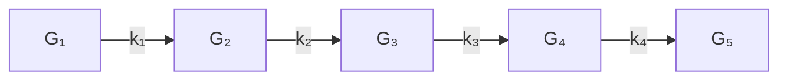

# Chapter 12

# Special Topics

12.1 Linear Systems with Displacement Structure   
12.2 Structured-Rank Problems   
12.3 Kronecker Product Computations   
12.4 Tensor Unfoldings and Contractions   
12.5 Tensor Decompositions and Iterations

Prominent themes in this final chapter include data sparsity, low-rank approximation, exploitation of structure, the importance of representation, and large-scale problems. We revisit (unsymmetric) Toeplitz systems in §12.1 and show how fast stable methods can be developed through a clever data-sparse representation. The ideas extend to other types of structured matrices. Representation is also central to the O(n) methods developed in §12.2 for matrices that have low-rank off-diagonal blocks.

The next three sections form a sequence. The Kronecker product section has general utility, but it is used very heavily in both §12.4 and §12.5 which together provide a brief introduction to the rapidly developing field of tensor computations.

Reading Path

Within this chapter, there are the following dependencies

$$
\begin{array}{c c c c c c c c c} \S 3. 1 \text {-} \S 3. 4, \S 4. 7 & \to & \S 1 2. 1 & & & & \S 5. 1 \text {-} \S 5. 3 \\ \S 3. 1 \text {-} \S 3. 4, \S 5. 1 \text {-} \S 5. 3 & \to & \S 1 2. 2 & & & & \downarrow \\ \S 1. 4 & \to & \S 1 2. 3 & \to & \S 1 2. 4 & \to & \S 1 2. 5 \end{array}
$$

The schematic also hints at the minimum “prerequisites” for each topic.

# 12.1 Linear Systems with Displacement Structure

If $A \in \mathbb { R } ^ { n \times n }$ has rank r, then it has a (non-unique) product representation of the form $U V ^ { T }$ where $U , V \in \mathbb { R } ^ { n \times r }$ . Note that if $r \ll n$ , then the product representation is much more compact than the explicit representation that encodes each $a _ { i j }$ . In addition to the obvious storage economies, the product representation supports fast computation. If the product representation is fully utilized, then the n-by-n matrix-matrix product $A B \ = \ U ( V ^ { T } B )$ is $O ( n ^ { 2 } r )$ instead of $O ( n ^ { 3 } )$ . Likewise, by applying the Sherman-Morrison-Woodbury formula, the solution to a linear system of the form $( I + U V ^ { T } ) x = b$ is $O ( n r + r ^ { 3 } )$ instead of $O ( n ^ { 3 } )$ . The message is simple in both cases: work with U and V and not their explicit product $U V ^ { T }$ .

In this section we continue in this direction by discussing “low-rank” way to represent Cauchy, Toeplitz, and Hankel matrices together with some of their generalizations. The data-sparse representation supports fast stable linear equation solving. The key idea is to turn explicit rank-1 updates that are at the heart of Gaussian elimination into equivalent, inexpensive updates of their representation. Our presentation is based on Gohberg, Kailath, and Olshevsky (1995) and Gu (1998).

# 12.1.1 Displacement Rank

If $F , G \in \mathbb { R } ^ { n \times n }$ and the Sylvester map

$$
X \rightarrow F X - X G \tag {12.1.1}
$$

is nonsingular, then the {F, G}-displacement rank of $A \in \mathbb { R } ^ { n \times n }$ is defined by

$$
\operatorname{rank} _ {\{F, G \}} (A) = \operatorname{rank} (F A - A G). \tag {12.1.2}
$$

Recall from §7.6.3 that the Sylvester map is nonsingular provided $\lambda ( F ) \cup \lambda ( G ) = \varnothing$ Note that if rank $\{ F , G \}  ( A ) = r$ , then we can write

$$
F A - A G = R S ^ {T}, \quad R, S \in \mathbb {R} ^ {n \times r}. \tag {12.1.3}
$$

The matrices R and S are generators for A with respect to F and G, a term that makes sense since we can generate A (or part of A) by working with this equation. If $r \ll n$ , then R and S define a data-sparse representation for A. Of course, for this representation to be of interest F and G must be sufficiently simple so that the reconstruction of A via (12.1.3) is cheap.

# 12.1.2 Cauchy-Like Matrices

If $\boldsymbol \omega \in \mathbb { R } ^ { n }$ and $\lambda \in \mathbb { R } ^ { n }$ and $\omega _ { k } \neq \lambda _ { j }$ for all k and j, then the n-by-n matrix $A = \left( a _ { k j } \right)$ defined by

$$
a _ {k j} = \frac {1}{\omega_ {k} - \lambda_ {j}}
$$

is a Cauchy matrix. Note that if

$$
\Omega = \operatorname{diag} \left(\omega_ {1}, \dots , \omega_ {n}\right), \quad \Lambda = \operatorname{diag} \left(\lambda_ {1}, \dots , \lambda_ {n}\right),
$$

then

$$
[ \Omega A - A \Lambda ] _ {k j} = \frac {\omega_ {k}}{\omega_ {k} - \lambda_ {j}} - \frac {\lambda_ {j}}{\omega_ {k} - \lambda_ {j}} = 1.
$$

If $e \in \mathbb { R } ^ { n }$ is the vector of all $\mathrm { 1 ^ { \circ } s } .$ then

$$
\Omega A - A \Lambda = e e ^ {T}
$$

and thus ran $\mathfrak { c } _ { \{ \Omega , \Lambda \} } ( A ) = 1$ .

More generally, if $R \in \mathbb { R } ^ { n \times r }$ and $S \in \mathbb { R } ^ { n \times r }$ have rank r, then any matrix A that satisfies

$$
\Omega A - A \Lambda = R S ^ {T} \tag {12.1.4}
$$

is a Cauchy-like matrix. This just means that

$$
a _ {k j} = \frac {r _ {k} ^ {T} s _ {j}}{\omega_ {k} - \lambda_ {j}}
$$

where

$$
R ^ {T} = \left[ \begin{array}{c c c} r _ {1} & \dots & r _ {n} \end{array} \right], \qquad S ^ {T} = \left[ \begin{array}{c c c} s _ {1} & \dots & s _ {n} \end{array} \right]
$$

are column partitionings. Note that R and S are generators with respect to Ω and Λ and that $O ( r )$ flops are required to reconstruct a matrix entry $a _ { k j }$ from (12.1.4).

# 12.1.3 The Apparent Loss of Structure

Suppose

$$
A = \left[ \begin{array}{l l} \alpha & g ^ {T} \\ f & B \end{array} \right], \qquad \alpha \in \mathbb {R}, f, g \in \mathbb {R} ^ {n - 1}, B \in \mathbb {R} ^ {(n - 1) \times (n - 1)},
$$

and assume $\alpha \neq 0$ . The first step in Gaussian elimination produces

$$
A _ {1} = B - \frac {1}{\alpha} f g ^ {T}
$$

and the factorization

$$
A = \left[ \begin{array}{c c} 1 & 0 \\ f / \alpha & I _ {n - 1} \end{array} \right] \left[ \begin{array}{c c} \alpha & g ^ {T} \\ 0 & A _ {1} \end{array} \right].
$$

Let us examine the structure of $A _ { 1 }$ given that A is a Cauchy matrix. If $n = 4$ and $a _ { k j } = 1 / ( \omega _ { k } - \lambda _ { j } )$ , then

$$
A _ {1} = \left[ \begin{array}{c c c} \frac {1}{\omega_ {2} - \lambda_ {2}} & \frac {1}{\omega_ {2} - \lambda_ {3}} & \frac {1}{\omega_ {2} - \lambda_ {4}} \\ \frac {1}{\omega_ {3} - \lambda_ {2}} & \frac {1}{\omega_ {3} - \lambda_ {3}} & \frac {1}{\omega_ {3} - \lambda_ {4}} \\ \frac {1}{\omega_ {4} - \lambda_ {2}} & \frac {1}{\omega_ {4} - \lambda_ {3}} & \frac {1}{\omega_ {4} - \lambda_ {4}} \end{array} \right] - \left[ \begin{array}{c} \frac {\omega_ {1} - \lambda_ {1}}{\omega_ {2} - \lambda_ {1}} \\ \frac {\omega_ {1} - \lambda_ {1}}{\omega_ {3} - \lambda_ {1}} \\ \frac {\omega_ {1} - \lambda_ {1}}{\omega_ {4} - \lambda_ {1}} \end{array} \right] \left[ \begin{array}{c} \frac {1}{\omega_ {1} - \lambda_ {2}} \\ \frac {1}{\omega_ {1} - \lambda_ {3}} \\ \frac {1}{\omega_ {1} - \lambda_ {4}} \end{array} \right] ^ {T}.
$$

If we choose to work with the explicit representation of A, then for general n this update requires $O ( n ^ { 2 } )$ work even though it is highly structured and involves $O ( n )$ data. And worse, all subsequent steps in the factorization process essentially deal with general matrices rendering an LU computation that is $O ( n ^ { 3 } )$ .

# 12.1.4 Displacement Rank and Rank-1 Updates

The situation is much happier if we replace the explicit transition from A to $A _ { 1 }$ with a transition that involves updating data sparse representations. The key to developing a fast LU factorization for a Cauchy-like matrix is to recognize that rank-1 updates preserve displacement rank. Here is the result that makes it all possible.

Theorem 12.1.1. Suppose $A \in \mathbb { R } ^ { n \times n }$ satisfies

$$
\Omega A - A \Lambda = R S ^ {T} \tag {12.1.5}
$$

where R, $S \in \mathbb { R } ^ { n \times r }$ and

$$
\Omega = \operatorname{diag} \left(\omega_ {1}, \dots , \omega_ {n}\right), \quad \Lambda = \operatorname{diag} \left(\lambda_ {1}, \dots , \lambda_ {n}\right)
$$

have no common diagonal entries. If

$$
A = \left[ \begin{array}{c c} \alpha & g ^ {T} \\ f & B \end{array} \right], \qquad R = \left[ \begin{array}{c} r _ {1} ^ {T} \\ R _ {1} \end{array} \right], \qquad S = \left[ \begin{array}{c} s _ {1} ^ {T} \\ S _ {1} \end{array} \right]
$$

are conformably partitioned, $\alpha \neq 0$ , and

$$
\Omega_ {1} = \operatorname{diag} \left(\omega_ {2}, \dots , \omega_ {n}\right), \quad \Lambda_ {1} = \operatorname{diag} \left(\lambda_ {2}, \dots , \lambda_ {n}\right),
$$

then

$$
\Omega_ {1} A _ {1} - A _ {1} \Lambda_ {1} = \tilde {R} _ {1} \tilde {S} _ {1} ^ {T} \tag {12.1.6}
$$

where

$$
A _ {1} = B - \frac {f g ^ {T}}{\alpha}, \qquad \tilde {R} _ {1} = R _ {1} - \frac {1}{\alpha} f r _ {1} ^ {T}, \qquad \tilde {S} _ {1} = S _ {1} - \frac {1}{\alpha} g s _ {1} ^ {T}.
$$

Proof. By comparing blocks in (12.1.5) we see that

$$
\begin{array}{l} (1, 1): (\omega_ {1} - \lambda_ {1}) \alpha = r _ {1} ^ {T} s _ {1}, \\ (1, 2): g ^ {T} \Lambda_ {1} = \omega_ {1} g ^ {T} - r _ {1} ^ {T} S _ {1} ^ {T}, \\ (2, 1): \Omega_ {1} f = R _ {1} s _ {1} + \lambda_ {1} f, \\ (2, 2): \Omega_ {1} B - B \Lambda_ {1} = R _ {1} S _ {1} ^ {T}, \\ \end{array}
$$

and so

$$
\begin{array}{l} \Omega_ {1} A _ {1} - A _ {1} \Lambda_ {1} = \Omega_ {1} \left(B - \frac {1}{\alpha} f g ^ {T}\right) - \left(B - \frac {1}{\alpha} f g ^ {T}\right) \Lambda_ {1} \\ = \left(\Omega_ {1} B - B \Lambda_ {1}\right) - \frac {1}{\alpha} \left(\left(\Omega_ {1} f\right) g ^ {T} - f \left(g ^ {T} \Lambda_ {1}\right)\right) \\ = R _ {1} S _ {1} ^ {T} - \frac {1}{\alpha} \left((R _ {1} s _ {1} + \lambda_ {1} f) g ^ {T} - f (\omega_ {1} g ^ {T} - r _ {1} ^ {T} S _ {1} ^ {T})\right) \\ = R _ {1} S _ {1} ^ {T} - \frac {1}{\alpha} \left((R _ {1} s _ {1}) g ^ {T} + f (r _ {1} ^ {T} S _ {1} ^ {T}) - \frac {r _ {1} ^ {T} s _ {1}}{\alpha} f g ^ {T}\right) \\ = \left(R _ {1} - \frac {1}{\alpha} f r _ {1} ^ {T}\right) \left(S _ {1} - \frac {1}{\alpha} g s _ {1} ^ {T}\right) ^ {T} = \tilde {R} _ {1} \tilde {S} _ {1} ^ {T}. \\ \end{array}
$$

This confirms (12.1.6) and completes the proof of the theorem.

The theorem says that

$$
\operatorname{rank} _ {\{\Omega , \Lambda \}} (A) \leq r \quad \Rightarrow \quad \operatorname{rank} _ {\{\Omega_ {1}, \Lambda_ {1} \}} (A _ {1}) \leq r.
$$

This suggests that instead of updating A explicitly to get $A _ { 1 }$ at a cost of $O ( n ^ { 2 } )$ flops, we should update A’s representation {Ω, Λ, R, S} at a cost of $O ( n r )$ flops to get $A _ { 1 } \mathrm { { ' } s }$ representation $\{ \Omega _ { 1 } , \Lambda _ { 1 } , \tilde { R } _ { 1 } , \tilde { S } _ { 1 } \}$ .

# 12.1.5 Fast LU for Cauchy-Like Matrices

Based on Theorem 12.1.1 we can specify a fast LU procedure for Cauchy-like matrices. If A satisfies (12.1.5) and has an LU factorization, then it can be computed using the function LUdisp defined as follows:

Algorithm 12.1.1 If $\omega \in \mathbb { R } ^ { n }$ and $\lambda \in \mathbb { R } ^ { n }$ have no common components, R, $S \in \mathbb { R } ^ { n \times r }$ , and $\Omega A - A \Lambda = R S ^ { T }$ where $\boldsymbol { \Omega } = \mathrm { d i a g } ( \omega _ { 1 } , \dots , \omega _ { n } )$ and $\boldsymbol { \Lambda } = \operatorname { d i a g } ( \lambda _ { 1 } , \ldots , \lambda _ { n } )$ , then the following function computes the LU factorization $A = L U$ .

function $[ L , U ] = { \mathsf { L U d i s p } } ( \omega , \lambda , R , S , n )$

$$
r _ {1} ^ {T} = R (1,:), R _ {1} = R (2: n,:) \tag {1.1}
$$

$$
s _ {1} ^ {T} = S (1,:), S _ {1} = S (2: n,:) \tag {1.1}
$$

$\mathbf { i f } \ n = 1$

$$
L = 1
$$

$$
U = r _ {1} ^ {T} s _ {1} / (\omega_ {1} - \lambda_ {1})
$$

else

$$
a = \left(R s _ {1}\right). / \left(\omega - \lambda_ {1}\right)
$$

$$
\alpha = a _ {1 1}
$$

$$
f = a (2: n)
$$

$$
g = \left(S _ {1} r _ {1}\right). / \left(\omega_ {1} - \lambda (2: n)\right)
$$

$$
\tilde {R} _ {1} = R _ {1} - f r _ {1} ^ {T} / \alpha
$$

$$
\tilde {S} _ {1} = S _ {1} - g s _ {1} ^ {T} / \alpha
$$

$$
\left[ L _ {1}, U _ {1} \right] = \mathsf {L U d i s p} (\omega (2: n), \lambda (2: n), \tilde {R} _ {1}, \tilde {S} _ {1}, n - 1)
$$

$$
L = \left[ \begin{array}{c c} 1 & 0 \\ f / \alpha & L _ {1} \end{array} \right]
$$

$$
U = \left[ \begin{array}{l l} \alpha & g ^ {T} \\ 0 & U _ {1} \end{array} \right]
$$

end

The nonrecursive version would have the following structure:

Let $R ^ { ( 1 ) }$ and $S ^ { ( 1 ) }$ be the generators of $A = A ^ { ( 1 ) }$ with respect to diag(ω) and diag(λ).

for k = 1:n − 1

Use ω(k:n), λ(k:n), R(k) and S(k) to compute the first row and column of

$$
A ^ {(k)} = \left[ \begin{array}{c c} \alpha & g ^ {T} \\ f & B \end{array} \right].
$$

$$
L (k + 1: n, k) = f / \alpha , U (k, k) = \alpha , U (k, k + 1: n) = g ^ {T}
$$

$\begin{array} { r l } & { \mathrm { D e t e r m i n e ~ t h e ~ g e n e r a t o r s ~ } R ^ { ( k + 1 ) } \mathrm { ~ a n d ~ } S ^ { ( k + 1 ) } \mathrm { ~ o f ~ } A ^ { ( k + 1 ) } = B - f g ^ { T } / \alpha } \\ & { \qquad \mathrm { w i t h ~ r e s p e c t ~ t o ~ d i a g } ( \omega ( k \cdot n ) ) \mathrm { ~ a n d ~ d i a g } ( \lambda ( k \cdot n ) ) . } \\ & { \mathrm { e n d ~ } } \end{array}$

$$
U (n, n) = R ^ {(n)} \cdot S ^ {(n)} / (\omega_ {n} - \lambda_ {n})
$$

A careful accounting reveals that $2 n ^ { 2 } r$ flops are required.

# 12.1.6 Pivoting

The procedure just developed has numerical difficulties if a small α shows up during the recursion. To guard against this we show how to incorporate a pivoting strategy. Suppose $A \in \mathbb { R } ^ { n \times n }$ is a Cauchy-like matrix that satisfies the displacement equation

$$
\Omega A - A \Lambda = R S ^ {T}
$$

for diagonal matrices Ω and Λ and n-by-r matrices R and S. If P and Q are n-by-n permutations, then

$$
(P \Omega P ^ {T} (P A Q ^ {T}) - (P A Q ^ {T}) (Q \Lambda Q ^ {T}) = (P R) (Q S) ^ {T}.
$$

This shows that

$$
\tilde {A} = P A Q ^ {T}
$$

is a Cauchy-like matrix having generators

$$
\tilde {R} = P R, \quad \tilde {S} = Q S
$$

with respect to the diagonal matrices

$$
\tilde {\Omega} = P \Omega P ^ {T}, \qquad \tilde {\Lambda} = Q \Lambda Q ^ {T}.
$$

Thus, it is easy to track row and column permutations in the the displacement representation:

$$
A \rightarrow P A Q ^ {T}, \equiv \{\Omega , \Lambda , R, S \} \rightarrow \{P \Omega P ^ {T}, Q \Lambda Q ^ {T}, P R, Q S \}.
$$

By taking advantage of this, it is a simple matter to incorporate partial pivoting in LUdisp and to emerge with the factorization $P A = L U$ :

Algorithm 12.1.2 If $\omega \in \mathbb { R } ^ { n }$ and $\lambda \in \mathbb { R } ^ { n }$ have no common components, R, $S \in \mathbb { R } ^ { n \times r }$ , and $\Omega A - A \Lambda = R S ^ { T }$ , then the following function computes the LU-with-pivoting factorization $P A = L U$ , where $\boldsymbol \Omega = \mathrm { d i a g } ( \omega _ { 1 } , \dots , \omega _ { n } )$ and $\boldsymbol { \Lambda } = \operatorname { d i a g } ( \lambda _ { 1 } , \ldots , \lambda _ { n } )$ .

function $[ L , U , P ] = \mathsf { L U d i s p P i v } ( \omega , \lambda , R , S , n )$

Define $r _ { 1 } , R _ { 1 } , s _ { 1 }$ and $S _ { 1 }$ by $R = { \left[ \begin{array} { l } { r _ { 1 } ^ { T } } \\ { R _ { 1 } } \end{array} \right] } { \mathrm { ~ a n d ~ } } S = { \left[ \begin{array} { l } { s _ { 1 } ^ { T } } \\ { S _ { 1 } } \end{array} \right] }$

if $n = 1$

$$
L = 1
$$

$$
U = r _ {1} ^ {T} s _ {1} / (\omega_ {1} - \lambda_ {1})
$$

else

$$
a = \left(R s _ {1}\right). / \left(\omega - \lambda_ {1}\right)
$$

Determine permutation $P \in \mathbb { R } ^ { n \times n }$ so that $[ P a ] _ { 1 }$ is maximal and

update: $a = P a , R = P R , \omega = P \omega .$ .

$$
\alpha = a _ {1}
$$

$$
f = a (2: n)
$$

$$
g = \left(S _ {1} r _ {1}\right). / \left(\omega_ {1} - \lambda (2: n)\right)
$$

$$
\tilde {R} _ {1} = R _ {1} - f r _ {1} ^ {T} / \alpha
$$

$$
\tilde {S} _ {1} = S _ {1} - g s _ {1} ^ {T} / \alpha
$$

$$
\left[ L _ {1}, U _ {1}, P _ {1} \right] = \text { LUdispPiv } (\omega (2: n), \lambda (2: n), \tilde {R} _ {1}, \tilde {S} _ {1}, n - 1)
$$

$$
L = \left[ \begin{array}{c c} 1 & 0 \\ P _ {1} f / \alpha & L _ {1} \end{array} \right]
$$

$$
U = \left[ \begin{array}{l l} \alpha & g ^ {T} \\ 0 & U _ {1} \end{array} \right]
$$

$$
P = \left[ \begin{array}{c c} 1 & 0 \\ 0 & P _ {1} \end{array} \right] P
$$

end

The processing of the recursive call is based on the fact that if

$$
P A = \left[ \begin{array}{c c} \alpha & g ^ {T} \\ f & B \end{array} \right] = \left[ \begin{array}{c c} 1 & 0 \\ f / \alpha & I _ {n - 1} \end{array} \right] \left[ \begin{array}{c c} \alpha & g ^ {T} \\ 0 & A _ {1} \end{array} \right], \qquad A _ {1} = B - \frac {1}{\alpha} f g ^ {T},
$$

and $P _ { 1 } A _ { 1 } = L _ { 1 } U _ { 1 }$ , then

$$
\left[ \begin{array}{c c} 1 & 0 \\ 0 & P _ {1} \end{array} \right] P A = \left[ \begin{array}{c c} 1 & 0 \\ P _ {1} f / \alpha & L _ {1} \end{array} \right] \left[ \begin{array}{c c} \alpha & g ^ {T} \\ 0 & U _ {1} \end{array} \right].
$$

For LUdispPiv implementation details and a proof of its stability, see Gu (1998).

# 12.1.7 Toeplitz-Like Matrices and Hankel-Like Matrices

Recall from §4.7 that a Toeplitz matrix is constant along each of its diagonals. For example, if $c \in \mathbb { R } ^ { n - 1 } , \ \tau \in \mathbb { R }$ , and $r \in \mathbb { R } ^ { n - 1 }$ are given, then the matrix $T \in \mathbb { R } ^ { n \times n }$ defined by

$$
t _ {i j} = \left\{ \begin{array}{l l} c _ {i - j} & \text {if} i > j, \\ \tau & \text {if} i = j, \\ r _ {j - i} & \text {if} j > i, \end{array} \right.
$$

is Toeplitz, e.g.,

$$
T = \left[ \begin{array}{c c c c c} \tau & r _ {1} & r _ {2} & r _ {3} & r _ {4} \\ c _ {1} & \tau & r _ {1} & r _ {2} & r _ {3} \\ c _ {2} & c _ {1} & \tau & r _ {1} & r _ {2} \\ c _ {3} & c _ {2} & c _ {1} & \tau & r _ {1} \\ c _ {4} & c _ {3} & c _ {2} & c _ {1} & \tau \end{array} \right].
$$

To expose the low-displacement-rank structure of a Toeplitz matrix, we define matrices $Z _ { \phi }$ and $Y _ { \gamma , \delta }$ analogously to their $n = 5$ instances:

$$
Z _ {\phi} = \left[ \begin{array}{c c c c c} 0 & 0 & 0 & 0 & \phi \\ 1 & 0 & 0 & 0 & 0 \\ 0 & 1 & 0 & 0 & 0 \\ 0 & 0 & 1 & 0 & 0 \\ 0 & 0 & 0 & 1 & 0 \end{array} \right], \quad Y _ {\gamma , \delta} = \left[ \begin{array}{c c c c c} \gamma & 1 & 0 & 0 & 0 \\ 1 & 0 & 1 & 0 & 0 \\ 0 & 1 & 0 & 1 & 0 \\ 0 & 0 & 1 & 0 & 1 \\ 0 & 0 & 0 & 1 & \delta \end{array} \right]. \tag {12.1.7}
$$

It can be shown that

$$
Z _ {1} T - T Z _ {- 1} = \left[ \begin{array}{c c c c c} \times & \times & \times & \times & \times \\ 0 & 0 & 0 & 0 & \times \\ 0 & 0 & 0 & 0 & \times \\ 0 & 0 & 0 & 0 & \times \\ 0 & 0 & 0 & 0 & \times \end{array} \right], \quad \operatorname{rank} _ {\{Z _ {1}, Z _ {- 1} \}} (T) \leq 2, \tag {12.1.8}
$$

$$
Y _ {0 0} T - T Y _ {1 1} = \left[ \begin{array}{c c c c c} \times & \times & \times & \times & \times \\ \times & 0 & 0 & 0 & \times \\ \times & 0 & 0 & 0 & \times \\ \times & 0 & 0 & 0 & \times \\ \times & \times & \times & \times & \times \end{array} \right], \quad \operatorname{rank} _ {\{Y _ {0 0}, Y _ {1 1} \}} (T) \leq 4. \tag {12.1.9}
$$

Furthermore, $\lambda ( Z _ { - 1 } ) \cup \lambda ( Z _ { 1 } ) = \emptyset \ \mathrm { a n d } \ \lambda ( Y _ { 0 0 } ) \cup \lambda ( Y _ { 1 1 } ) = \emptyset .$

A Hankel matrix is constant along its antidiagonals, e.g.,

$$
H = \left[ \begin{array}{c c c c c} c _ {4} & c _ {3} & c _ {2} & c _ {1} & \tau \\ c _ {3} & c _ {2} & c _ {1} & \tau & r _ {1} \\ c _ {2} & c _ {1} & \tau & r _ {1} & r _ {2} \\ c _ {1} & \tau & r _ {1} & r _ {2} & r _ {3} \\ \tau & r _ {1} & r _ {2} & r _ {3} & r _ {4} \end{array} \right].
$$

Note that if $H \in \mathbb { R } ^ { n \times n }$ is Hankel, then $\mathcal { E } _ { n } H$ is Toeplitz, and so it is not surprising that

Hankel and Toeplitz matrices have similar displacement rank properties:

$$
Z _ {1} ^ {T} H - H Z _ {- 1} = \left[ \begin{array}{c c c c c} 0 & 0 & 0 & 0 & \times \\ 0 & 0 & 0 & 0 & \times \\ 0 & 0 & 0 & 0 & \times \\ 0 & 0 & 0 & 0 & \times \\ \times & \times & \times & \times & \times \end{array} \right], \quad \operatorname{rank} _ {\{Z _ {1} ^ {T}, Z _ {- 1} \}} (H) \leq 2, \tag {12.1.10}
$$

$$
Y _ {0 0} H - H Y _ {1 1} = \left[ \begin{array}{c c c c c} \times & \times & \times & \times & \times \\ \times & 0 & 0 & 0 & \times \\ \times & 0 & 0 & 0 & \times \\ \times & 0 & 0 & 0 & \times \\ \times & \times & \times & \times & \times \end{array} \right], \quad \operatorname{rank} _ {\left\{Y _ {0 0}, Y _ {1 1} \right\}} (H) \leq 4. \tag {12.1.11}
$$

It follows from (12.1.9) and (12.1.11) that if $A = T + H$ is the sum of a Toeplitz matrix and a Hankel matrix, then rank $\{ Y _ { 0 0 } , Y _ { 1 1 } \} { } ^ { ( A ) } \leq 4$ .

The classes of Toeplitz, Hankel, and Toeplitz-plus-Hankel matrices can be expanded through the notion of low displacement rank. Analogous to how we defined Cauchy-like matrices in (12.1.4) we have the following, assuming that $R \in \mathbb { R } ^ { n \times r }$ , $S \in \mathbb { R } ^ { n \times r }$ , and $r \ll n \colon$

$$
\left\{ \begin{array}{l} Z _ {1} A - A Z _ {- 1} = R S ^ {T} \\ Z _ {1} ^ {T} A - A Z _ {- 1} = R S ^ {T} \\ Y _ {0 0} A - A Y _ {1 1} = R S ^ {T} \end{array} \right\} \text {means that} A \text {is} \left\{ \begin{array}{l} \text {Toeplitz - like} \\ \text {Hankel - like} \\ \text {Toeplitz - plus - Hankel - like} \end{array} \right\}.
$$

Our next task is to show that a linear system with any of these properties can be efficiently converted to a Cauchy-like system and solved with $O ( n ^ { 2 } r )$ work.

# 12.1.8 Fast Solvers via Conversion to Cauchy-Like Form

Suppose

$$
F A - A G = R S ^ {T}, \quad A, F, G \in \mathbb {R} ^ {n \times n}, R, S \in \mathbb {R} ^ {n \times r}, r \ll n,
$$

and that F and G are diagonalizable:

$$
X _ {F} ^ {- 1} F X _ {F} = \operatorname{diag} \left(\omega_ {1}, \dots , \omega_ {n}\right) = \Omega ,
$$

$$
X _ {G} ^ {- 1} G X _ {G} = \operatorname{diag} \left(\lambda_ {1}, \dots , \lambda_ {n}\right) = \Lambda .
$$

For clarity we assume that F and G have real eigenvalues. It follows from

$$
(X _ {F} ^ {- 1} F X _ {F}) (X _ {F} ^ {- 1} A X _ {G}) - (X _ {F} ^ {- 1} A X _ {G}) (X _ {G} ^ {- 1} G X _ {F}) = (X _ {F} ^ {- 1} R) (X _ {G} ^ {T} S) ^ {T}
$$

that

$$
\Omega \tilde {A} - \tilde {A} \Lambda = \tilde {R} \tilde {S} ^ {T}
$$

where $\tilde { A } = X _ { r } ^ { - 1 } A X _ { G } , \tilde { R } = X _ { r } ^ { - 1 } R$ , and $\tilde { S } = X _ { G } ^ { T } S$ Thus, $\tilde { A }$ is Cauchy-like and we can go about solving the given linear system $A x = b$ as follows:

Step 1. Compute $\tilde { R } = X _ { \scriptscriptstyle F } ^ { - 1 } R , \tilde { S } = X _ { \scriptscriptstyle G } ^ { T } S , \tilde { b } = X _ { \scriptscriptstyle F } ^ { - 1 } b ,$ and $\tilde { A } = X _ { \scriptscriptstyle F } ^ { - 1 } A X _ { \scriptscriptstyle G }$

Step 2. Use Algorithm 12.1.2 to compute $P \tilde { A } = L U$

Step 3. Use $P \tilde { A } = L U$ to solve ${ \tilde { A } } { \tilde { x } } = { \tilde { b } } .$

Step 4. Compute $x = X _ { G } \tilde { x }$ .

This will not be an attractive framework unless the matrices F and G have fast eigensystems, a concept introduced in §4.8. Fortunately, this is the case for the matrices $Z _ { 1 }$ , $Z _ { - 1 } , Y _ { 0 0 }$ and $Y _ { 1 1 }$ . For example,

$$
\mathcal {S} _ {n} ^ {T} Y _ {0 0} \mathcal {S} _ {n} = 2 \cdot \mathrm{diag} \left(\cos \left(\frac {\pi}{n + 1}\right), \ldots , \cos \left(\frac {n \pi}{n + 1}\right)\right), \tag {12.1.12}
$$

$$
\mathcal {C} _ {n} ^ {T} Y _ {1 1} \mathcal {C} _ {n} = 2 \cdot \mathrm{diag} \left(1, \cos \left(\frac {\pi}{n}\right), \ldots , \cos \left(\frac {(n - 1) \pi}{n}\right)\right), \tag {12.1.13}
$$

where $S _ { n }$ is the sine transform (DST-I) matrix

$$
[ \mathcal {S} _ {n} ] _ {k j} = \sqrt {\frac {2}{n + 1}} \cdot \sin \left(\frac {k j \pi}{n + 1}\right),
$$

and $\mathcal { C } _ { n }$ is the cosine transform (DCT-II) matrix

$$
\left[ \mathcal {C} _ {n} \right] _ {k j} = \sqrt {\frac {2}{n}} \cdot \cos \left(\frac {(2 k - 1) (j - 1) \pi}{2 n}\right) q _ {j}, \qquad q _ {j} = \left\{ \begin{array}{l l} 1 / \sqrt {2} & \text {if} j = 1, \\ 1 & \text {if} j > 1. \end{array} \right.
$$

This allows products like $\scriptstyle { S _ { n } R }$ and $\mathcal { C } _ { n } ^ { T } S$ to be computed with $O ( r n \log n )$ flops. In short, Step 3 in the above framework is the most expensive step in the process and it involves $O ( n ^ { 2 } r )$ work. See Gohberg, Kailath, and Olshevsky (1995) and Gu (1998) for details and related references.

# Problems

P12.1.1 Refer to (12.1.8) and (12.1.9). (a) Show that if $Z _ { 1 } X - X Z _ { - 1 } = 0$ , then X = 0. (b) Show that if $Y _ { 0 0 } X - X Y _ { 1 1 } = 0$ , then $\dot { X } = 0 .$

P12.1.2 Develop a nonrecursive version of Algorithm 12.1.2.

P12.1.3 (a) If $T \in \mathbb { R } ^ { n \times n }$ is Toeplitz, show how to compute $R , S \in \mathbb { R } ^ { n \times 2 }$ so that $Z _ { 1 } T - T Z _ { - 1 } = R S ^ { T }$ . (b) Suppose $R , S \in \mathbb { R } ^ { n \times r }$ and $\bar { T } \in \mathbb { R } ^ { n \times n }$ satisfy $Z _ { 1 } T - \bar { T } Z _ { - 1 } = R S ^ { T }$ − −  . Give an algorithm that computes $u = T ( : , 1 )$ and $v = T ( 1 , : ) ^ { T }$ .

P12.1.4 (a) If $T \in \mathbb { R } ^ { n \times n }$ is Toeplitz, show how to compute R, $S \in \mathbb { R } ^ { n \times 4 }$ so that $Y _ { 0 0 } T - T Y _ { 1 1 } = R S ^ { T }$ . (b) Suppose $R , S \in \mathbb { R } ^ { n \times r }$ and $\bar { T } \in \mathbb { R } ^ { n \times n }$ satisfy $Y _ { 0 0 } T _ { - } T Y _ { 1 1 } = R S ^ { T }$ − . Give an algorithm that computes $u = T ( : , 1 )$ and $v = T ( 1 , : ) ^ { T }$ .

P12.1.5 Verify(12.1.13).

P12.1.6 Show that if $A \in \mathbb { R } ^ { n \times n }$ is defined by

$$
a _ {i j} = \int_ {a} ^ {b} \cos (k \theta) \cos (j \theta) d \theta
$$

then A is the sum of a Hankel matrix and Toeplitz matrix. Hint: Make use of the identity $\cos ( u + v ) =$ $\cos ( u ) \cos ( v ) - \sin ( u ) \sin ( v )$ .

# Notes and References for §12.1

For a general introduction to the area of fast algorithms for structured matrices we recommend:

T. Kailath and A. H. Sayed (eds) (1999). Fast Reliable Algorithms for Matrices with Structure, SIAM Publications, Philadelphia, PA.   
V. Olshevsky (ed.) (2000). Structured Matrices in Mathematics, Computer Science, and Engineering I and II, AMS Contemporary Mathematics Vol. 280/281, AMS, Providence, RI.   
D.A. Bini, V. Mehrmann, V. Olshevsky, E.E. Tyrtyshnikov, and M. Van Barel (eds.) (2010). Structured Matrices and Applications–The Georg Heinig Memorial Volume, Birkhauser-Springer, Basel, Switzerland.

Papers concerned with the development of fast stable solvers for structured matrices include:

T. Kailath, S. Kung, and M. Morf (1979). “Displacement Ranks of Matrices and Linear Equations,” J. Math. Anal. Applic. 68, 395–407.   
J. Chun and T. Kailath (1991). “Displacement Structure for Hankel, Vandermonde, and Related Matrices,” Lin. Alg. Applic. 151, 199–227.   
T. Kailath and A.H. Sayed (1995). “Displacement Structure: Theory and Applications,” SIAM Review 37, 297–386.   
I. Gohberg, T. Kailath, and V. Olshevsky (1995). “Fast Gaussian Elimination with Partial Pivoting for Matrices with Displacement Structure,” Math. Comput. 212, 1557–1576.   
T. Kailath and V. Olshevsky (1997). “Displacement-Structure Approach to Polynomial Vandermonde and Related Matrices,” Lin. Alg. Applic. 261, 49–90.   
G. Heinig (1997). “Matrices with Higher-Order Displacement Structure,” Lin. Alg. Applic. 278, 295–301.   
M. Gu (1998). “Stable and Efficient Algorithms for Structured Systems of Linear Systems,” SIAM J. Matrix Anal. Applic. 19, 279–306.   
S. Chandrasekaran, M. Gu, X. Sun, J. Xia, and J. Zhu (2007). “A Superfast Algorithm for Toeplitz Systems of Linear Equations,” SIAM J. Matrix Anal. Applic. 29, 1247–1266.

Displacement rank ideas can be extended to least squares problems:

R.H. Chan, J.G. Nagy, and R.J. Plemmons (1994). “Displacement Preconditioner for Toeplitz Least Squares Iterations,” ETNA 2, 44–56.   
M. Gu (1998). “New Fast Algorithms for Structured Linear Least Squares Problems,” SIAM J. Matrix Anal. Applic. 20, 244–269.   
G. Rodriguez (2006). “Fast Solution of Toeplitz- and Cauchy-Like Least-Squares Problems,” SIAM J. Matrix Anal. Applic. 28, 724–748.

For insight into the application low-displacement-rank preconditioners, see:

I. Gohberg and V. Olshevsky (1994). “Complexity of Multiplication with Vectors for Structured Matrices,” Linear Alg. Applic. 202, 163–192.   
M.E. Kilmer and D.P. O’Leary (1999). “Pivoted Cauchy-like Preconditioners for Regularized Solution of Ill-Posed Problems,” SIAM J. Sci. Comput. 21, 88–110.   
T. Kailath and V. Olshevsky (2005). “Displacement Structure Approach to Discrete-Trigonometric-Transform Based Preconditioners of G. Strang Type and of T. Chan Type,” SIAM J. Matrix Anal. Applic. 26, 706–734.

# 12.2 Structured-Rank Problems

Just as a sparse matrix has lots of zero entries, a structured rank matrix has lots of low-rank submatrices. For example, it could be that all off-diagonal blocks have unit rank. In this section we identify some important structured rank matrix problems and point to how they can be solved very quickly with data-sparse representations. To avoid complicated notation, we adopt a small-n, proof-by-example style of exposition. Readers who prefer for more detail and rigor should consult the definitive, two-volume treatise by Vandebril, Van Barel, and Mastronardi (2008).

# 12.2.1 Semiseparable Matrices

A matrix $A \in \mathbb { R } ^ { n \times n }$ is semiseparable if every block that does not “cross” the diagonal has unit rank or less. This means

$$
j _ {2} \leq i _ {1} \text {   or   } i _ {2} \leq j _ {1} \Rightarrow \operatorname{rank} (A (i _ {1}: i _ {2}, j _ {1}: j _ {2})) \leq 1. \tag {12.2.1}
$$

The rank-1 blocks of interest in a semiseparable matrix are wholly contained in either its upper triangular part or its lower triangular part, e.g.,

$$
\left[ \begin{array}{c c c c c c} \times & \times & a _ {1 3} & a _ {1 4} & \times & \times \\ \times & \times & a _ {2 3} & a _ {2 4} & \times & \times \\ \times & \times & a _ {3 3} & a _ {3 4} & \times & \times \\ \times & \times & \times & \times & \times & \times \\ a _ {5 1} & a _ {5 2} & \times & \times & \times & \times \\ a _ {6 1} & a _ {6 2} & \times & \times & \times & \times \end{array} \right], \qquad \begin{array}{l} \operatorname{rank} (A (1: 3, 3: 4)) \leq 1, \\ \operatorname{rank} (A (5: 6, 1: 2)) \leq 1. \end{array}
$$

Semiseparable matrices are data-sparse and enormous savings can be realized when their structure is exploited. For example, we will show that the factorizations $A = L U$ and $A = Q R$ for semiseparable A require just $O ( n )$ flops to compute and $O ( n )$ flops to represent.

An important example of a semiseparable matrix is the inverse of a unit bidiagonal matrix. Given $r \in \mathbb { R } ^ { n - 1 }$ we define $B ( r ) \in \mathbb { R } ^ { n \times n }$ by

$$
B (r) = \left[ \begin{array}{c c c c c} 1 & - r _ {1} & 0 & 0 & 0 \\ 0 & 1 & - r _ {2} & 0 & 0 \\ 0 & 0 & 1 & - r _ {3} & 0 \\ 0 & 0 & 0 & 1 & - r _ {4} \\ 0 & 0 & 0 & 0 & 1 \end{array} \right]. \tag {12.2.2}
$$

Observe that any submatrix extracted from the upper triangular portion of

$$
B (r) ^ {- 1} = \left[ \begin{array}{c c c c c} 1 & r _ {1} & r _ {1} r _ {2} & r _ {1} r _ {2} r _ {3} & r _ {1} r _ {2} r _ {3} r _ {4} \\ 0 & 1 & r _ {2} & r _ {2} r _ {3} & r _ {2} r _ {3} r _ {4} \\ 0 & 0 & 1 & r _ {3} & r _ {3} r _ {4} \\ 0 & 0 & 0 & 1 & r _ {4} \\ 0 & 0 & 0 & 0 & 1 \end{array} \right] \tag {12.2.3}
$$

has unit rank. If $\boldsymbol { x } \in \mathbb { R } ^ { n }$ and $r = x ( 2 { : } n ) \cdot / x ( 1 { : } n - 1 )$ is defined, then

$$
B (r) ^ {T} x = x _ {1} e _ {1}.
$$

Thus, the matrix $B ( r )$ can (in principle) be used to introduce zeros into a vector.

# 12.2.2 Quasiseparable Matrices

Certain products of Givens rotations exhibit rank structure, but we frame the key fact in more general terms. If $\alpha , \beta , \gamma , \delta \in \mathbb { R } ^ { n - 1 }$ and

$$
M _ {k} = \operatorname{diag} (I _ {k - 1}, \tilde {M} _ {k}, I _ {n - k - 1}), \qquad \tilde {M} _ {k} = \left[ \begin{array}{c c} \alpha_ {k} & \beta_ {k} \\ \gamma_ {k} & \delta_ {k} \end{array} \right],
$$

for $k = 1 { : } n - 1$ , then the matrix $M = M _ { 1 } \cdot \cdot \cdot M _ { n - 1 }$ is fully illustrated by

$$
M = M _ {1} M _ {2} M _ {3} M _ {4} = \left[ \begin{array}{c c c c c} \alpha_ {1} & \beta_ {1} \alpha_ {2} & \beta_ {1} \beta_ {2} \alpha_ {3} & \beta_ {1} \beta_ {2} \beta_ {3} \alpha_ {4} & \beta_ {1} \beta_ {2} \beta_ {3} \beta_ {4} \\ \gamma_ {1} & \delta_ {1} \alpha_ {2} & \delta_ {1} \beta_ {2} \alpha_ {3} & \delta_ {1} \beta_ {2} \beta_ {3} \alpha_ {4} & \delta_ {1} \beta_ {2} \beta_ {3} \beta_ {4} \\ 0 & \gamma_ {2} & \delta_ {2} \alpha_ {3} & \delta_ {2} \beta_ {3} \alpha_ {4} & \delta_ {2} \beta_ {3} \beta_ {4} \\ 0 & 0 & \gamma_ {3} & \delta_ {3} \alpha_ {4} & \delta_ {3} \beta_ {4} \\ 0 & 0 & 0 & \gamma_ {4} & \delta_ {4} \end{array} \right]. \tag {12.2.4}
$$

It has the property that off-diagonal blocks have unit rank or less provided they do not “intersect” the diagonal. Quasiseparable matrices have this property and if A is such a matrix, then

$$
j _ {2} <   i _ {1} \text {   or   } i _ {2} <   j _ {1} \Rightarrow \operatorname{rank} (A (i _ {1}: i _ {2}, j _ {1}: j _ {2})) \leq 1. \tag {12.2.5}
$$

By comparing this with (12.2.1), it is clear that the class of semiseparable matrices is a subset of the class of quasiseparable matrices.

# 12.2.3 Two Representations

The Matlab tril and triu notation is very handy when formulating a quasiseparable matrix computation. If $A \in \mathbb { R } ^ { m \times n }$ , then $a _ { i j }$ is on its kth diagonal if $j = i + k$ . The matrix $B = { \sf t r i l } ( A , k )$ is obtained from A by setting to zero all its entries above the kth diagonal while $B = \mathsf { t r i u } ( A , k )$ is obtained from A by setting to zero all its entries below the kth diagonal. If k = 0, then we simply write tril(A) and triu(A). We also use the notation diag(d) to designate the diagonal matrix diag $( d _ { 1 } , \ldots , d _ { n } )$ where $d \in \mathbb { R } ^ { n }$ . Note that if $u , v , d , p , q \in \mathbb { R } ^ { n }$ , then the matrix

$$
A = \operatorname{tril} \left(u v ^ {T}, - 1\right) + \operatorname{diag} (d) + \operatorname{triu} \left(p q ^ {T}, 1\right) \tag {12.2.6}
$$

is quasiseparable, e.g.,

$$
A = \left[ \begin{array}{c c c c c} d _ {1} & p _ {1} q _ {2} & p _ {1} q _ {3} & p _ {1} q _ {4} & p _ {1} q _ {5} \\ u _ {2} v _ {1} & d _ {2} & p _ {2} q _ {3} & p _ {2} q _ {4} & p _ {2} q _ {5} \\ u _ {3} v _ {1} & u _ {3} v _ {2} & d _ {3} & p _ {3} q _ {4} & p _ {3} q _ {5} \\ u _ {4} v _ {1} & u _ {4} v _ {2} & u _ {4} v _ {3} & d _ {4} & p _ {4} q _ {5} \\ u _ {5} v _ {1} & u _ {5} v _ {2} & u _ {5} v _ {3} & u _ {5} v _ {4} & d _ {5} \end{array} \right].
$$

Should it be the case that $d = u . * v = p . * q$ , then this matrix is semiseparable. The representation (12.2.6) is referred to as the generator representation.

Not every quasiseparable matrix has a generator representation. For example, if $A = B ( r )$ and r has nonzero entries, then it is impossible to find u, $v , d , p , q \in \mathbb { R } ^ { n }$ so that (12.2.6) holds. To address this shortcoming, we use the fact that

$$
\binom{\text { Quasiseparable }}{\text { Matrix }}. * \binom{\text { Quasiseparable }}{\text { Matrix }} = \binom{\text { Quasiseparable }}{\text { Matrix }}, \tag {12.2.7}
$$

and embellish (12.2.6) with a pair of inverse bidiagonal factors. It can be shown that if $A \in \mathbb { R } ^ { n \times n }$ is quasiseparable, then there exist $u , v , d , p , q \in \mathbb { R } ^ { n }$ and $t , r \in \mathbb { R } ^ { n - 1 }$ such that

$$
A = \operatorname{tril} \left(u v ^ {T}, - 1\right). * B (t) ^ {- T} + \operatorname{diag} (d) + \operatorname{triu} \left(p q ^ {T}, 1\right). * B (r) ^ {- 1} \tag {12.2.8}
$$

$$
\equiv \mathbf {S} (u, v, t, d, p, q, r),
$$

e.g.,

$$
A = \left[ \begin{array}{c c c c c} d _ {1} & p _ {1} r _ {1} q _ {2} & p _ {1} r _ {1} r _ {2} q _ {3} & p _ {1} r _ {1} r _ {2} r _ {3} q _ {4} & p _ {1} r _ {1} r _ {2} r _ {3} r _ {4} q _ {5} \\ u _ {2} t _ {1} v _ {1} & d _ {2} & p _ {2} r _ {2} q _ {3} & p _ {2} r _ {2} r _ {3} q _ {4} & p _ {2} r _ {2} r _ {3} r _ {4} q _ {5} \\ u _ {3} t _ {2} t _ {1} v _ {1} & u _ {3} t _ {2} v _ {2} & d _ {3} & p _ {3} r _ {3} q _ {4} & p _ {3} r _ {3} r _ {4} q _ {5} \\ u _ {4} t _ {3} t _ {2} t _ {1} v _ {1} & u _ {4} t _ {3} t _ {2} v _ {2} & u _ {4} t _ {3} v _ {3} & d _ {4} & p _ {4} r _ {4} q _ {5} \\ u _ {5} t _ {4} t _ {3} t _ {2} t _ {1} v _ {1} & u _ {5} t _ {4} t _ {3} t _ {2} v _ {2} & u _ {5} t _ {4} t _ {3} v _ {3} & u _ {5} t _ {4} v _ {4} & d _ {5} \end{array} \right].
$$

We refer to (12.2.8) as a quasiseparable representation and it has a number of important specializations. If $d = u . * v = p . * q .$ , then A is semiseparable. If $t = r = \mathbf { 1 } _ { n - 1 }$ , then A is generator representable. If $u \ = \ q , \ v \ = \ p .$ , and $t \ = \ r$ , then A is symmetric. The representation also supports the semiseparable-plus-diagonal structure. A matrix $\mathbf { S } ( u , v , t , d , p , q , r )$ has this form if d is arbitrary and $u . * v = p . * q$ . Here are some inverse-related facts that pertain to semiseparable, quasiseparable, and diagonal-plussemiseparable matrices:

Fact 1. If A is nonsingular and tridiagonal, then $A ^ { - 1 }$ is semiseparable. In addition, if the subdiagonal and superdiagonal entries are nonzero, then $A ^ { - 1 }$ is generator-representable.

Fact 2. If A is nonsingular and quasiseparable, then so is $A ^ { - 1 }$ .

Fact 3. If $A = D + S$ is nonsingular where D is diagonal and nonsingular and S is semiseparable, then $A ^ { - 1 } = D ^ { - 1 } + S _ { 1 }$ where $S _ { 1 }$ is semiseparable.

Aspects of the first fact were encountered in §4.3.8.

# 12.2.4 Computations with Triangular Semiseparable Matrices

Lower and upper triangular matrices that are also semiseparable can be written as follows:

$$
L \text {   lower   semiseparable   } \Rightarrow L = \mathbf {S} (u, v, t, u. * v, 0, 0, 0) = \operatorname{tril} (u v ^ {T}) \cdot * B (t) ^ {- T},
$$

$$
U \text {   upper   semiseparable   } \Rightarrow U = \mathbf {S} (0, 0, 0, p. * q, p, q, r) = \operatorname{triu} (p q ^ {T}) * B (r) ^ {- 1}.
$$

Operations with matrices that have this structure can be organized very efficiently. Consider the matrix-vector product

$$
y = \left(\operatorname{triu} \left(p q ^ {T}\right). * B (r) ^ {- 1}\right) x \tag {12.2.9}
$$

where $x , y , p , q \in \mathbb { R } ^ { n }$ and $r \in \mathbb { R } ^ { n - 1 }$ . This calculation has the form

$$
\left[ \begin{array}{c c c c} p _ {1} q _ {1} & p _ {1} r _ {1} q _ {2} & p _ {1} r _ {1} r _ {2} q _ {3} & p _ {1} r _ {1} r _ {2} r _ {3} q _ {4} \\ 0 & p _ {2} q _ {2} & p _ {2} r _ {2} q _ {3} & p _ {2} r _ {2} r _ {3} q _ {4} \\ 0 & 0 & p _ {3} q _ {3} & p _ {3} r _ {3} q _ {4} \\ 0 & 0 & 0 & p _ {4} q _ {4} \end{array} \right] \left[ \begin{array}{c} x _ {1} \\ x _ {2} \\ x _ {3} \\ x _ {4} \end{array} \right] = \left[ \begin{array}{c} y _ {1} \\ y _ {2} \\ y _ {3} \\ y _ {4} \end{array} \right].
$$

By grouping the $q \mathrm { ^ s }$ with the $x _ { \mathrm { ~ S ~ } } ^ { \prime }$ and extracting the $p \mathrm { { ^ { \circ } s } , }$ , we see that

$$
\mathrm{diag} (p _ {1}, p _ {2}, p _ {3}, p _ {4}) \left[ \begin{array}{c c c c} 1 & r _ {1} & r _ {1} r _ {2} & r _ {1} r _ {2} r _ {3} \\ 0 & 1 & r _ {2} & r _ {2} r _ {3} \\ 0 & 0 & 1 & r _ {3} \\ 0 & 0 & 0 & 1 \end{array} \right] \left[ \begin{array}{c} q _ {1} x _ {1} \\ q _ {2} x _ {2} \\ q _ {3} x _ {3} \\ q _ {4} x _ {4} \end{array} \right] = \left[ \begin{array}{c} y _ {1} \\ y _ {2} \\ y _ {3} \\ y _ {4} \end{array} \right].
$$

In other words, (12.2.9) is equivalent to

$$
y = p. * \left(B (r) ^ {- 1} (q. * x)\right).
$$

Given $x ,$ this is clearly an $O ( n )$ computation since bidiagonal system solving is $O ( n )$ . Indeed, y can be computed with just 4n flops.

Note that if y is given in (12.2.9) and p and q have nonzero components, then we can solve for x equally fast: $x = ( B ( r ) ( y . / p ) ) . / q$ .

# 12.2.5 The LU Factorization of a Semiseparable Matrix

Suppose $A = \mathbf { S } ( u , v , t , u . * v , p , q , r )$ is an $n { \mathrm { - } } \mathrm { b y } { \mathrm { - } } n$ semiseparable matrix that has an LU factorization. It turns out that both L and $U$ are semiseparable and their respective representations can be computed with $O ( n )$ work:

for $k = n { - } 1 { : } - 1 { : } 1$

Using A’s representation, determine $\tau _ { k }$ so that if $\tilde { A } = M _ { k } A$ , where

$$
M _ {k} = \operatorname{diag} (I _ {k - 1}, \tilde {M} _ {k}, I _ {n - k - 1}), \qquad \tilde {M} _ {k} = \left[ \begin{array}{c c} 1 & 0 \\ - \tau_ {k} & 1 \end{array} \right],
$$

then $\tilde { A } ( k + 1 , 1 { : } k ) \ \mathrm { i s ~ z e r o }$ (12.2.10)

Compute the update $A = M _ { k } A$ by updating A’s representation

end

$$
U = A
$$

Note that if $M = M _ { 1 } \cdot \cdot \cdot M _ { n - 1 }$ , then $M A = U$ and $M = B ( \tau )$ with $\boldsymbol { \tau } = [ \tau _ { 1 } , \dots , \tau _ { n - 1 } ] ^ { T }$ . It follows that if $L = M ^ { - 1 }$ , then L is semiseparable from (12.2.4) and $A = L U$ . The challenge is to show that the updates $A = M _ { k } A$ preserve semiseparability.

To see what is involved, suppose $n = 6$ and that we have computed $M _ { 5 }$ and $M _ { 4 }$ so that

$$
M _ {4} M _ {5} A = \left[ \begin{array}{c c c c c c} \times & \times & \times & \times & \times & \times \\ \times & \times & \times & \times & \times & \times \\ \lambda & \lambda & \lambda & \mu & \mu & \mu \\ \lambda & \lambda & \lambda & \mu & \mu & \mu \\ \hline 0 & 0 & 0 & 0 & \times & \times \\ 0 & 0 & 0 & 0 & 0 & \times \end{array} \right] = \mathbf {S} (u, v, t, u. * v, p, q, r)
$$

is semiseparable. Note that the λ-block and the µ-block are given by

$$
\left[ \begin{array}{c c c} \lambda & \lambda & \lambda \\ \lambda & \lambda & \lambda \end{array} \right] = \left[ \begin{array}{c c c} u _ {3} t _ {2} t _ {1} v _ {1} & u _ {3} t _ {2} v _ {2} & u _ {3} v _ {3} \\ u _ {4} t _ {3} t _ {2} t _ {1} v _ {1} & u _ {4} t _ {3} t _ {2} v _ {2} & u _ {4} t _ {3} v _ {3} \end{array} \right],
$$

$$
\left[ \begin{array}{c c c} \mu & \mu & \mu \\ \mu & \mu & \mu \end{array} \right] = \left[ \begin{array}{c c c} p _ {3} r _ {3} q _ {4} & p _ {3} r _ {3} r _ {4} q _ {5} & p _ {3} r _ {3} r _ {4} r _ {5} q _ {6} \\ p _ {4} q _ {4} & p _ {4} r _ {4} q _ {5} & p _ {4} r _ {4} r _ {5} q _ {6} \end{array} \right].
$$

Thus, if

$$
\tilde {M} _ {3} = \left[ \begin{array}{c c} 1 & 0 \\ - \tau_ {3} & 1 \end{array} \right],
$$

then

$$
\tilde {M} _ {3} \left[ \begin{array}{c c c} \lambda & \lambda & \lambda \\ \lambda & \lambda & \lambda \end{array} \right] = \left[ \begin{array}{c c c} u _ {3} t _ {2} t _ {1} v _ {1} & u _ {3} t _ {2} v _ {2} & u _ {3} v _ {3} \\ (u _ {4} t _ {3} - \tau_ {3} u _ {3}) t _ {2} t _ {1} v _ {1} & (u _ {4} t _ {3} - \tau_ {3} u _ {3}) t _ {2} v _ {2} & (u _ {4} t _ {3} - \tau_ {3} u _ {3}) v _ {3} \end{array} \right],
$$

$$
\tilde {M} _ {3} \left[ \begin{array}{c c c} \mu & \mu & \mu \\ \mu & \mu & \mu \end{array} \right] = \left[ \begin{array}{c c c} p _ {3} r _ {3} q _ {4} & p _ {3} r _ {3} r _ {4} q _ {5} & p _ {3} r _ {3} r _ {4} r _ {5} q _ {6} \\ (p _ {4} - \tau_ {3} p _ {3} r _ {3}) q _ {4} & (p _ {4} - \tau_ {3} p _ {3} r _ {3}) r _ {4} q _ {5} & (p _ {4} - \tau_ {3} p _ {3} r _ {3}) r _ {4} r _ {5} q _ {6} \end{array} \right].
$$

If $u _ { 3 } \neq 0 , \tau _ { 3 } = u _ { 4 } t _ { 3 } / u _ { 3 }$ , and we perform the updates

$$
u _ {4} = 0, \qquad p _ {4} = p _ {4} - \tau_ {3} p _ {3} r _ {3},
$$

then

$$
M _ {3} M _ {4} M _ {5} A = \left[ \begin{array}{c c c c c c} \times & \times & \times & \times & \times & \times \\ \times & \times & \times & \times & \times & \times \\ \lambda & \lambda & \lambda & \mu & \mu & \mu \\ 0 & 0 & 0 & \tilde {\mu} & \tilde {\mu} & \tilde {\mu} \\ 0 & 0 & 0 & 0 & \times & \times \\ 0 & 0 & 0 & 0 & 0 & \times \end{array} \right] = \mathbf {S} (u, v, t, u. * v, p, q, r)
$$

is still semiseparable. (The tildes designate updated entries.) Picking up the pattern from this example, we obtain the following $O ( n )$ method for computing the LU factorization of a semiseparable matrix.

Algorithm 12.2.1 Assume that $u , v , p , q \in \mathbb { R } ^ { n }$ with u . $\ast v = p . \ast q$ and that $t , r \in \mathbb { R } ^ { n - 1 }$ . If $\boldsymbol { A } = \mathbf { S } ( u , t , v , u$ . ∗ $v , p , r , q )$ has an LU factorization, then the following algorithm computes $\tilde { p } \in  { \mathbb { R } } ^ { n }$ and $\tau \in \mathbb { R } ^ { n - 1 }$ so that if $L = B ( \tau ) ^ { - T }$ and $U = \mathrm { t r i u } ( \tilde { p } q ^ { T } )$ . ∗ $\boldsymbol { B } ( \boldsymbol { r } ) ^ { - 1 }$ , then $A = L U$ .

for $k = n { - } 1 { : } - 1 { : } 1$

$$
\tau_ {k} = t _ {k} u _ {k + 1} / u _ {k}
$$

$$
\tilde {p} _ {k + 1} = p _ {k + 1} - p _ {k} \tau_ {k} r _ {k}
$$

end

$$
\tilde {p} _ {1} = p _ {1}
$$

This algorithm requires about 5n flops. Given our remarks in the previous section about triangular semiseparable matrices, we see that a semiseparable system $A x = b$ can be solved with $O ( n )$ work: A = LU , Ly = b, U x = y. Note that the vectors $\tau$ and $\tilde { p }$ in algorithm 12.2.1 are given by

$$
\tau = (u (2: n). * t). / u (1: n - 1)
$$

and

$$
\tilde {p} = \left[ \begin{array}{c} p _ {1} \\ p (2: n) - p (1: n - 1)  . *   \tau  . *   r \end{array} \right].
$$

Pivoting can be incorporated in Algorithm 12.2.1 to ensure that $| \tau _ { k } | \le 1$ for $k = n - 1 \colon - 1 \colon 1$ . At the beginning of step k, if $\vert u _ { k } \vert < \vert u _ { k + 1 } \vert$ , then rows k and $k +$ 1 are interchanged. The swapping is orchestrated by updating the quasiseparable respresentation of the current A. The end result is an $O ( n )$ reduction of the form $M _ { 1 } \cdot \cdot \cdot M _ { n - 1 } A = U$ where $U$ is upper triangular and quasiseparable and $\begin{array} { r l } { M _ { k } } & { { } = } \end{array}$ diag $( I _ { k - 1 } , \tilde { M } _ { k } \tilde { P } _ { k } , I _ { n - k - 1 } )$ with

$$
\tilde {P} _ {k} = \left[ \begin{array}{l l} 1 & 0 \\ 0 & 1 \end{array} \right] \text {or} \left[ \begin{array}{l l} 0 & 1 \\ 1 & 0 \end{array} \right].
$$

See Vandebril, Van Barel, and Mastronardi (2008, pp. 165–170) for further details and also how to perform the same tasks when A is quasiseparable.

# 12.2.6 The Givens-Vector Representation

The QR factorization of a semiseparable matrix is also an $O ( n )$ computation. To motivate the algorithm we step through a simple special case that showcases the idea of a structured rank Givens update. Along the way we will discover yet another strategy that can be used to represent a semiseparable matrix.

Assume $A _ { L } \in \mathbb { R } ^ { n \times n }$ is a lower triangular semiseparable matrix and that $a \in \mathbb { R } ^ { n }$ is its first column. We can reduce this column to a multiple of $e _ { 1 }$ with a sequence of

n − 1 Givens rotations, $\mathrm { e . g . }$

$$
\left[ \begin{array}{c c c c} c _ {1} & s _ {1} & 0 & 0 \\ - s _ {1} & c _ {1} & 0 & 0 \\ 0 & 0 & 1 & 0 \\ 0 & 0 & 0 & 1 \end{array} \right] \left[ \begin{array}{c c c c} 1 & 0 & 0 & 0 \\ 0 & c _ {2} & s _ {2} & 0 \\ 0 & - s _ {2} & c _ {2} & 0 \\ 0 & 0 & 0 & 1 \end{array} \right] \left[ \begin{array}{c c c c} 1 & 0 & 0 & 0 \\ 0 & 1 & 0 & 0 \\ 0 & 0 & c _ {3} & s _ {3} \\ 0 & 0 & - s _ {3} & c _ {3} \end{array} \right] \left[ \begin{array}{c} a _ {1} \\ a _ {2} \\ a _ {3} \\ a _ {4} \end{array} \right] = \left[ \begin{array}{c} v _ {1} \\ 0 \\ 0 \\ 0 \end{array} \right].
$$

By moving the rotations to the right-hand side we see that

$$
A _ {L} (:, 1) = \left[ \begin{array}{c} a _ {1} \\ a _ {2} \\ a _ {3} \\ a _ {4} \end{array} \right] = v _ {1} \left[ \begin{array}{c} c _ {1} \\ c _ {2} s _ {1} \\ c _ {3} s _ {2} s _ {1} \\ s _ {3} s _ {2} s _ {1} \end{array} \right].
$$

Because this is the first column of a semiseparable matrix, it is not hard to show that there exist “weights” $v _ { 2 } , \ldots , v _ { n }$ so that

$$
A _ {L} = \left[ \begin{array}{c c c c} c _ {1} v _ {1} & 0 & 0 & 0 \\ c _ {2} s _ {1} v _ {1} & c _ {2} v _ {2} & 0 & 0 \\ c _ {3} s _ {2} s _ {1} v _ {1} & c _ {3} s _ {2} v _ {2} & c _ {3} v _ {3} & 0 \\ s _ {3} s _ {2} s _ {1} v _ {1} & s _ {3} s _ {2} v _ {2} & s _ {3} v _ {3} & v _ {4} \end{array} \right] = B (s) ^ {- T}. * \operatorname{tril} \left(c v ^ {T}\right) \tag {12.2.11}
$$

where

$$
v = \left[ \begin{array}{l} v _ {1} \\ v _ {2} \\ v _ {3} \\ v _ {4} \end{array} \right], \qquad c = \left[ \begin{array}{l} c _ {1} \\ c _ {2} \\ c _ {3} \\ 1 \end{array} \right], \qquad s = \left[ \begin{array}{l} s _ {1} \\ s _ {2} \\ s _ {3} \end{array} \right].
$$

The encoding (12.2.11) is an example of the Givens-vector representation for a triangular semiseparable matrix. It consists of a vector of cosines, a vector of sines, and a vector of weights. By “transposing” this idea, we can similarly represent an upper triangular semiseparable matrix. Thus, for a general semiseparable matrix A we may write

$$
A = A _ {L} + A _ {U},
$$

where

$$
A _ {L} = \operatorname{tril} (A) = B \left(s _ {L}\right) ^ {- T}. * \operatorname{tril} \left(c _ {L} v _ {L} ^ {T}\right),
$$

$$
A _ {U} = \operatorname{triu} (A, 1) = B \left(s _ {U}\right) ^ {- 1}. * \operatorname{triu} \left(v _ {U} c _ {U} ^ {T}, 1\right),
$$

where $c _ { L } , \ s _ { L } .$ , and $v _ { L }$ (resp. $c _ { U } , ~ s _ { U }$ , and $v _ { U } )$ are the cosine, sine, and weight vectors associated with the lower (resp. upper) triangular part. For more details on the properties and utility of this representation, see Vandebril and Van Barel (2005).

# 12.2.7 The QR Factorization of a Semiseparable Matrix

The matrix $Q$ in the QR factorization of a semiseparable matrix $A \in \mathbb { R } ^ { n \times n }$ has a very simple form. Indeed, it is a product of Givens rotations $Q ^ { T } = G _ { 1 } \cdot \cdot \cdot G _ { n - 1 }$ where the underlying cosine-sine pairs are precisely those that define Givens representation of $A _ { L }$ . To see this, consider how easy it is to compute the QR factorization of $A _ { L }$ :

$$
\left[ \begin{array}{c c c c} 1 & 0 & 0 & 0 \\ 0 & 1 & 0 & 0 \\ 0 & 0 & c _ {3} & s _ {3} \\ 0 & 0 & - s _ {3} & c _ {3} \end{array} \right] \left[ \begin{array}{c c c c} c _ {1} v _ {1} & 0 & 0 & 0 \\ c _ {2} s _ {1} v _ {1} & c _ {2} v _ {2} & 0 & 0 \\ c _ {3} s _ {2} s _ {1} v _ {1} & c _ {3} s _ {2} v _ {2} & c _ {3} v _ {3} & 0 \\ s _ {3} s _ {2} s _ {1} v _ {1} & s _ {3} s _ {2} v _ {2} & s _ {3} v _ {3} & v _ {4} \end{array} \right] = \left[ \begin{array}{c c c c} c _ {1} v _ {1} & 0 & 0 & 0 \\ c _ {2} s _ {1} v _ {1} & c _ {2} v _ {2} & 0 & 0 \\ s _ {2} s _ {1} v _ {1} & s _ {2} v _ {2} & v _ {3} & s _ {3} v _ {4} \\ 0 & 0 & 0 & c _ {3} v _ {4} \end{array} \right],
$$

$$
\left[ \begin{array}{c c c c} 1 & 0 & 0 & 0 \\ 0 & c _ {2} & s _ {2} & 0 \\ 0 & - s _ {2} & c _ {2} & 0 \\ 0 & 0 & 0 & 1 \end{array} \right] \left[ \begin{array}{c c c c} c _ {1} v _ {1} & 0 & 0 & 0 \\ c _ {2} s _ {1} v _ {1} & c _ {2} v _ {2} & 0 & 0 \\ s _ {2} s _ {1} v _ {1} & s _ {2} v _ {2} & v _ {3} & s _ {3} v _ {4} \\ 0 & 0 & 0 & c _ {3} v _ {4} \end{array} \right] = \left[ \begin{array}{c c c c} c _ {1} v _ {1} & 0 & 0 & 0 \\ s _ {1} v _ {1} & v _ {2} & s _ {2} v _ {3} & s _ {2} s _ {3} v _ {4} \\ 0 & 0 & c _ {2} v _ {3} & c _ {2} s _ {3} v _ {4} \\ 0 & 0 & 0 & c _ {3} v _ {4} \end{array} \right],
$$

$$
\left[ \begin{array}{c c c c} c _ {1} & s _ {1} & 0 & 0 \\ - s _ {1} & c _ {1} & 0 & 0 \\ 0 & 0 & 1 & 0 \\ 0 & 0 & 0 & 1 \end{array} \right] \left[ \begin{array}{c c c c} c _ {1} v _ {1} & 0 & 0 & 0 \\ s _ {1} v _ {1} & v _ {2} & s _ {2} v _ {3} & s _ {2} s _ {3} v _ {4} \\ 0 & 0 & c _ {2} v _ {3} & c _ {2} s _ {3} v _ {4} \\ 0 & 0 & 0 & c _ {3} v _ {4} \end{array} \right] = \left[ \begin{array}{c c c c} v _ {1} & s _ {1} v _ {2} & s _ {1} s _ {2} v _ {3} & s _ {1} s _ {2} s _ {3} v _ {4} \\ 0 & c _ {1} v _ {2} & c _ {1} s _ {2} v _ {3} & c _ {1} s _ {2} s _ {3} v _ {4} \\ 0 & 0 & c _ {2} v _ {3} & c _ {2} s _ {3} v _ {4} \\ 0 & 0 & 0 & c _ {3} v _ {4} \end{array} \right].
$$

In general, if $\mathsf { t r i l } ( A ) \ : = \ : B ( s ) ^ { - T }$ .∗ $\mathrm { t r i l } ( c v ^ { T } )$ is a Givens vector representation and

$$
Q ^ {T} = G _ {1} \dots G _ {n - 1} \tag {12.2.12}
$$

where

$$
G _ {k} = \operatorname{diag} (I _ {k - 1}, \tilde {G} _ {k}, I _ {n - k - 1}), \quad \tilde {G} _ {k} = \left[ \begin{array}{c c} c _ {k} & s _ {k} \\ - s _ {k} & c _ {k} \end{array} \right], \tag {12.2.13}
$$

for k = 1:n − 1, then

$$
Q ^ {T} \operatorname{tril} (A) = R _ {L} = \operatorname{triu} \left(\left(\mathcal {D} _ {n} c\right) v ^ {T}\right). * B (s) ^ {- 1}. \tag {12.2.14}
$$

(Recall that $\mathcal { D } _ { n }$ is the downshift permutation, see §1.3.x.) Since $Q ^ { T }$ is upper Hessenberg, it follows that

$$
Q ^ {T} \operatorname{triu} (\mathrm{A}, 1) = R _ {U}
$$

is also upper triangular. Thus,

$$
Q ^ {T} A = Q ^ {T} (A _ {L} + A _ {U}) = R _ {L} + R _ {U} = R
$$

is the QR factorization of A. Unfortunately, this is not a useful O(n) representation of R from the standpoint of solving $A x = b$ because the summation gets in the way when we try to solve $( R _ { L } + R _ { U } ) x = Q ^ { T } b$ .

Fortunately, there is a handier way to encode R. Assume for clarity that A has a generator representation

$$
A = \operatorname{tril} \left(u v ^ {T}\right) + \operatorname{triu} \left(p q ^ {T}\right), \tag {12.2.15}
$$

where $u , v , p , q \in \mathbb { R } ^ { n }$ and $u . * v = p . * q$ . We show that R is the upper triangular portion of a rank-2 matrix, i.e.,

$$
R = \operatorname{triu} \left(f g ^ {T} + h q ^ {T}\right), \quad f, g, h \in \mathbb {R} ^ {n}. \tag {12.2.16}
$$

This means that any submatrix extracted from the upper triangular part of R has rank two or less.

From (12.2.15) we see that the first column of A is a multiple of u. It follows that the Givens rotations that define Q in (12.2.12) can be determined from this vector:

$$
G _ {1} \dots G _ {n - 1} u = \left[ \begin{array}{c} \tilde {u} _ {1} \\ 0 \\ \vdots \\ 0 \end{array} \right].
$$

Suppose $n = 6$ and that we have computed $G _ { 5 } , G _ { 4 }$ and $G _ { 3 }$ so that $A ^ { ( 3 ) } = G _ { 3 } G _ { 4 } G _ { 5 } A$ has the form

$$
A ^ {(3)} = \left[ \begin{array}{c c c c c c} u _ {1} v _ {1} & p _ {1} q _ {2} & p _ {1} q _ {3} & p _ {1} q _ {4} & p _ {1} q _ {5} & p _ {1} q _ {6} \\ u _ {2} v _ {1} & u _ {2} v _ {2} & p _ {2} q _ {3} & p _ {2} q _ {4} & p _ {2} q _ {5} & p _ {2} q _ {6} \\ \tilde {u} _ {3} v _ {1} & \tilde {u} _ {3} v _ {2} & \tilde {f} _ {3} g _ {3} + \tilde {h} _ {3} q _ {3} & \tilde {f} _ {3} g _ {4} + \tilde {h} _ {3} q _ {4} & \tilde {f} _ {3} g _ {5} + \tilde {h} _ {3} q _ {5} & \tilde {f} _ {3} g _ {6} + \tilde {h} _ {3} q _ {6} \\ 0 & 0 & 0 & f _ {4} g _ {4} + h _ {4} q _ {4} & f _ {4} g _ {5} + h _ {4} q _ {5} & f _ {4} g _ {6} + h _ {4} q _ {6} \\ 0 & 0 & 0 & 0 & f _ {5} g _ {5} + h _ {5} q _ {5} & f _ {5} g _ {6} + h _ {5} q _ {6} \\ 0 & 0 & 0 & 0 & 0 & f _ {6} g _ {6} + h _ {6} q _ {6} \end{array} \right].
$$

Next, we compute the cosine-sine pair $\left\{ c _ { 2 } , s _ { 2 } \right\}$ so that

$$
\tilde {G} _ {2} \left[ \begin{array}{c} u _ {2} \\ \tilde {u} _ {3} \end{array} \right] = \left[ \begin{array}{c c} c _ {2} & s _ {2} \\ - s _ {2} & c _ {2} \end{array} \right] \left[ \begin{array}{c} u _ {2} \\ \tilde {u} _ {3} \end{array} \right] = \left[ \begin{array}{c} \tilde {u} _ {2} \\ 0 \end{array} \right].
$$

Since

$$
\left[ \begin{array}{c c} c _ {2} & s _ {2} \\ - s _ {2} & c _ {2} \end{array} \right] \left[ \begin{array}{c} p _ {2} q _ {j} \\ \tilde {f} _ {3} g _ {j} + \tilde {h} _ {3} q _ {j} \end{array} \right] = \left[ \begin{array}{c} c _ {2} p _ {2} + s _ {2} \tilde {h} _ {3} \\ - s _ {2} p _ {2} + c _ {2} \tilde {h} _ {3} \end{array} \right] q _ {j} + \left[ \begin{array}{c} s _ {2} \tilde {f} _ {3} \\ c _ {2} \tilde {f} _ {3} \end{array} \right] g _ {j},
$$

for $j = 3 { : } 6$ , it follows that $A ^ { ( 2 ) } = G _ { 2 } A ^ { ( 3 ) } = \mathrm { d i a g } ( 1 , \tilde { G } _ { 2 } , I _ { 3 } ) A ^ { ( 3 ) }$ has the form

$$
A ^ {(2)} = \left[ \begin{array}{c c c c c c} u _ {1} v _ {1} & p _ {1} q _ {2} & p _ {1} q _ {3} & p _ {1} q _ {4} & p _ {1} q _ {5} & p _ {1} q _ {6} \\ \tilde {u} _ {2} v _ {1} & \tilde {f} _ {2} g _ {2} + \tilde {h} _ {2} q _ {2} & \tilde {f} _ {2} g _ {3} + \tilde {h} _ {2} q _ {3} & \tilde {f} _ {2} g _ {4} + \tilde {h} _ {2} q _ {4} & \tilde {f} _ {2} g _ {5} + \tilde {h} _ {2} q _ {5} & \tilde {f} _ {2} g _ {6} + \tilde {h} _ {2} q _ {6} \\ 0 & 0 & f _ {3} g _ {3} + h _ {3} q _ {3} & f _ {3} g _ {4} + h _ {3} q _ {4} & f _ {3} g _ {5} + h _ {3} q _ {5} & f _ {3} g _ {6} + h _ {3} q _ {6} \\ 0 & 0 & 0 & f _ {4} g _ {4} + h _ {4} q _ {4} & f _ {4} g _ {5} + h _ {4} q _ {5} & f _ {4} g _ {6} + h _ {4} q _ {6} \\ 0 & 0 & 0 & 0 & f _ {5} g _ {5} + h _ {5} q _ {5} & f _ {5} g _ {6} + h _ {5} q _ {6} \\ 0 & 0 & 0 & 0 & 0 & f _ {6} g _ {6} + h _ {6} q _ {6} \end{array} \right]
$$

where

$$
\tilde {f} _ {2} = s _ {2} \tilde {f} _ {3}, \qquad f _ {3} = c _ {2} \tilde {f} _ {3}, \qquad \tilde {h} _ {2} = c _ {2} p _ {2} + s _ {2} \tilde {h} _ {3}, \quad h _ {3} = - s _ {2} p _ {2} + c _ {2} \tilde {h} _ {3}.
$$

By considering the transition from $A ^ { ( 3 ) }$ to $A ^ { ( 2 ) }$ via the Givens rotation $G _ { 2 }$ , we conclude that $\left[ A ^ { ( 2 ) } \right] _ { 2 2 } = \tilde { u } _ { 2 } v _ { 2 }$ . Since this must equal $\tilde { f } _ { 2 } g _ { 2 } + \tilde { h } _ { 2 } q _ { 2 }$ we have

$$
g _ {2} = \frac {\tilde {u} _ {2} v _ {2} - \tilde {h} _ {2} q _ {2}}{\tilde {f} _ {2}}.
$$

By extrapolating from this example and making certain assumptions to guard against divison by zero, we obtain the following QR factorization procedure.

Algorithm 12.2.2 Suppose u, v, p, and q are n-vectors that satisfy $u . * v = p . * q$ and $u _ { n } \neq 0$ . If $A = \mathsf { t r i l } ( u \bar { v } ^ { T } ) + \mathsf { t r i u } ( p q ^ { T } , 1 )$ , then this algorithm computes cosine-sine pairs $\left\{ c _ { 1 } , s _ { 1 } \right\} , \ldots , \left\{ c _ { n - 1 } , s _ { n - 1 } \right\}$ and vectors $f , g , h \in \mathbb { R } ^ { n }$ so that if $Q$ is defined by (12.2.12) and (12.2.13), then $Q ^ { T } A = R = \mathsf { t r i u } ( f g ^ { T } + h q ^ { T } )$ .

$$
\tilde {u} _ {n} = u _ {n}, \tilde {f} _ {n} = u _ {n}, g _ {n} = v _ {n}, h _ {n} = 0
$$

for $k = n { - } 1 { : } { - } 1 { : } 1$

$\mathrm { D e t e r m i n e } \ c _ { k } \ \mathrm { a n d } \ s _ { k } \ \mathrm { s o \ t h a t } \left[ \begin{array} { c c } { { c _ { k } } } & { { s _ { k } } } \\ { { - s _ { k } } } & { { c _ { k } } } \end{array} \right] \left[ \begin{array} { c } { { u _ { k } } } \\ { { \tilde { u } _ { k + 1 } } } \end{array} \right] = \left[ \begin{array} { c } { { \tilde { u } _ { k } } } \\ { { 0 } } \end{array} \right] .$

$$
\tilde {f} _ {k} = s _ {k} \tilde {f} _ {k + 1}, f _ {k + 1} = c _ {k} \tilde {f} _ {k + 1}
$$

$$
\left[ \begin{array}{c} h _ {k} \\ h _ {k + 1} \end{array} \right] = \left[ \begin{array}{c c} c _ {k} & s _ {k} \\ - s _ {k} & c _ {k} \end{array} \right] \left[ \begin{array}{c} p _ {k} \\ h _ {k + 1} \end{array} \right]
$$

$$
g _ {k} = (u _ {k} v _ {k} - h _ {k} q _ {k}) / \tilde {f} _ {k}
$$

end

$$
f _ {1} = \tilde {f} _ {1}
$$

Regarding the condition that $u _ { n } \neq 0$ , it is easy to show by induction that

$$
\tilde {f} _ {k} = s _ {k} \dots s _ {n - 1} u _ {n}.
$$

The $s _ { k }$ are nonzero because $\lvert \tilde { u } _ { k } \rvert = \lVert \boldsymbol { u } ( \boldsymbol { k } ; \boldsymbol { n } ) \rVert _ { 2 } \neq 0$ . This algorithm requires $O ( n )$ flops and $O ( n )$ storage. We stress that there are better ways to implement the QR factorization of a semiseparable matrix than Algorithm 12.2.2. See Van Camp, Mastronardi, and Van Barel (2004). Our goal, as stated above, is to suggest how a structured rank matrix factorization can be organized around Givens rotations. Equally efficient QR factorizations for quasiseparable and semiseparable-plus-diagonal matrices are also possible.

We mention that an n-by-n system of the form triu $( f g ^ { T } + h q ^ { T } ) x = y$ can be solved in $O ( n )$ flops. An induction argument based on the partitioning

$$
\left[ \begin{array}{c c} f _ {k} g _ {k} + h _ {k} q _ {k} & f _ {k} \tilde {g} ^ {T} + h _ {1} \tilde {q} ^ {T} \\ 0 & \tilde {f} \tilde {g} ^ {T} + \tilde {h} \tilde {q} ^ {T} \end{array} \right] \left[ \begin{array}{c} x _ {k} \\ \tilde {x} \end{array} \right] = \left[ \begin{array}{c} y _ {k} \\ \tilde {y} \end{array} \right]
$$

where all the “tilde” vectors belong to $\mathbb { R } ^ { n - k }$ shows why. If ˜x, $\alpha = \tilde { g } ^ { T } \tilde { x }$ , and $\tilde { q } ^ { T } \tilde { x }$ are available, then $x _ { k }$ and the updates $\alpha = \alpha + g _ { k } x _ { k }$ and $\beta = \beta + q _ { k } x _ { k }$ require O(1) flops.

# 12.2.8 Other Rank-Structured Classes

We briefly mention several other rank structures that arise in applications. Fast LU and QR procedures exist in each case.

If p and q are nonnegative integers, then a matrix A is $\{ p , q \}$ -semiseparable if

$$
j _ {2} <   i _ {1} + p \Rightarrow \operatorname{rank} \left(A \left(i _ {1}: i _ {2}, j _ {1}: j _ {2}\right)\right) \leq p,
$$

$$
i _ {2} > j _ {1} + q \Rightarrow \operatorname{rank} \left(A \left(i _ {1}: i _ {2}, j _ {1}: j _ {2}\right)\right) \leq q.
$$

For example, if A is {2, 3}-semiseparable, then

$$
A = \left[ \begin{array}{c c c c c c c} \times & \times & \times & \times & \times & \times & \times \\ a _ {2 1} & a _ {2 2} & a _ {2 3} & \times & \times & \times & \times \\ a _ {3 1} & a _ {3 2} & a _ {3 3} & a _ {3 4} & a _ {3 5} & a _ {3 6} & a _ {3 7} \\ a _ {4 1} & a _ {4 2} & a _ {4 3} & a _ {4 4} & a _ {4 5} & a _ {4 6} & a _ {4 7} \\ \times & \times & \times & a _ {5 4} & a _ {5 5} & a _ {5 6} & a _ {5 7} \\ \times & \times & \times & a _ {6 4} & a _ {6 5} & a _ {6 6} & a _ {6 7} \\ \times & \times & \times & a _ {7 4} & a _ {7 5} & a _ {7 6} & a _ {7 7} \end{array} \right] \Rightarrow \quad \begin{array}{l} \operatorname{rank} (A (2: 4, 1: 3)) \leq 2, \\ \operatorname{rank} (A (3: 7, 4: 7)) \leq 3. \end{array}
$$

In general, A is $\{ p , q \}$ -generator representable if we have U, $V \in \mathbb { R } ^ { n \times p }$ and $P , Q \in \mathbb { R } ^ { n \times q }$ such that

$$
\operatorname{tril} (A, p - 1) = \operatorname{tril} (U V ^ {T}, p - 1),
$$

$$
\operatorname{triu} (A, - q + 1) = \operatorname{triu} \left(P Q ^ {T}, - q + 1\right).
$$

If such a matrix is nonsingular, then $A ^ { - 1 }$ has lower bandwidth p and upper bandwidth q. If the $\{ p , q \}$ -semiseparable definition is modified so that the rank-p blocks come from tril(A) and the rank-q blocks come from triu(A), then A belongs to the class of extended $\{ p , q \} { - } s e p a r a b l e$ matrices. If the $\{ p , q \}$ -semiseparable definition is modified so that the rank-p blocks come from tri $( A , - 1 )$ and the rank-q come from triu(A, 1), then A belongs to the class of extended $\{ p , q \}$ -quasiseparable matrices. A sequentially semiseparable matrix is a block matrix that has the following form:

$$
A = \left[ \begin{array}{c c c c} D _ {1} & P _ {1} Q _ {2} ^ {T} & P _ {1} R _ {2} Q _ {3} ^ {T} & P _ {1} R _ {2} R _ {3} Q _ {4} ^ {T} \\ U _ {2} V _ {1} ^ {T} & D _ {2} & P _ {2} Q _ {3} ^ {T} & P _ {2} R _ {3} Q _ {4} ^ {T} \\ U _ {3} T _ {2} V _ {1} ^ {T} & U _ {3} V _ {2} ^ {T} & D _ {3} & P _ {3} Q _ {4} ^ {T} \\ U _ {4} T _ {3} T _ {2} V _ {1} ^ {T} & U _ {4} T _ {3} V _ {2} ^ {T} & U _ {4} V _ {3} ^ {T} & D _ {4} \end{array} \right]. \tag {12.2.17}
$$

See Dewilde and van der Veen (1997) and Chandrasekaran et al. (2005). The blocks can be rectangular so least squares problems with this structure can be handled.

Matrices with hierarchical rank structure are based on low-rank patterns that emerge through recursive 2-by-2 blockings. (With one level of recursion we would have 2-by-2 block matrix whose diagonal blocks are 2-by-2 block matrices.) Various connections may exist between the low-rank representations of the off-diagonal blocks. The important class of hierarchically semiseparable matrices has a particularly rich and exploitable structure; see Xia (2012).

# 12.2.9 Semiseparable Eigenvalue Problems and Techniques

Fast versions of various two-sided, eigenvalue-related decompositions also exist. For example, if $A \in \mathbb { R } ^ { n \times n }$ is symmetric and diagonal-plus-semiseparable, then it is possible to compute the tridiagonalization $Q ^ { T } A Q \stackrel { = } { = } T$ in $O ( n ^ { 2 } )$ flops. The orthogonal matrix Q is a product of Givens rotations each of which participate in a highly-structured update. See Mastronardi, Chandrasekaran, and Van Huffel (2001).

There are also interesting methods for general matrix problems that involve the introduction of semiseparable structures during the solution process. Van Barel, Vanberghen, and van Dooren (2010) approach the product SVD problem through conversion to a semiseparable structure. For example, to compute the SVD of $A = A _ { 1 } A _ { 2 }$ orthogonal matrices $U _ { 1 } , U _ { 2 }$ , and $U _ { 3 }$ are first computed so that $( U _ { 1 } ^ { T } A _ { 1 } U _ { 2 } ) ( U _ { 2 } ^ { T } A _ { 2 } U _ { 3 } ) = T$ is upper triangular and semiseparable. Vanberghen, Vandebril, and Van Barel (2008) have shown how to compute orthogonal $Q , Z \in \mathbb { R } ^ { n \times n }$ so that $Q ^ { T } B Z = R$ is upper triangular and $Q ^ { T } A Z = L$ has the property that tril(L) is semiseparable. A procedure for reducing the equivalent pencil $L - \lambda R$ to generalized Schur form is also developed.

# 12.2.10 Eigenvalues of an Orthogonal Upper Hessenberg Matrix

We close with an eigenvalue problem that has quasiseparable structure. Suppose $H \in \mathbb { R } ^ { n \times n }$ is an upper Hessenberg matrix that is also orthogonal. Our goal is to compute $\lambda ( H )$ . Note that each eigenvalue is on the unit circle. Without loss of generality we may assume that the subdiagonal entries are nonzero.

If n is odd, then it must have a real eigenvalue because the eigenvalues of a real matrix come in complex conjugate pairs. In this case it is possible to deflate the problem by carefully working with the eigenvector equation $H x = x { \mathrm { ~ ( o r ~ } } H x = - x { \mathrm { ) } }$ . Thus, we may assume that n is even.

For $1 \leq k \leq n - 1$ , define the reflection $G _ { k } \in \mathbb { R } ^ { n \times n }$ by

$$
G _ {k} = G (\phi_ {k}) = \mathrm{diag} (I _ {k - 1}, R (\phi_ {k}), I _ {n - k - 1})
$$

where

$$
R (\phi_ {k}) = \left[ \begin{array}{c c} - \cos (\phi_ {k}) & \sin (\phi_ {k}) \\ \sin (\phi_ {k}) & \cos (\phi_ {k}) \end{array} \right], \qquad 0 <   \phi_ {k} <   \pi .
$$

These transformations can be used to represent the QR factorization of H. Indeed, as for the Givens process described in §5.2.6, we can compute $G _ { 1 } , \ldots , G _ { n - 1 }$ so that

$$
G _ {n - 1} \dots G _ {1} H = G _ {n} \equiv \operatorname{diag} (1, \dots , 1, - c _ {n}).
$$

The matrix $G _ { n }$ is the $^ { 6 } R ^ { 5 }$ matrix. It is diagonal because an orthogonal upper triangular matrix must be diagonal. Since the determinant of a matrix is the product of its eigenvalues, the value of $c _ { n }$ is either +1 or −1. If $c _ { n } = - 1$ , then det $( H ) = - 1$ , which in turn implies that H has a real eigenvalue and we can deflate the problem. Thus, we may assume that

$$
H = G _ {1} \dots G _ {n}, \quad G _ {n} = \operatorname{diag} (1, \dots , 1, - 1), \quad n = 2 m \tag {12.2.18}
$$

and that our goal is to compute

$$
\lambda (H) = \{\cos (\theta_ {1}) \pm i \cdot \sin (\theta_ {1}), \dots , \cos (\theta_ {m}) \pm i \cdot \sin (\theta_ {m}) \}. \tag {12.2.19}
$$

Note that (12.2.4) and (12.2.18) tell us that H is quasiseparable.

Ammar, Gragg, and Reichel (1986) propose an interesting $O ( n ^ { 2 } )$ method that computes the required eigenvalues by setting up a pair of m-by-m bidiagonal SVD problems. Three facts are required:

Fact 1. H is similar to $\tilde { H } = H _ { o } H _ { e }$ where

$$
H _ {o} = G _ {1} G _ {3} \dots G _ {n - 1} = \operatorname{diag} (R (\phi_ {1}), R (\phi_ {3}), \dots , R (\phi_ {n - 1})),
$$

$$
H _ {e} = G _ {2} G _ {4} \dots G _ {n} = \operatorname{diag} (1, R (\phi_ {2}), R (\phi_ {4}), \dots , R (\phi_ {n - 2}), - 1).
$$

Fact 2. The matrices

$$
C = \frac {H _ {o} + H _ {e}}{2}, \qquad S = \frac {H _ {o} - H _ {e}}{2}
$$

are symmetric and tridiagonal. Moreover, their eigenvalues are given by

$$
\lambda (C) = \{\pm \cos (\theta_ {1} / 2), \dots , \pm \cos (\theta_ {m} / 2) \},
$$

$$
\lambda (S) = \{\pm \sin (\theta_ {1} / 2), \dots , \pm \sin (\theta_ {m} / 2) \}.
$$

Fact 3. If

$$
Q _ {o} = \operatorname{diag} (R (\phi_ {1} / 2), R (\phi_ {3} / 2), \dots , R (\phi_ {n - 1} / 2)),
$$

$$
Q _ {e} = \mathrm{diag} (1, R (\phi_ {2} / 2), R (\phi_ {4} / 2), \ldots , R (\phi_ {n - 2} / 2), - 1),
$$

then perfect shuffle permutations of the matrices

$$
C ^ {(1)} = Q _ {o} C Q _ {e}, \qquad S ^ {(1)} = Q _ {o} S Q _ {e}
$$

expose a pair of m-by-m bidiagonal matrices $B _ { c }$ and $B _ { s }$ with the property that

$$
\sigma (B _ {c}) = \{\cos (\theta_ {1} / 2), \ldots , \cos (\theta_ {m} / 2) \},
$$

$$
\sigma (B _ {s}) = \{\sin (\theta_ {1} / 2), \dots , \sin (\theta_ {m} / 2) \}.
$$

Once the bidiagonal matrices $B _ { c }$ and $B _ { s }$ are set up (which involves $O ( n )$ work), then their singular values can be computed via Golub-Kahan SVD algorithm. The angle $\theta _ { k }$ can be accurately determined from sin $\left( \theta _ { k } / 2 \right)$ if $0 < \theta _ { k } < \pi / 2$ and from $\cos ( \theta _ { k } / 2 )$ otherwise. See Ammar, Gragg, and Reichel (1986) for more details.

# Problems

P12.2.1 Rigorously prove that the matrix $\boldsymbol { B } ( \boldsymbol { r } ) ^ { - 1 }$ is semiseparable.

P12.2.2 Prove that A is quasiseparable if and only if $A = \mathbf { S } ( u , t , v , d , p , r , q )$ for appropriately chosen vectors u, v, t, d, p, r, and q.

P12.2.3 How many flops are required to execute the n-by-n matrix vector product y = Ax where $A = \mathbf { S } ( u , v , t , d , p , q , r )$ .

P12.2.4 Refer to (12.2.4). Determine u, v, t, d, p, q, and r so that $M = \mathbf { S } ( u , v , t , d , p , q , r )$

P12.2.5 Suppose $\mathbf { S } ( u , v , t , d , v , u , t )$ is symmetric positive definite and semiseparable. Show that its Cholesky factor is semiseparable and give an algorithm for computing its quasiseparable representation.

P12.2.6 Verify the three facts in §12.2.3.

P12.2.7 Develop a fast method for solving the upper triangular system $T x = y$ where $_ T$ is the matrix $T = \mathrm { d i a g } ( d ) + \mathrm { t r i u } ( p q ^ { T } , 1 ) \ . * B ( r ) ^ { - 1 }$ with $p , q , d , y \in \mathbb { R } ^ { n }$ and $r \in \mathbb { R } ^ { n - 1 }$ .

P12.2.8 Verify (12.2.7).

P12.2.9 Prove (12.2.14).

P12.2.10 Assume that A is an N-by-N block matrix that has the sequentially separable structure illustrated in $( 1 2 . 2 . 1 7 )$ . Assume that the blocks are each $m { \mathrm { - } } \mathrm { b y } - m$ . Give a fast algorithm for computing y = Ax where x ∈ IRNm. $y = A x$ $\boldsymbol { x } \in \mathbb { R } ^ { N m }$

P12.2.11 It can be shown that

$$
A = \left[ \begin{array}{c c c c} A _ {1} & B _ {1} ^ {T} & 0 & 0 \\ B _ {1} & A _ {2} & B _ {2} ^ {T} & 0 \\ 0 & B _ {2} & A _ {3} & B _ {3} ^ {T} \\ 0 & 0 & B _ {3} & A _ {4} \end{array} \right] \Rightarrow A ^ {- 1} = \left[ \begin{array}{c c c c} U _ {1} V _ {1} ^ {T} & V _ {1} U _ {2} ^ {T} & V _ {1} U _ {3} ^ {T} & V _ {1} U _ {4} ^ {T} \\ U _ {2} V _ {1} ^ {T} & U _ {2} V _ {2} ^ {T} & V _ {2} U _ {3} ^ {T} & V _ {2} U _ {4} ^ {T} \\ U _ {3} V _ {1} ^ {T} & U _ {3} V _ {2} ^ {T} & U _ {3} V _ {3} ^ {T} & V _ {3} U _ {4} ^ {T} \\ U _ {4} V _ {1} ^ {T} & U _ {4} V _ {2} ^ {T} & U _ {4} V _ {3} ^ {T} & U _ {4} V _ {4} ^ {T} \end{array} \right],
$$

assuming that A is symmetric positive definite and that the $B _ { i }$ are nonsingular. Give an algorithm that computes $U _ { 1 } , \dots , U _ { 4 }$ and $V _ { 1 } , \ldots , V _ { 4 }$ .

P12.2.12 Suppose $a , b , f , g \in \mathbb { R } ^ { n }$ and that $A = \mathsf { t r i u } ( a b ^ { T } + f g ^ { T } )$ is nonsingular. (a) Given $x \in \mathbb { R } ^ { n }$ , show how to compute efficiently $y = A x$ . (b) Given $\boldsymbol { y } \in \mathbb { R } ^ { n }$ , show how to compute $\boldsymbol { x } \in \mathbb { R } ^ { n }$ so that $A x = y . \ \mathrm { ( c ) }$ Given $y , d \in \mathbb { R } ^ { n }$ , show how to compute x so that $y = ( A + D ) x$ where it is assumed that $D = \mathrm { d i a g } ( d )$ and $A + D$ are nonsingular.

P12.2.13 Verify the three facts in 12.2.10 for the case $n = 8 .$

P12.2.14 Show how to compute the eigenvalues of an orthogonal matrix $A \in \mathbb { R } ^ { n \times n }$ by computing the Schur decompositions of $( A + A ^ { T } ) / 2$ and $( A - A ^ { T } ) / 2$ .

# Notes and References for §12.2

For all matters concerning structured rank matrix computations, see:

R. Vandebril, M. Van Barel, and N. Mastronardi (2008). Matrix Computations and Semiseparable Matrices, Vol. I Linear Systems, Johns Hopkins University Press, Baltimore, MD.

R. Vandebril, M. Van Barel, and N. Mastronardi (2008). Matrix Computations and Semiseparable Matrices, Vol. II Eigenvalue and Singular Value Methods, Johns Hopkins University Press, Baltimore, MD.

As we have seen, working with the “right” representation is critically important in order to realize an efficient implementation. For more details, see:

R. Vandebril, M. Van Barel, and N. Mastronardi (2005). “A Note on the Representation and Definition of Semiseparable Matrices,” Num. Lin. Alg. Applic. 12, 839–858.

References concerned with the fast solution of linear equations and least squares problems with structured rank include:

I. Gohberg, T. Kailath, and I Koltracht (1985) “Linear Complexity Algorithm for Semiseparable Matrices,” Integral Equations Operator Theory 8, 780–804.

Y. Eidelman and I. Gohberg (1997). “Inversion Formulas and Linear Complexity Algorithm for Diagonal-Plus-Semiseparable Matrices,” Comput. Math. Applic. 33, 69–79.

P. Dewilde and A.J. van der Veen (1998). Time-Varying Systems and Computations, Kluwer Academic, Boston, MA,

S. Chandrasekaran and M. Gu (2003). “Fast and Stable Algorithms for Banded-Plus-Semiseparable Systems of Linear Equations,” SIAM J. Matrix Anal. Applic. 25, 373–384.

S. Chandrasekaran, P. Dewilde, M. Gu, T. Pals, X. Sun, A.J. Van Der Veen, and D. White (2005). “Some Fast Algorithms for Sequentially Semiseparable Representations,” SIAM J. Matrix Anal. Applic. 27, 341–364.

E. Van Camp, N. Mastronardi, and M. Van Barel (2004). “Two Fast Algorithms for Solving Diagonal-Plus-Semiseparable Linear Systems,” J. Comput. Appl. Math. 164, 731–747.   
T. Bella, Y. Eidelman, I. Gohberg, V. Koltracht, and V. Olshevsky (2009). “A Fast Bjorck-Pereyra-Type Algorithm for Solving Hessenberg-Quasiseparable-Vandermonde Systems SIAM. J. Matrix Anal. Applic. 31, 790–815.   
J. Xia and M. Gu (2010). “Robust Approximate Cholesky Factorization of Rank-Structured Symmetric Positive Definite Matrices,” SIAM J. Matrix Anal. Applic. 31, 2899–2920.   
For discussion of methods that exploit hierarchical rank structure, see:   
S. B¨orm, L. Grasedyck, and W. Hackbusch (2003). “Introduction to Hierarchical Matrices with Applications,” Engin. Anal. Boundary Elements 27, 405–422.   
S. Chandrasekaran, M. Gu, and T. Pals (2006). “A Fast ULV Decomposition Solver for Hierarchically Semiseparable Representations,” SIAM J. Matrix Anal. Applic. 28, 603–622.   
S. Chandrasekaran, M. Gu, X. Sun, J. Xia, and J. Zhu (2007). “A Superfast Algorithm for Toeplitz Systems of Linear Equations,” SIAM J. Matrix Anal. Applic. 29, 1247–1266.   
S. Chandrasekaran, M. Gu, J. Xia, and J. Zhu (2007). “A Fast QR Algorithm for Companion Matrices,” Oper. Theory Adv. Applic. 179, 111–143.   
J. Xia, S. Chandrasekaran, M. Gu, and X.S. Li (2010). “Fast algorithms for Hierarchically Semiseparable Matrices,” Numer. Lin. Alg. Applic. 17, 953–976.   
S. Chandrasekaran, P. Dewilde, M. Gu, and N. Somasunderam (2010). “On the Numerical rank of the Off-Diagonal Blocks of Schur Complements of Discretized Elliptic PDEs,” SIAM J. Matrix Anal. Applic. 31, 2261–2290.   
P.G. Martinsson (2011). “A Fast Randomized Algorithm for Computing a Hierarchically Semi-Separable Representation of a Matrix,” SIAM J. Matrix Anal. Applic. 32, 1251–1274.   
J. Xia (2012). “On the Complexity of Some Hierarchical Structured Matrix Algorithms,” SIAM J. Matrix Anal. Applic. 33, 388–410.   
Reductions to tridiagonal, bidiagonal, and Hessenberg form are essential “front ends” for many eigenvalue and singular value procedures. There are ways to proceed when rank structure is present, see:   
N. Mastronardi, S. Chandrasekaran, and S. van Huffel (2001). “Fast and Stable Reduction of Diagonal Plus Semi-Separable Matrices to Tridiagonal and Bidiagonal Form,” BIT 41, 149–157.   
M. Van Barel, R. Vandebril, and N. Mastronardi (2005). “An Orthogonal Similarity Reduction of a Matrix into Semiseparable Form,” SIAM J. Matrix Anal. Applic. 27, 176–197.   
M. Van Barel, E. Van Camp, N. Mastronardi (2005). “Orthogonal Similarity Transformation into Block-Semiseparable Matrices of Semiseparability Rank,” Num. Lin. Alg. 12, 981–1000.   
R. Vandebril, E. Van Camp, M. Van Barel, and N. Mastronardi (2006). “Orthogonal Similarity Transformation of a Symmetric Matrix into a Diagonal-Plus-Semiseparable One with Free Choice of the Diagonal,” Numer. Math. 102, 709–726.   
Y. Eidelman, I. Gohberg, and L. Gemignani (2007). “On the Fast reduction of a Quasiseparable Matrix to Hessenberg and Tridiagonal Forms,” Lin. Alg. Applic. 420, 86–101.   
R. Vandebril, E. Van Camp, M. Van Barel, and N. Mastronardi (2006). “On the Convergence Properties of the Orthogonal Similarity Transformations to Tridiagonal and Semiseparable (Plus Diagonal) Form,” Numer. Math. 104, 205–239.   
Papers concerned with various structured rank eigenvalue iterations include:   
R. Vandebril, M. Van Barel, and N. Mastronardi (2004). “A QR Method for Computing the Singular Values via Semiseparable Matrices,” Numer. Math. 99, 163–195.   
R. Vandebril, M. Van Barel, N. Mastronardi (2005). “An Implicit QR algorithm for Symmetric Semiseparable Matrices,” Num. Lin. Alg. 12, 625–658.   
N. Mastronardi, E. Van Camp, and M. Van Barel (2005). “Divide and Conquer Algorithms for Computing the Eigendecomposition of Symmetric Diagonal-plus-Semiseparable Matrices,” Numer. Alg. 39, 379–398.   
Y. Eidelman, I. Gohberg, and V. Olshevsky (2005). “The QR Iteration Method for Hermitian Quasiseparable Matrices of an Arbitrary Order,” Lin. Alg. Applic. 404, 305–324.   
Y. Vanberghen, R. Vandebril, M. Van Barel (2008). “A QZ-Method Based on Semiseparable Matrices,” J. Comput. Appl. Math. 218, 482–491.   
M. Van Barel, Y. Vanberghen, and P. Van Dooren (2010). “Using Semiseparable Matrices to Compute the SVD of a General Matrix Product/Quotient,” J. Comput. Appl. Math. 234, 3175–3180.   
Our discussion of the orthogonal matrix eigenvalue problem is based on:

G.S. Ammar, W.B. Gragg, and L. Reichel (1985). “On the Eigenproblem for Orthogonal Matrices,” Proc. IEEE Conference on Decision and Control, 1963–1966.

There is an extensive literature concerned with unitary/orthogonal eigenvalue problem including:

P.J. Eberlein and C.P. Huang (1975). “Global Convergence of the QR Algorithm for Unitary Matrices with Some Results for Normal Matrices,” SIAM J. Numer. Anal. 12, 421–453.

A. Bunse-Gerstner and C. He (1995). “On a Sturm Sequence of Polynomials for Unitary Hessenberg Matrices,” SIAM J. Matrix Anal. Applic. 16, 1043–1055.

B. Bohnhorst, A. Bunse-Gerstner, and H. Fassbender (2000). “On the Perturbation Theory for Unitary Eigenvalue Problems,” SIAM J. Matrix Anal. Applic. 21, 809–824.

M. Gu, R. Guzzo, X.-B. Chi, and X.-O. Cao (2003). “A Stable Divide and Conquer Algorithm for the Unitary Eigenproblem,” SIAM J. Matrix Anal. Applic. 25, 385–404.

M. Stewart (2006). “An Error Analysis of a Unitary Hessenberg QR Algorithm,” SIAM J. Matrix Anal. Applic. 28, 40–67.

R.J.A. David and D.S. Watkins (2006). “Efficient Implementation of the Multishift QR Algorithm for the Unitary Eigenvalue Problem,” SIAM J. Matrix Anal. Applic. 28, 623–633.

For a nice introduction to this problem, see Watkins (MEP, pp. 341–346).

# 12.3 Kronecker Product Computations

The Kronecker product (KP) has a rich algebra that supports a wide range of fast, practical algorithms. It also provides a bridge between matrix computations and tensor computations. This section is a compendium of its most important properties from that point of view. Recall that we introduced the KP in §1.3.6 and identified a few of its properties in §1.3.7 and §1.3.8. Our discussion of fast transforms in §1.4 and the 2-dimensional Poisson problem in §4.8.4 made heavy use of the operation.

# 12.3.1 Basic Properties

Kronecker product computations are structured block matrix computations. Basic properties are given in §1.3.6–§1.3.8, including

$$
\text { Transpose: } \quad (B \otimes C) ^ {T} \quad = B ^ {T} \otimes C ^ {T} ,
$$

$$
\text { Inverse: } \quad (B \otimes C) ^ {- 1} \quad = B ^ {- 1} \otimes C ^ {- 1},
$$

$$
\text { Product: } \quad (B \otimes C) (D \otimes F) = B D \otimes C F ,
$$

$$
\text { Associativity: } \quad B \otimes (C \otimes D) \quad = \quad (B \otimes C) \otimes D.
$$

Recall that $B \otimes C \neq C \otimes B$ , but if $B \in \mathbb { R } ^ { m _ { 1 } \times n _ { 1 } }$ 1 and $C \in \mathbb { R } ^ { m _ { 2 } \times n _ { 2 } }$ , then

$$
P (B \otimes C) Q ^ {T} = C \otimes B \tag {12.3.1}
$$

where $P = \mathcal { P } _ { m _ { 1 } , m _ { 2 } }$ and $Q \ = \ \mathcal P _ { n _ { 1 } , n _ { 2 } }$ are perfect shuffle permutations, see §1.2.11.

Regarding the Kronecker product of structured matrices, if B is sparse, then $B \otimes C$ has the same sparsity pattern at the block level. If B and C are permutation matrices, then $B \otimes C$ is also a permutation matrix. Indeed, if p and q are permutations of 1:m and 1:n, then

$$
I _ {m} (p,:) \otimes I _ {n} (q,:) = I _ {m n} (w,:), \quad w = \left(1 _ {m} \otimes q\right) + n \cdot \left(p - 1 _ {m}\right) \otimes \mathbf {1} _ {n}. \tag {12.3.2}
$$

We also have

$$
(\text { orthogonal }) \otimes (\text { orthogonal }) = (\text { orthogonal }),
$$

$$
(\text { stochastic }) \otimes (\text { stochastic }) = (\text { stochastic }),
$$

$$
(\text { sym   pos   def }) \otimes (\text { sym   pos   def }) = (\text { sym   pos   def }).
$$

The inheritance of positive definiteness follows from

$$
\begin{array}{l} B = G _ {B} G _ {B} ^ {T} \\ C = G _ {C} G _ {C} ^ {T} \end{array} \Rightarrow B \otimes C = G _ {B} G _ {B} ^ {T} \otimes G _ {C} G _ {C} ^ {T} = (G _ {B} \otimes G _ {C}) (G _ {B} \otimes G _ {C}) ^ {T}.
$$

In other words, the Cholesky factor of $B \otimes C$ is the Kronecker product of the B and C Cholesky factors. Similar results apply to square LU and QR factorizations:

$$
\left. \begin{array}{l} P _ {B} B = L _ {B} U _ {B} \\ P _ {C} C = L _ {C} U _ {C} \end{array} \right\} \Rightarrow (P _ {B} \otimes P _ {C}) (B \otimes C) = (L _ {B} \otimes L _ {C}) (U _ {B} \otimes U _ {C}),
$$

$$
\left. \begin{array}{l} B = Q _ {B} R _ {B} \\ C = Q _ {C} R _ {C} \end{array} \right\} \Rightarrow B \otimes C = (Q _ {B} \otimes Q _ {C}) (R _ {B} \otimes R _ {C}).
$$

It should be noted that if B and/or C have more rows than columns, then the same can be said about the upper triangular matrices $R _ { B }$ and $R _ { C }$ . In this case, row permutations of $R _ { B } \otimes R _ { C }$ are required to achieve triangular form. On the other hand,

$$
(B \otimes C) (P _ {B} \otimes P _ {C}) = (Q _ {B} \otimes Q _ {C}) (R _ {B} \otimes R _ {C})
$$

is a thin QR factorization of $B \otimes C$ if $B P _ { B } = Q _ { B } R _ { B }$ and $C P _ { c } = Q _ { c } R _ { c }$ are thin QR factorizations.

The eigenvalues and singular values of $B \otimes C$ have a product connection to the eigenvalues and singular values of B and C:

$$
\lambda (B \otimes C) = \{\beta_ {i} \gamma_ {j}: \beta_ {i} \in \lambda (B), \gamma_ {j} \in \lambda (C) \},
$$

$$
\sigma (B \otimes C) = \{\beta_ {i} \gamma_ {j}: \beta_ {i} \in \sigma (B), \gamma_ {j} \in \sigma (C) \}.
$$

These results are a consequence of the following decompositions:

$$
\left. \begin{array}{l} Q _ {B} ^ {H} B Q _ {B} = T _ {B} \\ Q _ {C} ^ {H} C Q _ {C} = T _ {C} \end{array} \right\} \Rightarrow (Q _ {B} \otimes Q _ {C}) ^ {H} (B \otimes C) (Q _ {B} \otimes Q _ {C}) = T _ {B} \otimes T _ {C}, \tag {12.3.3}
$$

$$
\left. \begin{array}{l} U _ {B} ^ {H} B V _ {B} = \Sigma_ {B} \\ U _ {C} ^ {H} C V _ {C} = \Sigma_ {C} \end{array} \right\} \Rightarrow (U _ {B} \otimes U _ {C}) ^ {H} (B \otimes C) (V _ {B} \otimes V _ {C}) = \Sigma_ {B} \otimes \Sigma_ {C}. \tag {12.3.4}
$$

Note that if $B y = \beta y$ and $C z = \gamma z$ , then $( B \otimes C ) ( y \otimes z ) = \beta \gamma ( y \otimes z )$ . Other properties that follow from (12.3.3) and (12.3.4) include

$$
\operatorname{rank} (B \otimes C) = \operatorname{rank} (B) \cdot \operatorname{rank} (C),
$$

$$
\det (B \otimes C) = \det (B) ^ {n} \cdot \det (C) ^ {m}, \quad B \in \mathbb {R} ^ {m \times m}, C \in \mathbb {R} ^ {n \times n},
$$

$$
\operatorname{tr} (B \otimes C) = \operatorname{tr} (B) \cdot \operatorname{tr} (C),
$$

$$
\left\| B \otimes C \right\| _ {F} = \left\| B \right\| _ {F} \cdot \left\| C \right\| _ {F},
$$

$$
\| B \otimes C \| _ {2} = \| B \| _ {2} \cdot \| C \| _ {2}.
$$

See Horn and Johnson (TMA) for additional KP facts.

# 12.3.2 The Tracy-Singh Product

We can think of the Kronecker product of two matrices $B = \left( b _ { i j } \right)$ and $C = \left( c _ { i j } \right)$ as the systematic layout of all possible products $b _ { i j } c _ { k \ell } , \mathrm { e . g . }$ ,

$$
\left[ \begin{array}{c c} b _ {1 1} & b _ {1 2} \\ b _ {2 1} & b _ {2 2} \end{array} \right] \otimes \left[ \begin{array}{c c} c _ {1 1} & c _ {1 2} \\ c _ {2 1} & c _ {2 2} \end{array} \right] = \left[ \begin{array}{c c c c} b _ {1 1} c _ {1 1} & b _ {1 1} c _ {1 2} & b _ {1 2} c _ {1 1} & b _ {1 2} c _ {1 2} \\ b _ {1 1} c _ {2 1} & b _ {1 1} c _ {2 2} & b _ {1 2} c _ {2 1} & b _ {1 2} c _ {2 2} \\ \hline b _ {2 1} c _ {1 1} & b _ {2 1} c _ {1 2} & b _ {2 2} c _ {1 1} & b _ {2 2} c _ {1 2} \\ b _ {2 1} c _ {2 1} & b _ {2 1} c _ {2 2} & b _ {2 2} c _ {2 1} & b _ {2 2} c _ {2 2} \end{array} \right].
$$

However, the Kronecker product of two block matrices $B = \left( B _ { i j } \right)$ and $C _ { i j } )$ is not the corresponding layout of all possible block-level Kronecker products $B _ { i j } \otimes B _ { k \ell } \colon$

$$
\left[ \begin{array}{c c} B _ {1 1} & B _ {1 2} \\ B _ {2 1} & B _ {2 2} \end{array} \right] \otimes \left[ \begin{array}{c c} C _ {1 1} & C _ {1 2} \\ C _ {2 1} & C _ {2 2} \end{array} \right] \neq \left[ \begin{array}{c c c c} B _ {1 1} C _ {1 1} & B _ {1 1} C _ {1 2} & B _ {1 2} C _ {1 1} & B _ {1 2} C _ {1 2} \\ B _ {1 1} C _ {2 1} & B _ {1 1} C _ {2 2} & B _ {1 2} C _ {2 1} & B _ {1 2} C _ {2 2} \\ \hline B _ {2 1} C _ {1 1} & B _ {2 1} C _ {1 2} & B _ {2 2} C _ {1 1} & B _ {2 2} C _ {1 2} \\ B _ {2 1} C _ {2 1} & B _ {2 1} C _ {2 2} & B _ {2 2} C _ {2 1} & B _ {2 2} C _ {2 2} \end{array} \right].
$$

The matrix on the right is an example of the Tracy-Singh product. Formally, if we are given the blockings

$$
B = \left[ \begin{array}{c c c} B _ {1 1} & \dots & B _ {1, N _ {1}} \\ \vdots & \ddots & \vdots \\ B _ {M _ {1}, 1} & \dots & B _ {M _ {1}, N _ {1}} \end{array} \right] \quad C = \left[ \begin{array}{c c c} C _ {1 1} & \dots & C _ {1, N _ {2}} \\ \vdots & \ddots & \vdots \\ C _ {M _ {2}, 1} & \dots & C _ {M _ {2}, N _ {2}} \end{array} \right], \tag {12.3.5}
$$

with $B _ { i j } \in \mathbb { R } ^ { m _ { 1 } \times n _ { 1 } }$ and $C _ { i j } \in \mathbb { R } ^ { m _ { 2 } \times n _ { 2 } }$ , then the Tracy-Singh product is an $M _ { 1 ^ { - } } \mathrm { b y } { - } N _ { 1 }$ block matrix $B \underset { \mathbf { r } \mathbf { s } } { \otimes } C$ whose $( i , j )$ block is given by

$$
[ B \underset {\mathbf {T S}} {\otimes} C ] _ {i j} = \left[ \begin{array}{c c c} B _ {i j} \otimes C _ {1 1} & \dots & B _ {i j} \otimes C _ {1, N _ {2}} \\ \vdots & \ddots & \vdots \\ B _ {i j} \otimes C _ {M _ {2}, 1} & \dots & B _ {i j} \otimes C _ {M _ {2}, N _ {2}} \end{array} \right].
$$

See Tracy and Singh (1972). Given (12.3.5), it can be shown using (12.3.1) that

$$
B \underset {\mathbf {T S}} {\otimes} C = P (B \otimes C) Q ^ {T} \tag {12.3.6}
$$

where

$$
P = \left(I _ {M _ {1} M _ {2}} \otimes \mathcal {P} _ {m _ {2}, m _ {1}}\right) \left(I _ {M _ {1}} \otimes \mathcal {P} _ {m _ {1}, M _ {2} m _ {2}}\right), \tag {12.3.7}
$$

$$
Q = \left(I _ {N _ {1} N _ {2}} \otimes \mathcal {P} _ {n _ {2}, n _ {1}}\right) \left(I _ {N _ {1}} \otimes \mathcal {P} _ {n _ {1}, N _ {2} n _ {2}}\right). \tag {12.3.8}
$$

# 12.3.3 The Hadamard and Khatri-Rao Products

There are two submatrices of $B \otimes C$ that are particularly important. The Hadamard Product is a pointwise product:

$$
B \underset {\text { HAD }} {\otimes} C = B. * C.
$$

Thus, if $B \in \mathbb { R } ^ { m \times n }$ and $C \in \mathbb { R } ^ { m \times n }$ , then

$$
\left[ \begin{array}{l l} b _ {1 1} & b _ {1 2} \\ b _ {2 1} & b _ {2 2} \\ b _ {3 1} & b _ {3 2} \end{array} \right] \underset {\mathbf {H A D}} {\otimes} \left[ \begin{array}{l l} c _ {1 1} & c _ {1 2} \\ c _ {2 1} & c _ {2 2} \\ c _ {3 1} & c _ {3 2} \end{array} \right] = \left[ \begin{array}{l l} b _ {1 1} c _ {1 1} & b _ {1 2} c _ {1 2} \\ b _ {2 1} c _ {2 1} & b _ {2 2} c _ {2 2} \\ b _ {3 1} c _ {3 1} & b _ {3 2} c _ {3 2} \end{array} \right].
$$

The block analog of this is the Khatri-Rao Product. If $B = \left( B _ { i j } \right)$ and $C = ( C _ { i j } )$ are each m-by-n block matrices, then

$$
B \underset {\mathbf {K R}} {\otimes} C = (A _ {i j}), \qquad A _ {i j} = B _ {i j} \otimes C _ {i j},
$$

e.g.,

$$
\left[ \begin{array}{c c} B _ {1 1} & B _ {1 2} \\ B _ {2 1} & B _ {2 2} \\ B _ {3 1} & B _ {3 2} \end{array} \right] \underset {\mathbf {K R}} {\otimes} \left[ \begin{array}{c c} C _ {1 1} & C _ {1 2} \\ C _ {2 1} & C _ {2 2} \\ C _ {3 1} & C _ {3 2} \end{array} \right] = \left[ \begin{array}{c c} B _ {1 1} \otimes C _ {1 1} & B _ {1 2} \otimes C _ {1 2} \\ B _ {2 1} \otimes C _ {2 1} & B _ {2 2} \otimes C _ {2 2} \\ B _ {3 1} \otimes C _ {3 1} & B _ {3 2} \otimes C _ {3 2} \end{array} \right].
$$

A particularly important instance of the Khatri-Rao product is based on column partitionings:

$$
\left[ \begin{array}{c c c c} b _ {1} & \dots & b _ {n} \end{array} \right] \underset {\mathbf {K R}} {\otimes} \left[ \begin{array}{c c c c} c _ {1} & \dots & c _ {n} \end{array} \right] = \left[ \begin{array}{c c c c} b _ {1} \otimes c _ {1} & \dots & b _ {n} \otimes c _ {n} \end{array} \right].
$$

For more details on the Khatri-Rao product, see Smilde, Bro, and Geladi (2004).

# 12.3.4 The Vec and Reshape Operations

In Kronecker product work, matrices are sometimes regarded as vectors and vectors are sometimes turned into matrices. To be precise about these reshapings, we remind the reader about the vec and reshape operations defined in §1.3.7. If $\boldsymbol { X } \in \mathbb { R } ^ { m \times n }$ , then vec(X) is an nm-by-1 vector obtained by “stacking” X’s columns:

$$
\operatorname{vec} (X) = \left[ \begin{array}{c} X (:, 1) \\ \vdots \\ X (:, n) \end{array} \right].
$$

If $B \in \mathbb { R } ^ { m _ { 1 } \times n _ { 1 } }$ 1 , $C \in \mathbb { R } ^ { m _ { 2 } \times n _ { 2 } }$ , and $X \in \mathbb { R } ^ { n _ { 1 } \times m _ { 2 } }$ , then

$$
Y = C X B ^ {T} \Leftrightarrow \operatorname{vec} (Y) = (B \otimes C) \cdot \operatorname{vec} (X). \tag {12.3.9}
$$

Note that the matrix equation

$$
F _ {1} X G _ {1} ^ {T} + \dots + F _ {p} X G _ {p} ^ {T} = C \tag {12.3.10}
$$

is equivalent to

$$
\left(G _ {1} \otimes F _ {1} + \dots + G _ {p} \otimes F _ {p}\right) \operatorname{vec} (X) = \operatorname{vec} (C). \tag {12.3.11}
$$

See Lancaster (1970), Vetter (1975), and also our discussion about block diagonalization in §7.6.3.

The reshape operation takes a vector and turns it into a matrix. If $a \in \mathbb { R } ^ { m n }$ then

$$
A = \operatorname{reshape} (a, m, n) \in \mathbb {R} ^ {m \times n} \quad \Leftrightarrow \quad \operatorname{vec} (A) = a.
$$

Thus, if $u \in \mathbb { R } ^ { m }$ and $v \in \mathbb { R } ^ { n }$ , then reshape $( v \otimes u , m , n ) = u v ^ { T }$ .

# 12.3.5 Vec, Perfect Shuffles, and Transposition

There is an important connection between matrix transposition and perfect shuffle permutations. In particular, if $A \in \mathbb { R } ^ { q \times r }$ , then

$$
\mathsf {v e c} (A ^ {T}) = \mathcal {P} _ {r, q} \mathsf {v e c} (A). \tag {12.3.12}
$$

This formulation of matrix transposition provides a handy way to reason about large scale, multipass transposition algorithms that are required when $A \in \mathbb { R } ^ { q \times r }$ is too large to fit in fast memory. In this situation the transposition must proceed in stages and the overall process corresponds to a factorization of $\mathcal { P } _ { r , q }$ . For example, if

$$
\mathcal {P} _ {r, q} = \Gamma_ {t} \dots \Gamma_ {1} \tag {12.3.13}
$$

where each $\Gamma _ { k }$ is a “data-motion-friendly” permutation, then $B = A ^ { T }$ can be computed with t passes through the data:

$$
a = \operatorname{vec} (A)
$$

for k = 1:t

$$
a = \Gamma_ {k} a
$$

end

$$
B = \operatorname{reshape} (a, q, r)
$$

The idea is to choose a factorization (12.3.13) so that the data motion behind the operation kth pass, $\mathrm { i . e . , } a \gets \Gamma _ { k } a$ , is in harmony with the architecture of the underlying memory hierarchy, i.e., blocks that can fit in cache, etc.

As an illustration, suppose we want to assign $A ^ { T }$ to B where

$$
A = \left[ \begin{array}{c} A _ {1} \\ \vdots \\ A _ {r} \end{array} \right], \qquad A _ {k} \in \mathbb {R} ^ {q \times q}.
$$

We assume that A is stored by column which means that the $A _ { i }$ are not contiguous in memory. To complete the story, suppose each block comfortably fits in cache but that A cannot. Here is a 2-pass factorization of $\mathcal { P } _ { r q , q } \mathrm { : }$ :

$$
\mathcal {P} _ {q, r q} = \Gamma_ {2} \Gamma_ {1} = \left(I _ {r} \otimes \mathcal {P} _ {q, q}\right) \left(\mathcal {P} _ {r, q} \otimes I _ {q}\right).
$$

If ˜a = Γ1 · vec(A), then

$$
\operatorname{reshape} (\tilde {a}, q, r q) = \left[ \begin{array}{c c c c} A _ {1} & \dots & A _ {r} \end{array} \right].
$$

In other words, after the first pass through the data we have computed the block transpose of A. (The $A _ { i }$ are now contiguous in memory.) To complete the overall task, we must transpose each of these blocks. If $b = \Gamma _ { 2 } \tilde { a }$ , then

$$
B = \operatorname{reshape} (b, q, r q) = \left[ \begin{array}{c c c c} A _ {1} ^ {T} & \dots & A _ {r} ^ {T} \end{array} \right].
$$

See Van Loan (FFT) for more details about perfect shuffle factorizations and multipass matrix transposition algorithms.

# 12.3.6 The Kronecker Product SVD

Suppose $A \in \mathbb { R } ^ { m \times n }$ is given with $m = m _ { 1 } m _ { 2 }$ and $n = n _ { 1 } n _ { 2 }$ . For these integer factorizations the nearest Kronecker product (NKP) problem involves minimizing

$$
\phi (B, C) = \left\| A - B \otimes C \right\| _ {F} \tag {12.3.14}
$$

where $B \in \mathbb { R } ^ { m _ { 1 } \times n _ { 1 } }$ and $C \in \mathbb { R } ^ { m _ { 2 } \times n _ { 2 } }$ . Van Loan and Pitsianis (1992) show how to solve the NKP problem using the singular value decomposition of a permuted version of A. A small example communicates the main idea. Suppose $m _ { 1 } = 3$ and $n _ { 1 } = m _ { 2 } = n _ { 2 } = 2$ . By carefully thinking about the sum of squares that define φ, we see that

$$
\phi (B, C) = \left\| \left[ \begin{array}{c c c c} a _ {1 1} & a _ {1 2} & a _ {1 3} & a _ {1 4} \\ a _ {2 1} & a _ {2 2} & a _ {2 3} & a _ {2 4} \\ \hline a _ {3 1} & a _ {3 2} & a _ {3 3} & a _ {3 4} \\ a _ {4 1} & a _ {4 2} & a _ {4 3} & a _ {4 4} \\ \hline a _ {5 1} & a _ {5 2} & a _ {5 3} & a _ {5 4} \\ a _ {6 1} & a _ {6 2} & a _ {6 3} & a _ {6 4} \end{array} \right] - \left[ \begin{array}{c c} b _ {1 1} & b _ {1 2} \\ b _ {2 1} & b _ {2 2} \\ b _ {3 1} & b _ {3 2} \end{array} \right] \otimes \left[ \begin{array}{c c} c _ {1 1} & c _ {1 2} \\ c _ {2 1} & c _ {2 2} \end{array} \right] \right\| _ {F}
$$

$$
= \left\| \left[ \begin{array}{l l l l} a _ {1 1} & a _ {2 1} & a _ {1 2} & a _ {2 2} \\ a _ {3 1} & a _ {4 1} & a _ {3 2} & a _ {4 2} \\ a _ {5 1} & a _ {6 1} & a _ {5 2} & a _ {6 2} \\ a _ {1 3} & a _ {2 3} & a _ {1 4} & a _ {2 4} \\ a _ {3 3} & a _ {4 3} & a _ {3 4} & a _ {4 4} \\ a _ {5 3} & a _ {6 3} & a _ {5 4} & a _ {6 4} \end{array} \right] - \left[ \begin{array}{l} b _ {1 1} \\ b _ {2 1} \\ b _ {3 1} \\ b _ {1 2} \\ b _ {2 2} \\ b _ {3 2} \end{array} \right] \left[ \begin{array}{l l l l} c _ {1 1} & c _ {2 1} & c _ {1 2} & c _ {2 2} \end{array} \right] \right\| _ {F}.
$$

Denote the preceding 6-by-4 matrix by R(A) and observe that

$$
\mathcal {R} (A) = \left[ \begin{array}{c} \mathsf {v e c} (A _ {1 1}) ^ {T} \\ \mathsf {v e c} (A _ {2 1}) ^ {T} \\ \mathsf {v e c} (A _ {3 1}) ^ {T} \\ \mathsf {v e c} (A _ {1 2}) ^ {T} \\ \mathsf {v e c} (A _ {2 2}) ^ {T} \\ \mathsf {v e c} (A _ {3 2}) ^ {T} \end{array} \right].
$$

It follows that

$$
\phi (B, C) = \left\| \mathcal {R} (A) - \operatorname{vec} (B) \operatorname{vec} (C) ^ {T} \right\| _ {F}
$$

and so the act of minimizing $\phi$ is equivalent to finding a nearest rank-1 matrix to $\mathcal { R } ( A )$ . This problem has a simple SVD solution. Referring to Theorem 2.4.8, if

$$
U ^ {T} \mathcal {R} (A) V = \Sigma \tag {12.3.15}
$$

is the SVD of $\mathcal { R } ( A )$ , then the optimizing B and C are defined by

$$
\mathsf {v e c} (B _ {\mathrm{opt}}) = \sqrt {\sigma_ {1}}   U (:, 1), \qquad \mathsf {v e c} (C _ {\mathrm{opt}}) = \sqrt {\sigma_ {1}}   V (:, 1).
$$

The scalings are arbitrary. Indeed, if $B _ { \mathrm { o p t } }$ and $C _ { \mathrm { o p t } }$ solve the NKP problem and $\alpha \neq 0$ then $\alpha \cdot B _ { \mathrm { o p t } }$ and $( 1 / \alpha ) \cdot C _ { \mathrm { o p t } }$ are also optimal.

In general, if

$$
A = \left[ \begin{array}{c c c} A _ {1 1} & \dots & A _ {1, n _ {1}} \\ \vdots & \ddots & \vdots \\ A _ {m _ {1}, 1} & \dots & A _ {m _ {1}, n _ {1}} \end{array} \right] \tag {12.3.16}
$$

where each $A _ { i j } \in \mathbb { R } ^ { m _ { 2 } \times n _ { 2 } }$ , then $\mathcal { R } ( A ) \in \mathbb { R } ^ { m _ { 1 } n _ { 1 } \times m _ { 2 } n _ { 2 } }$ is defined by

$$
\mathcal {R} (A) = \left[ \begin{array}{c} \tilde {A} _ {1} \\ \vdots \\ \tilde {A} _ {n _ {1}} \end{array} \right], \qquad \tilde {A} _ {j} = \left[ \begin{array}{c} \operatorname{vec} (A _ {1 j}) ^ {T} \\ \vdots \\ \operatorname{vec} (A _ {m _ {1}, j}) ^ {T} \end{array} \right].
$$

The SVD of $\mathcal { R } ( A )$ can be “reshaped” into a special SVD-like expansion for A.

Theorem 12.3.1 (Kronecker Product SVD). If $A \in \mathbb { R } ^ { m _ { 1 } m _ { 2 } \times n _ { 1 } n _ { 2 } }$ is blocked according to (12.3.16) and

$$
\mathcal {R} (A) = U \Sigma V ^ {T} = \sum_ {k = 1} ^ {r} \sigma_ {k} \cdot u _ {k} v _ {k} ^ {T} \tag {12.3.17}
$$

is the SVD of R(A) with $u _ { k } = U ( : , k ) , v _ { k } = V ( : , k )$ , and $\sigma _ { k } = \Sigma ( k , k )$ , then

$$
A = \sum_ {k = 1} ^ {r} \sigma_ {k} \cdot U _ {k} \otimes V _ {k} \tag {12.3.18}
$$

where $U _ { k } ~ = ~ { \mathsf { r e s h a p e } } ( u _ { k } , m _ { 1 } , n _ { 1 } )$ and $V _ { k } = { \mathsf { r e s h a p e } } ( v _ { k } , m _ { 2 } , n _ { 2 } )$ .

Proof. In light of (12.3.18), we must show that

$$
A _ {i j} = \sum_ {k = 1} ^ {r} \sigma_ {k} \cdot U _ {k} (i, j) \cdot V _ {k}.
$$

But this follows immediately from (12.3.17) which says that

$$
\mathsf {v e c} (A _ {i j}) ^ {T} = \sum_ {k = 1} ^ {r} \sigma_ {k} \cdot U _ {k} (i, j) v _ {k} ^ {T}
$$

for all i and j.

The integer r in the theorem is the Kronecker product rank of A given the blocking (12.3.16). Note that if $\tilde { r } \leq r$ , then

$$
A _ {\tilde {r}} = \sum_ {k = 1} ^ {\tilde {r}} \sigma_ {k} U _ {k} \otimes V _ {k} \tag {12.3.19}
$$

is the closest matrix to A (in the Frobenius norm) that is the sum of ˜r Kronecker products. If A is large and sparse and ˜r is small, then the Lanzcos SVD iteration can effectively be used to compute the required singular values and vectors of $\mathcal { R } ( A )$ . See §10.4.

# 12.3.7 Constrained NKP Problems

If A is structured, then it is sometimes the case that the B and C matrices that solve the NKP problem are similarly structured. For example, if A is symmetric and positive definite, then the same can be said of $B _ { \mathrm { o p t } }$ and $C _ { \mathrm { o p t } }$ (if properly normalized). Likewise, if A is nonnegative, then the optimal B and C can be chosen to be nonnegative. These and other structured NKP problems are discussed in Van Loan and Pitsianis (1992).

We mention that a problem like

$$
\min _ {B, C \text { Toeplitz }} \| A - B \otimes C \| _ {F}, \qquad B \in \mathbb {R} ^ {m \times m},   C \in \mathbb {R} ^ {n \times n},
$$

turns into a constrained nearest rank-1 problem of the form

$$
\begin{array}{l} \min \quad \left\| \mathcal {A} - b c ^ {T} \right\| _ {F} \\ F ^ {T} \operatorname{vec} (B) = 0 \\ G ^ {T} \mathsf {v e c} (C) = 0 \\ \end{array}
$$

where the nullspaces of $F ^ { T }$ and $G ^ { T }$ define the vector space of m-by-m and n-by-n Toeplitz matrices respectively. This problem can be solved by computing QR factorizations of $F$ and G followed by a reduced-dimension SVD.

# 12.3.8 Computing the Nearest $X \otimes X$

Suppose A ∈ IRm2×m2 $A \in \mathbb { R } ^ { m ^ { 2 } \times m ^ { 2 } }$ and that we want to find $\boldsymbol { X } \in \mathbb { R } ^ { m \times m }$ so that

$$
\phi_ {\mathrm{sym}} (X) = \left\| A - X \otimes X \right\| _ {F}
$$

is minimized. Proceeding as we did with the NKP problem, we can reshape this into a nearest symmetric rank-1 problem:

$$
\phi_ {\text { sym }} (X) = \| \mathcal {R} (A) - \text { vec } (X) \cdot \text { vec } (X) ^ {T} \| _ {F}. \tag {12.3.20}
$$

It turns out that the solution $X _ { \mathrm { o p t } }$ is a reshaping of an eigenvector associated with the symmetric part of $\mathcal { R } ( A )$ .

Lemma 12.3.2. Suppose $M \in \mathbb { R } ^ { n \times n }$ and that $Q ^ { T } T Q = \operatorname { d i a g } ( \alpha _ { 1 } , . . . , \alpha _ { n } )$ is a Schur decomposition of $T = ( M + M ^ { T } ) / 2$ . If

$$
| \alpha_ {k} | = \max \{| \alpha_ {1} |, \dots , | \alpha_ {n} | \}
$$

then the solution to the problem

$$
\begin{array}{l} \min \quad \| M - Z \| _ {F} \\ Z = Z ^ {T} \\ \operatorname{rank} (Z) = 1 \\ \end{array}
$$

is given by $Z _ { \mathrm { o p t } } = \alpha _ { k } q _ { k } q _ { k } ^ { T }$ where $q _ { k } = Q ( : , k )$ .

Proof. See P12.3.11.

# 12.3.9 Computing the Nearest $X \otimes Y - Y \otimes X$

Suppose $A \in \mathbb { R } ^ { n \times n } , n = m ^ { 2 }$ and that we wish to find X, $Y \in \mathbb { R } ^ { m \times m }$ so that

$$
\phi_ {\text { skew }} (X, Y) = \left\| A - \left(X \otimes Y - Y \otimes X\right) \right\| _ {F}
$$

is minimized. It can be shown that

$$
\phi_ {\mathrm{skew}} (X) = \left\| \mathcal {R} (A) - (\mathrm{vec} (X) \cdot \mathrm{vec} (Y) ^ {T} - \mathrm{vec} (Y) \cdot \mathrm{vec} (X) ^ {T} \right\| _ {F}. \tag {12.3.21}
$$

The optimizing X and Y can be determined by exploiting the following lemma.

Lemma 12.3.3. Suppose $M \in \mathbb { R } ^ { n \times n }$ with skew-symmetric part $S = ( M - M ^ { T } ) / 2$ . If

$$
S [ u \mid v ] = [ u \mid v ] \left[ \begin{array}{c c} 0 & \mu \\ - \mu & 0 \end{array} \right], \qquad u, v \in \mathbb {R} ^ {n},
$$

with $\mu = \rho ( S ) , \| u \| _ { 2 } = \| v \| _ { 2 } = 1$ , and $u ^ { T } v = 0$ , then $Z _ { \mathrm { o p t } } = \mu \left( u v ^ { T } - v u ^ { T } \right)$ minimizes $\| M - Z \| _ { F }$ over all rank-2 skew-symmetric matrices $Z \in \mathbb { R } ^ { n \times n }$ .

Proof. See P12.3.12.

# 12.3.10 Some Comments About Multiple Kronecker Products

The Kronecker product of three or more matrices results in a matrix that has a recursive block structure. For example,

$$
B \otimes C \otimes D   =   \left[ \begin{array}{l l} b _ {1 1} & b _ {1 2} \\ b _ {2 1} & b _ {2 2} \end{array} \right] \otimes \left[ \begin{array}{l l l l} c _ {1 1} & c _ {1 2} & c _ {1 3} & c _ {1 4} \\ c _ {2 1} & c _ {2 2} & c _ {2 3} & c _ {2 4} \\ c _ {3 1} & c _ {3 2} & c _ {3 3} & c _ {3 4} \\ c _ {4 1} & c _ {4 2} & c _ {4 3} & c _ {4 4} \end{array} \right] \otimes \left[ \begin{array}{l l l} d _ {1 1} & d _ {1 2} & d _ {1 3} \\ d _ {2 1} & d _ {2 2} & d _ {2 3} \\ d _ {3 1} & d _ {3 2} & d _ {3 3} \end{array} \right]
$$

is a 2-by-2 block matrix whose entries are 4-by-4 block matrices whose entries are 3-by-3 matrices.

A Kronecker product can be regarded as a data-sparse representation. If $A =$ $B _ { 1 } \otimes B _ { 2 }$ and each B-matrix is m-by-m, then $2 m ^ { 2 }$ numbers are used to encode a matrix that has $m ^ { 4 }$ entries. The data sparsity is more dramatic for multiple Kronecker products. If $A = B _ { 1 } \otimes \dots \otimes B _ { p }$ and $B _ { i } \in \mathbb { R } ^ { m \times m }$ , then $p m ^ { 2 }$ numbers fully describe A, a matrix with $m ^ { 2 p }$ entries.

Order of operation can be important when a multiple Kronecker product is involved and the participating matrices vary in dimension. Suppose $B _ { i } \in \mathbb { R } ^ { m _ { i } \times n _ { i } }$ for $i = 1 { : } p$ and that $M _ { i } = m _ { 1 } \cdot \cdot \cdot m _ { i }$ and $N _ { i } = n _ { 1 } \cdot \cdot \cdot n _ { i }$ for $i = 1 { : } p .$ The matrix-vector product

$$
y = (B _ {1} \otimes \dots B _ {p}) x \qquad x \in \mathbb {R} ^ {N _ {p}}
$$

can be evaluated in many different orders and the associated flop counts can vary tremendously. The search for an optimal ordering is a dynamic programming problem that involves the recursive analysis of calculations like

$$
\operatorname{reshape} \left(y, M _ {p} / M _ {i}, M _ {i}\right) = \left(B _ {i + 1} \otimes \dots \otimes B _ {p}\right) \cdot \operatorname{reshape} \left(x, N _ {p} / N _ {i}, N _ {i}\right) \cdot \left(B _ {1} \otimes \dots B _ {i}\right) ^ {T}.
$$

# Problems

P12.3.1 Prove (12.3.1) and (12.3.2).

P12.3.2 Assume that the matrices $A _ { 1 } , \dots , A _ { N } \in \mathbb { R } ^ { m \times n }$ . Express the summation

$$
f (x, y) = \sum_ {k = 1} ^ {N} \left(y ^ {T} A _ {k} x - b _ {k}\right) ^ {2}
$$

in matrix-vector terms given that $y \in \mathbb { R } ^ { m } , x \in \mathbb { R } ^ { m }$ , and $b \in \mathbb { R } ^ { N }$ .

P12.3.3 A total least squares solution to $( B \otimes C ) x \approx b$ requires the computation of the smallest singular value and the associated right singular vector of the augmented matrix $M = [ B \otimes C | b ]$ . Outline an efficient procedure for doing this that exploits the Kronecker structure of the data matrix.

P12.3.4 Show how to minimize $\parallel ( A _ { 1 } \otimes A _ { 2 } ) x - f \parallel$ subject to the constraint that $( B _ { 1 } \otimes B _ { 2 } ) x = g .$ . Assume that $A _ { 1 }$ and $A _ { 2 }$ have more rows than columns and that $B _ { 1 }$ and $B _ { 2 }$ have more columns than rows. Also assume that each of these four matrices has full rank. See Barrlund (1998).

P12.3.5 Suppose $B \in \mathbb { R } ^ { n \times n }$ and $C \in \mathbb { R } ^ { m \times m }$ are unsymmetric and positive definite. Does it follow that $B \otimes C$ is positive definite?

P12.3.6 Show how to construct the normalized SVD of $B \otimes C$ from the normalized SVDs of B and C. Assume that $B \in \mathbb { R } ^ { m _ { B } \times n _ { B } }$ and $C \in \mathbb { R } ^ { m _ { C } \times n _ { C } }$ with m ${ \bf \beta } _ { B } \geq n _ { B }$ and $m _ { C } \geq n _ { C }$ .

P12.3.7 Show how to solve the linear system $( A \otimes B \otimes C ) x = d$ assuming that $A , B , C \in \mathbb { R } ^ { n \times n }$ are symmetric positive definite.

P12.3.8 (a) Given $A \in \mathbb { R } ^ { m n \times m n }$ and $B \in \mathbb { R } ^ { m \times m }$ , how would you compute $X \in \mathbb { R } ^ { n \times n }$ so that

$$
\phi_ {B} (X) = \left\| A - B \otimes X \right\| _ {F}
$$

is minimized? (b) Given $A \in \mathbb { R } ^ { m n \times m n }$ and $C \in \mathbb { R } ^ { n \times n } ,$ , how would you compute $\boldsymbol { X } \in \mathbb { R } ^ { m \times m }$ so that

$$
\phi_ {C} (X) = \left\| A - X \otimes C \right\| _ {F}
$$

is minimized?

P12.3.9 What is the nearest Kronecker product to the matrix $A = I _ { n } \otimes T _ { m } ^ { D D } + T _ { n } ^ { D D } \otimes I _ { n }$ where $\mathcal { T } _ { k } ^ { D D }$ is defined in (4.8.7).

P12.3.10 If A ∈ IRmn×mn is symmetric and tridiagonal, show how to minimize $\| A - B \otimes C \| _ { F }$ subject to the constraint that $B \in \mathbb { R } ^ { m \times m }$ and $C \in \mathbb { R } ^ { n \times n }$ are symmetric and tridiagonal.

P12.3.11 Prove Lemma 12.3.2. Hint: Show

$$
\parallel M - \alpha x x ^ {T} \parallel_ {F} ^ {2} = \parallel M \parallel_ {F} ^ {2} - 2 \alpha x ^ {T} T x + \alpha^ {2}
$$

where $T = ( M + M ^ { T } ) / 2$ .

P12.3.12 Prove Lemma 12.3.3. Hint: Show

$$
\parallel M - (x y ^ {T} - y x ^ {T}) \parallel_ {F} ^ {2} = \parallel M \parallel_ {F} ^ {2} + 2 \parallel x \parallel_ {2} ^ {2} \parallel y \parallel_ {2} ^ {2} - 2 (x ^ {T} y) ^ {2} - 4 x ^ {T} S y
$$

where $S = ( M - M ^ { T } ) / 2$ and use the real Schur form of S.

P12.3.13 For a symmetric matrix $S \in \mathbb { R } ^ { n \times n }$ , the symmetric vec operation is fully defined by

$$
S = \left[ \begin{array}{l l l} s _ {1 1} & s _ {1 2} & s _ {1 3} \\ s _ {2 1} & s _ {2 2} & s _ {2 3} \\ s _ {3 1} & s _ {3 2} & s _ {3 3} \end{array} \right] \Rightarrow \mathsf {s v e c} (S) = \left[ \begin{array}{l l l l l l l} s _ {1 1} & \sqrt {2}   s _ {2 1} & \sqrt {2}   s _ {3 1} & s _ {2 2} & \sqrt {2}   s _ {3 2} & s _ {3 3} \end{array} \right] ^ {T}.
$$

For symmetric $X \in \mathbb { R } ^ { n \times n }$ and arbitrary $B , C \in \mathbb { R } ^ { n \times n }$ , the symmetric Kronecker product is defined by

$$
(B \underset {\mathbf {S Y M}} {\otimes} C) \cdot \operatorname{svec} (X) = \operatorname{svec} \left(\frac {1}{2} \left(C X B ^ {T} + B X C ^ {T}\right)\right).
$$

For the case $n \ = \ 3 ,$ show that there is a matrix $P \in \mathbb { R } ^ { 9 \times 6 }$ with orthonormal columns so that $P ^ { T } ( B \otimes C ) P = B _ { \bf \Phi _ { S Y M } } C .$ SYM . See Vandenberge and Boyd (1996).

P12.3.14 The bi-alternate product is defined by

$$
B \underset {\mathbf {B I}} {\otimes} C = \frac {1}{2} (B \otimes C + C \otimes B).
$$

If $B = I , C = A$ , then solutions to $A X + X A ^ { T } \ = \ H$ where H is symmetric or skew-symmetric shed light on A’s eigenvalue placement. See Govaerts (2000). Given a matrix M, show how to compute the nearest bi-alternate product to M .

P12.3.15 Given $f \in \mathbb { R } ^ { q }$ and $g _ { i } \in \mathbb { R } ^ { \rho _ { i } }$ for $i = 1 { : } m$ , determine a permutation P so that

$$
P \left(f \otimes \left[ \begin{array}{c} g _ {1} \\ \vdots \\ g _ {m} \end{array} \right]\right) = \left[ \begin{array}{c} f \otimes g _ {1} \\ \vdots \\ f \otimes g _ {m} \end{array} \right].
$$

Hint: What does (12.3.1) say when B and C are vectors?

# Notes and References for 12.3

The history of the Kronecker product (including why it might better be called the “Zehfuss product”) is discussed in:

H.V. Henderson, F. Pukelsheim, and S.R. Searle (1983). “On the History of the Kronecker Product,” Lin. Mult. Alg. 14, 113–120.

For general background on the operation, see:

F. Stenger (1968), “Kronecker Product Extensions of Linear Operators,” SIAM J. Numer. Anal. 5, 422–435.   
J.W. Brewer (1978). “Kronecker Products and Matrix Calculus in System Theory,” IEEE Trans. Circuits Syst. 25, 772–781.   
A. Graham (1981). Kronecker Products and Matrix Calculus with Applications, Ellis Horwood, Chichester, England.   
M. Davio (1981), “Kronecker Products and Shuffle Algebra,” IEEE Trans. Comput. c-30, 116–125.   
H.V. Henderson and S.R. Searle (1981). “The Vec-Permutation Matrix, The Vec Operator and Kronecker Products: A Review,” Lin. Multilin. Alg. 9, 271–288.   
H.V. Henderson and S.R. Searle(1998). “Vec and Vech Operators for Matrices, with Some uses in Jacobians and Multivariate Statistics,” Canadian J. of Stat. 7, 65–81.   
C. Van Loan (2000). “The Ubiquitous Kronecker Product,” J. Comput. and Appl. Math. 123, 85–100.   
References concerned with various KP-like operations include:   
C.R. Rao and S.K. Mitra (1971). Generalized Inverse of Matrices and Applications, John Wiley and Sons, New York.   
D.S. Tracy and R.P. Singh (1972). “A New Matrix Product and Its Applications in Partitioned Matrices,” Statistica Neerlandica 26, 143–157.   
P.A. Regalia and S. Mitra (1989). “Kronecker Products, Unitary Matrices, and Signal Processing Applications,” SIAM Review 31, 586–613.   
J. Seberry and X-M Zhang (1993). “Some Orthogonal Matrices Constructed by Strong Kronecker Product Multiplication,” Austral. J. Combin. 7, 213–224.   
W. De Launey and J. Seberry (1994), “The Strong Kronecker Product,” J. Combin. Theory, Ser. A 66, 192–213.   
L. Vandenberghe and S. Boyd (1996). “Semidefinite Programming,” SIAM Review 38, 27–48.   
W. Govaerts (2000). Numerical Methods for Bifurcations of Dynamical Equilibria, SIAM Publications, Philadelphia, PA.   
A. Smilde, R. Bro, and P. Geladi (2004). Multiway Analysis, John Wiley, Chichester, England.   
For background on the KP connection to Sylvester-type equations, see:   
P. Lancaster (1970). “Explicit Solution of Linear Matrix Equations,” SIAM Review 12, 544–566.   
W.J. Vetter (1975). “Vector Structures and Solutions of Linear Matrix Equations,” Lin. Alg. Applic. 10, 181–188.   
Issues associated with the efficient implementation of KP operations are discussed in:   
H.C. Andrews and J. Kane (1970). “Kronecker Matrices, Computer Implementation, and Generalized Spectra,” J. Assoc. Comput. Mach. 17, 260–268.   
V. Pereyra and G. Scherer (1973). “Efficient Computer Manipulation of Tensor Products with Applications to Multidimensional Approximation,” Math. Comput. 27, 595–604.   
C. de Boor (1979). “Efficient Computer Manipulation of Tensor Products,” ACM Trans. Math. Softw. 5, 173–182.   
P.E. Buis and W.R. Dyksen (1996). “Efficient Vector and Parallel Manipulation of Tensor Products,” ACM Trans. Math. Softw. 22, 18–23.   
P.E. Buis and W.R. Dyksen (1996). “Algorithm 753: TENPACK: An LAPACK-based Library for the Computer Manipulation of Tensor Products,” ACM Trans. Math. Softw. 22, 24–29.   
W-H. Steeb (1997). Matrix Calculus and Kronecker Product with Applications and C++ Programs, World Scientific Publishing, Singapore.   
M. Huhtanen (2006). “Real Linear Kronecker Product Operations,” Lin. Alg. Applic. 417, 347–361.   
The KP is associated with the vast majority fast linear transforms. See Van Loan (FFT) as well as:   
C-H Huang, J.R. Johnson, and R.W. Johnson (1991). “Multilinear Algebra and Parallel Programming,” J. Supercomput. 5, 189–217.   
J. Granata, M. Conner, and R. Tolimieri (1992). “‘Recursive Fast Algorithms and the Role of the Tensor Product,” IEEE Trans. Signal Process. 40, 2921–2930.   
J. Granata, M. Conner, and R. Tolimieri (1992). “The Tensor Product: A Mathematical Programming Language for FFTs and Other Fast DSP Operations,” IEEE SP Magazine, January, 40–48.   
For a discussion of the role of KP approximation in a variety of situations, see:

C. Van Loan and N.P Pitsianis (1992). “Approximation with Kronecker Products”, in Linear Algebra for Large Scale and Real Time Applications, M.S. Moonen and G.H. Golub (eds.), Kluwer Publications, Dordrecht, 293–314,   
T.F. Andre, R.D. Nowak, and B.D. Van Veen (1997). “Low Rank Estimation of Higher Order Statistics,” IEEE Trans. Signal Process. 45, 673–685.   
R.D. Nowak and B. Van Veen (1996). “Tensor Product Basis Approximations for Volterra Filters,” IEEE Trans. Signal Process. 44, 36–50.   
J. Kamm and J.G. Nagy (1998). “Kronecker Product and SVD Approximations in Image Restoration,” Lin. Alg. Applic. 284, 177–192.   
J.G. Nagy and D.P. O’Leary (1998). “Restoring Images Degraded by Spatially Variant Blur,” SIAM J. Sci. Comput. 19, 1063–1082.   
J. Kamm and J.G. Nagy (2000). “Optimal Kronecker Product Approximation of Block Toeplitz Matrices,” SIAM J. Matrix Anal. Applic. 22, 155–172.   
J.G. Nagy, M.K. Ng, and L. Perrone (2003). “Kronecker Product Approximations for Image Restoration with Reflexive Boundary Conditions,” SIAM J. Matrix Anal. Applic. 25, 829–841.   
A.N. Langville and W.J. Stewart (2004). “A Kronecker Product Approximate Preconditioner for SANs,” Num. Lin. Alg. 11, 723–752.   
E. Tyrtyshnikov (2004). “Kronecker-Product Approximations for Some Function-Related Matrices,” Lin. Alg. Applic. 379, 423–437.   
L. Perrone (2005). “Kronecker Product Approximations for Image Restoration with Anti-Reflective Boundary Conditions,” Num. Lin. Alg. 13, 1–22.   
W. Hackbusch, B.N. Khoromskij, and E.E. Tyrtyshnikov (2005). “Hierarchical Kronecker Tensor-Product Approximations,” J. Numer. Math. 13, 119–156.   
V. Olshevsky, I. Oseledets, and E. Tyrtyshnikov (2006). “Tensor Properties of Multilevel Toeplitz and Related matrices,” Lin. Alg. Applic. 412, 1–21.   
J. Leskovec and C. Faloutsos (2007). “Scalable Modeling of Real Graphs Using Kronecker Multiplication,” in Proc. of the 24th International Conference on Machine Learning, Corvallis, OR.   
J. Leskovic (2011). “Kronecker Graphs,” in Graph Algorithms in the Language of Linear Algebra, J. Kepner and J. Gilbert (eds), SIAM Publications, Philadelphia, PA, 137–204.   
For a snapshot of KP algorithms for linear systems and least squares problems, see:   
H. Sunwoo (1996). “Simple Algorithms about Kronecker Products in the Linear Model,” Lin. Alg. Applic. 237–8, 351–358.   
D.W. Fausett, C.T. Fulton, and H. Hashish (1997). “Improved Parallel QR Method for Large Least Squares Problems Involving Kronecker Products,” J. Comput. Appl. Math. 78, 63–78.   
A. Barrlund (1998). “Efficient Solution of Constrained Least Squares Problems with Kronecker Product Structure,” SIAM J. Matrix Anal. Applic. 19, 154–160.   
P. Buchholz and T.R. Dayar (2004). “Block SOR for Kronecker Structured Representations,” Lin. Alg. Applic. 386, 83–109.   
A.W. Bojanczyk and A. Lutoborski (2003). “The Procrustes Problem for Orthogonal Kronecker Products,” SIAM J. Sci. Comput. 25, 148–163.   
C.D.M. Martin and C.F. Van Loan (2006). “Shifted Kronecker Product Systems,” SIAM J. Matrix Anal. Applic. 29, 184–198.

# 12.4 Tensor Unfoldings and Contractions

An order-d tensor $\mathcal { A } \in \mathbb { R } ^ { n _ { 1 } \times \cdots \times n _ { d } }$ is a real d-dimensional array $\mathcal { A } ( 1 { : } n _ { 1 } , \ldots , 1 { : } n _ { d } )$ where the index range in the kth mode is from 1 to $n _ { k }$ . Low-order examples include scalars (order-0), vectors (order-1), and matrices (order-2). Order-3 tensors can be visualized as “Rubik cubes of data,” although the dimensions do not have to be equal along each mode. For example, $\mathcal { A } \in \mathbb { R } ^ { m \times n \times 3 }$ might house the red, green, and blue pixel data for an m-by-n image, $\mathrm { { a } \ { \tilde { \ s t a c k i n g } } ^ { ; 5 } }$ of three matrices. In many applications, a tensor is used to capture what a multivariate function looks like on a lattice of points, e.g., $\mathcal { A } ( i , j , k , \ell ) \approx f ( w _ { i } , x _ { j } , y _ { k } , z _ { \ell } )$ . The function f could be the solution to a complicated partial differential equation or a general mapping from some high-dimensional space of input values to a measurement that is acquired experimentally.

Because of their higher dimension, tensors are harder to reason about than matrices. Notation, which is always important, is critically important in tensor computations where vectors of subscripts and deeply nested summations are the rule. In this section we examine some basic tensor operations and develop a handy, matrix type of notation that can be used to describe them. Kronecker products are central.

Excellent background references include De Lathauwer (1997), Smilde, Bro, and Geladi (2004), and Kolda and Bader (2009).

# 12.4.1 Unfoldings and Contractions: A Preliminary Look

To unfold a tensor is to systematically arrange its entries into a matrix.3 Here is one possible unfolding of a 2-by-2-by-3-by-4 tensor:

$$
A = \left[ \begin{array}{c c c c c c c} a _ {1 1 1 1} & a _ {1 2 1 1} & a _ {1 1 1 2} & a _ {1 2 1 2} & a _ {1 1 1 3} & a _ {1 2 1 3} & a _ {1 1 1 4} & a _ {1 2 1 4} \\ a _ {2 1 1 1} & a _ {2 2 1 1} & a _ {2 1 1 2} & a _ {2 2 1 2} & a _ {2 1 1 3} & a _ {2 2 1 3} & a _ {2 1 1 4} & a _ {2 2 1 4} \\ \hline a _ {1 1 2 1} & a _ {1 2 2 1} & a _ {1 1 2 2} & a _ {1 2 2 2} & a _ {1 1 2 3} & a _ {1 2 2 3} & a _ {1 1 2 4} & a _ {1 2 2 4} \\ a _ {2 1 2 1} & a _ {2 2 2 1} & a _ {2 1 2 2} & a _ {2 2 2 2} & a _ {2 1 2 3} & a _ {2 2 2 3} & a _ {2 1 2 4} & a _ {2 2 2 4} \\ \hline a _ {1 1 3 1} & a _ {1 2 3 1} & a _ {1 1 3 2} & a _ {1 2 3 2} & a _ {1 1 3 3} & a _ {1 2 3 3} & a _ {1 1 3 4} & a _ {1 2 3 4} \\ a _ {2 1 3 1} & a _ {2 2 3 1} & a _ {2 1 3 2} & a _ {2 2 3 2} & a _ {2 1 3 3} & a _ {2 2 3 3} & a _ {2 1 3 4} & a _ {2 2 3 4} \end{array} \right]
$$

Order-4 tensors are interesting because of their connection to block matrices. Indeed, a block matrix $\boldsymbol { A } = \left( A _ { k \ell } \right)$ with equally sized blocks can be regarded as an order-4 tensor $\mathcal { A } = \left( a _ { i j k \ell } \right)$ where $[ A _ { k \ell } ] _ { i j } = a _ { i j k \ell }$ .

Unfoldings have an important role to play in tensor computations for three reasons. (1) Operations between tensors can often be reformulated as a matrix computation between unfoldings. (2) Iterative multilinear optimization strategies for tensor problems typically involve one or more unfoldings per step. (3) Hidden structures within a tensor dataset can sometimes be revealed by discovering patterns within its unfoldings. For these reasons, it is important to develop a facility with tensor unfoldings because they serve as a bridge between matrix computations and tensor computations

Operations between tensors typically involve vectors of indices and deeply nested loops. For example, here is a matrix-multiplication-like computation that combines two order-4 tensors to produce a third order-4 tensor:

$$
\begin{array}{l} \text {for} i _ {1} = 1: n \\ \text {for} i _ {2} = 1: n \\ \text {for} i _ {3} = 1: n \\ \text {for} i _ {4} = 1: n \\ \mathcal {C} (i _ {1}, i _ {2}, i _ {3}, i _ {4}) = \sum_ {p = 1} ^ {n} \sum_ {q = 1} ^ {n} \mathcal {A} (i _ {1}, p, i _ {3}, q) \mathcal {B} (p, i _ {2}, q, i _ {4}) \\ \text {end} \\ \text {end} \\ \text {end} \\ \text {end} \end{array} \tag {12.4.1}
$$

This is an example of a tensor contraction. Tensor contractions are essentially reshaped, multi-indexed matrix multiplications and can be very expensive to compute. (The above example involves $O ( n ^ { 6 } )$ flops.) It is increasingly common to have $O ( n ^ { d } )$ contraction bottlenecks in a simulation. In order to successfully tap into the “culture” of of high-performance matrix computations, it is important to have an intuition about tensor contractions and how they can be organized.

# 12.4.2 Notation and Definitions

If $\mathcal { A } \in \mathbb { R } ^ { n _ { 1 } \times \cdots \times n _ { d } }$ and $\mathbf { i } = ( i _ { 1 } , \dots , i _ { d } )$ with $1 \leq i _ { k } \leq n _ { k }$ for k = 1:d, then

$$
\mathcal {A} (\mathbf {i}) \equiv \mathcal {A} (i _ {1}, \dots , i _ {k}).
$$

The vector i is a subscript vector. Bold font is used designate subscript vectors while calligraphic font is used for tensors. For low-order tensors we sometimes use matrixstyle subscripting, $\mathrm { e . g . } , \mathcal { A } \ = \ ( a _ { i j k \ell } )$ . It is sometimes instructive to write $\mathbf { \mathcal { A } } ( \mathbf { i } , \mathbf { j } )$ for $\mathcal { A } ( [ \mathbf { i j } ] )$ . Thus,

$$
\mathcal {A} ([ 2 5 3 4 7 ]) = \mathcal {A} (2, 5, 3, 4, 7) = a _ {2 5 3 4 7} = a _ {2 5 3, 4 7} = \mathcal {A} ([ 2, 5, 3 ], [ 4, 7 ])
$$

shows the several ways that we can refer to a tensor entry.

We extend the Matlab colon notation in order to identify subtensors. If L and R are subscript vectors with the same dimension, then $\mathbf { L } \leq \mathbf { R }$ means that $L _ { k } \le R _ { k }$ for all k. The length-d subscript vector of all 1’s is denoted by $\mathbf { 1 } _ { d }$ . If the dimension is clear from the context, then we just write 1. Suppose $\mathcal { A } \in \mathbb { R } ^ { n _ { 1 } \times \cdots \times n _ { d } }$ with $\mathbf { n } = [ n _ { 1 } , \ldots , n _ { d } ]$ . If $\mathbf { 1 } \leq \mathbf { L } \leq \mathbf { R } \leq \mathbf { n }$ , then $\scriptstyle A ( \mathbf { L } : \mathbf { R } )$ denotes the subtensor

$$
B = \mathcal {A} (L _ {1}: R _ {1}, \ldots , L _ {d}: R _ {d}).
$$

Just as we can extract an order-1 tensor from an order-2 tensor, $\mathrm { e . g . } , A ( : , k )$ , so can we extract a lower-order tensor from a given tensor. Thus, if $\mathcal { A } \in \mathbb { R } ^ { \bar { 2 } \times 3 \times 4 \times 5 }$ , then

(i) $\begin{array} { r } { \mathcal { B } = \mathcal { A } ( 1 , : , 2 , 4 ) \in \mathbb { R } ^ { 3 } \qquad \Rightarrow \quad \mathcal { B } ( i _ { 2 } ) = \mathcal { A } ( 1 , i _ { 2 } , 2 , 4 ) , } \end{array}$   
(ii) $\begin{array} { r } { \mathcal { B } = \mathcal { A } ( 1 , : , 2 , : ) \in \mathbb { R } ^ { 3 \times 5 } \qquad \Rightarrow \quad \mathcal { B } ( i _ { 2 } , i _ { 4 } ) = \mathcal { A } ( 1 , i _ { 2 } , 2 , i _ { 4 } ) , } \end{array}$   
$\mathrm { ( i i i ) } \quad B = A ( : , : , 2 , : ) \in \mathbb { R } ^ { 2 \times 3 \times 5 } \quad \Rightarrow \quad \mathcal { B } ( i _ { 1 } , i _ { 2 } , i _ { 4 } ) = A ( i _ { 1 } , i _ { 2 } , 2 , i _ { 4 } ) .$

Order-1 extractions like (i) are called fibers. Order-2 extractions like (ii) are called slices. More general extractions like (iii) are called subtensors.

It is handy to have a multi-index summation notation. If n is a length-d index vector, then

$$
\sum_ {\mathbf {i} = \mathbf {1}} ^ {\mathbf {n}} \equiv \sum_ {i _ {1} = 1} ^ {n _ {1}} \dots \sum_ {i _ {d} = 1} ^ {n _ {d}}.
$$

Thus, if $\mathcal { A } \in \mathbb { R } ^ { n _ { 1 } \times \cdots \times n _ { d } }$ , then its Frobenius norm is given by

$$
\| \mathcal {A} \| _ {F} = \sqrt {\sum_ {\mathbf {i} = 1} ^ {\mathbf {n}} \mathcal {A} (\mathbf {i}) ^ {2}}.
$$

# 12.4.3 The Vec Operation for Tensors

As with matrices, the vec(·) operator turns tensors into column vectors, e.g.,

$$
\mathcal {A} \in \mathbb {R} ^ {2 \times 3 \times 2} \qquad \Longrightarrow \qquad \operatorname{vec} (\mathcal {A}) = \left[ \begin{array}{c} \mathcal {A} (:, 1, 1) \\ \hline \mathcal {A} (:, 2, 1) \\ \hline \mathcal {A} (:, 3, 1) \\ \hline \mathcal {A} (:, 1, 2) \\ \hline \mathcal {A} (:, 2, 2) \\ \hline \mathcal {A} (:, 3, 2) \end{array} \right] = \left[ \begin{array}{c} a _ {1 1 1} \\ \hline a _ {2 1 1} \\ \hline a _ {1 2 1} \\ \hline a _ {2 2 1} \\ \hline a _ {1 3 1} \\ \hline a _ {2 3 1} \\ \hline a _ {1 1 2} \\ \hline a _ {2 1 2} \\ \hline a _ {1 2 2} \\ \hline a _ {2 2 2} \\ \hline a _ {1 3 2} \\ a _ {2 3 2} \end{array} \right].
$$

Formally, if $\mathcal { A } \in \mathbb { R } ^ { n _ { 1 } \times \cdots \times n _ { d } }$ , then

$$
\operatorname{vec} (\mathcal {A}) = \left[ \begin{array}{c} \operatorname{vec} \left(\mathcal {A} ^ {(1)}\right) \\ \vdots \\ \operatorname{vec} \left(\mathcal {A} ^ {\left(n _ {d}\right)}\right) \end{array} \right] \tag {12.4.2}
$$

where $\mathcal { A } ^ { ( k ) } \in \mathbb { R } ^ { n _ { 1 } \times \cdots \times n _ { d - } }$ 1 is defined by

$$
\mathcal {A} ^ {(k)} (i _ {1}, \dots , i _ {d - 1}) = \mathcal {A} (i _ {1}, \dots , i _ {d - 1}, k) \tag {12.4.3}
$$

for $k = 1 { : } n _ { d }$ . Alternatively, if we define the integer-valued function col by

$$
\mathbf {c o l} (\mathbf {i}, \mathbf {n}) = i _ {1} + (i _ {2} - 1) n _ {1} + (i _ {3} - 1) n _ {1} n _ {2} + \dots + (i _ {d} - 1) n _ {1} \dots n _ {d - 1}, \tag {12.4.4}
$$

then $a = { \mathsf { v e c } } ( { \mathcal { A } } )$ is specified by

$$
a (\operatorname{col} (\mathbf {i}, \mathbf {n})) = \mathcal {A} (\mathbf {i}), \quad \mathbf {1} \leq \mathbf {i} \leq \mathbf {n}. \tag {12.4.5}
$$

# 12.4.4 Tensor Transposition

If $\mathcal { A } \in \mathbb { R } ^ { n _ { 1 } \times n _ { 2 } \times n _ { 3 } }$ , then there are 6 = 3! possible transpositions identified by the notation $\mathcal { A } ^ { < [ i j k ] > }$ where $[ i j k ]$ is a permutation of [1 2 3]:

$$
\mathcal {B} = \left\{ \begin{array}{l} \mathcal {A} ^ {<   [ 1 2 3 ] >} \\ \mathcal {A} ^ {<   [ 1 3 2 ] >} \\ \mathcal {A} ^ {<   [ 2 1 3 ] >} \\ \mathcal {A} ^ {<   [ 2 3 1 ] >} \\ \mathcal {A} ^ {<   [ 3 1 2 ] >} \\ \mathcal {A} ^ {<   [ 3 2 1 ] >} \end{array} \right\} \quad \Longrightarrow \quad \left\{ \begin{array}{l} b _ {i j k} \\ b _ {i k j} \\ b _ {j i k} \\ b _ {j k i} \\ b _ {k i j} \\ b _ {k j i} \end{array} \right\} = a _ {i j k}.
$$

These transpositions can be defined using the perfect shuffle and the vec operator. For example, if $\stackrel { \cdot } { B } = \mathcal { A } ^ { < [ 3 2 1 ] } >$ , then vec $\mathbf { \langle } B \mathbf { \rangle } = ( \mathcal { P } _ { n _ { 1 } , n _ { 2 } } \otimes I _ { n _ { 3 } } ) \mathcal { P } _ { n _ { 1 } n _ { 2 } , n _ { 3 } } \cdot \mathbf { \mathcal { v } } \mathbf { e } \mathbf { c } ( \mathcal { A } )$ .

In general, if $\mathcal { A } \in \mathbb { R } ^ { n _ { 1 } \times \cdots \times n _ { d } }$ and $\mathbf { p } = [ p _ { 1 } , \ldots , p _ { d } ]$ is a permutation of the index vector 1:d, then $\mathcal { A } ^ { < \mathbf { p } > } \in \mathbb { R } ^ { n _ { p _ { 1 } } \times \cdots \times n _ { p _ { d } } }$ is the p-transpose of A defined by

$$
\mathcal {A} ^ {<   \mathbf {p} >} (j _ {p _ {1}}, \ldots , j _ {p _ {d}}) = \mathcal {A} (j _ {1}, \ldots , j _ {d}), \qquad 1 \leq j _ {k} \leq n _ {k}, k = 1: d,
$$

i.e.,

$$
\mathcal {A} ^ {<   \mathbf {p} >} (\mathbf {j} (\mathbf {p})) = \mathcal {A} (\mathbf {j}), \quad \mathbf {1} \leq \mathbf {j} \leq \mathbf {n}.
$$

For additional tensor transposition discussion, see Ragnarsson and Van Loan (2012).

# 12.4.5 The Modal Unfoldings

Recall that a tensor unfolding is a matrix whose entries come from the tensor. Particularly important are the modal unfoldings. If $\mathcal { A } \in \mathbb { R } ^ { n _ { 1 } \times \cdots \times n _ { d } }$ and $N = n _ { 1 } \cdot \cdot \cdot n _ { d }$ , then its mode-k unfolding is an $n _ { k } { \mathrm { - b y } } { \mathrm { - } } ( N / n _ { k } )$ matrix whose columns are the mode-k fibers. To illustrate, here are the three modal unfoldings for A ∈ IR4×3×2: $\mathcal { A } \in \mathbb { R } ^ { 4 \times 3 \times 2 }$

$$
\mathcal {A} _ {(1)} = \left[ \begin{array}{c c c c c c} a _ {1 1 1} & a _ {1 2 1} & a _ {1 3 1} & a _ {1 1 2} & a _ {1 2 2} & a _ {1 3 2} \\ a _ {2 1 1} & a _ {2 2 1} & a _ {2 3 1} & a _ {2 1 2} & a _ {2 2 2} & a _ {2 3 2} \\ a _ {3 1 1} & a _ {3 2 1} & a _ {3 3 1} & a _ {3 1 2} & a _ {3 2 2} & a _ {3 3 2} \\ a _ {4 1 1} & a _ {4 2 1} & a _ {4 3 1} & a _ {4 1 2} & a _ {4 2 2} & a _ {4 3 2} \end{array} \right],
$$

$$
\mathcal {A} _ {(2)} = \left[ \begin{array}{c c c c c c c c} a _ {1 1 1} & a _ {2 1 1} & a _ {3 1 1} & a _ {4 1 1} & a _ {1 1 2} & a _ {2 1 2} & a _ {3 1 2} & a _ {4 1 2} \\ a _ {1 2 1} & a _ {2 2 1} & a _ {3 2 1} & a _ {4 2 1} & a _ {1 2 2} & a _ {2 2 2} & a _ {3 2 2} & a _ {4 2 2} \\ a _ {1 3 1} & a _ {2 3 1} & a _ {3 3 1} & a _ {4 3 1} & a _ {1 3 2} & a _ {2 3 2} & a _ {3 3 2} & a _ {4 3 2} \end{array} \right],
$$

$$
\mathcal {A} _ {(3)} = \left[ \begin{array}{c c c c c c c c c c c c} a _ {1 1 1} & a _ {2 1 1} & a _ {3 1 1} & a _ {4 1 1} & a _ {1 2 1} & a _ {2 2 1} & a _ {3 2 1} & a _ {4 2 1} & a _ {1 3 1} & a _ {2 3 1} & a _ {3 3 1} & a _ {4 3 1} \\ a _ {1 1 2} & a _ {2 1 2} & a _ {3 1 2} & a _ {4 1 2} & a _ {1 2 2} & a _ {2 2 2} & a _ {3 2 2} & a _ {4 2 2} & a _ {1 3 2} & a _ {2 3 2} & a _ {3 3 2} & a _ {4 3 2} \end{array} \right].
$$

We choose to order the fibers left to right according to the “vec” ordering. To be precise, if $\mathcal { A } \in \mathbb { R } ^ { n _ { 1 } \times \cdots \times n _ { d } }$ , then its mode-k unfolding $\boldsymbol { \mathcal { A } } _ { ( \boldsymbol { k } ) }$ is completely defined by

$$
\mathcal {A} _ {(k)} (i _ {k}, \text { col } (\tilde {\mathbf {i}} _ {\mathbf {k}}, \tilde {\mathbf {n}})) = \mathcal {A} (\mathbf {i}) \tag {12.4.6}
$$

where $\tilde { \mathbf { i } } _ { \mathbf { k } } = [ i _ { 1 } , \dots , i _ { k - 1 } , i _ { k + 1 } , \dots , i _ { d } ]$ and $\tilde { \mathbf { n } } _ { \mathbf { k } } = [ n _ { 1 } , \dots , n _ { k - 1 } , n _ { k + 1 } , \dots , n _ { d } ]$ . The rows of $\boldsymbol { \mathcal { A } } _ { ( \boldsymbol { k } ) }$ are associated with subtensors of A. In particular, we can identify $\mathcal { A } _ { ( k ) } ( q , : )$ with the order-(d − 1) tensor $\mathbf { \mathcal { A } } ^ { ( q ) }$ defined by $\mathbf { \nabla } _ { \mathcal { A } } ^ { ( q ) } ( \tilde { \mathbf { i } } _ { k } ) = \mathbf { \nabla } _ { \mathcal { A } _ { ( k ) } } ( q , \mathrm { c o l } ( \tilde { \mathbf { i } } _ { k } ) , \tilde { \mathbf { n } } _ { k } )$ .

# 12.4.6 More General Unfoldings

In general, an unfolding for $\mathcal { A } \in \mathbb { R } ^ { n _ { 1 } \times \cdots \times n _ { d } }$ is defined by choosing a set of row modes and a set of column modes. For example, if $\mathcal { A } \in \mathbb { R } ^ { 2 \times 3 \times 2 \times 2 \times 3 }$ , r = 1:3 and ${ \bf c } = 4 { : } 5$ , then

$$
\mathcal {A} _ {\mathbf {r} \times \mathbf {c}} = \left[ \begin{array}{l l l l l l} a _ {1 1 1, 1 1} & a _ {1 1 1, 2 1} & a _ {1 1 1, 1 2} & a _ {1 1 1, 2 2} & a _ {1 1 1, 1 3} & a _ {1 1 1, 2 3} \\ a _ {2 1 1, 1 1} & a _ {2 1 1, 2 1} & a _ {2 1 1, 1 2} & a _ {2 1 1, 2 2} & a _ {2 1 1, 1 3} & a _ {2 1 1, 2 3} \\ a _ {1 2 1, 1 1} & a _ {1 2 1, 2 1} & a _ {1 2 1, 1 2} & a _ {1 2 1, 2 2} & a _ {1 2 1, 1 3} & a _ {1 2 1, 2 3} \\ a _ {2 2 1, 1 1} & a _ {2 2 1, 2 1} & a _ {2 2 1, 1 2} & a _ {2 2 1, 2 2} & a _ {2 2 1, 1 3} & a _ {2 2 1, 2 3} \\ a _ {1 3 1, 1 1} & a _ {1 3 1, 2 1} & a _ {1 3 1, 1 2} & a _ {1 3 1, 2 2} & a _ {1 3 1, 1 3} & a _ {1 3 1, 2 3} \\ a _ {2 3 1, 1 1} & a _ {2 3 1, 2 1} & a _ {2 3 1, 1 2} & a _ {2 3 1, 2 2} & a _ {2 3 1, 1 3} & a _ {2 3 1, 2 3} \\ a _ {1 1 2, 1 1} & a _ {1 1 2, 2 1} & a _ {1 1 2, 1 2} & a _ {1 1 2, 2 2} & a _ {1 1 2, 1 3} & a _ {1 1 2, 2 3} \\ a _ {2 1 2, 1 1} & a _ {2 1 2, 2 1} & a _ {2 1 2, 1 2} & a _ {2 1 2, 2 2} & a _ {2 1 2, 1 3} & a _ {2 1 2, 2 3} \\ a _ {1 2 2, 1 1} & a _ {1 2 2, 2 1} & a _ {1 2 2, 1 2} & a _ {1 2 2, 2 2} & a _ {1 2 2, 1 3} & a _ {1 2 2, 2 3} \\ a _ {2 2 2, 1 1} & a _ {2 2 2, 2 1} & a _ {2 2 2, 1 2} & a _ {2 2 2, 2 2} & a _ {2 2 2, 1 3} & a _ {2 2 2, 2 3} \\ a _ {1 3 2, 1 1} & a _ {1 3 2, 2 1} & a _ {1 3 2, 1 2} & a _ {1 3 2, 2 2} & a _ {1 3 2, 1 3} & a _ {1 3 2, 2 3} \\ a _ {2 3 2, 1 1} & a _ {2 3 2, 2 1} & a _ {2 3 2, 1 2} & a _ {2 3 2, 2 2} & a _ {2 3 2, 1 3} & a _ {2 3 2, 2 3} \end{array} \right] \begin{array}{l} (1, 1, 1) \\ (2, 1, 1) \\ (1, 2, 1) \\ (2, 2, 1) \\ (1, 3, 1) \\ (2, 3, 1) \\ (1, 1, 2) \\ (2, 1, 2) \\ (1, 2, 2) \\ (2, 2, 2) \\ (1, 3, 2) \\ (2, 3, 2) \end{array} . \tag {12.4.7}
$$

In general, let p be a permutation of 1:d and define the row and column modes by

$$
\mathbf {r} = \mathbf {p} (1: e), \qquad \mathbf {c} = \mathbf {p} (e + 1: d),
$$

where $0 \leq e \leq d .$ . This partitioning defines a matrix $\mathcal { A } _ { \bf r \times c }$ that has $n _ { p _ { 1 } } \cdot \cdot \cdot n _ { p _ { e } }$ rows and $n _ { p _ { e + 1 } } \cdot \cdot \cdot n _ { p _ { d } }$ columns and whose entries are defined by

$$
\mathcal {A} _ {\mathbf {r} \times \mathbf {c}} (\operatorname{col} (\mathbf {i}, \mathbf {n} (\mathbf {r}))  ,   \operatorname{col} (\mathbf {j}, \mathbf {n} (\mathbf {c}))) = \mathcal {A} (\mathbf {i}, \mathbf {j}). \tag {12.4.8}
$$

Important special cases include the modal unfoldings

$$
\mathbf {r} = [ k ], \mathbf {c} = [ 1, \dots , k - 1, k + 1, \dots , d ] \quad \Longrightarrow \quad \mathcal {A} _ {\mathbf {r} \times \mathbf {c}} = \mathcal {A} _ {(k)}
$$

and the vec operation

$$
\mathbf {r} = 1: d, \mathbf {c} = [ \emptyset ] \quad \Longrightarrow \quad \mathcal {A} _ {\mathbf {r} \times \mathbf {c}} = \operatorname{vec} (\mathcal {A}).
$$

# 12.4.7 Outer Products

The outer product of tensor $B \in \mathbb { R } ^ { m _ { 1 } \times \cdots \times m _ { f } }$ with tensor $\mathcal { C } \in \mathbb { R } ^ { n _ { 1 } \times \cdots \times n _ { g } }$ is the order-$( f + g )$ tensor A defined by

$$
\mathcal {A} (\mathbf {i}, \mathbf {j}) = \mathcal {B} (\mathbf {i}) \circ \mathcal {C} (\mathbf {j}), \qquad \mathbf {1} \leq \mathbf {i} \leq \mathbf {m}, \mathbf {1} \leq \mathbf {j} \leq \mathbf {n}.
$$

Multiple outer products are similarly defined, e.g.,

$$
\mathcal {A} = \mathcal {B} \circ \mathcal {C} \circ \mathcal {D} \quad \implies \quad \mathcal {A} (\mathbf {i}, \mathbf {j}, \mathbf {k}) = \mathcal {B} (\mathbf {i}) \cdot \mathcal {C} (\mathbf {j}) \cdot \mathcal {D} (\mathbf {k}).
$$

Note that if B and C are order-2 tensors (matrices), then

$$
\mathcal {A} = \mathcal {B} \circ \mathcal {C} \quad \Rightarrow \quad \mathcal {A} (i _ {1}, i _ {2}, j _ {1}, j _ {2}) = \mathcal {B} (i _ {1}, i _ {2}) \cdot \mathcal {C} (j _ {1}, j _ {2})
$$

and

$$
\mathcal {A} _ {[ 3 1 ] \times [ 4 2 ]} = B \otimes C.
$$

Thus, the Kronecker product of two matrices corresponds to their outer product as tensors.

# 12.4.8 Rank-1 Tensors

Outer products between order-1 tensors (vectors) are particularly important. We say that $\mathcal { A } \in \mathbb { R } ^ { n _ { 1 } \times \cdots \times n _ { d } }$ is a rank-1 tensor if there exist vectors $z ^ { ( 1 ) } , \dotsc , z ^ { ( d ) } \in \mathbb { R } ^ { n _ { k } }$ such that

$$
\mathcal {A} (\mathbf {i}) = z ^ {(1)} (i _ {1}) \dots z ^ {(d)} (i _ {d}), \quad \mathbf {1} \leq \mathbf {i} \leq \mathbf {n}.
$$

A small example clarifies the definition and reveals a Kronecker product connection:

$$
\mathcal {A} = \left[ \begin{array}{l} u _ {1} \\ u _ {2} \end{array} \right] \circ \left[ \begin{array}{l} v _ {1} \\ v _ {2} \\ v _ {3} \end{array} \right] \circ \left[ \begin{array}{l} w _ {1} \\ w _ {2} \end{array} \right] \quad \Leftrightarrow \quad \left[ \begin{array}{l} a _ {1 1 1} \\ a _ {2 1 1} \\ a _ {1 2 1} \\ a _ {2 2 1} \\ a _ {1 3 1} \\ a _ {2 3 1} \\ a _ {1 1 2} \\ a _ {2 1 2} \\ a _ {1 2 2} \\ a _ {2 2 2} \\ a _ {1 3 2} \\ a _ {2 3 2} \end{array} \right] = \left[ \begin{array}{l} u _ {1} v _ {1} w _ {1} \\ u _ {2} v _ {1} w _ {1} \\ u _ {1} v _ {2} w _ {1} \\ u _ {2} v _ {2} w _ {1} \\ u _ {1} v _ {3} w _ {1} \\ u _ {2} v _ {3} w _ {1} \\ u _ {1} v _ {1} w _ {2} \\ u _ {2} v _ {1} w _ {2} \\ u _ {1} v _ {2} w _ {2} \\ u _ {2} v _ {2} w _ {2} \\ u _ {1} v _ {3} w _ {2} \\ u _ {2} v _ {3} w _ {2} \end{array} \right] = w \otimes v \otimes u.
$$

The modal unfoldings of a rank-1 tensor are highly structured. For the above example we have

$$
\mathcal {A} _ {(1)} = \left[ \begin{array}{l l l l l l} u _ {1} v _ {1} w _ {1} & u _ {1} v _ {2} w _ {1} & u _ {1} v _ {3} w _ {1} & u _ {1} v _ {1} w _ {2} & u _ {1} v _ {2} w _ {2} & u _ {1} v _ {3} w _ {2} \\ u _ {2} v _ {1} w _ {1} & u _ {2} v _ {2} w _ {1} & u _ {2} v _ {3} w _ {1} & u _ {2} v _ {1} w _ {2} & u _ {2} v _ {2} w _ {2} & u _ {2} v _ {3} w _ {2} \end{array} \right] = u \otimes (w \otimes v) ^ {T},
$$

$$
\mathcal {A} _ {(2)} = \left[ \begin{array}{l l l l} u _ {1} v _ {1} w _ {1} & u _ {2} v _ {1} w _ {1} & u _ {1} v _ {1} w _ {2} & u _ {2} v _ {1} w _ {2} \\ u _ {1} v _ {2} w _ {1} & u _ {2} v _ {2} w _ {1} & u _ {1} v _ {2} w _ {2} & u _ {2} v _ {2} w _ {2} \\ u _ {1} v _ {3} w _ {1} & u _ {2} v _ {3} w _ {1} & u _ {1} v _ {3} w _ {2} & u _ {2} v _ {3} w _ {2} \end{array} \right] = v \otimes (w \otimes u) ^ {T},
$$

$$
\mathcal {A} _ {(3)} = \left[ \begin{array}{l l l l l l} u _ {1} v _ {1} w _ {1} & u _ {2} v _ {1} w _ {1} & u _ {1} v _ {2} w _ {1} & u _ {2} v _ {2} w _ {1} & u _ {1} v _ {3} w _ {1} & u _ {2} v _ {3} w _ {1} \\ u _ {1} v _ {1} w _ {2} & u _ {2} v _ {1} w _ {2} & u _ {1} v _ {2} w _ {2} & u _ {2} v _ {2} w _ {2} & u _ {1} v _ {3} w _ {2} & u _ {2} v _ {3} w _ {2} \end{array} \right] = w \otimes (v \otimes u) ^ {T}.
$$

In general, if $z ^ { ( k ) } \in \mathbb { R } ^ { n _ { k } }$ for k = 1:d and

$$
\mathcal {A} = z ^ {(1)} \circ \dots \circ z ^ {(d)} \in \mathbb {R} ^ {n _ {1} \times \dots \times n _ {d}},
$$

then its modal unfoldings are rank-1 matrices:

$$
\mathcal {A} _ {(k)} = z ^ {(k)} \cdot \left(z ^ {(d)} \otimes \dots z ^ {(k + 1)} \otimes z ^ {(k - 1)} \otimes \dots z ^ {(1)}\right) ^ {T}. \tag {12.4.9}
$$

---

<!-- golub_750_799 -->

For general unfoldings of a rank-1 tensor, if p is a permutation of 1:d, ${ \bf r } = { \bf p } ( 1 { : } e )$ , and $\mathbf { c } = \mathbf { p } ( e + 1 { : } d )$ , then

$$
\mathcal {A} _ {\mathbf {r} \times \mathbf {c}} = \left(z ^ {(p _ {e})} \circ \dots \circ z ^ {(p _ {1})}\right) \left(z ^ {(p _ {d})} \circ \dots \circ z ^ {(p _ {e + 1})}\right) ^ {T}. \tag {12.4.10}
$$

Finally, we mention that any tensor can be expressed as a sum of rank-1 tensors

$$
\mathcal {A} \in \mathbb {R} ^ {n _ {1} \times \dots \times n _ {d}} \quad \Longrightarrow \quad \mathcal {A} = \sum_ {\mathbf {i} = \mathbf {1}} ^ {\mathbf {n}} \mathcal {A} (\mathbf {i}) I _ {n _ {1}} (:, i _ {1}) \circ \dots \circ I _ {n _ {d}} (:, i _ {d}).
$$

An important §12.5 theme is to find more informative rank-1 summations than this!

# 12.4.9 Tensor Contractions and Matrix Multiplication

Let us return to the notion of a tensor contraction introduced in §12.4.1. The first order of business is to show that a contraction between two tensors is essentially a matrix multiplication between a pair of suitably chosen unfoldings. This is a useful connection because it facilitates reasoning about high-performance implementation.

Consider the problem of computing

$$
\mathcal {A} (i, j, \alpha_ {3}, \alpha_ {4}, \beta_ {3}, \beta_ {4}, \beta_ {5}) = \sum_ {k = 1} ^ {n _ {2}} \mathcal {B} (i, k, \alpha_ {3}, \alpha_ {4}) \cdot \mathcal {C} (k, j, \beta_ {3}, \beta_ {4}, \beta_ {5}) \tag {12.4.11}
$$

where

$$
\mathcal {A} = \mathcal {A} (1: n _ {1}, 1: m _ {2}, 1: n _ {3}, 1: n _ {4}, 1: m _ {3}, 1: m _ {4}, 1: m _ {5}),
$$

$$
\mathcal {B} = \mathcal {B} (1: n _ {1}, 1: n _ {2}, 1: n _ {3}, 1: n _ {4}),
$$

$$
\mathcal {C} = \mathcal {C} (1: m _ {1}, 1: m _ {2}, 1: m _ {3}, 1: m _ {4}, 1: m _ {5}),
$$

and $n _ { 2 } ~ = ~ m _ { 1 }$ . The index k is a contraction index. The example shows that in a contraction, the order of the output tensor can be (much) larger than the order of either input tensor, a fact that can prompt storage concerns. For example, if $n _ { 1 } =$ $\cdot \cdot \cdot = n _ { 4 } = r$ and $m _ { 1 } = \cdot \cdot \cdot = m _ { 5 } = r$ in (12.4.11), then B and C are $O ( r ^ { 5 } )$ while the output tensor A is $O ( r ^ { 7 } )$ .

The contraction (12.4.11) is a collection of related matrix-matrix multiplications. Indeed, at the slice level we have

$$
\mathcal {A} (:,:, \alpha_ {3}, \alpha_ {4}, \beta_ {3}, \beta_ {4}, \beta_ {5}) = \mathcal {B} (:,:, \alpha_ {3}, \alpha_ {4}) \cdot C (:,:, \beta_ {3}, \beta_ {4}, \beta_ {5}).
$$

Each A-slice is an $n _ { 1 } – \mathrm { b y } – m _ { 2 }$ matrix obtained as a product of an $n _ { \mathrm { 1 } } \mathrm { - } \mathrm { b y } \mathrm { - } n _ { \mathrm { 2 } }$ B-slice and an $m _ { 1 } – \mathrm { b y } – m _ { 2 } \ C – \mathrm { s l i c e }$ .

The summation in a contraction can be over more than just a single mode. To illustrate, assume that

$$
\mathcal {B} = \mathcal {B} (1: m _ {1}, 1: m _ {2}, 1: t _ {1}, 1: t _ {2}),
$$

$$
\mathcal {C} = \mathcal {C} (1: t _ {1}, 1: t _ {2}, 1: n _ {1}, 1: n _ {2}, 1: n _ {3}),
$$

and define $\mathscr { A } = \mathscr { A } ( 1 { : } m _ { 1 } , 1 { : } m _ { 2 } , 1 { : } n _ { 1 } , 1 { : } n _ { 2 } , 1 { : } n _ { 3 } )$ by

$$
\mathcal {A} (i _ {1}, i _ {2}, j _ {1}, j _ {2}, j _ {3}) = \sum_ {k _ {1} = 1} ^ {t _ {1}} \sum_ {k _ {2} = 1} ^ {t _ {2}} \mathcal {B} (i _ {1}, i _ {2}, k _ {1}, k _ {2}) \cdot \mathcal {C} (k _ {1}, k _ {2}, j _ {1}, j _ {2}, j _ {3}). \tag {12.4.12}
$$

Note how “matrix like” this computation becomes with multiindex notation:

$$
\mathcal {A} (\mathbf {i}, \mathbf {j}) = \sum_ {\mathbf {k} = 1} ^ {\mathbf {t}} \mathcal {B} (\mathbf {i}, \mathbf {k}) \cdot \mathcal {C} (\mathbf {k}, \mathbf {j}), \quad \mathbf {1} \leq \mathbf {i} \leq \mathbf {m}, \mathbf {1} \leq \mathbf {j} \leq \mathbf {n}. \tag {12.4.13}
$$

A fringe benefit of this formulation is how nicely it connects to the following matrixmultiplication specification of A:

$$
\mathcal {A} _ {[ 1 2 ] \times [ 3 4 5 ]} = \mathcal {B} _ {[ 1 2 ] \times [ 3 4 ]} \cdot \mathcal {C} _ {[ 1 2 ] \times [ 3 4 5 ]}.
$$

The position of the contraction indices in the example (12.4.12) is convenient from the standpoint of framing the overall operation as a product of two unfoldings. However, it is not necessary to have the contraction indices “on the right” in B and “on the left” in C to formulate the operation as a matrix multiplication. For example, suppose

$$
\mathcal {B} = \mathcal {B} (1: t _ {2}, 1: m _ {1}, 1: t _ {1}, 1: m _ {2}),
$$

$$
\mathcal {C} = \mathcal {C} (1: n _ {2}, 1: t _ {2}, 1: n _ {3}, 1: t _ {1}, 1: n _ {1}),
$$

and that we want to compute the tensor $\begin{array} { r } { A = \ A ( 1 { : } m _ { 1 } , 1 { : } m _ { 2 } , 1 { : } n _ { 1 } , 1 { : } n _ { 2 } , 1 { : } n _ { 3 } ) } \end{array}$ defined by

$$
\mathcal {A} (i _ {2}, j _ {3}, j _ {1}, i _ {1}, j _ {2}) = \sum_ {k _ {1} = 1} ^ {t _ {1}} \sum_ {k _ {2} = 1} ^ {t _ {2}} \mathcal {B} (k _ {2}, i _ {1}, k _ {1}, i _ {2}) \cdot \mathcal {C} (j _ {2}, k _ {2}, j _ {3}, k _ {1}, j _ {1}).
$$

It can be shown that this calculation is equivalent to

$$
\mathcal {A} _ {[ 4 1 ] \times [ 3 5 2 ]} = \mathcal {B} _ {[ 2 4 ] \times [ 3 1 ]} \cdot \mathcal {C} _ {[ 4 2 ] \times [ 5 1 3 ]}.
$$

Hidden behind these formulations are important implementation choices that define the overheads associated with memory access. Are the unfoldings explicitly set up? Are there any particularly good data structures that moderate the cost of data transfer? Etc. Because of their higher dimension, there are typically many more ways to organize a tensor contraction than there are to organize a matrix multiplication.

# 12.4.10 The Modal Product

A very simple but important family of contractions are the modal products. These contractions involve a tensor, a matrix, and a mode. In particular, if $\boldsymbol { S } \in \mathbb { R } ^ { n _ { 1 } \times \cdots \times n _ { d } }$ , $M \in \mathbb { R } ^ { m _ { k } \times n _ { k } }$ , and $1 \leq k \leq d .$ , then A is the mode-k product of S and M if

$$
\mathcal {A} _ {(k)} = M \cdot \mathcal {S} _ {(k)}. \tag {12.4.14}
$$

We denote this operation by

$$
\mathcal {A} = \mathcal {S} \times_ {k} M
$$

and remark that

$$
\mathcal {A} \left(\alpha_ {1}, \dots , \alpha_ {k - 1}, i, \alpha_ {k + 1}, \dots , \alpha_ {d}\right) = \sum_ {j = 1} ^ {n _ {k}} M (i, j) \cdot \mathcal {S} \left(\alpha_ {1}, \dots , \alpha_ {k - 1}, j, \alpha_ {k + 1}, \dots , \alpha_ {d}\right)
$$

and

$$
\operatorname{vec} (\mathcal {A}) = \left(I _ {n _ {k + 1} \dots n _ {d}} \otimes M \otimes I _ {n _ {1} \dots n _ {k - 1}}\right) \cdot \operatorname{vec} (\mathcal {S}) \tag {12.4.15}
$$

are equivalent formulations. Every mode-k fiber in S is multiplied by the matrix M.

Using (12.4.15) and elementary facts about the Kronecker product, it is easy to show that

$$
(\mathcal {S} \times_ {k} F) \times_ {j} G = (\mathcal {S} \times_ {j} G) \times_ {k} F, \tag {12.4.16}
$$

$$
(\mathcal {S} \times_ {k} F) \times_ {k} G = \mathcal {S} \times_ {k} (F G), \tag {12.4.17}
$$

assuming that all the dimensions match up.

# 12.4.11 The Multilinear Product

Suppose we are given an order-4 tensor $S \in \mathbb { R } ^ { n _ { 1 } \times n _ { 2 } \times n _ { 3 } \times n _ { 4 } }$ and four matrices

$$
M _ {1} \in \mathbb {R} ^ {m _ {1} \times n _ {1}}, \qquad M _ {2} \in \mathbb {R} ^ {m _ {2} \times n _ {2}}, \qquad M _ {3} \in \mathbb {R} ^ {m _ {3} \times n _ {3}}, \qquad M _ {4} \in \mathbb {R} ^ {m _ {4} \times n _ {4}}.
$$

The computation

$$
\mathcal {A} (\mathbf {i}) = \sum_ {\mathbf {j} = \mathbf {1}} ^ {\mathbf {n}} \mathcal {S} (\mathbf {j}) \cdot M _ {1} (i _ {1}, j _ {1}) \cdot M _ {2} (i _ {2}, j _ {2}) \cdot M _ {3} (i _ {3}, j _ {3}) \cdot M _ {4} (i _ {4}, j _ {4}) \tag {12.4.18}
$$

is equivalent to

$$
\operatorname{vec} (\mathcal {A}) = \left(M _ {4} \otimes M _ {3} \otimes M _ {2} \otimes M _ {1}\right) \operatorname{vec} (\mathcal {S}) \tag {12.4.19}
$$

and is an order-4 example of a multilinear product. As can be seen in the following table, a multilinear product is a sequence of contractions, each being a modal product:

$$
a ^ {(0)} = \operatorname{vec} (S)
$$

$$
a ^ {(1)} = \left(I _ {n _ {4}} \otimes I _ {n _ {3}} \otimes I _ {n _ {2}} \otimes M _ {1}\right) a ^ {(0)}
$$

$$
a ^ {(2)} = \left(I _ {n _ {4}} \otimes I _ {n _ {3}} \otimes M _ {2} \otimes I _ {n _ {1}}\right) a ^ {(1)}
$$

$$
a ^ {(3)} = \left(I _ {n _ {4}} \otimes M _ {3} \otimes I _ {n _ {2}} \otimes I _ {n _ {1}}\right) a ^ {(2)}
$$

$$
a ^ {(4)} = \left(M _ {4} \otimes I _ {n _ {3}} \otimes I _ {n _ {2}} \otimes I _ {n _ {1}}\right) a ^ {(3)}
$$

$$
\operatorname{vec} (\mathcal {A}) = a ^ {(4)}
$$

$$
\mathcal {A} ^ {(0)} = \mathcal {S}
$$

$$
\mathcal {A} _ {(1)} ^ {(1)} = M _ {1} \mathcal {A} _ {(1)} ^ {(0)} \quad (\text { Mode - 1   product })
$$

$$
\mathcal {A} _ {(2)} ^ {(2)} = M _ {2} \mathcal {A} _ {(2)} ^ {(1)} \quad (\text { Mode - 2   product })
$$

$$
\mathcal {A} _ {(3)} ^ {(3)} = M _ {3} \mathcal {A} _ {(3)} ^ {(2)} \quad (\text { Mode - 3   product })
$$

$$
\mathcal {A} _ {(4)} ^ {(4)} = M _ {4} \mathcal {A} _ {(4)} ^ {(3)} \quad (\text { Mode - 4   product })
$$

$$
\mathcal {A} = \mathcal {A} ^ {(4)}
$$

The left column specifies what is going on in Kronecker product terms while the right column displays the four required modal products. The example shows that mode-k operations can be sequenced,

$$
\mathcal {A} = \mathcal {S} \times_ {1} M _ {1} \times_ {2} M _ {2} \times_ {3} M _ {3} \times_ {4} M _ {4},
$$

and that their order is immaterial, e.g.,

$$
\mathcal {A} = \mathcal {S} \times_ {4} M _ {4} \times_ {1} M _ {1} \times_ {2} M _ {2} \times_ {3} M _ {3}.
$$

This follows from (12.4.16).

Because they are used in §12.5, we summarize two key properties of the multilinear product in the following theorem.

Theorem 12.4.1. Suppose $\boldsymbol { S } \in \mathbb { R } ^ { n _ { 1 } \times \cdots \times n _ { d } }$ and $M _ { k } \in \mathbb { R } ^ { m _ { k } \times n _ { k } }$ for $k = 1 { : } d .$ . If the tensor $\mathcal { A } \in \mathbb { R } ^ { m _ { 1 } \times \cdots \times m _ { d } }$ is the multilinear product

$$
\mathcal {A} = \mathcal {S} \times_ {1} M _ {1} \times_ {2} M _ {2} \dots \times_ {d} M _ {d},
$$

then

$$
\mathcal {A} _ {(k)} = M _ {k} \cdot \mathcal {S} _ {(k)} \cdot \left(M _ {d} \otimes \dots \otimes M _ {k + 1} \otimes M _ {k - 1} \otimes \dots \otimes M _ {1}\right) ^ {T}.
$$

$I f M _ { 1 } , \ldots , M _ { d }$ are all nonsingular, then $\mathcal { S } = \mathcal { A } \times _ { 1 } M _ { 1 } ^ { - 1 } \times _ { 2 } M _ { 2 } ^ { - 1 } \cdot \cdot \cdot \times _ { d } M _ { d } ^ { - 1 }$ .

Proof. The proof involves equations (12.4.16) and (12.4.17) and the vec ordering of the mode-k fibers in $A _ { ( k ) }$ . □

# 12.4.12 Space versus Time

We close with an example from Baumgartner et al. (2005) that highlights the importance of order of operations and what the space-time trade-off can look like when a sequence of contractions is involved. Suppose that A, B, C and $\mathcal { D }$ are N-by-N-by-Nby-N tensors and that $s$ is defined as follows:

$$
\begin{array}{l} \text { for   } \mathbf {i} = \mathbf {1} _ {4}: \mathbf {N} \\ s = 0 \\ \text { for } \mathbf {k} = \mathbf {1} _ {6}: \mathbf {N} \\ s = s + \mathcal {A} (i _ {1}, k _ {1}, i _ {2}, k _ {2}) \cdot \mathcal {B} (i _ {2}, k _ {3}, k _ {4}, k _ {5}) \cdot \mathcal {C} (k _ {6}, k _ {4}, i _ {4}, k _ {2}) \cdot \mathcal {D} (k _ {1}, k _ {6}, k _ {3}, k _ {5}) \\ \end{array}
$$

$$
\mathbf {e n d}
$$

$$
\mathcal {S} (\mathbf {i}) = s
$$

end

Performed “as is,” this is an ${ \cal O } ( N ^ { 1 0 } )$ calculation. On the other hand, if we can afford an additional pair of $N { \mathrm { - b y } } - N { \mathrm { - b y } } - N { \mathrm { - b y } } - N$ arrays then work is reduced to $O ( N ^ { 6 } )$ . To see this, assume (for clarity) that we have a function $\mathcal { F } = \mathsf { C o n t r a c t 1 } ( \mathcal { G } , \mathcal { H } )$ that computes the contraction

$$
\mathcal {F} (\alpha_ {1}, \alpha_ {2}, \alpha_ {3}, \alpha_ {4}) = \sum_ {\beta_ {1} = 1} ^ {N} \sum_ {\beta_ {2} = 1} ^ {N} \mathcal {G} (\alpha_ {1}, \beta_ {1}, \alpha_ {2}, \beta_ {2}) \cdot \mathcal {H} (\alpha_ {3}, \alpha_ {4}, \beta_ {1}, \beta_ {2}),
$$

a function $\mathcal { F } = \mathsf { C o n t r a c t 2 } ( \mathcal { G } , \mathcal { H } )$ that computes the contraction

$$
\mathcal {F} (\alpha_ {1}, \alpha_ {2}, \alpha_ {3}, \alpha_ {4}) = \sum_ {\beta_ {1} = 1} ^ {N} \sum_ {\beta_ {2} = 1} ^ {N} \mathcal {G} (\alpha_ {1}, \beta_ {1}, \alpha_ {2}, \beta_ {2}) \cdot \mathcal {H} (\beta_ {2}, \beta_ {1}, \alpha_ {3}, \alpha_ {4}),
$$

and a function $\mathcal { F } = \mathsf { C o n t r a c t 3 } ( \mathcal { G } , \mathcal { H } )$ that computes the contraction

$$
\mathcal {F} (\alpha_ {1}, \alpha_ {2}, \alpha_ {3}, \alpha_ {4}) = \sum_ {\beta_ {1} = 1} ^ {N} \sum_ {\beta_ {2} = 1} ^ {N} \mathcal {G} (\alpha_ {2}, \beta_ {1}, \alpha_ {4}, \beta_ {2}) \cdot \mathcal {H} (\alpha_ {1} \beta_ {1}, \alpha_ {3}, \beta_ {2}).
$$

Each of these order-4 contractions requires $O ( N ^ { 6 } )$ flops. By exploiting common subexpressions suggested by the parentheses in

$$
((\mathcal {B} (i _ {2}, k _ {3}, k _ {4}, k _ {5}) \cdot \mathcal {D} (k _ {1}, k _ {6}, k _ {3}, k _ {5})) \cdot \mathcal {C} (k _ {6}, k _ {4}, i _ {4}, k _ {2})) \cdot \mathcal {A} (i _ {1}, k _ {1}, i _ {2}, k _ {2}),
$$

we arrive at the following $O ( N ^ { 6 } )$ specification of the tensor S:

$$
\mathcal {T} _ {1} = \text { Contract1 } (\mathcal {B}, \mathcal {D})
$$

$$
\mathcal {T} _ {2} = \text { Contract2 } (\mathcal {T} _ {1}, \mathcal {C})
$$

$$
\mathcal {S} = \text { Contract3 } (\mathcal {T} _ {2}, \mathcal {A})
$$

Of course, space-time trade-offs frequently arise in matrix computations. However, at the tensor level the stakes are typically higher and the number of options exponential. Systems that are able to chart automatically an optimal course of action subject to constraints that are imposed by the underlying computer system are therefore of interest. See Baumgartner et al. (2005).

# Problems

P12.4.1 Explain why (12.4.1) oversees a block matrix multiplication. Hint. Consider each of the three matrices as n-by-n block matrices with n-by-n blocks.

P12.4.2 Prove that the vec definition (12.4.2) and (12.4.3) is equivalent to the vec definition (12.4.4) and (12.4.5).

P12.4.3 How many fibers are there in the tensor $\mathcal { A } \in \mathbb { R } ^ { n _ { 1 } \times \cdots \times n _ { d ? } }$ How many slices?

P12.4.5 Prove Theorem 12.4.1.

P12.4.6 Suppose $\mathcal { A } \in \mathbb { R } ^ { n _ { 1 } \times \cdots \times n _ { d } }$ and that $B = A ^ { < } \mathbf { p } >$ where p is a permutation of 1:d. Specify a permutation matrix P so that $B _ { ( k ) } = \mathcal { A } _ { ( p ( k ) ) } P .$ .

P12.4.7 Suppose $\mathcal { A } \in \mathbb { R } ^ { n _ { 1 } \times \cdots \times n _ { d } } , \ N = n _ { 1 } \cdot \cdot \cdot n _ { d }$ , and that p is a permutation of 1:d that involves swapping a single pair of indices, $\mathrm { e . g . , [ 1 4 3 2 5 ] }$ . Determine a permutation matrix $P \in \mathbb { R } ^ { N \times N }$ so that if $B = { \mathcal { A } } ^ { < } \mathbf { p } >$ , then $\mathsf { v e c } ( \boldsymbol { B } ) \ : = \ : P \cdot \mathsf { v e c } ( \boldsymbol { A } )$ .

P12.4.8 Suppose $\mathcal { A } \in \mathbb { R } ^ { n _ { 1 } \times \cdots \times n _ { d } }$ and that $\boldsymbol { \mathcal { A } } _ { ( k ) }$ has unit rank for some k. Does it follow that A is a rank-1 tensor?

P12.4.9 Refer to (12.4.18). Specify an unfolding S of S and an unfolding A of A so that $A =$ $( M _ { 1 } \otimes M _ { 3 } ) S ( M _ { 2 } \otimes M _ { 4 } )$ .

P12.4.10 Suppose $\mathcal { A } \in \mathbb { R } ^ { n _ { 1 } \times \cdots \times n _ { d } }$ and that both p and q are permutations of 1:d. Give a formula for r so that $( \mathcal { A } ^ { < \mathbf { p } > } ) ^ { < \mathbf { q } > } = \mathcal { A } ^ { < \mathbf { r } > }$ .

# Notes and References for §12.4

For an introduction to tensor computations, see:

L. De Lathauwer (1997). “Signal Processing Based on Multilinear Algebra,” PhD Thesis, K.U. Leuven. A. Smilde, R. Bro, and P. Geladi (2004). Multiway Analysis, John Wiley, Chichester, England. T.G. Kolda and B.W. Bader (2009). “Tensor Decompositions and Applications,” SIAM Review 51, 455–500.

For results that connect unfoldings, the vec operation, Kronecker products, contractions, and transposition, see:

S. Ragnarsson and C. Van Loan (2012). “Block Tensor Unfoldings,” SIAM J. Matrix Anal. Applic. 33, 149–169.

Matlab software that supports tensor computations as described in this section includes the Tensor Toolbox:

B.W. Bader and T.G. Kolda (2006). “Algorithm 862: MATLAB Tensor Classes for Fast Algorithm Prototyping,” ACM Trans. Math. Softw., 32, 635–653.

B.W. Bader and T.G. Kolda (2007). “Efficient MATLAB Computations with Sparse and Factored Tensors,” SIAM J. Sci. Comput. 30, 205–231.

The challenges associated with high-performance, large-scale tensor computations are discussed in:

W. Landry (2003). “Implementing a High Performance Tensor Library,” Scientific Programming 11, 273–290.

C. Lechner, D. Alic, and S. Husa (2004). “From Tensor Equations to Numerical Code,” Computer Algebra Tools for Numerical Relativity, Vol. 0411063.

G. Baumgartner, A. Auer, D. Bernholdt, A. Bibireata, V. Choppella, D. Cociorva, X. Gao, R. Harrison, S. Hirata, S. Krishnamoorthy, S. Krishnan, C. Lam, Q. Lu, M. Nooijen, R. Pitzer, J. Ramanujam, P. Sadayappan, and A. Sibiryakov (2005). “Synthesis of High-Performance Parallel Programs for a Class of Ab Initio Quantum Chemistry Models,” Proc. IEEE, 93, 276–292.

The multiway analysis community and the quantum chemistry/electronic structure community each have their own favored style of tensor notation and it is very different! See:

J.L. Synge and A. Schild (1978). Tensor Calculus, Dover Publications, New York. H.A.L. Kiers (2000). “Towards a Standardized Notation and Terminology in Multiway Analysis,” J. Chemometr. 14, 105–122.

# 12.5 Tensor Decompositions and Iterations

Decompositions have three roles to play in matrix computations. They can be used to convert a given problem into an equivalent easy-to-solve problem, they can expose hidden relationships among the $a _ { i j }$ , and they can open the door to data-sparse approximation. The role of tensor decompositions is similar and in this section we showcase a few important examples. The matrix SVD has a prominent role to play throughout. The goal is to approximate or represent a given tensor with an illuminating (hopefully short) sum of rank-1 tensors. Optimization problems arise that are multilinear in nature and lend themselves to the alternating least squares framework. These methods work by freezing all but one of the unknowns and improving the free-to-range variable with some tractable linear optimization strategy. Interesting matrix computations arise during this process and that is the focus of our discussion. For a much more complete survey of tensor decompositions, properties, and algorithms, see Kolda and Bader (2009). Our aim in these few pages is simply to give a snapshot of the “inner loop” linear algebra that is associated with a few of these methods and to build intuition for this increasingly important area of high-dimensional scientific computing.

Heavy use is made of the Kronecker product and tensor unfoldings. Thus, this section builds upon §12.3 and §12.4. We use order-3 tensors to drive the discussion, but periodically summarize what the theorems and algorithms look like for general-order tensors.

# 12.5.1 The Higher-Order SVD

Let us think about the SVD of $A \in \mathbb { R } ^ { m \times n }$ , not as

$$
A = U \Sigma V ^ {T} = \sum_ {i = 1} ^ {n} \sigma_ {i} u _ {i} v _ {i} T, \tag {12.5.1}
$$

but as $U ^ { T } A = \Sigma V ^ { T }$ . The matrix U structures the rows of $U ^ { T } A$ so that they are orthogonal to each other and monotone decreasing in norm:

$$
U ^ {T} A = \left[ \begin{array}{c} \sigma_ {1} v _ {1} ^ {T} \\ \vdots \\ \sigma_ {n} v _ {n} ^ {T} \end{array} \right]. \tag {12.5.2}
$$

The optimality of this structure can be seen by considering the following problem:

$$
\max \quad \| Q ^ {T} A \| _ {F}, \quad Q \in \mathbb {R} ^ {m \times r}. \tag {12.5.3}
$$

$$
Q ^ {T} Q = I _ {r}
$$

It is easy to verify that the maximum value is $\sigma _ { 1 } ^ { 2 } + \cdots + \sigma _ { r } ^ { 2 }$ and that it can be attained by setting $Q = U ( : , 1 : r )$ . The left singular vector matrix does the best job from the standpoint of getting as much “mass” as possible to the top of the transformed A. And that is what SVD does—it concentrates mass and supports an illuminating rank-1 expansion.

Now suppose $\mathcal { A } \in \mathbb { R } ^ { n _ { 1 } \times n _ { 2 } \times n _ { 3 } }$ and consider the following triplet of $\mathrm { S V D ^ { \prime } s } .$ one for each modal unfolding:

$$
U _ {1} ^ {T} \mathcal {A} _ {(1)} = \Sigma_ {1} V _ {1} ^ {T}, \quad U _ {2} ^ {T} \mathcal {A} _ {(2)} = \Sigma_ {2} V _ {2} ^ {T}, \quad U _ {3} ^ {T} \mathcal {A} _ {(3)} \Sigma_ {3} V _ {3} ^ {T}. \tag {12.5.4}
$$

These define three independent modal products:

$$
\mathcal {B} ^ {(1)} = \mathcal {A} \times_ {1} U _ {1}, \quad \mathcal {B} ^ {(2)} = \mathcal {A} \times_ {2} U _ {2}, \quad \mathcal {B} ^ {(3)} = \mathcal {A} \times_ {3} U _ {3}. \tag {12.5.5}
$$

Using Theorem 12.4.1, we have the following unfoldings:

$$
\mathcal {B} _ {(1)} ^ {(1)} = \Sigma_ {1} V _ {1} ^ {T} (U _ {3} \otimes U _ {2}) ^ {T}, \qquad \mathcal {B} _ {(2)} ^ {(2)} = \Sigma_ {2} V _ {2} ^ {T} (U _ {3} \otimes U _ {1}) ^ {T}, \qquad \mathcal {B} _ {(3)} ^ {(3)} = \Sigma_ {1} V _ {1} ^ {T} (U _ {2} \otimes U _ {1}) ^ {T}.
$$

Note that each of these matrices has the same kind singular value “grading” that is displayed in (12.5.1). Recalling from §12.4.5 that the rows of an unfolding are subtensors, it is easy to show that

$$
\left\| \mathcal {B} ^ {(1)} (i,:,:) \right\| _ {F} = \sigma_ {i} (\mathcal {A} _ {(1)}), \quad i = 1: n _ {1},
$$

$$
\| \mathcal {B} ^ {(2)} (:, i,:) \| _ {F} = \sigma_ {i} (\mathcal {A} _ {(2)}), \quad i = 1: n _ {2},
$$

$$
\left\| \mathcal {B} ^ {(3)} (:,:, i) \right\| _ {F} = \sigma_ {i} \left(\mathcal {A} _ {(3)}\right), \quad i = 1: n _ {3}.
$$

If we assemble these three modal products into a single multilinear product, then we get

$$
\mathcal {S} = \mathcal {A} \times_ {1} U _ {1} ^ {T} \times_ {2} U _ {2} ^ {T} \times_ {3} U _ {3} ^ {T}.
$$

Because the $U _ { i }$ are orthogonal, we can apply Theorem 12.4.1 and get

$$
\mathcal {A} = \mathcal {S} \times_ {1} U _ {1} \times_ {2} U _ {2} \times_ {3} U _ {3}.
$$

This is the higher-order SVD (HOSVD) developed by De Lathauwer, De Moor, and Vandewalle (2000). We summarize some of its important properties in the following theorem.

Theorem 12.5.1 (HOSVD). If $\mathcal { A } \in \mathbb { R } ^ { n _ { 1 } \times \cdots \times n _ { d } }$ and

$$
\mathcal {A} _ {(k)} = U _ {k} \Sigma_ {k} V _ {k} ^ {T}, \quad k = 1: d,
$$

are the SVDs of its modal unfoldings, then its HOSVD is given by

$$
\mathcal {A} = \mathcal {S} \times_ {1} U _ {1} \times_ {2} U _ {2} \dots \times_ {d} U _ {d} \tag {12.5.6}
$$

where $\mathcal { S } = \mathcal { A } \times _ { 1 } U _ { 1 } ^ { T } \times _ { 2 } U _ { 2 } ^ { T } \cdot \cdot \cdot \times _ { d } U _ { d } ^ { T }$ . The formulation (12.5.6) is equivalent to

$$
\mathcal {A} = \sum_ {\mathbf {j} = \mathbf {1}} ^ {\mathbf {n}} \mathcal {S} (\mathbf {j}) \cdot U _ {1} (:, j _ {1}) \circ \dots \circ U _ {d} (:, j _ {d}), \tag {12.5.7}
$$

$$
\mathcal {A} (\mathbf {i}) = \sum_ {\mathbf {j} = 1} ^ {\mathbf {n}} \mathcal {S} (\mathbf {j}) \cdot U _ {1} (i _ {1}, j _ {1}) \dots U _ {d} (i _ {d}, j _ {d}), \tag {12.5.8}
$$

$$
\operatorname{vec} (\mathcal {A}) = (U _ {d} \otimes \dots \otimes U _ {1}) \cdot \operatorname{vec} (\mathcal {S}). \tag {12.5.9}
$$

Moreover,

$$
\left\| \mathcal {S} _ {(k)} (i,:) \right\| _ {F} = \sigma_ {i} \left(A _ {(k)}\right), \quad i = 1: \operatorname{rank} \left(A _ {(k)}\right) \tag {12.5.10}
$$

for $k = 1 { : } d .$

Proof. We leave the verification of (12.5.7)–(12.5.9) to the reader. To establish (12.5.10), note that

$$
\begin{array}{l} \mathcal {S} _ {(k)} = U _ {k} ^ {T} \mathcal {A} _ {(k)} \left(U _ {d} \otimes \dots \otimes U _ {k + 1} \otimes U _ {k - 1} \otimes \dots \otimes U _ {1}\right) \\ = \Sigma_ {k} V _ {k} ^ {T} \left(U _ {d} \otimes \dots \otimes U _ {k + 1} \otimes U _ {k - 1} \otimes \dots \otimes U _ {1}\right). \\ \end{array}
$$

It follows that the rows of $S _ { ( k ) }$ are mutually orthogonal and that the singular values of $\boldsymbol { \mathcal { A } } _ { ( \boldsymbol { k } ) }$ are the 2-norms of these rows.

In the HOSVD, the tensor S is called the core tensor. Note that it is not diagonal. However, the inequalities (12.5.10) tell us that, the values in $s$ tend to be smaller as “distance” from the $( 1 , 1 , \ldots , 1 )$ entry increases.

# 12.5.2 The Truncated HOSVD and Multilinear Rank

If $\mathcal { A } \in \mathbb { R } ^ { n _ { 1 } \times \cdots \times n _ { d } }$ , then its multilinear rank is a the vector of modal unfolding ranks:

$$
\operatorname{rank} _ {*} (\mathcal {A}) = \left[ \operatorname{rank} \left(\mathcal {A} _ {(1)}\right), \dots , \operatorname{rank} \left(\mathcal {A} _ {(d)}\right) \right].
$$

Note that the summation upper bounds in the HOSVD can be replaced by rank (A). For example, (12.5.7) becomes

$$
\mathcal {A} = \sum_ {\mathbf {j} = \mathbf {1}} ^ {\operatorname{rank} _ {*} (\mathcal {A})} \mathcal {S} (\mathbf {j}) U _ {1} (:, j _ {1}) \circ \dots \circ U _ {d} (:, j _ {d}).
$$

This suggests a path to low-rank approximation. If $\mathbf { r } \le$ rank (A) with inquality in at least one component, then we can regard

$$
\mathcal {A} ^ {(\mathbf {r})} = \sum_ {\mathbf {j} = \mathbf {1}} ^ {\mathbf {r}} \mathcal {S} (\mathbf {j}) U _ {1} (:, j _ {1}) \circ \dots \circ U _ {d} (:, j _ {d})
$$

as a truncated HOSVD approximation to A. It can be shown that

$$
\left\| \mathcal {A} - \mathcal {A} ^ {(\mathbf {r})} \right\| _ {F} ^ {2} \leq \min _ {1 \leq k \leq d} \sum_ {i = r _ {k} + 1} ^ {\operatorname{rank} \left(\mathcal {A} _ {(k)}\right)} \sigma_ {i} \left(A _ {(k)}\right) ^ {2}. \tag {12.5.11}
$$

# 12.5.3 The Tucker Approximation Problem

Suppose $\mathcal { A } \in \mathbb { R } ^ { n _ { 1 } \times n _ { 2 } \times n _ { 3 } }$ and assume that $\mathbf { r } \leq \mathbf { r a n k } _ { * } ( \mathcal { A } )$ with inequality in at least one component. Prompted by the optimality properties of the matrix SVD, let us consider the following optimization problem:

$$
\min _ {\mathcal {X}} \| \mathcal {A} - \mathcal {X} \| _ {F} \tag {12.5.12}
$$

such that

$$
\mathcal {X} = \sum_ {\mathbf {j} = \mathbf {1}} ^ {\mathbf {r}} \mathcal {S} (\mathbf {j}) \cdot U _ {1} (:, j _ {1}) \circ U _ {2} (:, j _ {2}) \circ U _ {3} (:, j _ {3}). \tag {12.5.13}
$$

We refer to this as the Tucker approximation problem. Unfortunately, the truncated HOSVD tensor $\mathcal { A } ^ { ( \mathbf { r } ) }$ does not solve the Tucker approximation problem, prompting us to develop an appropriate optimization strategy.

To be clear, we are given A and r and seek a core tensor S that is $r _ { 1 } – \mathrm { b y } – r _ { 2 } – \mathrm { b y } – r _ { 3 }$ and matrices $U _ { 1 } \in \mathbb { R } ^ { n _ { 1 } \times r _ { 1 } } , U _ { 2 } \in \mathbb { R } ^ { n _ { 2 } \times r _ { 2 } }$ , and $U _ { 3 } \in \mathbb { R } ^ { n _ { 3 } \times r _ { 3 } }$ with orthonormal columns so that the tensor X defined by (12.5.13) solves (12.5.12). Using Theorem 12.4.1 we know that

$$
\left\| \mathcal {A} - \mathcal {X} \right\| _ {F} = \left\| \operatorname{vec} (\mathcal {A}) - \left(U _ {3} \otimes U _ {2} \otimes U _ {1}\right) \cdot \operatorname{vec} (\mathcal {S}) \right\| _ {2}.
$$

Since $U _ { 3 } \otimes U _ { 2 } \otimes U _ { 1 }$ has orthonormal columns, it follows that the “best” S given any triplet $\{ U _ { 1 } , U _ { 2 } , U _ { 3 } \}$ is

$$
\mathcal {S} = \left(U _ {3} ^ {T} \otimes U _ {2} ^ {T} \otimes U _ {1} ^ {T}\right) \cdot \operatorname{vec} (\mathcal {A}).
$$

Thus, we can remove $s$ from the search space and simply look for $U = U _ { 3 } \otimes U _ { 2 } \otimes U _ { 1 }$ so that

$$
\left\| \left(I - U U ^ {T}\right) \cdot \operatorname{vec} (\mathcal {A}) \right\| _ {F} ^ {2} = \left\| \operatorname{vec} (\mathcal {A}) \right\| _ {F} ^ {2} - \left\| U ^ {T} \cdot \operatorname{vec} (\mathcal {A}) \right\| _ {F} ^ {2}
$$

is minimized. In other words, determine $U _ { 1 } , U _ { 2 }$ , and $U _ { 3 }$ so that

$$
\| \left(U _ {3} ^ {T} \otimes U _ {2} ^ {T} \otimes U _ {1} ^ {T}\right) \cdot \mathsf {v e c} (\mathcal {A}) \| _ {F} = \left\{ \begin{array}{l l} \| U _ {1} ^ {T} \cdot A _ {(1)} \cdot (U _ {3} \otimes U _ {2}) \| _ {F} \\ \| U _ {2} ^ {T} \cdot A _ {(2)} \cdot (U _ {3} \otimes U _ {1}) \| _ {F} \\ \| U _ {3} ^ {T} \cdot A _ {(3)} \cdot (U _ {2} \otimes U _ {1}) \| _ {F} \end{array} \right.
$$

is maximized. By freezing any two of the three matrices $\{ U _ { 1 } , U _ { 2 } , U _ { 3 } \}$ we can improve the third by solving an optimization problem of the form (12.5.3). This suggests the following strategy:

# Repeat:

Maximize $\parallel \boldsymbol { U } _ { 1 } ^ { T } \cdot \boldsymbol { A } _ { ( 1 ) } \cdot \left( \boldsymbol { U } _ { 3 } \otimes \boldsymbol { U } _ { 2 } \right) \parallel _ { F }$ with respect to $U _ { 1 }$ by computing the

$$
\text { SVD } \mathcal {A} _ {(1)} \cdot (U _ {3} \otimes U _ {2}) = \tilde {U} _ {1} \Sigma_ {1} V _ {1} ^ {T}. \text { Set } U _ {1} = \tilde {U} _ {1} (:, 1: r _ {1}).
$$

Maximize $\parallel U _ { 2 } ^ { T } \cdot A _ { ( 2 ) } \cdot ( U _ { 3 } \otimes U _ { 1 } ) \parallel _ { F }$ with respect to $U _ { 2 }$ by computing the

$$
\text { SVD } \mathcal {A} _ {(2)} \cdot (U _ {3} \otimes U _ {1}) = \tilde {U} _ {2} \Sigma_ {2} V _ {2} ^ {T}. \text { Set } U _ {2} = \tilde {U} _ {2} (:, 1: r _ {2}).
$$

Maximize  $U _ { 3 } ^ { T } \cdot A _ { ( 3 ) } \cdot ( U _ { 2 } \otimes U _ { 1 } ) \parallel _ { F }$ with respect to $U _ { 3 } { \mathrm { : } }$ : by computing the

$$
\text { SVD } \mathcal {A} _ {(3)} \cdot (U _ {2} \otimes U _ {1}) = \tilde {U} _ {3} \Sigma_ {3} V _ {3} ^ {T}. \text { Set } U _ {3} = \tilde {U} _ {3} (:, 1: r _ {3}).
$$

This is an example of the alternating least squares framework. For order-d tensors, there are d optimizations to perform each step:

# Repeat:

for k = 1:d

Compute the SVD:

$$
\mathcal {A} _ {(k)} \left(U _ {d} \otimes \dots \otimes U _ {k + 1} \otimes U _ {k - 1} \otimes \dots \otimes U _ {1}\right) = \tilde {U} _ {k} \Sigma_ {k} V _ {k} ^ {T}.
$$

$$
U _ {k} = \tilde {U} _ {k} (:, 1: r _ {k})
$$

end

This is essentially the Tucker framework. For implementation details concerning this nonlinear iteration, see De Lathauwer, De Moor, and Vandewalle (2000b), Smilde, Bro, and Geladi (2004, pp. 119–123), and Kolda and Bader (2009).

# 12.5.4 The CP Approximation Problem

A nice attribute of the matrix SVD that is that the “core matrix” in the rank-1 expansion is diagonal. This is not true when we graduate to tensors and work with the

Tucker representation. However, there is an alternate way to extrapolate from the matrix SVD if we prefer “diagonalness” to orthogonality. Given $\mathcal { X } \in \mathbf { \bar { R } } ^ { n _ { 1 } \times n _ { 2 } \times n _ { 3 } }$ and an integer r, we consider the problem

$$
\min _ {\mathcal {X}} \| \mathcal {A} - \mathcal {X} \| _ {F} \tag {12.5.14}
$$

such that

$$
\mathcal {X} = \sum_ {j = 1} ^ {r} \lambda_ {j} \cdot F (:, j) \circ G (:, j) \circ H (:, j) \tag {12.5.15}
$$

where $F \in \mathbb { R } ^ { n _ { 1 } \times r } , G \in \mathbb { R } ^ { n _ { 2 } \times r }$ , and $H \in \mathbb { R } ^ { n _ { 3 } \times r }$ . This is an example of the CP approximation problem. We assume that the columns of F , G, and H have unit 2-norm.

The modal unfoldings of the tensor (12.5.15) are neatly characterized through the Khatri-Rao product that we defined in §12.3.3. If

$$
F = \left[ f _ {1} \mid \dots \mid f _ {r} \right], \qquad G = \left[ g _ {1} \mid \dots \mid g _ {r} \right], \qquad H = \left[ h _ {1} \mid \dots \mid h _ {r} \right],
$$

then

$$
\begin{array}{l} \mathcal {X} _ {(1)} = \sum_ {j = 1} ^ {r} \lambda_ {j} \cdot f _ {j} \otimes (h _ {j} \otimes g _ {j}) ^ {T} = F \cdot \operatorname{diag} (\lambda_ {j}) \cdot (H \odot G) ^ {T}, \\ \mathcal {X} _ {(2)} = \sum_ {j = 1} ^ {r} \lambda_ {j} \cdot g _ {j} \otimes (h _ {j} \otimes f _ {j}) ^ {T} = G \cdot \operatorname{diag} (\lambda_ {j}) \cdot (H \odot F) ^ {T}, \\ \mathcal {X} _ {(3)} = \sum_ {j = 1} ^ {r} \lambda_ {j} \cdot h _ {j} \otimes (g _ {j} \otimes f _ {j}) ^ {T} = H \cdot \operatorname{diag} (\lambda_ {j}) \cdot (G \odot F) ^ {T}. \\ \end{array}
$$

These results follow from the previous section. For example,

$$
\begin{array}{l} \mathcal {X} _ {(1)} = \sum_ {j = 1} ^ {r} \lambda_ {j} \left(f _ {j} \circ g _ {j} \circ h _ {j}\right) _ {(1)} = \sum_ {j = 1} ^ {r} \lambda_ {j} f _ {j} (h _ {j} \otimes g _ {j}) ^ {T} \\ = \left[ \lambda_ {1} f _ {1} \mid \dots \mid \lambda_ {r} f _ {r} \right] \left[ h _ {1} \otimes g _ {1} \mid \dots \mid h _ {r} \otimes g _ {r} \right] ^ {T} = F \cdot \operatorname{diag} (\lambda_ {j}) \cdot (H \odot G) ^ {T}. \\ \end{array}
$$

Noting that

$$
\left\| \mathcal {A} - \mathcal {X} \right\| _ {F} = \left\| \mathcal {A} _ {(1)} - \mathcal {X} _ {(1)} \right\| _ {F} = \left\| \mathcal {A} _ {(2)} - \mathcal {X} _ {(2)} \right\| _ {F} = \left\| \mathcal {A} _ {(3)} - \mathcal {X} _ {(3)} \right\| _ {F},
$$

we see that the CP approximation problem can be solved by minimizing any one of the following expressions:

$$
\left\| \mathcal {A} _ {(1)} - \mathcal {X} _ {(1)} \right\| _ {F} = \left\| \mathcal {A} _ {(1)} - F \cdot \mathrm{diag} (\lambda_ {j}) \cdot (H \odot G) ^ {T} \right\| _ {F}, \tag {12.5.16}
$$

$$
\left\| \mathcal {A} _ {(2)} - \mathcal {X} _ {(2)} \right\| _ {F} = \left\| \mathcal {A} _ {(2)} - G \cdot \mathrm{diag} (\lambda_ {j}) \cdot (H \odot F) ^ {T} \right\| _ {F}, \tag {12.5.17}
$$

$$
\left\| \mathcal {A} _ {(3)} - \mathcal {X} _ {(3)} \right\| _ {F} = \left\| \mathcal {A} _ {(3)} - H \cdot \mathrm{diag} (\lambda_ {j}) \cdot (G \odot F) ^ {T} \right\| _ {F}. \tag {12.5.18}
$$

This is a multilinear least squares problem. However, observe that if we fix λ, H, and G in (12.5.16), then $\| \mathcal { A } _ { ( 1 ) } - \mathcal { X } _ { ( 1 ) } \| _ { F }$ is linear in F . Similar comments apply to (12.5.17) and (12.5.18) and we are led to the following alternating least squares minimization strategy:

# Repeat:

$\mathrm { L e t } ~ \tilde { F } \mathrm { ~ m i n i m i z e } \parallel \mathcal { A } _ { ( 1 ) } - \tilde { F } \cdot ( H \odot G ) ^ { T } \parallel _ { _ { F } } \mathrm { ~ a n d ~ f o r } \quad j = 1 \colon r \mathrm { ~ s e t }$

$$
\lambda_ {j} = \parallel \tilde {F} (:, j) \parallel_ {2} \text { and } F (:, j) = \tilde {F} (:, j) / \lambda_ {j}.
$$

$\mathrm { L e t } \ \tilde { G } \ \mathrm { m i n i m i z e } \ \lVert \ A _ { ( 2 ) } - \tilde { G } \cdot ( H \odot F ) ^ { T } \ \rVert _ { F } \quad \mathrm { a n d ~ f o r } \quad j = 1 \colon r \quad \mathrm { s e t }$

$$
\lambda_ {j} = \parallel \tilde {G} (:, j) \parallel_ {2} \text { and } G (:, j) = \tilde {G} (:, j) / \lambda_ {j}.
$$

$\mathrm { L e t } ~ \tilde { H } \mathrm { ~ m i n i m i z e } ~ \lVert ~ \mathcal { A } _ { ( 3 ) } - \tilde { H } \cdot ( G \odot F ) ^ { T } ~ \rVert _ { \epsilon } \quad \mathrm { a n d ~ f o r } \quad j = 1 \colon r \mathrm { ~ s e t }$

$$
\lambda_ {j} = \left\| \tilde {H} (:, j) \right\| _ {2} \text { and } H (:, j) = \tilde {H} (:, j) / \lambda_ {j}.
$$

The update calculations for F , G, and H are highly structured linear least squares problems. The central calculations involve linear least square problems of the form

$$
\min \left\| (B \odot C) z - d \right\| _ {2} \tag {12.5.19}
$$

where $B \in \mathbb { R } ^ { p _ { B } \times q } , ~ C \in \mathbb { R } ^ { p _ { C } \times q }$ , and $d \in \mathbb { R } ^ { p _ { B } p _ { C } }$ . This is typically a “tall skinny” LS problem. If we form the Khatri-Rao product and use the QR factorization in the usual way, then $O ( p _ { B } p _ { C } q ^ { 2 } )$ flops are required to compute z. On the other hand, the normal equation system corresponding to (12.5.19) is

$$
\left((B ^ {T} B). * (C ^ {T} C)\right) z = (B \odot C) ^ {T} d \tag {12.5.20}
$$

which can be formed and solved via the Cholesky factorization in $O ( ( p _ { B } + p _ { C } ) q ^ { 2 } )$ flops. For general tensors $\mathcal { A } \in \mathbb { R } ^ { n _ { 1 } \times \cdots \times n _ { d } }$ there are d least squares problems to solve per pass. In particular, given A and r, the CP approximation problem involves finding matrices

$$
F ^ {(k)} = [ f _ {1} ^ {(k)} \mid \dots \mid f _ {r} ^ {(k)} ] \in \mathbb {R} ^ {n _ {k} \times r}, \qquad k = 1: d,
$$

with unit 2-norm columns and a vector $\lambda \in \mathbb { R } ^ { r }$ so that if

$$
\mathcal {X} = \sum_ {j = 1} ^ {r} \lambda_ {j} f _ {j} ^ {(1)} \circ \dots \circ f _ {j} ^ {(d)}, \tag {12.5.21}
$$

then $\| \mathcal { A } - \mathcal { X } \| _ { F }$ is minimized. Noting that

$$
\mathcal {X} _ {(k)} = F ^ {(k)} \mathrm{diag} (\lambda) \left(F ^ {(d)} \odot \dots \odot F ^ {(k + 1)} \odot F ^ {(k - 1)} \odot \dots \odot F ^ {(1)}\right) ^ {T},
$$

we obtain the following iteration.

#

$$
\lambda_ {j} = \left\| \tilde {F} _ {(k)} (:, j) \right\| _ {2}
$$

$$
F ^ {(k)} (:, j) = \tilde {F} _ {k} (:, j) / \lambda_ {j}
$$

end

end

This is the CANDECOMP/PARAFAC framework. For implementation details about this nonlinear iteration, see Smilde, Bro, and Geladi (2004, pp. 113–119) and Kolda and Bader (2009).

# 12.5.5 Tensor Rank

The choice of r in the CP approximation problem brings us to the complicated issue of tensor rank. If

$$
\mathcal {A} = \sum_ {j = 1} ^ {r} \lambda_ {j} f _ {j} ^ {(1)} \circ \dots \circ f _ {j} ^ {(d)}
$$

and no shorter sum-of-rank-1’s exists, then we say that A is a rank-r tensor. Thus, we see that in the CP approximation problem is a problem of finding the best rank-r approximation. Using the CP framework to discover the rank of a tensor is problematic because of the following complications.

Complication 1. The tensor rank problem is NP-hard. See and Hillar and Lim (2012).

Complication 2. The largest rank attainable for an $n _ { 1 } \substack { \mathrm { - b y - } \cdot \cdot \cdot n _ { d } }$ tensor is called the maximum rank. There is no simple formula like min $\{ n _ { 1 } , \ldots , n _ { d } \}$ . Indeed, maximum rank is known for only a handful of special cases.

Complication 3. If the set of rank-k tensors in $\mathbb { R } ^ { n _ { 1 } \times \cdots \times n _ { d } }$ has positive measure, then k is a typical rank. The space of $n _ { 1 } \times \cdots \times n _ { d }$ can have more than one typical rank. For example, the probability that a random 2-by-2-by-2 tensor has rank 2 is .79, while the probability that it has rank 3 is .21, assuming that the $a _ { i j k }$ are normally distributed with mean 0 and variance 1. See de Silva and Lim (2008) and Martin (2011) for detailed analysis of the 2-by-2-by 2 case.

Complication 4. The rank of a particular tensor over the real field may be different than its rank over the complex field.

Complication 5. There exist tensors that can be approximated with arbitrary precision by a tensor of lower rank. Such a tensor is said to be degenerate.

Complication 6. If

$$
\mathcal {X} _ {r} = \sum_ {j = 1} ^ {r + 1} \lambda_ {j} U _ {1} (:, j) \circ \dots \circ U _ {d} (:, j)
$$

is the best rank-(r + 1) approximation of A, then it does not follow that

$$
\mathcal {X} _ {r + 1} = \sum_ {j = 1} ^ {r} \lambda_ {j} \hat {U} _ {1} (:, j) \circ \dots \circ \hat {U} _ {d} (:, j)
$$

is the best rank-r approximation of A. See Kolda (2003) for an example. Subtracting the best rank-1 approximation can even increase the rank! See Stegeman and Comon (2009).

See Kolda and Bader (2009) for references on tensor rank and its implications for computation. Examples that illuminate the subtleties associated with tensor rank can be found in the the paper by de Silva and Lim (2008).

# 12.5.6 Tensor Singular Values: A Variational Approach

The singular values of a matrix $A \in \mathbb { R } ^ { n _ { 1 } \times n _ { 2 } }$ are the stationary values of

$$
\psi_ {A} (u, v) = \frac {u ^ {T} A v}{\| u \| _ {2} \| v \| _ {2}} = \frac {\sum_ {i _ {1} = 1} ^ {n _ {1}} \sum_ {i _ {2} = 1} ^ {n _ {2}} A (i _ {1} , i _ {2}) u (i _ {1}) v (i _ {2})}{\| u \| _ {2} \| v \| _ {2}} \tag {12.5.22}
$$

and the associated stationary vectors are the corresponding singular vectors. This follows by looking at the gradient equation $\nabla \psi ( u , v ) = 0$ . Indeed, if u and v are unit vectors, then this equation has the form

$$
\nabla \psi_ {A} (u, v) = \left[ \begin{array}{c} A v - \psi_ {A} (u, v) u \\ A ^ {T} u - \psi_ {A} (u, v) v \end{array} \right] = 0.
$$

This variational characterization of matrix singular values and vectors extends to tensors; see Lim (2005). Suppose $\mathcal { A } \in \mathbb { R } ^ { n _ { 1 } \times n _ { 2 } \times n _ { 3 } }$ and define

$$
\psi_ {\mathcal {A}} (u _ {1}, u _ {2}, u _ {3}) = \frac {\sum_ {\mathbf {i} = \mathbf {1}} ^ {\mathbf {n}} \mathcal {A} (\mathbf {i}) \cdot u _ {1} (i _ {1})   u _ {2} (i _ {2})   u _ {3} (i _ {3})}{\parallel u _ {1} \parallel_ {2} \parallel u _ {2} \parallel_ {2} \parallel u _ {3} \parallel_ {2}}
$$

where $u _ { 1 } \in \mathbb { R } ^ { n _ { 1 } } , u _ { 2 } \in \mathbb { R } ^ { n _ { 2 } }$ , and $u _ { 3 } \in \mathbb { R } ^ { n _ { 3 } }$ . It is easy to show that

$$
\psi_ {\mathcal {A}} (u _ {1}, u _ {2}, u _ {3}) = \left\{ \begin{array}{l} u _ {1} ^ {T} \mathcal {A} _ {(1)} (u _ {3} \otimes u _ {2}) / (\| u _ {1} \| _ {2} \| u _ {2} \| _ {2} \| u _ {3} \| _ {2}), \\ u _ {2} ^ {T} \mathcal {A} _ {(2)} (u _ {3} \otimes u _ {1}) / (\| u _ {1} \| _ {2} \| u _ {2} \| _ {2} \| u _ {3} \| _ {2}), \\ u _ {3} ^ {T} \mathcal {A} _ {(3)} (u _ {2} \otimes u _ {1}) / (\| u _ {1} \| _ {2} \| u _ {2} \| _ {2} \| u _ {3} \| _ {2}). \end{array} \right.
$$

If $u _ { 1 } , u _ { 2 }$ , and $u _ { 3 }$ are unit vectors, then the equation $\nabla \psi _ { A } = 0$ i s

$$
\nabla \psi_ {\mathcal {A}} = \left[ \begin{array}{l} \mathcal {A} _ {(1)} (u _ {3} \otimes u _ {2}) \\ \mathcal {A} _ {(2)} (u _ {3} \otimes u _ {1}) \\ \mathcal {A} _ {(3)} (u _ {2} \otimes u _ {1}) \end{array} \right] - \psi_ {\mathcal {A}} (u _ {1}, u _ {2}, u _ {3}) \left[ \begin{array}{l} u _ {1} \\ u _ {2} \\ u _ {3} \end{array} \right] = 0.
$$

If we can satisfy this equation, then we will call $\psi _ { \mathcal { A } } ( u _ { 1 } , u _ { 2 } , u _ { 3 } )$ a singular value of the tensor A. If we take a componentwise approach to this this nonlinear system we are led to the following iteration

# Repeat:

$$
\begin{array}{l} \tilde {u} _ {1} = \mathcal {A} _ {(1)} (u _ {3} \otimes u _ {2}), \quad u _ {1} = \tilde {u} _ {1} / \| \tilde {u} _ {1} \| _ {2} \\ \tilde {u} _ {2} = \mathcal {A} _ {(2)} (u _ {3} \otimes u _ {1}), \quad u _ {2} = \tilde {u} _ {2} / \| \tilde {u} _ {2} \| _ {2} \\ \tilde {u} _ {3} = \mathcal {A} _ {(3)} (u _ {2} \otimes u _ {1}), \quad u _ {3} = \tilde {u} _ {3} / \| \tilde {u} _ {3} \| _ {2} \\ \sigma = \psi (u _ {1}, u _ {2}, u _ {3}) \\ \end{array}
$$

This can be thought of as a higher-order power iteration. Upon comparison with the Tucker approximation problem with $\mathbf { r } = [ 1 , 1 , \ldots , 1 ]$ , we see that it is a strategy for computing a nearest rank-1 tensor.

# 12.5.7 Symmetric Tensor Eigenvalues: A Variational Approach

If $C \in \mathbb { R } ^ { N \times N }$ is symmetric, then its eigenvalues are the stationary values of

$$
\phi_ {C} (x) = \frac {x ^ {T} C x}{x ^ {T} x} = \frac {\sum_ {i _ {1} = 1} ^ {N} \sum_ {i _ {2} = 1} ^ {N} C (i _ {1} , i _ {2}) x (i _ {1}) x (i _ {2})}{x ^ {T} x} \tag {12.5.23}
$$

and the corresponding stationary vectors are eigenvectors. This follows by setting the gradient of $\phi _ { C }$ to zero.

If we are to generalize this notion to tensors, then we need to define what we mean by a symmetric tensor. An order-d tensor $\mathcal { C } \in \mathbb { R } ^ { N \times \cdots \times N }$ is symmetric if for any permutation p of 1:d we have

$$
\mathcal {C} (\mathbf {i}) = \mathcal {C} (\mathbf {i} (\mathbf {p})), \quad \mathbf {1} \leq \mathbf {i} \leq_ {N}.
$$

For the case $d = 3$ this means $c _ { i j k } \ = \ c _ { i k j } \ = \ c _ { j i k } \ = \ c _ { j k i } \ = \ c _ { k i j } \ = \ c _ { k j i }$ for all $i , j ,$ , and k that satisfy $1 \leq i \leq N , 1 \leq j \leq N$ , and $1 \leq k \leq N$ .

It is easy to generalize (12.5.23) to the case of symmetric tensors. If $\mathcal { C } \in \mathbb { R } ^ { N \times N \times N }$ is symmetric and $\boldsymbol { x } \in \mathbb { R } ^ { N }$ then we define φ by

$$
\phi_ {\mathcal {C}} (x) = \frac {\sum_ {\mathbf {i} = \mathbf {1}} ^ {\mathbf {N}} \mathcal {C} (\mathbf {i}) \cdot x (i _ {1}) x (i _ {2}) x (i _ {3})}{\| x \| _ {2} ^ {3}} = \frac {x ^ {T} \mathcal {C} _ {(1)} (x \otimes x)}{\| x \| _ {2} ^ {3}}. \tag {12.5.24}
$$

Note that if $\mathcal { C }$ is a symmetric tensor, then all its modal unfoldings are the same. The equation $\nabla \phi _ { C } ( x ) = 0$ with $\parallel x \parallel _ { 2 } = 1$ has the form

$$
\nabla \phi_ {\mathcal {C}} (x) = \mathcal {C} _ {(1)} (x \otimes x) - \phi_ {\mathcal {C}} (x) \cdot x = 0.
$$

If this holds then we refer to $\phi _ { \mathcal { C } } ( x )$ as an eigenvalue of the tensor ${ \mathcal { C } } ,$ a concept introduced by Lim (2005) and Li (2005). An interesting framework for solving this nonlinear equation has been proposed by Kolda and Mayo (2012). It involves repetition of the operation sequence

$$
\tilde {x} = \mathcal {C} _ {(1)} (x \otimes x) + \alpha x, \quad \lambda = \| \tilde {x} \| _ {2}, \quad x = \tilde {x} / \lambda
$$

where the shift parameter α is determined to ensure convexity and eventual convergence of the iteration. For further discussion of the symmetric tensor eigenvalue problem and various power iterations that can be used to solve it, see Zhang and Golub (2001) and Kofidis and Regalia (2002).

# 12.5.8 Tensor Networks, Tensor Trains, and the Curse

In many applications, tensor decompositions and their approximations are used to discover things about a high-dimensional data set. In other settings, they are used to address the curse of dimensionality, i.e., the challenges associated with a computation that requires $O ( n ^ { d } )$ work or storage. Whereas “big $n ^ { \ast }$ is problematic in matrix computations, “big $d ^ { \ast }$ is typically the hallmark of a difficult large-scale tensor computation. For example, it is (currently) impossible to store explicitly an $n _ { 1 } \times \cdots \times n _ { 1 0 0 0 }$ tensor if $n _ { 1 } = \cdot \cdot \cdot = n _ { 1 0 0 0 } = 2$ . In general, a solution framework for an order-d tensor problem suffers from the curse of dimensionality if the associated work and storage are exponential in d.

It is in this context that data-sparse tensor approximation is increasingly important. One way to build a high-order, data-sparse tensor is by connecting a set of low-order tensors with a relatively small set of contractions. This is the notion of a tensor network. In a tensor network, the nodes are low-order tensors and the edges are contractions. A special case that communicates the main idea is the tensor train $( T T )$ representation, which we proceed to illustrate with an order-5 example. Given the low-order tensor “carriages”

$$
\begin{array}{l} \mathcal {G} _ {1} \colon \quad n _ {1} \times r _ {1}, \\ \mathcal {G} _ {2} \colon \quad r _ {1} \times n _ {2} \times r _ {2}, \\ \mathcal {G} _ {3} \colon \quad r _ {2} \times n _ {3} \times r _ {3}, \\ \mathcal {G} _ {4} \colon \quad r _ {3} \times n _ {4} \times r _ {4}, \\ \mathcal {G} _ {5} \colon r _ {4} \times n _ {5}, \\ \end{array}
$$

we define the order-5 tensor train $\tau$ by

$$
\mathcal {T} (\mathbf {i}) = \sum_ {\mathbf {k} = 1} ^ {\mathbf {r}} \mathcal {G} _ {1} (i _ {1}, k _ {1}) \mathcal {G} _ {2} (k _ {1}, i _ {2}, k _ {2}) \mathcal {G} _ {3} (k _ {2}, i _ {3}, k _ {3}) \mathcal {G} _ {4} (k _ {3}, i _ {4}, k _ {4}) \mathcal {G} _ {5} (k _ {4}, i _ {5}). \tag {12.5.25}
$$

The pattern is obvious from the example. The first and last carriages are matrices and all those in between are order-3 tensors. Adjacent carriages are connected by a single contraction. See Figure 12.5.1.

flowchart

Figure 12.5.1. The Order-5 tensor train (12.5.25)

To appreciate the data-sparsity of an order-d tensor train $\mathcal { T } \in \mathbb { R } ^ { n _ { 1 } \times \cdots \times n _ { d } }$ that is represented through its carriages, assume that $n _ { 1 } = \cdot \cdot \cdot = n _ { d } = n$ and $r _ { 1 } = \cdots =$ $r _ { d - 1 } = r \ll n$ . It follows that the T T -representation requires $O ( d r ^ { 2 } n )$ memory locations, which is much less than the $n ^ { d }$ storage required by the explicit representation.

We present a framework for approximating a given tensor with a data-sparse tensor train. The first order of business is to show that any tensor $\mathcal { A }$ as a $T T$ representation. This can be verified by induction. For insight into the proof we consider an order-5 example. Suppose $\mathcal { A } \in \mathbb { R } ^ { n _ { 1 } \times \cdots \times n _ { 5 } }$ is the result of a contraction between a tensor

$$
\mathcal {B} (i _ {1}, i _ {2}, k _ {2}) = \sum_ {k _ {1} = 1} ^ {r _ {1}} \mathcal {G} _ {1} (i _ {1}, k _ {1}) \mathcal {G} _ {2} (k _ {1}, i _ {2}, k _ {2})
$$

and a tensor C as follows

$$
\mathcal {A} (i _ {1}, i _ {2}, i _ {3}, i _ {4}, i _ {5}) = \sum_ {k _ {2} = 1} ^ {r _ {2}} \mathcal {B} (i _ {1}, i _ {2}, k _ {2}) \mathcal {C} (k _ {2}, i _ {3}, i _ {4}, i _ {5}).
$$

If we can express C as a contraction of the form

$$
\mathcal {C} (k _ {2}, i _ {3}, i _ {4}, i _ {5}) = \sum_ {k _ {3} = 1} ^ {r _ {3}} \mathcal {G} _ {3} (k _ {2}, i _ {3}, k _ {3}) \tilde {\mathcal {C}} (k _ {3}, i _ {4}, i _ {5}), \tag {12.5.26}
$$

then

$$
\begin{array}{l} \mathcal {A} (i _ {1}, i _ {2}, i _ {3}, i _ {4}, i _ {5}) = \sum_ {k _ {2} = 1} ^ {r _ {2}} \sum_ {k _ {3} = 1} ^ {r _ {3}} \mathcal {B} (i _ {1}, i _ {2}, k _ {2}) \mathcal {G} _ {3} (k _ {2}, i _ {3}, k _ {3}) \tilde {\mathcal {C}} (k _ {3}, i _ {4}, i _ {5}) \\ = \sum_ {k _ {3} = 1} ^ {r _ {3}} \left(\sum_ {k _ {2} = 1} ^ {r _ {2}} \mathcal {B} (i _ {1}, i _ {2}, k _ {2}) \mathcal {G} _ {3} (k _ {2}, i _ {3}, k _ {3})\right) \tilde {\mathcal {C}} (k _ {3}, i _ {4}, i _ {5}) \\ = \sum_ {k _ {3} = 1} ^ {r _ {3}} \tilde {\mathcal {B}} (i _ {1}, i _ {2}, i _ {3}, k _ {3}) \tilde {\mathcal {C}} (k _ {3}, i _ {4}, i _ {5}) \\ \end{array}
$$

where

$$
\tilde {\mathcal {B}} (i _ {1}, i _ {2}, i _ {3}, k _ {3}) = \sum_ {k _ {1} = 1} ^ {r _ {1}} \sum_ {k _ {2} = 1} ^ {r _ {2}} \mathcal {G} _ {1} (i _ {1}, k _ {1}) \mathcal {G} _ {2} (k _ {1}, i _ {2}, k _ {2}) \mathcal {G} _ {3} (k _ {2}, i _ {3}, k _ {3}).
$$

The transition from writing A as a contraction of B and C to a contraction of $\tilde { B }$ and $\tilde { \mathcal { C } }$ shows by example how to organize a formal proof that any tensor has a $T T -$ representation. The only remaining issue concerns the “factorization” (12.5.26). It turns out that the tensors $\mathcal { G } _ { 3 }$ and $\tilde { \mathcal { C } }$ can be determined by computing the SVD of the unfolding

$$
C = \mathcal {C} _ {[ 1 2 ] \times [ 3 4 ]}.
$$

Indeed, if rank $( C ) = r _ { 3 }$ and $C = U _ { 3 } \Sigma _ { 3 } V _ { 3 } ^ { T }$ is the SVD with $\Sigma _ { 3 } \in \mathbb { R } ^ { r _ { 3 } \times r _ { 3 } }$ , then it can be shown that (12.5.26) holds if we define $\mathcal { G } _ { 3 } \in \mathbb { R } ^ { r _ { 2 } \times n _ { 3 } \times r _ { 3 } }$ and $\tilde { \mathcal { C } } \in \mathbb { R } ^ { r _ { 3 } \times n _ { 4 } \times n _ { 5 } }$ by

$$
\operatorname{vec} (\mathcal {G} _ {3}) = \operatorname{vec} (U _ {3}), \tag {12.5.27}
$$

$$
\operatorname{vec} (\tilde {\mathcal {C}}) = \operatorname{vec} \left(\Sigma_ {3} V _ {3} ^ {T}\right). \tag {12.5.28}
$$

By extrapolating from this d = 5 discussion we obtain the following procedure due to Oseledets and Tyrtyshnikov (2009) that computes the tensor train representation

$$
\mathcal {A} (\mathbf {i}) = \sum_ {\mathbf {k} (1: d - 1)} ^ {\mathbf {r} (1: d - 1)} \mathcal {G} _ {1} (i _ {1}, k _ {1}) \mathcal {G} _ {2} (k _ {1}, i _ {2}, k _ {2}) \dots \mathcal {G} _ {d - 1} (k _ {d - 2}, i _ {d - 1}, k _ {d - 1}) \mathcal {G} _ {d} (k _ {d - 1}, i _ {d})
$$

for any given A ∈ IRn1×···×nd: $\mathcal { A } \in \mathbb { R } ^ { n _ { 1 } \times \cdots \times n _ { d } } ;$

$$
M _ {1} = \mathcal {A} _ {(1)}
$$

SVD: $M _ { 1 } = U _ { 1 } \Sigma _ { 1 } V _ { 1 } ^ { T }$ where $\boldsymbol { \Sigma } _ { 1 } \in \mathbb { R } ^ { r _ { 1 } \times r _ { 1 } }$ and $r _ { 1 } = \mathsf { r a n k } ( M _ { 1 } )$

for k = 2:d − 1

$$
M _ {k} = \text { reshape } \left(\Sigma_ {k - 1} V _ {k - 1} ^ {T}, r _ {k - 1} n _ {k}, n _ {k + 1} \dots n _ {d}\right) \tag {12.5.29}
$$

SVD: $M _ { k } = U _ { k } \Sigma _ { k } V _ { k } ^ { T }$ where $\Sigma _ { k } \in \mathbb { R } ^ { r _ { k } \times r _ { k } }$ and $r _ { k } = { \mathsf { r a n k } } ( M _ { k } )$

Define $\mathcal { G } _ { k } \in \mathbb { R } ^ { r _ { k - 1 } \times n _ { k } \times r _ { k } }$ by vec $( { \mathcal G } _ { k } ) = { \mathsf { v e c } } ( U _ { k } )$

end

$$
\mathcal {G} _ {d} = \Sigma_ {d - 1} V _ {d - 1} ^ {T}
$$

Like the HOSVD, it involves a sequence of SVDs performed on unfoldings.

In its current form, (12.5.29) does not in general produce a data-sparse representation. For example, if $d = 5 , n _ { 1 } = \cdot \cdot \cdot = n _ { 5 } = n$ , and $M _ { 1 } , \dots , M _ { 4 }$ have full rank, then $r _ { 1 } = n , r _ { 2 } = n ^ { 2 } , r _ { 3 } = n ^ { 2 }$ , and $r _ { 4 } = n$ . In this case the T T -representation requires the same $O ( n ^ { 5 } )$ storage as the explicit representation.

To realize a data-sparse, tensor train approximation, the matrices $U _ { k }$ and $\Sigma _ { k } V _ { k } ^ { T }$ are replaced with “thinner” counterparts that are intelligently chosen and cheap to compute. As a result, the $r _ { k } \mathrm { { ' s } }$ are replaced by (significantly smaller) $\tilde { r } _ { k } \mathrm { { ' s } }$ . The approximating tensor train involves fewer than $d ( n _ { 1 } + \cdot \cdot \cdot + n _ { d } ) \cdot ( \operatorname* { m a x } \tilde { r } _ { k } )$ numbers. This kind of approximation overcomes the curse of dimensionality assuming that max $\tilde { r } _ { k }$ does not depend on the modal dimensions. See Oseledets and Tyrtyshnikov (2009) for computational details, successful applications, and discussion about the low-rank approximations of $M _ { 1 } , \dots , M _ { d - 1 }$ .

# Problems

P12.5.1 Suppose $a \in \mathbb { R } ^ { n _ { 1 } n _ { 2 } n _ { 3 } }$ . Show how to compute $f \in \mathbb { R } ^ { n _ { 1 } }$ and $g \in \mathbb { R } ^ { n _ { 2 } }$ so that $\parallel a - h \otimes g \otimes f \parallel _ { 2 }$ is minimized where $\boldsymbol { h } \in \mathbb { R } ^ { n _ { 3 } }$ is given. Hint: This is an SVD problem.

P12.5.2 Given $\mathcal { A } \in \mathbb { R } ^ { n _ { 1 } \times n _ { 2 } \times n _ { 3 } }$ with positive entries, show how to determine $B = f \circ g \circ h \in \mathbb { R } ^ { n _ { 1 } \times n _ { 2 } \times n _ { 3 } }$ so that the following function is minimized:

$$
\phi (f, g, h) = \sum_ {\mathbf {i} = \mathbf {1}} ^ {\mathbf {n}} | \log (\mathcal {A} (\mathbf {i})) - \log (\mathcal {B} (\mathbf {i})) | ^ {2}.
$$

P12.5.3 Show that the rank of any unfolding of a tensor A is never larger than rank(A).

P12.5.4 Formulate an HOQRP factorization for a tensor $\mathcal { A } \in \mathbb { R } ^ { n _ { 1 } \times \cdots \times n _ { d } }$ that is based on the QRwith-column-pivoting (QRP) factorizations $\mathcal { A } _ { ( k ) } P _ { k } \ = \ Q _ { k } R _ { k }$ for $k = 1 { : } d$ . Does the core tensor have any special properties?

P12.5.5 Prove (12.5.11).

P12.5.6 Show that (12.5.14) and (12.5.15) are equivalent to minimizing $\| \mathsf { v e c } ( \mathcal { X } ) \ : = \ : ( H \odot G \odot F ) \lambda \| _ { 2 }$

P12.5.7 Justify the flop count that is given for the Cholesky solution of the linear system (12.5.20).

P12.5.8 How many distinct values can there be in a symmetric 3-by-3-by-3 tensor?

P12.5.9 Suppose $\mathcal { A } \in \mathbb { R } ^ { N \times N \times N \times N }$ has the property that

$$
\mathcal {A} (i _ {1}, i _ {2}, i _ {3}, i _ {4}) = \mathcal {A} (i _ {2}, i _ {1}, i _ {3}, i _ {4}) = \mathcal {A} (i _ {1}, i _ {2}, i _ {4}, i _ {3}) = \mathcal {A} (i _ {3}, i _ {4}, i _ {1}, i _ {2}).
$$

Note that $\mathcal { A } _ { [ 1 3 ] \times [ 2 4 ] } = ( A _ { i j } )$ is an N-by-N block matrix with N-by-N blocks. Show that $A _ { i j } = A _ { j i }$ and $A _ { i j } ^ { T } = A _ { i j }$ .

P12.5.10 Develop an order-d version of the iterations presented in §12.5.6. How many flops per iteration are required?

P12.5.11 Show that if $\mathcal { G } _ { 3 }$ and C˜ are defined by (12.5.27) and (12.5.28), then (12.5.26) holds.

# Notes and References for §12.5

For an in-depth survey of all the major tensor decompositions that are used in multiway analysis together with many pointers to the literature, see:

T.G. Kolda and B.W. Bader (2009). “Tensor Decompositions and Applications,” SIAM Review 51, 455–500.

Other articles that give perspective on the field of tensor computations include:

L. De Lathauwer and B. De Moor (1998). “From Matrix to Tensor: Multilinear Algebra and Signal Processing,” in Mathematics in Signal Processing IV, J. McWhirter and I. Proudler (eds.), Clarendon Press, Oxford, 1–15.   
P. Comon (2001). “Tensor Decompositions: State of the Art and Applications,” in Mathematics in Signal Processing V, J. G. McWhirter and I. K. Proudler (eds), Clarendon Press, Oxford, 1–24.   
R. Bro (2006). “Review on Multiway Analysis in Chemistry 2000–2005,” Crit. Rev. Analy. Chem. 36, 279–293.   
P. Comon, X. Luciani, A.L.F. de Almeida (2009). “Tensor Decompositions, Alternating Least Squares and Other Tales,” J. Chemometrics 23, 393-405.

The following two monographs cover both the CP and Tucker models and show how they fit into the larger picture of multiway analysis:

A. Smilde, R. Bro, and P. Geladi (2004). Multi-Way Analysis: Applications in the Chemical Sciences, Wiley, Chichester, England.   
P.M. Kroonenberg (2008). Applied Multiway Data Analysis, Wiley, Hoboken, NJ.

There are several Matlab toolboxes that are useful for tensor decomposition work, see:

C.A. Anderson and R. Bro (2000). “The N-Way Toolbox for MATLAB,” Chemometrics Intelligent Lab. Syst. 52, 1–4.

B.W. Bader and T.G. Kolda (2006). “Algorithm 862: MATLAB Tensor Classes for Fast Algorithm Prototyping,” ACM Trans. Math. Softw. 32, 635–653.

B.W. Bader and T.G. Kolda (2007). “Efficient MATLAB Computations with Sparse and Factored Tensors,” SIAM J. Sci. Comput. 30, 205–231.

Higher-order SVD-like ideas are presented in:

L.R. Tucker (1966). “Some Mathematical Notes on Three-Mode Factor Analysis,” Psychmetrika 31, 279–311.

A recasting of Tucker’s work in terms of the modern SVD viewpoint with many practical ramifications can be found in the foundational paper:   
L. De Lathauwer, B. De Moor and J. Vandewalle (2000). “A Multilinear Singular Value Decomposition,” SIAM J. Matrix Anal. Applic. 21, 1253–1278.   
A sampling of the CANDECOMP/PARAFAC/Tucker literature includes:   
R. Bro (1997). “PARAFAC: Tutorial and Applications,” Chemometrics Intelligent Lab. Syst. 38, 149–171.   
T.G. Kolda (2001). “Orthogonal Tensor Decompositions,” SIAM J. Matrix Anal. Applic. 23, 243– 255.   
G. Tomasi and R. Bro (2006). “A Comparison of Algorithms for Fitting the PARAFAC Model,” Comput. Stat. Data Analy. 50, 1700–1734.   
L. De Lathauwer (2006). “A Link between the Canonical Decomposition in Multilinear Algebra and Simultaneous Matrix Diagonalization,” SIAM J. Matrix Anal. Applic. 28, 642–666.   
I.V. Oseledets, D.V. Savostianov, and E.E. Tyrtyshnikov (2008). “Tucker Dimensionality Reduction of Three-Dimensional Arrays in Linear Time,” SIAM J. Matrix Anal. Applic. 30, 939–956.   
C.D. Martin and C. Van Loan (2008). “A Jacobi-Type Method for Computing Orthogonal Tensor Decompositions,” SIAM J. Matrix Anal. Applic. 29, 184–198.   
Papers concerned with the tensor rank issue include:   
T.G. Kolda (2003). “A Counterexample to the Possibility of an Extension of the Eckart-Young Low-Rank Approximation Theorem for the Orthogonal Rank Tensor Decomposition,” SIAM J. Matrix Anal. Applic. 24, 762–767.   
J.M. Landsberg (2005). “The Border Rank of the Multiplication of 2-by-2 Matrices is Seven,” J. AMS 19, 447–459.   
P. Comon, G.H. Golub, L-H. Lim, and B. Mourrain (2008). “Symmetric Tensors and Symmetric Tensor Rank,” SIAM J. Matrix Anal. Applic. 30, 1254–1279.   
V. de Silva and L.-H. Lim (2008). “Tensor rank and the Ill-Posedness of the Best Low-Rank Approximation Problem,” SIAM J. Matrix Anal. Applic. 30, 1084-1127.   
P. Comon, J.M.F. ten Berg, L. De Lathauwer, and J. Castaing (2008). “Generic Rank and Typical Ranks of Multiway Arrays,” Lin. Alg. Applic. 430, 2997–3007.   
L. Eldin and B. Savas (2011). “Perturbation Theory and Optimality Conditions for the Best Multilinear Rank Approximation of a Tensor,” SIAM. J. Matrix Anal. Applic. 32, 1422–1450.   
C.D. Martin (2011). “The Rank of a 2-by-2-by-2 Tensor,” Lin. Multil. Alg. 59, 943–950.   
A. Stegeman and P. Comon (2010). “Subtracting a Best Rank-1 Approximation May Increase Tensor Rank,” Lin. Alg. Applic. 433, 1276-1300.   
C.J. Hillar and L.-H. Lim (2012) “Most Tensor Problems Are NP-hard,” arXiv:0911.1393.   
The idea of defining tensor singular values and eigenvalues through generalized Rayleigh quotients is pursued in the following references:   
L.-H. Lim (2005) “Singular Values and Eigenvalues of Tensors: A Variational Approach,” Proceedings of the IEEE International Workshop on Computational Advances in Multi-Sensor Adaptive Processing, 129–132.   
L. Qi (2005). “Eigenvalues of a Real Supersymmetric Tensor,” J. Symbolic Comput. 40, 1302–1324.   
L. Qi (2006). “Rank and Eigenvalues of a Supersymmetric Tensor, the Multivariate Homogeneous Polynomial and the Algebraic Hypersurface it Defines,” J. Symbolic Comput. 41, 1309–1327.   
L. Qi (2007). Eigenvalues and Invariants of Tensors,” J. Math. Anal. Applic. 325, 1363–1377.   
D. Cartwright and B. Sturmfels (2010). “The Number of Eigenvalues of a Tensor”, arXiv:1004.4953v1.   
There are a range of rank-1 approximation tensor approximation problems and power methods to solve them, see:   
L. De Lathauwer, B. De Moor, and J. Vandewalle (2000). “On the Best Rank-1 and Rank-(r1,r2,...,rN) Approximation of Higher-Order Tensors,” SIAM J. Mat. Anal. Applic., 21, 1324–1342.   
E. Kofidis and P.A. Regalia (2000). “The Higher-Order Power Method Revisited: Convergence Proofs and Effective Initialization,” in Proceedings of the IEEE International Conference on Acoustics, Speech, and Signal Processing, Vol. 5, 2709–2712.   
T. Zhang and G. H. Golub (2001). “Rank-one Approximation to High order Tensors,” SIAM J. Mat. Anal. and Applic. 23, 534–550.

E. Kofidis and P. Regalia (2001). “Tensor Approximation and Signal Processing Applications,” in Structured Matrices in Mathematics, Computer Science, and Engineering I, V. Olshevsky (ed.), AMS, Providence, RI, 103–133.   
E. Kofidis and P.A. Regalia (2002). “On the Best Rank-1 Approximation of Higher-Order Super-Symmetric Tensors,” SIAM J. Matrix Anal. Applic. 23, 863-884.   
L. De Lathauwer and J. Vandewalle (2004). “Dimensionality Reduction in Higher-Order Signal Processing and Rank-(R1;R2;...;RN) Reduction in Multilinear Algebra,” Lin. Alg. Applic. 391, 31–55.   
S. Ragnarsson and C. Van Loan (2012). “Block Tensors and Symmetric Embedding,” arXiv:1010.0707v2.   
T.G. Kolda and J.R. Mayo (2011). “Shifted Power Method for Computing Tensor Eigenpairs,” SIAM J. Matrix Anal. Applic. 32, 1095–1124.

Various Newton-like methods have also emerged:

L. Eld´en and B. Savas (2009). “A Newton-Grassmann Method for Computing the Best Multi-linear Rank-(R1; R2; R3) Approximation of a Tensor,” SIAM J. Matrix Anal. Applic. 31, 248–271.   
B. Savas and L.-H. Lim (2010) “Quasi-Newton Methods on Grassmannians and Multilinear Approximations of Tensors,” SIAM J. Sci. Comput. 32, 3352–3393.   
M. Ishteva, L. De Lathauwer, P.-A. Absil, and S. Van Huffel (2009). “Differential-Geometric Newton Algorithm for the Best Rank-(R1, R2, R3) Approximation of Tensors”, Numer. Algorithms 51, 179–194.

Here is a sampling of other tensor decompositions that have recently been proposed:

L. Omberg, G. Golub, and O. Alter (2007). “A Tensor Higher-Order Singular Value Decomposition for Integrative Analysis of Dna Microarray Data from Different Studies,” Proc. Nat. Acad. Sci. 107, 18371-18376.

L. De Lathauwer (2008). “Decompositions of a Higher-Order Tensor in Block TermsPart II: Definitions and Uniqueness,” SIAM. J. Mat. Anal. Applic. 30, 1033–1066.

L. De Lathauwer and D. Nion (2008). “Decompositions of a Higher-Order Tensor in Block TermsPart III: Alternating Least Squares Algorithms,” SIAM. J. Mat. Anal. Applic. 30, 1067–1083.

M.E. Kilmer and C.D. Martin (2010). “Factorization Strategies for Third Order Tensors,” Lin. Alg. Applic. 435, 641–658.

E. Acar, D.M. Dunlavy, and T.G. Kolda (2011). “A Scalable Optimization Approach for Fitting Canonical Tensor Decompositions,” J. Chemometrics, 67–86.

E. Acar, D.M. Dunlavy, T.G. Kolda, and M. Mrup (2011). “Scalable Tensor Factorizations for Incomplete Data,” Chemomet. Intell. Lab. Syst. 106, 41–56.

C. Chi and T. G. Kolda (2012). “On Tensors, Sparsity, and Nonnegative Factorizations,” arXiv:1112.2414.

Various tools for managing high-dimensional tensors are discussed in:

S.R. White (1992). “Density Matrix Formulation for Quantum Renormalization Groups,” Phys. Rev. Lett. 69, 2863–2866.

W. Hackbusch and B.N. Khoromskij (2007). “Tensor-product Approximation to Operators and Functions in High Dimensions,” J. Complexity 23, 697–714.

I.V. Oseledets and E.E. Tyrtyshnikov (2008). “Breaking the Curse of Dimensionality, or How to Use SVD in Many Dimensions,” SIAM J. Sci. Comput. 31, 3744–3759.

W. Hackbusch and S. Kuhn (2009). “A New Scheme for the Tensor Representation,” J. Fourier Anal. Applic. 15, 706–722.

I.V. Oseledets, D.V. Savostyanov, and E.E. Tyrtyshnikov (2009). “Linear Algebra for Tensor Problems,” Computing 85, 169-188.

I. Oseledets and E. Tyrtyshnikov (2010). “TT-Cross Approximation for Multidimensional Arrays,” Lin. Alg. Applic. 432, 70–88.

L. Grasedyck (2010). “Hierarchical Singular Value Decomposition of Tensors,” SIAM J. Mat. Anal. Applic. 31, 2029–2054.

S. Holtz, T. Rohwedder, and R. Schneider (2012). “The Alternating Linear Scheme for Tensor Optimization in the Tensor Train Format,” SIAM J. Sci. Comput. 34, A683–A713.

For insight into the “curse of dimensionality,” see:

G. Beylkin and M.J. Mohlenkamp (2002). “Numerical Operator Calculus in Higher Dimensions,” Proc. Nat. Acad. Sci. 99(16), 10246–10251.

G. Beylkin and M.J. Mohlenkamp (2005). “Algorithms for Numerical Analysis in High Dimensions,” SIAM J. Sci. Comput. 26, 2133–2159.
