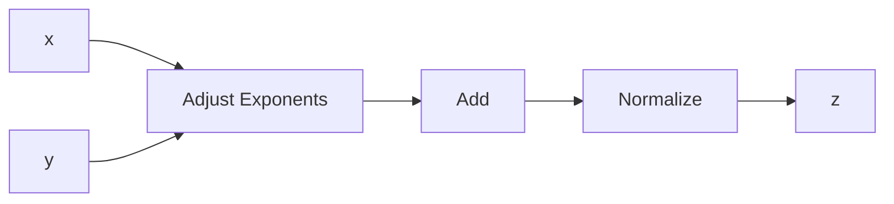
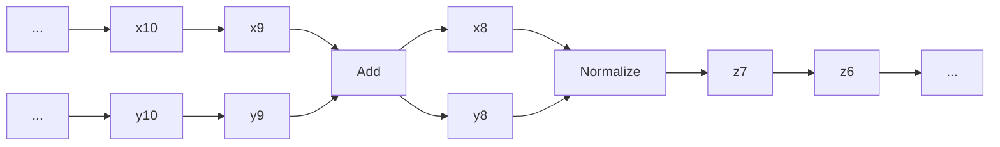
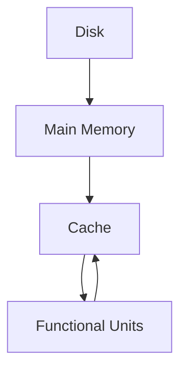

# 1.5 Vectorization and Locality

When it comes to designing a high-performance matrix computation, it is not enough simply to minimize flops. Attention must be paid to how the arithmetic units interact with the underlying memory system. Data structures are an important part of the picture because not all matrix layouts are “architecture friendly.” Our aim is to build a practical appreciation for these issues by presenting various simplified models of execution. These models are qualitative and are just informative pointers to complex implementation issues.

# 1.5.1 Vector Processing

An individual floating point operation typically requires several cycles to complete. A 3-cycle addition is depicted in Figure 1.5.1. The input scalars x and y proceed along


<details>
<summary>flowchart</summary>


</details>

Figure 1.5.1. A 3-Cycle adder

a computational “assembly line,” spending one cycle at each of three work “stations.” The sum z emerges after three cycles. Note that, during the execution of a single, “free standing” addition, only one of the three stations would be active at any particular instant.

Vector processors exploit the fact that a vector operation is a very regular sequence of scalar operations. The key idea is pipelining, which we illustrate using the vector addition computation $z = x + y$ . With pipelining, the x and y vectors are streamed through the addition unit. Once the pipeline is filled and steady state reached, a z-vector component is produced every cycle, as shown in Figure 1.5.2. In


<details>
<summary>flowchart</summary>


</details>

Figure 1.5.2. Pipelined addition

this case, we would anticipate vector processing to proceed at about three times the rate of scalar processing.

A vector processor comes with a repertoire of vector instructions, such as vector add, vector multiply, vector scale, dot product, and saxpy. These operations take place in vector registers with input and output handled by vector load and vector store instructions. An important attribute of a vector processor is the length $v _ { L }$ of the vector registers that carry out the vector operations. A length-n vector operation must be broken down into subvector operations of length $v _ { \scriptscriptstyle L }$ or less. Here is how such a partitioning might be managed for a vector addition $z = x + y$ where x and y are n-vectors:

$$
f i r s t = 1
$$

while $f i r s t \le n$

$$
l a s t = \min \left\{n, f i r s t + v _ {L} - 1 \right\}
$$

Vector load: $r _ { 1 } \gets x ( f i r s t { : } l a s t )$

$$
\text { Vector   load: } r _ {2} \leftarrow y (\text { first }: \text { last }) \tag {1.5.1}
$$

Vector add: $r _ { 1 } ~ = ~ r _ { 1 } + r _ { 2 }$

Vector store: $z ( f i r s t { : } l a s t ) \gets r _ { 1 }$

$$
f i r s t = l a s t + 1
$$

end

The vector addition is a register-register operation while the “flopless” movement of data to and from the vector registers is identified with the left arrow $\ "  \ "$ . Let us model the number of cycles required to carry out the various steps in (1.5.1). For clarity, assume that n is very large and an integral multiple of $v _ { L }$ , thereby making it safe to ignore the final cleanup pass through the loop.

Regarding the vectorized addition $r _ { 1 } = r _ { 1 } + r _ { 2 }$ , assume it takes $\tau _ { \mathrm { a d d } }$ cycles to fill the pipeline and that once this happens, a component of z is produced each cycle. It follows that

$$
N _ {\mathrm{arith}} = \left(\frac {n}{v _ {L}}\right) \left(\tau_ {\mathrm{add}} + v _ {L}\right) = \left(\frac {\tau_ {\mathrm{add}}}{v _ {L}} + 1\right) n
$$

accounts for the total number cycles that (1.5.1) requires for arithmetic.

For the vector loads and stores, assume that $\tau _ { \mathrm { d a t a } } + v _ { L }$ cycles are required to transport a length-vL vector from memory to a register or from a register to memory, where $\tau _ { \mathrm { d a t a } }$ is the number of cycles required to fill the data pipeline. With these assumptions we see that

$$
N _ {\mathrm{data}} = 3 \left(\frac {n}{v _ {L}}\right) (\tau_ {\mathrm{data}} + v _ {L}) = 3 \left(\frac {\tau_ {\mathrm{add}}}{v _ {L}} + 1\right) n
$$

specifies the number of cycles that are required by (1.5.1) to get data to and from the registers.

The arithmetic-to-data-motion ratio

$$
N _ {\mathrm{arith}} / N _ {\mathrm{data}} = \frac {\tau_ {\mathrm{add}} + v _ {L}}{3 (\tau_ {\mathrm{data}} + v _ {L})}
$$

and the total cycles sum

$$
N _ {\mathrm{arith}} + N _ {\mathrm{data}} = \left(\frac {\tau_ {\mathrm{arith}} + 3 \tau_ {\mathrm{data}}}{v _ {L}} + 4\right) n
$$

are illuminating statistics, but they are not necessarily good predictors of performance. In practice, vector loads, stores, and arithmetic are “overlapped” through the chaining together of various pipelines, a feature that is not captured by our model. Nevertheless, our simple analysis is a preliminary reminder that data motion is an important factor when reasoning about performance.

# 1.5.2 Gaxpy versus Outer Product

Two algorithms that involve the same number of flops can have substantially different data motion properties. Consider the n-by-n gaxpy

$$
y = y + A x
$$

and the n-by-n outer product update

$$
A = A + y x ^ {T}.
$$

Both of these level-2 operations involve $2 n ^ { 2 }$ flops. However, if we assume (for clarity) that $n = v _ { L }$ , then we see that the gaxpy computation

$$
\begin{array}{l} r _ {x} \leftarrow x \\ r _ {y} \leftarrow y \\ \text { for } j = 1: n \\ r _ {a} \leftarrow A (:, j) \\ r _ {y} = r _ {y} + r _ {a} r _ {x} (j) \\ y \leftarrow r _ {y} \\ \end{array}
$$

requires (3 + n) load/store operations while for the outer product update

$$
\begin{array}{l} r _ {x} \gets x \\ r _ {y} \leftarrow y \\ \text { for } j = 1: n \\ r _ {a} \leftarrow A (:, j) \\ r _ {a} = r _ {a} + r _ {y} r _ {x} (j) \\ A (:, j) \leftarrow r _ {a} \\ \end{array}
$$

the corresponding count is $( 2 + 2 n )$ . Thus, the data motion overhead for the outer product update is worse by a factor of 2, a reality that could be a factor in the design of a high-performance matrix computation.

# 1.5.3 The Relevance of Stride

The time it takes to load a vector into a vector register may depend greatly on how the vector is laid out in memory, a detail that we did not consider in §1.5.1. Two concepts help frame the issue. A vector is said to have unit stride if its components are contiguous in memory. A matrix is said to be stored in column-major order if its columns have unit stride.

Let us consider the matrix multiplication update calculation

$$
C = C + A B
$$

where it is assumed that the matrices $C \in \mathbb { R } ^ { m \times n } , A \in \mathbb { R } ^ { m \times r }$ , and $B \in \mathbb { R } ^ { r \times n }$ are stored in column-major order. Suppose the loading of a unit-stride vector proceeds much more quickly than the loading of a non-unit-stride vector. If so, then the implementation which accesses C, A, and B by column would be preferred to

for $j = 1:n$ for $k = 1:r$ $C(:,j) = C(:,j) + A(:,k)\cdot B(k,j)$ end   
end

```matlab
for i = 1:m
    for j = 1:n
    C(i,j) = C(i,j) + A(i,:)·B(:,j)
    end
end 
```

which accesses C and A by row. While this example points to the possible importance of stride, it is important to keep in mind that the penalty for non-unit-stride access varies from system to system and may depend upon the value of the stride itself.

# 1.5.4 Blocking for Data Reuse

Matrices reside in memory but memory has levels. A typical arrangement is depicted in Figure 1.5.3. The cache is a relatively small high-speed memory unit that sits


<details>
<summary>flowchart</summary>


</details>

Figure 1.5.3. A memory hierarchy

just below the functional units where the arithmetric is carried out. During a matrix computation, matrix elements move up and down the memory hierarchy. The cache, which is a small high-speed memory situated in between the functional units and main memory, plays a particularly critical role. The overall design of the hierarchy varies from system to system. However, two maxims always apply:

• Each level in the hierarchy has a limited capacity and for economic reasons this capacity usually becomes smaller as we ascend the hierarchy.   
• There is a cost, sometimes relatively great, associated with the moving of data between two levels in the hierarchy.

The efficient implementation of a matrix algorithm requires an ability to reason about the flow of data between the various levels of storage.

To develop an appreciation for cache utilization we again consider the update $C = C + A B$ where each matrix is n-by-n and blocked as follows:

$$
C = \left[ \begin{array}{c c c} C _ {1 1} & \dots & C _ {1 r} \\ \vdots & \ddots & \vdots \\ C _ {q r} & \dots & C _ {q r} \end{array} \right] A = \left[ \begin{array}{c c c} A _ {1 1} & \dots & A _ {1 p} \\ \vdots & \ddots & \vdots \\ A _ {q r} & \dots & A _ {q p} \end{array} \right] B = \left[ \begin{array}{c c c} B _ {1 1} & \dots & B _ {1 r} \\ \vdots & \ddots & \vdots \\ B _ {p r} & \dots & B _ {p r} \end{array} \right].
$$

Assume that these three matrices reside in main memory and that we plan to update C block by block:

$$
C _ {i j} = C _ {i j} + \sum_ {k = 1} ^ {p} A _ {i k} B _ {k j}.
$$

The data in the blocks must be brought up to the functional units via the cache which we assume is large enough to hold a C-block, an A-block, and a B-block. This enables us to structure the computation as follows:

$$
\begin{array}{l} \text { for } i = 1: q \\ \text { for } j = 1: r \\ \text { for } k = 1: p \\ C _ {i j} = C _ {i j} + A _ {i k} B _ {k j} \\ \end{array}
$$

The question before us is how to choose the blocking parameters $q , r ,$ and $p$ so as to minimize memory traffic to and from the cache. Assume that the cache can hold M floating point numbers and that $M \ll 3 n ^ { 2 }$ , thereby forcing us to block the computation.

We assume that

$$
\left. \begin{array}{l} C _ {i j} \\ A _ {i k} \\ B _ {k j} \end{array} \right\} \text {is roughly} \left\{ \begin{array}{l} (n / q) \text {-by-} (n / r) \\ (n / q) \text {-by-} (n / p) \\ (n / p) \text {-by-} (n / r) \end{array} \right..
$$

We say “roughly” because if q, r, or $p$ does not divide $n ,$ then the blocks are not quite uniformly sized, e.g.,

$$
A = \left[ \begin{array}{c c c c c c c c c c} \times & \times & \times & \times & \times & \times & \times & \times & \times & \times \\ \times & \times & \times & \times & \times & \times & \times & \times & \times & \times \\ \times & \times & \times & \times & \times & \times & \times & \times & \times & \times \\ \times & \times & \times & \times & \times & \times & \times & \times & \times & \times \\ \hline \times & \times & \times & \times & \times & \times & \times & \times & \times & \times \\ \times & \times & \times & \times & \times & \times & \times & \times & \times & \times \\ \times & \times & \times & \times & \times & \times & \times & \times & \times & \times \\ \times & \times & \times & \times & \times & \times & \times & \times & \times & \times \\ \hline \times & \times & \times & \times & \times & \times & \times & \times & \times & \times \\ \times & \times & \times & \times & \times & \times & \times & \times & \times & \times \end{array} \right], \qquad \begin{array}{l} n = 1 0, \\ q = 3, \\ p = 4. \end{array}
$$

However, nothing is lost in glossing over this detail since our aim is simply to develop an intuition about cache utilization for large-n problems. Thus, we are led to impose the following constraint on the blocking parameters:

$$
\left(\frac {n}{q}\right) \left(\frac {n}{r}\right) + \left(\frac {n}{q}\right) \left(\frac {n}{p}\right) + \left(\frac {n}{p}\right) \left(\frac {n}{r}\right) \leq M. \tag {1.5.5}
$$

Proceeding with the optimization, it is reasonable to maximize the amount of arithmetic associated with the update $C _ { i j } = C _ { i j } + A _ { i k } B _ { k j }$ . After all, we have moved matrix data from main memory to cache and should make the most of the investment. This leads to the problem of maximizing $2 n ^ { 3 } / ( q r p )$ subject to the constraint (1.5.5). A straightforward Lagrange multiplier argument leads us to conclude that

$$
q _ {\mathrm{opt}} = p _ {\mathrm{opt}} = r _ {\mathrm{opt}} \approx \sqrt {\frac {n ^ {2}}{3 M}}. \tag {1.5.6}
$$

That is, each block of $C , A .$ , and B should be approximately square and occupy about one-third of the cache.

Because blocking affects the amount of memory traffic in a matrix computation, it is of paramount importance when designing a high-performance implementation. In practice, things are never as simple as in our model example. The optimal choice of qopt, $r _ { \mathrm { o p t } }$ , and $p _ { \mathrm { o p t } }$ will also depend upon transfer rates between memory levels and upon all the other architecture factors mentioned earlier in this section. Data structures are also important; storing a matrix by block rather than in column-major order could enhance performance.

# Problems

P1.5.1 Suppose $A \in \mathbb { R } ^ { n \times n }$ is tridiagonal and that the elements along its subdiagonal, diagonal, and superdiagonal are stored in vectors $e ( 1 { : } n - 1 ) , d ( 1 { : } n )$ , and $f ( 2 { : } n )$ . Give a vectorized implementation of the n-by-n gaxpy $y = y + A x$ . Hint: Make use of the vector multiplication operation.

P1.5.2 Give an algorithm for computing $C = C + A ^ { T } B A$ where A and B are n-by-n and B is symmetric. Innermost loops should oversee unit-stride vector operations.

P1.5.3 Suppose $A \in \mathbb { R } ^ { m \times n }$ is stored in column-major order and that $m = m _ { 1 } M$ and $n = n _ { 1 } N$ . Regard A as an M-by-N block matrix with $m _ { 1 } { \mathrm { - b y } } { \mathrm { - } } n _ { 1 }$ blocks. Give an algorithm for storing A in a vector A.block(1:mn) with the property that each block $A _ { i j }$ is stored contiguously in column-major order.

# Notes and References for §1.5

References that address vector computation include:

J.J. Dongarra, F.G. Gustavson, and A. Karp (1984). “Implementing Linear Algebra Algorithms for Dense Matrices on a Vector Pipeline Machine,” SIAM Review 26, 91–112.   
B.L. Buzbee (1986) “A Strategy for Vectorization,” Parallel Comput. 3, 187–192.   
K. Gallivan, W. Jalby, U. Meier, and A.H. Sameh (1988). “Impact of Hierarchical Memory Systems on Linear Algebra Algorithm Design,” Int. J. Supercomput. Applic. 2, 12–48.   
J.J. Dongarra and D. Walker (1995). “Software Libraries for Linear Algebra Computations on High Performance Computers,” SIAM Review 37, 151–180.   
One way to realize high performance in a matrix computation is to design algorithms that are rich in matrix multiplication and then implement those algorithms using an optimized level-3 BLAS library. For details on this philosophy and its effectiveness, see:

B. K˚agstr¨om, P. Ling, and C. Van Loan (1998). “GEMM-based Level-3 BLAS: High-Performance Model Implementations and Performance Evaluation Benchmark,” ACM Trans. Math. Softw. 24, 268–302.   
M.J. Dayde and I.S. Duff (1999). “The RISC BLAS: A Blocked Implementation of Level 3 BLAS for RISC Processors,” ACM Trans. Math. Softw. 25, 316–340.   
E. Elmroth, F. Gustavson, I. Jonsson, and B. K˚agstr¨om (2004). “Recursive Blocked Algorithms and Hybrid Data Structures for Dense Matrix Library Software,” SIAM Review 46, 3–45.   
K. Goto and R. Van De Geign (2008). “Anatomy of High-Performance Matrix Multiplication,” ACM Trans. Math. Softw. 34, 12:1–12:25.

Advanced data structures that support high performance matrix computations are discussed in:

F.G. Gustavson (1997). “Recursion Leads to Automatic Variable Blocking for Dense Linear Algebra Algorithms,” IBM J. Res. Dev. 41, 737–755.   
V. Valsalam and A. Skjellum (2002). “A Framework for High-Performance Matrix Multiplication Based on Hierarchical Abstractions, Algorithms, and Optimized Low-Level Kernels,” Concurrency Comput. Pract. Exper. 14, 805–839.   
S.R. Chatterjee, P. Patnala, and M. Thottethodi (2002). “Recursive Array Layouts and Fast Matrix Multiplication,” IEEE Trans. Parallel. Distrib. Syst. 13, 1105–1123.   
F.G. Gustavson (2003). “High-Performance Linear Algebra Algorithms Using Generalized Data Structures for Matrices,” IBM J. Res. Dev. 47, 31–54.   
N. Park, B. Hong, and V.K. Prasanna (2003). “Tiling, Block Data Layout, and Memory Hierarchy Performance,” IEEE Trans. Parallel Distrib. Systems, 14, 640–654.   
J.A. Gunnels, F.G. Gustavson, G.M. Henry, and R.A. van de Geijn (2005). “A Family of High-Performance Matrix Multiplication Algorithms,” PARA 2004, LNCS 3732, 256–265.   
P. D’Alberto and A. Nicolau (2009). “Adaptive Winograd’s Matrix Multiplications,” ACM Trans. Math. Softw. 36, 3:1–3:23.

A great deal of effort has gone into the design of software tools that automatically block a matrix computation for high performance, e.g.,

S. Carr and R.B. Lehoucq (1997) “Compiler Blockability of Dense Matrix Factorizations,” ACM Trans. Math. Softw. 23, 336–361.   
J.A. Gunnels, F. G. Gustavson, G.M. Henry, and R. A. van de Geijn (2001). “FLAME: Formal Linear Algebra Methods Environment,” ACM Trans. Math. Softw. 27, 422–455.   
P. Bientinesi, J.A. Gunnels, M.E. Myers, E. Quintana-Orti, and R.A. van de Geijn (2005). “The Science of Deriving Dense Linear Algebra Algorithms,” ACM Trans. Math. Softw. 31, 1–26.   
J. Demmel, J. Dongarra, V. Eijkhout, E. Fuentes, A. Petitet, R. Vuduc, R.C. Whaley, and K. Yelick (2005). “Self-Adapting Linear Algebra Algorithms and Software,”, Proc. IEEE 93, 293–312.   
K. Yotov, X.Li, G. Ren, M. Garzaran, D. Padua, K. Pingali, and P. Stodghill (2005). “Is Search Really Necessary to Generate High-Performance BLAS?,” Proc. IEEE 93, 358–386.

For a rigorous treatment of communication lower bounds in matrix computations, see:

G. Ballard, J. Demmel, O. Holtz, and O. Schwartz (2011). “Minimizing Communication in Numerical Linear Algebra,” SIAM J. Matrix Anal. Applic. 32, 866–901.
