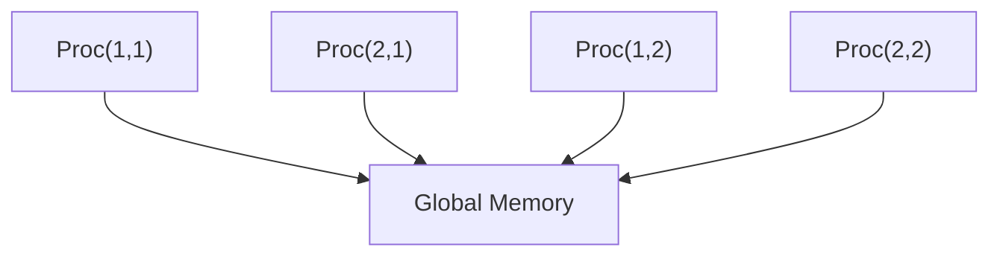
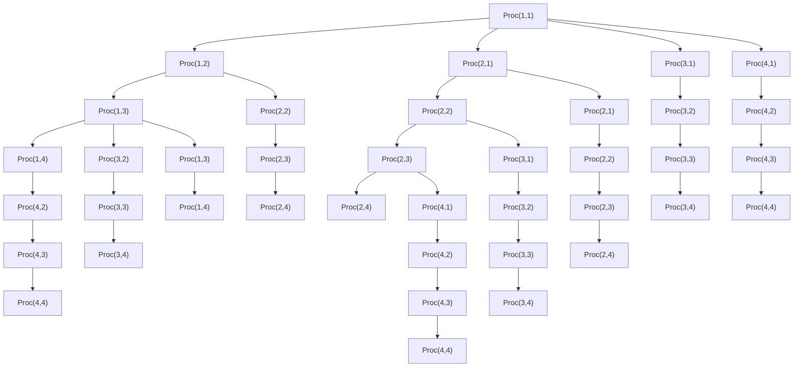

# 1.6 Parallel Matrix Multiplication

The impact of matrix computation research in many application areas depends upon the development of parallel algorithms that scale. Algorithms that scale have the property that they remain effective as problem size grows and the number of involved processors increases. Although powerful new programming languages and related system tools continue to simplify the process of implementing a parallel matrix computation, being able to “think parallel” is still important. This requires having an intuition about load balancing, communication overhead, and processor synchronization.

# 1.6.1 A Model Computation

To illustrate the major ideas associated with parallel matrix computations, we consider the following model computation:

Given $C \in \mathbb { R } ^ { m \times n } , A \in \mathbb { R } ^ { m \times r }$ , and $B \in \mathbb { R } ^ { r \times n }$ , effectively compute the matrix multiplication update $C = C + A B$ assuming the availability of $p$ processors. Each processor has its own local memory and executes its own local program.

The matrix multiplication update problem is a good choice because it is an inherently parallel computation and because it is at the heart of many important algorithms that we develop in later chapters.

The design of a parallel procedure begins with the breaking up of the given problem into smaller parts that exhibit a measure of independence. In our problem we assume the blocking

$$
C = \left[ \begin{array}{c c c} C _ {1 1} & \dots & C _ {1 N} \\ \vdots & \ddots & \vdots \\ C _ {M 1} & \dots & C _ {M N} \end{array} \right], A = \left[ \begin{array}{c c c} A _ {1 1} & \dots & A _ {1 R} \\ \vdots & \ddots & \vdots \\ A _ {M 1} & \dots & A _ {M R} \end{array} \right], B = \left[ \begin{array}{c c c} B _ {1 1} & \dots & B _ {1 N} \\ \vdots & \ddots & \vdots \\ B _ {R 1} & \dots & B _ {R N} \end{array} \right], \tag {1.6.1}
$$

$$
m = m _ {1} M, \qquad r = r _ {1} R, \qquad n = n _ {1} N
$$

with $C _ { i j } \in \mathbb { R } ^ { m _ { 1 } \times n _ { 1 } }$ , $A _ { i j } \in \mathbb { R } ^ { m _ { 1 } \times r _ { 1 } }$ , and $B _ { i j } \in \mathbb { R } ^ { r _ { 1 } \times n _ { 1 } }$ . It follows that the $C + A B$ update partitions nicely into M N smaller tasks:

$$
\text { Task } (i, j): \quad C _ {i j} = C _ {i j} + \sum_ {k = 1} ^ {R} A _ {i k} B _ {k j}. \tag {1.6.2}
$$

Note that the block-block products $A _ { i k } B _ { k j }$ are all the same size.

Because the tasks are naturally double-indexed, we double index the available processors as well. Assume that $p = p _ { \mathrm { r o w } } p _ { \mathrm { c o l } }$ and designate the (i, j)th processor by $\mathrm { P r o c } ( i , j )$ for $i = 1 { : } p _ { \mathrm { r o w } }$ and $j = 1 { : } p _ { \mathrm { c o l } }$ . The double indexing of the processors is just a notation and is not a statement about their physical connectivity.

# 1.6.2 Load Balancing

An effective parallel program equitably partitions the work among the participating processors. Two subdivision strategies for the model computation come to mind. The 2-dimensional block distribution assigns contiguous block updates to each processor. See Figure 1.6.1. Alternatively, we can have $\operatorname { P r o c } ( \mu , \tau )$ oversee the update of $C _ { i j }$ for $i = \mu { : } p _ { \mathrm { r o w } } { : } M$ and $j = \tau { : } p _ { \mathrm { c o l } } { : } N$ . This is called the 2-dimensional block-cyclic distribution. See Figure 1.6.2. For the displayed example, both strategies assign twelve $C _ { i j }$ updates to each processor and each update involves R block-block multiplications, i.e., $1 2 ( 2 m _ { 1 } n _ { 1 } r _ { 1 } )$ flops. Thus, from the flop point of view, both strategies are load balanced, by which we mean that the amount of arithmetic computation assigned to each processor is roughly the same.

<table><tr><td>Proc(1,1) $\left\{ \begin{array}{ccc}C_{11} & C_{12} & C_{13}\\ C_{21} & C_{22} & C_{23}\\ C_{31} & C_{32} & C_{33}\\ C_{41} & C_{42} & C_{43} \end{array} \right\}$ </td><td>Proc(1,2) $\left\{ \begin{array}{ccc}C_{14} & C_{15} & C_{16}\\ C_{24} & C_{25} & C_{26}\\ C_{34} & C_{35} & C_{36}\\ C_{44} & C_{45} & C_{46} \end{array} \right\}$ </td><td>Proc(1,3) $\left\{ \begin{array}{ccc}C_{17} & C_{18} & C_{19}\\ C_{27} & C_{28} & C_{29}\\ C_{37} & C_{38} & C_{39}\\ C_{47} & C_{48} & C_{49} \end{array} \right\}$ </td></tr><tr><td>Proc(2,1) $\left\{ \begin{array}{ccc}C_{51} & C_{52} & C_{53}\\ C_{61} & C_{62} & C_{63}\\ C_{71} & C_{72} & C_{73}\\ C_{81} & C_{82} & C_{83} \end{array} \right\}$ </td><td>Proc(2,2) $\left\{ \begin{array}{ccc}C_{54} & C_{55} & C_{56}\\ C_{64} & C_{65} & C_{66}\\ C_{74} & C_{75} & C_{76}\\ C_{84} & C_{85} & C_{86} \end{array} \right\}$ </td><td>Proc(2,3) $\left\{ \begin{array}{ccc}C_{57} & C_{58} & C_{59}\\ C_{67} & C_{68} & C_{69}\\ C_{77} & C_{78} & C_{79}\\ C_{87} & C_{88} & C_{89} \end{array} \right\}$ </td></tr></table>

Figure 1.6.1. The block distribution of tasks   
$( M = 8 , p _ { \mathrm { r o w } } = 2 , N = 9$ , and $p _ { \mathrm { c o l } } = 3 )$

<table><tr><td>Proc(1,1) $\left\{ \begin{array}{ccc}C_{11} & C_{14} & C_{17}\\ C_{31} & C_{34} & C_{37}\\ C_{51} & C_{54} & C_{57}\\ C_{71} & C_{74} & C_{77} \end{array} \right\}$ </td><td>Proc(1,2) $\left\{ \begin{array}{ccc}C_{12} & C_{15} & C_{18}\\ C_{32} & C_{35} & C_{38}\\ C_{52} & C_{55} & C_{58}\\ C_{72} & C_{75} & C_{78} \end{array} \right\}$ </td><td>Proc(1,3) $\left\{ \begin{array}{ccc}C_{13} & C_{16} & C_{19}\\ C_{33} & C_{36} & C_{39}\\ C_{53} & C_{56} & C_{59}\\ C_{73} & C_{76} & C_{79} \end{array} \right\}$ </td></tr><tr><td>Proc(2,1) $\left\{ \begin{array}{ccc}C_{21} & C_{24} & C_{27}\\ C_{41} & C_{44} & C_{47}\\ C_{61} & C_{64} & C_{67}\\ C_{81} & C_{84} & C_{87} \end{array} \right\}$ </td><td>Proc(2,2) $\left\{ \begin{array}{ccc}C_{22} & C_{25} & C_{28}\\ C_{42} & C_{45} & C_{48}\\ C_{62} & C_{65} & C_{68}\\ C_{82} & C_{85} & C_{88} \end{array} \right\}$ </td><td>Proc(2,3) $\left\{ \begin{array}{ccc}C_{23} & C_{26} & C_{29}\\ C_{43} & C_{46} & C_{49}\\ C_{63} & C_{66} & C_{69}\\ C_{83} & C_{86} & C_{89} \end{array} \right\}$ </td></tr></table>

Figure 1.6.2. The block-cyclic distribution of tasks   
(M = 8, prow = 2, N = 9, and $p _ { \mathrm { c o l } } = 3 )$ .

If M is not a multiple of $p _ { \mathrm { r o w } }$ or if N is not a multiple of $p _ { \mathrm { c o l } }$ , then the distribution of work among processors is no longer balanced. Indeed, if

$$
M = \alpha_ {1} p _ {\text {row}} + \beta_ {1}, \quad 0 \leq \beta_ {1} <   p _ {\text {row}},
$$

$$
N = \alpha_ {2} p _ {\text {col}} + \beta_ {2}, \quad 0 \leq \beta_ {2} <   p _ {\text {col}},
$$

then the number of block-block multiplications per processor can range from $\alpha _ { 1 } \alpha _ { 2 } R$ to $( \alpha _ { 1 } + 1 ) ( \alpha _ { 2 } + 1 ) R$ . However, this variation is insignificant in a large-scale computation with $M \gg p _ { \mathrm { r o w } }$ and $N \gg p _ { \mathrm { c o l } }$ :

$$
\frac {(\alpha_ {1} + 1) (\alpha_ {2} + 1) R}{(\alpha_ {1} \alpha_ {2}) R} = 1 + O \left(\frac {p _ {\text { row }}}{M} + \frac {p _ {\text { col }}}{N}\right).
$$

We conclude that both the block distribution and the block-cyclic distribution strategies are load balanced for the general $C + A B$ update.

This is not the case for certain block-sparse situations that arise in practice. If A is block lower triangular and B is block upper triangular, then the amount of work associated with Task $( i , j )$ depends upon i and j. Indeed from (1.6.2) we have

$$
C _ {i j} = C _ {i j} + \sum_ {k = 1} ^ {\min \{i, j, R \}} A _ {i k} B _ {k j}.
$$

A very uneven allocation of work for the block distribution can result because the number of flops associated with Task $( i , j )$ increases with i and $j .$ . The tasks assigned to Proc $( p _ { \mathrm { r o w } } , p _ { \mathrm { c o l } } )$ involve the most work while the tasks assigned to $\mathrm { P r o c } ( 1 , 1 )$ involve the least. To illustrate the ratio of workloads, set $M = N = R = \tilde { M }$ and assume that $p _ { \mathrm { r o w } } = p _ { \mathrm { c o l } } = \tilde { p }$ divides $\tilde { M }$ . It can be shown that

$$
\frac {\text { Flops   assigned   to   } \text { Proc } (\tilde {p} , \tilde {p})}{\text { Flops   assigned   to   } \text { Proc } (1 , 1)} = O (\tilde {p}) \tag {1.6.3}
$$

if we assume $\tilde { M } / \tilde { p } \gg 1$ . Thus, load balancing does not depend on problem size and gets worse as the number of processors increase.

This is not the case for the block-cyclic distribution. Again, Proc(1,1) and $\mathrm { P r o c } ( \tilde { p } , \tilde { p } )$ are the least busy and most busy processors. However, now it can be verified that

$$
\frac {\text { Flops   assigned   to   } \operatorname{Proc} (\tilde {p} , \tilde {p})}{\text { Flops   assigned   to   } \operatorname{Proc} (1 , 1)} = 1 + O \left(\frac {\tilde {p}}{\tilde {M}}\right), \tag {1.6.4}
$$

showing that the allocation of work becomes increasingly balanced as the problem size grows.

Another situation where the block-cyclic distribution of tasks is preferred is the case when the first q block rows of A are zero and the first q block columns of B are zero. This situation arises in several important matrix factorization schemes. Note from Figure 1.6.1 that if $q$ is large enough, then some processors have absolutely nothing to do if tasks are assigned according to the block distribution. On the other hand, the block-cyclic distribution is load balanced, providing further justification for this method of task distribution.

# 1.6.3 Data Motion Overheads

So far the discussion has focused on load balancing from the flop point of view. We now turn our attention to the costs associated with data motion and processor coordination. How does a processor get hold of the data it needs for an assigned task? How does a processor know enough to wait if the data it needs is the output of a computation being performed by another processor? What are the overheads associated with data transfer and synchronization and how do they compare to the costs of the actual arithmetic?

The importance of data locality is discussed in §1.5. However, in a parallel computing environment, the data that a processor needs can be “far away,” and if that is the case too often, then it is possible to lose the multiprocessor advantage. Regarding synchronization, time spent waiting for another processor to finish a calculation is time lost. Thus, the design of an effective parallel computation involves paying attention to the number of synchronization points and their impact. Altogether, this makes it difficult to model performance, especially since an individual processor can typically compute and communicate at the same time. Nevertheless, we forge ahead with our analysis of the model computation to dramatize the cost of data motion relative to flops. For the remainder of this section we assume:

(a) The block-cyclic distribution of tasks is used to ensure that arithmetic is load balanced.   
(b) Individual processors can perform the computation $C _ { i j } = C _ { i j } + A _ { i k } B _ { k j }$ at a rate of $F$ flops per second. Typically, a processor will have its own local memory hierarchy and vector processing capability, so F is an attempt to capture in a single number all the performance issues that we discussed in §1.5.   
(c) The time required to move η floating point numbers into or out of a processor is $\alpha + \beta \eta$ . In this model, the parameters α and $\beta$ respectively capture the latency and bandwidth attributes associated with data transfer.

With these simplifications we can roughly assess the effectiveness of assigning p processors to the update computation $C = C + A B$ .

Let $T _ { \mathrm { a r i t h } } ( p )$ be the time that each processor must spend doing arithmetic as it carries out its share of the computation. It follows from assumptions (a) and (b) that

$$
T _ {\text {arith}} (p) \approx \frac {2 m n r}{p F}. \tag {1.6.5}
$$

Similarly, let $T _ { \mathrm { d a t a } } ( p )$ be the time that each processor must spend acquiring the data it needs to perform its tasks. Ordinarily, this quantity would vary significantly from processor to processor. However, the implementation strategies outlined below have the property that the communication overheads are roughly the same for each processor. It follows that if $T _ { \mathrm { a r i t h } } ( p ) + T _ { \mathrm { d a t a } } ( p )$ approximates the total execution time for the p-processor solution, then the quotient

$$
S (p) = \frac {T _ {\text {arith}} (1)}{T _ {\text {arith}} (p) + T _ {\text {data}} (p)} = \frac {p}{1 + \frac {T _ {\text {data}} (p)}{T _ {\text {arith}} (p)}} \tag {1.6.6}
$$

is a reasonable measure of speedup. Ideally, the assignment of $p$ processors to the $C = C + A B$ update would reduce the single-processor execution time by a factor of p. However, from (1.6.6) we see that $S ( p ) < p$ with the compute-to-communicate ratio $T _ { \mathrm { d a t a } } ( p ) / T _ { \mathrm { a r i t h } } ( p )$ explaining the degradation. To acquire an intuition about this all-important quotient, we need to examine more carefully the data transfer properties associated with each task.

# 1.6.4 Who Needs What

If a processor carries out Task $( i , j )$ , then at some time during the calculation, blocks $C _ { i j } , A _ { i 1 } , \ldots , A _ { i R } , B _ { 1 j } , \ldots , B _ { R j }$ must find their way into its local memory. Given assumptions (a) and (c), Table 1.6.1 summarizes the associated data transfer overheads for an individual processor:

<table><tr><td colspan="3">Required Blocks</td><td>Data Transfer Time per Block</td></tr><tr><td> $C_{ij}$ </td><td> $i = \mu: p_{\text{row}}: M$ </td><td> $j = \tau: p_{\text{col}}: N$ </td><td> $\alpha + \beta m_1 n_1$ </td></tr><tr><td> $A_{ij}$ </td><td> $i = \mu: p_{\text{row}}: M$ </td><td> $j = 1: R$ </td><td> $\alpha + \beta m_1 r_1$ </td></tr><tr><td> $B_{ij}$ </td><td> $i = 1: R$ </td><td> $j = \tau: p_{\text{col}}: N$ </td><td> $\alpha + \beta r_1 n_1$ </td></tr></table>

Table 1.6.1. Communication overheads for Proc(µ, τ )

It follows that if

$$
\gamma_ {C} = \text { total   number   of   required   } C \text {-block transfers}, \tag {1.6.7}
$$

$$
\gamma_ {A} = \text { total   number   of   required   } A \text {-block transfers}, \tag {1.6.8}
$$

$$
\gamma_ {B} = \text { total   number   of   required   } B \text {-block transfers}, \tag {1.6.9}
$$

then

$$
T _ {\mathrm{data}} (p) \approx \gamma_ {C} (\alpha + \beta m _ {1} n _ {1}) + \gamma_ {A} (\alpha + \beta m _ {1} r _ {1}) + \gamma_ {B} (\alpha + \beta r _ {1} n _ {1}),
$$

and so from from (1.6.5) we have

$$
\frac {T _ {\mathrm{data}} (p)}{T _ {\mathrm{arith}} (p)} \approx \frac {F p}{2} \left(\alpha \frac {\gamma_ {C} + \gamma_ {A} + \gamma_ {B}}{m n r} + \beta \left(\frac {\gamma_ {C}}{M N r} + \frac {\gamma_ {A}}{M n R} + \frac {\gamma_ {B}}{m N R}\right)\right). \tag {1.6.10}
$$

To proceed further with our analysis, we need to estimate the γ-factors (1.6.7)–(1.6.9), and that requires assumptions about how the underlying architecture stores and accesses the matrices A, B, and C.

# 1.6.5 The Shared-Memory Paradigm

In a shared-memory system each processor has access to a common, global memory. See Figure 1.6.3. During program execution, data flows to and from the global memory and this represents a significant overhead that we proceed to assess. Assume that the matrices C, A, and B are in global memory at the start and that $\operatorname { P r o c } ( \mu , \tau )$ executes the following:

flowchart

Figure 1.6.3. A four-processor shared-memory system

for $i = \mu: p_{row}: M$ for $j = \tau: p_{col}: N$ $C^{(\mathrm{loc})} \leftarrow C_{ij}$ for $k = 1: R$ $A^{(\mathrm{loc})} \leftarrow A_{ik}$ $B^{(\mathrm{loc})} \leftarrow B_{kj}$ $C^{(\mathrm{loc})} = C^{(\mathrm{loc})} + A^{(\mathrm{loc})} B^{(\mathrm{loc})}$ end $C_{ij} \leftarrow C^{(\mathrm{loc})}$ end

end

As a reminder of the interactions between global and local memory, we use the $^ { 6 6 }  ^ { 5 9 }$ notation to indicate data transfers between these memory levels and the “loc” superscript to designate matrices in local memory. The block transfer statistics (1.6.7)-(1.6.9) for Method 1 are given by

$$
\gamma_ {c} \approx 2 (M N / p),
$$

$$
\gamma_ {A} \approx R (M N / p),
$$

$$
\gamma_ {B} \approx R (M N / p),
$$

and so from (1.6.10) we obtain

$$
\frac {T _ {\mathrm{data}} (p)}{T _ {\mathrm{arith}} (p)} \approx \frac {F}{2} \left(\alpha \frac {2 + 2 R}{m _ {1} n _ {1} r} + \beta \left(\frac {2}{r} + \frac {1}{n _ {1}} + \frac {1}{m _ {1}}\right)\right). \tag {1.6.11}
$$

By substituting this result into (1.6.6) we conclude that (a) speed-up degrades as the flop rate $F$ increases and (b) speedup improves if the communication parameters α and $\beta$ decrease or the block dimensions $m _ { 1 } , n _ { 1 }$ , and $r _ { 1 }$ increase. Note that the communicateto-compute ratio (1.6.11) for Method 1 does not depend upon the number of processors.

Method 1 has the property that it is only necessary to store one C-block, one Ablock, and one B-block in local memory at any particular instant, i.e., $C ^ { ( \mathrm { l o c } ) } , A ^ { ( \mathrm { l o c } ) }$ , and $B ^ { ( \mathrm { l o c } ) }$ . Typically, a processor’s local memory is much smaller than global memory, so this particular solution approach is attractive for problems that are very large relative to local memory capacity. However, there is a hidden cost associated with this economy because in Method 1, each A-block is loaded $N / p _ { \mathrm { c o l } }$ times and each B-block is loaded $M / p _ { \mathrm { r o w } }$ times. This redundancy can be eliminated if each processor’s local memory is large enough to house simultaneously all the C-blocks, A-blocks, and B-blocks that are required by its assigned tasks. Should this be the case, then the following method involves much less data transfer:

for $k = 1 { : } R$

$$
A _ {i k} ^ {(\mathrm{loc})} \leftarrow A _ {i k} \quad (i = \mu : p _ {\mathrm{row}}: M)
$$

$$
B _ {k j} ^ {(\mathrm{loc})} \leftarrow B _ {k j} \qquad (j = \tau : p _ {\mathrm{col}}: N)
$$

end

for $i = \mu { : } p _ { \mathrm { r o w } } { : } M$

$\mathrm { f o r } \ j = \tau { : } p _ { \mathrm { c o l } } { : } N$

$$
C ^ {(\mathrm{loc})} \leftarrow C _ {i j}
$$

$\mathbf { f o r } \ k = 1 { : } R$ (Method 2)

$$
C ^ {(\mathrm{loc})} = C ^ {(\mathrm{loc})} + A _ {i k} ^ {(\mathrm{loc})} B _ {k j} ^ {(\mathrm{loc})}
$$

end

$$
C _ {i j} \leftarrow C ^ {(\mathrm{loc})}
$$

end

end

The block transfer statistics $\gamma _ { C } ^ { \prime } , \gamma _ { A } ^ { \prime }$ , and $\gamma _ { B } ^ { \prime }$ , for Method 2 are more favorable than for Method 1. It can be shown that

$$
\gamma_ {C} ^ {\prime} = \gamma_ {C}, \quad \gamma_ {A} ^ {\prime} = \gamma_ {A} f _ {\text { col }}, \quad \gamma_ {B} ^ {\prime} = \gamma_ {B} f _ {\text { row }}, \tag {1.6.12}
$$

where the quotients $f _ { \mathrm { c o l } } = p _ { \mathrm { c o l } } / N$ and $f _ { \mathrm { r o w } } = p _ { \mathrm { r o w } } / M$ are typically much less than unity. As a result, the communicate-to-compute ratio for Method 2 is given by

$$
\frac {T _ {\mathrm{data}} (p)}{T _ {\mathrm{arith}} (p)} \approx \frac {F}{2} \left(\alpha \frac {2 + R \left(f _ {\mathrm{col}} + f _ {\mathrm{row}}\right)}{m _ {1} n _ {1} r} + \beta \left(\frac {2}{r} + \frac {1}{n _ {1}} f _ {\mathrm{col}} + \frac {1}{m _ {1}} f _ {\mathrm{row}}\right)\right), \tag {1.6.13}
$$

which is an improvement over (1.6.11). Methods 1 and 2 showcase the trade-off that frequently exists between local memory capacity and the overheads that are associated with data transfer.

# 1.6.6 Barrier Synchronization

The discussion in the previous section assumes that C, A, and B are available in global memory at the start. If we extend the model computation so that it includes the multiprocessor initialization of these three matrices, then an interesting issue arises. How does a processor “know” when the initialization is complete and it is therefore safe to begin its share of the $C = C + A B$ update?

Answering this question is an occasion to introduce a very simple synchronization construct known as the barrier. Suppose the C-matrix is initialized in global memory by assigning to each processor some fraction of the task. For example, $\operatorname { P r o c } ( \mu , \tau )$ could do this:

for $i = \mu: p_{\mathrm{row}}: M$ for $j = \tau: p_{\mathrm{col}}: N$ Compute the $(i, j)$ block of $C$ and store in $C^{(\mathrm{loc})}$ . $C_{ij} \leftarrow C^{(\mathrm{loc})}$ end  
end

Similar approaches can be taken for the setting up of $A = \left( A _ { i j } \right)$ and $B = \left( B _ { i j } \right)$ . Even if this partitioning of the initialization is load balanced, it cannot be assumed that each processor completes its share of the work at exactly the same time. This is where the barrier synchronization is handy. Assume that $\operatorname { P r o c } ( \mu , \tau )$ executes the following:

Initialize Cij ,

Initialize Bij , (1.6.14)

To understand the barrier command, regard a processor as being either “blocked” or “free.” Assume in (1.6.14) that all processors are free at the start. When it executes the barrier command, a processor becomes blocked and suspends execution. After the last processor is blocked, all the processors return to the free state and resume execution. In (1.6.14), the barrier does not allow the $C _ { i j }$ updating via Methods 1 or 2 to begin until all three matrices are fully initialized in global memory.

# 1.6.7 The Distributed-Memory Paradigm

In a distributed-memory system there is no global memory. The data is collectively housed in the local memories of the individual processors which are connected to form a network. There are many possible network topologies. An example is displayed in Figure 1.6.4. The cost associated with sending a message from one processor to another is likely to depend upon how “close” they are in the network. For example, with the torus in Figure 1.6.4, a message from Proc(1,1) to Proc(1,4) involves just one “hop” while a message from Proc(1,1) to Proc(3,3) would involve four.

Regardless, the message-passing costs in a distributed memory system have a serious impact upon performance just as the interactions with global memory affect performance in a shared memory system. Our goal is to approximate these costs as they might arise in the model computation. For simplicity, we make no assumptions about the underlying network topology.

flowchart

Figure 1.6.4. A 2-Dimensional Torus

Let us first assume that $M = N = R = p _ { \mathrm { r o w } } = p _ { \mathrm { c o l } } = 2$ and that the $C , A .$ , and B matrices are distributed as follows:

text_image

Proc(1,1)
C11, A11, B11
Proc(1,2)
C12, A12, B12
Proc(2,1)
C21, A21, B21
Proc(2,2)
C22, A22, B22

Assume that $\mathrm { P r o c } ( i , j )$ oversees the update of $C _ { i j }$ and notice that the required data for this computation is not entirely local. For example, Proc(1,1) needs to receive a copy of $A _ { 1 2 }$ from Proc(1,2) and a copy of $B _ { 2 1 }$ from Proc(2,1) before it can complete the update $C _ { 1 1 } = C _ { 1 1 } + A _ { 1 1 } B _ { 1 1 } + A _ { 1 2 } B _ { 2 1 }$ . Likewise, it must send a copy of $A _ { 1 1 }$ to $\mathrm { P r o c } ( 1 , 2 )$ and a copy of $B _ { 1 1 }$ to ${ \mathrm { P r o c } } ( 2 , 1 )$ so that they can carry out their respective updates. Thus, the local programs executing on each processor involve a mix of computational steps and message-passing steps:

<table><tr><td>Proc(1,1)</td></tr><tr><td>Send a copy of  $A_{11}$  to Proc(1,2)Receive a copy of  $A_{12}$  from Proc(1,2)Send a copy of  $B_{11}$  to Proc(2,1)Receive a copy of  $B_{21}$  from Proc(2,1) $C_{11} = C_{11} + A_{11}B_{11} + A_{12}B_{21}$ </td></tr></table>

<table><tr><td>Proc(1,2)</td></tr><tr><td>Send a copy of  $A_{12}$  to Proc(1,1)Receive a copy of  $A_{11}$  from Proc(1,1)Send a copy of  $B_{12}$  to Proc(2,2)Receive a copy of  $B_{22}$  from Proc(2,2) $C_{12} = C_{12} + A_{11}B_{12} + A_{12}B_{22}$ </td></tr></table>

<table><tr><td>Proc(2,1)</td></tr><tr><td>Send a copy of  $A_{21}$  to Proc(2,2)Receive a copy of  $A_{22}$  from Proc(2,2)Send a copy of  $B_{21}$  to Proc(1,1)Receive a copy of  $B_{11}$  from Proc(1,1) $C_{21} = C_{21} + A_{21}B_{11} + A_{22}B_{21}$ </td></tr></table>

<table><tr><td>Proc(2,2)</td></tr><tr><td>Send a copy of  $A_{22}$  to Proc(2,1)Receive a copy of  $A_{21}$  from Proc(2,1)Send a copy of  $B_{22}$  to Proc(1,2)Receive a copy of  $B_{12}$  from Proc(1,2) $C_{22} = C_{22} + A_{21}B_{12} + A_{22}B_{22}$ </td></tr></table>

This informal specification of the local programs does a good job delineating the duties of each processor, but it hides several important issues that have to do with the timeline of execution. (a) Messages do not necessarily arrive at their destination in the order that they were sent. How will a receiving processor know if it is an A-block or a Bblock? (b) Receive-a-message commands can block a processor from proceeding with the rest of its calculations. As a result, it is possible for a processor to wait forever for a message that its neighbor never got around to sending. (c) Overlapping computation with communication is critical for performance. For example, after $A _ { 1 1 }$ arrives at Proc(1,2), the “half” update $C _ { 1 2 } = C _ { 1 2 } + A _ { 1 1 } B _ { 1 2 }$ can be carried out while the wait for $B _ { 2 2 }$ continues.

As can be seen, distributed-memory matrix computations are quite involved and require powerful systems to manage the packaging, tagging, routing, and reception of messages. The discussion of such systems is outside the scope of this book. Nevertheless, it is instructive to go beyond the above 2-by-2 example and briefly anticipate the data transfer overheads for the general model computation. Assume that $\operatorname { P r o c } ( \mu , \tau )$ houses these matrices:

$$
\begin{array}{l} C _ {i j}, \quad i = \mu : p _ {\text { row }}: M, \quad j = \tau : p _ {\text { col }}: N, \\ A _ {i j}, \quad i = \mu : p _ {\text { row }}: M, \quad j = \tau : p _ {\text { col }}: R, \\ B _ {i j}, \quad i = \mu : p _ {\mathrm{row}}: R, \quad j = \tau : p _ {\mathrm{col}}: N. \\ \end{array}
$$

From Table 1.6.1 we conclude that if $\operatorname { P r o c } ( \mu , \tau )$ is to update $C _ { i j }$ for $i = \mu : p _ { \mathrm { r o w } } : M$ and $j = \tau { : } p _ { \mathrm { c o l } } : N$ , then it must

(a) For $i = \mu : p _ { \mathrm { r o w } } : M$ and $j = \tau : p _ { \mathrm { c o l } } : R _ { \mathrm { i } }$ send a copy of $A _ { i j }$ to

$$
\operatorname{Proc} (\mu , 1), \dots , \operatorname{Proc} (\mu , \tau - 1), \operatorname{Proc} (\mu , \tau + 1), \dots , \operatorname{Proc} (\mu , p _ {\mathrm{col}}).
$$

$$
\text { Data   transfer   time } \approx (p _ {\text { col }} - 1) (M / p _ {\text { row }}) (R / p _ {\text { col }}) (\alpha + \beta m _ {1} r _ {1})
$$

(b) For $i = \mu : p _ { \mathrm { r o w } } : R$ and $j = \tau : p _ { \mathrm { c o l } } : N$ , send a copy of $B _ { i j }$ to

$$
\operatorname{Proc} (1, \tau), \dots , \operatorname{Proc} (\mu - 1), \tau), \operatorname{Proc} (\mu + 1, \tau), \dots , \operatorname{Proc} (p _ {\text {row}}, \tau).
$$

$$
\text { Data   transfer   time } \approx (p _ {\text { row }} - 1) (R / p _ {\text { row }}) (N / p _ {\text { col }}) (\alpha + \beta r _ {1} n _ {1})
$$

(c) Receive copies of the A-blocks that are sent by processors

$$
\operatorname{Proc} (\mu , 1), \dots , \operatorname{Proc} (\mu , \tau - 1), \operatorname{Proc} (\mu , \tau + 1), \dots , \operatorname{Proc} (\mu , p _ {\mathrm{col}}).
$$

$$
\text { Data   transfer   time } \approx (p _ {\text { col }} - 1) (M / p _ {\text { row }}) (R / p _ {\text { col }}) (\alpha + \beta m _ {1} r _ {1})
$$

(d) Receive copies of the B-blocks that are sent by processors

$$
\operatorname{Proc} (1, \tau), \dots , \operatorname{Proc} (\mu - 1), \tau), \operatorname{Proc} (\mu + 1, \tau), \dots , \operatorname{Proc} (p _ {\text {row}}, \tau).
$$

$$
\text { Data   transfer   time } \approx (p _ {\text { row }} - 1) (R / p _ {\text { row }}) (N / p _ {\text { col }}) (\alpha + \beta r _ {1} n _ {1})
$$

Let $T _ { \mathrm { d a t a } }$ be the summation of these data transfer overheads and recall that $T _ { \mathrm { a r i t h } } =$ $( 2 m n r ) / ( F p )$ since arithmetic is evenly distributed around the processor network. It follows that

$$
\frac {T _ {\text { data }} (p)}{T _ {\text { arith }} (p)} \approx F \left(\alpha \left(\frac {p _ {\text { col }}}{m _ {1} r _ {1} n} + \frac {p _ {\text { row }}}{m r _ {1} n _ {1}}\right) + \beta \left(\frac {p _ {\text { col }}}{n} + \frac {p _ {\text { row }}}{m}\right)\right). \tag {1.6.15}
$$

Thus, as problem size grows, this ratio tends to zero and speedup approaches p according to (1.6.6).

# 1.6.8 Cannon’s Algorithm

We close with a brief description of the Cannon (1969) matrix multiplication scheme. The method is an excellent way to showcase the toroidal network displayed in Figure 1.6.4 together with the idea of “nearest-neighbor” thinking which is quite important in distributed matrix computations. For clarity, let us assume that $A = ( A _ { i j } ) , B = ( B _ { i j } )$ , and $C = ( C _ { i j } )$ are 4-by-4 block matrices with $n _ { \mathrm { 1 } } \mathrm { - } \mathrm { b y } \mathrm { - } n _ { \mathrm { 1 } }$ blocks. Define the matrices

$$
A ^ {(1)} = \left[ \begin{array}{l l l l} A _ {1 1} & A _ {1 2} & A _ {1 3} & A _ {1 4} \\ A _ {2 2} & A _ {2 3} & A _ {2 4} & A _ {2 1} \\ A _ {3 3} & A _ {3 4} & A _ {3 1} & A _ {3 2} \\ A _ {4 4} & A _ {4 1} & A _ {4 2} & A _ {4 3} \end{array} \right], \qquad B ^ {(1)} = \left[ \begin{array}{l l l l} B _ {1 1} & B _ {2 2} & B _ {3 3} & B _ {4 4} \\ B _ {2 1} & B _ {3 2} & B _ {4 3} & B _ {1 4} \\ B _ {3 1} & B _ {4 2} & B _ {1 3} & B _ {2 4} \\ B _ {4 1} & B _ {1 2} & B _ {2 3} & B _ {3 4} \end{array} \right],
$$

$$
A ^ {(2)} = \left[ \begin{array}{c c c c} A _ {1 4} & A _ {1 1} & A _ {1 2} & A _ {1 3} \\ A _ {2 1} & A _ {2 2} & A _ {2 3} & A _ {2 4} \\ A _ {3 2} & A _ {3 3} & A _ {3 4} & A _ {3 1} \\ A _ {4 3} & A _ {4 4} & A _ {4 1} & A _ {4 2} \end{array} \right], \qquad B ^ {(2)} = \left[ \begin{array}{c c c c} B _ {4 1} & B _ {1 2} & B _ {2 3} & B _ {3 4} \\ B _ {1 1} & B _ {2 2} & B _ {3 3} & B _ {4 4} \\ B _ {2 1} & B _ {3 2} & B _ {4 3} & B _ {1 4} \\ B _ {3 1} & B _ {4 2} & B _ {1 3} & B _ {2 4} \end{array} \right],
$$

$$
A ^ {(3)} = \left[ \begin{array}{c c c c} A _ {1 3} & A _ {1 4} & A _ {1 1} & A _ {1 2} \\ A _ {2 4} & A _ {2 1} & A _ {2 2} & A _ {2 3} \\ A _ {3 1} & A _ {3 2} & A _ {3 3} & A _ {3 4} \\ A _ {4 2} & A _ {4 3} & A _ {4 4} & A _ {4 1} \end{array} \right], \qquad B ^ {(3)} = \left[ \begin{array}{c c c c} B _ {3 1} & B _ {4 2} & B _ {1 3} & B _ {2 4} \\ B _ {4 1} & B _ {1 2} & B _ {2 3} & B _ {3 4} \\ B _ {1 1} & B _ {2 2} & B _ {3 3} & B _ {4 4} \\ B _ {2 1} & B _ {3 2} & B _ {4 3} & B _ {1 4} \end{array} \right],
$$

$$
A ^ {(4)} = \left[ \begin{array}{l l l l} A _ {1 2} & A _ {1 3} & A _ {1 4} & A _ {1 1} \\ A _ {2 3} & A _ {2 4} & A _ {2 1} & A _ {2 2} \\ A _ {3 4} & A _ {3 1} & A _ {3 2} & A _ {3 3} \\ A _ {4 1} & A _ {4 2} & A _ {4 3} & A _ {4 4} \end{array} \right], \qquad B ^ {(4)} = \left[ \begin{array}{l l l l} B _ {2 1} & B _ {3 2} & B _ {4 3} & B _ {1 4} \\ B _ {3 1} & B _ {4 2} & B _ {1 3} & B _ {2 4} \\ B _ {4 1} & B _ {1 2} & B _ {2 3} & B _ {3 4} \\ B _ {1 1} & B _ {2 2} & B _ {3 3} & B _ {4 4} \end{array} \right],
$$

and note that

$$
C _ {i j} = A _ {i j} ^ {(1)} B _ {i j} ^ {(1)} + A _ {i j} ^ {(2)} B _ {i j} ^ {(2)} + A _ {i j} ^ {(3)} B _ {i j} ^ {(3)} + A _ {i j} ^ {(4)} B _ {i j} ^ {(4)}. \tag {1.6.16}
$$

Refer to Figure 1.6.4 and assume that $\mathrm { P r o c } ( i , j )$ is in charge of computing $C _ { i j }$ and that at the start it houses both $A _ { i j } ^ { ( 1 ) }$ and $B _ { i j } ^ { ( 1 ) }$ . The message passing required to support the updates

$$
C _ {i j} = C _ {i j} + A _ {i j} ^ {(1)} B _ {i j} ^ {(1)}, \tag {1.6.17}
$$

$$
C _ {i j} = C _ {i j} + A _ {i j} ^ {(2)} B _ {i j} ^ {(2)}, \tag {1.6.18}
$$

$$
C _ {i j} = C _ {i j} + A _ {i j} ^ {(3)} B _ {i j} ^ {(3)}, \tag {1.6.19}
$$

$$
C _ {i j} = C _ {i j} + A _ {i j} ^ {(4)} B _ {i j} ^ {(4)}, \tag {1.6.20}
$$

involves communication with Proc $( i , j ) ^ { , }$ s four neighbors in the toroidal network. To see this, define the block downshift permutation

$$
P = \left[ \begin{array}{c c c c} 0 & 0 & 0 & I _ {n _ {1}} \\ I _ {n _ {1}} & 0 & 0 & 0 \\ 0 & I _ {n _ {1}} & 0 & 0 \\ 0 & 0 & I _ {n _ {1}} & 0 \end{array} \right]
$$

and observe that $A ^ { ( k + 1 ) } = A ^ { ( k ) } P ^ { T }$ and $B ^ { ( k + 1 ) } = P B ^ { ( k ) }$ . That is, the transition from $A ^ { ( k ) }$ to $A ^ { ( k + 1 ) }$ involves shifting A-blocks to the right one column (with wraparound) while the transition from $B ^ { ( k ) }$ to $B ^ { ( k + 1 ) }$ involves shifting the B-blocks down one row (with wraparound). After each update (1.6.17)–(1.6.20), the housed A-block is passed to Proc(i, j)’s “east” neighbor and the next A-block is received from its “west” neighbor. Likewise, the housed B-block is sent to its “south” neighbor and the next B-block is received from its “north” neighbor.

Of course, the Cannon algorithm can be implemented on any processor network. But we see from the above that it is particularly well suited when there are toroidal connections for then communication is always between adjacent processors.

# Problems

P1.6.1 Justify Equations (1.6.3) and (1.6.4).

P1.6.2 Contrast the two task distribution strategies in §1.6.2 for the case when the first q block rows of A are zero and the first q block columns of B are zero.

P1.6.3 Verify Equations (1.6.13) and (1.6.15).

P1.6.4 Develop a shared memory method for overwriting A with $A ^ { 2 }$ where it is assumed that $A \in \mathbb { R } ^ { n \times n }$ resides in global memory at the start.

P1.6.5 Develop a shared memory method for computing $B = A ^ { T } .$ A where it is assumed that $A \in \mathbb { R } ^ { m \times n }$ resides in global memory at the start and that B is stored in global memory at the end.

P1.6.6 Prove (1.6.16) for general N. Use the block downshift matrix to define $A ^ { ( i ) }$ and $B ^ { ( i ) }$

# Notes and References for §1.6

To learn more about the practical implementation of parallel matrix multiplication, see scaLAPACK as well as:

L. Cannon (1969). “A Cellular Computer to Implement the Kalman Filter Algorithm,” PhD Thesis, Montana State University, Bozeman, MT.

K. Gallivan, W. Jalby, and U. Meier (1987). “The Use of BLAS3 in Linear Algebra on a Parallel Processor with a Hierarchical Memory,” SIAM J. Sci. Stat. Comput. 8, 1079–1084.   
P. Bjørstad, F. Manne, T.Sørevik, and M. Vajterˇsic (1992). “Efficient Matrix Multiplication on SIMD Computers,” SIAM J. Matrix Anal. Appl. 13, 386–401.   
S.L. Johnsson (1993). “Minimizing the Communication Time for Matrix Multiplication on Multiprocessors,” Parallel Comput. 19, 1235–1257.   
K. Mathur and S.L. Johnsson (1994). “Multiplication of Matrices of Arbitrary Shape on a Data Parallel Computer,” Parallel Comput. 20, 919–952.   
J. Choi, D.W. Walker, and J. Dongarra (1994) “Pumma: Parallel Universal Matrix Multiplication Algorithms on Distributed Memory Concurrent Computers,” Concurrency: Pract. Exper. 6, 543- 570.   
R.C. Agarwal, F.G. Gustavson, and M. Zubair (1994). “A High-Performance Matrix-Multiplication Algorithm on a Distributed-Memory Parallel Computer, Using Overlapped Communication,” IBM J. Res. Devel. 38, 673–681.   
D. Irony, S. Toledo, and A. Tiskin (2004). “Communication Lower Bounds for Distributed Memory Matrix Multiplication,” J. Parallel Distrib. Comput. 64, 1017–1026.   
Lower bounds for communication overheads are important as they establish a target for implementers, see:   
G. Ballard, J. Demmel, O. Holtz, and O. Schwartz (2011). “Minimizing Communication in Numerical Linear Algebra,” SIAM. J. Matrix Anal. Applic. 32, 866–901.   
Matrix transpose in a distributed memory environment is surprisingly complex. The study of this central, no-flop calculation is a reminder of just how important it is to control the costs of data motion. See   
S.L. Johnsson and C.T. Ho (1988). “Matrix Transposition on Boolean N-cube Configured Ensemble Architectures,” SIAM J. Matrix Anal. Applic. 9, 419–454.   
J. Choi, J.J. Dongarra, and D.W. Walker (1995). “Parallel Matrix Transpose Algorithms on Distributed Memory Concurrent Computers,” Parallel Comput. 21, 1387–1406.   
The parallel matrix computation literature is a vast, moving target. Ideas come and go with shifts in architectures. Nevertheless, it is useful to offer a small set of references that collectively trace the early development of the field:   
D. Heller (1978). “A Survey of Parallel Algorithms in Numerical Linear Algebra,” SIAM Review 20, 740–777.   
J.M. Ortega and R.G. Voigt (1985). “Solution of Partial Differential Equations on Vector and Parallel Computers,” SIAM Review 27, 149–240.   
D.P. O’Leary and G.W. Stewart (1985). “Data Flow Algorithms for Parallel Matrix Computations,” Commun. ACM 28, 841–853.   
J.J. Dongarra and D.C. Sorensen (1986). “Linear Algebra on High Performance Computers,” Appl. Math. Comput. 20, 57–88.   
M.T. Heath, ed. (1987). Hypercube Multiprocessors, SIAM Publications, Philadelphia, PA.   
Y. Saad and M.H. Schultz (1989). “Data Communication in Parallel Architectures,” J. Dist. Parallel Comput. 11, 131–150.   
J.J. Dongarra, I. Duff, D. Sorensen, and H. van der Vorst (1990). Solving Linear Systems on Vector and Shared Memory Computers, SIAM Publications, Philadelphia, PA.   
K.A. Gallivan, R.J. Plemmons, and A.H. Sameh (1990). “Parallel Algorithms for Dense Linear Algebra Computations,” SIAM Review 32, 54–135.   
J.W. Demmel, M.T. Heath, and H.A. van der Vorst (1993). “Parallel Numerical Linear Algebra,” in Acta Numerica 1993, Cambridge University Press.   
A. Edelman (1993). “Large Dense Numerical Linear Algebra in 1993: The Parallel Computing Influence,” Int. J. Supercomput. Applic. 7, 113–128.
