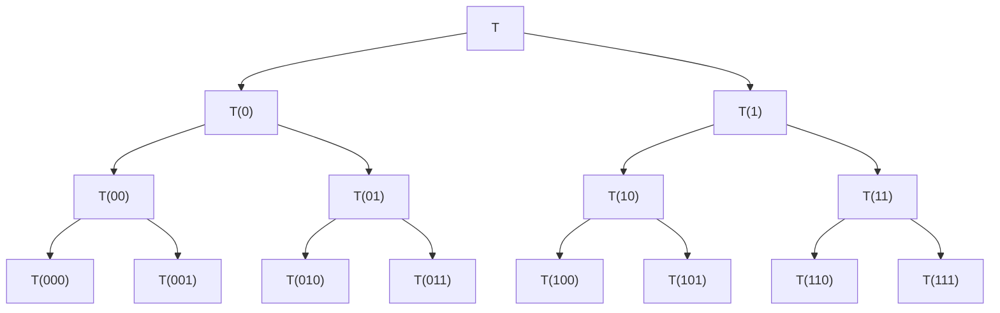

# 8.4 More Methods for Tridiagonal Problems

In this section we develop special methods for the symmetric tridiagonal eigenproblem. The tridiagonal form

$$
T = \left[ \begin{array}{c c c c c} \alpha_ {1} & \beta_ {1} & & \dots & 0 \\ \beta_ {1} & \alpha_ {2} & \ddots & & \vdots \\ & \ddots & \ddots & \ddots & \\ \vdots & & \ddots & \ddots & \beta_ {n - 1} \\ 0 & \dots & & \beta_ {n - 1} & \alpha_ {n} \end{array} \right] \tag {8.4.1}
$$

can be obtained by Householder reduction (cf. §8.3.1). However, symmetric tridiagonal eigenproblems arise naturally in many settings.

We first discuss bisection methods that are of interest when selected portions of the eigensystem are required. This is followed by the presentation of a divide-andconquer algorithm that can be used to acquire the full symmetric Schur decomposition in a way that is amenable to parallel processing.

# 8.4.1 Eigenvalues by Bisection

Let $T _ { r }$ denote the leading r-by-r principal submatrix of the matrix $T$ in (8.4.1). Define the polynomial $p _ { r } ( x )$ by

$$
p _ {r} (x) = \det (T _ {r} - x I)
$$

for $r = 1 { : } n$ . A simple determinantal expansion shows that

$$
p _ {r} (x) = (\alpha_ {r} - x) p _ {r - 1} (x) - \beta_ {r - 1} ^ {2} p _ {r - 2} (x) \tag {8.4.2}
$$

for $r = 2 { : } n$ if we set $p _ { 0 } ( x ) = 1$ . Because $p _ { n } ( x )$ can be evaluated in $O ( n )$ flops, it is feasible to find its roots using the method of bisection. For example, if tol is a small positive constant, $p _ { n } ( y ) { \cdot } p _ { n } ( z ) < 0$ , and $y < z$ , then the iteration

while $| y - z | > \ t { \circ } { \mathsf { I } } { \cdot } ( | y | + | z | )$

$$
x = (y + z) / 2
$$

$\mathbf { i f } ~ p _ { n } ( x ) { \cdot } p _ { n } ( y ) < 0$

$$
z = x
$$

$$
y = x
$$

end

end

is guaranteed to terminate with $( y + z ) / 2$ an approximate zero of $p _ { n } ( x )$ , i.e., an approximate eigenvalue of $T .$ . The iteration converges linearly in that the error is approximately halved at each step.

# 8.4.2 Sturm Sequence Methods

Sometimes it is necessary to compute the kth largest eigenvalue of $T$ for some prescribed value of $k .$ . This can be done efficiently by using the bisection idea and the following classical result:

Theorem 8.4.1 (Sturm Sequence Property). If the tridiagonal matrix in $( 8 . 4 . 1 )$ has no zero subdiagonal entries, then the eigenvalues of $T _ { r - 1 }$ strictly separate the eigenvalues of $T _ { r }$ :

$$
\lambda_ {r} (T _ {r}) <   \lambda_ {r - 1} (T _ {r - 1}) <   \lambda_ {r - 1} (T _ {r}) <   \dots <   \lambda_ {2} (T _ {r}) <   \lambda_ {1} (T _ {r - 1}) <   \lambda_ {1} (T _ {r}).
$$

Moreover, if a(λ) denotes the number of sign changes in the sequence

$$
\{p _ {0} (\lambda), p _ {1} (\lambda), \dots , p _ {n} (\lambda) \},
$$

then $a ( \lambda )$ equals the number of T ’s eigenvalues that are less than λ. Here, the polynomials $p _ { r } ( x )$ are defined by $( 8 . 4 . 2 )$ and we have the convention that $p _ { r } ( \lambda )$ has the opposite sign from $p _ { r - 1 } ( \lambda )$ if $p _ { r } ( \lambda ) = 0$ .

Proof. It follows from Theorem 8.1.7 that the eigenvalues of $T _ { r - 1 }$ weakly separate those of $T _ { r }$ . To prove strict separation, suppose that $p _ { r } ( \mu ) = p _ { r - 1 } ( \mu ) = 0$ for some r and $\mu .$ . It follows from (8.4.2) and the assumption that the matrix $T$ is unreduced that

$$
p _ {0} (\mu) = p _ {1} (\mu) = \dots = p _ {r} (\mu) = 0,
$$

a contradiction. Thus, we must have strict separation. The assertion about $a ( \lambda )$ i s established in Wilkinson (AEP, pp. 300–301).

Suppose we wish to compute $\lambda _ { k } ( T )$ . From the Gershgorin theorem (Theorem 8.1.3) it follows that $\lambda _ { k } ( T ) \in [ y , z ]$ where

$$
y = \min _ {1 \leq i \leq n} a _ {i} - | b _ {i} | - | b _ {i - 1} |, \quad z = \max _ {1 \leq i \leq n} a _ {i} + | b _ {i} | + | b _ {i - 1} |
$$

and we have set $b _ { 0 } = b _ { n } = 0$ . Using $[ y , z ]$ as an initial bracketing interval, it is clear from the Sturm sequence property that the iteration

$$
\begin{array}{l} \text { while } | z - y | > \mathbf {u} (| y | + | z |) \\ x = (y + z) / 2 \\ \text { if } a (x) \geq n - k \tag {8.4.3} \\ z = x \\ \mathbf {e l s e} \\ y = x \\ \mathbf {e n d} \\ \end{array}
$$

produces a sequence of subintervals that are repeatedly halved in length but which always contain $\lambda _ { k } ( T )$ .

During the execution of (8.4.3), information about the location of other eigenvalues is obtained. By systematically keeping track of this information it is possible to devise an efficient scheme for computing contiguous subsets of $\lambda ( T )$ , e.g., $\{ \lambda _ { k } ( T ) , \lambda _ { k + 1 } ( T ) , \ldots , \lambda _ { k + j } ( T ) \}$ . See Barth, Martin, and Wilkinson (1967).

If selected eigenvalues of a general symmetric matrix A are desired, then it is necessary first to compute the tridiagonalization $T = U _ { 0 } ^ { T } A U _ { 0 }$ before the above bisection schemes can be applied. This can be done using Algorithm 8.3.1 or by the Lanczos algorithm discussed in §10.2. In either case, the corresponding eigenvectors can be readily found via inverse iteration since tridiagonal systems can be solved in $O ( n )$ flops. See §4.3.6 and §8.2.2.

In those applications where the original matrix A already has tridiagonal form, bisection computes eigenvalues with small relative error, regardless of their magnitude. This is in contrast to the tridiagonal QR iteration, where the computed eigenvalues $\tilde { \lambda } _ { i }$ can be guaranteed only to have small absolute error: $\begin{array} { r } { | \tilde { \lambda } _ { i } - \lambda _ { i } ( T ) | \approx \mathbf { u } \| \ T \| _ { 2 } } \end{array}$

Finally, it is possible to compute specific eigenvalues of a symmetric matrix by using the $\dot { L } D L ^ { T }$ factorization (§4.3.6) and exploiting the Sylvester inertia theorem (Theorem 8.1.17). If

$$
A - \mu I = L D L ^ {T}, \qquad A = A ^ {T} \in \mathbb {R} ^ {n \times n},
$$

is the $\mathrm { L D L } ^ { T }$ factorization of $A - \mu I$ with $D = \mathrm { d i a g } ( d _ { 1 } , \ldots , d _ { n } )$ , then the number of negative $d _ { i }$ equals the number of $\lambda _ { i } ( A )$ that are less than $\mu .$ . See Parlett (SEP, p. 46) for details.

# 8.4.3 Eigensystems of Diagonal Plus Rank-1 Matrices

Our next method for the symmetric tridiagonal eigenproblem requires that we be able to compute efficiently the eigenvalues and eigenvectors of a matrix of the form $D + \rho z z ^ { T }$ where $D \in \mathbb { R } ^ { n \times n }$ is diagonal, $z \in \mathbb { R } ^ { n }$ , and $\rho \in \mathbb { R }$ . This problem is important in its own right and the key computations rest upon the following pair of results.

Lemma 8.4.2. Suppose $D = \mathrm { d i a g } ( d _ { 1 } , \ldots , d _ { n } ) \in \mathbb { R } ^ { n \times n }$ with

$$
d _ {1} > \dots > d _ {n}.
$$

Assume that $\rho \neq 0$ and that $z \in \mathbb { R } ^ { n }$ has no zero components. If

$$
(D + \rho z z ^ {T}) v = \lambda v, \quad v \neq 0,
$$

then $z ^ { T } v \neq 0$ and $D - \lambda I$ is nonsingular.

Proof. If $\lambda \in \lambda ( D )$ , then $\lambda = d _ { i }$ for some i and thus

$$
0 = e _ {i} ^ {T} [ (D - \lambda I) v + \rho (z ^ {T} v) z ] = \rho (z ^ {T} v) z _ {i}.
$$

Since $\rho$ and $z _ { i }$ are nonzero, it follows that $0 = z ^ { T } \boldsymbol { v }$ and so $D v = \lambda v$ . However, D has distinct eigenvalues and therefore $v \in \mathsf { s p a n } \{ e _ { i } \}$ . This implies $0 = z ^ { T } v = z _ { i }$ , a contradiction. Thus, $D$ and $D + \rho z z ^ { T }$ have no common eigenvalues and $z ^ { T } v \neq 0$ .

Theorem 8.4.3. Suppose $D = \mathrm { d i a g } ( d _ { 1 } , \ldots , d _ { n } ) \in \mathbb { R } ^ { n \times n }$ and that the diagonal entries satisfy $d _ { 1 } > \cdots > d _ { n }$ . Assume that $\rho \neq 0$ and that $z \in \mathbb { R } ^ { n }$ has no zero components. If $V \in \mathbb { R } ^ { n \times n }$ is orthogonal such that

$$
V ^ {T} (D + \rho z z ^ {T}) V = \operatorname{diag} (\lambda_ {1}, \dots , \lambda_ {n})
$$

with $\lambda _ { 1 } \geq \cdots \geq \lambda _ { n }$ and $V = [  v _ { 1 } | \cdot \cdot \cdot | v _ { n } ]$ , then

(a) $T h e \lambda _ { i }$ are the n zeros of $f ( \lambda ) = 1 + \rho z ^ { T } ( D - \lambda I ) ^ { - 1 } z$

(b) If $\rho > 0$ , then $\lambda _ { 1 } > d _ { 1 } > \lambda _ { 2 } > \cdots > \lambda _ { n } > d _ { n }$ .

$$
\text {   If   } \rho <   0, \text {   then   } d _ {1} > \lambda_ {1} > d _ {2} > \dots > d _ {n} > \lambda_ {n}.
$$

(c) The eigenvector $v _ { i }$ is a multiple of $( D - \lambda _ { i } I ) ^ { - 1 } z$ .

Proof. If $( D + \rho z z ^ { T } ) v = \lambda v$ , then

$$
(D - \lambda I) v + \rho (z ^ {T} v) z = 0. \tag {8.4.4}
$$

We know from Lemma 8.4.2 that $D - \lambda I$ is nonsingular. Thus,

$$
v \in \operatorname{span} \{(D - \lambda I) ^ {- 1} z \},
$$

thereby establishing (c). Moreover, if we apply $z ^ { T } ( D - \lambda I ) ^ { - 1 }$ to both sides of equation (8.4.4) we obtain

$$
(z ^ {T} v) \cdot \left(1 + \rho z ^ {T} (D - \lambda I) ^ {- 1} z\right) = 0.
$$

By Lemma $8 . 4 . 2 , z ^ { T } v \neq 0$ and so this shows that if $\lambda \in \lambda ( D + \rho z z ^ { T } )$ , then $f ( \lambda ) = 0$ . We must show that all the zeros of f are eigenvalues of $D + \rho z z ^ { T }$ and that the interlacing relations (b) hold.

To do this we look more carefully at the equations

$$
\begin{array}{l} f (\lambda) = 1 + \rho \left(\frac {z _ {1} ^ {2}}{d _ {1} - \lambda} + \dots + \frac {z _ {n} ^ {2}}{d _ {n} - \lambda}\right), \\ f ^ {\prime} (\lambda) = \rho \left(\frac {z _ {1} ^ {2}}{(d _ {1} - \lambda) ^ {2}} + \dots + \frac {z _ {n} ^ {2}}{(d _ {n} - \lambda) ^ {2}}\right). \\ \end{array}
$$

Note that f is monotone in between its poles. This allows us to conclude that, if $\rho > 0$ , then f has precisely n roots, one in each of the intervals

$$
(d _ {n}, d _ {n - 1}), \ldots , (d _ {2}, d _ {1}), (d _ {1}, \infty).
$$

If $\rho < 0$ , then f has exactly n roots, one in each of the intervals

$$
(- \infty , d _ {n}), (d _ {n}, d _ {n - 1}), \dots , (d _ {2}, d _ {1}).
$$

Thus, in either case the zeros of f are exactly the eigenvalues of $D + \rho v v ^ { T }$ .

The theorem suggests that in order to compute V we must find the roots $\lambda _ { 1 } , \ldots , \lambda _ { n }$ of f using a Newton-like procedure and then compute the columns of V by normalizing the vectors $( D - \lambda _ { i } I ) ^ { - 1 } z { \mathrm { ~ f o r ~ } } i = 1 { : } n$ . The same plan of attack can be followed even if there are repeated $d _ { i }$ and zero $z _ { i }$ .

Theorem 8.4.4. If $D = \operatorname { d i a g } ( d _ { 1 } , \dotsc , d _ { n } )$ and $z \in \mathbb { R } ^ { n }$ , then there exists an orthogonal matrix $V _ { 1 }$ such that if $V _ { 1 } ^ { T } D V _ { 1 } \ = \ \operatorname { d i a g } ( \mu _ { 1 } , . . . , \mu _ { n } )$ and $w = V _ { 1 } ^ { T } z$ then

$$
\mu_ {1} > \mu_ {2} > \dots > \mu_ {r} \geq \mu_ {r + 1} \geq \dots \geq \mu_ {n},
$$

$w _ { i } \neq 0 ~ f o r ~ i = 1 { : } r , ~ a n d ~ w _ { i } = 0 ~ f o r ~ i = r + 1 { : } n .$

Proof. We give a constructive proof based upon two elementary operations. The first deals with repeated diagonal entries while the second handles the situation when the z-vector has a zero component.

Suppose $d _ { i } = d _ { j }$ for some $i < j$ . Let $G ( i , j , \theta )$ be a Givens rotation in the $( i , j )$ plane with the property that the jth component of $G ( i , j , \theta ) ^ { T } z$ is zero. It is not hard to show that $G ( i , j , \theta ) ^ { T } D G ( i , j , \theta ) = D$ . Thus, we can zero a component of $z \ \mathrm { i f }$ there is a repeated $d _ { i }$ .

If $z _ { i } = 0 , z _ { j } \neq 0$ , and $i < j$ , then let $P$ be the identity with columns i and $j$ interchanged. It follows that $P ^ { T } D P$ is diagonal, $( P ^ { T } z ) _ { i } \neq 0$ , and $( P ^ { T } z ) _ { j } = 0$ . Thus, we can permute all the zero $z _ { i }$ to the “bottom.”

It is clear that the repetition of these two maneuvers will render the desired canonical structure. The orthogonal matrix $V _ { 1 }$ is the product of the rotations that are required by the process.

See Barlow (1993) and the references therein for a discussion of the solution procedures that we have outlined above.

# 8.4.4 A Divide-and-Conquer Framework

We now present a divide-and-conquer method for computing the Schur decomposition

$$
Q ^ {T} T Q = \Lambda = \operatorname{diag} \left(\lambda_ {1}, \dots , \lambda_ {n}\right), \quad Q ^ {T} Q = I, \tag {8.4.5}
$$

for tridiagonal T that involves (a) “tearing” T in half, (b) computing the Schur decompositions of the two parts, and (c) combining the two half-sized Schur decompositions into the required full-size Schur decomposition. The overall procedure, developed by Dongarra and Sorensen (1987), is suitable for parallel computation.

We first show how T can be “torn” in half with a rank-1 modification. For simplicity, assume $n = 2 m$ and that $T \in \mathbb { R } ^ { n \times n }$ is given by (8.4.1). Define $v \in \mathbb { R } ^ { n }$ as follows

$$
v = \left[ \begin{array}{c} e _ {m} ^ {(m)} \\ \theta e _ {1} ^ {(m)} \end{array} \right], \quad \theta \in \{- 1, + 1 \}. \tag {8.4.6}
$$

Note that for all $\rho \in \mathbb { R }$ the matrix $\widetilde { T } = T - \rho v v ^ { T }$ is identical to $T$ except in its “middle four” entries:

$$
\widetilde {T} (m: m + 1, m: m + 1) = \left[ \begin{array}{c c} \alpha_ {m} - \rho & \beta_ {m} - \rho \theta \\ \beta_ {m} - \rho \theta & \alpha_ {m + 1} - \rho \theta^ {2} \end{array} \right].
$$

If we set $\rho \theta = \beta _ { m }$ , then

$$
T = \left[ \begin{array}{c c} T _ {1} & 0 \\ 0 & T _ {2} \end{array} \right] + \rho v v ^ {T},
$$

where

$$
T _ {1} = \left[ \begin{array}{c c c c c} \alpha_ {1} & \beta_ {1} & & \dots & 0 \\ \beta_ {1} & \alpha_ {2} & \ddots & & \vdots \\ & \ddots & \ddots & \ddots & \\ \vdots & & \ddots & \ddots & \beta_ {m - 1} \\ 0 & \dots & & \beta_ {m - 1} & \tilde {\alpha} _ {m} \end{array} \right], \quad T _ {2} = \left[ \begin{array}{c c c c c} \tilde {\alpha} _ {m + 1} & \beta_ {m + 1} & & \dots & 0 \\ \beta_ {m + 1} & \alpha_ {m + 2} & \ddots & & \vdots \\ & \ddots & \ddots & \ddots & \\ \vdots & & \ddots & \ddots & \beta_ {n - 1} \\ 0 & \dots & & \beta_ {n - 1} & \alpha_ {n} \end{array} \right],
$$

and $\tilde { a } _ { m } = a _ { m } - \rho$ and $\tilde { a } _ { m + 1 } = a _ { m + 1 } - \rho \theta ^ { 2 }$

Now suppose that we have m-by-m orthogonal matrices $Q _ { 1 }$ and $Q _ { 2 }$ such that $Q _ { 1 } ^ { T } T _ { 1 } Q _ { 1 } = D _ { 1 }$ and $Q _ { 2 } ^ { T } T _ { 2 } Q _ { 2 } = D _ { 2 }$ are each diagonal. If we set

$$
U = \left[ \begin{array}{c c} Q _ {1} & 0 \\ 0 & Q _ {2} \end{array} \right],
$$

then

$$
U ^ {T} T U = U ^ {T} \left(\left[ \begin{array}{c c} T _ {1} & 0 \\ 0 & T _ {2} \end{array} \right] + \rho v v ^ {T}\right) U = D + \rho z z ^ {T}
$$

where

$$
D = \left[ \begin{array}{c c} D _ {1} & 0 \\ 0 & D _ {2} \end{array} \right]
$$

is diagonal and

$$
z = U ^ {T} v = \left[ \begin{array}{c} Q _ {1} ^ {T} e _ {m} \\ \theta Q _ {2} ^ {T} e _ {1} \end{array} \right].
$$

Comparing these equations we see that the effective synthesis of the two half-sized Schur decompositions requires the quick and stable computation of an orthogonal V such that

$$
V ^ {T} (D + \rho z z ^ {T}) V = \Lambda = \operatorname{diag} (\lambda_ {1}, \dots , \lambda_ {n})
$$

which we discussed in §8.4.3.

# 8.4.5 A Parallel Implementation

Having stepped through the tearing and synthesis operations, we can now illustrate how the overall process can be implemented in parallel. For clarity, assume that $n = 8 N$ for some positive integer N and that three levels of tearing are performed. See Figure 8.4.1. The indices are specified in binary and at each node the Schur decomposition of a tridiagonal matrix T (b) is obtained from the eigensystems of the tridiagonals T (b0) and T (b1). For example, the eigensystems for the N-by-N matrices T (110) and T (111) are combined to produce the eigensystem for the 2N-by-2N tridiagonal matrix T (11). What makes this framework amenable to parallel computation is the independence of the tearing/synthesis problems that are associated with each level in the tree.

flowchart

Figure 8.4.1. The divide-and-conquer framework

# 8.4.6 An Inverse Tridiagonal Eigenvalue Problem

For additional perspective on symmetric trididagonal matrices and their rich eigenstructure we consider an inverse eigenvalue problem. Assume that $\lambda _ { 1 } , \ldots , \lambda _ { n }$ and $\tilde { \lambda } _ { 1 } , \ldots , \tilde { \lambda } _ { n - 1 }$ are given real numbers that satisfy

$$
\lambda_ {1} > \tilde {\lambda} _ {1} > \lambda_ {2} > \dots > \lambda_ {n - 1} ^ {\prime} > \tilde {\lambda} _ {n - 1} > \lambda_ {n}. \tag {8.4.7}
$$

The goal is to compute a symmetric tridiagonal matrix $T \in \mathbb { R } ^ { n \times n }$ such that

$$
\lambda (T) = \{\lambda_ {1}, \dots , \lambda_ {n}, \}, \tag {8.4.8}
$$

$$
\lambda (T (2: n, 2: n)) = \{\tilde {\lambda} _ {1}, \dots , \tilde {\lambda} _ {n - 1} \}. \tag {8.4.9}
$$

Inverse eigenvalue problems arise in many applications and generally involve computing a matrix that has specified spectral properties. For an overview, see Chu and Golub (2005). Our example is taken from Golub (1973).

The problem we are considering can be framed as a Householder tridiagonalization problem with a constraint on the orthogonal transformation. Define

$$
\Lambda = \mathrm{diag} (\lambda_ {1}, \ldots , \lambda_ {n})
$$

and let $Q$ be orthogonal so that $Q ^ { T } \Lambda Q = T$ is tridiagonal. There are an infinite number of possible Q-matrices that do this and in each case the matrix $T$ satisfies (8.4.8). The challenge is to choose $Q$ so that (8.4.9) holds as well. Recall that a tridiagonalizing Q is essentially determined by its first column because of the implicit-Q- theorem (Theorem 8.3.2). Thus, the problem is solved if we can figure out a way to compute Q(:, 1) so that (8.4.9) holds.

The starting point in the derivation of the method is to realize that the eigenvalues of $T ( 2 { : } n , 2 { : } n )$ are the stationary values of $x ^ { T } T x$ subject to the constraints $x ^ { T } x = 1$ and $e _ { 1 } ^ { T } x = 0$ . To characterize these stationary values we use the method of Lagrange multipliers and set to zero the gradient of

$$
\phi (x, \lambda , \mu) = x ^ {T} T x - \lambda (x ^ {T} x - 1) + 2 \mu x ^ {T} e _ {1}
$$

which gives $( T - \lambda I ) x = - \mu e _ { 1 }$ . Because λ is an eigenvalue of $T ( 2 { : } n , 2 { : } n )$ it is not an eigenvalue of T and so

$$
x = - \mu (T - \lambda I) ^ {- 1} e _ {1}.
$$

Since $e _ { 1 } ^ { T } x = 0$ , it follows that

$$
0 = e _ {1} ^ {T} (T - \lambda I) ^ {- 1} e _ {1} = e _ {1} ^ {T} \left(Q ^ {T} \Lambda Q - \lambda I\right) ^ {- 1} e _ {1} = \sum_ {i = 1} ^ {n} \frac {d _ {i} ^ {2}}{\lambda_ {i} - \lambda} \tag {8.4.10}
$$

where

$$
Q (:, 1) = \left[ \begin{array}{c} d _ {1} \\ \vdots \\ d _ {n} \end{array} \right]. \tag {8.4.11}
$$

By multiplying both sides of equation (8.4.10) by $( \lambda _ { 1 } - \lambda ) \cdot \cdot \cdot ( \lambda _ { n } - \lambda )$ , we can conclude that $\tilde { \lambda } _ { 1 } , \ldots , \tilde { \lambda } _ { n - 1 }$ are the zeros of the polynomial

$$
p(\lambda) = \sum_{i = 1}^{n}d_{i}^{2}\prod_{\substack{j = 1\\ j\neq i}}^{n}(\lambda_{j} - \lambda).
$$

It follows that

$$
p (\lambda) = \alpha \cdot \prod_ {j = 1} ^ {n - 1} (\tilde {\lambda} _ {j} - \lambda)
$$

for some scalar α. By comparing the coefficient of $\lambda ^ { n - 1 }$ in each of these expressions for $p ( \lambda )$ and noting from (8.4.11) that $d _ { 1 } ^ { 2 } + \dots + d _ { n } ^ { 2 } = 1$ , we see that $\alpha = 1$ . From the equation

$$
\sum_{i = 1}^{n}d_{i}^{2}\prod_{\substack{j = 1\\ j\neq i}}^{n}(\lambda_{j} - \lambda) = \prod_{j = 1}^{n - 1}(\tilde{\lambda}_{j} - \lambda)
$$

we immediately see that

$$
d _ {k} ^ {2} = \prod_ {j = 1} ^ {n - 1} \left(\tilde {\lambda} _ {j} - \lambda_ {k}\right) / \prod_ {\substack {j = 1 \\ j \neq k}} ^ {n - 1} \left(\lambda_ {j} - \lambda_ {k}\right), \quad k = 1: n. \tag{8.4.12}
$$

It is easy to show using (8.4.7) that the quantity on the right is positive and thus (8.4.11) can be used to determine the components of $d = Q ( : , 1 )$ up to with a factor of ±1. Once this vector is available, then we can determine the required tridiagonal matrix T as follows:

Step 1. Let P be a Householder matrix so that P d = ±1 and set $A = P ^ { T } \Lambda P$ .

Step 2. Compute the tridiagonalization $Q _ { 1 } ^ { T } A Q _ { 1 } = T$ via Algorithm 8.3.1 and observe from the implementation that $Q _ { 1 } ( : , 1 ) = e _ { 1 }$ .

Step 3. Set $Q = P Q _ { 1 }$ .

It follows that $Q ( : , 1 ) = P ( Q _ { 1 } e _ { 1 } ) = P e _ { 1 } = \pm d .$ . The sign does not matter.

# Problems

P8.4.1 Suppose λ is an eigenvalue of a symmetric tridiagonal matrix T . Show that if λ has algebraic multiplicity $k ,$ then T has at least $k - 1$ subdiagonal entries that are zero.

P8.4.2 Give an algorithm for determining $\rho$ and θ in (8.4.6) with the property that $\theta \in \{ - 1 , 1 \}$ and min{ $| a _ { m } - \rho | , | a _ { m + 1 } - \rho | \big \}$ is maximized.

P8.4.3 Let $p _ { r } ( \lambda ) = \mathsf { d e t } ( T ( 1 { : } r , 1 { : } r ) - \lambda I _ { r } )$ where T is given by (8.4.1). Derive a recursion for evaluating $p _ { n } ^ { \prime } ( \lambda )$ and use it to develop a Newton iteration that can compute eigenvalues of $T .$

P8.4.4 If $T$ is positive definite, does it follow that the matrices $T _ { 1 }$ and $T _ { 2 }$ in §8.4.4 are positive definite?

P8.4.5 Suppose $\boldsymbol { A } = \boldsymbol { S } + \sigma u \boldsymbol { u } ^ { T }$ where $S \in \mathbb { R } ^ { n \times n }$ is skew-symmetric, $u \in \mathbb { R } ^ { n }$ , and $\sigma \in \mathbb { R }$ . Show how to compute an orthogonal Q such that $Q ^ { T } A Q = T + \sigma e _ { 1 } e _ { 1 } ^ { T }$ where $_ T$ is tridiagonal and skew-symmetric.

P8.4.6 Suppose λ is a known eigenvalue of a unreduced symmetric tridiagonal matrix $T \in \mathbb { R } ^ { n \times n }$ . Show how to compute $x ( 1 { : } n - 1 )$ from the equation $T x = \lambda x$ given that $x _ { n } = 1$ .

P8.4.7 Verify that the quantity on the right-hand side of (8.4.12) is positive.

P8.4.8 Suppose that

$$
A = \left[ \begin{array}{c c} D & v \\ v ^ {T} & d _ {n} \end{array} \right]
$$

where $D = \operatorname { d i a g } ( d _ { 1 } , \dotsc , d _ { n - 1 } )$ has distinct diagonal entries and $v \in \mathbb { R } ^ { n - 1 }$ has no zero entries. (a) Show that if $\lambda \in \lambda ( A )$ , then $D - \lambda I _ { n - 1 }$ is nonsingular. (b) Show that if $\lambda \in \lambda ( A )$ , then λ is a zero of

$$
f (\lambda) = \lambda + \sum_ {k = 1} ^ {n - 1} \frac {v _ {k} ^ {2}}{d _ {k} - \lambda} - d _ {n}.
$$

# Notes and References for §8.4

Bisection/Sturm sequence methods are discussed in:

W. Barth, R.S. Martin, and J.H. Wilkinson (1967). “Calculation of the Eigenvalues of a Symmetric Tridiagonal Matrix by the Method of Bisection,” Numer. Math. 9, 386–393.   
K.K. Gupta (1972). “Solution of Eigenvalue Problems by Sturm Sequence Method,” Int. J. Numer. Meth. Eng. 4, 379–404.   
J.W. Demmel, I.S. Dhillon, and H. Ren (1994) “On the Correctness of Parallel Bisection in Floating Point,” ETNA 3, 116–149.

Early references concerned with the divide-and-conquer framework that we outlined include:

J.R. Bunch, C.P. Nielsen, and D.C. Sorensen (1978). “Rank-One Modification of the Symmetric Eigenproblem,” Numer. Math. 31, 31–48.

J.J.M. Cuppen (1981). “A Divide and Conquer Method for the Symmetric Eigenproblem,” Numer. Math. 36, 177–195.

J.J. Dongarra and D.C. Sorensen (1987). “A Fully Parallel Algorithm for the Symmetric Eigenvalue Problem,” SIAM J. Sci. Stat. Comput. 8, S139–S154.

Great care must be taken to ensure orthogonality in the computed matrix of eigenvectors, something that is a major challenge when the eigenvalues are close and clustered. The development of reliable implementations is a classic tale that involves a mix of sophisticated theory and clever algorithmic insights, see:

M. Gu and S.C. Eisenstat (1995). “A Divide-and-Conquer Algorithm for the Symmetric Tridiagonal Eigenproblem,” SIAM J. Matrix Anal. Applic. 16, 172–191.   
B.N. Parlett (1996). “Invariant Subspaces for Tightly Clustered Eigenvalues of Tridiagonals,” BIT 36, 542–562.   
B.N. Parlett and I.S. Dhillon (2000). “Relatively Robust Representations of Symmetric Tridiagonals,” Lin. Alg. Applic. 309, 121–151.

---

<!-- golub_500_549 -->

I.S. Dhillon and B.N. Parlett (2003). “Orthogonal Eigenvectors and Relative Gaps,” SIAM J. Matrix Anal. Applic. 25, 858–899.   
I.S. Dhillon and B.N. Parlett (2004). “Multiple Representations to Compute Orthogonal Eigenvectors of Symmetric Tridiagonal Matrices,” Lin. Alg. Applic. 387, 1–28.   
O.A. Marques, B.N. Parlett, and C. V¨omel (2005). “Computations of Eigenpair Subsets with the MRRR Algorithm,” Numer. Lin. Alg. Applic. 13, 643–653.   
P. Bientinesi, I.S. Dhillon, and R.A. van de Geijn (2005). “A Parallel Eigensolver for Dense Symmetric Matrices Based on Multiple Relatively Robust Representations,” SIAM J. Sci. Comput. 27, 43–66.

Various extensions and generalizations of the basic idea have also been proposed:

S. Huss–Lederman, A. Tsao, and T. Turnbull (1997). “A Parallelizable Eigensolver for Real Diagonalizable Matrices with Real Eigenvalues,” SIAM J. Sci. Comput. 18, 869–885.   
B. Hendrickson, E. Jessup, and C. Smith (1998). “Toward an Efficient Parallel Eigensolver for Dense Symmetric Matrices,” SIAM J. Sci. Comput. 20, 1132–1154.   
W.N. Gansterer, J. Schneid, and C.W. Ueberhuber (2001). “A Low-Complexity Divide-and-Conquer Method for Computing Eigenvalues and Eigenvectors of Symmetric Band Matrices,” BIT 41, 967– 976.   
W.N. Gansterer, R.C. Ward, and R.P. Muller (2002). “An Extension of the Divide-and-Conquer Method for a Class of Symmetric Block-Tridiagonal Eigenproblems,” ACM Trans. Math. Softw. 28, 45–58.   
W.N. Gansterer, R.C. Ward, R.P. Muller, and W.A. Goddard and III (2003). “Computing Approximate Eigenpairs of Symmetric Block Tridiagonal Matrices,” SIAM J. Sci. Comput. 24, 65–85.   
Y. Bai and R.C. Ward (2007). “A Parallel Symmetric Block-Tridiagonal Divide-and-Conquer Algorithm,” ACM Trans. Math. Softw. 33, Article 35.

For a detailed treatment of various inverse eigenvalue problems, see:

M.T. Chu and G.H. Golub (2005). Inverse Eigenvalue Problems, Oxford University Press, Oxford, U.K.

Selected papers that discuss a range of inverse eigenvalue problems include:

D. Boley and G.H. Golub (1987). “A Survey of Matrix Inverse Eigenvalue Problems,” Inverse Problems 3, 595–622.   
M.T. Chu (1998). “Inverse Eigenvalue Problems,” SIAM Review 40, 1–39.   
C.-K. Li and R. Mathias (2001). “Construction of Matrices with Prescribed Singular Values and Eigenvalues,” BIT 41, 115–126.

The derivation in §8.4.6 involved the constrained optimization of a quadratic form, an important problem in its own right, see:

G.H. Golub and R. Underwood (1970). “Stationary Values of the Ratio of Quadratic Forms Subject to Linear Constraints,” Z. Angew. Math. Phys. 21, 318–326.   
G.H. Golub (1973). “Some Modified Eigenvalue Problems,” SIAM Review 15, 318–334.   
S. Leon (1994). “Maximizing Bilinear Forms Subject to Linear Constraints,” Lin. Alg. Applic. 210, 49–58.
