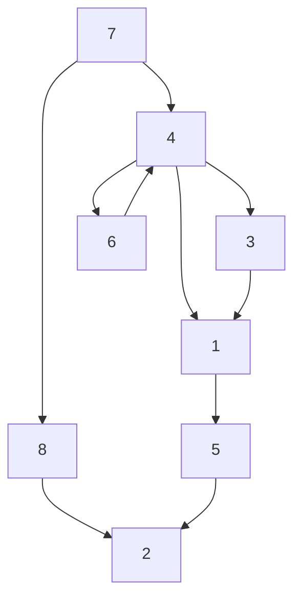
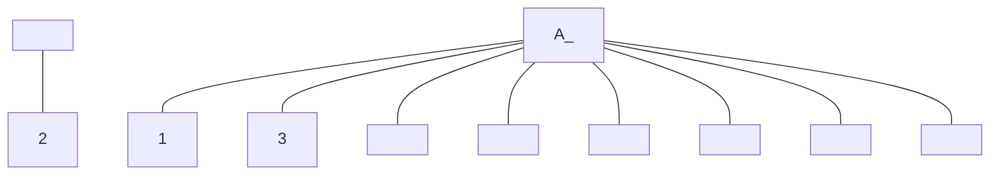
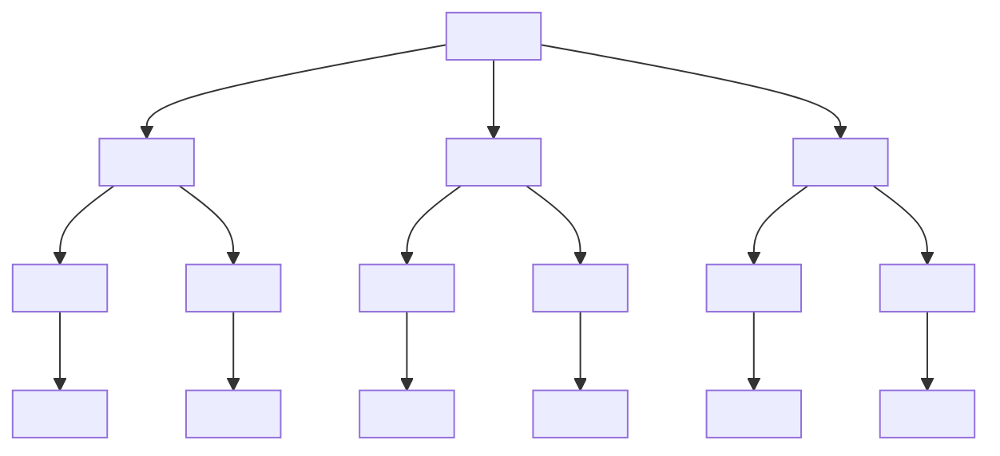
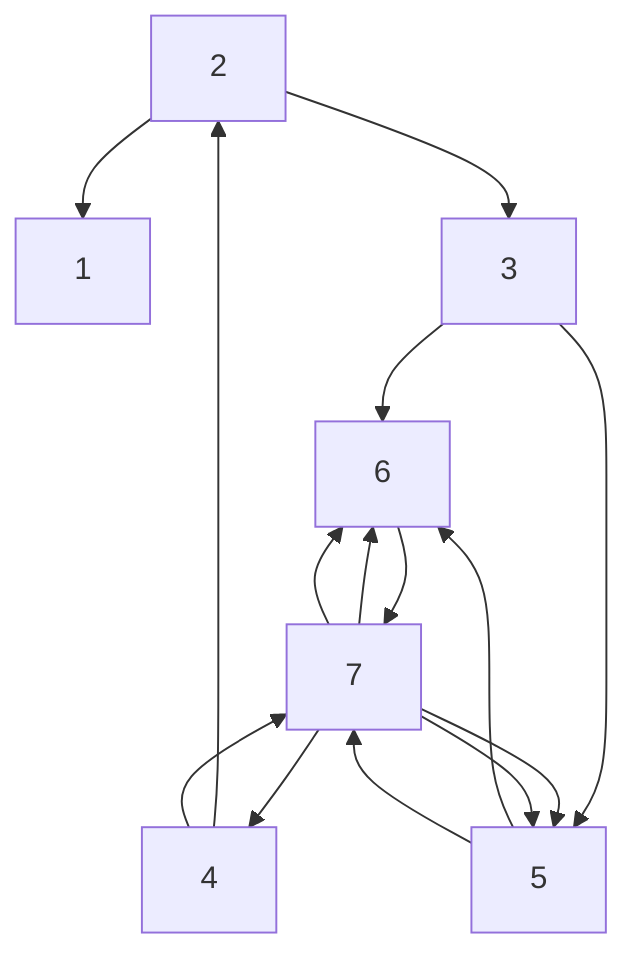
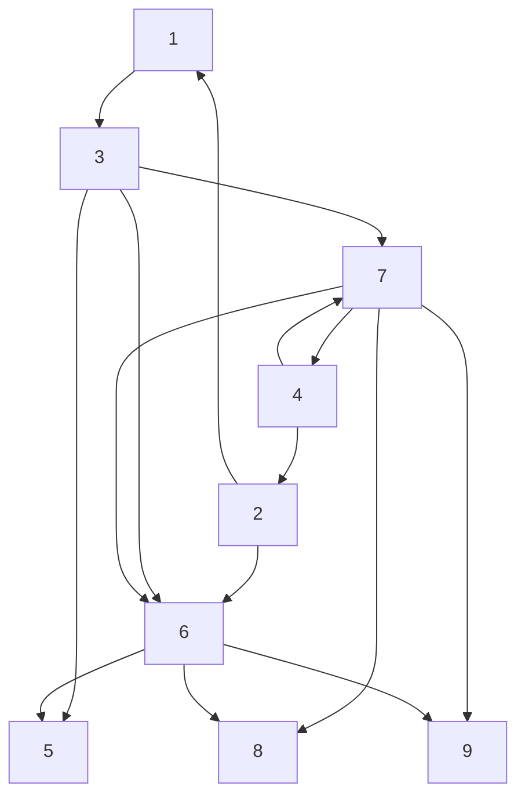

# 11.1.5 The Cuthill-McKee Ordering

Because bandedness is such a tractable form of sparsity, it is natural to approach the Sparse Cholesky challenge by making $\tilde { A } = P A P ^ { \hat { T } }$ as “banded as possible” subject to cost constraints. However, this is too restrictive as Example 2 in §11.1.3 shows. Profile minimization is a better way to induce good sparsity in G. The profile of a symmetric $A \in \mathbb { R } ^ { n \times n }$ is defined by

$$
\operatorname{profile} (A) = n + \sum_ {i = 1} ^ {n} \left(i - f _ {i} (A)\right)
$$

where the profile indices $f _ { 1 } ( A ) , \ldots , f _ { n } ( A )$ are given by

$$
f _ {i} (A) = \min \{j: 1 \leq j \leq i, a _ {i j} \neq 0 \}. \tag {11.1.6}
$$

For the 9-by-9 example in (11.1.5), profile(A) = 37. We use that matrix to illustrate a heuristic method for approximate profile minimization. The first step is to choose a “starting node” and to relabel it as node 1. For reasons that are given later, we choose node 2 and set $S _ { 0 } = \{ 2 \}$ :

flowchart

Original $\mathcal { G } _ { A }$

flowchart

Simple undirected graph diagram with 8 nodes and 1 label, showing connections and a central node.

Labeled: $S _ { 0 }$

We then proceed to label the remaining nodes as follows:

Label the neighbors of $S _ { 0 }$ . Those neighbors make up $S _ { 1 }$ .

Label the unlabeled neighbors of nodes in $S _ { 1 }$ . Those neighbors make up $S _ { 2 }$

Label the unlabeled neighbors of nodes in $S _ { 2 }$ . Those neighbors make up $S _ { 3 }$ . etc.

If we follow this plan for the example, then $S _ { 1 } = \{ 8 , 5 \} , S _ { 2 } = \{ 7 , 3 \} , S _ { 3 } = \{ 1 , 4 \}$ , and $S _ { 4 } = \{ 6 , 9 \}$ . These are the level sets of node 2 and here is how they are determined one after the other:

flowchart

Labeled: S0, S1

flowchart

Labeled: S0, S1, S2

flowchart

$\mathrm { L a b e l e d } \colon S _ { 0 } , S _ { 1 } , S _ { 2 } , S _ { 3 }$

flowchart

$_ { \mathrm { L a b e l e d : } ~ S _ { 0 } , ~ S _ { 1 } , ~ S _ { 2 } , ~ S _ { 3 } , ~ S _ { 4 } }$

By “concatenating” the level sets we obtain the Cuthill-McKee reordering :

text_image

p: 2 | 8 | 5 | 7 | 3 | 1 | 4 | 6 | 9 .
\underbrace{S_0} _{S_1} \underbrace{S_2} _{S_3} \underbrace{S_4} _{S_4}

Observe the band structure that is induced by this ordering:

text_image

A(p,p) = 
⑨
④
2
1
7
6
3
8
5
(11.1.7)

Note that profile $\left( A ( p , p ) \right) = 2 5$ . Moreover, $A ( p , p )$ is a 5-by-5 block tridiagonal matrix with square diagonal blocks that have dimension equal to the cardinality of the level sets $S _ { 0 } , \ldots , S _ { 4 }$ . This suggests why a good choice for $S _ { 0 }$ is a node that has “far away” neighbors. Such a node will have a relatively large number of level sets and that means the resulting block tridiagonal matrix $A ( p , p )$ will have more diagonal blocks. Heuristically, these blocks will be smaller and that implies a tighter profile. See George and Liu (1981, Chap. 4) for a discussion of this topic and why the reverse Cuthill-McKee ordering $p ( n { : } { - } 1 { : } 1 )$ typically results in less fill-in during the Cholesky process.
