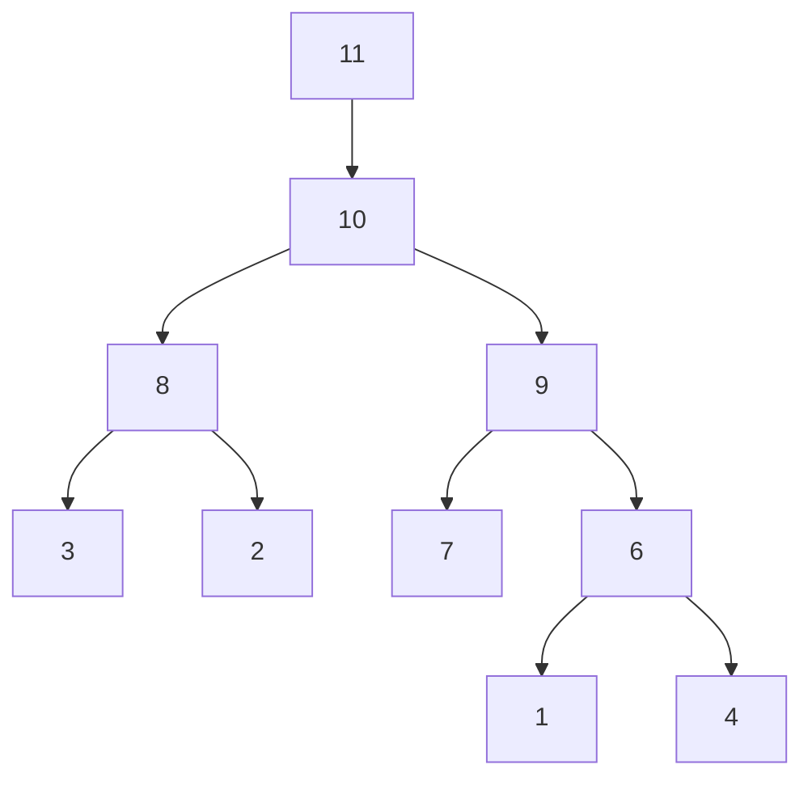

# 11.1.6 The Minimum Degree Ordering

Another effective reordering scheme that is easy to motivate starts with the update recipe (11.1.4) and the observation that the vector v at each step should be as sparse as possible. This version of Cholesky with pivoting for $A = G G ^ { T }$ realizes this ambition:

$$
\text { Step   0.   } P = I _ {n}
$$

$$
\text { for } k = 1: n - 2
$$

Step 1. Choose a permutation $P _ { k } \in \mathbb { R } ^ { ( n - k + 1 ) \times ( n - k + 1 ) }$ so that if

$$
P _ {k}   A (k: n, k: n)   P _ {k} ^ {T}   =   \left[ \begin{array}{c c} \alpha & v ^ {T} \\ v & B \end{array} \right]
$$

then v is as sparse as possible

$$
\text { Step   2. } P = \operatorname{diag} (I _ {k - 1}, P _ {k}) \cdot P \tag {11.1.8}
$$

Step 3. Reorder $A ( k { : } n , k { : } n )$ and each previously computed G-column:

$$
A (k: n, k: n) = P _ {k} A (k: n, k: n) P _ {k} ^ {T}
$$

$$
A (k: n, 1: k - 1) = P _ {k} A (k: n, 1: k - 1)
$$

$$
\text {   Step   4.   Compute   } G (k: n, k): A (k: n, k) = A (k: n, k) / \sqrt {A (k , k)}
$$

$$
\text {   Step   5.   Compute   } A ^ {(k)}
$$

$$
A (k + 1: n, k + 1: n) = A (k + 1: n, k + 1: n) - A (k + 1: n, k) A (k + 1: n, k) ^ {T}
$$

end

The ordering that results from this process is the minimum degree ordering. The terminology makes sense because the pivot row in step k is associated with a node in the adjacency graph $\mathcal { G } _ { A ( k : n , k : n ) }$ whose degree is minimal. Note that this is a greedy heuristic approach to the Sparse Cholesky challenge.

A serious overhead associated with the implementation of (11.1.8) concerns the outer-product update in Step 5. The memory allocation discussion in §11.1.2 suggests that we could make a more efficient procedure if we knew in advance the sparsity structure of the minimum degree Cholesky factor. We could replace Step 0 with

Step $0 ^ { \prime }$ . Determine the minimum degree permutation $p _ { { M D } }$ and represent

$A ( p _ { \ / { M D } } , p _ { \ / { M D } } )$ with “placeholder” zeros in those locations that fill in.

This would make Steps 1–3 unnecessary and obviate memory requests in Step 5. Moreover, it can happen that a collection of problems need to be solved each with the same sparsity structure. In this case, a single Step $0 ^ { \prime }$ works for the entire collection thereby amortizing the overhead. It turns out that very efficient $0 ^ { \prime }$ procedures have been developed. The basic idea revolves around the intelligent exploitation of two facts that completely characterize the sparsity of the Cholesky factor in $A = G G ^ { T }$ :

Fact 1: If $j \le i$ and $a _ { i j }$ is nonzero, then $g _ { i j }$ is nonzero assuming no numerical cancellation.

Fact 2: If $g _ { i k }$ and $g _ { j k }$ are nonzero and $k < j < i$ , then $g _ { i j }$ is nonzero assuming no numerical cancellation. See Parter (1961).

The caveats about no numerical cancellation are required because it is possible for an entry in $G$ to be “luckily zero.” For example, Fact 1 follows from the formula

$$
g _ {i j} = \left(a _ {i j} - \sum_ {k = 1} ^ {j - 1} g _ {i k} g _ {j k}\right) \bigg / g _ {j j},
$$

with the assumption that the summation does not equal $a _ { i j }$

The systematic use of Facts 1 and 2 to determine $G \mathrm { { s } }$ sparsity structure is complicated and involves the construction of an elimination tree (e-tree). Here is an example taken from the detailed presentation by Davis (2006, Chap. 4):

text_image

Grid pattern with black dots arranged in a 5x5 pattern, resembling a puzzle or game board.

The matrix A

text_image

Grid-based puzzle or game board with black and white stones arranged in a 3x3 pattern

A’s Cholesky factor

flowchart

A’s elimination tree

The $^ { 6 6 } \otimes ^ { 9 9 }$ entries are nonzero because of Fact 2. For example, $g _ { 7 6 }$ is nonzero because $g _ { 6 1 }$ and $g _ { 7 1 }$ are nonzero. The e-tree captures critical location information. In general, the parent of node i identifies the row of the first subdiagonal nonzero in column i. By encoding this kind of information, the e-tree can be used to answer various path-ingraph questions that relate to fill-in. In addition, the leaf nodes correspond to those columns that can be eliminated independently in a parallel implementation.
