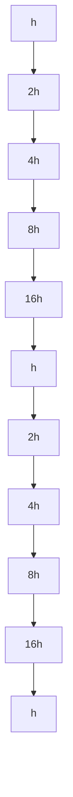

# 11.6 The Multigrid Framework

Let $A ^ { h } u ^ { h } = b ^ { h }$ be a linear system that arises when an elliptic boundary value problem is discretized on a structured grid. The discrete Poisson problems that we discussed in §4.8.3 and §4.8.4 are examples. The superscript $^ { 6 6 } h ^ { \prime \prime }$ is a reminder that the size of the system depends on the fineness of the grid, i.e., the spacing between gridpoints.

The multigrid idea exploits relationships between the “fine grid” solution $u ^ { h }$ and its smaller, “coarse grid” analog $u ^ { 2 h }$ . Given a current approximate solution $u _ { c } ^ { h }$ , the overall framework involves recursive application of the following strategy:

Pre-smooth. With $u _ { 0 } ^ { h } = u _ { c } ^ { h }$ , perform $p _ { 1 }$ steps of a suitable iterative method $u _ { k } ^ { h } =$ $G u _ { k - 1 } ^ { h } + c$ to produce $u _ { p } ^ { h }$ , an error-smoothed version of $u _ { c } ^ { h }$ .

Step 1. Compute the current fine-grid residual $r ^ { h } = b ^ { h } - A ^ { h } u _ { p _ { 1 } } ^ { h }$ . This vector will be rich in certain eigenvector directions and nearly orthogonal to others.

Step 2. Map $r ^ { h } \in \mathbb { R } ^ { n }$ to $r ^ { 2 h } \in \mathbb { R } ^ { m }$ , a vector that defines what the fine-grid residual looks like on the coarse grid corresponding to 2h. This will involve an averaging process.

Step 3. Solve the much smaller coarse-grid correction system $A ^ { 2 h } z ^ { 2 h } = r ^ { 2 h }$ .

Step 4. Map $z ^ { 2 h } \in \mathbb { R } ^ { m }$ to $z ^ { h } \in \mathbb { R } ^ { n }$ , a vector that defines what the correction looks like on the fine grid. This will involve interpolation.

Step 5. Update $u _ { c } ^ { h }$ to $u _ { + } ^ { h } \ = \ u _ { c } ^ { h } + z ^ { h }$ .

Post-smooth. With $u _ { 0 } ^ { h } = u _ { + } ^ { h }$ , perform $p _ { 2 }$ steps of a suitable iterative method $u _ { k } ^ { h } =$ $G u _ { k - 1 } ^ { h } + c$ to produce $u _ { + + } ^ { h } = u _ { r } ^ { h }$ , an error-smoothed version of $u _ { + } ^ { h }$ .

Our plan is to discuss the key issues associated with this paradigm using the 1- dimensional model problem introduced in §4.8.3. The weighted Jacobi method is developed for the pre-smooth and post-smooth steps. Its properties clarify the eigenvector comment in Step 1. After defining the mappings $r ^ { h }  r ^ { 2 h }$ and $z ^ { 2 h }  z ^ { h }$ associated with Steps 2 and 4, we explain why the Step 5 update results in an improved solution.

Recursion enters the picture through Step 3 as we can apply the same solution strategy to the similar, smaller system $\bar { A } ^ { 2 h } z ^ { 2 \bar { h } } = r ^ { 2 h }$ . It is through this recursion that we arrive at the overall multigrid framework: the 4h-grid problem helps solve the 2h-grid problem, the 8h-grid problem helps solve the 4h-grid problem, etc. Depending upon its implementation, the process can be used to either precondition or completely solve the top-level $A ^ { h } u ^ { h } = b ^ { h }$ problem.

The tutorial by Briggs, Henson, and McCormick (2000) provides an excellent introduction to the multigrid framework that was originally proposed in Brandt (1977). For shorter introductions, see Strang (2007, pp. 571–585), Greenbaum (IMSL, pp. 183– 197)), Saad (IMSLA, pp. 407–450), and Demmel (ANLA, pp. 331–347).

# 11.6.1 A Model Problem and the Matrices $A ^ { h }$ and $Q ^ { h }$

Consider the problem of finding a function $u ( x )$ of [0, 1] that satisfies

$$
\frac {d ^ {2} u (x)}{d x ^ {2}} = F (x), \quad u (0) = u (1) = 0. \tag {11.6.1}
$$

Our goal is to approximate the solution to (11.6.1) at $x = h , 2 h , . . . , n h$ using the discretization strategy set forth in §4.8.3. Here and throughout this section,

$$
n = 2 ^ {k} - 1, \qquad m = 2 ^ {k - 1} - 1, \qquad h = 1 / 2 ^ {k}.
$$

This leads to a linear system

$$
A ^ {h} u ^ {h} = b ^ {h} \tag {11.6.2}
$$

where $b ^ { h } \in \mathbb { R } ^ { n }$ and $A ^ { h } \in \mathbb { R } ^ { n \times n }$ is defined by

$$
A ^ {h} = \frac {1}{h ^ {2}} \left[ \begin{array}{c c c c c} 2 & - 1 & \dots & \dots & 0 \\ - 1 & 2 & \ddots & & \vdots \\ \vdots & \ddots & \ddots & \ddots & \vdots \\ \vdots & & \ddots & \ddots & - 1 \\ 0 & 0 & \dots & - 1 & 2 \end{array} \right]. \tag {11.6.3}
$$

Note that $A ^ { h }$ is a multiple of ${ \mathcal { T } } _ { n } ^ { D D }$ , a matrix that we defined in (4.8.7). It has a completely known Schur decomposition

$$
(Q ^ {h}) ^ {T} A ^ {h} Q ^ {h} = \Lambda^ {h} = \mathrm{diag} (\lambda^ {h}), \tag {11.6.4}
$$

where the vector of eigenvalues $\boldsymbol { \lambda } ^ { h } \in \mathbb { R } ^ { n }$ is given by

$$
\lambda_ {j} ^ {h} = \frac {4}{h ^ {2}} \cdot \sin^ {2} \left(\frac {j \pi}{2 (n + 1)}\right), \quad j = 1: n, \tag {11.6.5}
$$

and the orthogonal eigenvector matrix $Q ^ { h } = { \left[ \begin{array} { l } { q _ { 1 } } \end{array} | \cdots | q _ { n } \ \right] }$ is prescribed by

$$
q _ {j} = \sqrt {\frac {2}{n + 1}} \left[ \begin{array}{c} \sin (\theta_ {j}) \\ \vdots \\ \sin (n \theta_ {j}) \end{array} \right], \quad \theta_ {j} = \frac {j \pi}{n + 1}. \tag {11.6.6}
$$

The components of this vector involve samplings of the function sin $( j \pi x )$ . As $j$ increases, this function is increasingly oscillatory, prompting us to split the eigenmodes in half. We regard $q _ { j }$ as a low-frequency eigenvector if $1 \leq j \leq m$ and as a high-frequency eigenvector if $j > m$ .

To facilitate the divide-and-conquer derivations that follow, we identify some critical patterns associated with $Q ^ { h }$ and $\Lambda ^ { h }$ . If

$$
S ^ {h} = \mathrm{diag} (s _ {1} ^ {2}, \ldots , s _ {m} ^ {2}), \qquad s _ {j} = \sin \left(\frac {j \pi}{2 (n + 1)}\right), \tag {11.6.7}
$$

$$
C ^ {h} = \mathrm{diag} (c _ {1} ^ {2}, \dots , c _ {m} ^ {2}), \qquad c _ {j} = \cos \left(\frac {j \pi}{2 (n + 1)}\right), \tag {11.6.8}
$$

then

$$
\Lambda^ {h} = \frac {4}{h ^ {2}} \left[ \begin{array}{c c c} S ^ {h} & 0 & 0 \\ 0 & 1 / 2 & 0 \\ 0 & 0 & \mathcal {E} _ {m} C ^ {h} \mathcal {E} _ {m} \end{array} \right] \tag {11.6.9}
$$

where ${ \mathcal { E } } _ { m }$ is the m-by-m exchange permutation. Regarding $Q ^ { h }$ , it houses scaled copies of its m-by-m analog $Q ^ { 2 h }$ :

$$
Q ^ {h} (2: 2: 2 m,:) = \left[ Q ^ {2 h} \mid 0 \mid - Q ^ {2 h} \mathcal {E} _ {m} \right] / \sqrt {2}. \tag {11.6.10}
$$

These results follow from the definitions (11.6.5)–(11.6.8) and trigonometric identities.

# 11.6.2 Damping Error with the Weighted Jacobi Method

Critical to the multigrid framework is the role of the smoothing iteration. The term “smoother” is applied to an iterative method that is particularly successful at damping out the high-frequency eigenvector components of the error. To illustrate this part of the process, we introduce the weighted Jacobi method. If $L = \operatorname { t r i l } ( A , - 1 ) , D = \operatorname { d i a g } ( a _ { i i } )$ , and $U = \mathsf { t r i u } ( A , 1 )$ , then the iterates for this method are defined by

$$
u ^ {(k)} = G u ^ {(k - 1)} + c,
$$

where $c = \omega D ^ { - 1 } b , \ G \ = \ ( 1 - \omega ) I - \omega D ^ { - 1 } ( L + U )$ , and $\omega$ is a free parameter that we assume satisfies $0 < \omega \leq 1$ . Note that if $\omega = 1$ , then the method reverts to the simple Jacobi iteration (11.2.2). Other iterations can be used, but the weighted Jacobi method is simple and adequately communicates the role of the smoother in multigrid.

If we apply the weighted Jacobi method to (11.6.2), then it is easy to verify that the iteration matrix is given by

$$
G ^ {h, \omega} = I _ {n} - \frac {\omega h ^ {2}}{2} A ^ {h}. \tag {11.6.11}
$$

By using (11.6.4) and (11.6.5) we see that its Schur decomposition is given by

$$
(Q ^ {h}) ^ {T} G ^ {h, \omega} Q ^ {h} = \operatorname{diag} (\tau^ {h, \omega}), \quad \tau_ {j} ^ {h, \omega} = 1 - 2 \omega \sin^ {2} \left(\frac {j \pi}{2 (n + 1)}\right). \tag {11.6.12}
$$

It follows that $\rho ( G ^ { h , \omega } ) < 1$ because we assume $0 < \omega \leq 1$ to guarantee convergence. The explicit Schur decomposition enables us to track the error in each eigenvector direction given a starting vector $u _ { 0 } ^ { h }$ :

$$
u _ {0} ^ {h} - u ^ {h} = \sum_ {j = 1} ^ {n} \alpha_ {j} \cdot q _ {j} \Rightarrow (u _ {p} ^ {h} - u ^ {h}) = (G ^ {h, \omega}) ^ {p} (u _ {0} ^ {h} - u ^ {h}) = \sum_ {j = 1} ^ {n} \alpha_ {j} \cdot (\tau_ {j} ^ {h, \omega}) ^ {p} \cdot q _ {j}.
$$

Thus, the component of the error in the direction of the eigenvector $q _ { j }$ tends to zero like $| \tau _ { j } ^ { h , \omega } | ^ { p }$ . These rates depend on $\omega$ and vary with $j$ . We now ask, is there a smart way to choose the value of $\omega$ so that the error is rapidly diminished in each eigenvector direction?

Assume that $n \gg 1$ and consider (11.6.12). For small $j$ we see that $\tau _ { j } ^ { h , \omega }$ is close to unity regardless of the value of $\omega .$ . On the other hand, we can move the “large $j ^ { \flat }$ eigenvalues toward the origin by choosing a smaller value of $\omega .$ These qualitative observations suggest that we choose $\omega$ to minimize

$$
\mu (\omega) = \max \{| \tau_ {m + 1} ^ {h, \omega} |, \ldots , | \tau_ {n} ^ {h, \omega} | \}.
$$

In other words, $\omega$ should be chosen to promote rapid damping in the direction of the high-frequency eigenvectors. Because the damping rates associated with the lowfrequency eigenvectors are much less affected by the choice of $\omega .$ , they are left out of the optimization. Since

$$
- 1 <   \tau_ {n} ^ {h, \omega} <   \dots <   \tau_ {m + 1} ^ {h, \omega} <   \dots <   \tau_ {1} ^ {h, \omega} <   1,
$$

it is easy to see that the optimum but opposite in sign, i.e., $\omega$ should make $\tau _ { m + 1 } ^ { h , \omega }$ and $\tau _ { n } ^ { h , \omega }$ equal in magnitude

$$
- 1 + 2 \omega \sin^ {2} \left(\frac {n \pi}{2 (n + 1)}\right) = - \left(- 1 + 2 \omega \sin^ {2} \left(\frac {(m + 1) \pi}{2 (n + 1)}\right)\right).
$$

This is essentially solved by setting $\omega _ { o p t } = 2 / 3$ . With this choice, $\mu ( 2 / 3 ) = 1 / 3$ and so

$$
\binom{p \text {-th iterate error in}}{\text {high - frequency directions}} \leq \left(\frac {1}{3}\right) ^ {p} \binom{\text {Starting vector error in}}{\text {high - frequency directions}}.
$$

# 11.6.3 Interactions Between the Fine and Coarse Grids

Suppose for some modest value of p we use the weighted Jacobi iteration to obtain an approximate solution $u _ { p } ^ { h }$ to $A ^ { h } u ^ { h } = b ^ { h }$ . We can estimate its error by approximately solving $A ^ { h } z = r ^ { h } = b ^ { h } - A ^ { h } u _ { v } ^ { h }$ . From the discussion in the previous section we know that the residual $r ^ { h } = A ^ { h } ( u ^ { h } - u _ { p } ^ { h } )$ resides mostly in the span of the low-frequency eigenvectors. Because $r ^ { h }$ is smooth, there is not much happening from one gridpoint to the next and it is well-approximated on the coarse grid. This suggests that we might get a good approximation to the error in $u _ { p } ^ { h }$ by solving the coarse-grid version of $A ^ { h } z = r ^ { h }$ . To that end, we need to detail how vectors are transformed when we switch grids. Note that on the fine grid, gridpoint $2 j$ is coarse gridpoint $j \colon$ :

$$
\begin{array}c c c c c c c c c c c c c c c c c c c c c c c c c c c c c c c c c c c c c c c c c c c c c c c c c c c c c c c c c c c c c c c c c c c c c c c c c c c c c c c c c c c c c c c c c c c c c c c c c c c c c c c c c c c c c c c c c c c c c c c c c c c c c c c c c c c c c c c c c c c c c c c c c c c c c c c c c c c c c c c c c c c c c c c c c c c c c c c c c c c c c c c c c c c c c c c c c c c c c c c c c c c c c c c c c c c c c c c c c c c c c c c c c c c c c c c c c c c c c c c c c c c c c c c c c c c c c c c c c c c c c c c c c c c c c c c c c c c c c c c c c c c c c c c c c c c c c c c c c c c c c c c c c c c c c c c c c c c c c c c c c c c c c c c c c c c c c c c c c c c c c c c c c c c c c c c c c c c c c c c c c c c c c c c c c c c c c c c c c c c c c c c c c c c c c c c c c c c c c c c c c c c c c c c c c c c c c c c c c c c c c c c c c c c c c c c c c c c c c c c c c c c c c c c c c c c c c c c c c c c c c c c c c c c c c c c c c c c c c c c c c c c c c c c c c c c c c c c c c c c c c c c c c c c c c c c c c c c c c c c c c c c c c c c c c c c c c c c c c c c c c c c c c c c c c c c c c c c c c c c c c c c c c c c c c c c c c c c c c c c c c c c c c c c c c c c c c c c c c c c c c c c c c c c c c c c c c c c c c c c c c c c c c c c c c c c c c c c c c c c c c c c c c c c c c c c c c c c c c c c c c c c c c c c c c c c c c c c c c c c c c c c c c c c c c c c c c c c c c c c c c c c c c c c c c c c c c c c c c c c c c c c c c c c c c c c c c c c c c c c c c c c c c c c c c c c c c c c c c c c c c c c c c c c c c c c c c c c c c c c c c c c c c c c c c c c c c c c c c c c c c c c c c c c c c c c c c c c c c c c c c c c c c c c c c c c c c c c c c c c c c c c c c c c c c c c c c c c c c c c c c c c c c c c c c c c c c c c c c c c c c c c c c c c c c c c c c c c c c c c c c c c c c c c c c c c c c c c c c c c c c c c c c c c c c c c c c c c c c c c c c c c c c c c c c c c c c c c c c c c c c c c c c c c c c c c c c c c c c c c c c c c c c c c c c c c c c c c c c c c c c c c c c c c c c c c c c c c c c c c c c c c c c c c c c c c c c c c c c c c c c c c c c c c c c c c c c c c c c c c c c c c c c c c c c c c c c c c c c c c c c c c c c c c c c c c c c c c c c c c c c c c c c c c c c c c c c c c c c c c c c c c c c c c c c c c c c c c c c c c c c c c c c c c c c c c c c c c c c c c c c c c c c c c c c c c c c c c c c c c c c c c c c c c c c c c c c c c c c c c c c c c c c c c c c c c c c c c c c c c c c c c c c c c c c c c c c c c c c c c c c c c c c c c c c c c c c c c c c c c c c c c c c c c c c c c c c c c c c c c c c c c c c c c c c c c c c c c c c c c c c c c c c c c c c c c c c c c c c c c c c c c c c c c c c c c c c c c c c c c c c c c c c c c c c c c c c c c c c c c c c c c c c c c c c c c c c c c c c c c c c c c c c c c c c c c c c c c c c c c c c c c c c c c c c c c c c c c c c c c c c c c c c c c c c c c c c c c c c c c c c c c c c c c c c c c c c c c c c c c c c c c c c c c c c c c c c c c c c c c c c c c c c c c c c c c c c c c c c c c c c c c c c c c c c c c c c c c c c c c c c c c c c c c c c c c c c c c c c c c c c c c c c c c c c c c c c c c c c c c c c c c c c c c c c c c c c c c c c c c c c c c c c c c c c c c c c c c c c c c c c c c c c c c c c c c c c c c c c c c c c c c c c c c c c c c c c c c c c c c c c c c c c c c c c c c c c c c c c c c c c c c c c c c c c c c c c c c c c c c c c c c c c c c c c c c c c c c c c c c c c c c c c c c c c c c c c c c c c c c c c c c c c c c c c c c c c c c c c c c c c c c c c c c c c c c c c c c c c c c c c c c c c c c c c c c c c c c c c c c c c c c c c c c c c c c c c c c c c c c c c c c c c c c c c c c c c c c c c c c c c c c c c c c c c c c c c c c c c c c c c c c c c c c c c c c c c c c c c c c c c c c c c c c c c c c c c c c c c c c c c c c c c c c c c c c c c c c c c c c c c c c c c c c c c c c c c c c c c c c c c c c c c c c c c c c c c c c c c c c c c c c c c c c c c c c c c c c c c c c c c c c c c c c c c c c c c c c c c c c c c c c c c c c c c c c c c c c c c c c c c c c c c c c c c c c c c c c c c c c c c c c c c c c c c c c c c c c c c c c c c c c c c c c c c c c c c c c c c c c c c c c c c c c c c c c c c c c c c c c c c c c c c c c c c c c c c c c c c c c c c c c c c c c c c c c c c c c c c c c c c c c c c c c c c c c c c c c c c c c c c c c c c c c c c c c c c c c c c c c c c c c c c c c c c c c c c c c c c c c c c c c c c c c c c c c c c c c c c c c c c c c c c c c c c c c c c c c c c c c c c c c c c c c c c c c c c c c c c c c c c c c c c c c c c c c c c c c c c c c c c c c c c c c c c c c c c c c c c c c c c c c c c c c c c c c c c c c c c c c c c c c c c c c c c c c c c c c c c c c c c c c c c c c c c c c c c c c c c c c c c c c c c c c c c c c c c c c c c c c c c c c c c c c c c c c c c c c c c c c c c c c c c c c c c c c c c c c c c c c c c c c c c c c c c c c c c c c c c c c c c c c c c c c c c c c c c c c c c c c c c c c c c c c c c c c c c c c c c c c c c c c c c c c c c c c c c c c c c c c c c c c c c c c c c c c c c c c c c c c c c c c c c c c c c c c c c c c c c c c c c c c c c c c c c c c c c c c c c c c c c c c c c c c c c c c c c c c c c c c c c c c c c c c c c c c c c c c c c c c c c c c c c c c c c c c c c c c c c c c c c c c c c c c c c c c c c c c c c c c c c c c c c c c c c c c c c c c c c c c c c c c c c c c c c c c c c c c c c c c c c c c c c c c c c c c c c c c c c c c c c c c c c c c c c c c c c c c c c c c c c c c c c c c c c c c c c c c c c c c c c c c c c c c c c c c c c c c c c c c c c c c c c c c c c c c c c c c c c c c c c c c c c c c c c c c c c c c c c c c c c c c c c c c c c c c c c c c c c c c c c c c c c c c c c c c c c c c c c c c c c c c c c c c c c c c c c c c c c c c c c c c c c c c c c c c c c c c c c c c c c c c c c c c c c c c c c c c c c c c c c c c c c c c c c c c c c c c c c c c c c c c c c c c c c c c c c c c c c c c c c c c c c c c c c c c c c c c c c c c c c c c c c c c c c c c c c c c c c c c c c c c c c c c c c c c c c c c c c c c c c c c c c c c c c c c c c c c c c c c c c c c c c c c c c c c c c c c c c c c c c c c c c c c c c c c c c c c c c c c c c c c c c c c c c c c c c c c c c c c c c c c c c c c c c c c c c c c c c c c c c c c c c c c c c c c c c c c c c c c c c c c c c c c c c c c c c c c c c c c c c c c c c c c c c c c c c c c c c c c c c c c c c c c c c c c c c c c c c c c c c c c c c c c c c c c c c c c c c c c c c c c c c c c c c c c c c c c c c c c c c c c c c c c c c c c c c c c c c c c c c c c c c c c c c c c c c c c c c c c c c c c c c c c c c c c c c c c c c c c c c c c c c c c c c c c c c c c c c c c c c c c c c c c c c c c c c c c c c c c c c c c c c c c c c c c c c c c c c c c c c c c c c c c c c c c c c c c c c c c c c c c c c c c c c c c c c c c c c c c c c c c c c c c c c c c c c c c c c c c c c c c c c c c c c c c c c c c c c c c c c c c c c c c c c c c c c c c c c c c c c c c c c c c c c c c c c c c c c c c c c c c c c c c c c c c c c c c c c c c c c c c c c c c c c c c c c c c c c c c c c c c c c c c c c c c c c c c c c c c c c c c c c c c c c c c c c c c c c c c c c c c c c c c c c c c c c c c c c c c c c c c c c c c c c c c c c c c c c c c c c c c c c c c c c c c c c c c c c c c c c c c c c c c c c c c c c c c c c c c c c c c c c c c c c c c c c c c c c c c c c c c c c c c c c c c c c c c c c c c c c c c c c c c c c c c c c c c c c c c c c c c c c c c c c c c c c c c c c c c c c c c c c c c c c c c c c c c c c c c c c c c c c c c c c c c c c c c c c c c c c c c c c c c c c c c c c c c c c c c c c c c c c c c c c c c c c c c c c c c c c c c c c c c c c c c c c c c c c c c c c c c c c c c c c c c c c c c c c c c c c c c c c c c c c c c c c c c c c c c c c c c c c c c c c c c c c c c c c c c c c c c c c c c c c c c c c c c c c c c c c c c c c c c c c c c c c c c c c c c c c c c c c c c c c c c c c c c c c c c c c c c c c c c c c c c c c c c c c c c c c c c c c c c c c c c c c c c c c c c c c c c c c c c c c c c c c c c c c c c c c c c c c c c c c c c c c c c c c c c c c c c c c c c c c c c c c c c c c c c c c c c c c c c c c c c c c c c c c c c c c c c c c c c c c c c c c c c c c c c c c c c c c c c c c c c c c c c c c c c c c c c c c c c c c c c c c c c c c c c c c c c c c c c c c c c c c c c c c c c c c c c c c c c c c c c c c c c c c c c c c c c c c c c c c c c c c c c c c c c c c c c c c c c c c c c c c c c c c c c c c c c c c c c c c c c c c c c c c c c c c c c c c c c c c c c c c c c c c c c c c c c c c c c c c c c c c c c c c c c c c c c c c c c c c c c c c c c c c c c c c c c c c c c c c c c c c c c c c c c c c c c c c c c c c c c c c c c c c c c c c c c c c c c c c c c c c c c c c c c c c c c c c c c c c c c c c c c c c c c c c c c c c c c c c c c c c c c c c c c c c c c c c c c c c c c c c c c c c c c c c c c c c c c c c c c c c c c c c c c c c c c c c c c c c c c c c c c c c c c c c c c c c c c c c c c c c c c c c c c c c c c c c c c c c c c c c c c c c c c c c c c c c c c c c c c c c c c c c c c c c c c c c c c c c c c c c c c c c c c c c c c c c c c c c c c c c c c c c c c c c c c c c c c c c c c c c c c c c c c c c c c c c c c c c c c c c c c c c c c c c c c c c c c c c c c c c c c c c c c c c c c c c c c c c c c c c c c c c c c c c c c c c c c c c c c c c c c c c c c c c c c c c c c c c c c c c c c c c c c c c c c c c c c c c c c c c c c c c c c c c c c c c c c c c c c c c c c c c c c c c c c c c c c c c c c c c c c c c c c c c c c c c c c c c c c c c c c c c c c c c c c c c c c c c c c c c c c c c c c c c c c c c c c c c c c c c c c c c c c c c c c c c c c c c c c c c c c c c c c c c c c c c c c c c c c c c c c c c c c c c c c c c c c c c c c c c c c c c c c c c c c c c c c c c c c c c c c c c c c c c c c c c c c c c c c c c c c c c c c c c c c c c c c c c c c c c c c c c c c c c c c c c c c c c c c c c c c c c c c c c c c c c c c c c c c c c c c c c c c c c c c c c c c c c c c c c c c c c c c c c c c c c c c c c c c c c c c c c c c c c c c c c c c c c c c c c c c c c c c c c c c c c c c c c c c c c c c c c c c c c c c c c c c c c c c c c c c c c c c c c c c c c c c c c c c c c c c c c c c c c c c c c c c c c c c c c c c c c c c c c c c c c c c c c c c c c c c c c c c c c c c c c c c c c c c c c c c c c c c c c c c c c c c c c c c c c c c c c c c c c c c c c c c c c c c c c c c c c c c c c c c c c c c c c c c c c c c c c c c c c c c c c c c c c c c c c c c c c c c c c c c c c c c c c c c c c c c c c c c c c c c c c c c c c c c c c c c c c c c c c c c c c c c c c c c c c c c c c c c c c c c c c c c c c c c c c c c c c c c c c c c c c c c c c c c c c c c c c c c c c c c c c c c c c c c c c c c c c c c c c c c c c c c c c c c c c c c c c c c c c c c c c c c c c c c c c c c c c c c c c c c c c c c c c c c c c c c c c c c c c c c c c c c c c c c c c c c c c c c c c c c c c c c c c c c c c c c c c c c c c c c c c c c c c c c c c c c c c c c c c c c c c c c c c c c c c c c c c c c c c c c c c c c c c c c c c c c c c c c c c c c c c c c c c c c c c c c c c c c c c c c c c c c c c c c c c c c c c c c c c c c c c c c c c c c c c c c c c c c c c c c c c c c c c c c c c c c c c c c c c c c c c c c c c c c c c c c c c c c c c c c c c c c c c c c c c c c c c c c c c c c c c c c c c c c c c c c c c c c c c c c c c c c c c c c c c c c c c c c c c c c c c c c c c c c c c c c c c c c c c c c c c c c c c c c c c c c c c c c c c c c c c c c c c c c c c c c c c c c c c c c c c c c c c c c c c c c c c c c c c c c c c c c c c c c c c c c c c c c c c c c c c c c c c c c c c c c c c c c c c c c c c c c c c c c c c c c c c c c c c c c c c c c c c c c c c c c c c c c c c c c c c c c c c c c c c c c c c c c c c c c c c c c c c c c c c c c c c c c c c c c c c c c c c c c c c c c c c c c c c c c c c c c c c c c c c c c c c c c c c c c c c c c c c c c c c c c c c c c c c c c c c c c c c c c c c c c c c c c c c c c c c c c c c c c c c c c c c c c c c c c c c c c c c c c c c c c c c c c c c c c c c c c c c c c c c c c c c c c c c c c c c c c c c c c c c c c c c c c c c c c c c c c c c c c c c c c c c c c c c c c c c c c c c c c c c c c c c c c c c c c c c c c c c c c c c c c c c c c c c c c c c c c c c c c c c c c c c c c c c c c c c c c c c c c c c c c c c c c c c c c c c c c c c c c c c c c c c c c c c c c c c c c c c c c c c c c c c c c c c c c c c c c c c c c c c c c c c c c c c c c c c c c c c c c c c c c c c c c c c c c c c c c c c c c c c c c c c c c c c c c c c c c c c c c c c c c c c c c c c c c c c c c c c c c c c c c c c c c c c c c c c c c c c c c c c c c c c c c c c c c c c c c c c c c c c c c c c c c c c c c c c c c c c c c c c c c c c c c c c c c c c c c c c c c c c c c c c c c c c c c c c c c c c c c c c c c c c c c c c c c c c c c c c c c c c c c c c c c c c c c c c c c c c c c c c c c c c c c c c c c c c c c c c c c c c c c c c c c c c c c c c c c c c c c c c c c c c c c c c c c c c c c c c c c c c c c c c c c c c c c c c c c c c c c c c c c c c c c c c c c c c c c c c c c c c c c c c c c c c c c c c c c c c c c c c c c c c c c c c c c c c c c c c c c c c c c c c c c c c c c c c c c c c c c c c c c c c c c c c c c c c c c c c c c c c c c c c c c c c c c c c c c c c c c c c c c c c c c c c c c c c c c c c c c c c c c c c c c c c c c c c c c c c c c c c c c c c c c c c c c c c c c c c c c c c c c c c c c c c c c c c c c c c c c c c c c c c c c c c c c c c c c c c c c c c c c c c c c c c c c c c c c c c c c c c c c c c c c c c c c c c c c c c c c c c c c c c c c c c c c c c c c c c c c c c c c c c c c c c c c c c c c c c c c c c c c c c c c c c c c c c c c c c c c c c c c c c c c c c c c c c c c c c c c c c c c c c c c c c c c c c c c c c c c c c c c c c c c c c c c c c c c c c c c c c c c c c c c c c c c c c c c c c c c c c c c c c c c c c c c c c c c c c c c c c c c c c c c c c c c c c c c c c c c c c c c c c c c c c c c c c c c c c c c c c c c c c c c c c c c c c c c c c c c c c c c c c c c c c c c c c c c c c c c c c c c c c c c c c c c c c c c c c c c c c c c c c c c c c c c c c c c c c c c c c c c c c c c c c c c c c c c c c c c c c c c c c c c c c c c c c c c c c c c c c c c c c c c c c c c c c c c c c c c c c c c c c c c c c c c c c c c c c c c c c c c c c c c c c c c c c c c c c c c c c c c c c c c c c c c c c c c c c c c c c c c c c c c c c c c c c c c c c c c c c c c c c c c c c c c c c c c c c c c c c c c c c c c c c c c c c c c c c c c c c c c c c c c c c c c c c c c c c c c c c c c c c c c c c c c c c c c c c c c c c c c c c c c c c c c c c c c c c c c c c c c c c c c c c c c c c c c c c c c c c c c c c c c c c c c c c c c c c c c c c c c c c c c c c c c c c c c c c c c c c c c c c c c c c c c c c c c c c c c c c c c c c c c c c c c c c c c c c c c c c c c c c c c c c c c c c c c c c c c c c c c c c c c c c c c c c c c c c c c c c c c c c c c c c c c c c c c c c c c c c c c c c c c c c c c c c c c c c c c c c c c c c c c c c c c c c c c c c c c c c c c c c c c c c c c c c c c c c c c c c c c c c c c c c c c c c c c c c c c c c c c c c c c c c c c c c c c c c c c c c c c c c c c c c c c c c c c c c c c c c c c c c c c c c c c c c c c c c c c c c c c c c c c c c c c c c c c c c c c c c c c c c c c c c c c c c c c c c c c c c c c c c c c c c c c c c c c c c c c c c c c c c c c c c c c c c c c c c c c c c c c c c c c c c c c c c c c c c c c c c c c c c c c c c c c c c c c c c c c c c c c c c c c c c c c c c c c c c c c c c c c c c c c c c c c c c c c c c c c c c c c c c c c c c c c c c c c c c c c c c c c c c c c c c c c c c c c c c c c c c c c c c c c c c c c c c c c c c c c c c c c c c c c c c c c c c c c c c c c c c c c c c c c c c c c c c c c c c c c c c c c c c c c c c c c c c c c c c c c c c c c c c c c c c c c c c c c c c c c c c c c c c c c c c c c c c c c c c c c c c c c c c c c c c c c c c c c c c c c c c c c c c c c c c c c c c c c c c c c c c c c c c c c c c c c c c c c c c c c c c c c c c c c c c c c c c c c c c c c c c c c c c c c c c c c c c c c c c c c c c c c c c c c c c c c c c c c c c c c c c c c c c c c c c c c c c c c c c c c c c c c c c c c c c c c c c c c c c c c c c c c c c c c c c c c c c c c c c c c c c c c c c c c c c c c c c c c c c c c c c c c c c c c c c c c c c c c c c c c c c c c c c c c c c c c c c c c c c c c c c c c c c c c c c c c c c c c c c c c c c c c c c c c c c c c c c c c c c c c c c c c c c c c c c c c c c c c c c c c c c c c c c c c c c c c c c c c c c c c c c c c c c c c c c c c c c c c c c c c c c c c c c c c c c c c c c c c c c c c c c c c c c c c c c c c c c c
$$

To map values from the fine grid (with $n = 2 ^ { k } - 1$ gridpoints) to the coarse-grid (with $m = 2 ^ { k - 1 } - 1$ gridpoints), we use an $m { \mathrm { - } } \mathrm { b y } - n$ restriction matrix $R _ { h } ^ { 2 h }$ . Similarly, to generate fine-grid values from coarse-grid values, we use an n-by-m prolongation matrix $P _ { 2 h } ^ { h }$ . Before these matrices are formally defined, we display the case when $n = 7$ and $m = 3 \colon$ :

$$
R _ {h} ^ {2 h} = \frac {1}{4} \left[ \begin{array}{l l l l l l l} 1 & 2 & 1 & 0 & 0 & 0 & 0 \\ 0 & 0 & 1 & 2 & 1 & 0 & 0 \\ 0 & 0 & 0 & 0 & 1 & 2 & 1 \end{array} \right], \quad P _ {2 h} ^ {h} = \frac {1}{2} \left[ \begin{array}{l l l} 1 & 0 & 0 \\ 2 & 0 & 0 \\ 1 & 1 & 0 \\ 0 & 2 & 0 \\ 0 & 1 & 1 \\ 0 & 0 & 2 \\ 0 & 0 & 1 \end{array} \right]. \tag {11.6.13}
$$

The intuition behind these choices is easy to see. The operation $u ^ { 2 h } = R _ { h } ^ { 2 h } u ^ { h }$ takes a fine-grid vector of values and produces a coarse-grid vector of values using a weighted average around each even-indexed component:

$$
\left[ \begin{array}{l} u _ {1} ^ {2 h} \\ u _ {2} ^ {2 h} \\ u _ {3} ^ {2 h} \end{array} \right] = R _ {h} ^ {2 h} \left[ \begin{array}{l} u _ {1} ^ {h} \\ u _ {2} ^ {h} \\ u _ {3} ^ {h} \\ u _ {4} ^ {h} \\ u _ {5} ^ {h} \\ u _ {6} ^ {h} \\ u _ {7} ^ {h} \end{array} \right] = \left[ \begin{array}{l} (u _ {1} ^ {h} + 2 u _ {2} ^ {h} + u _ {3} ^ {h}) / 4 \\ (u _ {3} ^ {h} + 2 u _ {4} ^ {h} + u _ {5} ^ {h}) / 4 \\ (u _ {5} ^ {h} + 2 u _ {6} ^ {h} + u _ {7} ^ {h}) / 4 \end{array} \right].
$$

The prolongation matrix generates “missing” fine-grid values by averaging adjacent coarse grid values:

$$
\left[ \begin{array}{c} u _ {1} ^ {h} \\ u _ {2} ^ {h} \\ u _ {3} ^ {h} \\ u _ {4} ^ {h} \\ u _ {5} ^ {h} \\ u _ {6} ^ {h} \\ u _ {7} ^ {h} \end{array} \right] = P _ {2 h} ^ {h} \left[ \begin{array}{c} u _ {1} ^ {2 h} \\ u _ {2} ^ {2 h} \\ u _ {3} ^ {2 h} \end{array} \right] = \left[ \begin{array}{c} (u _ {0} ^ {2 h} + u _ {1} ^ {2 h}) / 2 \\ u _ {1} ^ {2 h} \\ (u _ {1} ^ {2 h} + u _ {2} ^ {2 h}) / 2 \\ u _ {2} ^ {2 h} \\ (u _ {2} ^ {2 h} + u _ {3} ^ {2 h}) / 2 \\ u _ {3} ^ {2 h} \\ (u _ {3} ^ {2 h} + u _ {4} ^ {2 h}) / 2 \end{array} \right].
$$

The special end-conditions make sense because we are assuming that the solution to the model problem is zero at the endpoints.

For general $n = 2 ^ { k } - 1$ and $m = 2 ^ { k - 1 } - 1$ , we define the matrices $R _ { h } ^ { 2 h } \in \mathbb { R } ^ { m \times n }$ and $P _ { 2 h } ^ { h } \in \mathbb { R } ^ { n \times m }$ by

$$
R _ {h} ^ {2 h} = \frac {1}{4} B ^ {h} (2: 2: 2 m,:) \quad P _ {2 h} ^ {h} = \frac {1}{2} B ^ {h} (:, 2: 2: 2 m), \tag {11.6.14}
$$

where

$$
B ^ {h} = 4 I _ {n} - h ^ {2} A ^ {h}. \tag {11.6.15}
$$

The connection between the even-indexed columns of this matrix and $P _ { 2 h } ^ { h }$ and $R _ { h } ^ { 2 h }$ is clear from the example

$$
B ^ {h} = \left[ \begin{array}{c c c c c c c} 2 & 1 & 0 & 0 & 0 & 0 & 0 \\ 1 & 2 & 1 & 0 & 0 & 0 & 0 \\ 0 & 1 & 2 & 1 & 0 & 0 & 0 \\ 0 & 0 & 1 & 2 & 1 & 0 & 0 \\ 0 & 0 & 0 & 1 & 2 & 1 & 0 \\ 0 & 0 & 0 & 0 & 1 & 2 & 1 \\ 0 & 0 & 0 & 0 & 0 & 1 & 2 \end{array} \right], \qquad (n = 7).
$$

With the restriction and prolongation operators defined and letting $W J ( k , u _ { 0 } )$ denote the kth iterate of the weighted Jacobi iteration applied to $A ^ { h } u \ : = \ : b ^ { h }$ with starting vector $u _ { 0 }$ , we can make precise the 2-grid multigrid framework:

$$
\text {Pre - smooth:} u _ {p _ {1}} ^ {h} = W J (p _ {1}, u _ {c} ^ {h}),
$$

$$
\text {Fine - grid residual:} \quad r ^ {h} = b ^ {h} - A ^ {h} u _ {p _ {1}} ^ {h},
$$

$$
\text {Restriction:} \quad r ^ {2 h} = R _ {h} ^ {2 h} r ^ {h},
$$

$$
\text { Coarse - grid   correction: } \quad A ^ {2 h} z ^ {2 h} = r ^ {2 h}, \tag {11.6.16}
$$

$$
\text {Prolongation:} \quad z ^ {h} = P _ {2 h} ^ {h} z ^ {2 h},
$$

$$
\text { Update: } \quad u _ {+} ^ {h} = u _ {c} ^ {h} + z ^ {h},
$$

$$
\text { Post - smooth: } \quad u _ {+ +} ^ {h} = W J (p _ {2}, u _ {+} ^ {h}).
$$

By assembling the middle five equations, we see that

$$
u _ {+} ^ {h} = u _ {p} ^ {h} + P _ {2 h} ^ {h} (A ^ {2 h}) ^ {- 1} R _ {h} ^ {2 h} A ^ {h} (u ^ {h} - u _ {p _ {1}} ^ {h})
$$

and so

$$
\left(u _ {+} ^ {h} - u ^ {h}\right) = E _ {h} (u _ {p _ {1}} ^ {h} - u ^ {h}) \tag {11.6.17}
$$

where

$$
E ^ {h} = I _ {n} - P _ {2 h} ^ {h} (A ^ {2 h}) ^ {- 1} R _ {h} ^ {2 h} A ^ {h} \tag {11.6.18}
$$

can be thought of as a 2-grid error operator. Accounting for the damping in the weighted Jacobi smoothing steps, we have

$$
\left(u _ {p} ^ {h} - u ^ {h}\right) = \left(G ^ {h}\right) ^ {p} \left(u _ {c} ^ {h} - u ^ {h}\right), \quad p \in \left\{p _ {1}, p _ {2} \right\},
$$

where $G ^ { h } = G ^ { h , 2 / 3 }$ , the optimal-ω iteration matrix. From this we conclude that

$$
(u _ {+ +} ^ {h} - u ^ {h}) = (G ^ {h}) ^ {p _ {2}} E ^ {h} (G ^ {h}) ^ {p _ {1}} (u _ {c} ^ {h} - u ^ {h}). \tag {11.6.19}
$$

To appreciate how the components of the error diminish, we need to understand what $E ^ { h }$ does to the eigenvectors $q _ { 1 } , \ldots , q _ { n }$ . The following lemma is critical to the analysis.

Lemma 11.6.1. If $n = 2 ^ { k } - 1$ and $m = 2 ^ { k - 1 } - 1$ , then

$$
(Q ^ {h}) ^ {T} P _ {2 h} ^ {h} Q ^ {2 h} = \sqrt {2} \left[ \begin{array}{c} C ^ {h} \\ 0 \\ - \mathcal {E} _ {m} S ^ {h} \end{array} \right], \quad (Q ^ {2 h}) ^ {T} R _ {h} ^ {2 h} Q ^ {h} = \sqrt {\frac {1}{2}} \left[ \begin{array}{c} C ^ {h} \\ 0 \\ - \mathcal {E} _ {m} S ^ {h} \end{array} \right] ^ {T} \tag {11.6.20}
$$

where the diagonal matrices $S ^ { h }$ and $C ^ { h }$ are defined by (11.6.7) and (11.6.8).

Proof. From (11.6.4), (11.6.9), and (11.6.15) we have

$$
(Q ^ {h}) ^ {T} B ^ {h} Q ^ {h} = 4 I _ {n} - h ^ {2} \Lambda^ {h} = 4 \left[ \begin{array}{c c c} C ^ {h} & 0 & 0 \\ 0 & 1 / 2 & 0 \\ 0 & 0 & \mathcal {E} _ {m} S ^ {h} \mathcal {E} _ {m} \end{array} \right] \equiv D ^ {h}.
$$

---

<!-- golub_700_749 -->

Define the index vector $i d x = 2 { : } 2 { : } 2 m$ . Since $( Q ^ { h } ) ^ { T } B ^ { h } = D ^ { h } ( Q ^ { h } ) ^ { T }$ , it follows from (11.6.10) that

$$
(Q ^ {h}) ^ {T} B ^ {h} (:, i d x) = D ^ {h} Q ^ {h} (i d x,:) ^ {T} = \sqrt {\frac {1}{2}} D ^ {h} \left[ \begin{array}{c} I _ {m} \\ 0 \\ - \mathcal {E} _ {m} \end{array} \right] (Q ^ {2 h}) ^ {T}.
$$

Thus,

$$
(Q ^ {h}) ^ {T} B ^ {h} (:, i d x) Q ^ {2 h} = \frac {4}{\sqrt {2}} \left[ \begin{array}{c c c} C ^ {h} & 0 & 0 \\ 0 & 1 / 2 & 0 \\ 0 & 0 & \mathcal {E} _ {m} S ^ {h} \mathcal {E} _ {m} \end{array} \right] \left[ \begin{array}{c} I _ {m} \\ 0 \\ - \mathcal {E} _ {m} \end{array} \right] = \frac {4}{\sqrt {2}} \left[ \begin{array}{c} C ^ {h} \\ 0 \\ - \mathcal {E} _ {m} S ^ {h} \end{array} \right].
$$

The lemma follows since $P _ { 2 h } ^ { h } = B ^ { h } ( : , i d x ) / 2$ and $R _ { h } ^ { 2 h } = B ^ { h } ( : , i d x ) ^ { T } / 4$ .

With these diagonal-like decompositions we can expose the structure of $E ^ { h }$ .

Theorem 11.6.2. If $n = 2 ^ { k } - 1$ and $m = 2 ^ { k - 1 } - 1$ , then

$$
E ^ {h} Q ^ {h} = Q ^ {h} \left[ \begin{array}{c c c} S ^ {h} & 0 & C ^ {h} \mathcal {E} _ {m} \\ 0 & 1 & 0 \\ \mathcal {E} _ {m} S ^ {h} & 0 & \mathcal {E} _ {m} C ^ {h} \mathcal {E} _ {m} \end{array} \right]. \tag {11.6.21}
$$

Proof. From (11.6.18) it follows that

$$
(Q ^ {h}) ^ {T} E ^ {h} Q ^ {h} = I _ {n} - ((Q ^ {h}) ^ {T} P _ {2 h} ^ {h} Q ^ {2 h}) ((Q ^ {2 h}) ^ {T} A ^ {2 h} Q ^ {2 h}) ^ {- 1} ((Q ^ {2 h}) ^ {T} R _ {h} ^ {2 h} Q ^ {h}) ((Q ^ {h}) ^ {T} A ^ {h} Q ^ {h}).
$$

The proof follows by substituting (11.6.4), (11.6.9), (11.6.20), and

$$
(Q ^ {2 h}) ^ {T} A ^ {2 h} Q ^ {2 h} = \frac {1}{2 h ^ {2}} (I _ {m} - \sqrt {C ^ {h}})
$$

into this equation and using trigonometric identities.

The block matrix (11.6.21) has the form

$$
\left[ \begin{array}{c c c} S ^ {h} & 0 & C ^ {h} \mathcal {E} _ {m} \\ 0 & 1 & 0 \\ \mathcal {E} _ {m} S ^ {h} & 0 & \mathcal {E} _ {m} C ^ {h} \mathcal {E} _ {m} \end{array} \right] = \left[ \begin{array}{c c c c c c c} s _ {1} ^ {2} & 0 & 0 & 0 & 0 & 0 & c _ {1} ^ {2} \\ 0 & s _ {2} ^ {2} & 0 & 0 & 0 & c _ {2} ^ {2} & 0 \\ 0 & 0 & s _ {3} ^ {2} & 0 & c _ {3} ^ {2} & 0 & 0 \\ \hline 0 & 0 & 0 & 1 & 0 & 0 & 0 \\ \hline 0 & 0 & s _ {3} ^ {2} & 0 & c _ {3} ^ {2} & 0 & 0 \\ 0 & s _ {2} ^ {2} & 0 & 0 & 0 & c _ {2} ^ {2} & 0 \\ s _ {1} ^ {2} & 0 & 0 & 0 & 0 & 0 & c _ {1} ^ {2} \end{array} \right], \qquad (n = 7),
$$

from which it is easy to see that

$$
\begin{array}{l} E ^ {h} q _ {j} \quad = s _ {j} ^ {2} (q _ {j} + q _ {n - j + 1}), \quad j = 1: m, \\ E ^ {h} q _ {m + 1} = q _ {m + 1}, \tag {11.6.22} \\ \end{array}
$$

$$
E ^ {h} q _ {n - j + 1} = c _ {j} ^ {2} (q _ {j} + q _ {n - j + 1}), \quad j = 1: m.
$$

This enables us to examine the eigenvector components in the error equation (11.6.19) because we also know from §11.6.2 that $G ^ { h } q _ { j } = \tau _ { j } q _ { j }$ where $\tau _ { j } = \tau _ { j } ^ { h , \bar { 2 } / 3 }$ j τ h,2/3 . Thus, if the initial error has the eigenvector expansion

$$
u _ {c} ^ {h} - u ^ {h} = \underbrace {\sum_ {j = 1} ^ {m} \alpha_ {j} q _ {j}} _ {\text {low frequency}} + \underbrace {\alpha_ {m + 1} q _ {m + 1} + \sum_ {j = 1} ^ {m} \alpha_ {n - j + 1} q _ {n - j + 1}} _ {\text {high frequency}}
$$

and we execute (11.6.16), then the error in $u _ { + + } ^ { h }$ is given by

$$
u _ {+ +} ^ {h} - u ^ {h} = \sum_ {j = 1} ^ {m} \tilde {\alpha} _ {j} q _ {j} + \tilde {\alpha} _ {m + 1} q _ {m + 1} + \sum_ {j = 1} ^ {m} \tilde {\alpha} _ {n - j + 1} q _ {n - j + 1},
$$

where

$$
\tilde {\alpha} _ {j} = \left(\alpha_ {j} \tau_ {j} ^ {p _ {1}} s _ {j} ^ {2} + \alpha_ {n - j + 1} \tau_ {n - j + 1} ^ {p _ {1}} c _ {j} ^ {2}\right) \tau_ {j} ^ {p _ {2}}, \qquad j = 1: m,
$$

$$
\tilde {\alpha} _ {m + 1} = \alpha_ {m + 1} \tau_ {m + 1} ^ {p _ {1} + p _ {2}},
$$

$$
\tilde {\alpha} _ {n - j + 1} = \left(\alpha_ {j} \tau_ {j} ^ {p _ {1}} s _ {j} ^ {2} + \alpha_ {n - j + 1} \tau_ {n - j + 1} ^ {p _ {1}} c _ {j} ^ {2}\right) \tau_ {n - j + 1} ^ {p _ {2}}, \quad j = 1: m.
$$

It is important to appreciate the damping factors in these expressions. By virtue of the weighted Jacobi iteration design, $| \tau _ { n - j + 1 } | \le 1 / 3$ for $j = 1 { : } m$ . From the definition of $s _ { j }$ in (11.6.7), we also have $s _ { j } ^ { 2 } \leq 1 / 2$ . It follows from the ˜α recipes that highfrequency error is nicely damped by fine-grid smoothing and that low-frequency error is attenuated by the coarse-grid operations. This interplay together with the fact that the $s _ { j }$ and $\tau _ { n - j + 1 }$ bounds are independent of n are what make the multigrid framework so powerful.

# 11.6.4 V-Cycles and Other Recursive Strategies

If the coarse-grid system in (11.6.16) is solved recursively, then we can encapsulate the overall process as follows given that $A ^ { h } u _ { c } ^ { h } \approx b ^ { h }$ :

function $u _ { + + } ^ { h } = \mathsf { m g V } ( u _ { c } ^ { h } , b ^ { h } , h )$

if h ≥ hmax

$$
u _ {+ +} ^ {h} = W J (u _ {c} ^ {h}, p _ {0}) \quad \text {(for example)}
$$

else

$$
u _ {p _ {1}} ^ {h} = W J (u _ {c} ^ {h}, p _ {1})
$$

$$
r ^ {h} = b ^ {h} - A ^ {h} u _ {p _ {1}} ^ {h}
$$

$$
r ^ {2 h} = R _ {h} ^ {2 h} r ^ {h}
$$

$$
z ^ {2 h} = \mathrm{mgV} (0, r ^ {2 h}, 2 h)
$$

$$
u _ {+} ^ {h} = u _ {p} ^ {h} + P _ {2 h} ^ {h} z ^ {2 h}
$$

$$
u _ {+ +} ^ {h} = W J (u _ {+} ^ {c}, p _ {2})
$$

end

Note that the base case $( h \geq h _ { \operatorname* { m a x } } )$ is defined by a “coarse-enough,” gridpoint-spacing parameter $h _ { \mathrm { m a x } }$ and that the solution of the (possibly small) linear system at that level can be obtained in various ways. Figure 11.6.1 depicts the flow of events called a V-cycle, if $h _ { \operatorname* { m a x } } = 1 6 h$ . Five grids are used and the process starts by recurring four

flowchart

Figure 11.6.1. A V-cycle

times before the correction equation is solved. This is done on the 16h-grid. After that, the corrections are mapped upwards through four levels, eventually generating a solution to the top-level h-grid problem.

Examination of mgV reveals that a V-cycle involves O(n) flops, a hint that the multigrid framework is incredibly efficient. The coefficient of n in the complexity assessment depends on the iteration parameters p0, p1 and $p _ { 2 }$ . However, the rate of error damping is independent of n, which means that these error-control parameters are not affected by the size of the problem.

The V-cycle that we illustrated is but one of several strategies for moving in between grids during the course of a multigrid solve. The pattern for full multigrid is depicted in Figure 11.6.2. Here, the coarse-grid system is used to obtain a starting value

  
Figure 11.6.2. Full multigrid

for its fine-grid neighbor and then a V-cycle is performed to obtain an improvement. The process is repeated.

# 11.6.5 A Rich Design Space

The multigrid framework is rich with options, some of which are not obvious from our simple, model-problem treatment. For general elliptic boundary value problems on complicated domains, there are several critical decisions that need to be made if the overall procedure is to be effective:

• Determine how to extract the coarse grid from the fine grid, e.g., every other gridpoint in each coordinate direction or every other gridpoint in just one coordinate direction.

• Determine the right restriction and prolongation operators.   
• Determine the right smoother, e.g., (blocked) weighted Jacobi or Gauss-Seidel.   
• Determine the number of pre-smoothing steps and post-smoothing steps.   
• Determine the depth and “shape” of the recursion, i.e., the number of participating grids and the order in which they are visited.   
• Determine a base-case strategy, i.e., should bottom-level linear systems be solved exactly or approximately?

With so many implementation parameters, it is not surprising that the multigrid framework can be tuned to address a very broad range of problems.

# Problems

P11.6.1 Prove (11.6.9) and (11.6.10).

P11.6.2 Fill in the details that are left out of the proof of Theorem 11.6.2.

P11.6.3 Using (11.6.21), determine the SVD of the matrix $E ^ { h }$ .

P11.6.4 What are the analogues of $P _ { 2 h } ^ { h }$ and $R _ { h } ^ { 2 h }$ for the 2-dimensional Poisson problem on a rectangle with Dirichlet boundary conditions? What does the matrix $E ^ { h }$ look like in this case? State and prove analogues of Lemma 11.6.1 and Theorem 11.6.2.

# Notes and References for §11.6

The multigrid framework was originally set forth in:

A. Brandt (1977). “Multilevel Adaptive Solutions to Boundary Value Problems,” Math. Comput. 31, 333–390.

For an excellent, highly intuitive introduction, see:

G. Strang (2007).Computational Science and Engineering, Wellesley-Cambridge Press, Wellesley, MA.

More in-depth treatments include:

P. Wesseling (1982). An Introduction to Multigrid Methods, Wiley, Chichester, U.K.

W. Hackbusch (1985). Multi-Grid Methods and Applications, Springer-Verlag, Berlin.

S.F. McCormick (1987). Multigrid Methods, SIAM Publications, Philadelphia, PA.

J.H. Bramble (1993). Multigrid Methods, Longman Scientific and Technical, Harlow, U.K.

W.L. Briggs, V.E. Henson, and S.F. McCormick (2000). A Multigrid Tutorial, second edition, SIAM Publications, Philadelphia, PA.

U. Trottenberg, C. Osterlee, and A. Schuller (2001). Multigrid, Academic Press, London.

Y. Shapira (2003). Matrix-Based Multigrid, second edition, Springer, New York.

Multigrid can be used as a preconditioning strategy. The coarse-grid problem serves as the easy-tosolve system that “captures the essence” of the fine-grid system, see:

J. Xu (1992). “Iterative Methods by Space Decomposition and Subspace Correction,” SIAM Review 34, 581–613.

T.F. Chan and B.F. Smith (1994). “Domain Decomposition and Multigrid Algorithms for Elliptic Problems on Unstructured Meshes,” ETNA 2, 171–182.

B. Lee (2009). “Guidance for Choosing Multigrid Preconditioners for Systems of Elliptic Partial Differential Equations,” SIAM J. Sci. Comput. 31, 2803–2831.

The multigrid idea can be extended to “gridless” problems. The resulting framework of algebraic multigrid methods has met with considerable success in certain application settings, see:

A. Brandt, S.F. McCormick, and J. Ruge (1984). “Algebraic Multigrid (AMG) for Sparse Matrix Equations,” in Sparsity and Its Applications, D.J. Evans (ed.), Cambridge University Press, Cambridge.   
J.W. Ruge and K. Stuben (1987). “Algebraic Multigrid,” in Multigrid Methods, Vol. 3, Frontiers in Applied Mathematics, S.F. McCormick (ed.), SIAM Publications, Philadelphia, PA.
