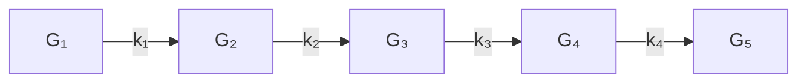

# 12.5.8 Tensor Networks, Tensor Trains, and the Curse

In many applications, tensor decompositions and their approximations are used to discover things about a high-dimensional data set. In other settings, they are used to address the curse of dimensionality, i.e., the challenges associated with a computation that requires $O ( n ^ { d } )$ work or storage. Whereas “big $n ^ { \ast }$ is problematic in matrix computations, “big $d ^ { \ast }$ is typically the hallmark of a difficult large-scale tensor computation. For example, it is (currently) impossible to store explicitly an $n _ { 1 } \times \cdots \times n _ { 1 0 0 0 }$ tensor if $n _ { 1 } = \cdot \cdot \cdot = n _ { 1 0 0 0 } = 2$ . In general, a solution framework for an order-d tensor problem suffers from the curse of dimensionality if the associated work and storage are exponential in d.

It is in this context that data-sparse tensor approximation is increasingly important. One way to build a high-order, data-sparse tensor is by connecting a set of low-order tensors with a relatively small set of contractions. This is the notion of a tensor network. In a tensor network, the nodes are low-order tensors and the edges are contractions. A special case that communicates the main idea is the tensor train $( T T )$ representation, which we proceed to illustrate with an order-5 example. Given the low-order tensor “carriages”

$$
\begin{array}{l} \mathcal {G} _ {1} \colon \quad n _ {1} \times r _ {1}, \\ \mathcal {G} _ {2} \colon \quad r _ {1} \times n _ {2} \times r _ {2}, \\ \mathcal {G} _ {3} \colon \quad r _ {2} \times n _ {3} \times r _ {3}, \\ \mathcal {G} _ {4} \colon \quad r _ {3} \times n _ {4} \times r _ {4}, \\ \mathcal {G} _ {5} \colon r _ {4} \times n _ {5}, \\ \end{array}
$$

we define the order-5 tensor train $\tau$ by

$$
\mathcal {T} (\mathbf {i}) = \sum_ {\mathbf {k} = 1} ^ {\mathbf {r}} \mathcal {G} _ {1} (i _ {1}, k _ {1}) \mathcal {G} _ {2} (k _ {1}, i _ {2}, k _ {2}) \mathcal {G} _ {3} (k _ {2}, i _ {3}, k _ {3}) \mathcal {G} _ {4} (k _ {3}, i _ {4}, k _ {4}) \mathcal {G} _ {5} (k _ {4}, i _ {5}). \tag {12.5.25}
$$

The pattern is obvious from the example. The first and last carriages are matrices and all those in between are order-3 tensors. Adjacent carriages are connected by a single contraction. See Figure 12.5.1.

flowchart

Figure 12.5.1. The Order-5 tensor train (12.5.25)

To appreciate the data-sparsity of an order-d tensor train $\mathcal { T } \in \mathbb { R } ^ { n _ { 1 } \times \cdots \times n _ { d } }$ that is represented through its carriages, assume that $n _ { 1 } = \cdot \cdot \cdot = n _ { d } = n$ and $r _ { 1 } = \cdots =$ $r _ { d - 1 } = r \ll n$ . It follows that the T T -representation requires $O ( d r ^ { 2 } n )$ memory locations, which is much less than the $n ^ { d }$ storage required by the explicit representation.

We present a framework for approximating a given tensor with a data-sparse tensor train. The first order of business is to show that any tensor $\mathcal { A }$ as a $T T$ representation. This can be verified by induction. For insight into the proof we consider an order-5 example. Suppose $\mathcal { A } \in \mathbb { R } ^ { n _ { 1 } \times \cdots \times n _ { 5 } }$ is the result of a contraction between a tensor

$$
\mathcal {B} (i _ {1}, i _ {2}, k _ {2}) = \sum_ {k _ {1} = 1} ^ {r _ {1}} \mathcal {G} _ {1} (i _ {1}, k _ {1}) \mathcal {G} _ {2} (k _ {1}, i _ {2}, k _ {2})
$$

and a tensor C as follows

$$
\mathcal {A} (i _ {1}, i _ {2}, i _ {3}, i _ {4}, i _ {5}) = \sum_ {k _ {2} = 1} ^ {r _ {2}} \mathcal {B} (i _ {1}, i _ {2}, k _ {2}) \mathcal {C} (k _ {2}, i _ {3}, i _ {4}, i _ {5}).
$$

If we can express C as a contraction of the form

$$
\mathcal {C} (k _ {2}, i _ {3}, i _ {4}, i _ {5}) = \sum_ {k _ {3} = 1} ^ {r _ {3}} \mathcal {G} _ {3} (k _ {2}, i _ {3}, k _ {3}) \tilde {\mathcal {C}} (k _ {3}, i _ {4}, i _ {5}), \tag {12.5.26}
$$

then

$$
\begin{array}{l} \mathcal {A} (i _ {1}, i _ {2}, i _ {3}, i _ {4}, i _ {5}) = \sum_ {k _ {2} = 1} ^ {r _ {2}} \sum_ {k _ {3} = 1} ^ {r _ {3}} \mathcal {B} (i _ {1}, i _ {2}, k _ {2}) \mathcal {G} _ {3} (k _ {2}, i _ {3}, k _ {3}) \tilde {\mathcal {C}} (k _ {3}, i _ {4}, i _ {5}) \\ = \sum_ {k _ {3} = 1} ^ {r _ {3}} \left(\sum_ {k _ {2} = 1} ^ {r _ {2}} \mathcal {B} (i _ {1}, i _ {2}, k _ {2}) \mathcal {G} _ {3} (k _ {2}, i _ {3}, k _ {3})\right) \tilde {\mathcal {C}} (k _ {3}, i _ {4}, i _ {5}) \\ = \sum_ {k _ {3} = 1} ^ {r _ {3}} \tilde {\mathcal {B}} (i _ {1}, i _ {2}, i _ {3}, k _ {3}) \tilde {\mathcal {C}} (k _ {3}, i _ {4}, i _ {5}) \\ \end{array}
$$

where

$$
\tilde {\mathcal {B}} (i _ {1}, i _ {2}, i _ {3}, k _ {3}) = \sum_ {k _ {1} = 1} ^ {r _ {1}} \sum_ {k _ {2} = 1} ^ {r _ {2}} \mathcal {G} _ {1} (i _ {1}, k _ {1}) \mathcal {G} _ {2} (k _ {1}, i _ {2}, k _ {2}) \mathcal {G} _ {3} (k _ {2}, i _ {3}, k _ {3}).
$$

The transition from writing A as a contraction of B and C to a contraction of $\tilde { B }$ and $\tilde { \mathcal { C } }$ shows by example how to organize a formal proof that any tensor has a $T T -$ representation. The only remaining issue concerns the “factorization” (12.5.26). It turns out that the tensors $\mathcal { G } _ { 3 }$ and $\tilde { \mathcal { C } }$ can be determined by computing the SVD of the unfolding

$$
C = \mathcal {C} _ {[ 1 2 ] \times [ 3 4 ]}.
$$

Indeed, if rank $( C ) = r _ { 3 }$ and $C = U _ { 3 } \Sigma _ { 3 } V _ { 3 } ^ { T }$ is the SVD with $\Sigma _ { 3 } \in \mathbb { R } ^ { r _ { 3 } \times r _ { 3 } }$ , then it can be shown that (12.5.26) holds if we define $\mathcal { G } _ { 3 } \in \mathbb { R } ^ { r _ { 2 } \times n _ { 3 } \times r _ { 3 } }$ and $\tilde { \mathcal { C } } \in \mathbb { R } ^ { r _ { 3 } \times n _ { 4 } \times n _ { 5 } }$ by

$$
\operatorname{vec} (\mathcal {G} _ {3}) = \operatorname{vec} (U _ {3}), \tag {12.5.27}
$$

$$
\operatorname{vec} (\tilde {\mathcal {C}}) = \operatorname{vec} \left(\Sigma_ {3} V _ {3} ^ {T}\right). \tag {12.5.28}
$$

By extrapolating from this d = 5 discussion we obtain the following procedure due to Oseledets and Tyrtyshnikov (2009) that computes the tensor train representation

$$
\mathcal {A} (\mathbf {i}) = \sum_ {\mathbf {k} (1: d - 1)} ^ {\mathbf {r} (1: d - 1)} \mathcal {G} _ {1} (i _ {1}, k _ {1}) \mathcal {G} _ {2} (k _ {1}, i _ {2}, k _ {2}) \dots \mathcal {G} _ {d - 1} (k _ {d - 2}, i _ {d - 1}, k _ {d - 1}) \mathcal {G} _ {d} (k _ {d - 1}, i _ {d})
$$

for any given A ∈ IRn1×···×nd: $\mathcal { A } \in \mathbb { R } ^ { n _ { 1 } \times \cdots \times n _ { d } } ;$

$$
M _ {1} = \mathcal {A} _ {(1)}
$$

SVD: $M _ { 1 } = U _ { 1 } \Sigma _ { 1 } V _ { 1 } ^ { T }$ where $\boldsymbol { \Sigma } _ { 1 } \in \mathbb { R } ^ { r _ { 1 } \times r _ { 1 } }$ and $r _ { 1 } = \mathsf { r a n k } ( M _ { 1 } )$

for k = 2:d − 1

$$
M _ {k} = \text { reshape } \left(\Sigma_ {k - 1} V _ {k - 1} ^ {T}, r _ {k - 1} n _ {k}, n _ {k + 1} \dots n _ {d}\right) \tag {12.5.29}
$$

SVD: $M _ { k } = U _ { k } \Sigma _ { k } V _ { k } ^ { T }$ where $\Sigma _ { k } \in \mathbb { R } ^ { r _ { k } \times r _ { k } }$ and $r _ { k } = { \mathsf { r a n k } } ( M _ { k } )$

Define $\mathcal { G } _ { k } \in \mathbb { R } ^ { r _ { k - 1 } \times n _ { k } \times r _ { k } }$ by vec $( { \mathcal G } _ { k } ) = { \mathsf { v e c } } ( U _ { k } )$

end

$$
\mathcal {G} _ {d} = \Sigma_ {d - 1} V _ {d - 1} ^ {T}
$$

Like the HOSVD, it involves a sequence of SVDs performed on unfoldings.

In its current form, (12.5.29) does not in general produce a data-sparse representation. For example, if $d = 5 , n _ { 1 } = \cdot \cdot \cdot = n _ { 5 } = n$ , and $M _ { 1 } , \dots , M _ { 4 }$ have full rank, then $r _ { 1 } = n , r _ { 2 } = n ^ { 2 } , r _ { 3 } = n ^ { 2 }$ , and $r _ { 4 } = n$ . In this case the T T -representation requires the same $O ( n ^ { 5 } )$ storage as the explicit representation.

To realize a data-sparse, tensor train approximation, the matrices $U _ { k }$ and $\Sigma _ { k } V _ { k } ^ { T }$ are replaced with “thinner” counterparts that are intelligently chosen and cheap to compute. As a result, the $r _ { k } \mathrm { { ' s } }$ are replaced by (significantly smaller) $\tilde { r } _ { k } \mathrm { { ' s } }$ . The approximating tensor train involves fewer than $d ( n _ { 1 } + \cdot \cdot \cdot + n _ { d } ) \cdot ( \operatorname* { m a x } \tilde { r } _ { k } )$ numbers. This kind of approximation overcomes the curse of dimensionality assuming that max $\tilde { r } _ { k }$ does not depend on the modal dimensions. See Oseledets and Tyrtyshnikov (2009) for computational details, successful applications, and discussion about the low-rank approximations of $M _ { 1 } , \dots , M _ { d - 1 }$ .

# Problems

P12.5.1 Suppose $a \in \mathbb { R } ^ { n _ { 1 } n _ { 2 } n _ { 3 } }$ . Show how to compute $f \in \mathbb { R } ^ { n _ { 1 } }$ and $g \in \mathbb { R } ^ { n _ { 2 } }$ so that $\parallel a - h \otimes g \otimes f \parallel _ { 2 }$ is minimized where $\boldsymbol { h } \in \mathbb { R } ^ { n _ { 3 } }$ is given. Hint: This is an SVD problem.

P12.5.2 Given $\mathcal { A } \in \mathbb { R } ^ { n _ { 1 } \times n _ { 2 } \times n _ { 3 } }$ with positive entries, show how to determine $B = f \circ g \circ h \in \mathbb { R } ^ { n _ { 1 } \times n _ { 2 } \times n _ { 3 } }$ so that the following function is minimized:

$$
\phi (f, g, h) = \sum_ {\mathbf {i} = \mathbf {1}} ^ {\mathbf {n}} | \log (\mathcal {A} (\mathbf {i})) - \log (\mathcal {B} (\mathbf {i})) | ^ {2}.
$$

P12.5.3 Show that the rank of any unfolding of a tensor A is never larger than rank(A).

P12.5.4 Formulate an HOQRP factorization for a tensor $\mathcal { A } \in \mathbb { R } ^ { n _ { 1 } \times \cdots \times n _ { d } }$ that is based on the QRwith-column-pivoting (QRP) factorizations $\mathcal { A } _ { ( k ) } P _ { k } \ = \ Q _ { k } R _ { k }$ for $k = 1 { : } d$ . Does the core tensor have any special properties?

P12.5.5 Prove (12.5.11).

P12.5.6 Show that (12.5.14) and (12.5.15) are equivalent to minimizing $\| \mathsf { v e c } ( \mathcal { X } ) \ : = \ : ( H \odot G \odot F ) \lambda \| _ { 2 }$

P12.5.7 Justify the flop count that is given for the Cholesky solution of the linear system (12.5.20).

P12.5.8 How many distinct values can there be in a symmetric 3-by-3-by-3 tensor?

P12.5.9 Suppose $\mathcal { A } \in \mathbb { R } ^ { N \times N \times N \times N }$ has the property that

$$
\mathcal {A} (i _ {1}, i _ {2}, i _ {3}, i _ {4}) = \mathcal {A} (i _ {2}, i _ {1}, i _ {3}, i _ {4}) = \mathcal {A} (i _ {1}, i _ {2}, i _ {4}, i _ {3}) = \mathcal {A} (i _ {3}, i _ {4}, i _ {1}, i _ {2}).
$$

Note that $\mathcal { A } _ { [ 1 3 ] \times [ 2 4 ] } = ( A _ { i j } )$ is an N-by-N block matrix with N-by-N blocks. Show that $A _ { i j } = A _ { j i }$ and $A _ { i j } ^ { T } = A _ { i j }$ .

P12.5.10 Develop an order-d version of the iterations presented in §12.5.6. How many flops per iteration are required?

P12.5.11 Show that if $\mathcal { G } _ { 3 }$ and C˜ are defined by (12.5.27) and (12.5.28), then (12.5.26) holds.

# Notes and References for §12.5

For an in-depth survey of all the major tensor decompositions that are used in multiway analysis together with many pointers to the literature, see:

T.G. Kolda and B.W. Bader (2009). “Tensor Decompositions and Applications,” SIAM Review 51, 455–500.

Other articles that give perspective on the field of tensor computations include:

L. De Lathauwer and B. De Moor (1998). “From Matrix to Tensor: Multilinear Algebra and Signal Processing,” in Mathematics in Signal Processing IV, J. McWhirter and I. Proudler (eds.), Clarendon Press, Oxford, 1–15.   
P. Comon (2001). “Tensor Decompositions: State of the Art and Applications,” in Mathematics in Signal Processing V, J. G. McWhirter and I. K. Proudler (eds), Clarendon Press, Oxford, 1–24.   
R. Bro (2006). “Review on Multiway Analysis in Chemistry 2000–2005,” Crit. Rev. Analy. Chem. 36, 279–293.   
P. Comon, X. Luciani, A.L.F. de Almeida (2009). “Tensor Decompositions, Alternating Least Squares and Other Tales,” J. Chemometrics 23, 393-405.

The following two monographs cover both the CP and Tucker models and show how they fit into the larger picture of multiway analysis:

A. Smilde, R. Bro, and P. Geladi (2004). Multi-Way Analysis: Applications in the Chemical Sciences, Wiley, Chichester, England.   
P.M. Kroonenberg (2008). Applied Multiway Data Analysis, Wiley, Hoboken, NJ.

There are several Matlab toolboxes that are useful for tensor decomposition work, see:

C.A. Anderson and R. Bro (2000). “The N-Way Toolbox for MATLAB,” Chemometrics Intelligent Lab. Syst. 52, 1–4.

B.W. Bader and T.G. Kolda (2006). “Algorithm 862: MATLAB Tensor Classes for Fast Algorithm Prototyping,” ACM Trans. Math. Softw. 32, 635–653.

B.W. Bader and T.G. Kolda (2007). “Efficient MATLAB Computations with Sparse and Factored Tensors,” SIAM J. Sci. Comput. 30, 205–231.

Higher-order SVD-like ideas are presented in:

L.R. Tucker (1966). “Some Mathematical Notes on Three-Mode Factor Analysis,” Psychmetrika 31, 279–311.

A recasting of Tucker’s work in terms of the modern SVD viewpoint with many practical ramifications can be found in the foundational paper:   
L. De Lathauwer, B. De Moor and J. Vandewalle (2000). “A Multilinear Singular Value Decomposition,” SIAM J. Matrix Anal. Applic. 21, 1253–1278.   
A sampling of the CANDECOMP/PARAFAC/Tucker literature includes:   
R. Bro (1997). “PARAFAC: Tutorial and Applications,” Chemometrics Intelligent Lab. Syst. 38, 149–171.   
T.G. Kolda (2001). “Orthogonal Tensor Decompositions,” SIAM J. Matrix Anal. Applic. 23, 243– 255.   
G. Tomasi and R. Bro (2006). “A Comparison of Algorithms for Fitting the PARAFAC Model,” Comput. Stat. Data Analy. 50, 1700–1734.   
L. De Lathauwer (2006). “A Link between the Canonical Decomposition in Multilinear Algebra and Simultaneous Matrix Diagonalization,” SIAM J. Matrix Anal. Applic. 28, 642–666.   
I.V. Oseledets, D.V. Savostianov, and E.E. Tyrtyshnikov (2008). “Tucker Dimensionality Reduction of Three-Dimensional Arrays in Linear Time,” SIAM J. Matrix Anal. Applic. 30, 939–956.   
C.D. Martin and C. Van Loan (2008). “A Jacobi-Type Method for Computing Orthogonal Tensor Decompositions,” SIAM J. Matrix Anal. Applic. 29, 184–198.   
Papers concerned with the tensor rank issue include:   
T.G. Kolda (2003). “A Counterexample to the Possibility of an Extension of the Eckart-Young Low-Rank Approximation Theorem for the Orthogonal Rank Tensor Decomposition,” SIAM J. Matrix Anal. Applic. 24, 762–767.   
J.M. Landsberg (2005). “The Border Rank of the Multiplication of 2-by-2 Matrices is Seven,” J. AMS 19, 447–459.   
P. Comon, G.H. Golub, L-H. Lim, and B. Mourrain (2008). “Symmetric Tensors and Symmetric Tensor Rank,” SIAM J. Matrix Anal. Applic. 30, 1254–1279.   
V. de Silva and L.-H. Lim (2008). “Tensor rank and the Ill-Posedness of the Best Low-Rank Approximation Problem,” SIAM J. Matrix Anal. Applic. 30, 1084-1127.   
P. Comon, J.M.F. ten Berg, L. De Lathauwer, and J. Castaing (2008). “Generic Rank and Typical Ranks of Multiway Arrays,” Lin. Alg. Applic. 430, 2997–3007.   
L. Eldin and B. Savas (2011). “Perturbation Theory and Optimality Conditions for the Best Multilinear Rank Approximation of a Tensor,” SIAM. J. Matrix Anal. Applic. 32, 1422–1450.   
C.D. Martin (2011). “The Rank of a 2-by-2-by-2 Tensor,” Lin. Multil. Alg. 59, 943–950.   
A. Stegeman and P. Comon (2010). “Subtracting a Best Rank-1 Approximation May Increase Tensor Rank,” Lin. Alg. Applic. 433, 1276-1300.   
C.J. Hillar and L.-H. Lim (2012) “Most Tensor Problems Are NP-hard,” arXiv:0911.1393.   
The idea of defining tensor singular values and eigenvalues through generalized Rayleigh quotients is pursued in the following references:   
L.-H. Lim (2005) “Singular Values and Eigenvalues of Tensors: A Variational Approach,” Proceedings of the IEEE International Workshop on Computational Advances in Multi-Sensor Adaptive Processing, 129–132.   
L. Qi (2005). “Eigenvalues of a Real Supersymmetric Tensor,” J. Symbolic Comput. 40, 1302–1324.   
L. Qi (2006). “Rank and Eigenvalues of a Supersymmetric Tensor, the Multivariate Homogeneous Polynomial and the Algebraic Hypersurface it Defines,” J. Symbolic Comput. 41, 1309–1327.   
L. Qi (2007). Eigenvalues and Invariants of Tensors,” J. Math. Anal. Applic. 325, 1363–1377.   
D. Cartwright and B. Sturmfels (2010). “The Number of Eigenvalues of a Tensor”, arXiv:1004.4953v1.   
There are a range of rank-1 approximation tensor approximation problems and power methods to solve them, see:   
L. De Lathauwer, B. De Moor, and J. Vandewalle (2000). “On the Best Rank-1 and Rank-(r1,r2,...,rN) Approximation of Higher-Order Tensors,” SIAM J. Mat. Anal. Applic., 21, 1324–1342.   
E. Kofidis and P.A. Regalia (2000). “The Higher-Order Power Method Revisited: Convergence Proofs and Effective Initialization,” in Proceedings of the IEEE International Conference on Acoustics, Speech, and Signal Processing, Vol. 5, 2709–2712.   
T. Zhang and G. H. Golub (2001). “Rank-one Approximation to High order Tensors,” SIAM J. Mat. Anal. and Applic. 23, 534–550.

E. Kofidis and P. Regalia (2001). “Tensor Approximation and Signal Processing Applications,” in Structured Matrices in Mathematics, Computer Science, and Engineering I, V. Olshevsky (ed.), AMS, Providence, RI, 103–133.   
E. Kofidis and P.A. Regalia (2002). “On the Best Rank-1 Approximation of Higher-Order Super-Symmetric Tensors,” SIAM J. Matrix Anal. Applic. 23, 863-884.   
L. De Lathauwer and J. Vandewalle (2004). “Dimensionality Reduction in Higher-Order Signal Processing and Rank-(R1;R2;...;RN) Reduction in Multilinear Algebra,” Lin. Alg. Applic. 391, 31–55.   
S. Ragnarsson and C. Van Loan (2012). “Block Tensors and Symmetric Embedding,” arXiv:1010.0707v2.   
T.G. Kolda and J.R. Mayo (2011). “Shifted Power Method for Computing Tensor Eigenpairs,” SIAM J. Matrix Anal. Applic. 32, 1095–1124.

Various Newton-like methods have also emerged:

L. Eld´en and B. Savas (2009). “A Newton-Grassmann Method for Computing the Best Multi-linear Rank-(R1; R2; R3) Approximation of a Tensor,” SIAM J. Matrix Anal. Applic. 31, 248–271.   
B. Savas and L.-H. Lim (2010) “Quasi-Newton Methods on Grassmannians and Multilinear Approximations of Tensors,” SIAM J. Sci. Comput. 32, 3352–3393.   
M. Ishteva, L. De Lathauwer, P.-A. Absil, and S. Van Huffel (2009). “Differential-Geometric Newton Algorithm for the Best Rank-(R1, R2, R3) Approximation of Tensors”, Numer. Algorithms 51, 179–194.

Here is a sampling of other tensor decompositions that have recently been proposed:

L. Omberg, G. Golub, and O. Alter (2007). “A Tensor Higher-Order Singular Value Decomposition for Integrative Analysis of Dna Microarray Data from Different Studies,” Proc. Nat. Acad. Sci. 107, 18371-18376.

L. De Lathauwer (2008). “Decompositions of a Higher-Order Tensor in Block TermsPart II: Definitions and Uniqueness,” SIAM. J. Mat. Anal. Applic. 30, 1033–1066.

L. De Lathauwer and D. Nion (2008). “Decompositions of a Higher-Order Tensor in Block TermsPart III: Alternating Least Squares Algorithms,” SIAM. J. Mat. Anal. Applic. 30, 1067–1083.

M.E. Kilmer and C.D. Martin (2010). “Factorization Strategies for Third Order Tensors,” Lin. Alg. Applic. 435, 641–658.

E. Acar, D.M. Dunlavy, and T.G. Kolda (2011). “A Scalable Optimization Approach for Fitting Canonical Tensor Decompositions,” J. Chemometrics, 67–86.

E. Acar, D.M. Dunlavy, T.G. Kolda, and M. Mrup (2011). “Scalable Tensor Factorizations for Incomplete Data,” Chemomet. Intell. Lab. Syst. 106, 41–56.

C. Chi and T. G. Kolda (2012). “On Tensors, Sparsity, and Nonnegative Factorizations,” arXiv:1112.2414.

Various tools for managing high-dimensional tensors are discussed in:

S.R. White (1992). “Density Matrix Formulation for Quantum Renormalization Groups,” Phys. Rev. Lett. 69, 2863–2866.

W. Hackbusch and B.N. Khoromskij (2007). “Tensor-product Approximation to Operators and Functions in High Dimensions,” J. Complexity 23, 697–714.

I.V. Oseledets and E.E. Tyrtyshnikov (2008). “Breaking the Curse of Dimensionality, or How to Use SVD in Many Dimensions,” SIAM J. Sci. Comput. 31, 3744–3759.

W. Hackbusch and S. Kuhn (2009). “A New Scheme for the Tensor Representation,” J. Fourier Anal. Applic. 15, 706–722.

I.V. Oseledets, D.V. Savostyanov, and E.E. Tyrtyshnikov (2009). “Linear Algebra for Tensor Problems,” Computing 85, 169-188.

I. Oseledets and E. Tyrtyshnikov (2010). “TT-Cross Approximation for Multidimensional Arrays,” Lin. Alg. Applic. 432, 70–88.

L. Grasedyck (2010). “Hierarchical Singular Value Decomposition of Tensors,” SIAM J. Mat. Anal. Applic. 31, 2029–2054.

S. Holtz, T. Rohwedder, and R. Schneider (2012). “The Alternating Linear Scheme for Tensor Optimization in the Tensor Train Format,” SIAM J. Sci. Comput. 34, A683–A713.

For insight into the “curse of dimensionality,” see:

G. Beylkin and M.J. Mohlenkamp (2002). “Numerical Operator Calculus in Higher Dimensions,” Proc. Nat. Acad. Sci. 99(16), 10246–10251.

G. Beylkin and M.J. Mohlenkamp (2005). “Algorithms for Numerical Analysis in High Dimensions,” SIAM J. Sci. Comput. 26, 2133–2159.
